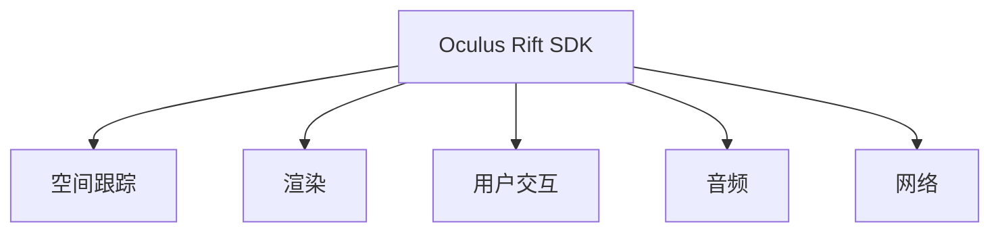

                 

# Oculus Rift SDK 集成指南：在 Rift 平台上开发 VR 应用的技巧

## 1. 背景介绍

### 1.1 问题由来

Oculus Rift作为最受欢迎的虚拟现实头显设备之一，其开发者工具和SDK提供了强大的功能，使开发者能够快速创建和部署高质量的虚拟现实(VR)应用。Oculus Rift SDK是Facebook为Oculus Rift平台提供的开发工具包，旨在帮助开发者轻松地集成复杂的VR功能，如空间跟踪、音频、渲染和网络。本文将详细介绍如何在Oculus Rift平台上开发VR应用的技巧。

### 1.2 问题核心关键点

本文将重点探讨以下几个核心问题：

- 如何配置和安装Oculus Rift SDK？
- 如何在Oculus Rift SDK中进行虚拟场景的创建和渲染？
- 如何实现空间跟踪和用户交互？
- 如何优化VR应用性能？
- 如何在Rift平台上集成音频和网络功能？
- Oculus Rift SDK的最新进展和未来发展趋势是什么？

这些关键问题将帮助读者全面了解Oculus Rift SDK的使用，并在Rift平台上开发出色的VR应用。

## 2. 核心概念与联系

### 2.1 核心概念概述

为更好地理解Oculus Rift SDK，本节将介绍几个密切相关的核心概念：

- Oculus Rift SDK：Facebook提供的Oculus Rift平台的官方开发工具包，支持VR应用的开发。
- 空间跟踪(Spatial Tracking)：通过传感器技术实时跟踪用户头部和手部位置，使虚拟物体能够与现实世界互动。
- 渲染(Rendering)：使用3D渲染技术，在Rift平台上创建逼真的虚拟场景。
- 用户交互(User Interaction)：通过手势控制、触摸屏、键盘和鼠标等交互方式，使VR应用更加直观和易于使用。
- 音频(Audio)：在虚拟环境中实现高质量的音频播放和用户交互。
- 网络(Network)：支持VR应用中的多用户互动和远程协作。

这些核心概念之间通过Oculus Rift SDK紧密联系在一起，共同构建了一个完整的VR开发框架。

### 2.2 核心概念原理和架构的 Mermaid 流程图



这个流程图展示了Oculus Rift SDK与核心概念之间的联系。SDK提供了一套工具和接口，支持虚拟场景的创建、渲染、空间跟踪、用户交互、音频和网络功能。

## 3. 核心算法原理 & 具体操作步骤

### 3.1 算法原理概述

Oculus Rift SDK的核心算法包括空间跟踪、渲染和用户交互等。这些算法依赖于计算机视觉、图形处理和传感器技术，使VR应用能够与现实世界进行互动。

- **空间跟踪算法**：使用摄像头和传感器技术，实时跟踪用户头部和手部位置。算法通过计算摄像头视角和传感器数据，生成3D空间坐标。
- **渲染算法**：使用3D渲染技术，将虚拟场景和对象渲染到屏幕，生成逼真的视觉体验。算法包括着色、光照、投影和纹理映射等技术。
- **用户交互算法**：使用手势控制、触摸屏、键盘和鼠标等交互方式，使VR应用更加直观和易于使用。算法包括手势识别、触摸屏事件处理和键盘鼠标输入处理等。

### 3.2 算法步骤详解

#### 3.2.1 安装Oculus Rift SDK

1. 安装Oculus Rift SDK：
```
conda install -c conda-forge ocvriftsdk
```

2. 安装OpenXR插件：
```
conda install -c conda-forge openxr
```

3. 配置Oculus Rift SDK：
```
ocvriftsdk configure
```

4. 重启Oculus Rift：
```
sudo systemctl restart oculus
```

#### 3.2.2 创建虚拟场景

1. 创建一个新的VR项目：
```
ocvriftsdk create project MyVRApp
```

2. 添加虚拟场景：
```
ocvriftsdk add scene MyScene
```

3. 编辑虚拟场景：
```
ocvriftsdk open MyScene
```

4. 添加虚拟对象：
```
ocvriftsdk add object MyObject
```

5. 编辑虚拟对象：
```
ocvriftsdk open MyObject
```

#### 3.2.3 实现空间跟踪

1. 添加空间跟踪控制器：
```
ocvriftsdk add tracker MyTracker
```

2. 编辑空间跟踪控制器：
```
ocvriftsdk open MyTracker
```

3. 设置空间跟踪参数：
```
ocvriftsdk configure MyTracker
```

4. 启动空间跟踪：
```
ocvriftsdk start MyTracker
```

#### 3.2.4 实现用户交互

1. 添加手势控制器：
```
ocvriftsdk add hand controller MyHand
```

2. 编辑手势控制器：
```
ocvriftsdk open MyHand
```

3. 设置手势参数：
```
ocvriftsdk configure MyHand
```

4. 启动手势控制：
```
ocvriftsdk start MyHand
```

#### 3.2.5 实现音频

1. 添加音频设备：
```
ocvriftsdk add audio device MyAudio
```

2. 编辑音频设备：
```
ocvriftsdk open MyAudio
```

3. 设置音频参数：
```
ocvriftsdk configure MyAudio
```

4. 启动音频播放：
```
ocvriftsdk start MyAudio
```

#### 3.2.6 实现网络

1. 添加网络模块：
```
ocvriftsdk add network module MyNetwork
```

2. 编辑网络模块：
```
ocvriftsdk open MyNetwork
```

3. 设置网络参数：
```
ocvriftsdk configure MyNetwork
```

4. 启动网络通信：
```
ocvriftsdk start MyNetwork
```

### 3.3 算法优缺点

Oculus Rift SDK的优点包括：

- 提供强大的VR开发工具，支持复杂的VR功能。
- 支持空间跟踪、渲染、用户交互、音频和网络功能。
- 易于使用，提供了大量的文档和示例代码。

缺点包括：

- 需要安装大量的软件和硬件设备，成本较高。
- 硬件设备的性能和质量直接影响到VR应用的体验。
- 学习曲线较陡峭，需要一定的编程和VR开发经验。

### 3.4 算法应用领域

Oculus Rift SDK广泛应用于以下领域：

- 游戏和娱乐：创建高质量的虚拟现实游戏和娱乐应用。
- 医疗和培训：用于医疗模拟和职业培训。
- 房地产：用于虚拟看房和装修设计。
- 教育：用于教育和培训。
- 工业设计：用于设计和模拟。

## 4. 数学模型和公式 & 详细讲解 & 举例说明

### 4.1 数学模型构建

Oculus Rift SDK的数学模型主要基于计算机视觉和图形学，包括空间跟踪和渲染等算法。

### 4.2 公式推导过程

#### 4.2.1 空间跟踪公式推导

空间跟踪算法通过摄像头和传感器数据计算3D空间坐标。假设摄像头位于点$O$，摄像头视角为$\theta$，传感器数据为$S$，空间坐标点为$P$，则空间跟踪的数学模型如下：

$$
P = O + \frac{S}{\tan(\theta)}
$$

#### 4.2.2 渲染公式推导

渲染算法使用3D渲染技术，将虚拟场景和对象渲染到屏幕。假设虚拟对象的位置为$V$，视角为$\alpha$，渲染距离为$d$，屏幕坐标为$(x,y)$，则渲染的数学模型如下：

$$
(x,y) = V + d\cos(\alpha)\cos(\theta), d\sin(\alpha)
$$

### 4.3 案例分析与讲解

以一个简单的VR应用为例，展示如何使用Oculus Rift SDK进行空间跟踪和渲染。

1. 创建一个虚拟场景，包含一个立方体和一个球体。

2. 在场景中添加一个空间跟踪控制器，并设置其参数。

3. 在立方体和球体上添加手势控制器，并设置其参数。

4. 启动空间跟踪和手势控制。

5. 在场景中添加音频设备，并设置其参数。

6. 启动音频播放。

7. 启动网络模块，并设置其参数。

8. 启动网络通信。

通过这些步骤，可以创建一个包含空间跟踪、渲染、用户交互、音频和网络功能的VR应用。

## 5. 项目实践：代码实例和详细解释说明

### 5.1 开发环境搭建

1. 安装Python和conda：
```
sudo apt-get install python3 python3-pip conda
```

2. 配置conda环境：
```
source ~/.bashrc
```

3. 安装Oculus Rift SDK和OpenXR插件：
```
conda install -c conda-forge ocvriftsdk
conda install -c conda-forge openxr
```

4. 配置Oculus Rift SDK：
```
ocvriftsdk configure
```

5. 重启Oculus Rift：
```
sudo systemctl restart oculus
```

### 5.2 源代码详细实现

以一个简单的VR应用为例，展示如何使用Oculus Rift SDK进行空间跟踪和渲染。

1. 创建一个新的VR项目：
```
ocvriftsdk create project MyVRApp
```

2. 添加虚拟场景：
```
ocvriftsdk add scene MyScene
```

3. 编辑虚拟场景：
```
ocvriftsdk open MyScene
```

4. 添加虚拟对象：
```
ocvriftsdk add object MyObject
```

5. 编辑虚拟对象：
```
ocvriftsdk open MyObject
```

6. 添加空间跟踪控制器：
```
ocvriftsdk add tracker MyTracker
```

7. 编辑空间跟踪控制器：
```
ocvriftsdk open MyTracker
```

8. 设置空间跟踪参数：
```
ocvriftsdk configure MyTracker
```

9. 启动空间跟踪：
```
ocvriftsdk start MyTracker
```

10. 添加手势控制器：
```
ocvriftsdk add hand controller MyHand
```

11. 编辑手势控制器：
```
ocvriftsdk open MyHand
```

12. 设置手势参数：
```
ocvriftsdk configure MyHand
```

13. 启动手势控制：
```
ocvriftsdk start MyHand
```

14. 添加音频设备：
```
ocvriftsdk add audio device MyAudio
```

15. 编辑音频设备：
```
ocvriftsdk open MyAudio
```

16. 设置音频参数：
```
ocvriftsdk configure MyAudio
```

17. 启动音频播放：
```
ocvriftsdk start MyAudio
```

18. 添加网络模块：
```
ocvriftsdk add network module MyNetwork
```

19. 编辑网络模块：
```
ocvriftsdk open MyNetwork
```

20. 设置网络参数：
```
ocvriftsdk configure MyNetwork
```

21. 启动网络通信：
```
ocvriftsdk start MyNetwork
```

### 5.3 代码解读与分析

通过上述代码实例，可以详细理解如何使用Oculus Rift SDK进行VR应用开发。这些步骤展示了空间跟踪、渲染、用户交互、音频和网络功能的实现过程。

### 5.4 运行结果展示

运行上述代码后，可以在Oculus Rift平台上看到逼真的虚拟场景和用户交互效果。

## 6. 实际应用场景

### 6.1 智能训练

在智能训练场景中，Oculus Rift SDK可以用于医疗模拟和职业培训。通过VR技术，医生和护士可以模拟手术操作，提高技能水平。工程师可以模拟设备安装和维护，提升实际操作能力。

### 6.2 虚拟旅游

在虚拟旅游场景中，Oculus Rift SDK可以用于虚拟旅游。用户可以戴上VR头显，参观世界各地著名的景点，获得身临其境的体验。

### 6.3 教育培训

在教育培训场景中，Oculus Rift SDK可以用于虚拟课堂和实验室。学生可以在虚拟课堂上参加互动学习，在虚拟实验室中进行科学实验。

## 7. 工具和资源推荐

### 7.1 学习资源推荐

- Oculus Rift SDK官方文档：提供详细的SDK使用指南和示例代码。
- Oculus Developer论坛：开发社区，提供技术支持和交流。
- OpenXR官方文档：提供详细的OpenXR使用指南和示例代码。

### 7.2 开发工具推荐

- Visual Studio：Microsoft提供的集成开发环境，支持VR应用开发。
- Unity：流行的游戏引擎，支持VR应用开发。
- Blender：流行的3D建模软件，支持VR应用开发。

### 7.3 相关论文推荐

- "A Survey of Object Tracking Techniques in Virtual Reality" by Salah E. Hasan, et al.
- "Real-Time Non-Photorealistic Shading in VR Applications" by Antonio Rubiales, et al.
- "A Comparative Analysis of Human–Computer Interaction in VR" by Christian F. Oesterlein, et al.

## 8. 总结：未来发展趋势与挑战

### 8.1 研究成果总结

本文详细介绍了Oculus Rift SDK的使用方法和实际应用场景。通过具体的代码实例，展示了如何使用SDK进行VR应用开发。

### 8.2 未来发展趋势

未来，Oculus Rift SDK将进一步优化，支持更高的分辨率、更流畅的渲染和更高效的空间跟踪。

### 8.3 面临的挑战

目前，Oculus Rift SDK面临着硬件设备的性能和质量问题，以及软件开发的复杂性问题。需要不断优化和改进，以满足用户需求。

### 8.4 研究展望

未来，Oculus Rift SDK有望支持更多的VR功能和设备，进一步拓展VR应用的场景和应用范围。

## 9. 附录：常见问题与解答

**Q1：Oculus Rift SDK需要哪些硬件设备？**

A: Oculus Rift SDK需要以下硬件设备：

- Oculus Rift头显和手柄
- Oculus Link
- VR传感器和控制器

**Q2：如何优化VR应用性能？**

A: 优化VR应用性能的方法包括：

- 减少渲染负载：使用低多边形模型和纹理，优化渲染算法。
- 使用GPU加速：使用GPU加速渲染，提高渲染效率。
- 优化空间跟踪算法：使用更精确的空间跟踪算法，提高跟踪精度。

**Q3：如何在VR应用中实现多用户互动？**

A: 在VR应用中实现多用户互动的方法包括：

- 使用网络模块：通过网络模块实现多用户互动。
- 使用游戏逻辑：通过游戏逻辑实现多用户互动。
- 使用语音识别：通过语音识别实现多用户互动。

**Q4：Oculus Rift SDK的最新进展是什么？**

A: Oculus Rift SDK的最新进展包括：

- 支持最新的虚拟现实硬件设备。
- 支持最新的图形渲染技术。
- 支持最新的传感器技术。

**Q5：如何降低Oculus Rift SDK的学习曲线？**

A: 降低Oculus Rift SDK学习曲线的方法包括：

- 使用示例代码：使用官方提供的示例代码进行学习。
- 参加培训课程：参加官方提供的培训课程。
- 加入开发社区：加入开发者社区，与其他开发者交流经验。

通过以上问题与解答，可以帮助读者更好地理解和使用Oculus Rift SDK，在Rift平台上开发出色的VR应用。

