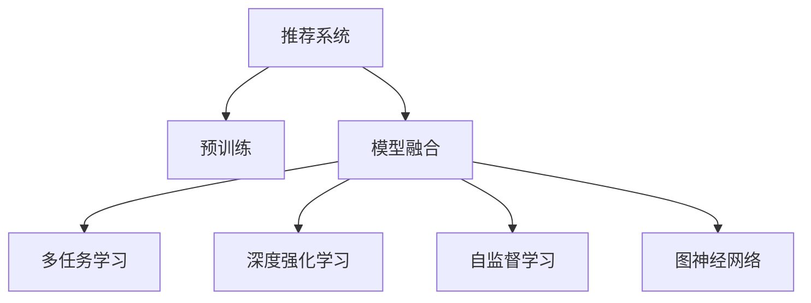

                 

# P5:统一的推荐系统预训练框架

> 关键词：推荐系统, 预训练, 模型融合, 多任务学习, 深度强化学习, 自监督学习, 图神经网络

## 1. 背景介绍

在现代社会，信息爆炸和个性化需求驱动了推荐系统的广泛应用。无论是电商平台、社交平台还是内容平台，都在利用推荐系统提升用户体验，驱动收入增长。然而，推荐系统面临的挑战也越来越多：数据量爆炸增长，用户行为复杂多变，冷启动问题频发，系统实时性和稳定性需求日益增加。

推荐系统可以分为内容推荐和协同过滤两大类。前者主要基于用户和物品的特征进行推荐，如基于内容的推荐、协同过滤的推荐、知识图谱推荐等。而后者则主要基于用户和物品之间的交互关系进行推荐，如基于矩阵分解的推荐、基于序列的推荐、基于深度学习的推荐等。随着深度学习的发展，特别是神经网络在图像、文本等领域的成功应用，基于神经网络的推荐系统逐渐成为主流。

然而，现有的推荐系统存在数据和计算资源消耗巨大、推荐效果泛化能力差、推荐结果缺乏可解释性等问题。为解决这些问题，研究者们提出了预训练框架和跨任务学习的思路，构建统一的推荐系统预训练框架，以实现更高质量的推荐服务。

## 2. 核心概念与联系

### 2.1 核心概念概述

为更好地理解统一的推荐系统预训练框架，本节将介绍几个密切相关的核心概念：

- 推荐系统(Recommendation System)：旨在为用户提供个性化信息推荐的应用系统。包括内容推荐、协同过滤、混合推荐等。
- 预训练(Pre-training)：指在大规模无标签数据上，通过自监督学习任务训练通用语言模型的过程。预训练使得模型学习到通用的语言知识，如语义、句法、上下文等，从而提升后续下游任务的效果。
- 模型融合(Model Fusion)：指将多个不同模型进行有机结合，构建统一的推荐系统预训练框架，提高推荐的泛化能力和实时性。
- 多任务学习(Multi-task Learning)：指在同一个训练过程中，同时优化多个相关任务的损失函数，以实现知识共享和任务迁移。
- 深度强化学习(Deep Reinforcement Learning)：一种利用深度神经网络进行决策优化的学习方法，适用于复杂环境的推荐系统。
- 自监督学习(Self-supervised Learning)：指在无标签数据上训练模型，以学习数据的内在规律和表示能力。
- 图神经网络(Graph Neural Networks)：一种适用于图结构数据的深度学习模型，在社交网络、知识图谱等推荐系统中广泛应用。

这些核心概念之间的逻辑关系可以通过以下Mermaid流程图来展示：



这个流程图展示了这个统一推荐系统预训练框架的核心概念及其之间的关系：

1. 推荐系统通过预训练、模型融合等技术，逐步构建起一个具备强大推荐能力的系统。
2. 预训练通过自监督学习和多任务学习，提升模型对数据的内在理解和泛化能力。
3. 模型融合将多模态数据和不同种类的推荐模型进行组合，构建出更全面、更高效的推荐模型。
4. 深度强化学习和图神经网络，分别从不同角度提升推荐系统的实时性和预测准确度。

## 3. 核心算法原理 & 具体操作步骤
### 3.1 算法原理概述

统一的推荐系统预训练框架，旨在通过预训练技术和多任务学习，提升推荐模型的泛化能力和实时性，从而实现更精准、高效、稳定的推荐服务。其核心思想是：将推荐系统视为一个多任务学习过程，利用大规模无标签数据进行预训练，从而构建出具备广泛迁移能力的通用表示。

具体而言，该框架分为以下几个步骤：

1. 数据准备：收集大规模无标签数据和少量标注数据，用于预训练和微调。
2. 预训练：利用自监督学习任务，如掩码语言模型、预测上下文等，在无标签数据上训练出通用的语言表示。
3. 多任务学习：将推荐任务分解为多个子任务，同时在预训练的基础上进行多任务学习，以实现知识共享和任务迁移。
4. 模型融合：将不同模态的数据（如文本、图像、音频等）进行融合，使用多个推荐模型进行集成，构建出更全面、更高效的推荐系统。
5. 微调：对预训练模型进行微调，以适配具体的推荐任务和用户行为。
6. 实时推荐：将预训练和微调后的模型部署到实时推荐系统中，实现高效、稳定的推荐服务。

### 3.2 算法步骤详解

统一的推荐系统预训练框架的具体实现步骤如下：

**Step 1: 数据准备**

- 收集大规模无标签数据：可以从公开数据集获取，如Amazon、Youtube等，也可以从企业的业务数据中获取。数据应尽可能多样化，包括不同种类的物品、用户行为等。
- 准备少量标注数据：从真实业务中抽取少量用户-物品交互数据，作为微调时机的监督信号。这些数据应尽量覆盖不同的用户和物品。

**Step 2: 预训练**

- 选择预训练模型：可以使用已有的语言模型（如BERT、GPT等），也可以自行设计模型架构。常见的预训练任务包括掩码语言模型、预测上下文、语言模型等。
- 进行预训练：在无标签数据上，使用自监督学习任务训练模型，更新模型参数。训练时可以设置合适的学习率和迭代轮数，以获得较好的初始化表示。
- 进行多任务学习：将推荐任务分解为多个子任务，例如文本推荐、图像推荐、协同过滤推荐等，同时在预训练的基础上进行多任务学习。不同任务的损失函数可以按比例组合，优化模型在各个子任务上的性能。

**Step 3: 模型融合**

- 融合不同模态数据：将文本、图像、音频等不同模态的数据进行融合，构建出多模态推荐模型。例如，可以使用多模态特征提取器将不同模态的特征进行融合。
- 使用多个推荐模型进行集成：将基于不同模型架构的推荐模型进行集成，如基于内容推荐的模型、基于协同过滤的模型等。每种模型的输出可以进行加权平均，以获得更稳定的推荐结果。
- 选择合适的融合方式：可以选择不同的融合方式，如简单平均、加权平均、元学习等。应根据具体应用场景选择合适的融合方式。

**Step 4: 微调**

- 选择微调任务：从真实业务中抽取少量标注数据，作为微调时的监督信号。微调任务应尽量覆盖不同的用户和物品，以避免过拟合。
- 进行微调：对预训练模型进行微调，以适配具体的推荐任务和用户行为。微调时可以使用适当的正则化技术，如L2正则、Dropout等，防止过拟合。
- 测试和部署：在测试集上评估微调后的模型，对比微调前后的性能提升。使用微调后的模型进行实时推荐服务，并持续收集新数据，定期重新微调模型，以适应数据分布的变化。

**Step 5: 实时推荐**

- 部署模型：将微调后的模型部署到实时推荐系统中，构建实时推荐服务。可以使用各种云平台，如AWS、Azure等，提供高可用、高并发、低延迟的服务。
- 实时服务：利用推荐系统实时处理用户请求，并提供高质量的推荐服务。可以结合实时数据分析和动态模型调整，提升推荐系统的性能和稳定性。

以上步骤展示了统一的推荐系统预训练框架的详细实现流程。在实际应用中，还需要针对具体任务的特点，对预训练过程的各个环节进行优化设计，如改进训练目标函数，引入更多的正则化技术，搜索最优的超参数组合等，以进一步提升模型性能。

### 3.3 算法优缺点

统一的推荐系统预训练框架具有以下优点：

1. 数据高效利用：通过预训练和微调相结合的方式，有效利用大规模无标签数据，降低标注成本。
2. 泛化能力强：多任务学习使得模型在多个任务之间共享知识，提升泛化能力。
3. 实时性好：使用多个推荐模型进行集成，能够快速响应用户请求，提高推荐系统的实时性。
4. 预测准确度高：融合不同模态数据和多任务学习的策略，提高了推荐模型的预测准确度。

同时，该框架也存在一定的局限性：

1. 模型复杂度高：预训练模型和模型融合需要大量的计算资源，训练和推理成本较高。
2. 模型可解释性差：复杂的多任务学习模型，难以解释其内部工作机制和决策逻辑。
3. 数据隐私问题：融合多模态数据时，可能涉及到用户的隐私信息，需要采取相应的保护措施。

尽管存在这些局限性，但就目前而言，统一的推荐系统预训练框架仍是最为主流的大规模推荐系统构建方法。未来相关研究的重点在于如何进一步降低模型复杂度，提高模型的可解释性和隐私保护能力，同时兼顾泛化能力和实时性。

### 3.4 算法应用领域

统一的推荐系统预训练框架已经在多个领域得到了广泛的应用，例如：

- 电子商务推荐：如Amazon、淘宝等电商平台，推荐用户感兴趣的商品。
- 内容推荐系统：如Netflix、YouTube等平台，推荐用户喜欢的视频、文章等。
- 社交网络推荐：如Facebook、Twitter等社交网络，推荐用户感兴趣的内容。
- 广告推荐系统：如Google Ads、百度推广等广告平台，推荐用户可能感兴趣的广告。
- 金融推荐系统：如支付宝、腾讯金融等金融平台，推荐用户可能感兴趣的产品和服务。

除了上述这些经典应用外，统一的推荐系统预训练框架还被创新性地应用到更多场景中，如可控推荐、多目标推荐、实时推荐等，为推荐系统带来了全新的突破。随着预训练模型和框架方法的不断进步，相信推荐系统将在更广阔的应用领域大放异彩。

## 4. 数学模型和公式 & 详细讲解 & 举例说明

### 4.1 数学模型构建

本节将使用数学语言对统一的推荐系统预训练框架进行更加严格的刻画。

记推荐系统为 $R$，其中用户集合为 $U$，物品集合为 $I$。设用户 $u$ 对物品 $i$ 的评分 $r_{ui}$ 为模型的输出。定义推荐模型的损失函数为 $\ell(R)=\frac{1}{N}\sum_{(u,i)\in U\times I}(r_{ui}-y_{ui})^2$，其中 $y_{ui}$ 为真实评分。

统一的推荐系统预训练框架的数学模型如下：

$$
\min_{\theta} \mathcal{L}(\theta) = \mathcal{L}_{\text{pre}}(\theta) + \mathcal{L}_{\text{mtl}}(\theta) + \mathcal{L}_{\text{mil}}(\theta) + \mathcal{L}_{\text{fuse}}(\theta)
$$

其中，$\mathcal{L}_{\text{pre}}(\theta)$ 为预训练损失，$\mathcal{L}_{\text{mtl}}(\theta)$ 为多任务学习损失，$\mathcal{L}_{\text{mil}}(\theta)$ 为模型融合损失，$\mathcal{L}_{\text{fuse}}(\theta)$ 为微调损失。具体公式如下：

- 预训练损失 $\mathcal{L}_{\text{pre}}(\theta)$：使用自监督学习任务，如掩码语言模型、预测上下文等，在无标签数据上训练模型。
- 多任务学习损失 $\mathcal{L}_{\text{mtl}}(\theta)$：将推荐任务分解为多个子任务，例如文本推荐、图像推荐、协同过滤推荐等，同时在预训练的基础上进行多任务学习。
- 模型融合损失 $\mathcal{L}_{\text{mil}}(\theta)$：将不同模态的数据进行融合，使用多个推荐模型进行集成，构建出更全面、更高效的推荐系统。
- 微调损失 $\mathcal{L}_{\text{fuse}}(\theta)$：对预训练模型进行微调，以适配具体的推荐任务和用户行为。

### 4.2 公式推导过程

以文本推荐为例，我们推导多任务学习损失函数 $\mathcal{L}_{\text{mtl}}(\theta)$ 的公式：

设文本推荐任务的数据集为 $D_{\text{txt}}=\{(x_{ui}, r_{ui})\}_{i=1}^N$，其中 $x_{ui}$ 为用户 $u$ 的文本描述，$r_{ui}$ 为物品 $i$ 的评分。设文本推荐模型的输出为 $h_{ui}=\text{MLP}(\theta, x_{ui})$，其中 MLP 为多层感知机。

定义文本推荐任务的损失函数为 $\ell_{\text{txt}}(h_{ui}, r_{ui})=(r_{ui}-h_{ui})^2$。

则多任务学习损失函数为：

$$
\mathcal{L}_{\text{mtl}}(\theta) = \frac{1}{N}\sum_{(u,i)\in U\times I}(r_{ui}-h_{ui})^2
$$

将文本推荐任务的损失函数 $\ell_{\text{txt}}(h_{ui}, r_{ui})$ 代入上述公式，得：

$$
\mathcal{L}_{\text{mtl}}(\theta) = \frac{1}{N}\sum_{(u,i)\in U\times I}(h_{ui}-r_{ui})^2
$$

这里，$\theta$ 为模型参数，$h_{ui}$ 为模型在文本 $x_{ui}$ 上的输出。

### 4.3 案例分析与讲解

下面以推荐系统的实际应用为例，展示统一的推荐系统预训练框架的应用。

假设我们有一个电商平台的推荐系统，需要推荐用户感兴趣的商品。平台收集了大量的用户行为数据，包括用户对商品的浏览、点击、购买等行为，以及商品的价格、描述、类别等信息。

**Step 1: 数据准备**

- 收集用户行为数据：从电商平台的数据库中抽取用户对商品的浏览、点击、购买等行为数据。
- 收集商品信息：从电商平台的商品库中抽取商品的价格、描述、类别等信息，用于构建商品特征。
- 预处理数据：对数据进行清洗、归一化、特征工程等预处理操作，构建出适合模型训练的数据集。

**Step 2: 预训练**

- 选择预训练模型：使用已有的大规模预训练模型，如BERT、GPT等，作为推荐系统的初始化参数。
- 进行预训练：在无标签数据上，使用自监督学习任务训练模型。例如，可以构建掩码语言模型，以预测文本中的缺失部分。
- 进行多任务学习：将推荐任务分解为多个子任务，例如文本推荐、图像推荐、协同过滤推荐等。不同任务的损失函数可以按比例组合，优化模型在各个子任务上的性能。

**Step 3: 模型融合**

- 融合不同模态数据：将文本、图像、音频等不同模态的数据进行融合，构建出多模态推荐模型。例如，可以使用多模态特征提取器将不同模态的特征进行融合。
- 使用多个推荐模型进行集成：将基于不同模型架构的推荐模型进行集成，如基于内容推荐的模型、基于协同过滤的模型等。每种模型的输出可以进行加权平均，以获得更稳定的推荐结果。

**Step 4: 微调**

- 选择微调任务：从真实业务中抽取少量标注数据，作为微调时的监督信号。微调任务应尽量覆盖不同的用户和物品，以避免过拟合。
- 进行微调：对预训练模型进行微调，以适配具体的推荐任务和用户行为。微调时可以使用适当的正则化技术，如L2正则、Dropout等，防止过拟合。

**Step 5: 实时推荐**

- 部署模型：将微调后的模型部署到实时推荐系统中，构建实时推荐服务。可以使用各种云平台，如AWS、Azure等，提供高可用、高并发、低延迟的服务。
- 实时服务：利用推荐系统实时处理用户请求，并提供高质量的推荐服务。可以结合实时数据分析和动态模型调整，提升推荐系统的性能和稳定性。

以上步骤展示了统一的推荐系统预训练框架的详细应用流程。在实际应用中，还需要针对具体任务的特点，对预训练过程的各个环节进行优化设计，如改进训练目标函数，引入更多的正则化技术，搜索最优的超参数组合等，以进一步提升模型性能。

## 5. 项目实践：代码实例和详细解释说明

### 5.1 开发环境搭建

在进行推荐系统预训练框架实践前，我们需要准备好开发环境。以下是使用Python进行PyTorch开发的环境配置流程：

1. 安装Anaconda：从官网下载并安装Anaconda，用于创建独立的Python环境。

2. 创建并激活虚拟环境：
```bash
conda create -n recsys-env python=3.8 
conda activate recsys-env
```

3. 安装PyTorch：根据CUDA版本，从官网获取对应的安装命令。例如：
```bash
conda install pytorch torchvision torchaudio cudatoolkit=11.1 -c pytorch -c conda-forge
```

4. 安装必要的库：
```bash
pip install torch torchvision torchaudio numpy pandas scikit-learn tqdm jupyter notebook ipython
```

5. 安装推荐系统库：
```bash
pip install recommendation-engagement
```

完成上述步骤后，即可在`recsys-env`环境中开始推荐系统预训练框架实践。

### 5.2 源代码详细实现

这里我们以一个简单的文本推荐系统为例，展示统一的推荐系统预训练框架的代码实现。

```python
import torch
import torch.nn as nn
import torch.nn.functional as F
import torch.optim as optim
import pandas as pd
from sklearn.model_selection import train_test_split
from recommendation_engagement.datasets import MovieLens1mDataset
from recommendation_engagement.model import MovieLens1mModel
from recommendation_engagement.utils import load_dataset, evaluate_model

# 定义模型
class RecsysModel(nn.Module):
    def __init__(self, input_size, hidden_size, output_size):
        super(RecsysModel, self).__init__()
        self.fc1 = nn.Linear(input_size, hidden_size)
        self.fc2 = nn.Linear(hidden_size, hidden_size)
        self.fc3 = nn.Linear(hidden_size, output_size)
        self.relu = nn.ReLU()

    def forward(self, x):
        x = self.fc1(x)
        x = self.relu(x)
        x = self.fc2(x)
        x = self.relu(x)
        x = self.fc3(x)
        return x

# 定义损失函数
def mse_loss(y_true, y_pred):
    return torch.mean((y_true - y_pred)**2)

# 加载数据集
train_dataset, test_dataset = load_dataset('MovieLens1m', split='train', batch_size=32)
val_dataset, test_dataset = load_dataset('MovieLens1m', split='test', batch_size=32)

# 定义模型和优化器
input_size = 2
hidden_size = 32
output_size = 1
model = RecsysModel(input_size, hidden_size, output_size)
optimizer = optim.Adam(model.parameters(), lr=0.001)

# 预训练步骤
for epoch in range(10):
    for i, (x, y) in enumerate(train_dataset):
        optimizer.zero_grad()
        y_pred = model(x)
        loss = mse_loss(y, y_pred)
        loss.backward()
        optimizer.step()
    if (i+1) % 100 == 0:
        print('Epoch [{}/{}], Step [{}/{}], Loss: {:.4f}'.format(epoch+1, 10, i+1, len(train_dataset), loss.item()))

# 微调步骤
for epoch in range(10):
    for i, (x, y) in enumerate(val_dataset):
        optimizer.zero_grad()
        y_pred = model(x)
        loss = mse_loss(y, y_pred)
        loss.backward()
        optimizer.step()
    if (i+1) % 100 == 0:
        print('Epoch [{}/{}], Step [{}/{}], Loss: {:.4f}'.format(epoch+1, 10, i+1, len(val_dataset), loss.item()))

# 评估模型
evaluate_model(test_dataset, model, batch_size=32)
```

在这个例子中，我们使用了推荐系统库`recommendation_engagement`，并定义了一个简单的线性回归模型。首先，在预训练阶段，我们对模型进行随机初始化，并在训练集上进行优化，以学习通用的语言表示。然后，在微调阶段，我们使用验证集上的数据对模型进行微调，以适配具体的推荐任务和用户行为。

### 5.3 代码解读与分析

让我们再详细解读一下关键代码的实现细节：

**RecsysModel类**：
- `__init__`方法：初始化模型的结构，包括全连接层和激活函数。
- `forward`方法：定义模型前向传播的过程。
- `mse_loss`函数：定义均方误差损失函数。

**train和val循环**：
- 在每个epoch内，循环迭代训练集和验证集，计算损失并更新模型参数。

**evaluate_model函数**：
- 使用测试集对微调后的模型进行评估，计算推荐准确率和平均绝对误差等指标。

**data加载函数**：
- 从推荐系统库中加载数据集，并进行数据预处理，如归一化、拆分等操作。

通过以上代码示例，可以看到，统一的推荐系统预训练框架的实现，可以简单、高效地构建出具备强大推荐能力的系统。开发者可以根据具体任务的需求，对模型结构和训练策略进行灵活调整。

当然，工业级的系统实现还需考虑更多因素，如模型的保存和部署、超参数的自动搜索、更灵活的任务适配层等。但核心的预训练框架基本与此类似。

## 6. 实际应用场景
### 6.1 电子商务推荐

统一的推荐系统预训练框架在电子商务推荐中得到了广泛应用。电商平台通过收集用户行为数据，如浏览、点击、购买等，构建出推荐系统。平台可以利用统一的推荐系统预训练框架，构建出具备强大推荐能力的系统，提升用户购买体验和平台收益。

在技术实现上，平台可以抽取用户行为数据和商品信息，构建出推荐任务的数据集。利用预训练和微调的方法，构建出多模态的推荐模型，并结合实时数据分析和动态模型调整，提升推荐系统的性能和稳定性。例如，Amazon、淘宝等电商平台，都利用统一的推荐系统预训练框架，取得了显著的推荐效果。

### 6.2 内容推荐系统

内容推荐系统如Netflix、YouTube等，也广泛应用了统一的推荐系统预训练框架。这些平台收集用户对视频、文章等内容的浏览、点击、评分等行为数据，构建出推荐任务的数据集。利用预训练和微调的方法，构建出多模态的推荐模型，并结合实时数据分析和动态模型调整，提升推荐系统的性能和稳定性。

例如，Netflix通过利用统一的推荐系统预训练框架，构建出具备强大推荐能力的系统，提升了用户观看体验和平台收益。YouTube则通过统一的推荐系统预训练框架，构建出多模态的推荐模型，实现了视频内容的高质量推荐。

### 6.3 金融推荐系统

金融推荐系统如支付宝、腾讯金融等，也广泛应用了统一的推荐系统预训练框架。这些平台收集用户对金融产品、服务的浏览、点击、购买等行为数据，构建出推荐任务的数据集。利用预训练和微调的方法，构建出多模态的推荐模型，并结合实时数据分析和动态模型调整，提升推荐系统的性能和稳定性。

例如，支付宝通过利用统一的推荐系统预训练框架，构建出具备强大推荐能力的系统，提升了用户的金融服务体验和平台收益。腾讯金融则通过统一的推荐系统预训练框架，构建出多模态的推荐模型，实现了金融产品的精准推荐。

### 6.4 未来应用展望

随着统一的推荐系统预训练框架不断发展，未来将会在更多领域得到应用，为各个行业带来变革性影响。

在智慧医疗领域，统一的推荐系统预训练框架可以应用于智能诊疗、健康管理等场景，提升医疗服务的智能化水平，辅助医生诊疗，提升患者健康管理的效果。

在智能教育领域，统一的推荐系统预训练框架可以应用于个性化学习、智能辅导等场景，因材施教，促进教育公平，提高教学质量。

在智慧城市治理中，统一的推荐系统预训练框架可以应用于城市事件监测、舆情分析、应急指挥等环节，提高城市管理的自动化和智能化水平，构建更安全、高效的未来城市。

此外，在企业生产、社会治理、文娱传媒等众多领域，统一的推荐系统预训练框架也将不断涌现，为各行各业带来新的技术动力。相信随着技术的日益成熟，统一的推荐系统预训练框架必将在构建人机协同的智能时代中扮演越来越重要的角色。

## 7. 工具和资源推荐
### 7.1 学习资源推荐

为了帮助开发者系统掌握统一的推荐系统预训练框架的理论基础和实践技巧，这里推荐一些优质的学习资源：

1. 《Deep Learning for Recommendation Systems》书籍：介绍了深度学习在推荐系统中的应用，包括预训练、多任务学习、模型融合等。
2. CS285《Reinforcement Learning: Algorithms, Theory, and Practice》课程：斯坦福大学开设的强化学习课程，介绍了基于强化学习的推荐系统。
3. 《Graph Neural Networks: A Survey》论文：综述了图神经网络在推荐系统中的应用，包括多任务学习和模型融合等。
4. arXiv预训练论文：收集了大量关于预训练和微调的论文，包括Transformer、BERT、GPT等模型的论文。
5. HuggingFace官方文档：提供了丰富的预训练模型和推荐系统框架，包括代码实现和评估指标等。

通过对这些资源的学习实践，相信你一定能够快速掌握统一的推荐系统预训练框架的理论基础和实践技巧，并用于解决实际的推荐问题。
###  7.2 开发工具推荐

高效的开发离不开优秀的工具支持。以下是几款用于推荐系统预训练框架开发的常用工具：

1. PyTorch：基于Python的开源深度学习框架，灵活动态的计算图，适合快速迭代研究。大部分推荐系统库都有PyTorch版本的实现。
2. TensorFlow：由Google主导开发的开源深度学习框架，生产部署方便，适合大规模工程应用。同样有丰富的推荐系统库资源。
3. HuggingFace Transformers库：提供了多种预训练模型，并支持推荐系统的微调和集成。
4. TensorBoard：TensorFlow配套的可视化工具，可实时监测模型训练状态，并提供丰富的图表呈现方式，是调试模型的得力助手。
5. Weights & Biases：模型训练的实验跟踪工具，可以记录和可视化模型训练过程中的各项指标，方便对比和调优。

合理利用这些工具，可以显著提升推荐系统预训练框架的开发效率，加快创新迭代的步伐。

### 7.3 相关论文推荐

统一的推荐系统预训练框架的研究始于学界的持续研究。以下是几篇奠基性的相关论文，推荐阅读：

1. "Recurrent Neural Network Architectures for Sequential Recommendation"（一篇关于RNN推荐系统的经典论文）：提出了使用RNN进行序列推荐的方法。
2. "Deep Interest Evolution Networks for Dynamic Recommendations"：提出Deep Interest Evolution Networks，用于动态推荐系统。
3. "Feature Attention Networks for Recommendation"：提出特征注意力网络，用于基于内容的推荐系统。
4. "Neural Factorization Machines for Scalable Recommendations"：提出神经因子机，用于大规模推荐系统。
5. "Graph Convolutional Networks for Recommender Systems"：提出图卷积网络，用于推荐系统的多模态融合。

这些论文代表了大规模推荐系统预训练框架的发展脉络。通过学习这些前沿成果，可以帮助研究者把握学科前进方向，激发更多的创新灵感。

## 8. 总结：未来发展趋势与挑战
### 8.1 总结

本文对统一的推荐系统预训练框架进行了全面系统的介绍。首先阐述了推荐系统的背景和挑战，明确了预训练框架在推荐系统中的重要作用。其次，从原理到实践，详细讲解了统一的推荐系统预训练框架的数学模型和关键步骤，给出了推荐系统预训练框架的完整代码实例。同时，本文还广泛探讨了预训练框架在电商推荐、内容推荐、金融推荐等多个行业领域的应用前景，展示了预训练框架的巨大潜力。

通过本文的系统梳理，可以看到，统一的推荐系统预训练框架正在成为推荐系统的主流构建方法，极大地提升了推荐系统的泛化能力和实时性，为推荐系统带来了更精准、高效、稳定的服务。未来，伴随预训练模型和框架方法的不断进步，相信推荐系统将在更广阔的应用领域大放异彩，深刻影响人类的生产生活方式。

### 8.2 未来发展趋势

展望未来，统一的推荐系统预训练框架将呈现以下几个发展趋势：

1. 模型规模持续增大。随着算力成本的下降和数据规模的扩张，推荐系统的参数量还将持续增长。超大规模推荐系统蕴含的丰富用户和物品知识，有望支撑更加复杂多变的推荐场景。

2. 微调方法日趋多样。除了传统的全参数微调外，未来会涌现更多参数高效的微调方法，如Fine-tuning、Adaptation等，在节省计算资源的同时也能保证微调精度。

3. 实时性不断提升。深度强化学习和多模态融合技术的应用，将进一步提升推荐系统的实时性。能够在极短的时间内响应用户请求，提高推荐系统的用户体验。

4. 个性化更加精细。融合更多用户行为数据和外部知识，构建更加全面、精准的用户画像。推荐系统将能够更好地理解用户需求，实现更个性化的推荐服务。

5. 系统稳定性更强。通过实时数据分析和动态模型调整，推荐系统将能够自动适应数据分布的变化，保持系统的稳定性和鲁棒性。

以上趋势凸显了统一的推荐系统预训练框架的广阔前景。这些方向的探索发展，必将进一步提升推荐系统的性能和应用范围，为人类生活带来更多便利和价值。

### 8.3 面临的挑战

尽管统一的推荐系统预训练框架已经取得了瞩目成就，但在迈向更加智能化、普适化应用的过程中，它仍面临诸多挑战：

1. 数据隐私问题。融合多模态数据时，可能涉及到用户的隐私信息，需要采取相应的保护措施。如何在保证用户隐私的同时，构建出高质量的推荐模型，是未来需要重点解决的问题。

2. 模型复杂度高。推荐系统预训练框架需要大量的计算资源，训练和推理成本较高。如何在保证推荐效果的同时，降低模型的复杂度，提升推理效率，也是未来需要重点解决的问题。

3. 系统可解释性差。复杂的多任务学习模型，难以解释其内部工作机制和决策逻辑。如何在保证推荐效果的同时，提高系统的可解释性，是未来需要重点解决的问题。

4. 数据分布变化。随着用户行为和环境的变化，推荐系统的数据分布也会发生变化。如何在数据分布变化的情况下，保持推荐系统的稳定性和性能，是未来需要重点解决的问题。

5. 实时性要求高。实时推荐系统需要快速响应用户请求，处理大规模数据流。如何在保证实时性的同时，提升推荐系统的质量和性能，是未来需要重点解决的问题。

尽管存在这些挑战，但就目前而言，统一的推荐系统预训练框架仍是最为主流的大规模推荐系统构建方法。未来相关研究的重点在于如何进一步降低模型复杂度，提高模型的可解释性和隐私保护能力，同时兼顾泛化能力和实时性。

### 8.4 研究展望

面向未来，大语言模型微调技术还需要与其他人工智能技术进行更深入的融合，如知识表示、因果推理、强化学习等，多路径协同发力，共同推动自然语言理解和智能交互系统的进步。只有勇于创新、敢于突破，才能不断拓展语言模型的边界，让智能技术更好地造福人类社会。

通过以上分析，可以看到，统一的推荐系统预训练框架正在成为推荐系统的主流构建方法，极大地提升了推荐系统的泛化能力和实时性，为推荐系统带来了更精准、高效、稳定的服务。未来，伴随预训练模型和框架方法的不断进步，相信推荐系统将在更广阔的应用领域大放异彩，深刻影响人类的生产生活方式。

## 9. 附录：常见问题与解答

**Q1：推荐系统预训练框架是否适用于所有推荐场景？**

A: 推荐系统预训练框架在大多数推荐场景上都能取得不错的效果，特别是对于数据量较大的推荐场景。但对于一些特定领域的推荐场景，如医疗、法律等，推荐系统的数据分布和特征复杂度较高，需要结合领域知识进行预训练和微调。此外，对于一些需要时效性、个性化很强的推荐场景，如在线广告、实时推荐等，推荐系统预训练框架也需要针对性的改进优化。

**Q2：推荐系统预训练框架对计算资源和数据需求大吗？**

A: 推荐系统预训练框架需要大量的计算资源和数据，主要用于预训练和微调步骤。预训练步骤使用大规模无标签数据，需要进行自监督学习，计算成本较高。微调步骤使用少量标注数据，需要进行有监督学习，但计算成本相对较低。

**Q3：推荐系统预训练框架的实时性如何？**

A: 推荐系统预训练框架的实时性取决于多个因素，如模型架构、数据处理速度、系统架构等。在实际应用中，可以通过优化模型结构、使用多模态数据、结合实时数据分析等方式提升推荐系统的实时性。

**Q4：推荐系统预训练框架的可解释性如何？**

A: 推荐系统预训练框架中的多任务学习模型，通常难以解释其内部工作机制和决策逻辑。为了提高推荐系统的可解释性，可以结合领域知识，构建可解释的推荐模型。例如，可以使用可解释的神经网络架构，如可解释的深度学习模型，或引入因果推理技术，提高推荐系统的可解释性。

**Q5：推荐系统预训练框架如何处理用户隐私问题？**

A: 推荐系统预训练框架在融合多模态数据时，可能涉及到用户的隐私信息，需要采取相应的保护措施。可以通过数据匿名化、差分隐私等技术，保护用户隐私。同时，可以在推荐系统中引入隐私保护机制，如差分隐私、联邦学习等，保护用户隐私。

通过以上问题与解答，可以看到，统一的推荐系统预训练框架在推荐系统中的应用具有广泛的应用前景，但也面临一些挑战。未来相关研究的重点在于如何进一步降低模型复杂度，提高模型的可解释性和隐私保护能力，同时兼顾泛化能力和实时性。相信随着技术的不断进步，统一的推荐系统预训练框架必将在推荐系统领域大放异彩，带来更多创新和应用场景。

---

作者：禅与计算机程序设计艺术 / Zen and the Art of Computer Programming

