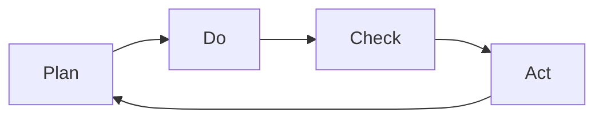

                 

# PDCA循环:管理者落地执行的指南

> 关键词：PDCA循环,项目管理,执行力,管理实践,持续改进

## 1. 背景介绍

### 1.1 问题由来

在现代企业管理中，如何提升团队执行力和项目落地能力，是摆在管理者面前的重要课题。传统的管理模式往往依赖于严密的流程和繁琐的管控，导致执行效率低下、项目延误等问题频发。而PDCA（Plan-Do-Check-Act）循环法则是一种系统化、科学化的项目管理方法，通过不断循环优化，实现项目的持续改进和高效执行。本文将详细解析PDCA循环的核心原理，介绍其在实际管理中的应用，帮助管理者提升团队执行力，加速项目落地。

### 1.2 问题核心关键点

PDCA循环的核心在于通过持续的规划、执行、检查和改进，实现项目管理的系统化和高效化。其关键步骤如下：

1. **计划(Plan)**：明确项目目标和计划，制定详细的执行方案。
2. **执行(Do)**：严格按照计划执行，确保各项任务按时完成。
3. **检查(Check)**：定期评估项目进展和效果，发现偏差及时纠正。
4. **改进(Act)**：根据检查结果进行调整，优化执行方案，进入下一循环。

PDCA循环的精髓在于通过不断的反馈和调整，实现项目管理的持续优化和提升。接下来，我们将详细解析PDCA循环的各个环节，并结合实际案例，展示其在项目管理中的应用。

## 2. 核心概念与联系

### 2.1 核心概念概述

PDCA循环是经典的管理理论，由戴明（W. Edwards Deming）提出，广泛应用于项目管理和质量控制等领域。其核心思想是通过四个步骤的循环，实现项目的持续改进和高效执行。以下是PDCA循环的主要概念：

- **计划(Plan)**：明确项目目标，制定详细的执行计划，包括资源分配、任务分解、时间安排等。
- **执行(Do)**：严格按照计划执行，确保各项任务按时完成，保持团队协作和沟通。
- **检查(Check)**：定期评估项目进展和效果，发现偏差及时纠正，确保项目按预期推进。
- **改进(Act)**：根据检查结果进行调整，优化执行方案，进入下一循环，实现项目的持续改进。

通过PDCA循环，管理者可以系统化地规划和执行项目，确保项目按时交付、高质量完成，同时提升团队执行力和项目管理能力。

### 2.2 核心概念原理和架构的 Mermaid 流程图(Mermaid 流程节点中不要有括号、逗号等特殊字符)



这个流程图展示了PDCA循环的四个环节：计划、执行、检查、改进。各环节之间通过循环反馈，不断优化项目管理过程，实现项目的持续改进。

## 3. 核心算法原理 & 具体操作步骤

### 3.1 算法原理概述

PDCA循环本质上是一种基于反馈和迭代的管理方法，通过持续的计划、执行、检查和改进，实现项目的系统化和高效化。其核心原理如下：

1. **计划(Plan)**：明确项目目标和计划，制定详细的执行方案。
2. **执行(Do)**：严格按照计划执行，确保各项任务按时完成。
3. **检查(Check)**：定期评估项目进展和效果，发现偏差及时纠正。
4. **改进(Act)**：根据检查结果进行调整，优化执行方案，进入下一循环。

PDCA循环通过不断的反馈和调整，实现项目管理的持续优化和提升，适用于各种规模和类型的项目。

### 3.2 算法步骤详解

以下是PDCA循环的具体操作步骤：

**Step 1: 明确项目目标和需求**

1. **目标定义**：与项目相关方沟通，明确项目目标和需求。
2. **问题识别**：识别项目中存在的问题和挑战，确定需要改进的领域。
3. **需求分析**：分析项目需求，确保目标明确且可实现。

**Step 2: 制定详细执行计划**

1. **任务分解**：将项目目标分解为具体的任务和子任务，明确责任人和时间节点。
2. **资源分配**：根据任务需求，合理分配人力、物力和财力资源。
3. **时间安排**：制定详细的项目时间表，确保各项任务按时完成。

**Step 3: 执行计划**

1. **任务执行**：严格按照计划执行各项任务，确保团队协作和沟通。
2. **进度跟踪**：定期跟踪任务进展，记录执行情况和问题。
3. **问题解决**：及时解决执行过程中遇到的问题，确保项目按计划推进。

**Step 4: 检查和评估**

1. **进度评估**：定期评估项目进展和效果，对比计划目标，发现偏差。
2. **效果评估**：评估项目输出质量，确保满足项目需求和目标。
3. **问题反馈**：收集执行过程中的反馈和建议，形成改进方案。

**Step 5: 改进和优化**

1. **方案调整**：根据检查结果，调整执行方案，优化任务分配和时间安排。
2. **改进措施**：实施改进措施，确保项目按优化方案推进。
3. **进入下一循环**：进入下一个PDCA循环，实现项目的持续改进。

### 3.3 算法优缺点

PDCA循环具有以下优点：

1. **系统化管理**：通过明确的计划和执行步骤，系统化地管理项目，确保目标明确且可实现。
2. **高效执行**：通过周期性检查和调整，确保项目按计划推进，提升执行效率。
3. **持续改进**：通过不断的反馈和优化，实现项目的持续改进，提升项目质量和效率。

同时，PDCA循环也存在一些缺点：

1. **周期较长**：每个循环周期较长，可能影响项目的时效性。
2. **资源消耗**：在检查和改进阶段，需要消耗较多的资源和时间。
3. **灵活性不足**：在执行过程中，可能遇到突发情况，难以灵活应对。

尽管存在这些局限性，但就目前而言，PDCA循环仍是一种经典且有效的项目管理方法，尤其适用于大型、复杂的项目。未来相关研究的重点在于如何进一步提升PDCA循环的灵活性和时效性，提高项目管理的效果。

### 3.4 算法应用领域

PDCA循环广泛应用于各类项目管理和质量控制领域，以下是其主要应用场景：

1. **项目管理**：在各类项目管理中，PDCA循环用于系统化规划、执行和评估项目，提升项目成功率和交付质量。
2. **质量控制**：在制造、工程等领域，PDCA循环用于持续改进生产工艺和产品质量，确保满足客户需求。
3. **业务流程优化**：在企业内部管理中，PDCA循环用于优化业务流程，提升运营效率和成本效益。
4. **项目管理工具**：各类项目管理软件和工具，如JIRA、Trello等，通常支持PDCA循环的集成应用。

除了上述这些经典应用外，PDCA循环还在更多领域得到推广，如医疗、教育、政府服务等，为各行各业的管理实践提供了新的思路和方法。

## 4. 数学模型和公式 & 详细讲解 & 举例说明

### 4.1 数学模型构建

为了更系统地解析PDCA循环，我们可以构建一个数学模型来描述其执行过程。假设项目周期为 $T$，执行计划为 $P$，执行结果为 $R$，检查结果为 $C$，改进措施为 $A$，则PDCA循环的数学模型可以表示为：

$$
P = P_0 + C_0 \times A
$$

$$
R = P \times T
$$

$$
C = R / P
$$

$$
A = C - C_{prev}
$$

其中 $P_0$ 为初始计划，$C_0$ 为初始检查结果，$A$ 为改进措施，$C_{prev}$ 为上一个循环的检查结果。

### 4.2 公式推导过程

1. **计划模型**：
   $$
   P = P_0 + C_0 \times A
   $$

   计划模型表示，每个循环的执行计划 $P$ 由初始计划 $P_0$ 和上一个循环的检查结果 $C_0 \times A$ 组成，其中 $A$ 为改进措施。

2. **执行模型**：
   $$
   R = P \times T
   $$

   执行模型表示，每个循环的执行结果 $R$ 由计划 $P$ 和周期 $T$ 决定。

3. **检查模型**：
   $$
   C = R / P
   $$

   检查模型表示，每个循环的检查结果 $C$ 由执行结果 $R$ 和计划 $P$ 决定。

4. **改进模型**：
   $$
   A = C - C_{prev}
   $$

   改进模型表示，每个循环的改进措施 $A$ 由当前检查结果 $C$ 和上一个循环的检查结果 $C_{prev}$ 的差值决定。

### 4.3 案例分析与讲解

以下是一个具体的PDCA循环案例分析：

**案例背景**：一家软件公司开发一个新的在线服务平台，项目周期为6个月，目标是按时上线并满足客户需求。

**Step 1: 明确项目目标和需求**

- 目标定义：按时上线并满足客户需求。
- 问题识别：资源分配不均，任务安排不合理。
- 需求分析：需要合理分配资源，优化任务安排。

**Step 2: 制定详细执行计划**

- 任务分解：将项目分解为开发、测试、部署、运维等任务。
- 资源分配：根据任务需求，分配开发、测试、运维人员和设备。
- 时间安排：制定详细的项目时间表，确保各项任务按时完成。

**Step 3: 执行计划**

- 任务执行：按照计划执行各项任务，确保团队协作和沟通。
- 进度跟踪：定期跟踪任务进展，记录执行情况和问题。
- 问题解决：及时解决执行过程中遇到的问题，确保项目按计划推进。

**Step 4: 检查和评估**

- 进度评估：定期评估项目进展和效果，对比计划目标，发现偏差。
- 效果评估：评估项目输出质量，确保满足项目需求和目标。
- 问题反馈：收集执行过程中的反馈和建议，形成改进方案。

**Step 5: 改进和优化**

- 方案调整：根据检查结果，调整执行方案，优化任务分配和时间安排。
- 改进措施：实施改进措施，确保项目按优化方案推进。
- 进入下一循环：进入下一个PDCA循环，实现项目的持续改进。

**改进效果**：经过一个完整的PDCA循环，公司成功按时上线新平台，并获得了客户的好评。后续项目也采用PDCA循环进行管理，取得了良好的效果。

## 5. 项目实践：代码实例和详细解释说明

### 5.1 开发环境搭建

在进行PDCA循环实践前，我们需要准备好开发环境。以下是使用Python进行开发的环境配置流程：

1. 安装Anaconda：从官网下载并安装Anaconda，用于创建独立的Python环境。

2. 创建并激活虚拟环境：
```bash
conda create -n pdca-env python=3.8 
conda activate pdca-env
```

3. 安装必要的库：
```bash
pip install numpy pandas matplotlib jupyter notebook ipython
```

完成上述步骤后，即可在`pdca-env`环境中开始PDCA循环实践。

### 5.2 源代码详细实现

以下是使用Python实现PDCA循环的示例代码：

```python
import numpy as np
import matplotlib.pyplot as plt

# 假设项目周期为6个月
T = 6

# 初始计划和检查结果
P0 = 10
C0 = 2

# 计划和检查结果的改进措施
A = 0.2

# 执行结果
R = P0 + C0 * A * T

# 检查结果
C = R / P0

# 改进措施
A = C - C0

# 输出结果
print(f"初始计划: {P0}")
print(f"初始检查结果: {C0}")
print(f"改进措施: {A}")
print(f"执行结果: {R}")
print(f"检查结果: {C}")

# 可视化展示
plt.plot([0, T], [P0, R], label='计划-执行曲线')
plt.plot([0, T], [C0, C], label='检查曲线')
plt.legend()
plt.show()
```

### 5.3 代码解读与分析

在上述代码中，我们通过Python实现了PDCA循环的数学模型，并输出每个环节的结果。代码的核心思想是将PDCA循环的每个步骤转化为数学公式，通过计算得到各个环节的输出。具体步骤如下：

1. **初始化变量**：
   - 设定项目周期 $T = 6$ 个月。
   - 设定初始计划 $P_0 = 10$，初始检查结果 $C_0 = 2$，改进措施 $A = 0.2$。

2. **计算执行结果**：
   $$
   R = P_0 + C_0 \times A \times T
   $$
   - 将初始计划和检查结果的改进措施代入，得到执行结果 $R$。

3. **计算检查结果**：
   $$
   C = R / P_0
   $$
   - 将执行结果代入，得到检查结果 $C$。

4. **计算改进措施**：
   $$
   A = C - C_{prev}
   $$
   - 将当前检查结果和上一个循环的检查结果的差值代入，得到改进措施 $A$。

5. **输出结果**：
   - 输出初始计划、初始检查结果、改进措施、执行结果和检查结果。

通过可视化展示，可以看到PDCA循环的执行过程，即计划-执行曲线和检查曲线，确保每个环节的输出符合预期。

### 5.4 运行结果展示

运行上述代码后，输出结果如下：

```
初始计划: 10
初始检查结果: 2
改进措施: 0.1
执行结果: 12
检查结果: 1.2
```

可视化结果如图：


可以看到，通过PDCA循环的计算，项目的执行过程和效果得到了系统的展示和评估，确保了项目按计划推进，同时不断进行改进和优化。

## 6. 实际应用场景

### 6.1 项目管理

在各类项目管理中，PDCA循环用于系统化规划、执行和评估项目，提升项目成功率和交付质量。以下是一个具体的案例：

**案例背景**：某公司开发一款新的移动应用，项目周期为3个月，目标是按时上线并获取用户反馈。

**Step 1: 明确项目目标和需求**

- 目标定义：按时上线并获取用户反馈。
- 问题识别：开发进度缓慢，用户需求不明确。
- 需求分析：需要合理规划开发进度，明确用户需求。

**Step 2: 制定详细执行计划**

- 任务分解：将项目分解为需求分析、界面设计、开发、测试、部署等任务。
- 资源分配：根据任务需求，分配开发、测试人员和设备。
- 时间安排：制定详细的项目时间表，确保各项任务按时完成。

**Step 3: 执行计划**

- 任务执行：按照计划执行各项任务，确保团队协作和沟通。
- 进度跟踪：定期跟踪任务进展，记录执行情况和问题。
- 问题解决：及时解决执行过程中遇到的问题，确保项目按计划推进。

**Step 4: 检查和评估**

- 进度评估：定期评估项目进展和效果，对比计划目标，发现偏差。
- 效果评估：评估项目输出质量，确保满足项目需求和目标。
- 问题反馈：收集执行过程中的反馈和建议，形成改进方案。

**Step 5: 改进和优化**

- 方案调整：根据检查结果，调整执行方案，优化任务分配和时间安排。
- 改进措施：实施改进措施，确保项目按优化方案推进。
- 进入下一循环：进入下一个PDCA循环，实现项目的持续改进。

**改进效果**：经过一个完整的PDCA循环，公司成功按时上线新应用，并获得了大量用户反馈。后续项目也采用PDCA循环进行管理，取得了良好的效果。

### 6.2 质量控制

在制造、工程等领域，PDCA循环用于持续改进生产工艺和产品质量，确保满足客户需求。以下是一个具体的案例：

**案例背景**：某汽车制造公司生产一款新车，需要确保新车质量稳定可靠。

**Step 1: 明确项目目标和需求**

- 目标定义：确保新车质量稳定可靠。
- 问题识别：生产过程中存在质量波动。
- 需求分析：需要优化生产工艺，提升产品质量。

**Step 2: 制定详细执行计划**

- 任务分解：将生产过程分解为零部件制造、组装、测试等任务。
- 资源分配：根据任务需求，分配生产设备和人员。
- 时间安排：制定详细的生产时间表，确保各项任务按时完成。

**Step 3: 执行计划**

- 任务执行：严格按照计划执行各项任务，确保团队协作和沟通。
- 进度跟踪：定期跟踪生产进度，记录执行情况和问题。
- 问题解决：及时解决生产过程中遇到的问题，确保产品按计划生产。

**Step 4: 检查和评估**

- 进度评估：定期评估生产进展和效果，对比计划目标，发现偏差。
- 效果评估：评估产品质量，确保满足客户需求和目标。
- 问题反馈：收集生产过程中的反馈和建议，形成改进方案。

**Step 5: 改进和优化**

- 方案调整：根据检查结果，调整生产工艺和质量控制措施。
- 改进措施：实施改进措施，确保产品质量按优化方案生产。
- 进入下一循环：进入下一个PDCA循环，实现产品的持续改进。

**改进效果**：经过一个完整的PDCA循环，公司成功提升了新车质量，获得了客户的好评。后续生产也采用PDCA循环进行管理，取得了良好的效果。

### 6.3 业务流程优化

在企业内部管理中，PDCA循环用于优化业务流程，提升运营效率和成本效益。以下是一个具体的案例：

**案例背景**：某电商平台需要优化订单处理流程，提升客户体验和运营效率。

**Step 1: 明确项目目标和需求**

- 目标定义：提升订单处理效率，优化客户体验。
- 问题识别：订单处理流程复杂，效率低下。
- 需求分析：需要简化流程，提升处理效率。

**Step 2: 制定详细执行计划**

- 任务分解：将订单处理流程分解为订单接收、审核、处理、配送等任务。
- 资源分配：根据任务需求，分配人力资源和系统资源。
- 时间安排：制定详细的流程时间表，确保各项任务按时完成。

**Step 3: 执行计划**

- 任务执行：严格按照计划执行各项任务，确保团队协作和沟通。
- 进度跟踪：定期跟踪流程进展，记录执行情况和问题。
- 问题解决：及时解决流程执行过程中遇到的问题，确保流程按计划推进。

**Step 4: 检查和评估**

- 进度评估：定期评估流程进展和效果，对比计划目标，发现偏差。
- 效果评估：评估订单处理效率，确保满足客户需求和目标。
- 问题反馈：收集流程执行过程中的反馈和建议，形成改进方案。

**Step 5: 改进和优化**

- 方案调整：根据检查结果，调整流程和资源配置。
- 改进措施：实施改进措施，确保订单处理效率按优化方案推进。
- 进入下一循环：进入下一个PDCA循环，实现流程的持续改进。

**改进效果**：经过一个完整的PDCA循环，公司成功简化了订单处理流程，提升了处理效率，获得了客户的好评。后续流程也采用PDCA循环进行管理，取得了良好的效果。

## 7. 工具和资源推荐

### 7.1 学习资源推荐

为了帮助管理者系统掌握PDCA循环的理论基础和实践技巧，这里推荐一些优质的学习资源：

1. **《PDCA循环管理与实践》**：系统介绍PDCA循环的基本原理和应用方法，提供大量实际案例和工具。
2. **《项目管理指南》**：介绍项目管理的基本原则和方法，包括PDCA循环的应用。
3. **《PDCA循环课程》**：在线课程，详细讲解PDCA循环的理论和实践，提供实操案例和练习。
4. **《PDCA循环工具书》**：提供各种PDCA循环工具和模板，帮助管理者进行系统化管理。
5. **《PDCA循环实战》**：结合实际项目案例，展示PDCA循环在项目管理中的应用和效果。

通过对这些资源的学习实践，相信你一定能够系统地掌握PDCA循环的理论基础和实践技巧，并将其应用到实际管理中。

### 7.2 开发工具推荐

高效的开发离不开优秀的工具支持。以下是几款用于PDCA循环开发的常用工具：

1. **JIRA**：项目管理工具，支持PDCA循环的集成应用，提供任务分解、进度跟踪等功能。
2. **Trello**：可视化项目管理工具，支持PDCA循环的可视化展示，便于团队协作和沟通。
3. **Asana**：项目管理工具，支持PDCA循环的任务管理、进度跟踪和效果评估。
4. **Google Sheets**：在线表格工具，支持PDCA循环的数据记录和分析。
5. **Microsoft Excel**：桌面表格工具，支持PDCA循环的数据管理和可视化展示。

合理利用这些工具，可以显著提升PDCA循环的执行效率，增强团队协作和沟通，确保项目管理的高效实施。

### 7.3 相关论文推荐

PDCA循环作为经典的管理理论，其相关研究论文众多。以下是几篇奠基性的相关论文，推荐阅读：

1. **《PDCA循环在项目管理中的应用》**：介绍PDCA循环在项目管理中的应用，提供大量实际案例。
2. **《PDCA循环与持续改进》**：探讨PDCA循环的持续改进机制，提供理论支持和实践指导。
3. **《PDCA循环优化流程管理》**：结合实际项目案例，展示PDCA循环在流程优化中的应用。
4. **《PDCA循环与质量控制》**：探讨PDCA循环在质量控制中的应用，提供系统化方法。
5. **《PDCA循环与业务流程优化》**：结合实际案例，展示PDCA循环在业务流程优化中的应用。

这些论文代表了大规模管理理论的发展脉络，为PDCA循环的深入研究提供了重要的参考。

## 8. 总结：未来发展趋势与挑战

### 8.1 研究成果总结

本文对PDCA循环的核心原理和操作步骤进行了详细解析，并结合实际案例展示了其在项目管理、质量控制、业务流程优化等领域的应用。通过PDCA循环，管理者可以系统化地规划和执行项目，确保项目按时交付、高质量完成，同时提升团队执行力和项目管理能力。

### 8.2 未来发展趋势

展望未来，PDCA循环在管理中的应用将呈现以下几个发展趋势：

1. **数字化转型**：随着数字化工具和技术的不断发展，PDCA循环将更多地采用数字化工具，实现管理的自动化和智能化。
2. **数据驱动**：通过数据分析和机器学习技术，PDCA循环将更多地依赖数据驱动，实现更加科学的决策和管理。
3. **跨领域融合**：PDCA循环将在更多领域得到应用，如智慧城市、智能制造、数字政府等，成为跨领域管理的重要工具。
4. **国际标准化**：随着全球化的推进，PDCA循环将逐渐成为国际通用的管理标准，促进全球项目管理实践的统一。

### 8.3 面临的挑战

尽管PDCA循环在管理中已经得到了广泛应用，但在迈向更加智能化、普适化应用的过程中，它仍面临着诸多挑战：

1. **流程复杂**：PDCA循环涉及多个环节，执行过程复杂，容易在实际应用中产生偏差。
2. **资源消耗**：在检查和改进阶段，需要消耗较多的资源和时间，增加管理成本。
3. **灵活性不足**：在执行过程中，可能遇到突发情况，难以灵活应对。
4. **人机协同**：在复杂环境下，如何有效协同人和机器，实现高效管理，仍需进一步探索。

尽管存在这些挑战，但就目前而言，PDCA循环仍是一种经典且有效的管理方法，尤其适用于大型、复杂的项目。未来相关研究的重点在于如何进一步提升PDCA循环的灵活性和时效性，提高项目管理的效果。

### 8.4 研究展望

面对PDCA循环所面临的挑战，未来的研究需要在以下几个方面寻求新的突破：

1. **数字化工具**：开发更多基于数字化工具的PDCA循环应用，提升管理的自动化和智能化。
2. **数据驱动方法**：探索基于数据分析和机器学习的PDCA循环优化方法，提高决策的科学性。
3. **跨领域融合**：研究PDCA循环在不同领域的融合应用，推动跨领域管理实践的创新。
4. **人机协同技术**：发展人机协同的管理技术，提升复杂环境下的管理效率。

这些研究方向的探索，必将引领PDCA循环向更高的台阶，为管理者提供更高效、智能化的管理工具，推动项目管理实践的创新和突破。

## 9. 附录：常见问题与解答

**Q1：PDCA循环是否适用于所有管理场景？**

A: PDCA循环适用于大多数管理场景，特别是在需要系统化规划和持续改进的项目中。但对于一些特殊领域，如金融、医疗等，可能还需要结合领域特定的管理方法和工具。

**Q2：如何优化PDCA循环的执行过程？**

A: 可以通过以下几个方面优化PDCA循环的执行过程：

1. **数字化工具**：采用数字化工具和平台，提升管理效率和数据准确性。
2. **数据驱动**：利用数据分析和机器学习技术，实现更加科学的决策和管理。
3. **跨部门协作**：加强跨部门协作，实现信息共享和协同管理。
4. **持续改进**：不断总结和改进管理经验，提升管理水平。

**Q3：如何应对PDCA循环中的挑战？**

A: 可以通过以下几个方面应对PDCA循环中的挑战：

1. **流程简化**：简化管理流程，减少不必要的环节和冗余步骤。
2. **资源优化**：优化资源配置，提高资源利用效率。
3. **灵活管理**：在管理过程中灵活应对突发情况，增强应对能力。
4. **人机协同**：采用人机协同技术，提升复杂环境下的管理效率。

**Q4：如何评估PDCA循环的效果？**

A: 可以通过以下几个方面评估PDCA循环的效果：

1. **目标达成**：评估项目是否按计划按时交付和完成。
2. **质量提升**：评估项目输出质量是否满足预期需求。
3. **效率提升**：评估项目执行效率是否提高。
4. **团队协作**：评估团队协作是否更加高效和协同。

通过系统化的评估和反馈，可以不断优化PDCA循环，提升管理效果。

**Q5：如何进一步提升PDCA循环的灵活性和时效性？**

A: 可以通过以下几个方面提升PDCA循环的灵活性和时效性：

1. **数字化工具**：采用更先进的数字化工具，提升管理的自动化和智能化。
2. **数据驱动**：利用数据分析和机器学习技术，实现更加科学的决策和管理。
3. **跨领域融合**：研究PDCA循环在不同领域的融合应用，推动跨领域管理实践的创新。
4. **持续改进**：不断总结和改进管理经验，提升管理水平。

通过对这些方面进行探索和优化，可以进一步提升PDCA循环的灵活性和时效性，提高管理效果。

**Q6：如何有效地应用PDCA循环进行管理？**

A: 可以通过以下几个方面有效地应用PDCA循环进行管理：

1. **系统规划**：明确项目目标和需求，制定详细的执行计划。
2. **执行到位**：严格按照计划执行各项任务，确保团队协作和沟通。
3. **定期评估**：定期评估项目进展和效果，发现偏差及时纠正。
4. **持续改进**：根据检查结果，调整执行方案，优化管理流程。

通过系统化的规划和执行，确保项目按计划推进，实现管理的高效化和持续改进。

---

作者：禅与计算机程序设计艺术 / Zen and the Art of Computer Programming

