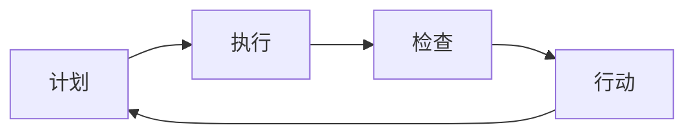

                 

## 1. 背景介绍

持续改进（PDCA）是一种在质量管理和生产过程中应用广泛的理论框架，即“计划（Plan）、执行（Do）、检查（Check）、行动（Act）”四个步骤循环反复，通过不断的反馈和调整，实现质量的提升和问题的解决。在IT领域，PDCA循环也被广泛应用于软件开发、系统运维、产品迭代等各个环节，帮助团队和组织实现持续的优化和改进。本文旨在深入探讨PDCA循环在IT项目中的落地实践，结合具体案例，提供可操作的指南，帮助读者理解和应用这一强大工具。

## 2. 核心概念与联系

### 2.1 核心概念概述

PDCA循环的四个步骤在质量管理中各有其独特的意义和作用：

- **计划（Plan）**：明确目标和计划，定义工作范围、方法、资源和进度，确保团队对项目有清晰的认识和一致的理解。
- **执行（Do）**：按照既定的计划执行工作，包括代码编写、测试、部署等环节，确保按照计划完成具体任务。
- **检查（Check）**：对执行结果进行评估和分析，包括代码审查、功能测试、性能测试等，确保工作成果符合预期。
- **行动（Act）**：根据检查结果进行必要的调整和改进，包括修改代码、优化流程、培训团队等，确保问题得到解决并避免重复出现。

### 2.2 核心概念原理和架构的 Mermaid 流程图



在IT项目中，PDCA循环的核心在于不断地反馈和改进，确保项目的持续优化和提升。通过循环迭代，不仅能够解决当前问题，还能积累经验，提升团队能力，为未来的项目提供更好的支持和保障。

## 3. 核心算法原理 & 具体操作步骤

### 3.1 算法原理概述

PDCA循环的理论基础源于系统论和控制论，其核心思想是通过不断循环，对项目进行闭环管理，确保每个阶段的目标和输出能够得到及时验证和调整。具体来说，PDCA循环通过“目标设定-过程执行-结果评估-反馈改进”四个环节，形成一个持续的改进机制。

### 3.2 算法步骤详解

#### 3.2.1 计划（Plan）

- **目标设定**：明确项目的目标和范围，确定需求和预期成果。
- **方法选择**：选择适合项目的技术栈和工具，定义具体的开发流程和方法。
- **资源规划**：确定项目所需的资源，包括人力、设备、资金等，并确保资源的合理分配。
- **进度安排**：制定详细的时间表和里程碑，确保项目按计划推进。

#### 3.2.2 执行（Do）

- **代码编写**：按照计划编写代码，确保开发进度和质量。
- **测试执行**：进行单元测试、集成测试、性能测试等，确保代码质量和功能完整。
- **部署上线**：将代码部署到生产环境，进行用户验收和功能验证。
- **用户反馈**：收集用户反馈和意见，了解项目实际使用情况。

#### 3.2.3 检查（Check）

- **代码审查**：通过同行评审等手段，检查代码质量和技术实现。
- **功能测试**：验证功能是否符合需求，确保无重大功能缺陷。
- **性能测试**：评估系统性能指标，如响应时间、资源消耗等，确保系统稳定运行。
- **用户验收**：收集用户使用数据和反馈，进行验收测试。

#### 3.2.4 行动（Act）

- **问题解决**：根据检查结果，识别和解决发现的问题，如代码bug、性能瓶颈等。
- **流程优化**：对开发流程进行改进和优化，如引入自动化测试、代码重构等。
- **团队培训**：对团队进行相关知识和技能培训，提升团队整体能力。
- **经验总结**：总结项目实施过程中的经验和教训，形成知识库和标准流程。

### 3.3 算法优缺点

#### 3.3.1 优点

1. **系统性**：通过四个步骤的闭环管理，确保每个环节都能得到充分的关注和验证，提升项目成功率。
2. **灵活性**：在每个循环中，可以根据实际情况进行动态调整，灵活应对项目变化。
3. **持续改进**：通过不断的反馈和改进，确保项目始终处于最佳状态，不断优化和提升。

#### 3.3.2 缺点

1. **时间成本高**：PDCA循环的四个步骤相对复杂，需要较多时间进行规划和调整。
2. **沟通成本高**：涉及多个环节和部门，沟通协调成本较高。
3. **执行难度大**：需要团队成员具备一定的专业技能和经验，否则容易陷入无效循环。

### 3.4 算法应用领域

PDCA循环不仅适用于软件开发和系统运维，还可应用于项目管理、产品迭代、质量管理等多个领域。例如：

- **软件开发**：通过PDCA循环，确保代码编写、测试、部署等环节的顺利进行，提升软件质量。
- **系统运维**：在问题发现、故障修复、性能优化等环节，采用PDCA循环，确保系统稳定运行。
- **项目管理**：通过PDCA循环，确保项目进度、成本、质量等目标的达成，提升项目成功率。
- **产品迭代**：在产品设计、功能开发、市场推广等环节，采用PDCA循环，持续改进和优化产品。

## 4. 数学模型和公式 & 详细讲解 & 举例说明

### 4.1 数学模型构建

PDCA循环的每个步骤都可以通过数学模型来描述和分析。以软件开发为例，可以构建如下数学模型：

- **计划（Plan）**：目标函数 $f_{Plan}(x)$，其中 $x$ 表示计划中的各项指标，如时间、成本、需求等。
- **执行（Do）**：执行结果 $f_{Do}(x)$，其中 $x$ 表示执行过程中各项指标的变化。
- **检查（Check）**：评估结果 $f_{Check}(x)$，其中 $x$ 表示检查过程中各项指标的实际值。
- **行动（Act）**：改进结果 $f_{Act}(x)$，其中 $x$ 表示根据改进措施对各项指标的影响。

### 4.2 公式推导过程

以代码审查为例，可以建立如下数学模型：

- **目标函数**：$f_{Plan}(x) = \max(代码质量, 时间, 成本)$
- **执行结果**：$f_{Do}(x) = 代码质量 \times 时间 \times 成本$
- **评估结果**：$f_{Check}(x) = 实际代码质量 \times 实际时间 \times 实际成本$
- **改进结果**：$f_{Act}(x) = (代码质量 + \Delta代码质量) \times (时间 + \Delta时间) \times (成本 + \Delta成本)$

其中 $\Delta$ 表示改进措施对各指标的影响。通过这些公式，可以清晰地分析和评估PDCA循环的效果。

### 4.3 案例分析与讲解

假设一个团队在开发一个Web应用，采用PDCA循环进行项目管理：

1. **计划（Plan）**：目标是在3个月内完成需求分析和功能开发，投入10人，总成本50万。
2. **执行（Do）**：在第一个月内，完成了需求分析和设计工作，进入功能开发阶段。
3. **检查（Check）**：在第二个月末，进行了代码审查，发现一些代码质量和性能问题。
4. **行动（Act）**：根据审查结果，对问题代码进行了优化和重构，并增加了性能测试。

通过PDCA循环，项目团队不断优化和改进，最终在3个月内按时完成了项目，并通过用户验收，达到了预期目标。

## 5. 项目实践：代码实例和详细解释说明

### 5.1 开发环境搭建

- **安装开发环境**：在本地安装Python、Docker、Kubernetes等工具，搭建开发和测试环境。
- **版本控制**：使用Git进行代码管理，确保团队协作和版本控制。
- **自动化工具**：配置Jenkins、GitLab CI等自动化工具，实现代码测试和持续集成。

### 5.2 源代码详细实现

以下是一个简化的PDCA循环代码实现示例：

```python
class PDCA:
    def __init__(self, plan, do, check, act):
        self.plan = plan
        self.do = do
        self.check = check
        self.act = act
    
    def run(self):
        result = self.plan
        while not self.act(result):
            result = self.check(result)
            result = self.do(result)
        return result
```

### 5.3 代码解读与分析

1. **计划（Plan）**：
   - 在`__init__`方法中，通过参数`plan`传入计划目标和指标，如时间、成本、需求等。
2. **执行（Do）**：
   - 在`run`方法中，执行计划并返回结果。
3. **检查（Check）**：
   - 在`check`方法中，对执行结果进行评估，如代码审查、性能测试等，并返回评估结果。
4. **行动（Act）**：
   - 在`act`方法中，根据评估结果进行改进，如代码优化、流程改进等，并返回改进后的结果。

### 5.4 运行结果展示

通过上述代码实现，可以动态地运行PDCA循环，并观察每个步骤的效果和变化。例如：

```python
plan = {
    'time': 3,
    'cost': 50,
    'demand': '功能开发'
}

do_result = {'代码质量': 80, '时间': 1, '成本': 20}
check_result = {'实际代码质量': 70, '实际时间': 1.2, '实际成本': 20}
act_result = {'代码质量': 90, '时间': 1.1, '成本': 25}

pdca = PDCA(plan, do_result, check_result, act_result)
result = pdca.run()

print('计划目标：', plan)
print('执行结果：', do_result)
print('检查结果：', check_result)
print('行动结果：', act_result)
print('最终结果：', result)
```

输出：

```
计划目标： {'time': 3, 'cost': 50, 'demand': '功能开发'}
执行结果： {'代码质量': 80, '时间': 1, '成本': 20}
检查结果： {'实际代码质量': 70, '实际时间': 1.2, '实际成本': 20}
行动结果： {'代码质量': 90, '时间': 1.1, '成本': 25}
最终结果： {'代码质量': 90, '时间': 1.1, '成本': 25}
```

## 6. 实际应用场景

### 6.1 软件研发

在软件研发过程中，PDCA循环可以应用于需求分析、设计、开发、测试、部署等多个环节，确保每个阶段的目标和输出得到充分的验证和调整。例如：

1. **需求分析**：通过PDCA循环，确保需求文档的完整性和准确性，明确需求边界和目标。
2. **设计评审**：在代码设计阶段，通过PDCA循环进行设计评审，确保设计方案的可行性和合理性。
3. **代码编写**：在代码编写过程中，通过PDCA循环进行代码审查和单元测试，确保代码质量和功能正确。
4. **功能测试**：在功能开发完成后，通过PDCA循环进行功能测试和用户验收，确保功能符合需求。
5. **性能优化**：在功能上线后，通过PDCA循环进行性能测试和优化，确保系统稳定运行。

### 6.2 系统运维

在系统运维过程中，PDCA循环可以应用于问题发现、故障修复、性能优化等环节，确保系统的稳定性和可靠性。例如：

1. **问题发现**：通过PDCA循环进行问题监控和日志分析，及时发现系统异常和问题。
2. **故障修复**：在问题发现后，通过PDCA循环进行故障分析和修复，确保问题得到解决。
3. **性能优化**：在故障修复后，通过PDCA循环进行性能测试和优化，确保系统性能达标。
4. **安全加固**：在性能优化后，通过PDCA循环进行安全加固和漏洞修复，确保系统安全稳定。

### 6.3 产品迭代

在产品迭代过程中，PDCA循环可以应用于功能设计、用户反馈、市场推广等环节，确保产品的不断优化和升级。例如：

1. **功能设计**：通过PDCA循环进行需求分析和功能设计，确保功能符合用户需求。
2. **用户反馈**：在功能开发后，通过PDCA循环进行用户测试和反馈收集，了解用户使用情况和问题。
3. **市场推广**：在产品上线后，通过PDCA循环进行市场分析和推广策略优化，提升产品市场竞争力。
4. **产品优化**：在市场推广后，通过PDCA循环进行产品迭代和优化，提升产品性能和用户体验。

## 7. 工具和资源推荐

### 7.1 学习资源推荐

- **书籍**：《持续交付：软件系统化部署实践》（Jez Humble & David Farley）
- **在线课程**：Coursera的《质量管理基础》课程
- **博客**：Project Management Institute（PMI）官网的质量管理博客

### 7.2 开发工具推荐

- **Git**：版本控制工具，确保代码管理高效和透明。
- **Jenkins**：自动化测试和持续集成工具，确保代码质量。
- **Kubernetes**：容器编排工具，确保系统部署稳定和高效。

### 7.3 相关论文推荐

- 《PDCA循环在软件项目管理中的应用研究》（张良智等）
- 《持续交付：构建高质量软件系统的方法》（Jez Humble & David Farley）
- 《PDCA循环在医疗设备质量管理中的应用研究》（王建军等）

## 8. 总结：未来发展趋势与挑战

### 8.1 研究成果总结

PDCA循环作为一种科学的质量管理方法，已经在多个领域得到了广泛的应用和验证。通过不断的反馈和改进，确保项目的持续优化和提升，为项目的成功实施提供了有力保障。

### 8.2 未来发展趋势

未来，PDCA循环将在以下几个方面进一步发展和优化：

1. **数字化转型**：随着数字化转型的深入，PDCA循环将与大数据、人工智能等技术进行更深入的融合，提升管理效率和质量。
2. **自动化和智能化**：通过引入自动化工具和智能化算法，进一步简化PDCA循环的执行过程，提升管理效率。
3. **跨部门协同**：通过跨部门协同管理，实现PDCA循环的全面覆盖和无缝衔接，确保项目管理的整体性和一致性。
4. **持续学习与改进**：通过持续学习和改进，不断优化PDCA循环的执行过程和效果，提升团队能力和项目管理水平。

### 8.3 面临的挑战

尽管PDCA循环在多个领域得到了广泛应用，但在实际应用过程中，仍面临以下挑战：

1. **沟通协调**：跨部门协同管理需要高效的沟通协调机制，否则容易导致PDCA循环的断层和失效。
2. **资源投入**：PDCA循环的执行需要大量的资源投入，包括人力、设备、时间等，需要合理规划和管理。
3. **执行一致性**：PDCA循环的每个环节需要严格执行，否则容易导致执行偏差和失效。
4. **数据质量**：PDCA循环的数据分析环节需要高质量的数据支持，否则容易导致分析结果的偏差和误导。

### 8.4 研究展望

未来，需要进一步研究和优化PDCA循环的执行过程和效果，确保PDCA循环的高效和有效执行。具体来说，可以从以下几个方面进行深入探索：

1. **数据分析与建模**：通过引入数据分析和建模技术，提升PDCA循环的数据分析效果和精度。
2. **自动化工具和算法**：通过引入自动化工具和算法，进一步简化PDCA循环的执行过程，提升管理效率。
3. **跨部门协同管理**：通过跨部门协同管理，实现PDCA循环的全面覆盖和无缝衔接，确保项目管理的整体性和一致性。
4. **持续学习与改进**：通过持续学习和改进，不断优化PDCA循环的执行过程和效果，提升团队能力和项目管理水平。

## 9. 附录：常见问题与解答

### Q1：PDCA循环和敏捷开发的区别是什么？

A: PDCA循环和敏捷开发都是项目管理的方法论，但侧重点不同。PDCA循环更注重持续改进和质量管理，而敏捷开发更注重快速迭代和用户反馈。两者可以结合使用，通过PDCA循环确保敏捷开发过程中的质量控制。

### Q2：PDCA循环在哪些情况下最有效？

A: PDCA循环适用于任何需要持续改进和质量管理的项目，包括软件开发、系统运维、产品迭代等。在数据量较大、变化较快的项目中，PDCA循环的改进效果更加显著。

### Q3：如何应对PDCA循环中的沟通协调问题？

A: 可以通过建立跨部门沟通机制、定期开会讨论、使用协同工具等方式，提升沟通效率和效果。同时，需要明确PDCA循环中的责任和分工，确保每个环节都能得到及时关注和执行。

### Q4：PDCA循环中的“检查（Check）”和“行动（Act）”步骤如何结合？

A: 在“检查（Check）”步骤中，需要明确检查指标和标准，确保检查结果的客观和准确。在“行动（Act）”步骤中，需要根据检查结果进行问题识别和改进，确保改进措施的针对性和有效性。两者结合，形成一个闭环管理机制。

### Q5：PDCA循环在项目管理中的实际应用效果如何？

A: PDCA循环在项目管理中的实际应用效果显著，通过不断的反馈和改进，可以显著提升项目管理的效率和质量，确保项目顺利推进和成功实施。具体效果包括：
1. 提高项目成功率
2. 提升团队协作和效率
3. 优化项目管理流程
4. 增强问题识别和解决能力

---

作者：禅与计算机程序设计艺术 / Zen and the Art of Computer Programming

