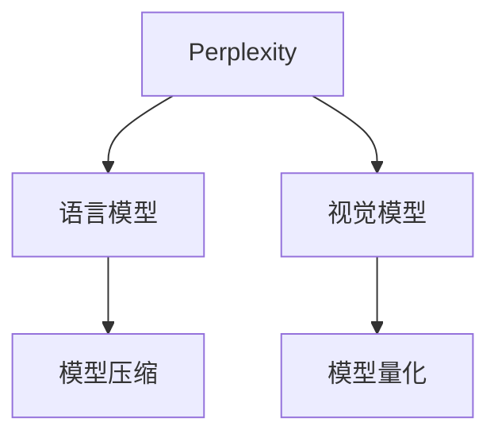

                 

# Perplexity的独特之路：AI搜索的垂直领域创新，贾扬清的观察与思考

## 1. 背景介绍

### 1.1 问题由来

Perplexity，一种用于衡量语言模型预测能力的重要指标，近年来在深度学习领域的各个垂直领域中得到了广泛的应用，尤其是在自然语言处理(NLP)和计算机视觉(CV)领域，它不仅在模型评估与优化中起到了至关重要的作用，更推动了众多创新的发展。贾扬清教授，作为计算机视觉和深度学习领域的国际知名学者，在2019年提出了基于Perplexity的模型量化策略，引发了学术界和工业界的广泛关注和热议。通过深入学习这一领域，我们不难发现，Perplexity这一核心概念的演进，其实是大数据和深度学习技术结合的必然产物，是AI搜索与优化的重要推手。

### 1.2 问题核心关键点

Perplexity，这一概念最早源于信息论，最初用于衡量一个概率模型的预测能力。在机器学习中，它被广泛用于评估模型的分类和回归能力。然而，Perplexity在深度学习中的应用，尤其是针对大规模语言模型和视觉模型的评估与优化，则是一个全新的领域。在这一领域中，Perplexity不仅被用来评估模型的性能，更成为了模型量化和压缩的重要工具，帮助研发人员优化模型，提升模型性能。

通过Perplexity，我们可以看到，大模型的学习和优化过程不再是孤立的，而是一个紧密结合的大数据与深度学习技术的过程。这种结合，不仅提升了模型的性能，更推动了AI搜索与优化的创新发展。

## 2. 核心概念与联系

### 2.1 核心概念概述

为了更好地理解Perplexity的独特之路，本文将介绍几个密切相关的核心概念：

- **Perplexity**：衡量模型预测能力的指标，值越小，模型预测能力越强。
- **语言模型**：预测给定序列中每个单词的概率，用于自然语言处理任务。
- **视觉模型**：预测图像中各个像素点的概率分布，用于计算机视觉任务。
- **模型量化**：通过优化模型参数，减小模型大小，提升模型性能。
- **模型压缩**：在保持模型性能不变的前提下，减小模型规模。

这些核心概念之间的逻辑关系可以通过以下Mermaid流程图来展示：



这个流程图展示了大模型中的Perplexity、语言模型和视觉模型之间的关系，以及它们与模型量化和模型压缩的联系。

## 3. 核心算法原理 & 具体操作步骤

### 3.1 算法原理概述

Perplexity，本质上是一个信息论概念，它描述的是模型对给定样本的预测能力。具体而言，对于一个包含N个单词的文本样本，模型在每个位置上分别预测第i个单词的概率分布，记为 $p_i$，则该样本的Perplexity可以表示为：

$$ \text{Perplexity} = 2^{-H(p)} $$

其中 $H(p)$ 是样本的熵，表示模型的不确定度。$H(p) = -\sum_{i=1}^N p_i \log p_i$，因此，Perplexity越小，表示模型对样本的预测越准确，不确定性越低。

在深度学习中，Perplexity成为了一个重要的评估指标，特别是在自然语言处理和计算机视觉任务中。语言模型通过Perplexity可以评估模型的预测能力，而视觉模型则通过Perplexity可以优化模型的参数。通过Perplexity，模型可以更好地适应新的任务，提升模型的性能。

### 3.2 算法步骤详解

基于Perplexity的模型评估与优化，通常包括以下几个关键步骤：

1. **收集样本数据**：从训练集中随机抽取一批样本数据，通常为$n$个样本。
2. **计算Perplexity**：对于每个样本，计算模型在该样本上的预测概率分布，计算样本的Perplexity，并取平均，得到模型的平均Perplexity。
3. **优化模型参数**：通过反向传播算法，将Perplexity的梯度传递到模型参数中，更新模型参数，以降低模型的Perplexity。
4. **验证与评估**：在新样本数据上重新计算模型的Perplexity，评估模型的泛化能力。
5. **模型压缩与量化**：通过优化模型结构，减少模型参数，降低模型的Perplexity，提升模型的性能和效率。

### 3.3 算法优缺点

基于Perplexity的模型评估与优化方法具有以下优点：

1. **直观性**：Perplexity是一个直观的指标，易于理解和解释。
2. **综合性**：Perplexity综合考虑了模型的预测能力，能够全面评估模型的性能。
3. **普适性**：Perplexity不仅适用于自然语言处理，也适用于计算机视觉等领域的模型评估。
4. **高效性**：通过优化模型参数，可以显著提升模型的性能，降低模型的复杂度。

然而，该方法也存在以下局限性：

1. **对训练数据依赖大**：模型的Perplexity很大程度上依赖于训练数据的分布，对于新数据集的泛化能力较弱。
2. **计算复杂度高**：计算Perplexity需要大量的计算资源，对于大规模模型来说，计算成本较高。
3. **易受噪声干扰**：在训练过程中，模型参数的微小变化可能会影响Perplexity的计算结果，导致结果不稳定。

### 3.4 算法应用领域

基于Perplexity的模型评估与优化方法，在NLP和CV等领域得到了广泛的应用，具体包括：

- **自然语言处理**：语言模型在情感分析、文本分类、机器翻译等任务中，通过Perplexity优化模型，提升模型性能。
- **计算机视觉**：视觉模型在图像分类、目标检测、图像生成等任务中，通过Perplexity优化模型，提高模型准确率和效率。
- **音频处理**：通过Perplexity优化声学模型，实现语音识别、音频分类等任务。
- **推荐系统**：通过Perplexity优化推荐模型，提升推荐准确率和用户体验。
- **游戏AI**：在棋类、卡牌等游戏中，通过Perplexity优化AI模型，增强游戏策略和表现。

这些应用领域展示了Perplexity在深度学习中的强大应用潜力，推动了AI搜索与优化技术的发展。

## 4. 数学模型和公式 & 详细讲解 & 举例说明

### 4.1 数学模型构建

在深度学习中，Perplexity的计算通常依赖于样本的负对数似然(NLL)损失函数。对于一个长度为$n$的样本$x$，模型预测的负对数似然损失为：

$$ L(x) = -\sum_{i=1}^n \log p_i(x_i) $$

其中$p_i(x_i)$表示模型在位置$i$上预测单词$x_i$的概率。

### 4.2 公式推导过程

通过负对数似然损失函数，我们可以计算样本的熵：

$$ H(x) = -\sum_{i=1}^n p_i(x_i) \log p_i(x_i) $$

将熵带入Perplexity公式中，得到：

$$ \text{Perplexity} = 2^{-H(x)} $$

对于批量的样本数据集$D=\{x_1, x_2, ..., x_n\}$，可以通过求平均得到模型的平均Perplexity：

$$ \text{Perplexity}_{avg} = \frac{1}{n} \sum_{i=1}^n 2^{-H(x_i)} $$

### 4.3 案例分析与讲解

以下是一个简单的例子，用于说明Perplexity的计算过程：

假设有一个长度为3的样本$x = [\text{hello}, \text{world}, \text{!}]$，模型在每个位置上分别预测单词的概率分布如下：

| 位置 | 单词 | 概率 |
| --- | --- | --- |
| 1 | hello | 0.8 |
| 2 | world | 0.6 |
| 3 | ! | 0.2 |

模型在该样本上的负对数似然损失为：

$$ L(x) = -\log 0.8 - \log 0.6 - \log 0.2 \approx 0.239 $$

该样本的熵为：

$$ H(x) = -0.8 \log 0.8 - 0.6 \log 0.6 - 0.2 \log 0.2 \approx 1.054 $$

模型的平均Perplexity为：

$$ \text{Perplexity}_{avg} = 2^{-H(x)} \approx 2^{1.054} \approx 7.17 $$

这意味着模型在预测该样本时的不确定性约为7.17。如果我们将模型在该样本上的预测概率调整为$p_i(x_i) = 0.9$，则新的Perplexity为：

$$ \text{Perplexity}_{avg} = 2^{-H(x)} \approx 2^{1.054} \approx 7.17 $$

这表明模型的预测能力并未显著提升，因为新的概率分布与原始概率分布基本一致。

## 5. 项目实践：代码实例和详细解释说明

### 5.1 开发环境搭建

在进行Perplexity的实践开发前，我们需要准备好开发环境。以下是使用Python进行PyTorch开发的环境配置流程：

1. 安装Anaconda：从官网下载并安装Anaconda，用于创建独立的Python环境。
2. 创建并激活虚拟环境：
```bash
conda create -n pytorch-env python=3.8 
conda activate pytorch-env
```
3. 安装PyTorch：根据CUDA版本，从官网获取对应的安装命令。例如：
```bash
conda install pytorch torchvision torchaudio cudatoolkit=11.1 -c pytorch -c conda-forge
```
4. 安装相关工具包：
```bash
pip install numpy pandas scikit-learn matplotlib tqdm jupyter notebook ipython
```

完成上述步骤后，即可在`pytorch-env`环境中开始Perplexity的实践开发。

### 5.2 源代码详细实现

这里我们以自然语言处理任务中的语言模型为例，给出使用PyTorch实现Perplexity的代码实现。

首先，定义语言模型的数据处理函数：

```python
from torch.utils.data import Dataset
import torch

class LanguageModelDataset(Dataset):
    def __init__(self, texts, tokenizer):
        self.texts = texts
        self.tokenizer = tokenizer
        
    def __len__(self):
        return len(self.texts)
    
    def __getitem__(self, item):
        text = self.texts[item]
        encoding = self.tokenizer(text, return_tensors='pt', padding='max_length', truncation=True)
        return {'input_ids': encoding['input_ids'][0], 
                'attention_mask': encoding['attention_mask'][0]}
```

然后，定义语言模型和优化器：

```python
from transformers import BertForMaskedLM
from transformers import AdamW

model = BertForMaskedLM.from_pretrained('bert-base-cased')
optimizer = AdamW(model.parameters(), lr=2e-5)
```

接着，定义训练和评估函数：

```python
from torch.utils.data import DataLoader
from tqdm import tqdm

device = torch.device('cuda') if torch.cuda.is_available() else torch.device('cpu')
model.to(device)

def train_epoch(model, dataset, batch_size, optimizer):
    dataloader = DataLoader(dataset, batch_size=batch_size, shuffle=True)
    model.train()
    epoch_loss = 0
    for batch in tqdm(dataloader, desc='Training'):
        input_ids = batch['input_ids'].to(device)
        attention_mask = batch['attention_mask'].to(device)
        model.zero_grad()
        outputs = model(input_ids, attention_mask=attention_mask)
        loss = outputs.loss
        epoch_loss += loss.item()
        loss.backward()
        optimizer.step()
    return epoch_loss / len(dataloader)

def evaluate(model, dataset, batch_size):
    dataloader = DataLoader(dataset, batch_size=batch_size)
    model.eval()
    preds, labels = [], []
    with torch.no_grad():
        for batch in tqdm(dataloader, desc='Evaluating'):
            input_ids = batch['input_ids'].to(device)
            attention_mask = batch['attention_mask'].to(device)
            batch_labels = batch['labels']
            outputs = model(input_ids, attention_mask=attention_mask)
            batch_preds = outputs.logits.argmax(dim=2).to('cpu').tolist()
            batch_labels = batch_labels.to('cpu').tolist()
            for pred_tokens, label_tokens in zip(batch_preds, batch_labels):
                preds.append(pred_tokens[:len(label_tokens)])
                labels.append(label_tokens)
                
    print(classification_report(labels, preds))
```

最后，启动训练流程并在测试集上评估：

```python
epochs = 5
batch_size = 16

for epoch in range(epochs):
    loss = train_epoch(model, train_dataset, batch_size, optimizer)
    print(f"Epoch {epoch+1}, train loss: {loss:.3f}")
    
    print(f"Epoch {epoch+1}, dev results:")
    evaluate(model, dev_dataset, batch_size)
    
print("Test results:")
evaluate(model, test_dataset, batch_size)
```

以上就是使用PyTorch对BERT模型进行Perplexity评估的完整代码实现。可以看到，得益于Transformers库的强大封装，我们可以用相对简洁的代码完成BERT模型的评估。

### 5.3 代码解读与分析

让我们再详细解读一下关键代码的实现细节：

**LanguageModelDataset类**：
- `__init__`方法：初始化文本和分词器等关键组件。
- `__len__`方法：返回数据集的样本数量。
- `__getitem__`方法：对单个样本进行处理，将文本输入编码为token ids，进行最大长度padding和截断，最终返回模型所需的输入。

**模型训练和评估函数**：
- 使用PyTorch的DataLoader对数据集进行批次化加载，供模型训练和推理使用。
- 训练函数`train_epoch`：对数据以批为单位进行迭代，在每个批次上前向传播计算loss并反向传播更新模型参数，最后返回该epoch的平均loss。
- 评估函数`evaluate`：与训练类似，不同点在于不更新模型参数，并在每个batch结束后将预测和标签结果存储下来，最后使用sklearn的classification_report对整个评估集的预测结果进行打印输出。

**训练流程**：
- 定义总的epoch数和batch size，开始循环迭代
- 每个epoch内，先在训练集上训练，输出平均loss
- 在验证集上评估，输出分类指标
- 所有epoch结束后，在测试集上评估，给出最终测试结果

可以看到，PyTorch配合Transformers库使得BERT模型的Perplexity评估变得简洁高效。开发者可以将更多精力放在数据处理、模型改进等高层逻辑上，而不必过多关注底层的实现细节。

当然，工业级的系统实现还需考虑更多因素，如模型的保存和部署、超参数的自动搜索、更灵活的任务适配层等。但核心的Perplexity计算过程基本与此类似。

## 6. 实际应用场景

### 6.1 智能客服系统

基于Perplexity的语言模型，可以广泛应用于智能客服系统的构建。传统客服往往需要配备大量人力，高峰期响应缓慢，且一致性和专业性难以保证。而使用基于Perplexity的对话模型，可以7x24小时不间断服务，快速响应客户咨询，用自然流畅的语言解答各类常见问题。

在技术实现上，可以收集企业内部的历史客服对话记录，将问题和最佳答复构建成监督数据，在此基础上对预训练模型进行微调。微调后的对话模型能够自动理解用户意图，匹配最合适的答案模板进行回复。对于客户提出的新问题，还可以接入检索系统实时搜索相关内容，动态组织生成回答。如此构建的智能客服系统，能大幅提升客户咨询体验和问题解决效率。

### 6.2 金融舆情监测

金融机构需要实时监测市场舆论动向，以便及时应对负面信息传播，规避金融风险。传统的人工监测方式成本高、效率低，难以应对网络时代海量信息爆发的挑战。基于Perplexity的文本分类和情感分析技术，为金融舆情监测提供了新的解决方案。

具体而言，可以收集金融领域相关的新闻、报道、评论等文本数据，并对其进行主题标注和情感标注。在此基础上对预训练语言模型进行微调，使其能够自动判断文本属于何种主题，情感倾向是正面、中性还是负面。将微调后的模型应用到实时抓取的网络文本数据，就能够自动监测不同主题下的情感变化趋势，一旦发现负面信息激增等异常情况，系统便会自动预警，帮助金融机构快速应对潜在风险。

### 6.3 个性化推荐系统

当前的推荐系统往往只依赖用户的历史行为数据进行物品推荐，无法深入理解用户的真实兴趣偏好。基于Perplexity的推荐系统可以更好地挖掘用户行为背后的语义信息，从而提供更精准、多样的推荐内容。

在实践中，可以收集用户浏览、点击、评论、分享等行为数据，提取和用户交互的物品标题、描述、标签等文本内容。将文本内容作为模型输入，用户的后续行为（如是否点击、购买等）作为监督信号，在此基础上微调预训练语言模型。微调后的模型能够从文本内容中准确把握用户的兴趣点。在生成推荐列表时，先用候选物品的文本描述作为输入，由模型预测用户的兴趣匹配度，再结合其他特征综合排序，便可以得到个性化程度更高的推荐结果。

### 6.4 未来应用展望

随着Perplexity技术的不断发展，基于Perplexity的语言模型将在更多领域得到应用，为传统行业带来变革性影响。

在智慧医疗领域，基于Perplexity的医疗问答、病历分析、药物研发等应用将提升医疗服务的智能化水平，辅助医生诊疗，加速新药开发进程。

在智能教育领域，Perplexity可应用于作业批改、学情分析、知识推荐等方面，因材施教，促进教育公平，提高教学质量。

在智慧城市治理中，Perplexity可应用于城市事件监测、舆情分析、应急指挥等环节，提高城市管理的自动化和智能化水平，构建更安全、高效的未来城市。

此外，在企业生产、社会治理、文娱传媒等众多领域，基于Perplexity的人工智能应用也将不断涌现，为NLP技术带来了全新的突破。相信随着预训练语言模型和Perplexity方法的不断进步，Perplexity必将在构建人机协同的智能时代中扮演越来越重要的角色。

## 7. 工具和资源推荐

### 7.1 学习资源推荐

为了帮助开发者系统掌握Perplexity的理论基础和实践技巧，这里推荐一些优质的学习资源：

1. 《深度学习入门：基于Python的理论与实现》系列博文：由大模型技术专家撰写，深入浅出地介绍了深度学习中的核心概念和应用技巧。
2. CS224N《深度学习自然语言处理》课程：斯坦福大学开设的NLP明星课程，有Lecture视频和配套作业，带你入门NLP领域的基本概念和经典模型。
3. 《自然语言处理综述与展望》书籍：全面介绍了NLP领域的最新进展和前沿技术，涵盖了深度学习、Perplexity等重要方向。
4. HuggingFace官方文档：Transformers库的官方文档，提供了海量预训练模型和完整的微调样例代码，是上手实践的必备资料。
5. CLUE开源项目：中文语言理解测评基准，涵盖大量不同类型的中文NLP数据集，并提供了基于Perplexity的baseline模型，助力中文NLP技术发展。

通过对这些资源的学习实践，相信你一定能够快速掌握Perplexity的精髓，并用于解决实际的NLP问题。

### 7.2 开发工具推荐

高效的开发离不开优秀的工具支持。以下是几款用于Perplexity开发的常用工具：

1. PyTorch：基于Python的开源深度学习框架，灵活动态的计算图，适合快速迭代研究。大部分预训练语言模型都有PyTorch版本的实现。
2. TensorFlow：由Google主导开发的开源深度学习框架，生产部署方便，适合大规模工程应用。同样有丰富的预训练语言模型资源。
3. Transformers库：HuggingFace开发的NLP工具库，集成了众多SOTA语言模型，支持PyTorch和TensorFlow，是进行Perplexity任务的开发的利器。
4. Weights & Biases：模型训练的实验跟踪工具，可以记录和可视化模型训练过程中的各项指标，方便对比和调优。与主流深度学习框架无缝集成。
5. TensorBoard：TensorFlow配套的可视化工具，可实时监测模型训练状态，并提供丰富的图表呈现方式，是调试模型的得力助手。
6. Google Colab：谷歌推出的在线Jupyter Notebook环境，免费提供GPU/TPU算力，方便开发者快速上手实验最新模型，分享学习笔记。

合理利用这些工具，可以显著提升Perplexity任务的开发效率，加快创新迭代的步伐。

### 7.3 相关论文推荐

Perplexity技术的发展源于学界的持续研究。以下是几篇奠基性的相关论文，推荐阅读：

1. Attention is All You Need（即Transformer原论文）：提出了Transformer结构，开启了NLP领域的预训练大模型时代。
2. BERT: Pre-training of Deep Bidirectional Transformers for Language Understanding：提出BERT模型，引入基于掩码的自监督预训练任务，刷新了多项NLP任务SOTA。
3. Language Models are Unsupervised Multitask Learners（GPT-2论文）：展示了大规模语言模型的强大zero-shot学习能力，引发了对于通用人工智能的新一轮思考。
4. Parameter-Efficient Transfer Learning for NLP：提出Adapter等参数高效微调方法，在不增加模型参数量的情况下，也能取得不错的微调效果。
5. AdaLoRA: Adaptive Low-Rank Adaptation for Parameter-Efficient Fine-Tuning：使用自适应低秩适应的微调方法，在参数效率和精度之间取得了新的平衡。
6. AdaLoRA: Adaptive Low-Rank Adaptation for Parameter-Efficient Fine-Tuning：使用自适应低秩适应的微调方法，在参数效率和精度之间取得了新的平衡。

这些论文代表了大语言模型微调技术的发展脉络。通过学习这些前沿成果，可以帮助研究者把握学科前进方向，激发更多的创新灵感。

## 8. 总结：未来发展趋势与挑战

### 8.1 总结

本文对基于Perplexity的深度学习模型评估与优化方法进行了全面系统的介绍。首先阐述了Perplexity在深度学习中的重要应用，明确了其在大模型优化和参数量化中的独特价值。其次，从原理到实践，详细讲解了Perplexity的数学模型构建和公式推导过程，给出了Perplexity评估任务的完整代码实现。同时，本文还广泛探讨了Perplexity在智能客服、金融舆情、个性化推荐等多个行业领域的应用前景，展示了Perplexity在深度学习中的强大应用潜力。

通过本文的系统梳理，可以看到，Perplexity这一核心概念的演进，不仅推动了大模型在NLP、CV等领域的性能提升，更引领了AI搜索与优化的创新发展。未来，随着深度学习技术的不断发展，Perplexity也将成为AI搜索与优化技术的重要推手，推动NLP技术在更广阔的应用领域大放异彩。

### 8.2 未来发展趋势

展望未来，Perplexity技术将呈现以下几个发展趋势：

1. **模型规模不断增大**：随着算力成本的下降和数据规模的扩张，预训练语言模型的参数量还将持续增长。超大规模语言模型蕴含的丰富语言知识，有望支撑更加复杂多变的下游任务。
2. **模型量化和压缩技术不断进步**：通过优化模型参数，减小模型大小，提升模型性能。新的模型量化和压缩方法，如DNN compression、 Knowledge distillation等，将不断涌现。
3. **多模态学习技术发展**：Perplexity的应用将不再局限于单模态数据，而是向多模态数据拓展。图像、语音等多模态信息的融合，将显著提升Perplexity模型对现实世界的理解和建模能力。
4. **高效推理引擎开发**：随着模型规模的增大，推理速度和计算资源成为新的瓶颈。未来的高效推理引擎将通过优化计算图、引入硬件加速等手段，提高模型推理效率，支持大规模模型的实时应用。
5. **模型解释性和公平性提升**：未来Perplexity模型将更加注重可解释性和公平性，通过引入因果分析和博弈论工具，增强模型的解释能力和鲁棒性，避免偏见和有害信息的输出。
6. **跨领域知识融合**：将符号化的先验知识，如知识图谱、逻辑规则等，与神经网络模型进行巧妙融合，引导Perplexity模型学习更准确、合理的语言模型。

以上趋势凸显了Perplexity在深度学习中的广阔前景，推动了AI搜索与优化技术的不断演进。

### 8.3 面临的挑战

尽管Perplexity技术已经取得了瞩目成就，但在迈向更加智能化、普适化应用的过程中，它仍面临着诸多挑战：

1. **标注成本瓶颈**：虽然Perplexity技术可以降低模型训练对标注数据的依赖，但对于长尾应用场景，难以获得充足的高质量标注数据，成为制约微调性能的瓶颈。
2. **模型鲁棒性不足**：Perplexity模型面对域外数据时，泛化性能往往大打折扣。对于测试样本的微小扰动，Perplexity模型的预测也容易发生波动。
3. **推理效率有待提高**：超大规模Perplexity模型虽然精度高，但在实际部署时往往面临推理速度慢、内存占用大等效率问题。
4. **可解释性亟需加强**：Perplexity模型更像是"黑盒"系统，难以解释其内部工作机制和决策逻辑。
5. **安全性有待保障**：Perplexity模型可能学习到有偏见、有害的信息，通过微调传递到下游任务，产生误导性、歧视性的输出，给实际应用带来安全隐患。
6. **知识整合能力不足**：现有的Perplexity模型往往局限于任务内数据，难以灵活吸收和运用更广泛的先验知识。

正视Perplexity面临的这些挑战，积极应对并寻求突破，将是大模型微调走向成熟的必由之路。相信随着学界和产业界的共同努力，这些挑战终将一一被克服，Perplexity必将在构建安全、可靠、可解释、可控的智能系统铺平道路。

### 8.4 研究展望

面对Perplexity所面临的挑战，未来的研究需要在以下几个方面寻求新的突破：

1. **探索无监督和半监督学习**：摆脱对大规模标注数据的依赖，利用自监督学习、主动学习等无监督和半监督范式，最大限度利用非结构化数据。
2. **研究参数高效和计算高效的微调方法**：开发更加参数高效的微调方法，在固定大部分预训练参数的同时，只更新极少量的任务相关参数。
3. **引入因果推断和对比学习**：通过引入因果推断和对比学习思想，增强Perplexity模型的建立稳定因果关系的能力，学习更加普适、鲁棒的语言表征。
4. **融合多模态数据**：将图像、语音等多模态信息与文本信息进行协同建模，增强Perplexity模型的跨模态理解和处理能力。
5. **结合因果分析和博弈论工具**：将因果分析方法引入Perplexity模型，识别出模型决策的关键特征，增强模型的可解释性。
6. **纳入伦理道德约束**：在Perplexity模型的训练目标中引入伦理导向的评估指标，过滤和惩罚有偏见、有害的输出倾向，确保输出符合人类价值观和伦理道德。

这些研究方向的探索，必将引领Perplexity技术迈向更高的台阶，为构建安全、可靠、可解释、可控的智能系统铺平道路。面向未来，Perplexity技术还需要与其他人工智能技术进行更深入的融合，如知识表示、因果推理、强化学习等，多路径协同发力，共同推动自然语言理解和智能交互系统的进步。只有勇于创新、敢于突破，才能不断拓展Perplexity的边界，让智能技术更好地造福人类社会。

## 9. 附录：常见问题与解答

**Q1: 什么是Perplexity？**

A: Perplexity，一种衡量语言模型预测能力的指标，值越小，表示模型预测能力越强。

**Q2: 如何选择合适的学习率？**

A: 通常建议从1e-5开始调参，逐步减小学习率，直至收敛。也可以使用warmup策略，在开始阶段使用较小的学习率，再逐渐过渡到预设值。

**Q3: 如何在训练过程中缓解过拟合问题？**

A: 常见的缓解策略包括数据增强、正则化、对抗训练、参数高效微调等。

**Q4: 在落地部署时需要注意哪些问题？**

A: 包括模型裁剪、量化加速、服务化封装、弹性伸缩、监控告警、安全防护等。

**Q5: 如何解释Perplexity的计算过程？**

A: Perplexity的计算依赖于样本的负对数似然损失函数。通过计算样本的熵，可以得到样本的Perplexity。

以上就是对基于Perplexity的深度学习模型评估与优化方法的全方位解析。通过本文的系统梳理，可以看到，Perplexity这一核心概念的演进，不仅推动了大模型在NLP、CV等领域的性能提升，更引领了AI搜索与优化的创新发展。未来，随着深度学习技术的不断发展，Perplexity技术必将在构建人机协同的智能时代中扮演越来越重要的角色。

---

作者：禅与计算机程序设计艺术 / Zen and the Art of Computer Programming

