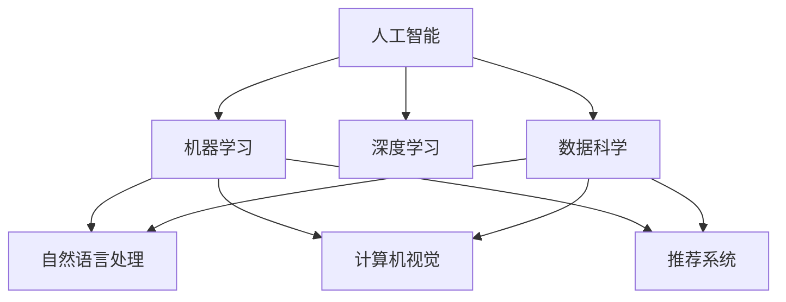

                 

# Python：人工智能开发的瑞士军刀

> 关键词：Python, 人工智能, 机器学习, 深度学习, 数据科学, 自然语言处理, 计算机视觉, 推荐系统

## 1. 背景介绍

### 1.1 问题由来

Python作为一种开源的、解释型的、面向对象的编程语言，因其简洁易读、功能强大、生态丰富、社区活跃等特点，逐渐成为人工智能开发的首选语言。Python在科学计算、数据分析、机器学习、深度学习、自然语言处理、计算机视觉等多个领域，都有广泛的应用。本文将深入探讨Python在人工智能领域的核心地位，通过介绍其核心概念、算法原理、应用场景及未来发展趋势，阐述Python为何被视为人工智能开发的“瑞士军刀”。

### 1.2 问题核心关键点

Python之所以能够在人工智能领域占据如此重要的地位，其核心关键点包括：

- **生态系统丰富**：Python拥有众多开源库和框架，如NumPy、Pandas、Scikit-learn、TensorFlow、PyTorch等，这些库和框架涵盖了数据处理、机器学习、深度学习、自然语言处理、计算机视觉等各个方面，极大地简化了人工智能项目开发流程。

- **社区活跃**：Python拥有庞大的社区支持，有大量的文档、教程、示例代码和开发人员支持，可以快速解决开发过程中遇到的问题。

- **语言简洁易读**：Python语言简洁易读，代码风格优美，易于理解，降低了开发门槛，加速了人工智能项目的迭代和部署。

- **跨平台性**：Python代码在多个操作系统和平台上都有良好兼容性，适应性强。

- **数据科学支持**：Python擅长处理和分析大规模数据，能够快速高效地进行数据科学和数据分析任务。

## 2. 核心概念与联系

### 2.1 核心概念概述

为了更好地理解Python在人工智能开发中的核心地位，本节将介绍几个密切相关的核心概念：

- **人工智能(AI)**：使用计算机科学和数学方法，使计算机系统能够模拟、延伸和扩展人的智能行为和思维过程。

- **机器学习(ML)**：使用数据和算法，让计算机从数据中学习，自动识别模式和规律，并做出预测或决策。

- **深度学习(DL)**：一种特殊的机器学习方法，通过多层次的神经网络结构，模拟人类大脑的学习和推理过程，处理大规模非结构化数据。

- **数据科学**：使用数据分析、数据挖掘、统计学等方法，从数据中提取知识和洞察力，指导决策和业务发展。

- **自然语言处理(NLP)**：使计算机能够理解、处理和生成自然语言，包括文本分析、情感分析、机器翻译等。

- **计算机视觉(CV)**：让计算机能够识别、理解和处理图像和视频数据，包括图像分类、目标检测、图像分割等。

- **推荐系统(Recommendation System)**：通过分析用户行为和偏好，推荐个性化的内容或产品，提升用户体验。

这些核心概念之间的逻辑关系可以通过以下Mermaid流程图来展示：



这个流程图展示了一些核心概念之间的连接关系，可以看出Python在人工智能各分支中的应用深度和广度。

## 3. 核心算法原理 & 具体操作步骤
### 3.1 算法原理概述

Python在人工智能领域的应用，涵盖了从数据处理到模型训练的各个环节。以下将介绍几个核心算法的原理：

- **数据预处理**：Python提供了Pandas、NumPy等库，用于数据的清洗、转换、统计和分析，为后续的机器学习和深度学习任务奠定基础。

- **模型训练**：Python提供了Scikit-learn、TensorFlow、PyTorch等框架，用于构建和训练各种机器学习和深度学习模型。

- **模型评估**：Python提供了各种评估指标和工具，如AUC、RMSE、精度、召回率等，用于评估模型的性能和泛化能力。

- **模型部署**：Python提供了Flask、Django等Web框架，用于将训练好的模型部署为Web服务，方便实际应用调用。

### 3.2 算法步骤详解

以深度学习模型为例，以下是Python中构建和训练深度学习模型的详细步骤：

1. **环境搭建**：安装Python解释器，安装必要的库和框架，如TensorFlow、Keras、NumPy等。

2. **数据准备**：收集和整理数据集，并进行预处理，如标准化、归一化、数据增强等。

3. **模型构建**：使用Keras等深度学习框架构建神经网络模型，定义模型的层数、激活函数、损失函数、优化器等。

4. **模型训练**：使用训练数据集对模型进行训练，调整模型参数以最小化损失函数。

5. **模型评估**：使用测试数据集对模型进行评估，计算各种评估指标，如准确率、召回率、F1分数等。

6. **模型部署**：将训练好的模型导出并部署为Web服务，使用Flask或Django等框架实现。

7. **模型优化**：根据评估结果，调整模型结构和超参数，进行模型微调，提升模型性能。

### 3.3 算法优缺点

Python在人工智能开发中具有以下优点：

- **简洁易读**：Python代码简洁易懂，易于阅读和维护。

- **生态系统丰富**：Python拥有丰富的库和框架，覆盖了人工智能的各个领域。

- **社区活跃**：Python拥有庞大的社区支持，有大量的文档、教程、示例代码和开发人员支持。

- **数据科学支持**：Python擅长处理和分析大规模数据，能够快速高效地进行数据科学和数据分析任务。

- **跨平台性**：Python代码在多个操作系统和平台上都有良好兼容性，适应性强。

然而，Python也存在一些缺点：

- **执行效率**：Python解释型语言的执行效率一般，不适合高计算量的任务。

- **GIL瓶颈**：Python的全局解释器锁(GIL)限制了多线程并发执行，影响性能。

- **内存管理**：Python的内存管理相对复杂，可能导致内存泄漏和性能问题。

## 4. 数学模型和公式 & 详细讲解  
### 4.1 数学模型构建

在人工智能开发中，数学模型和算法是核心基础。以下是一些常用的数学模型和算法：

- **线性回归**：用于预测连续型变量的值，公式为：$y = \theta_0 + \theta_1x_1 + \theta_2x_2 + ... + \theta_nx_n$。

- **逻辑回归**：用于预测二分类问题，公式为：$y = \sigma(\theta_0 + \theta_1x_1 + \theta_2x_2 + ... + \theta_nx_n)$，其中$\sigma$为sigmoid函数。

- **神经网络**：用于处理大规模非结构化数据，包括多层感知器(MLP)、卷积神经网络(CNN)、循环神经网络(RNN)等，结构复杂，但效果显著。

- **支持向量机(SVM)**：用于分类和回归问题，通过在高维空间中找到最优超平面，公式为：$w = \arg\min_{w} \frac{1}{2}||w||^2 + C\sum_{i=1}^N [1 - y_i(w \cdot x_i + b)]_+$。

- **随机森林**：用于处理分类和回归问题，通过集成多个决策树，公式为：$f(x) = \frac{1}{N} \sum_{i=1}^N f_i(x)$。

### 4.2 公式推导过程

以线性回归为例，以下是公式的推导过程：

假设有一组数据集$(x_i, y_i)$，$i=1,2,...,n$，其中$x_i$为自变量，$y_i$为因变量。线性回归的目标是找到最优的线性关系$y = \theta_0 + \theta_1x_1 + \theta_2x_2 + ... + \theta_nx_n$，使得预测值与实际值之间的误差最小。

假设误差函数为$J(\theta) = \frac{1}{2m} \sum_{i=1}^m (y_i - \hat{y}_i)^2$，其中$m$为样本数量，$\hat{y}_i$为预测值。

根据梯度下降算法，求解最小化误差函数的目标函数为：

$$
\theta_j = \theta_j - \eta \frac{\partial J(\theta)}{\partial \theta_j}
$$

其中，$\eta$为学习率，$\partial J(\theta)/\partial \theta_j$为误差函数对$\theta_j$的偏导数。

根据误差函数的定义，$\partial J(\theta)/\partial \theta_j$可以表示为：

$$
\frac{\partial J(\theta)}{\partial \theta_j} = -\frac{1}{m} \sum_{i=1}^m (y_i - \hat{y}_i)x_{ij}
$$

将公式代入求解即可得到$\theta_j$的更新公式。

### 4.3 案例分析与讲解

以手写数字识别为例，以下是使用Python和Keras实现线性回归模型的步骤：

1. **数据准备**：使用MNIST数据集，将手写数字图片转化为向量形式。

2. **模型构建**：定义线性回归模型，包括输入层、隐藏层、输出层和损失函数。

3. **模型训练**：使用训练数据集对模型进行训练，调整模型参数以最小化损失函数。

4. **模型评估**：使用测试数据集对模型进行评估，计算准确率等评估指标。

5. **模型部署**：将训练好的模型导出并部署为Web服务，使用Flask或Django等框架实现。

## 5. 项目实践：代码实例和详细解释说明
### 5.1 开发环境搭建

在进行人工智能项目开发前，需要进行环境搭建。以下是使用Python进行Keras开发的环境配置流程：

1. 安装Anaconda：从官网下载并安装Anaconda，用于创建独立的Python环境。

2. 创建并激活虚拟环境：
```bash
conda create -n py3k python=3.6
conda activate py3k
```

3. 安装Keras：
```bash
pip install keras
```

4. 安装必要的库：
```bash
pip install numpy pandas matplotlib scikit-learn
```

完成上述步骤后，即可在虚拟环境中开始人工智能项目的开发。

### 5.2 源代码详细实现

以下是使用Python和Keras实现手写数字识别项目的完整代码实现：

```python
import numpy as np
from keras.datasets import mnist
from keras.models import Sequential
from keras.layers import Dense
from keras.utils import to_categorical

# 加载MNIST数据集
(x_train, y_train), (x_test, y_test) = mnist.load_data()

# 数据预处理
x_train = x_train.reshape(60000, 784) / 255.0
x_test = x_test.reshape(10000, 784) / 255.0
y_train = to_categorical(y_train)
y_test = to_categorical(y_test)

# 定义模型
model = Sequential()
model.add(Dense(64, activation='relu', input_dim=784))
model.add(Dense(10, activation='softmax'))

# 编译模型
model.compile(loss='categorical_crossentropy', optimizer='adam', metrics=['accuracy'])

# 训练模型
model.fit(x_train, y_train, epochs=10, batch_size=64, validation_data=(x_test, y_test))

# 评估模型
loss, acc = model.evaluate(x_test, y_test)
print('Test accuracy:', acc)

# 导出模型
model.save('mnist_model.h5')
```

以上是使用Python和Keras实现手写数字识别项目的完整代码实现。可以看到，Keras的接口简洁易用，能够快速搭建和训练深度学习模型，大大简化了模型开发流程。

### 5.3 代码解读与分析

让我们再详细解读一下关键代码的实现细节：

**数据预处理**：
- `x_train = x_train.reshape(60000, 784) / 255.0`：将原始图片数据转换为向量形式，并进行归一化处理。

**模型构建**：
- `model.add(Dense(64, activation='relu', input_dim=784))`：定义一个包含64个神经元的隐藏层，激活函数为ReLU。
- `model.add(Dense(10, activation='softmax'))`：定义一个包含10个神经元的输出层，激活函数为softmax，用于多分类问题。

**模型训练**：
- `model.fit(x_train, y_train, epochs=10, batch_size=64, validation_data=(x_test, y_test))`：对模型进行10轮训练，每轮使用64个样本进行批量训练，并在验证集上进行性能评估。

**模型评估**：
- `model.evaluate(x_test, y_test)`：对模型在测试集上进行评估，计算准确率等评估指标。

**模型导出**：
- `model.save('mnist_model.h5')`：将训练好的模型保存为HDF5格式的文件，方便后续调用和部署。

## 6. 实际应用场景
### 6.1 智能推荐系统

人工智能在推荐系统中的应用广泛，涵盖了电商、社交、新闻等多个领域。智能推荐系统能够根据用户的历史行为和偏好，推荐个性化的内容或产品，提升用户体验和满意度。

以电商推荐系统为例，以下是使用Python和Keras实现推荐系统的步骤：

1. **数据准备**：收集用户的历史浏览、点击、购买数据，并进行预处理。

2. **模型训练**：使用协同过滤算法、深度学习模型等方法，对用户和物品进行建模。

3. **模型评估**：使用测试数据集对模型进行评估，计算各种评估指标，如准确率、召回率、F1分数等。

4. **模型部署**：将训练好的模型导出并部署为Web服务，使用Flask或Django等框架实现。

5. **模型优化**：根据评估结果，调整模型结构和超参数，进行模型微调，提升模型性能。

### 6.2 自然语言处理

自然语言处理(NLP)是人工智能的重要分支，包括文本分类、情感分析、机器翻译、命名实体识别等多个任务。Python在NLP领域的应用也非常广泛，使用PyTorch、TensorFlow等框架，可以实现高效的NLP模型训练和推理。

以文本分类为例，以下是使用Python和TensorFlow实现文本分类的步骤：

1. **数据准备**：收集文本数据，并进行预处理，如分词、去除停用词、特征提取等。

2. **模型构建**：使用卷积神经网络(CNN)、循环神经网络(RNN)等模型，对文本进行建模。

3. **模型训练**：使用训练数据集对模型进行训练，调整模型参数以最小化损失函数。

4. **模型评估**：使用测试数据集对模型进行评估，计算准确率等评估指标。

5. **模型部署**：将训练好的模型导出并部署为Web服务，使用Flask或Django等框架实现。

6. **模型优化**：根据评估结果，调整模型结构和超参数，进行模型微调，提升模型性能。

### 6.3 计算机视觉

计算机视觉(CV)是人工智能的另一重要分支，包括图像分类、目标检测、图像分割等任务。Python在CV领域的应用也非常广泛，使用OpenCV、Keras等框架，可以实现高效的CV模型训练和推理。

以图像分类为例，以下是使用Python和Keras实现图像分类的步骤：

1. **数据准备**：收集图像数据，并进行预处理，如标准化、归一化、数据增强等。

2. **模型构建**：使用卷积神经网络(CNN)等模型，对图像进行建模。

3. **模型训练**：使用训练数据集对模型进行训练，调整模型参数以最小化损失函数。

4. **模型评估**：使用测试数据集对模型进行评估，计算准确率等评估指标。

5. **模型部署**：将训练好的模型导出并部署为Web服务，使用Flask或Django等框架实现。

6. **模型优化**：根据评估结果，调整模型结构和超参数，进行模型微调，提升模型性能。

## 7. 工具和资源推荐
### 7.1 学习资源推荐

为了帮助开发者系统掌握Python在人工智能开发中的应用，这里推荐一些优质的学习资源：

1. 《Python深度学习》书籍：由Francois Chollet撰写，全面介绍了使用Keras和TensorFlow构建深度学习模型的过程，适合初学者入门。

2. 《Python机器学习》书籍：由Sebastian Raschka撰写，介绍了使用Scikit-learn和Python进行机器学习建模的流程，适合进阶学习。

3. 《TensorFlow官方文档》：Google官方提供的TensorFlow文档，详细介绍了TensorFlow的API和用法，是学习和使用TensorFlow的必备资源。

4. 《Keras官方文档》：Keras官方提供的文档，介绍了Keras的API和用法，是学习和使用Keras的必备资源。

5. PyTorch官方教程：PyTorch官方提供的教程，介绍了PyTorch的API和用法，是学习和使用PyTorch的必备资源。

通过这些资源的学习，相信你一定能够快速掌握Python在人工智能开发中的应用，并用于解决实际的AI问题。

### 7.2 开发工具推荐

高效的开发离不开优秀的工具支持。以下是几款用于人工智能开发常用的工具：

1. PyTorch：由Facebook开发的深度学习框架，动态计算图，支持GPU加速，适合研究和生产。

2. TensorFlow：由Google开发的深度学习框架，静态计算图，支持GPU和TPU加速，适合生产。

3. Keras：由Francois Chollet开发的深度学习框架，简单易用，支持多种后端，适合快速原型开发。

4. Jupyter Notebook：开源的Web笔记本，支持Python、R等多种语言，方便编写和调试代码。

5. Anaconda：开源的Python发行版本，集成了Python、NumPy、Pandas、Scikit-learn等常用库，适合快速搭建环境。

合理利用这些工具，可以显著提升人工智能项目的开发效率，加快创新迭代的步伐。

### 7.3 相关论文推荐

Python在人工智能领域的发展得益于学界的持续研究。以下是几篇奠基性的相关论文，推荐阅读：

1. 《Python as a High-Level Language for Deep Learning》：由Yoshua Bengio等撰写，介绍了使用Python进行深度学习的优势和最佳实践。

2. 《TensorFlow: A System for Large-Scale Machine Learning》：由Martín Abadi等撰写，介绍了TensorFlow的架构和应用。

3. 《Keras: Deep Learning for Humans》：由Francois Chollet撰写，介绍了Keras的API和用法。

4. 《PyTorch: Tensors and Dynamic neural networks in Python with strong GPU acceleration》：由Halothetarion等撰写，介绍了PyTorch的架构和应用。

这些论文代表了大数据和人工智能研究的最新成果，通过学习这些前沿成果，可以帮助研究者把握学科前进方向，激发更多的创新灵感。

## 8. 总结：未来发展趋势与挑战

### 8.1 总结

本文对Python在人工智能开发中的应用进行了全面系统的介绍。首先阐述了Python在生态系统、社区支持、语言简洁性、跨平台性等方面的核心优势，明确了Python在人工智能开发中的重要地位。其次，从数据处理到模型训练，从模型评估到模型部署，详细讲解了Python在人工智能开发中的各个环节。最后，探讨了Python在人工智能开发中的未来发展趋势和面临的挑战，阐述了Python作为“瑞士军刀”的重要价值。

通过本文的系统梳理，可以看到，Python在人工智能开发中的作用举足轻重，从数据科学到机器学习，从深度学习到自然语言处理，Python的应用无处不在。未来，伴随Python社区和生态的不断壮大，Python必将在人工智能领域发挥更加重要的作用，引领人工智能技术的创新和发展。

### 8.2 未来发展趋势

展望未来，Python在人工智能领域的应用将呈现以下几个发展趋势：

1. **生态系统进一步丰富**：随着Python社区的不断壮大，更多优秀的数据科学和机器学习库将涌现，进一步简化Python在人工智能开发中的应用。

2. **模型复杂度提高**：随着深度学习技术的不断发展，模型的复杂度将不断提高，Python的计算图优化和分布式计算能力将得到更大发挥。

3. **跨领域融合**：Python在人工智能领域的应用将更加广泛，涉及更多领域，如金融、医疗、智能交通等。

4. **数据科学地位提升**：Python在数据科学中的应用将更加重要，数据驱动的决策支持系统将成为主流。

5. **自动化和智能工具普及**：Python的自动化和智能开发工具将更加普及，如自动化测试、代码生成、智能调试等，提高开发效率。

6. **跨平台支持增强**：Python在不同平台上的支持将更加完善，实现更广泛的跨平台应用。

### 8.3 面临的挑战

尽管Python在人工智能开发中具有许多优势，但在迈向更加智能化、普适化应用的过程中，仍然面临诸多挑战：

1. **执行效率**：Python解释型语言的执行效率一般，不适合高计算量的任务。

2. **GIL瓶颈**：Python的全局解释器锁(GIL)限制了多线程并发执行，影响性能。

3. **内存管理**：Python的内存管理相对复杂，可能导致内存泄漏和性能问题。

4. **生态系统不统一**：Python的生态系统虽然丰富，但不同库和框架之间的接口兼容性较差。

5. **学习曲线较陡**：Python的学习曲线较陡，初学者容易遇到各种问题，需要较长时间的学习和实践。

### 8.4 研究展望

面对Python在人工智能开发中面临的挑战，未来的研究需要在以下几个方面寻求新的突破：

1. **优化Python性能**：通过引入JIT编译器、多线程优化等技术，提高Python的执行效率和并发性能。

2. **增强生态系统兼容性**：推动不同库和框架之间的接口标准化，提高Python生态系统的兼容性。

3. **降低学习曲线**：开发更加友好的开发工具和教程，降低Python的学习门槛，吸引更多开发者。

4. **丰富跨领域应用**：进一步拓展Python在金融、医疗、智能交通等垂直领域的应用，推动Python在各行业中的普及。

通过在这些方面的研究，Python必将在未来的人工智能开发中发挥更加重要的作用，为人工智能技术的落地和应用提供更加强大的支撑。总之，Python作为人工智能开发的“瑞士军刀”，其价值不可替代，未来也将继续引领人工智能技术的发展和创新。

## 9. 附录：常见问题与解答

**Q1：Python有哪些优势和劣势？**

A: Python在人工智能开发中的优势包括：

- **生态系统丰富**：Python拥有众多开源库和框架，如NumPy、Pandas、Scikit-learn、TensorFlow、PyTorch等，这些库和框架涵盖了数据处理、机器学习、深度学习、自然语言处理、计算机视觉等各个方面，极大地简化了人工智能项目开发流程。

- **语言简洁易读**：Python语言简洁易懂，代码风格优美，易于理解，降低了开发门槛，加速了人工智能项目的迭代和部署。

- **社区活跃**：Python拥有庞大的社区支持，有大量的文档、教程、示例代码和开发人员支持。

- **数据科学支持**：Python擅长处理和分析大规模数据，能够快速高效地进行数据科学和数据分析任务。

Python在人工智能开发中的劣势包括：

- **执行效率**：Python解释型语言的执行效率一般，不适合高计算量的任务。

- **GIL瓶颈**：Python的全局解释器锁(GIL)限制了多线程并发执行，影响性能。

- **内存管理**：Python的内存管理相对复杂，可能导致内存泄漏和性能问题。

**Q2：Python在数据科学和机器学习中的应用有哪些？**

A: Python在数据科学和机器学习中的应用非常广泛，包括以下几个方面：

- **数据处理和分析**：使用Pandas、NumPy等库进行数据清洗、转换、统计和分析，为后续的机器学习和深度学习任务奠定基础。

- **机器学习**：使用Scikit-learn、TensorFlow、PyTorch等框架，构建和训练各种机器学习和深度学习模型。

- **深度学习**：使用TensorFlow、PyTorch等框架，构建和训练复杂的神经网络模型，处理大规模非结构化数据。

- **自然语言处理**：使用NLTK、SpaCy等库，处理和分析自然语言文本，实现文本分类、情感分析、机器翻译等任务。

- **计算机视觉**：使用OpenCV、Keras等库，处理和分析图像和视频数据，实现图像分类、目标检测、图像分割等任务。

- **推荐系统**：使用协同过滤算法、深度学习模型等方法，对用户和物品进行建模，实现个性化推荐。

Python在数据科学和机器学习中的应用非常广泛，覆盖了各个领域和任务，为人工智能开发提供了强大的工具和支持。

**Q3：如何使用Python进行模型微调？**

A: 模型微调是人工智能开发中的重要环节，以下是使用Python和Keras进行模型微调的步骤：

1. **数据准备**：收集和整理数据集，并进行预处理，如标准化、归一化、数据增强等。

2. **模型构建**：使用Keras等深度学习框架构建神经网络模型，定义模型的层数、激活函数、损失函数、优化器等。

3. **模型训练**：使用训练数据集对模型进行训练，调整模型参数以最小化损失函数。

4. **模型评估**：使用测试数据集对模型进行评估，计算各种评估指标，如准确率、召回率、F1分数等。

5. **模型微调**：根据评估结果，调整模型结构和超参数，进行模型微调，提升模型性能。

6. **模型部署**：将训练好的模型导出并部署为Web服务，使用Flask或Django等框架实现。

通过这些步骤，使用Python和Keras可以高效地进行模型微调，提升模型性能和泛化能力，使其更好地适应实际应用场景。

**Q4：Python在实际应用中需要注意哪些问题？**

A: 在实际应用中，使用Python进行人工智能开发需要注意以下几个问题：

1. **数据准备**：收集和整理数据集，并进行预处理，如标准化、归一化、数据增强等，确保数据质量。

2. **模型选择**：根据具体任务选择合适的模型，如线性回归、逻辑回归、深度学习模型等，确保模型适用性。

3. **超参数调优**：调整模型结构和超参数，进行模型微调，提升模型性能。

4. **模型评估**：使用测试数据集对模型进行评估，计算各种评估指标，如准确率、召回率、F1分数等，确保模型效果。

5. **模型部署**：将训练好的模型导出并部署为Web服务，使用Flask或Django等框架实现，确保模型可用性。

6. **模型优化**：根据评估结果，调整模型结构和超参数，进行模型优化，提升模型性能。

通过合理解决这些问题，使用Python进行人工智能开发可以高效、准确地实现各种人工智能应用，取得良好的效果。

**Q5：Python在实际应用中如何提高性能？**

A: 提高Python在实际应用中的性能，可以采取以下几种措施：

1. **使用Cython或Numba进行性能优化**：Cython和Numba是Python的编译器和加速器，可以将Python代码编译成C语言代码，提高执行效率。

2. **使用多线程或异步编程**：使用Python的多线程或异步编程机制，提高并发执行效率。

3. **使用GPU或TPU进行加速**：使用GPU或TPU进行深度学习模型的计算，提高计算效率。

4. **使用分布式计算**：使用Spark、Ray等分布式计算框架，提高大规模数据处理和计算效率。

5. **优化内存管理**：使用Python的内存管理工具，如objgraph、memory_profiler等，优化内存使用，减少内存泄漏和垃圾回收开销。

6. **代码优化**：优化Python代码，如减少不必要的函数调用、使用列表推导式、避免循环嵌套等，提高代码执行效率。

通过这些措施，可以显著提高Python在实际应用中的性能，满足高性能计算的需求。

---

作者：禅与计算机程序设计艺术 / Zen and the Art of Computer Programming

