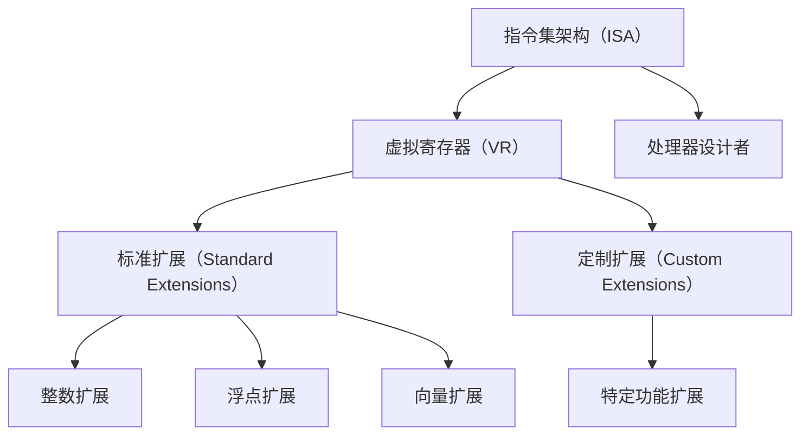

                 

## 1. 背景介绍

### 1.1 问题由来
随着半导体行业的发展，微处理器架构的多样性日益增加。从传统的CISC架构到RISC架构，再到现代的高性能微处理器架构，每一种架构都在不断地演进和优化。然而，现有的主流架构，如x86和ARM，往往受限于芯片设计成本、授权费用和生态系统限制，使得它们的普及和应用面临诸多挑战。

在这种背景下，RISC-V应运而生。RISC-V是一种开源、可自由使用的指令集架构（ISA），旨在提供一种灵活、高效、低成本的微处理器设计平台，以满足不同应用场景的需求。

### 1.2 问题核心关键点
RISC-V作为新兴的微处理器架构，其核心优势在于以下几个方面：

- **开源性**：RISC-V是完全开源的，任何组织和个人都可以自由使用、修改和传播，这为学术研究、创新实验和商业应用提供了极大的便利。
- **灵活性**：RISC-V指令集提供了多种变体，能够满足从嵌入式设备到超级计算机等不同领域的需求。
- **低成本**：RISC-V架构的简洁性和通用性使其在设计和生产成本上具有显著优势，特别是在面向教育、科研、智能物联网等低成本市场时，具有不可比拟的竞争优势。
- **高性能**：RISC-V架构通过一系列优化设计，如流水线、向量扩展等，提供了接近或超越现有主流架构的性能表现。
- **生态系统**：RISC-V社区不断壮大，越来越多的组织和企业加入其中，推动了软硬件生态系统的完善和发展。

## 2. 核心概念与联系

### 2.1 核心概念概述

RISC-V作为一种新兴的微处理器架构，其核心概念主要包括以下几个方面：

- **指令集架构（ISA）**：RISC-V的ISA定义了一组基本的指令集，用于执行数据处理、内存访问、控制流等操作。
- **虚拟寄存器（VR）**：RISC-V的虚拟寄存器提供了一种抽象机制，允许处理器设计者灵活地映射到物理寄存器上。
- **标准扩展（Standard Extensions）**：RISC-V支持多个标准扩展，如整数扩展、浮点扩展、向量扩展等，以应对不同应用的需求。
- **定制扩展（Custom Extensions）**：开发者可以根据需要添加自己的定制扩展，实现特定的功能。

这些核心概念之间相互关联，构成了RISC-V架构的完整框架。通过这些概念，RISC-V能够在保持高效性和灵活性的同时，支持多种应用场景的需求。

### 2.2 核心概念原理和架构的 Mermaid 流程图



## 3. 核心算法原理 & 具体操作步骤

### 3.1 算法原理概述

RISC-V微处理器架构的设计遵循了RISC（Reduced Instruction Set Computing）原则，即通过减少指令集的数量和复杂性，提高处理器的效率和灵活性。RISC-V架构的核心算法原理包括：

- **寄存器-存储器结构**：RISC-V架构强调寄存器-存储器结构，通过减少对存储器的访问次数，提高处理器的效率。
- **固定长度指令**：RISC-V架构使用固定长度的指令，简化了指令的解析和执行过程。
- **流水线技术**：RISC-V架构支持流水线技术，通过并行执行多个指令，提高处理器的吞吐量。
- **高效中断机制**：RISC-V架构提供了高效的中断机制，支持高优先级中断和低优先级中断的灵活处理。

### 3.2 算法步骤详解

RISC-V微处理器的设计流程主要包括以下几个步骤：

1. **架构设计**：确定指令集架构和标准扩展，设计虚拟寄存器结构。
2. **硬件实现**：将指令集和虚拟寄存器映射到物理硬件上，设计寄存器文件、指令译码器、流水线等。
3. **系统软件设计**：开发操作系统和编译器，支持特定应用场景的需求。
4. **测试和优化**：对微处理器进行测试和优化，确保性能和可靠性。

### 3.3 算法优缺点

RISC-V架构的主要优点包括：

- **灵活性和可扩展性**：RISC-V架构提供了丰富的标准扩展和定制扩展，能够满足不同应用场景的需求。
- **低成本和开放性**：RISC-V架构的开源性质使其在设计和生产成本上具有显著优势。
- **高性能和高效率**：RISC-V架构通过一系列优化设计，如流水线、向量扩展等，提供了接近或超越现有主流架构的性能表现。

RISC-V架构的缺点主要在于：

- **生态系统不成熟**：尽管RISC-V社区不断壮大，但其软硬件生态系统相比于x86和ARM等主流架构仍然不成熟。
- **标准化程度不高**：RISC-V架构的各个组件和扩展的标准化程度有待进一步提高。

### 3.4 算法应用领域

RISC-V架构在多个领域得到了广泛应用，主要包括：

- **嵌入式系统**：RISC-V架构特别适合低成本、低功耗的嵌入式设备，如物联网（IoT）设备、智能家居等。
- **高性能计算**：RISC-V架构的性能表现接近或超越现有主流架构，适用于高性能计算和数据中心等领域。
- **教育科研**：RISC-V架构的灵活性和开放性使其成为教育和科研领域的理想选择，促进了计算机科学教育的发展。
- **国防安全**：RISC-V架构的安全性和可控性使其在国防和军事领域具有重要应用价值。

## 4. 数学模型和公式 & 详细讲解 & 举例说明

### 4.1 数学模型构建

RISC-V架构的数学模型主要围绕指令集架构和虚拟寄存器展开。以下是一个简单的数学模型构建示例：

1. **指令集架构**：定义基本指令集，如加法、减法、乘法等。指令集可以表示为：

   $$
   \text{指令集} = \{I_A, I_B, I_C, ..., I_N\}
   $$

2. **虚拟寄存器**：定义虚拟寄存器结构，如整数寄存器、浮点寄存器等。虚拟寄存器可以表示为：

   $$
   \text{虚拟寄存器} = \{VR_A, VR_B, VR_C, ..., VR_M\}
   $$

3. **标准扩展**：定义标准扩展，如整数扩展、浮点扩展等。标准扩展可以表示为：

   $$
   \text{标准扩展} = \{ES_A, ES_B, ES_C, ..., ES_P\}
   $$

### 4.2 公式推导过程

以RISC-V架构中的加法指令为例，推导其执行过程：

1. **指令格式**：加法指令的基本格式为：

   $$
   ADD \quad R_D, R_S, R_T
   $$

   其中，R_D表示目的寄存器，R_S表示源寄存器1，R_T表示源寄存器2。

2. **执行过程**：

   - 读取R_S和R_T的值。
   - 将R_S和R_T的值相加，得到结果。
   - 将结果写入R_D寄存器。

3. **计算过程**：

   $$
   R_D = R_S + R_T
   $$

### 4.3 案例分析与讲解

以下是一个具体的案例分析：

假设我们要在RISC-V架构上实现一个简单的加法器。首先需要定义加法指令的格式，如下所示：

$$
\text{ADD} \quad \text{R}_D, \text{R}_S, \text{R}_T
$$

其中，$\text{R}_D$ 表示目的寄存器，$\text{R}_S$ 和 $\text{R}_T$ 表示两个源寄存器。加法指令的执行过程可以分为以下几个步骤：

1. 从寄存器 $\text{R}_S$ 和 $\text{R}_T$ 中读取数据。

2. 将两个数据相加，并将结果存储到寄存器 $\text{R}_D$ 中。

具体实现步骤如下：

1. 从寄存器 $\text{R}_S$ 和 $\text{R}_T$ 中读取数据。

   $$
   A = \text{R}_S, B = \text{R}_T
   $$

2. 将两个数据相加，并将结果存储到寄存器 $\text{R}_D$ 中。

   $$
   \text{R}_D = A + B
   $$

## 5. 项目实践：代码实例和详细解释说明

### 5.1 开发环境搭建

要搭建RISC-V微处理器的开发环境，需要以下步骤：

1. **安装RISC-V工具链**：安装GCC、LLVM等编译器，用于生成目标代码。

2. **安装FPGA开发环境**：安装FPGA开发工具，如Xilinx或Microsemi等，用于验证和调试微处理器。

3. **安装仿真器**：安装模拟软件，如GDB或QEMU，用于仿真微处理器行为。

4. **搭建测试平台**：搭建一个硬件测试平台，如系统板或测试机，用于测试微处理器的性能和稳定性。

### 5.2 源代码详细实现

以下是一个简单的RISC-V微处理器源代码实现示例：

```c
// RISC-V微处理器源代码

#include <stdio.h>

// 定义虚拟寄存器
typedef unsigned int vreg;

// 定义指令集
#define ADD 0x20
#define SUB 0x22

// 定义加法指令实现
void add(vreg a, vreg b, vreg *c) {
    *c = a + b;
}

int main() {
    // 初始化寄存器
    vreg r0 = 5, r1 = 7, r2 = 0;

    // 执行加法指令
    add(r0, r1, &r2);

    // 输出结果
    printf("Result: %d\n", r2);

    return 0;
}
```

### 5.3 代码解读与分析

在上述代码中，我们定义了虚拟寄存器和基本指令集，并通过函数实现了加法指令的执行。具体步骤如下：

1. 定义虚拟寄存器类型 `vreg`，用于表示虚拟寄存器的值。

2. 定义基本指令集，包括加法指令 `ADD` 和减法指令 `SUB`。

3. 实现加法指令 `add`，将两个寄存器的值相加，并将结果存储到第三个寄存器中。

4. 在主函数中，初始化三个寄存器 `r0`、`r1` 和 `r2`，并执行加法指令。

5. 输出结果到控制台。

## 6. 实际应用场景

### 6.1 嵌入式系统

RISC-V架构特别适合低成本、低功耗的嵌入式设备，如物联网（IoT）设备、智能家居等。例如，在智能家居设备中，RISC-V微处理器可以通过WIFI或蓝牙与手机或云端服务器通信，实现远程控制、环境监测等功能。

### 6.2 高性能计算

RISC-V架构的性能表现接近或超越现有主流架构，适用于高性能计算和数据中心等领域。例如，在数据中心中，RISC-V微处理器可以作为服务器的主处理单元，支持大规模数据处理和云计算应用。

### 6.3 教育科研

RISC-V架构的灵活性和开放性使其成为教育和科研领域的理想选择，促进了计算机科学教育的发展。例如，在计算机科学教育中，学生可以使用RISC-V微处理器进行实验和研究，深入理解微处理器的工作原理和优化技术。

### 6.4 国防安全

RISC-V架构的安全性和可控性使其在国防和军事领域具有重要应用价值。例如，在国防安全中，RISC-V微处理器可以用于设计和实现安全的通信协议和加密算法，保障通信和数据的安全。

## 7. 工具和资源推荐

### 7.1 学习资源推荐

为了帮助开发者系统掌握RISC-V架构的原理和实践，以下是一些优质的学习资源：

1. RISC-V官方文档：RISC-V基金会提供了详细的架构文档，涵盖了指令集、扩展、标准等各方面的内容。

2. RISC-V代码实现：GitHub上有很多开源的RISC-V微处理器实现，如Chipkit、FreeRTOS等，可以学习和参考。

3. 《RISC-V指令集架构与实现》书籍：详细介绍了RISC-V指令集架构的原理和实现方法，适合深入学习。

### 7.2 开发工具推荐

以下是几款用于RISC-V微处理器开发的常用工具：

1. GCC：RISC-V的编译器，支持多种操作系统和编译器选项。

2. LLVM：开源的编译器基础设施，支持RISC-V架构的编译和优化。

3. QEMU：开源的虚拟化软件，支持RISC-V架构的仿真和调试。

4. GDB：开源的调试器，支持RISC-V架构的调试功能。

5. Verilog：开源的硬件描述语言，支持RISC-V微处理器的逻辑设计和仿真。

### 7.3 相关论文推荐

RISC-V架构的研究源于学界的持续研究。以下是几篇奠基性的相关论文，推荐阅读：

1. RISC-V: A New IEEE Standard for Simplified Instruction Set Computers（IEEE Transactions on Computers, 2017）

2. Reduced Instruction Set Computing（IEEE Micro, 1975）

3. RISC and CISC Comparisons：A Personal View（ACM Computing Surveys, 1991）

## 8. 总结：未来发展趋势与挑战

### 8.1 总结

本文对RISC-V架构进行了全面系统的介绍。首先阐述了RISC-V架构的研究背景和意义，明确了RISC-V架构的开源性、灵活性、低成本等核心优势。其次，从原理到实践，详细讲解了RISC-V架构的指令集架构、虚拟寄存器等核心概念，并提供了完整的代码实现示例。同时，本文还广泛探讨了RISC-V架构在嵌入式系统、高性能计算、教育科研、国防安全等多个领域的应用前景，展示了RISC-V架构的广阔前景。

通过本文的系统梳理，可以看到，RISC-V架构作为新兴的微处理器架构，已经在多个领域展示了其优越性，具有广阔的发展空间。

### 8.2 未来发展趋势

展望未来，RISC-V架构将呈现以下几个发展趋势：

1. **生态系统完善**：随着更多硬件和软件支持RISC-V架构，其生态系统将逐步完善，成为主流微处理器架构的有力竞争者。

2. **高性能和可扩展性**：RISC-V架构将不断优化其指令集和扩展，支持更多应用场景，提高性能和可扩展性。

3. **标准化程度提高**：RISC-V架构的标准化程度将不断提高，为开发和应用提供更可靠的基础。

4. **安全性和可靠性增强**：RISC-V架构将不断提升其安全性和可靠性，为在国防、科研等领域的应用提供更强的保障。

5. **生态系统多样性**：RISC-V架构将支持更多应用场景，如移动设备、桌面设备等，拓展其应用范围。

以上趋势凸显了RISC-V架构的巨大潜力和发展方向，相信在未来的研究和发展中，RISC-V架构必将占据重要地位。

### 8.3 面临的挑战

尽管RISC-V架构已经取得了一定的进展，但在迈向更加智能化、普适化应用的过程中，它仍面临着诸多挑战：

1. **生态系统不成熟**：尽管RISC-V社区不断壮大，但其软硬件生态系统相比于x86和ARM等主流架构仍然不成熟，制约了其在实际应用中的推广和普及。

2. **标准化程度不高**：RISC-V架构的各个组件和扩展的标准化程度有待进一步提高，增加了应用和开发的复杂性。

3. **性能优化**：RISC-V架构需要进一步优化其性能，提高其竞争力，特别是在高性能计算和数据中心等领域。

4. **成本问题**：尽管RISC-V架构在成本上具有优势，但在某些应用场景下，其成本仍然可能较高，制约了其大规模应用。

5. **教育和科研支持不足**：尽管RISC-V架构在教育和科研领域具有优势，但其在教育资源和科研支持方面的不足，限制了其进一步发展。

### 8.4 研究展望

面对RISC-V架构所面临的挑战，未来的研究需要在以下几个方面寻求新的突破：

1. **生态系统建设**：加强RISC-V社区的建设，推动更多硬件和软件支持RISC-V架构，促进生态系统的完善。

2. **标准化工作**：推动RISC-V架构的标准化工作，提高其标准化程度，降低应用和开发的复杂性。

3. **性能优化**：优化RISC-V架构的性能，提高其竞争力，特别是在高性能计算和数据中心等领域。

4. **成本控制**：控制RISC-V架构的成本，使其在更多应用场景中具有竞争力。

5. **教育和科研支持**：加强RISC-V架构在教育资源和科研支持方面的投入，推动其进一步发展。

这些研究方向的探索，必将引领RISC-V架构迈向更高的台阶，为构建安全、可靠、可扩展的微处理器平台铺平道路。面向未来，RISC-V架构还需要与其他微处理器架构进行更深入的融合，共同推动计算机科学的发展。

## 9. 附录：常见问题与解答

**Q1：RISC-V架构与x86和ARM架构相比，有哪些优势和劣势？**

A: RISC-V架构相对于x86和ARM架构，有以下优势：

- **开源性**：RISC-V架构是完全开源的，任何人都可以自由使用、修改和传播。
- **灵活性**：RISC-V架构提供了丰富的标准扩展和定制扩展，能够满足不同应用场景的需求。
- **低成本**：RISC-V架构在设计和生产成本上具有显著优势，特别是在面向教育、科研、智能物联网等低成本市场时，具有不可比拟的竞争优势。

RISC-V架构相对于x86和ARM架构，也存在一些劣势：

- **生态系统不成熟**：尽管RISC-V社区不断壮大，但其软硬件生态系统相比于x86和ARM等主流架构仍然不成熟。
- **标准化程度不高**：RISC-V架构的各个组件和扩展的标准化程度有待进一步提高。

**Q2：RISC-V架构的性能表现如何？**

A: RISC-V架构的性能表现接近或超越现有主流架构，特别是在高性能计算和数据中心等领域。通过一系列优化设计，如流水线、向量扩展等，RISC-V架构提供了接近或超越现有主流架构的性能表现。

**Q3：RISC-V架构的主要应用场景有哪些？**

A: RISC-V架构在多个领域得到了广泛应用，主要包括：

- **嵌入式系统**：RISC-V架构特别适合低成本、低功耗的嵌入式设备，如物联网（IoT）设备、智能家居等。
- **高性能计算**：RISC-V架构的性能表现接近或超越现有主流架构，适用于高性能计算和数据中心等领域。
- **教育科研**：RISC-V架构的灵活性和开放性使其成为教育和科研领域的理想选择，促进了计算机科学教育的发展。
- **国防安全**：RISC-V架构的安全性和可控性使其在国防和军事领域具有重要应用价值。

**Q4：RISC-V架构的未来发展趋势是什么？**

A: RISC-V架构的未来发展趋势包括：

- **生态系统完善**：随着更多硬件和软件支持RISC-V架构，其生态系统将逐步完善，成为主流微处理器架构的有力竞争者。
- **高性能和可扩展性**：RISC-V架构将不断优化其指令集和扩展，支持更多应用场景，提高性能和可扩展性。
- **标准化程度提高**：RISC-V架构的标准化程度将不断提高，为开发和应用提供更可靠的基础。
- **安全性和可靠性增强**：RISC-V架构将不断提升其安全性和可靠性，为在国防、科研等领域的应用提供更强的保障。
- **生态系统多样性**：RISC-V架构将支持更多应用场景，如移动设备、桌面设备等，拓展其应用范围。

**Q5：RISC-V架构在教育和科研领域的应用前景是什么？**

A: RISC-V架构在教育和科研领域具有广阔的应用前景，主要体现在以下几个方面：

- **教育资源**：RISC-V架构的开源性和灵活性使其成为计算机科学教育的理想选择，学生可以使用RISC-V微处理器进行实验和研究，深入理解微处理器的工作原理和优化技术。
- **科研支持**：RISC-V架构的灵活性和开放性使其成为科研领域的理想选择，研究人员可以在RISC-V架构上进行多种创新的实验和研究，推动计算机科学的发展。

---

作者：禅与计算机程序设计艺术 / Zen and the Art of Computer Programming

