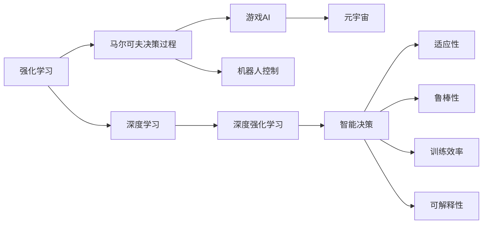

                 

# RL 在游戏和机器人中的应用

> 关键词：强化学习,深度学习,游戏AI,机器人控制,深度强化学习,元宇宙,智能决策

## 1. 背景介绍

### 1.1 问题由来
在过去的几十年里，人工智能（AI）的发展已经取得了巨大进展，特别是在机器学习（ML）和深度学习（DL）领域。然而，智能体如何在复杂环境中学习和做出决策这一问题，仍然是一个极具挑战性的难题。强化学习（Reinforcement Learning, RL）便是一个解决这一问题的框架。

强化学习是机器学习的一个重要分支，它旨在通过与环境交互来学习最优策略，从而实现特定目标。这一领域已经被广泛应用于游戏、机器人控制、智能决策、自适应系统等多个方面。其中，在游戏AI和机器人控制中的应用尤为突出，本文将详细探讨这两个领域的强化学习实践。

### 1.2 问题核心关键点
在游戏AI和机器人控制中，强化学习的应用具有以下核心关键点：
- **智能决策**：在复杂环境中，智能体如何做出最优决策以最大化奖励。
- **适应性**：智能体如何适应环境变化，保持稳定性能。
- **鲁棒性**：智能体在面对噪声、不确定性、和多样性等挑战时的表现。
- **训练效率**：如何在大规模、高维度状态空间中高效学习，避免过拟合和欠拟合。
- **可解释性**：如何使智能体的行为具有可解释性，增强用户信任和理解。

这些关键点不仅决定了强化学习在这些领域的成功与否，还定义了具体的技术挑战和研究方向。

## 2. 核心概念与联系

### 2.1 核心概念概述

为了更好地理解强化学习在游戏和机器人中的应用，本节将介绍几个核心概念及其联系：

- **强化学习**：通过智能体与环境的交互，智能体学习最优策略以最大化累积奖励的框架。
- **马尔可夫决策过程（MDP）**：定义了智能体与环境之间的交互形式，其中状态、动作、奖励和转移概率是四个基本要素。
- **深度学习**：利用神经网络进行状态表示和价值函数计算，提升强化学习的泛化能力和学习能力。
- **深度强化学习（DRL）**：将深度学习技术应用于强化学习，实现对复杂非线性问题的建模和解决。
- **元宇宙（Metaverse）**：通过AI技术构建的虚拟世界，为游戏AI和机器人控制提供了更广阔的应用场景。

这些概念之间存在紧密的联系，共同构成了强化学习在游戏和机器人领域的应用框架。

### 2.2 核心概念原理和架构的 Mermaid 流程图



这个流程图展示了强化学习、深度学习、马尔可夫决策过程、游戏AI、机器人控制、元宇宙、深度强化学习、智能决策、适应性、鲁棒性、训练效率和可解释性这些概念之间的逻辑关系。通过理解这些概念，我们可以更好地把握强化学习在游戏和机器人控制中的应用。

## 3. 核心算法原理 & 具体操作步骤

### 3.1 算法原理概述

在强化学习中，智能体通过与环境交互来学习最优策略。强化学习的核心在于设计合适的奖励函数和状态表示方式，使得智能体能够在环境中不断学习和优化。

深度强化学习进一步将深度学习技术应用于强化学习，通过神经网络进行状态表示和价值函数计算，提升了强化学习模型的泛化能力和学习能力。

具体到游戏AI和机器人控制，强化学习的应用分为以下两个方面：

- **游戏AI**：利用强化学习训练智能体在与游戏环境的交互中学习最优策略，以实现游戏中的自动决策。
- **机器人控制**：利用强化学习训练机器人与环境交互，学习最优控制策略，以实现机器人在复杂环境中的自主导航和操作。

### 3.2 算法步骤详解

强化学习的核心步骤包括：

1. **环境建模**：定义状态、动作、奖励和转移概率，构建MDP模型。
2. **策略选择**：设计智能体的策略，如Q-learning、策略梯度等，选择合适的算法进行训练。
3. **策略优化**：通过与环境交互，智能体不断调整策略，以最大化累积奖励。
4. **探索与利用**：在策略优化过程中平衡探索未知状态和利用已有知识之间的关系，提升学习效率。
5. **奖励设计**：设计合适的奖励函数，指导智能体的行为选择，避免局部最优和不良策略。

在游戏AI中，环境通常是游戏的规则和状态表示，智能体的策略是在特定游戏中的自动决策。例如，AlphaGo使用了深度强化学习，通过与围棋环境交互，学习最优的下棋策略。

在机器人控制中，环境是机器人的物理模型和控制参数，智能体的策略是在复杂环境中自主导航和操作。例如，OpenAI的Dex robots利用深度强化学习训练，在机械臂上实现复杂任务。

### 3.3 算法优缺点

强化学习的优点在于：
- **自适应性强**：能够适应复杂的非结构化环境，学习最优策略。
- **泛化能力强**：在类似环境中具备较好的泛化能力。
- **可扩展性好**：能够处理高维度、大规模数据。

然而，强化学习也存在一些缺点：
- **训练时间较长**：需要大量的交互数据和计算资源，训练时间较长。
- **可解释性差**：决策过程和策略优化过程缺乏可解释性，难以理解。
- **数据依赖性高**：依赖于环境的数据质量和数量，数据不足时表现不佳。

## 4. 数学模型和公式 & 详细讲解 & 举例说明

### 4.1 数学模型构建

强化学习的数学模型主要包括以下几个组成部分：

- **状态（State）**：智能体在每个时刻的状态，可以是连续的或离散的。
- **动作（Action）**：智能体在每个时刻采取的行动。
- **奖励（Reward）**：智能体在每个时刻获得的奖励，用于评估行动的好坏。
- **转移概率（Transition Probability）**：智能体采取动作后，状态转移的概率分布。
- **价值函数（Value Function）**：用于评估当前状态或动作的价值，指导策略优化。

### 4.2 公式推导过程

以Q-learning算法为例，其核心公式如下：

$$
Q(s, a) \leftarrow Q(s, a) + \alpha [r + \gamma \max Q(s', a') - Q(s, a)]
$$

其中：
- $Q(s, a)$ 表示在状态 $s$ 下采取动作 $a$ 的价值。
- $\alpha$ 是学习率。
- $r$ 是即时奖励。
- $\gamma$ 是折扣因子。
- $s'$ 是下一个状态。
- $a'$ 是在 $s'$ 状态下的最优动作。

Q-learning通过不断更新状态-动作对的价值函数，实现对最优策略的学习。

### 4.3 案例分析与讲解

以AlphaGo为例，其使用了深度强化学习的策略网络（Policy Network）和价值网络（Value Network），通过与围棋环境交互，学习最优的下棋策略。策略网络用于选择下一步行动，价值网络用于评估当前状态的价值。

AlphaGo的训练过程包括：
1. 使用蒙特卡罗树搜索（Monte Carlo Tree Search, MCTS）选择最优策略。
2. 通过价值网络计算当前状态的价值，指导策略选择。
3. 在每次对弈中，不断调整策略和价值函数，提高决策水平。

AlphaGo的成功展示了深度强化学习在游戏AI中的应用潜力，其通过神经网络的高泛化能力，显著提升了围棋AI的决策水平。

## 5. 项目实践：代码实例和详细解释说明

### 5.1 开发环境搭建

在进行强化学习项目实践前，我们需要准备好开发环境。以下是使用Python进行TensorFlow开发的环境配置流程：

1. 安装Anaconda：从官网下载并安装Anaconda，用于创建独立的Python环境。

2. 创建并激活虚拟环境：
```bash
conda create -n tf-env python=3.8 
conda activate tf-env
```

3. 安装TensorFlow：根据CUDA版本，从官网获取对应的安装命令。例如：
```bash
conda install tensorflow tensorflow-gpu=2.5.0 -c conda-forge
```

4. 安装各类工具包：
```bash
pip install numpy pandas scikit-learn matplotlib tqdm jupyter notebook ipython
```

完成上述步骤后，即可在`tf-env`环境中开始强化学习实践。

### 5.2 源代码详细实现

这里我们以深度强化学习在机器人控制中的应用为例，给出使用TensorFlow和Keras实现机器人自主导航的代码实现。

```python
import tensorflow as tf
from tensorflow.keras.models import Sequential
from tensorflow.keras.layers import Dense, LSTM, Input
from tensorflow.keras.optimizers import Adam

# 定义机器人模型
class RobotModel:
    def __init__(self, state_dim, action_dim):
        self.state_dim = state_dim
        self.action_dim = action_dim
        self.model = self.build_model()

    def build_model(self):
        input_shape = (self.state_dim,)
        model = Sequential()
        model.add(LSTM(64, input_shape=input_shape))
        model.add(Dense(32, activation='relu'))
        model.add(Dense(self.action_dim, activation='tanh'))
        model.compile(loss='mse', optimizer=Adam(learning_rate=0.001))
        return model

# 定义强化学习环境
class Environment:
    def __init__(self, state_dim, action_dim):
        self.state_dim = state_dim
        self.action_dim = action_dim
        self.env = self.build_env()

    def build_env(self):
        state = tf.Variable(tf.zeros([1, self.state_dim]))
        action = tf.Variable(tf.zeros([1, self.action_dim]))
        reward = tf.Variable(tf.zeros([1, 1]))
        next_state = tf.Variable(tf.zeros([1, self.state_dim]))
        done = tf.Variable(tf.zeros([1, 1]))
        return state, action, reward, next_state, done

# 定义强化学习算法
class QLearning:
    def __init__(self, robot_model, env):
        self.robot_model = robot_model
        self.env = env

    def train(self, episodes=100):
        for episode in range(episodes):
            state, action, reward, next_state, done = self.env
            Q = self.robot_model.model.predict(state)
            Q[0, action] += self.alpha * (reward + self.gamma * tf.reduce_max(Q) - Q[0, action])
            self.robot_model.model.fit(state, Q, verbose=0)
            if done.numpy():
                state.assign(tf.zeros([1, self.env.state_dim]))
                action.assign(tf.zeros([1, self.env.action_dim]))
                reward.assign(tf.zeros([1, 1]))
                next_state.assign(tf.zeros([1, self.env.state_dim]))
                done.assign(tf.zeros([1, 1]))
```

### 5.3 代码解读与分析

让我们再详细解读一下关键代码的实现细节：

**RobotModel类**：
- `__init__`方法：初始化状态维度和动作维度，构建模型。
- `build_model`方法：定义模型的结构，包括LSTM层、全连接层和输出层。
- `compile`方法：编译模型，设置损失函数和优化器。

**Environment类**：
- `__init__`方法：初始化状态维度和动作维度，构建环境。
- `build_env`方法：定义环境的变量，包括状态、动作、奖励、下一个状态和完成标志。

**QLearning类**：
- `__init__`方法：初始化机器人模型和环境，定义参数。
- `train`方法：进行Q-learning训练，更新状态-动作对的价值函数。

**训练流程**：
- 初始化状态、动作、奖励、下一个状态和完成标志。
- 使用机器人模型预测当前状态的价值。
- 根据Q-learning公式更新价值函数。
- 使用优化器更新机器人模型参数。
- 判断是否完成，如完成则重置环境。

可以看到，通过TensorFlow和Keras，我们可以用相对简洁的代码实现深度强化学习算法的核心部分。开发者可以将更多精力放在数据处理、模型改进等高层逻辑上，而不必过多关注底层的实现细节。

## 6. 实际应用场景

### 6.1 游戏AI

强化学习在游戏AI中的应用已经非常广泛。除了AlphaGo之外，还有一些其他典型的应用案例：

- **Dota 2 AI**：DeepMind利用强化学习训练的AI，在Dota 2游戏中实现了自动对战。该AI通过对游戏环境的理解和动作选择，提升了游戏策略水平。
- **Space Invaders**：OpenAI开发的AI系统，通过强化学习在经典游戏Space Invaders中实现自动对战。该系统通过与游戏环境交互，学习最优的射击和移动策略。
- **Go-Brain**：使用强化学习训练的AI系统，在围棋游戏中的决策水平显著提升。该系统通过与人类高手对弈，不断调整策略，实现了从初级到高级的跨越。

### 6.2 机器人控制

强化学习在机器人控制中的应用，主要包括自主导航、物体操作、协作任务等方面。以下是几个典型的应用案例：

- **Dex robots**：OpenAI开发的机械臂控制AI，通过深度强化学习在复杂任务中实现精准操作。该系统通过与机械臂的交互，学习最优的控制策略。
- **Softball robots**：利用强化学习训练的球拍控制AI，能够在多球连续击打中保持稳定性能。该系统通过与球拍和球的交互，学习最优的击打策略。
- **Gym robots**：通过强化学习训练的机器人，能够在复杂环境中自主导航。该系统通过与环境的交互，学习最优的导航策略。

## 7. 工具和资源推荐

### 7.1 学习资源推荐

为了帮助开发者系统掌握强化学习在游戏和机器人中的应用，这里推荐一些优质的学习资源：

1. **Deep Reinforcement Learning Specialization**：由斯坦福大学开设的强化学习在线课程，涵盖强化学习的基本概念、算法和应用。

2. **Reinforcement Learning with TensorFlow 2**：由TensorFlow官方提供的强化学习教程，介绍如何使用TensorFlow实现强化学习算法。

3. **Hands-On Reinforcement Learning with Python**：一本适合初学者的强化学习书籍，详细讲解了强化学习的基本概念和常见算法。

4. **The Multi-Agent Toolkit**：一个开源的强化学习框架，提供了多种强化学习算法的实现，适合用于研究和开发。

5. **PyBullet**：一个用于机器人模拟的Python库，提供了丰富的物理模拟和机器人生理建模功能，适合用于机器人控制研究。

通过对这些资源的学习实践，相信你一定能够快速掌握强化学习在游戏和机器人控制中的应用，并用于解决实际的问题。

### 7.2 开发工具推荐

高效的开发离不开优秀的工具支持。以下是几款用于强化学习开发的常用工具：

1. **TensorFlow**：由Google主导开发的开源深度学习框架，生产部署方便，适合大规模工程应用。支持多种神经网络模型和强化学习算法。

2. **PyTorch**：由Facebook主导开发的深度学习框架，灵活动态的计算图，适合快速迭代研究。

3. **Keras**：基于TensorFlow的高级神经网络API，提供了简单易用的接口，适合快速原型开发。

4. **PyBullet**：一个用于机器人模拟的Python库，提供了丰富的物理模拟和机器人生理建模功能，适合用于机器人控制研究。

5. **OpenAI Gym**：一个开源的强化学习环境库，提供了多种模拟环境和测试平台，适合用于算法开发和评估。

合理利用这些工具，可以显著提升强化学习的开发效率，加快创新迭代的步伐。

### 7.3 相关论文推荐

强化学习在游戏和机器人控制领域的研究已经取得了许多重要进展，以下是几篇奠基性的相关论文，推荐阅读：

1. **Playing Atari with Deep Reinforcement Learning**：由DeepMind发表的论文，展示了深度强化学习在电子游戏中的应用。

2. **Human-level Control of Robotic Manipulation**：由DeepMind发表的论文，展示了深度强化学习在机器人操作中的应用。

3. **AlphaGo Zero**：由DeepMind发表的论文，展示了深度强化学习在围棋游戏中的应用，实现了无监督学习和自我博弈。

4. **Dex-net**：由OpenAI发表的论文，展示了深度强化学习在机械臂控制中的应用，实现了复杂任务的自主操作。

5. **CrazyHand**：由DeepMind发表的论文，展示了深度强化学习在复杂环境中自主导航的应用。

这些论文代表了大强化学习在游戏和机器人领域的发展脉络，通过学习这些前沿成果，可以帮助研究者把握学科前进方向，激发更多的创新灵感。

## 8. 总结：未来发展趋势与挑战

### 8.1 研究成果总结

本文对强化学习在游戏和机器人中的应用进行了全面系统的介绍。首先阐述了强化学习的基本概念和核心算法，详细讲解了在游戏AI和机器人控制中的应用。其次，从原理到实践，介绍了强化学习的数学模型和代码实现，给出了实际应用场景的详细解释。同时，本文还精选了强化学习的学习资源、开发工具和相关论文，力求为读者提供全方位的技术指引。

通过本文的系统梳理，可以看到，强化学习在游戏AI和机器人控制中展现了强大的应用潜力，其通过与环境的交互，能够学习和优化最优策略，实现复杂任务的处理。未来，随着强化学习技术的不断进步，在游戏AI和机器人控制领域，将会有更多创新的应用和突破。

### 8.2 未来发展趋势

展望未来，强化学习在游戏和机器人控制领域将呈现以下几个发展趋势：

1. **深度强化学习的普及**：随着深度学习技术的发展，深度强化学习将成为主流，提升强化学习模型的泛化能力和学习能力。

2. **多智能体学习**：通过多智能体学习，提升智能体之间的协作和交互能力，实现更复杂的任务。

3. **元学习**：利用元学习技术，提升强化学习模型的适应性和泛化能力，快速适应新任务和新环境。

4. **实时性优化**：提升强化学习算法的实时性和效率，适应大规模、高维度状态空间的实时计算需求。

5. **可解释性增强**：通过可解释性研究，增强强化学习模型的决策过程的可解释性，提升用户信任和理解。

6. **跨领域融合**：将强化学习与其他AI技术进行深度融合，如计算机视觉、自然语言处理等，提升智能体的感知和决策能力。

以上趋势凸显了强化学习在游戏和机器人控制领域的广阔前景，这些方向的探索发展，必将进一步提升强化学习模型的性能和应用范围，为构建更加智能化、普适化的人工智能系统铺平道路。

### 8.3 面临的挑战

尽管强化学习在游戏和机器人控制中已经取得了显著进展，但在迈向更加智能化、普适化应用的过程中，仍然面临诸多挑战：

1. **训练时间较长**：需要大量的交互数据和计算资源，训练时间较长，难以满足实时应用的需求。

2. **可解释性差**：决策过程和策略优化过程缺乏可解释性，难以理解，影响用户信任和应用推广。

3. **数据依赖性高**：依赖于环境的数据质量和数量，数据不足时表现不佳，难以适应新环境和复杂任务。

4. **系统复杂性高**：多智能体系统复杂，难以保证各智能体之间的协作和同步，影响系统稳定性。

5. **资源消耗大**：大规模、高维度状态空间的计算和存储消耗大，需要高效的算法和数据结构优化。

6. **安全性问题**：智能体在复杂环境中可能面临安全性问题，需要加强安全防护和伦理道德约束。

这些挑战需要学界和工业界的共同努力，进一步提升强化学习技术的鲁棒性、效率和安全性，才能实现更加智能化、普适化的人工智能系统。

### 8.4 研究展望

面对强化学习在游戏和机器人控制中面临的挑战，未来的研究需要在以下几个方面寻求新的突破：

1. **深度强化学习优化**：通过算法优化和模型压缩等技术，提升深度强化学习模型的训练效率和实时性。

2. **多智能体协同学习**：利用多智能体学习、分布式计算等技术，提升智能体之间的协作和同步能力。

3. **可解释性增强**：通过可解释性研究，增强强化学习模型的决策过程的可解释性，提升用户信任和理解。

4. **数据高效利用**：通过数据增强、自适应学习等技术，提高数据利用效率，降低对高质量标注数据的依赖。

5. **安全性保障**：加强安全防护和伦理道德约束，确保智能体在复杂环境中的安全和稳定。

这些研究方向的探索，必将引领强化学习在游戏和机器人控制领域迈向更高的台阶，为构建更加智能化、普适化的人工智能系统提供新的技术路径。

## 9. 附录：常见问题与解答

**Q1：强化学习是否适用于所有游戏AI和机器人控制任务？**

A: 强化学习在游戏AI和机器人控制中具有广泛的应用潜力，但并不是所有任务都适合使用强化学习。例如，一些任务需要复杂的推理和规划，强化学习可能无法有效解决。此时需要结合其他AI技术，如符号推理、专家系统等，共同解决任务。

**Q2：如何选择合适的强化学习算法？**

A: 选择合适的强化学习算法需要考虑任务的特点和要求。例如，Q-learning适用于离散动作空间，而策略梯度适用于连续动作空间。在实际应用中，需要根据具体任务选择合适的算法，并进行调参优化。

**Q3：如何在高维度状态空间中优化强化学习算法？**

A: 在高维度状态空间中，强化学习算法容易陷入局部最优，导致训练效率低下。可以通过数据增强、特征选择、模型压缩等技术，优化状态表示和价值函数，提升算法的泛化能力和效率。

**Q4：如何在强化学习中实现多智能体协同学习？**

A: 多智能体协同学习需要解决各智能体之间的交互和同步问题。可以通过通信机制、协作学习、分布式训练等技术，提升智能体之间的协作能力，实现复杂任务的共同完成。

**Q5：如何在强化学习中增强决策的可解释性？**

A: 决策的可解释性是强化学习的重要研究方向。可以通过可解释性分析、可解释性模型、可视化技术等方法，增强决策过程的可解释性，提升用户信任和理解。

这些问题的答案展示了强化学习在游戏和机器人控制中面临的挑战和研究方向，相信在学界和工业界的共同努力下，这些挑战将逐步被克服，强化学习技术将实现更加智能化、普适化的应用。

