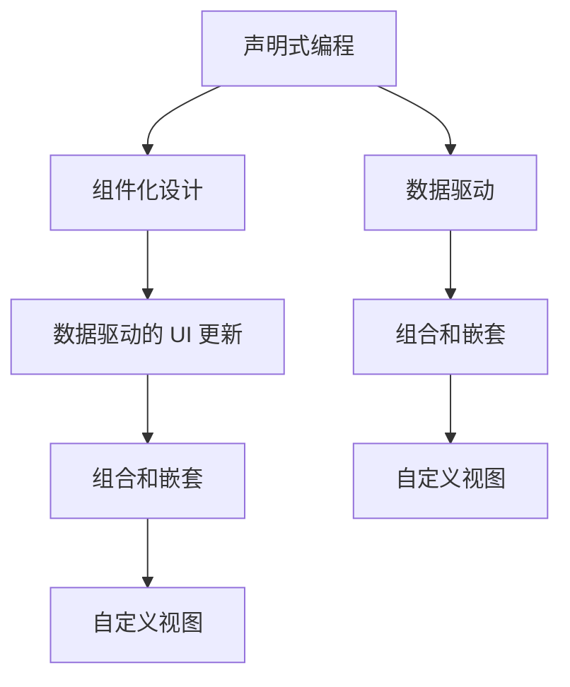

                 

# SwiftUI 框架：苹果的声明式 UI 框架

SwiftUI 是苹果公司自2019年推出的一个全新的用户界面开发框架。它采用了声明式的编程范式，简化了 iOS 和 macOS 应用程序的用户界面开发，使得开发者可以以一种直观、直观的方式定义 UI 组件和布局，从而大幅提升开发效率和代码可维护性。SwiftUI 的设计理念、编程风格、API 设计等方面都与传统的 UI 开发框架（如 UIKit、AppKit）有显著的区别，本文将对 SwiftUI 的核心概念、编程原理、应用场景等方面进行全面深入的探讨。

## 1. 背景介绍

### 1.1 问题由来

传统的 iOS 和 macOS UI 开发框架，如 UIKit 和 AppKit，其设计理念大多基于操作系统的底层实现细节，开发者需要在代码中处理大量与平台相关的细节，如视图渲染、手势识别、触摸事件处理等。这种开发模式要求开发者对平台的底层工作原理有深入的理解，并且需要编写大量的冗余代码。

然而，随着应用程序功能的日益复杂，UI 设计的变化频率不断增加，这种开发方式已经越来越难以适应快速变化的需求。为了简化 UI 开发，苹果公司于2019年推出了 SwiftUI 框架，让开发者能够以一种声明式的方式定义 UI 组件和布局，从而显著提升开发效率和代码可维护性。

### 1.2 问题核心关键点

SwiftUI 框架的核心在于其声明式的编程范式。声明式编程是一种编程范式，程序员首先定义应用程序的状态和数据流，然后由编程环境根据这些定义自动计算状态变化时的 UI 更新。这种编程方式减少了冗余代码，使得 UI 开发更加直观、易于维护。

SwiftUI 框架的另一个关键点是其组件化的设计理念。组件是构成 UI 界面的基本单元，每个组件都能够自包含、自描述，并且可以被复用和组合，从而构建出复杂且灵活的用户界面。SwiftUI 组件化设计不仅简化了 UI 开发，还使得代码更加易于理解和维护。

## 2. 核心概念与联系

### 2.1 核心概念概述

SwiftUI 框架的核心概念包括以下几个方面：

- 声明式编程：SwiftUI 采用声明式编程范式，让开发者能够以一种直观、简单的方式定义 UI 组件和布局，从而减少冗余代码，提升开发效率。
- 组件化设计：SwiftUI 采用组件化的设计理念，将 UI 界面拆分成多个独立的组件，每个组件能够自包含、自描述，并且可以被复用和组合，从而构建出复杂且灵活的用户界面。
- 数据驱动的 UI 更新：SwiftUI 的 UI 更新是基于数据的，当数据发生改变时，UI 自动更新，从而减少了开发者对于 UI 更新的手动操作。
- 组合和嵌套：SwiftUI 支持组件的组合和嵌套，使得开发者可以灵活地构建出复杂的 UI 界面，同时保持代码的可读性和可维护性。
- 自定义视图：SwiftUI 允许开发者自定义视图，从而满足特定的 UI 需求。

### 2.2 核心概念原理和架构的 Mermaid 流程图



这个 Mermaid 流程图展示了 SwiftUI 框架的核心概念之间的逻辑关系：声明式编程是 SwiftUI 的基础，组件化设计是实现声明式编程的重要手段，数据驱动的 UI 更新是 SwiftUI 的核心特性，组合和嵌套是实现复杂 UI 界面的常用方式，自定义视图则允许开发者满足特定的 UI 需求。

## 3. 核心算法原理 & 具体操作步骤

### 3.1 算法原理概述

SwiftUI 的编程原理主要基于声明式编程范式和组件化设计理念。其核心思想是将 UI 界面定义为一个树状结构的视图层次结构，每个视图代表屏幕上的一个组件，组件之间通过组合和嵌套关系构建出复杂的用户界面。

SwiftUI 的视图层次结构由根视图和子视图组成，根视图表示整个 UI 界面的入口，而子视图则是根视图的子组件，它们共同构成整个 UI 界面。SwiftUI 的视图层次结构具有以下特点：

1. 根视图是一个包含其他视图的容器，它通常包含一些子视图。
2. 子视图之间通过组合和嵌套关系构成复杂的视图层次结构。
3. 每个视图都可以根据当前状态和数据计算出应该显示的内容。

SwiftUI 的视图层次结构可以通过代码或者 Interface Builder 来定义和构建。开发者可以使用代码定义视图，也可以使用 Interface Builder 创建视图。SwiftUI 的视图定义方式灵活，可以满足不同类型的 UI 需求。

### 3.2 算法步骤详解

SwiftUI 的编程步骤大致分为以下几个步骤：

1. 定义根视图：定义应用程序的根视图，它是整个 UI 界面的入口，通常是一个包含其他视图的容器。
2. 定义子视图：定义根视图的子视图，它们共同构成整个 UI 界面。子视图可以是其他视图的组合或者嵌套。
3. 定义数据模型：定义应用程序的数据模型，通常是视图的输入数据。
4. 定义视图处理器：定义视图处理器，用于处理视图的交互和更新。
5. 连接视图和数据：将视图与数据模型进行绑定，使得视图能够根据数据模型的变化自动更新。

SwiftUI 的视图定义方式灵活，可以支持多种类型的视图。以下是一些常见的 SwiftUI 视图类型：

- View：代表屏幕上的一个组件，通常是一个可视化元素。
- Widget：代表屏幕上的一个可交互的元素，例如按钮、标签等。
- Text：代表屏幕上的文本元素。
- Image：代表屏幕上的图像元素。
- Link：代表屏幕上的可点击的链接元素。
- Picker：代表屏幕上的选择器元素。
- Slider：代表屏幕上的滑块元素。
- TabView：代表屏幕上的标签页元素。

SwiftUI 的视图定义方式通过声明式编程范式和组件化设计理念，使得开发者可以以一种直观、简单的方式定义 UI 组件和布局。这种编程方式不仅减少了冗余代码，还提升了开发效率和代码可维护性。

### 3.3 算法优缺点

SwiftUI 框架的优点包括：

1. 声明式编程：声明式编程减少了冗余代码，提升了开发效率和代码可维护性。
2. 组件化设计：组件化设计使得 UI 开发更加灵活和可复用。
3. 数据驱动的 UI 更新：数据驱动的 UI 更新减少了手动更新的操作，提升了 UI 的响应速度和可靠性。
4. 自定义视图：自定义视图允许开发者满足特定的 UI 需求。

SwiftUI 框架的缺点包括：

1. 学习曲线较陡峭：由于 SwiftUI 采用了全新的编程范式和设计理念，初学者可能需要花费一些时间来适应。
2. 性能问题：由于 SwiftUI 是一个声明式框架，性能问题可能比 UIKit 和 AppKit 更明显，特别是在处理大量视图和数据时。
3. 依赖 iOS 16 及以上版本：SwiftUI 只支持 iOS 16 及以上版本，这可能限制了它的应用范围。

### 3.4 算法应用领域

SwiftUI 框架在 iOS 和 macOS 应用程序的开发中得到了广泛应用。以下是 SwiftUI 框架的一些典型应用场景：

1. 登录界面：使用 SwiftUI 可以轻松构建登录界面，例如输入用户名和密码的视图、登录按钮等。
2. 数据表：使用 SwiftUI 可以轻松构建数据表，例如显示用户列表、显示列表项等。
3. 日历：使用 SwiftUI 可以轻松构建日历，例如显示日期、添加事件、编辑事件等。
4. 购物车：使用 SwiftUI 可以轻松构建购物车界面，例如显示商品列表、添加商品、删除商品等。
5. 导航：使用 SwiftUI 可以轻松构建导航界面，例如显示导航栏、标签页等。

SwiftUI 框架不仅支持传统的 UI 开发场景，还可以支持更多的应用场景，例如可变尺寸的界面、动画效果、复杂的数据绑定等。

## 4. 数学模型和公式 & 详细讲解 & 举例说明

SwiftUI 框架不涉及复杂的数学模型和公式，其编程模型基于声明式编程范式和组件化设计理念。因此，数学模型和公式部分主要针对 SwiftUI 中的动画效果进行介绍。

### 4.1 数学模型构建

SwiftUI 中的动画效果可以通过声明式编程和组件化设计来实现。SwiftUI 的动画效果分为两种类型：基本动画和复合动画。基本动画包括平移、旋转、缩放等，而复合动画则是基本动画的组合。

SwiftUI 的动画效果通过以下步骤来实现：

1. 定义动画效果：使用动画函数定义动画效果，例如 `.easeInOut` 表示缓入缓出效果。
2. 连接视图和动画：将视图与动画效果进行绑定，使得视图能够根据动画效果自动更新。
3. 动画更新：当视图的数据模型发生变化时，动画效果会自动更新，从而实现平滑的动画效果。

### 4.2 公式推导过程

SwiftUI 中的动画效果使用公式进行推导。以下是一些常见的动画效果公式：

1. 平移动画：平移动画的公式为 $t \mapsto x + \Delta x * sin(t * \omega * \phi)$，其中 $x$ 表示原始位置，$\Delta x$ 表示平移距离，$t$ 表示时间，$\omega$ 表示角频率，$\phi$ 表示相位角。
2. 旋转动画：旋转动画的公式为 $t \mapsto x + \Delta x * sin(t * \omega * \phi)$，其中 $x$ 表示原始位置，$\Delta x$ 表示旋转距离，$t$ 表示时间，$\omega$ 表示角频率，$\phi$ 表示相位角。
3. 缩放动画：缩放动画的公式为 $t \mapsto x + \Delta x * sin(t * \omega * \phi)$，其中 $x$ 表示原始位置，$\Delta x$ 表示缩放距离，$t$ 表示时间，$\omega$ 表示角频率，$\phi$ 表示相位角。

### 4.3 案例分析与讲解

以下是 SwiftUI 中实现平移动画的示例代码：

```swift
struct ContentView: View {
    @State private var position: CGFloat = 0
    
    var body: some View {
        Text("Hello, SwiftUI!")
        .animation(easeInOut(duration: 1.0))
        .frame(width: 200, height: 100)
        .position(x: position)
    }
    
    var body: some View {
        Text("Hello, SwiftUI!")
        .animation(.linear(duration: 1.0))
        .frame(width: 200, height: 100)
        .position(x: position + 100)
    }
}
```

在这个示例中，`ContentView` 结构体包含一个 `position` 状态变量和一个 `Text` 视图。`Text` 视图的位置通过 `position` 变量进行绑定，并且使用 `animation` 函数定义动画效果。在这个示例中，`position` 变量的值会从 `0` 逐渐变化到 `100`，从而实现平移动画效果。

## 5. 项目实践：代码实例和详细解释说明

### 5.1 开发环境搭建

要使用 SwiftUI 框架，需要先搭建好开发环境。以下是使用 Xcode 搭建 SwiftUI 开发环境的步骤：

1. 下载并安装 Xcode。Xcode 是苹果公司开发的集成开发环境，支持 iOS 和 macOS 应用程序的开发。
2. 创建一个新的 SwiftUI 项目。在 Xcode 中创建一个新的项目，选择 SwiftUI 模板。
3. 安装 SwiftUI 依赖库。SwiftUI 依赖库包括 SwiftUI 框架和 SwiftUI 相关的组件库，可以从 CocoaPods 或 Swift Package Manager 中安装。

### 5.2 源代码详细实现

以下是 SwiftUI 中实现登录界面的示例代码：

```swift
import SwiftUI

struct ContentView: View {
    @State private var username: String = ""
    @State private var password: String = ""
    
    var body: some View {
        VStack {
            TextField("Username", text: $username)
            TextField("Password", text: $password)
            Button("Login") {
                // 处理登录逻辑
            }
        }
    }
}
```

在这个示例中，`ContentView` 结构体包含两个 `TextField` 视图和一个 `Button` 视图。`TextField` 视图用于输入用户名和密码，`Button` 视图用于触发登录操作。`TextField` 视图的状态变量 `username` 和 `password` 分别绑定到输入框中的文本，并且 `Button` 视图的点击事件处理函数会处理登录逻辑。

### 5.3 代码解读与分析

SwiftUI 的代码解读与分析主要集中在以下几个方面：

- 声明式编程：SwiftUI 采用声明式编程范式，代码简洁明了，易于理解。
- 组件化设计：SwiftUI 采用组件化设计理念，代码模块化、可复用性强。
- 数据驱动的 UI 更新：SwiftUI 的 UI 更新基于数据模型，开发者只需要关注数据模型的变化，不需要手动更新 UI。
- 自定义视图：SwiftUI 允许开发者自定义视图，从而满足特定的 UI 需求。

### 5.4 运行结果展示

SwiftUI 的运行结果展示主要集中在以下几个方面：

- 交互式界面：SwiftUI 支持交互式界面，用户可以通过触摸、拖拽等操作与界面进行互动。
- 动画效果：SwiftUI 支持动画效果，可以使得 UI 过渡更加平滑和自然。
- 可扩展性：SwiftUI 支持组件化设计，可以灵活地扩展和复用 UI 组件。

SwiftUI 的运行结果展示通过 iOS 模拟器或真实设备进行展示，可以直观地看到 UI 界面的呈现效果和用户交互效果。

## 6. 实际应用场景

SwiftUI 框架在 iOS 和 macOS 应用程序的开发中得到了广泛应用。以下是 SwiftUI 框架的一些典型应用场景：

1. 登录界面：使用 SwiftUI 可以轻松构建登录界面，例如输入用户名和密码的视图、登录按钮等。
2. 数据表：使用 SwiftUI 可以轻松构建数据表，例如显示用户列表、显示列表项等。
3. 日历：使用 SwiftUI 可以轻松构建日历，例如显示日期、添加事件、编辑事件等。
4. 购物车：使用 SwiftUI 可以轻松构建购物车界面，例如显示商品列表、添加商品、删除商品等。
5. 导航：使用 SwiftUI 可以轻松构建导航界面，例如显示导航栏、标签页等。

SwiftUI 框架不仅支持传统的 UI 开发场景，还可以支持更多的应用场景，例如可变尺寸的界面、动画效果、复杂的数据绑定等。

## 7. 工具和资源推荐

### 7.1 学习资源推荐

SwiftUI 框架的学习资源包括官方文档、在线课程、书籍等。以下是一些推荐的学习资源：

1. SwiftUI 官方文档：苹果公司提供的 SwiftUI 官方文档，包含了 SwiftUI 框架的详细说明、示例代码和使用指南。
2. SwiftUI 在线课程：Udemy、Coursera 等在线教育平台提供了许多关于 SwiftUI 的在线课程，涵盖了 SwiftUI 框架的基本概念、编程技巧和实际应用。
3. SwiftUI 书籍：《SwiftUI 编程指南》、《SwiftUI 实战》等书籍，详细介绍了 SwiftUI 框架的编程技巧和实际应用。

### 7.2 开发工具推荐

SwiftUI 框架的开发工具包括 Xcode、AppKit、CocoaPods 等。以下是一些推荐的开发工具：

1. Xcode：苹果公司提供的集成开发环境，支持 iOS 和 macOS 应用程序的开发。
2. AppKit：苹果公司提供的 UI 组件库，支持 iOS 和 macOS 应用程序的开发。
3. CocoaPods：SwiftUI 的依赖库管理工具，可以方便地管理 SwiftUI 的依赖库和组件。

### 7.3 相关论文推荐

SwiftUI 框架的开发涉及声明式编程、组件化设计、数据驱动的 UI 更新等多个领域。以下是一些推荐的论文：

1. "A Declaration-Only Programming Model for User Interface"：苹果公司发表的关于 SwiftUI 框架的论文，介绍了 SwiftUI 框架的声明式编程范式和组件化设计理念。
2. "SwiftUI: A Declarative Programming Model for iOS"：苹果公司发表的关于 SwiftUI 框架的论文，介绍了 SwiftUI 框架的声明式编程范式和组件化设计理念。
3. "SwiftUI: A User Interface Development Framework"：苹果公司发表的关于 SwiftUI 框架的论文，介绍了 SwiftUI 框架的核心概念和编程模型。

## 8. 总结：未来发展趋势与挑战

### 8.1 研究成果总结

SwiftUI 框架自推出以来，已经在 iOS 和 macOS 应用程序的开发中得到了广泛应用。其声明式编程范式和组件化设计理念，显著提升了 UI 开发的效率和可维护性。SwiftUI 框架的运行结果展示和实际应用场景，展示了其强大的功能和灵活性。

### 8.2 未来发展趋势

SwiftUI 框架的未来发展趋势包括：

1. 更加灵活的布局方式：SwiftUI 框架将支持更多的布局方式，例如自适应布局、动态布局等。
2. 更加丰富的视图类型：SwiftUI 框架将支持更多的视图类型，例如复杂的数据绑定、多视图组件等。
3. 更加强大的数据驱动更新机制：SwiftUI 框架将支持更加复杂的数据驱动更新机制，例如数据绑定、动画效果等。
4. 更加灵活的组件化设计：SwiftUI 框架将支持更加灵活的组件化设计，例如嵌套视图、组合视图等。

### 8.3 面临的挑战

SwiftUI 框架在未来的发展过程中，面临的挑战包括：

1. 学习曲线较陡峭：SwiftUI 框架采用了全新的编程范式和设计理念，初学者可能需要花费一些时间来适应。
2. 性能问题：SwiftUI 框架的性能问题可能比 UIKit 和 AppKit 更明显，特别是在处理大量视图和数据时。
3. 依赖 iOS 16 及以上版本：SwiftUI 框架只支持 iOS 16 及以上版本，这可能限制了它的应用范围。

### 8.4 研究展望

SwiftUI 框架的未来研究展望包括：

1. 优化性能：研究 SwiftUI 框架的性能优化技术，提升 UI 的响应速度和可靠性。
2. 支持更多平台：研究 SwiftUI 框架的支持更多平台的可行性，例如 Android、Windows 等。
3. 增强组件化设计：研究 SwiftUI 框架的组件化设计，增强其灵活性和可复用性。
4. 提升用户体验：研究 SwiftUI 框架的用户体验提升技术，例如手势识别、触摸事件处理等。

## 9. 附录：常见问题与解答

**Q1: SwiftUI 框架的声明式编程范式是什么？**

A: SwiftUI 框架的声明式编程范式是一种编程范式，程序员首先定义应用程序的状态和数据流，然后由编程环境根据这些定义自动计算状态变化时的 UI 更新。声明式编程减少了冗余代码，提升了开发效率和代码可维护性。

**Q2: SwiftUI 框架中的动画效果是如何实现的？**

A: SwiftUI 框架中的动画效果通过声明式编程和组件化设计来实现。SwiftUI 的动画效果分为基本动画和复合动画两种类型，基本动画包括平移、旋转、缩放等，而复合动画则是基本动画的组合。SwiftUI 的动画效果通过动画函数和视图绑定来实现。

**Q3: SwiftUI 框架中的数据绑定是如何实现的？**

A: SwiftUI 框架中的数据绑定是通过视图与数据模型之间的绑定来实现的。当数据模型发生变化时，视图会自动更新，从而实现数据驱动的 UI 更新。SwiftUI 框架的数据绑定机制简单、直观，使得开发者能够轻松地构建出复杂的 UI 界面。

**Q4: SwiftUI 框架有哪些优点？**

A: SwiftUI 框架的优点包括：声明式编程减少了冗余代码，提升了开发效率和代码可维护性；组件化设计使得 UI 开发更加灵活和可复用；数据驱动的 UI 更新减少了手动更新的操作，提升了 UI 的响应速度和可靠性；自定义视图允许开发者满足特定的 UI 需求。

**Q5: SwiftUI 框架有哪些缺点？**

A: SwiftUI 框架的缺点包括：学习曲线较陡峭，需要花费一些时间来适应；性能问题可能比 UIKit 和 AppKit 更明显，特别是在处理大量视图和数据时；只支持 iOS 16 及以上版本，这可能限制了它的应用范围。

---

作者：禅与计算机程序设计艺术 / Zen and the Art of Computer Programming

