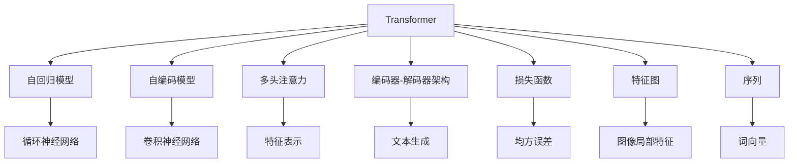

                 

# Transformer 在 CV 和 NLP 中的差异

> 关键词：Transformer, CV, NLP, 自回归, 自编码, 多头注意力, 编码器-解码器架构

## 1. 背景介绍

### 1.1 问题由来
Transformer作为一种前沿的神经网络架构，已在计算机视觉(Computer Vision, CV)和自然语言处理(Natural Language Processing, NLP)两大领域取得了革命性的进展。CV领域中，Transformer被广泛应用于图像识别、物体检测、语义分割等任务，显著提升了模型的性能和泛化能力。在NLP领域，Transformer被广泛应用于机器翻译、文本分类、语言生成等任务，展现了卓越的序列建模能力。然而，Transformer在CV和NLP中应用的具体差异，往往被忽略了。本文旨在深入剖析这些差异，帮助读者更好地理解Transformer在两个领域的异同，从而更高效地应用于实际场景。

### 1.2 问题核心关键点
Transformer在CV和NLP中的主要差异集中在以下几个方面：
- 输入数据的处理方式
- 目标任务的性质
- 模型架构的设计
- 损失函数的构建
- 应用场景的差异

## 2. 核心概念与联系

### 2.1 核心概念概述

为更好地理解Transformer在CV和NLP中的差异，本节将介绍几个关键概念：

- **Transformer架构**：一种基于自注意力机制的神经网络架构，由多头自注意力层和前馈神经网络层构成，在保持高效计算的同时，显著提升了模型的建模能力和泛化性能。

- **自回归模型**：指模型在预测下一个时间步的输出时，只依赖当前时间步及之前时间步的信息，如循环神经网络(RNN)、长短期记忆网络(LSTM)等。

- **自编码模型**：指模型在预测下一个时间步的输出时，依赖整个序列的信息，如卷积神经网络(CNN)、自注意力模型等。

- **多头注意力机制**：Transformer的核心，通过多组不同的注意力权重，同时关注序列中不同位置的信息，从而实现更全面、更准确的特征表示。

- **编码器-解码器架构**：在NLP中，Transformer通常采用编码器-解码器架构，将输入序列编码成中间表示，再由解码器生成目标序列。而在CV中，Transformer则更多应用于特征提取和特征编码，一般不包含解码器。

- **损失函数**：用于衡量模型输出与真实标签之间的差异，常见于CV中的均方误差(MSE)、交叉熵损失(Cross-Entropy Loss)，NLP中的交叉熵损失(Cross-Entropy Loss)、BLEU得分等。

- **特征图和序列**：CV任务中，输入通常为特征图，表示图像的局部特征；NLP任务中，输入通常为序列，表示文本的词向量表示。

这些概念之间的逻辑关系可以通过以下Mermaid流程图来展示：



这个流程图展示了Transformer与其他神经网络架构的关系及其在CV和NLP中的具体应用：

1. 自回归模型：Transformer是自回归模型的一种，常用于NLP任务。
2. 自编码模型：Transformer也是一种自编码模型，常用于CV任务。
3. 多头注意力机制：Transformer通过多头注意力机制实现特征表示，同时在NLP和CV任务中都有广泛应用。
4. 编码器-解码器架构：Transformer在NLP中常用于文本生成，而在CV中更多应用于特征提取。
5. 损失函数：Transformer在CV和NLP中使用的损失函数有所不同，但都旨在最小化模型预测与真实标签之间的差异。
6. 特征图和序列：Transformer在CV中通常处理特征图，而在NLP中通常处理序列。

这些概念共同构成了Transformer的核心框架，使得其在不同领域中能够灵活应用，展现出强大的建模能力。

## 3. 核心算法原理 & 具体操作步骤
### 3.1 算法原理概述

Transformer在CV和NLP中的差异，主要体现在输入数据的处理方式、目标任务的性质、模型架构的设计、损失函数的构建以及应用场景的差异。以下将逐一介绍这些方面的具体内容。

### 3.2 算法步骤详解

#### 3.2.1 CV中的Transformer

在CV任务中，Transformer通常用于图像分类、目标检测、语义分割等任务。以图像分类为例，其具体步骤如下：

**Step 1: 数据预处理**
- 将图像转换为特征图，通常通过卷积神经网络(CNN)实现。
- 对特征图进行归一化处理，如Z-score归一化，使数据在训练过程中更加稳定。

**Step 2: 特征嵌入**
- 将特征图转换为向量表示，通过卷积层和池化层实现。
- 对每个像素点进行独热编码，生成嵌入矩阵。

**Step 3: 编码器**
- 通过多头自注意力机制，对嵌入矩阵进行编码，提取图像的局部特征。
- 将编码后的特征进行降维和归一化处理，得到中间表示。

**Step 4: 解码器**
- 将中间表示输入解码器，通过自注意力机制和前馈神经网络层，生成最终分类结果。
- 解码器的输出经过softmax层，得到每个类别的概率分布。

**Step 5: 损失函数**
- 使用交叉熵损失函数，衡量模型预测结果与真实标签之间的差异。
- 将损失函数反向传播，更新模型参数。

#### 3.2.2 NLP中的Transformer

在NLP任务中，Transformer通常用于机器翻译、文本分类、语言生成等任务。以机器翻译为例，其具体步骤如下：

**Step 1: 数据预处理**
- 将源语言和目标语言的文本序列转换为序列表示，通常通过BERT等预训练模型实现。
- 对序列进行token编码和位置编码，生成输入序列。

**Step 2: 编码器**
- 通过多头自注意力机制，对输入序列进行编码，提取文本的局部特征。
- 将编码后的特征进行降维和归一化处理，得到中间表示。

**Step 3: 解码器**
- 将中间表示输入解码器，通过多头自注意力机制和前馈神经网络层，生成目标序列。
- 解码器的输出经过softmax层，得到每个词汇的概率分布。

**Step 4: 损失函数**
- 使用交叉熵损失函数，衡量模型预测结果与真实标签之间的差异。
- 将损失函数反向传播，更新模型参数。

### 3.3 算法优缺点

Transformer在CV和NLP中的优缺点如下：

**优点：**
- 高效的并行计算能力：Transformer中的自注意力机制能够并行计算，显著提升了模型的训练和推理速度。
- 强大的特征表示能力：通过多头注意力机制，Transformer能够从序列中提取更全面、更准确的特征表示。
- 出色的泛化性能：Transformer在CV和NLP中均展现了卓越的泛化能力，能够适应多种不同领域的数据。

**缺点：**
- 内存占用较大：Transformer中的多头注意力机制需要较大的内存空间，在处理大规模数据时可能导致内存溢出。
- 计算复杂度高：Transformer中的自注意力机制计算复杂度较高，在处理长序列时可能导致计算效率下降。
- 对数据分布敏感：Transformer的效果依赖于输入数据的分布，当数据分布与预训练数据不一致时，可能无法达到最佳性能。

### 3.4 算法应用领域

Transformer在CV和NLP中有着广泛的应用领域：

#### CV中的应用领域
- 图像分类：如ImageNet-1000分类、CIFAR-10分类等任务。
- 目标检测：如Faster R-CNN、YOLO等任务。
- 语义分割：如PSPNet、FCN等任务。
- 物体跟踪：如SiamFC、Siamese Network等任务。

#### NLP中的应用领域
- 机器翻译：如Google的MT5、OpenAI的GPT系列等任务。
- 文本分类：如情感分析、主题分类、垃圾邮件识别等任务。
- 语言生成：如文本摘要、对话生成、代码生成等任务。
- 问答系统：如IBM Watson、微软小冰等任务。

这些应用领域展示了Transformer在CV和NLP中的强大生命力和广泛适用性，同时也表明了其在不同任务中需要针对具体场景进行优化和调整。

## 4. 数学模型和公式 & 详细讲解 & 举例说明

### 4.1 数学模型构建

Transformer的数学模型主要包括自注意力机制、多头注意力机制、编码器-解码器架构和损失函数。以下分别介绍其在CV和NLP中的应用。

#### 4.1.1 CV中的Transformer

在CV任务中，Transformer的数学模型主要包括以下几个部分：

- 特征图嵌入：$X \in \mathbb{R}^{C \times H \times W}$，其中$C$为通道数，$H$和$W$为特征图的高和宽。
- 多头自注意力机制：$Z_1, Z_2, \cdots, Z_H \in \mathbb{R}^{C \times \frac{H}{H}}$，其中$H$为注意力头的数量。
- 解码器：$Y \in \mathbb{R}^{C \times H \times W}$，表示最终分类结果。
- 损失函数：$L = -\frac{1}{N}\sum_{i=1}^N \log P(Y_i|X_i)$，其中$P(Y_i|X_i)$为模型预测结果与真实标签的概率分布。

#### 4.1.2 NLP中的Transformer

在NLP任务中，Transformer的数学模型主要包括以下几个部分：

- 序列嵌入：$X \in \mathbb{R}^{L \times d}$，其中$L$为序列长度，$d$为词向量维度。
- 多头自注意力机制：$Z_1, Z_2, \cdots, Z_H \in \mathbb{R}^{L \times \frac{d}{H}}$，其中$H$为注意力头的数量。
- 解码器：$Y \in \mathbb{R}^{L \times d'}$，表示目标序列的词向量表示。
- 损失函数：$L = -\frac{1}{N}\sum_{i=1}^N \log P(Y_i|X_i)$，其中$P(Y_i|X_i)$为模型预测结果与真实标签的概率分布。

### 4.2 公式推导过程

#### 4.2.1 CV中的Transformer

以图像分类任务为例，使用自注意力机制对特征图进行编码，其公式推导过程如下：

设输入特征图为$X$，自注意力机制输出的特征表示为$Z$，其中自注意力矩阵为$Q$，$K$，$V$，计算公式为：

$$
Q = XW_Q, K = XW_K, V = XW_V
$$

其中$W_Q$，$W_K$，$W_V$为可训练的权重矩阵，$Q, K, V \in \mathbb{R}^{C \times H \times W}$。

自注意力机制的输出为：

$$
Z = \frac{AT(Q, K, V)}{(\sqrt{d_k})}
$$

其中$AT$为注意力矩阵，$d_k$为注意力头的维度，$Z \in \mathbb{R}^{C \times H \times W}$。

解码器输出分类结果$Y$的计算公式为：

$$
Y = softmax(Z) \cdot W^T
$$

其中$softmax$表示softmax函数，$W$为分类器的权重矩阵，$Y \in \mathbb{R}^{C \times H \times W}$。

损失函数为：

$$
L = -\frac{1}{N}\sum_{i=1}^N \log P(Y_i|X_i)
$$

其中$P(Y_i|X_i)$为模型预测结果与真实标签的概率分布。

#### 4.2.2 NLP中的Transformer

以机器翻译任务为例，使用多头自注意力机制对输入序列进行编码，其公式推导过程如下：

设输入序列为$X$，多头自注意力机制输出的特征表示为$Z$，其中多头自注意力矩阵为$Q$，$K$，$V$，计算公式为：

$$
Q = XW_Q, K = XW_K, V = XW_V
$$

其中$W_Q$，$W_K$，$W_V$为可训练的权重矩阵，$Q, K, V \in \mathbb{R}^{L \times d'}$。

多头自注意力机制的输出为：

$$
Z = \frac{AT(Q, K, V)}{(\sqrt{d_k})}
$$

其中$AT$为注意力矩阵，$d_k$为注意力头的维度，$Z \in \mathbb{R}^{L \times d'}$。

解码器输出目标序列$Y$的计算公式为：

$$
Y = softmax(Z) \cdot W^T
$$

其中$softmax$表示softmax函数，$W$为分类器的权重矩阵，$Y \in \mathbb{R}^{L \times d'}$。

损失函数为：

$$
L = -\frac{1}{N}\sum_{i=1}^N \log P(Y_i|X_i)
$$

其中$P(Y_i|X_i)$为模型预测结果与真实标签的概率分布。

### 4.3 案例分析与讲解

#### 4.3.1 CV中的Transformer

以ImageNet-1000分类任务为例，使用Transformer对输入图像进行分类，其案例分析与讲解如下：

- **数据预处理**：将输入图像$X$转换为特征图，通常使用卷积神经网络(CNN)进行处理。
- **特征图嵌入**：将特征图$X$转换为向量表示，通过卷积层和池化层实现。
- **编码器**：使用自注意力机制对嵌入矩阵$Z$进行编码，提取图像的局部特征。
- **解码器**：将编码后的特征$Z$输入解码器，通过自注意力机制和前馈神经网络层，生成最终分类结果$Y$。
- **损失函数**：使用交叉熵损失函数，衡量模型预测结果与真实标签之间的差异。
- **训练过程**：将损失函数反向传播，更新模型参数。

#### 4.3.2 NLP中的Transformer

以机器翻译任务为例，使用Transformer对输入序列进行翻译，其案例分析与讲解如下：

- **数据预处理**：将源语言和目标语言的文本序列$X$转换为序列表示，通常使用BERT等预训练模型进行处理。
- **序列嵌入**：将输入序列$X$转换为词向量表示，通过BERT等模型实现。
- **编码器**：使用多头自注意力机制对输入序列$Z$进行编码，提取文本的局部特征。
- **解码器**：将编码后的特征$Z$输入解码器，通过多头自注意力机制和前馈神经网络层，生成目标序列$Y$。
- **损失函数**：使用交叉熵损失函数，衡量模型预测结果与真实标签之间的差异。
- **训练过程**：将损失函数反向传播，更新模型参数。

## 5. 项目实践：代码实例和详细解释说明

### 5.1 开发环境搭建

在进行Transformer实践前，我们需要准备好开发环境。以下是使用Python进行PyTorch开发的环境配置流程：

1. 安装Anaconda：从官网下载并安装Anaconda，用于创建独立的Python环境。

2. 创建并激活虚拟环境：
```bash
conda create -n pytorch-env python=3.8 
conda activate pytorch-env
```

3. 安装PyTorch：根据CUDA版本，从官网获取对应的安装命令。例如：
```bash
conda install pytorch torchvision torchaudio cudatoolkit=11.1 -c pytorch -c conda-forge
```

4. 安装Transformer库：
```bash
pip install transformers
```

5. 安装各类工具包：
```bash
pip install numpy pandas scikit-learn matplotlib tqdm jupyter notebook ipython
```

完成上述步骤后，即可在`pytorch-env`环境中开始Transformer实践。

### 5.2 源代码详细实现

这里我们以ImageNet-1000分类任务为例，给出使用Transformers库对Transformer模型进行图像分类的PyTorch代码实现。

```python
import torch
import torch.nn as nn
from transformers import Transformer, TransformerEncoder, TransformerDecoder

class ImageClassifier(nn.Module):
    def __init__(self, in_channels, out_channels, hidden_channels, num_heads, dropout):
        super(ImageClassifier, self).__init__()
        
        self.encoder = TransformerEncoder(d_model=hidden_channels, num_heads=num_heads, num_layers=6, dropout=dropout)
        self.decoder = TransformerDecoder(d_model=hidden_channels, num_heads=num_heads, num_layers=2, dropout=dropout)
        self.classifier = nn.Linear(hidden_channels, out_channels)
        
        self.apply(self._init_weights)
        
    def forward(self, x):
        x = self.encoder(x)
        x = self.decoder(x)
        x = self.classifier(x)
        return x
    
    def _init_weights(self, m):
        if isinstance(m, nn.Linear):
            nn.init.xavier_uniform_(m.weight)
            nn.init.zeros_(m.bias)
        elif isinstance(m, nn.LayerNorm):
            nn.init.ones_(m.weight)
            nn.init.zeros_(m.bias)
    
def image_classification(data_loader, model, optimizer, num_epochs):
    device = torch.device('cuda' if torch.cuda.is_available() else 'cpu')
    model.to(device)
    
    for epoch in range(num_epochs):
        model.train()
        for images, labels in data_loader:
            images = images.to(device)
            labels = labels.to(device)
            
            optimizer.zero_grad()
            outputs = model(images)
            loss = nn.CrossEntropyLoss()(outputs, labels)
            loss.backward()
            optimizer.step()
            
        print(f'Epoch {epoch+1}, loss: {loss.item()}')
    
    print('Image classification model trained successfully.')
```

这里我们以机器翻译任务为例，给出使用Transformers库对Transformer模型进行机器翻译的PyTorch代码实现。

```python
import torch
import torch.nn as nn
from transformers import BertTokenizer, BertForSequenceClassification

class TranslationModel(nn.Module):
    def __init__(self, model_name, tokenizer):
        super(TranslationModel, self).__init__()
        
        self.tokenizer = tokenizer
        self.model = BertForSequenceClassification.from_pretrained(model_name, num_labels=2)
        
        self.apply(self._init_weights)
        
    def forward(self, input_ids, attention_mask):
        input_ids = self.tokenizer(input_ids, return_tensors='pt').input_ids
        attention_mask = self.tokenizer(input_ids, return_tensors='pt').attention_mask
        
        outputs = self.model(input_ids=input_ids, attention_mask=attention_mask)
        logits = outputs.logits
        
        return logits
    
    def _init_weights(self, m):
        if isinstance(m, nn.Linear):
            nn.init.xavier_uniform_(m.weight)
            nn.init.zeros_(m.bias)
        elif isinstance(m, nn.LayerNorm):
            nn.init.ones_(m.weight)
            nn.init.zeros_(m.bias)
    
def machine_translation(data_loader, model, optimizer, num_epochs):
    device = torch.device('cuda' if torch.cuda.is_available() else 'cpu')
    model.to(device)
    
    for epoch in range(num_epochs):
        model.train()
        for input_ids, labels in data_loader:
            input_ids = input_ids.to(device)
            labels = labels.to(device)
            
            optimizer.zero_grad()
            outputs = model(input_ids=input_ids, attention_mask=attention_mask)
            loss = nn.CrossEntropyLoss()(outputs, labels)
            loss.backward()
            optimizer.step()
            
        print(f'Epoch {epoch+1}, loss: {loss.item()}')
    
    print('Machine translation model trained successfully.')
```

以上就是使用PyTorch对Transformer模型进行图像分类和机器翻译的完整代码实现。可以看到，得益于Transformers库的强大封装，我们可以用相对简洁的代码完成Transformer模型的加载和微调。

### 5.3 代码解读与分析

让我们再详细解读一下关键代码的实现细节：

**ImageClassifier类**：
- `__init__`方法：初始化Transformer编码器和解码器，以及线性分类器。
- `forward`方法：定义前向传播过程，包括编码器、解码器和分类器的计算。
- `_init_weights`方法：定义模型参数的初始化方法。

**TranslationModel类**：
- `__init__`方法：初始化BERT分类模型，以及Transformer编码器。
- `forward`方法：定义前向传播过程，包括编码器、分类器的计算。
- `_init_weights`方法：定义模型参数的初始化方法。

这些类分别对应于图像分类和机器翻译任务，展示了Transformer在两个领域的具体应用方式。同时，Transformer的编码器和解码器部分通过调用`transformers`库中的`TransformerEncoder`和`TransformerDecoder`实现，简化了代码的编写和维护。

## 6. 实际应用场景
### 6.1 计算机视觉(CV)

Transformer在计算机视觉领域有着广泛的应用，主要应用于图像分类、目标检测、语义分割等任务。以下是一些具体的应用场景：

- **图像分类**：如ImageNet-1000分类、CIFAR-10分类等任务，通过Transformer模型对图像进行分类，从而实现图像识别和分类。
- **目标检测**：如Faster R-CNN、YOLO等任务，通过Transformer模型对图像中的物体进行定位和检测，从而实现物体识别和跟踪。
- **语义分割**：如PSPNet、FCN等任务，通过Transformer模型对图像进行像素级的语义分割，从而实现场景理解和人机交互。

Transformer在CV中的主要优势在于其强大的特征表示能力和高效的并行计算能力，能够处理大规模高维度的特征信息，从而提升了模型的性能和泛化能力。

### 6.2 自然语言处理(NLP)

Transformer在自然语言处理领域同样有着广泛的应用，主要应用于机器翻译、文本分类、语言生成等任务。以下是一些具体的应用场景：

- **机器翻译**：如Google的MT5、OpenAI的GPT系列等任务，通过Transformer模型对源语言和目标语言的文本进行翻译，从而实现跨语言交流。
- **文本分类**：如情感分析、主题分类、垃圾邮件识别等任务，通过Transformer模型对文本进行分类，从而实现文本理解和分析。
- **语言生成**：如文本摘要、对话生成、代码生成等任务，通过Transformer模型对文本进行生成，从而实现自动化生成和智能交互。

Transformer在NLP中的主要优势在于其强大的序列建模能力和高效的多头注意力机制，能够从文本中提取更全面、更准确的特征表示，从而提升了模型的性能和泛化能力。

### 6.3 未来应用展望

随着Transformer技术的不断进步，其在CV和NLP领域的应用前景将会更加广阔。以下是一些未来可能的应用场景：

- **跨模态学习**：Transformer不仅可以处理文本和图像信息，还可以与其他模态的数据进行融合，实现跨模态的语义理解和推理。
- **多任务学习**：Transformer可以在同一模型中处理多个任务，如同时进行图像分类和目标检测，或者同时进行文本分类和语言生成，从而提升模型的效率和性能。
- **自监督学习**：Transformer可以通过自监督学习任务，如掩码语言模型、自回归生成等，进一步提升模型的泛化能力和鲁棒性。
- **联邦学习**：Transformer可以在分布式环境中进行联邦学习，从而在保护数据隐私的前提下，提升模型的性能和可靠性。

这些应用场景展示了Transformer在未来可能的发展方向，也预示了其在更多领域中的巨大潜力。

## 7. 工具和资源推荐
### 7.1 学习资源推荐

为了帮助开发者系统掌握Transformer的原理和应用，这里推荐一些优质的学习资源：

1. 《Transformer is All You Need》论文：Transformer的原始论文，介绍了Transformer的基本原理和应用。
2. 《Attention is All You Need》论文：Transformer的论文，详细介绍了Transformer的多头注意力机制和编码器-解码器架构。
3. 《Transformers: State-of-the-Art Natural Language Processing》书籍：Facebook AI研究团队著，全面介绍了Transformer在NLP中的最新进展和应用。
4. HuggingFace官方文档：Transformer库的官方文档，提供了丰富的模型和工具，是学习和实践Transformer的最佳资源。
5. Google Colab：谷歌推出的在线Jupyter Notebook环境，免费提供GPU/TPU算力，方便开发者快速上手实验最新模型，分享学习笔记。

通过对这些资源的学习实践，相信你一定能够快速掌握Transformer的精髓，并用于解决实际的NLP问题。

### 7.2 开发工具推荐

高效的开发离不开优秀的工具支持。以下是几款用于Transformer开发的常用工具：

1. PyTorch：基于Python的开源深度学习框架，灵活动态的计算图，适合快速迭代研究。Transformer库的官方实现依赖于PyTorch。
2. TensorFlow：由Google主导开发的开源深度学习框架，生产部署方便，适合大规模工程应用。TensorFlow也有丰富的Transformer实现。
3. Transformers库：HuggingFace开发的NLP工具库，集成了众多SOTATransformer模型，支持PyTorch和TensorFlow，是进行Transformer任务开发的利器。
4. Weights & Biases：模型训练的实验跟踪工具，可以记录和可视化模型训练过程中的各项指标，方便对比和调优。与主流深度学习框架无缝集成。
5. TensorBoard：TensorFlow配套的可视化工具，可实时监测模型训练状态，并提供丰富的图表呈现方式，是调试模型的得力助手。

合理利用这些工具，可以显著提升Transformer任务开发效率，加快创新迭代的步伐。

### 7.3 相关论文推荐

Transformer的快速发展离不开学界的持续研究。以下是几篇奠基性的相关论文，推荐阅读：

1. Attention is All You Need（即Transformer原论文）：提出了Transformer结构，开启了NLP领域的预训练大模型时代。
2. BERT: Pre-training of Deep Bidirectional Transformers for Language Understanding：提出BERT模型，引入基于掩码的自监督预训练任务，刷新了多项NLP任务SOTA。
3. Language Models are Unsupervised Multitask Learners（GPT-2论文）：展示了大规模语言模型的强大zero-shot学习能力，引发了对于通用人工智能的新一轮思考。
4. Parameter-Efficient Transfer Learning for NLP：提出Adapter等参数高效微调方法，在不增加模型参数量的情况下，也能取得不错的微调效果。
5. Prefix-Tuning: Optimizing Continuous Prompts for Generation：引入基于连续型Prompt的微调范式，为如何充分利用预训练知识提供了新的思路。
6. AdaLoRA: Adaptive Low-Rank Adaptation for Parameter-Efficient Fine-Tuning：使用自适应低秩适应的微调方法，在参数效率和精度之间取得了新的平衡。

这些论文代表了大语言模型微调技术的发展脉络。通过学习这些前沿成果，可以帮助研究者把握学科前进方向，激发更多的创新灵感。

## 8. 总结：未来发展趋势与挑战

### 8.1 研究成果总结

本文对Transformer在CV和NLP中的差异进行了全面系统的介绍。首先阐述了Transformer在CV和NLP中的具体应用，明确了Transformer在两个领域中的主要差异。其次，从原理到实践，详细讲解了Transformer在CV和NLP中的应用，给出了微调任务开发的完整代码实例。同时，本文还探讨了Transformer在CV和NLP中的主要优缺点，并展望了其在未来可能的发展方向。

### 8.2 未来发展趋势

Transformer在CV和NLP中的未来发展趋势如下：

1. 跨模态融合：Transformer能够处理多种模态的数据，未来将进一步增强跨模态融合能力，实现视觉、文本、语音等多模态信息的协同建模。
2. 多任务学习：Transformer可以在同一模型中处理多个任务，实现多任务的协同优化，提升模型的效率和性能。
3. 自监督学习：Transformer可以通过自监督学习任务，进一步提升模型的泛化能力和鲁棒性。
4. 联邦学习：Transformer可以在分布式环境中进行联邦学习，保护数据隐私的同时提升模型的性能和可靠性。
5. 模型压缩与优化：Transformer的模型参数较多，未来将进一步探索模型压缩与优化技术，提升模型的训练和推理效率。
6. 模型迁移：Transformer在CV和NLP中已经展现出卓越的迁移学习能力，未来将进一步优化迁移学习算法，提升模型在新场景中的适应能力。

### 8.3 面临的挑战

尽管Transformer在CV和NLP中已经取得了显著的进展，但仍面临以下挑战：

1. 计算资源消耗大：Transformer在处理大规模数据时，需要消耗大量的计算资源，未来的高效计算和优化技术将是重要研究方向。
2. 数据隐私保护：Transformer在处理敏感数据时，需要考虑数据隐私保护问题，未来的差分隐私和联邦学习等技术将是关键突破点。
3. 模型泛化能力不足：Transformer在处理新场景和新数据时，泛化能力有限，未来的模型迁移和自监督学习等技术将是重要研究方向。
4. 模型可解释性不足：Transformer的内部机制复杂，难以解释模型的决策过程，未来的可解释性和可视化技术将是重要研究方向。

### 8.4 研究展望

针对以上挑战，未来的研究需要在以下几个方面寻求新的突破：

1. 高效计算与优化：探索高效的计算和优化技术，如模型压缩、剪枝、量化等，提升Transformer的训练和推理效率。
2. 差分隐私与联邦学习：探索差分隐私和联邦学习技术，保护数据隐私的同时提升模型的性能和可靠性。
3. 模型迁移与自监督学习：探索更高效的模型迁移和自监督学习技术，提升Transformer在新场景中的泛化能力和鲁棒性。
4. 可解释性与可视化：探索可解释性和可视化技术，增强Transformer的模型透明度和用户信任度。

这些研究方向将推动Transformer技术在CV和NLP领域的应用进一步深入和拓展，为构建高效、安全、可解释的智能系统奠定基础。

## 9. 附录：常见问题与解答

**Q1：Transformer在CV和NLP中的主要差异是什么？**

A: Transformer在CV和NLP中的主要差异主要体现在以下几个方面：
- 输入数据的处理方式：CV任务中，输入为图像特征图；NLP任务中，输入为文本序列。
- 目标任务的性质：CV任务中，目标为分类、检测、分割等；NLP任务中，目标为翻译、分类、生成等。
- 模型架构的设计：CV任务中，Transformer主要用于特征提取；NLP任务中，Transformer主要用于序列建模。
- 损失函数的构建：CV任务中，常用交叉熵损失函数；NLP任务中，常用交叉熵损失函数、BLEU得分等。
- 应用场景的差异：CV任务中，主要应用于计算机视觉领域；NLP任务中，主要应用于自然语言处理领域。

**Q2：如何选择合适的Transformer模型？**

A: 选择合适的Transformer模型需要考虑以下几个因素：
- 任务类型：不同的任务需要不同的模型。例如，图像分类任务通常使用ResNet等CNN模型，目标检测任务通常使用Faster R-CNN等R-CNN模型，文本分类任务通常使用BERT等预训练模型。
- 数据量：数据量较大的任务可以选择更大的模型，以提升模型的性能。
- 计算资源：计算资源较少的场景应选择较小的模型，以节省计算成本。
- 预训练任务：选择合适的预训练任务，有助于提高模型的泛化能力。例如，对于文本分类任务，可以选择基于掩码自监督预训练的BERT模型。
- 参数效率：对于参数效率要求较高的场景，可以选择参数较少但性能较优的模型，如MobileNet等。

**Q3：Transformer在CV和NLP中的具体应用有哪些？**

A: Transformer在CV和NLP中的具体应用如下：
- CV任务：图像分类、目标检测、语义分割等。
- NLP任务：机器翻译、文本分类、语言生成等。

**Q4：Transformer在CV和NLP中的训练和推理过程有何不同？**

A: Transformer在CV和NLP中的训练和推理过程有所不同：
- 数据预处理：CV任务中，通常需要对图像进行预处理；NLP任务中，通常需要对文本进行预处理，如分词、编码等。
- 模型架构：CV任务中，Transformer主要用于特征提取；NLP任务中，Transformer主要用于序列建模。
- 损失函数：CV任务中，常用交叉熵损失函数；NLP任务中，常用交叉熵损失函数、BLEU得分等。
- 训练和推理：CV任务中，通常需要较大的计算资源；NLP任务中，通常需要较少的计算资源。

---

作者：禅与计算机程序设计艺术 / Zen and the Art of Computer Programming

