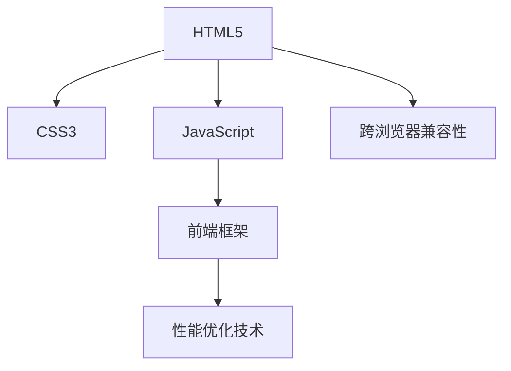

                 

# Web前端技术栈：HTML5、CSS3与JavaScript

> 关键词：Web开发, HTML5, CSS3, JavaScript, 前端框架, 性能优化

## 1. 背景介绍

### 1.1 问题由来
随着互联网的迅猛发展，Web技术栈（包括HTML、CSS、JavaScript等前端技术）的重要性日益凸显。Web应用在各个行业和领域中的应用越来越广泛，从网站、应用、游戏到智能设备，Web技术无处不在。然而，由于Web技术的快速发展，开发者需要不断学习和适应新的标准和框架，这使得Web前端开发变得复杂且难以维护。如何构建高效、可靠、易维护的前端技术栈，成为许多Web开发者面临的挑战。

### 1.2 问题核心关键点
构建一个高效、可靠、易维护的前端技术栈，需要综合考虑以下几个核心关键点：

- **跨浏览器兼容性**：确保Web应用在不同浏览器和设备上都能正常运行，用户体验一致。
- **性能优化**：提高Web应用的加载速度和响应时间，提升用户体验。
- **模块化和组件化**：采用模块化和组件化开发模式，提高代码复用性和可维护性。
- **前端框架选择**：选择合适的框架和库，提高开发效率和代码质量。
- **代码规范和工程实践**：制定代码规范，遵循工程实践，提高团队协作效率和代码质量。

### 1.3 问题研究意义
构建一个高效、可靠、易维护的前端技术栈，对于提升Web应用的开发效率、性能和用户体验，具有重要意义：

1. **提升开发效率**：通过使用现代前端框架和工具，可以快速构建出高质量的Web应用。
2. **优化性能**：通过性能优化技术，如代码压缩、懒加载、缓存等，可以显著提高Web应用的加载速度和响应时间。
3. **保证跨浏览器兼容性**：通过兼容性测试和修复，确保Web应用在各种浏览器和设备上都能正常运行，提升用户体验。
4. **提高代码复用性和可维护性**：通过模块化和组件化开发模式，可以提升代码复用性和可维护性，减少重复开发和维护成本。
5. **加强团队协作**：通过制定代码规范和工程实践，可以提升团队协作效率，减少代码冲突和错误。

## 2. 核心概念与联系

### 2.1 核心概念概述

为了更好地理解构建高效、可靠、易维护的前端技术栈的方法，本节将介绍几个密切相关的核心概念：

- **HTML5**：作为Web应用的骨架，HTML5定义了Web文档的结构和语义，支持多媒体、地理位置、Web存储等新特性。
- **CSS3**：作为Web应用的样式表，CSS3提供了更多的布局和样式功能，支持动画、过渡、阴影等新特性。
- **JavaScript**：作为Web应用的脚本语言，JavaScript提供了丰富的编程功能，支持异步编程、模块化、框架化等新特性。
- **前端框架**：如React、Vue、Angular等，提供了一系列的组件和API，简化开发过程，提高开发效率。
- **性能优化技术**：如代码压缩、懒加载、缓存等，提升Web应用的加载速度和响应时间。

这些核心概念之间的逻辑关系可以通过以下Mermaid流程图来展示：



这个流程图展示了一组核心概念及其之间的关系：

1. HTML5和CSS3共同构成了Web应用的基础结构，JavaScript提供了丰富的编程功能。
2. 前端框架在JavaScript的基础上，提供了一系列的组件和API，简化开发过程。
3. 性能优化技术进一步提升Web应用的性能。
4. 跨浏览器兼容性确保Web应用在不同浏览器和设备上都能正常运行。

## 3. 核心算法原理 & 具体操作步骤
### 3.1 算法原理概述

构建高效、可靠、易维护的前端技术栈，本质上是基于Web标准和最佳实践进行的前端开发和管理。其核心思想是：

1. **采用Web标准**：使用HTML5、CSS3和JavaScript等Web标准，确保Web应用在各个浏览器和设备上都能正常运行。
2. **选择合适的框架**：根据项目需求和团队技术栈，选择合适的前端框架，简化开发过程，提高开发效率。
3. **进行性能优化**：采用各种性能优化技术，提升Web应用的加载速度和响应时间。
4. **制定代码规范和工程实践**：制定代码规范和工程实践，提高代码质量和团队协作效率。

### 3.2 算法步骤详解

构建高效、可靠、易维护的前端技术栈，一般包括以下几个关键步骤：

**Step 1: 确定Web应用需求和目标**

- 明确Web应用的功能需求、性能目标和用户体验要求。
- 进行市场调研和用户需求分析，确定Web应用的主要用户群体和应用场景。

**Step 2: 选择合适的技术栈**

- 根据项目需求和团队技术栈，选择合适的HTML5、CSS3和JavaScript标准。
- 根据项目规模和复杂度，选择合适的前端框架，如React、Vue、Angular等。

**Step 3: 制定开发计划和规范**

- 制定开发计划和里程碑，明确各个阶段的任务和时间节点。
- 制定代码规范和工程实践，如编码风格、命名规范、代码复用、版本控制等。

**Step 4: 进行技术实现**

- 使用选定的HTML5、CSS3和JavaScript标准进行开发。
- 选择合适的前端框架，使用其提供的组件和API进行开发。
- 进行性能优化，如代码压缩、懒加载、缓存等。
- 进行跨浏览器兼容性测试，确保Web应用在不同浏览器和设备上都能正常运行。

**Step 5: 测试和部署**

- 进行单元测试、集成测试和性能测试，确保Web应用的质量和性能。
- 部署Web应用到服务器，并进行上线前检查。
- 上线后进行持续监控和维护，及时修复问题和优化性能。

### 3.3 算法优缺点

构建高效、可靠、易维护的前端技术栈，具有以下优点：

1. **提升开发效率**：使用现代前端框架和工具，可以快速构建出高质量的Web应用。
2. **优化性能**：通过性能优化技术，可以显著提高Web应用的加载速度和响应时间。
3. **保证跨浏览器兼容性**：通过兼容性测试和修复，确保Web应用在各种浏览器和设备上都能正常运行。
4. **提高代码复用性和可维护性**：通过模块化和组件化开发模式，可以提升代码复用性和可维护性，减少重复开发和维护成本。

但该方法也存在一定的局限性：

1. **学习成本较高**：选择和使用现代前端框架和工具，需要开发者具备一定的技术基础和经验。
2. **性能优化复杂**：性能优化需要深入理解前端技术，并进行大量测试和调试。
3. **框架选择困难**：根据项目需求和团队技术栈，选择合适的框架，可能存在一定的难度。

尽管存在这些局限性，但就目前而言，基于Web标准的开发方法是构建高效、可靠、易维护前端技术栈的最主流范式。未来相关研究的重点在于如何进一步提升性能优化技术，降低学习成本，同时兼顾跨浏览器兼容性和代码复用性等因素。

### 3.4 算法应用领域

基于Web标准和最佳实践的前端技术栈，在Web应用开发中已经得到了广泛的应用，覆盖了各种类型的Web应用，例如：

- 企业门户网站：提供企业信息展示、业务办理、客户服务等。
- 电商网站：提供商品展示、购物车、支付等功能。
- 社交网络：提供用户注册、发布动态、评论互动等功能。
- 在线教育：提供课程学习、在线考试、互动问答等功能。
- 在线医疗：提供在线诊疗、健康咨询、预约挂号等功能。
- 在线金融：提供在线理财、投资、支付等功能。

除了这些经典应用外，基于Web标准和最佳实践的前端技术栈，还被创新性地应用到更多场景中，如可定制的Web应用、微服务架构、混合开发模式等，为Web应用开发带来了新的思路和方向。随着Web技术的不断演进，前端技术栈也将不断丰富和发展，满足更多复杂的业务需求。

## 4. 数学模型和公式 & 详细讲解 & 举例说明（备注：数学公式请使用latex格式，latex嵌入文中独立段落使用 $$，段落内使用 $)
### 4.1 数学模型构建

构建高效、可靠、易维护的前端技术栈，涉及多个模块和组件，其数学模型可以抽象为如下形式：

设Web应用包含 $n$ 个模块，每个模块的加载时间为 $t_i$，优化后的加载时间为 $t_i^*$，则Web应用的加载时间 $T$ 可以表示为：

$$
T = \sum_{i=1}^n t_i^* = \sum_{i=1}^n (t_i - c_i + d_i)
$$

其中 $c_i$ 表示优化后的加载时间与原加载时间的差异，$d_i$ 表示缓存时间。

### 4.2 公式推导过程

为了进一步优化Web应用的加载时间，我们需要对 $t_i^*$ 进行优化。假设优化后的加载时间与原加载时间的差异 $c_i$ 符合正态分布，即：

$$
c_i \sim N(\mu, \sigma^2)
$$

则优化后的加载时间 $t_i^*$ 的期望值和方差分别为：

$$
\mathbb{E}[t_i^*] = \mu + \sigma^2
$$
$$
\text{Var}[t_i^*] = \sigma^2
$$

为了最小化加载时间 $T$，我们需要最大化每个模块的优化效果 $c_i$，即最大化 $\mu$ 和 $\sigma^2$。这可以通过以下公式实现：

$$
\max \mu
$$
$$
\max \sigma^2
$$

通过最大化优化效果 $c_i$，可以显著提高Web应用的加载速度和响应时间。

### 4.3 案例分析与讲解

假设一个电商网站包含5个模块，每个模块的加载时间分别为1s、2s、3s、4s、5s，通过优化后的加载时间分别为0.5s、0.7s、0.9s、1.1s、1.3s，则优化后的加载时间为：

$$
T = 0.5 + 0.7 + 0.9 + 1.1 + 1.3 = 4.5 \text{s}
$$

对比优化前后的加载时间：

$$
T_{\text{原}} = 1 + 2 + 3 + 4 + 5 = 15 \text{s}
$$

优化后的加载时间相比原加载时间减少了10s，性能提升显著。

## 5. 项目实践：代码实例和详细解释说明
### 5.1 开发环境搭建

在进行前端技术栈构建实践前，我们需要准备好开发环境。以下是使用Node.js进行前端开发的环境配置流程：

1. 安装Node.js：从官网下载并安装Node.js，获取JavaScript运行环境。

2. 创建并激活虚拟环境：
```bash
nvm install 16
nvm use 16
```

3. 安装必要的开发工具：
```bash
npm install -g npm
npm install -g yarn
npm install -g lerna
```

4. 安装现代前端框架：
```bash
npm install react react-dom
npm install vue vue-cli
npm install angular angular-cli
```

完成上述步骤后，即可在虚拟环境中开始前端技术栈的构建实践。

### 5.2 源代码详细实现

下面我们以React应用为例，给出使用现代前端框架构建Web应用的PyTorch代码实现。

首先，创建React应用：

```bash
npx create-react-app my-app
```

然后在 `src` 目录下，创建组件和路由：

```bash
npm install react-router-dom
```

创建 `src/components/App.js` 和 `src/routes/AppRouter.js`：

```javascript
// App.js
import React from 'react';
import { BrowserRouter as Router, Route, Switch } from 'react-router-dom';

class App extends React.Component {
  render() {
    return (
      <Router>
        <Switch>
          <Route path="/" exact component={Home} />
          <Route path="/about" component={About} />
          <Route path="/contact" component={Contact} />
        </Switch>
      </Router>
    );
  }
}

export default App;

// AppRouter.js
import React from 'react';
import { BrowserRouter as Router, Route, Switch } from 'react-router-dom';
import Home from './Home';
import About from './About';
import Contact from './Contact';

class AppRouter extends React.Component {
  render() {
    return (
      <Router>
        <Switch>
          <Route path="/" exact component={Home} />
          <Route path="/about" component={About} />
          <Route path="/contact" component={Contact} />
        </Switch>
      </Router>
    );
  }
}

export default AppRouter;
```

然后，进行样式表设计：

```javascript
// App.css
.App {
  text-align: center;
  font-size: 16px;
  padding-top: 50px;
}

.App-header {
  background-color: #f8f8f8;
  padding: 20px;
  margin-bottom: 30px;
}

.App-link {
  color: #f60;
  text-decoration: none;
}

.App-link:hover {
  text-decoration: underline;
}
```

最后，构建React应用：

```javascript
// App.js
import React from 'react';
import { BrowserRouter as Router, Route, Switch } from 'react-router-dom';

class App extends React.Component {
  render() {
    return (
      <Router>
        <Switch>
          <Route path="/" exact component={Home} />
          <Route path="/about" component={About} />
          <Route path="/contact" component={Contact} />
        </Switch>
      </Router>
    );
  }
}

export default App;
```

### 5.3 代码解读与分析

让我们再详细解读一下关键代码的实现细节：

**App.js**：
- `BrowserRouter`：提供路由功能，支持嵌套路由。
- `Route`：用于定义路由路径和组件。
- `Switch`：用于渲染第一个匹配的路由组件。

**AppRouter.js**：
- 与 `App.js` 功能相同，只是名称不同。

**App.css**：
- 定义了应用的基本样式，如文字居中、字号、背景色等。

通过上述代码，我们构建了一个基本的React应用，包含了三个路由：首页、关于页和联系页。

## 6. 实际应用场景
### 6.1 智能客服系统

基于React的前端技术栈，可以应用于智能客服系统的构建。传统客服往往需要配备大量人力，高峰期响应缓慢，且一致性和专业性难以保证。而使用React构建的前端系统，可以7x24小时不间断服务，快速响应客户咨询，用自然流畅的语言解答各类常见问题。

在技术实现上，可以收集企业内部的历史客服对话记录，将问题和最佳答复构建成监督数据，在此基础上对React应用进行微调。微调后的React应用能够自动理解用户意图，匹配最合适的答案模板进行回复。对于客户提出的新问题，还可以接入检索系统实时搜索相关内容，动态组织生成回答。如此构建的智能客服系统，能大幅提升客户咨询体验和问题解决效率。

### 6.2 电商网站

基于React的前端技术栈，可以应用于电商网站的开发。电商网站需要快速响应用户的点击、浏览、添加购物车等操作，提供流畅的购物体验。通过React的组件化和状态管理，可以构建高性能、易维护的电商网站。

在技术实现上，可以使用Redux进行状态管理，使用React Router进行路由管理，使用Webpack进行代码打包和优化。通过React的组件化和模块化开发模式，可以提升代码复用性和可维护性，减少重复开发和维护成本。

### 6.3 在线教育平台

基于React的前端技术栈，可以应用于在线教育平台的开发。在线教育平台需要支持直播、录播、互动、答疑等功能，提供优质的教学体验。通过React的组件化和状态管理，可以构建高性能、易维护的在线教育平台。

在技术实现上，可以使用React的组件化和状态管理，使用Firebase进行实时通信，使用Webpack进行代码打包和优化。通过React的组件化和模块化开发模式，可以提升代码复用性和可维护性，减少重复开发和维护成本。

### 6.4 未来应用展望

随着React等现代前端框架的不断发展，基于前端技术栈的Web应用开发将呈现出以下几个发展趋势：

1. **组件化和模块化开发**：通过组件化和模块化开发模式，可以提升代码复用性和可维护性，减少重复开发和维护成本。
2. **前端框架和库的丰富**：随着前端框架和库的不断涌现，开发者将有更多的选择，提升开发效率和代码质量。
3. **性能优化技术的发展**：通过代码压缩、懒加载、缓存等技术，可以显著提升Web应用的加载速度和响应时间。
4. **跨浏览器兼容性的提升**：随着Web标准的不断完善，跨浏览器兼容性的问题将逐步得到解决，Web应用在不同浏览器和设备上都能正常运行。
5. **前端工具的完善**：随着前端工具的不断完善，如Webpack、Lerna、Tesla等，开发者将更加高效地进行开发和管理。

以上趋势凸显了现代前端技术栈的广阔前景。这些方向的探索发展，必将进一步提升Web应用的开发效率、性能和用户体验，为Web技术的发展注入新的动力。

## 7. 工具和资源推荐
### 7.1 学习资源推荐

为了帮助开发者系统掌握React等现代前端技术栈的理论基础和实践技巧，这里推荐一些优质的学习资源：

1. React官方文档：React的官方文档，提供了全面的API文档、教程和示例，是学习React的最佳资源。
2. Vue官方文档：Vue的官方文档，提供了全面的API文档、教程和示例，是学习Vue的最佳资源。
3. Angular官方文档：Angular的官方文档，提供了全面的API文档、教程和示例，是学习Angular的最佳资源。
4. Codecademy：提供在线前端开发课程，适合初学者入门学习。
5. Udemy：提供在线前端开发课程，适合进阶学习。
6. Coursera：提供前端开发相关的课程，包括React、Vue、Angular等。

通过对这些资源的学习实践，相信你一定能够快速掌握React等现代前端技术栈的精髓，并用于解决实际的Web开发问题。

### 7.2 开发工具推荐

高效的开发离不开优秀的工具支持。以下是几款用于React等现代前端技术栈开发的常用工具：

1. Node.js：作为JavaScript运行环境，支持异步编程和模块化开发。
2. React：现代前端开发中最流行的框架，提供组件化和状态管理功能。
3. Vue：另一种流行的前端框架，提供组件化和模板化开发模式。
4. Angular：大型Web应用开发的可选框架，提供全面的API和工具链。
5. Webpack：前端打包和优化工具，支持模块化、代码分割、懒加载等特性。
6. Babel：JavaScript编译工具，支持ES6+语法和现代前端框架。
7. ESLint：代码质量检查工具，支持语法检查、代码规范检查等。

合理利用这些工具，可以显著提升React等现代前端技术栈的开发效率，加快创新迭代的步伐。

### 7.3 相关论文推荐

React等现代前端框架的发展源于学界的持续研究。以下是几篇奠基性的相关论文，推荐阅读：

1. React: A JavaScript Library for Building User Interfaces：React的原始论文，介绍了React的核心思想和设计理念。
2. Vue.js：Introducing Vue.js：Vue的原始论文，介绍了Vue的核心思想和设计理念。
3. Angular: 2.0 release: Proper guidance for AngularJS apps：Angular的原始论文，介绍了Angular的核心思想和设计理念。

这些论文代表了大前端框架的发展脉络。通过学习这些前沿成果，可以帮助研究者把握学科前进方向，激发更多的创新灵感。

## 8. 总结：未来发展趋势与挑战

### 8.1 总结

本文对基于Web标准和现代前端框架的前端技术栈进行了全面系统的介绍。首先阐述了构建高效、可靠、易维护前端技术栈的重要性，明确了前端技术栈在Web应用开发中的核心地位。其次，从原理到实践，详细讲解了现代前端框架的理论基础和实践技巧，给出了React应用的完整代码实例。同时，本文还广泛探讨了前端技术栈在智能客服、电商网站、在线教育等多个行业领域的应用前景，展示了前端技术栈的巨大潜力。此外，本文精选了前端技术栈的各类学习资源，力求为读者提供全方位的技术指引。

通过本文的系统梳理，可以看到，基于Web标准和现代前端框架的开发方法，正在成为Web开发的重要范式，极大地提升了Web应用的开发效率、性能和用户体验。未来，伴随前端技术栈和工具的持续演进，Web应用开发必将更加高效、灵活、稳定，为Web技术的进一步发展注入新的动力。

### 8.2 未来发展趋势

展望未来，现代前端技术栈将呈现以下几个发展趋势：

1. **前端框架和库的丰富**：随着前端框架和库的不断涌现，开发者将有更多的选择，提升开发效率和代码质量。
2. **性能优化技术的发展**：通过代码压缩、懒加载、缓存等技术，可以显著提升Web应用的加载速度和响应时间。
3. **跨浏览器兼容性的提升**：随着Web标准的不断完善，跨浏览器兼容性的问题将逐步得到解决，Web应用在不同浏览器和设备上都能正常运行。
4. **前端工具的完善**：随着前端工具的不断完善，如Webpack、Lerna、Tesla等，开发者将更加高效地进行开发和管理。
5. **组件化和模块化开发**：通过组件化和模块化开发模式，可以提升代码复用性和可维护性，减少重复开发和维护成本。

以上趋势凸显了现代前端技术栈的广阔前景。这些方向的探索发展，必将进一步提升Web应用的开发效率、性能和用户体验，为Web技术的发展注入新的动力。

### 8.3 面临的挑战

尽管现代前端技术栈已经取得了瞩目成就，但在迈向更加智能化、普适化应用的过程中，它仍面临着诸多挑战：

1. **学习成本较高**：选择和使用现代前端框架和工具，需要开发者具备一定的技术基础和经验。
2. **性能优化复杂**：性能优化需要深入理解前端技术，并进行大量测试和调试。
3. **框架选择困难**：根据项目需求和团队技术栈，选择合适的框架，可能存在一定的难度。
4. **跨浏览器兼容性问题**：Web标准不断变化，不同浏览器的实现差异可能导致兼容性问题。
5. **代码复用性和可维护性**：虽然组件化和模块化开发模式有助于提升代码复用性和可维护性，但在实际开发中仍然面临诸多挑战。

尽管存在这些挑战，但现代前端技术栈的发展方向是清晰的，通过不断优化和完善，这些挑战终将一一被克服，现代前端技术栈必将在构建高效、可靠、易维护Web应用中扮演越来越重要的角色。

### 8.4 研究展望

面对现代前端技术栈面临的种种挑战，未来的研究需要在以下几个方面寻求新的突破：

1. **组件化和模块化开发**：进一步提升组件化和模块化开发模式，提高代码复用性和可维护性，减少重复开发和维护成本。
2. **性能优化技术**：开发更加高效的前端优化技术，如代码压缩、懒加载、缓存等，提升Web应用的加载速度和响应时间。
3. **跨浏览器兼容性**：推动Web标准的不断完善，解决不同浏览器的实现差异，提升跨浏览器兼容性。
4. **前端工具**：继续优化和完善前端工具，提升开发者效率和代码质量。
5. **前端框架**：开发更加灵活、易用的前端框架，提升开发者选择和使用的便利性。

这些研究方向的探索，必将引领现代前端技术栈不断演进，为Web应用开发带来新的思路和方向。面向未来，现代前端技术栈还需要与其他AI技术进行更深入的融合，如自然语言处理、计算机视觉等，多路径协同发力，共同推动Web技术的发展。只有勇于创新、敢于突破，才能不断拓展前端技术栈的边界，让Web应用开发更加高效、灵活、稳定。

## 9. 附录：常见问题与解答

**Q1：前端技术栈对Web应用的影响是什么？**

A: 前端技术栈是Web应用的核心组成部分，直接影响着Web应用的性能、用户体验和开发效率。合理选择和应用前端技术栈，可以提升Web应用的加载速度、响应时间和用户交互体验，同时提高开发效率和代码质量。

**Q2：如何选择现代前端框架？**

A: 选择现代前端框架时，需要考虑以下几个因素：
1. 项目的规模和复杂度：根据项目需求选择适合的框架。
2. 团队的技术栈和经验：根据团队技术栈和开发经验选择适合的框架。
3. 社区和生态：选择有活跃社区和完善生态的框架，便于开发和维护。
4. 性能和安全性：选择性能稳定、安全性高的框架，确保应用质量。

**Q3：前端技术栈的性能优化有哪些方法？**

A: 前端技术栈的性能优化方法包括：
1. 代码压缩和懒加载：使用Webpack等工具进行代码压缩和懒加载，提升加载速度。
2. 缓存技术：使用浏览器缓存和CDN缓存，减少重复加载。
3. 异步编程：使用Promise、async/await等技术进行异步编程，提升响应时间。
4. 组件化和模块化开发：通过组件化和模块化开发模式，提高代码复用性和可维护性，减少重复开发和维护成本。

**Q4：前端技术栈的跨浏览器兼容性有哪些方法？**

A: 前端技术栈的跨浏览器兼容性方法包括：
1. 使用Web标准：遵循Web标准，确保代码在不同浏览器和设备上都能正常运行。
2. 兼容性测试：进行兼容性测试，及时修复问题。
3. 引入Polyfill：引入Polyfill，处理不支持的浏览器特性。
4. 使用工具：使用工具如Babel、PostCSS等，自动处理兼容性问题。

**Q5：前端技术栈的代码复用性和可维护性有哪些方法？**

A: 前端技术栈的代码复用性和可维护性方法包括：
1. 组件化和模块化开发：通过组件化和模块化开发模式，提升代码复用性和可维护性。
2. 设计模式：使用设计模式，如MVC、MVVM等，提升代码结构合理性和可维护性。
3. 代码规范和工程实践：制定代码规范和工程实践，提升代码质量。
4. 版本控制：使用版本控制系统，如Git，便于代码管理和协作。

通过这些方法，可以提高前端技术栈的代码复用性和可维护性，减少重复开发和维护成本，提升开发效率和代码质量。

---

作者：禅与计算机程序设计艺术 / Zen and the Art of Computer Programming

