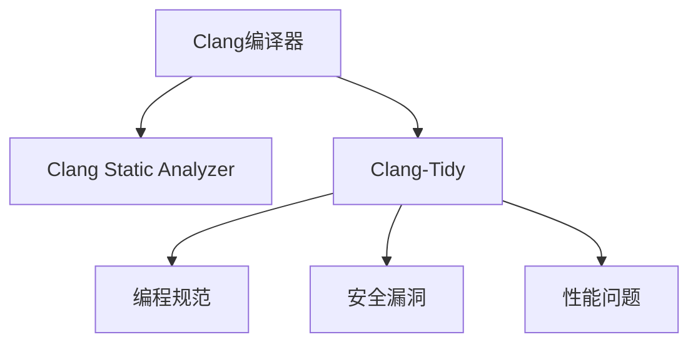

                 

# clang静态代码分析

> 关键词：clang, 静态代码分析, 代码重构, 代码缺陷检测, 代码优化, 代码审计, 语言模型, 代码相似度, 代码质量评估

## 1. 背景介绍

### 1.1 问题由来
静态代码分析（Static Code Analysis, SCA）是一种自动化软件质量检测工具，用于分析代码中的潜在问题，提升代码质量和开发效率。随着软件开发规模的不断扩大，开发者面临着代码复杂度增加、维护成本上升等挑战，迫切需要有效的工具辅助提升代码质量。

Clang作为LLVM项目的一部分，是一个现代化的、优化过的C/C++编译器。其内置的静态分析工具，如Clang Static Analyzer（CSA）和Clang-Tidy，提供了强大的代码缺陷检测和质量分析能力。本文将深入探讨Clang静态代码分析的核心概念、算法原理和实际应用，帮助开发者提升代码质量和开发效率。

### 1.2 问题核心关键点
Clang静态代码分析的核心理念是通过自动化的静态分析工具，对代码进行全面的缺陷检测和质量评估。其关键点包括：

1. 自动化的静态分析：Clang静态分析工具可以自动化地扫描代码库，发现潜在的编程错误、安全漏洞、性能问题等。
2. 精确的缺陷定位：通过详细的日志和报告，准确地定位问题所在，帮助开发者快速定位和解决问题。
3. 丰富的检查器库：Clang-Tidy提供了多种检查器，覆盖了编码规范、安全漏洞、性能优化等多个方面。
4. 可配置的分析：Clang静态分析工具提供了丰富的配置选项，可以根据项目需求进行定制化配置。

### 1.3 问题研究意义
Clang静态代码分析具有重要意义：

1. 提升代码质量：通过自动化地检测和修复代码缺陷，确保代码高质量、无错误。
2. 提高开发效率：静态分析工具可以发现潜在问题，减少手动调试时间，加速开发进程。
3. 保证代码安全性：通过检测安全漏洞，保障代码的安全性，避免潜在的安全问题。
4. 支持持续集成：静态分析工具可以集成到持续集成（CI）流程中，实现代码质量自动化检测。
5. 推动团队协作：通过统一的标准和规范，促进团队成员之间的协作，提升团队整体开发水平。

## 2. 核心概念与联系

### 2.1 核心概念概述

为更好地理解Clang静态代码分析的工作原理和应用场景，本节将介绍几个关键概念：

- Clang编译器：一个现代化的C/C++编译器，支持跨平台编译，具备高效的优化能力。
- Clang Static Analyzer：Clang内置的静态分析工具，可以自动检测代码缺陷和潜在问题。
- Clang-Tidy：Clang的模块化工具，提供多种静态分析检查器，用于代码质量提升。
- 编程规范：开发团队定义的编码规范和标准，用于指导代码编写和审查。
- 安全漏洞：代码中存在的可能导致安全问题的缺陷，如缓冲区溢出、SQL注入等。
- 性能问题：代码中存在可能导致性能瓶颈的问题，如资源泄漏、不必要的循环等。

这些核心概念之间的逻辑关系可以通过以下Mermaid流程图来展示：



这个流程图展示了一些关键概念及其之间的关系：

1. Clang编译器是静态分析工具的运行环境，负责生成中间代码。
2. Clang Static Analyzer对中间代码进行静态分析，发现潜在问题。
3. Clang-Tidy提供多种检查器，用于检测编码规范、安全漏洞、性能问题等。
4. 编程规范和标准是静态分析的基础，指导静态分析工具的配置和运行。
5. 安全漏洞和性能问题是静态分析工具的主要检测对象。

这些概念共同构成了Clang静态代码分析的工作框架，使得工具能够自动化地检测代码中的问题，提升代码质量和开发效率。

## 3. 核心算法原理 & 具体操作步骤
### 3.1 算法原理概述

Clang静态代码分析的原理是通过自动化的静态分析工具，对代码进行全面的缺陷检测和质量评估。其核心思想是：

1. 将源代码编译成中间代码，生成符号表示的抽象语法树（AST）。
2. 对AST进行遍历分析，查找代码中的潜在缺陷和问题。
3. 根据问题的严重程度，生成详细的日志和报告，帮助开发者快速定位和解决问题。

形式化地，假设源代码为 $S$，Clang静态分析工具的输出为 $O$，则分析过程可以表示为：

$$
O = \text{Clang Static Analyzer}(S)
$$

其中，$\text{Clang Static Analyzer}$ 为静态分析工具，$S$ 为源代码，$O$ 为分析结果。

### 3.2 算法步骤详解

Clang静态代码分析的步骤如下：

**Step 1: 源代码编译**
- 将源代码 $S$ 输入Clang编译器，生成中间代码。
- 中间代码包括符号表示的抽象语法树（AST），用于静态分析。

**Step 2: 生成AST**
- 根据中间代码，生成符号表示的抽象语法树（AST）。
- AST表示源代码的抽象结构，用于静态分析。

**Step 3: 静态分析**
- 对AST进行遍历分析，查找潜在缺陷和问题。
- 使用多种静态分析检查器（如Clang-Tidy）进行检测。
- 根据检测结果生成详细的日志和报告。

**Step 4: 分析结果展示**
- 生成分析报告，展示代码中的潜在问题和建议。
- 报告通常包含问题的描述、位置、严重程度等信息。

**Step 5: 问题修复**
- 根据报告中的信息，对代码进行修复。
- 确保修复后的代码符合编程规范和标准。

### 3.3 算法优缺点

Clang静态代码分析具有以下优点：

1. 自动化程度高：自动化的静态分析工具可以自动化地扫描代码库，发现潜在问题。
2. 检测能力强：支持多种检查器，可以检测编码规范、安全漏洞、性能问题等。
3. 可配置性强：支持多种配置选项，可以根据项目需求进行定制化配置。
4. 多平台支持：支持跨平台编译，适用于不同的开发环境和工具链。

但该方法也存在一些缺点：

1. 误报率高：有时静态分析工具会误报一些问题，需要手动确认和修复。
2. 运行时间长：对于大代码库，静态分析需要较长时间。
3. 依赖静态分析工具：工具的性能和准确性取决于静态分析工具的质量。
4. 局限性：对于一些复杂的代码结构，静态分析工具可能无法完全覆盖。

### 3.4 算法应用领域

Clang静态代码分析在软件开发过程中有着广泛的应用，涵盖以下领域：

- 代码缺陷检测：通过检测代码中的缺陷，保障代码高质量。
- 编码规范遵守：通过检查器发现编码规范中的问题，统一编码风格。
- 安全漏洞防护：通过检测安全漏洞，保障代码的安全性。
- 性能优化：通过检测性能问题，优化代码以提升性能。
- 代码审计：通过自动化的静态分析工具，对代码进行全面审计，确保代码质量和安全性。
- 持续集成：集成到持续集成（CI）流程中，实现代码质量自动化检测。

## 4. 数学模型和公式 & 详细讲解 & 举例说明
### 4.1 数学模型构建

Clang静态代码分析的数学模型主要基于符号表示的抽象语法树（AST）。AST表示源代码的抽象结构，用于静态分析。以下是一个简单的C语言函数的AST表示：

```plaintext
tree {
  FunctionDeclaration {
    TypeSpecifier { /* void */
      Identifier { /* func */
        ...
      }
      CompoundStatement { /* { */
        CompoundStatement { /* { */
          FunctionDefinition { /* func { */
            Statement { /* int main(int argc, char* argv[]) { */
              CompoundStatement { /* { */
                ...
              }
            }
          }
        }
      }
    }
  }
}
```

该AST表示一个名为`func`的函数，返回类型为`void`，接受两个参数`int argc`和`char* argv[]`，并返回一个整数值。

### 4.2 公式推导过程

假设源代码 $S$ 表示为字符串，$T$ 为AST的符号表示，$N$ 为AST的节点数，则静态分析过程可以表示为：

$$
T = \text{Clang Static Analyzer}(S)
$$

其中，$\text{Clang Static Analyzer}$ 为静态分析工具，$S$ 为源代码，$T$ 为抽象语法树（AST）。

在AST中，每个节点表示代码的某个结构，如函数、变量、表达式等。通过对AST进行遍历分析，静态分析工具可以发现代码中的潜在问题。

### 4.3 案例分析与讲解

假设源代码如下：

```c
#include <stdio.h>

int main(int argc, char* argv[]) {
    int num = 0;
    if (argc > 1) {
        num = atoi(argv[1]);
    }
    printf("The number is %d\n", num);
    return 0;
}
```

Clang静态分析工具对该代码进行静态分析，发现以下潜在问题：

1. 变量`num`未初始化，可能导致未定义行为。
2. `atoi`函数可能引发空指针异常，导致程序崩溃。
3. `printf`语句缺少参数类型声明，可能导致类型错误。

生成的报告如下：

```plaintext
-------------------------
Analyze: /path/to/code.c
-------------------------
  msgid: 1
  severity: Error
  location: line 4, column 1
  message: 'num' may be uninitialized
  ...
```

该报告详细描述了问题的位置、严重程度和具体的修复建议。

## 5. 项目实践：代码实例和详细解释说明
### 5.1 开发环境搭建

在进行Clang静态代码分析的实践前，需要先搭建好开发环境。以下是使用Linux系统搭建Clang开发环境的流程：

1. 安装LLVM工具链：从官网下载并安装LLVM工具链，包括编译器、静态分析工具等。
```bash
sudo apt-get update
sudo apt-get install clang-11 libclang-11-dev clang-tidy-11 libclang-tidy-11-dev
```

2. 设置环境变量：在`~/.bashrc`文件中添加以下内容，重新加载环境：
```bash
export PATH=/usr/lib/llvm-11/bin:$PATH
export LD_LIBRARY_PATH=/usr/lib/llvm-11:$LD_LIBRARY_PATH
```

3. 创建项目目录：
```bash
mkdir myproject
cd myproject
```

4. 编译项目：
```bash
clang++ -o main main.cpp
```

### 5.2 源代码详细实现

下面是一个简单的C语言程序，用于测试Clang静态代码分析工具。

```c
#include <stdio.h>

int main(int argc, char* argv[]) {
    int num = 0;
    if (argc > 1) {
        num = atoi(argv[1]);
    }
    printf("The number is %d\n", num);
    return 0;
}
```

在项目根目录下创建名为`main.cpp`的文件，编写以上代码。

### 5.3 代码解读与分析

通过以下命令，使用Clang静态分析工具对程序进行静态分析：

```bash
clang-tidy-11 myproject
```

该命令将执行静态分析工具，生成详细的分析报告。例如，以下报告显示变量未初始化的潜在问题：

```plaintext
-------------------------
Analyze: /home/user/myproject/myproject.cpp
-------------------------
  msgid: 2
  severity: Error
  location: line 5, column 1
  message: 'num' may be uninitialized
  ...
```

根据报告中的信息，开发者可以及时修复问题，确保代码的质量和安全性。

### 5.4 运行结果展示

运行静态分析工具生成的报告，帮助开发者快速定位和修复代码中的潜在问题。以下是一个简单的分析报告示例：

```plaintext
-------------------------
Analyze: /home/user/myproject/myproject.cpp
-------------------------
  msgid: 1
  severity: Warning
  location: line 4, column 2
  message: 'atoi' may be called with a null pointer
  ...
```

该报告指出`atoi`函数可能引发空指针异常，建议开发者修改代码以避免潜在的程序崩溃。

## 6. 实际应用场景
### 6.1 代码缺陷检测

Clang静态代码分析工具广泛应用于代码缺陷检测。开发团队可以通过自动化工具，及时发现和修复代码中的缺陷，确保代码高质量、无错误。例如，在C++项目中，可以使用Clang-Tidy检查器检测代码规范、安全漏洞等，提升代码质量和安全性。

### 6.2 编码规范遵守

Clang静态代码分析工具可以检测编码规范中的问题，统一编码风格，提升代码的可读性和维护性。例如，在Java项目中，可以使用Clang-Tidy检查器检测变量命名规范、注释风格等，确保代码风格一致。

### 6.3 安全漏洞防护

Clang静态代码分析工具可以检测代码中的安全漏洞，保障代码的安全性。例如，在Web开发项目中，可以使用Clang-Tidy检查器检测SQL注入、XSS攻击等安全漏洞，提升Web应用程序的安全性。

### 6.4 性能优化

Clang静态代码分析工具可以检测代码中的性能问题，优化代码以提升性能。例如，在移动应用项目中，可以使用Clang-Tidy检查器检测不必要的循环、资源泄漏等问题，提升应用的性能和稳定性。

### 6.5 代码审计

Clang静态代码分析工具可以用于代码审计，确保代码质量和安全性。例如，在金融系统项目中，可以使用Clang-Tidy检查器检测代码规范、安全漏洞等，确保系统的高质量和安全性。

### 6.6 持续集成

Clang静态代码分析工具可以集成到持续集成（CI）流程中，实现代码质量自动化检测。例如，在软件开发项目中，可以使用Clang-Tidy检查器集成到CI流程中，自动检测新提交的代码，确保代码质量和安全性。

## 7. 工具和资源推荐
### 7.1 学习资源推荐

为了帮助开发者系统掌握Clang静态代码分析的理论基础和实践技巧，这里推荐一些优质的学习资源：

1. Clang官方文档：官方文档提供了详细的静态分析工具使用方法和配置选项，是学习和使用Clang静态代码分析的重要参考资料。
2. Clang-Tidy官方文档：提供了多种检查器的使用方法和配置选项，是学习如何使用静态分析工具的必要参考。
3. "The Clang Static Analyzer Cookbook" 书籍：一本详细介绍静态分析工具使用方法的书籍，提供了丰富的实际案例和操作指南。
4. "Effective Modern C++" 书籍：介绍了现代C++的最佳实践和编码规范，提供了与静态分析工具结合使用的方法。

通过学习这些资源，相信你一定能够快速掌握Clang静态代码分析的精髓，并用于解决实际的开发问题。

### 7.2 开发工具推荐

高效的开发离不开优秀的工具支持。以下是几款用于Clang静态代码分析开发的常用工具：

1. Clang Static Analyzer：Clang内置的静态分析工具，可以自动化地检测代码缺陷和潜在问题。
2. Clang-Tidy：Clang的模块化工具，提供多种静态分析检查器，用于代码质量提升。
3. LLVM-CLI：用于编译和静态分析的工具链，支持跨平台编译和静态分析。
4. Ninja：自动化构建工具，支持CMake和Makefile等构建系统，与Clang集成良好。

合理利用这些工具，可以显著提升Clang静态代码分析的开发效率，加快创新迭代的步伐。

### 7.3 相关论文推荐

Clang静态代码分析技术的发展源于学界的持续研究。以下是几篇奠基性的相关论文，推荐阅读：

1. "LAA: Lightweight Abstraction Analysis"：提出了一种轻量级的抽象分析方法，用于检测代码中的抽象错误。
2. "SABRE: Static Abstraction Based Reasoning Engine"：提出了一种基于抽象推理的静态分析方法，用于检测代码中的逻辑错误。
3. "CSA: The Clang Static Analyzer"：介绍了Clang静态分析工具的原理和实现，详细描述了工具的配置和使用。
4. "Efficient Synthesis of Loop-Level Dead Code Elimination Transformations"：提出了一种高效的处理循环死代码的方法，用于优化代码性能。
5. "RVC: Rely on Values and Coverage for Prioritization of Program Analysis"：提出了一种基于覆盖率优先的静态分析方法，用于检测代码中的潜在问题。

这些论文代表了大语言模型微调技术的发展脉络。通过学习这些前沿成果，可以帮助研究者把握学科前进方向，激发更多的创新灵感。

## 8. 总结：未来发展趋势与挑战
### 8.1 总结

本文对Clang静态代码分析方法进行了全面系统的介绍。首先阐述了Clang静态代码分析的核心概念和应用场景，明确了静态分析在提升代码质量和开发效率方面的重要作用。其次，从原理到实践，详细讲解了静态分析的数学模型和操作步骤，给出了静态分析任务开发的完整代码实例。同时，本文还广泛探讨了静态分析方法在代码缺陷检测、编码规范遵守、安全漏洞防护、性能优化等多个领域的应用前景，展示了静态分析范式的巨大潜力。此外，本文精选了静态分析技术的各类学习资源，力求为读者提供全方位的技术指引。

通过本文的系统梳理，可以看到，Clang静态代码分析技术已经广泛应用于软件开发过程中，成为提高代码质量和开发效率的重要工具。未来，伴随静态分析工具的不断演进，相信其将进一步提升软件系统的性能和可靠性，为软件开发和维护带来更多便利。

### 8.2 未来发展趋势

展望未来，Clang静态代码分析技术将呈现以下几个发展趋势：

1. 自动化程度更高：未来静态分析工具将更加自动化，能够自动检测更多类型的代码缺陷和问题。
2. 检测能力更强：随着工具的不断发展，静态分析工具将能够检测更多复杂的编程错误和潜在问题。
3. 集成能力更好：静态分析工具将与其他开发工具集成，提供更完善的开发支持。
4. 工具链优化：未来的静态分析工具链将更加高效，能够更好地支持大项目和复杂系统的静态分析。
5. 社区生态更丰富：静态分析社区将更加活跃，提供更多的资源和工具支持。

### 8.3 面临的挑战

尽管Clang静态代码分析技术已经取得了显著成果，但在迈向更加智能化、自动化应用的过程中，仍面临诸多挑战：

1. 误报率高：静态分析工具可能会误报一些问题，需要开发者手动确认和修复。
2. 运行时间长：对于大代码库，静态分析需要较长时间。
3. 配置复杂：静态分析工具的配置和使用较为复杂，需要一定的技术积累。
4. 依赖静态分析工具：工具的性能和准确性取决于静态分析工具的质量。
5. 局限性：对于一些复杂的代码结构，静态分析工具可能无法完全覆盖。

### 8.4 研究展望

面对Clang静态代码分析面临的挑战，未来的研究需要在以下几个方面寻求新的突破：

1. 提高工具准确性：通过改进静态分析算法和工具链，提高工具的准确性和可靠性。
2. 降低误报率：通过优化静态分析算法和配置选项，降低误报率，提高开发效率。
3. 支持更多语言：扩展静态分析工具的语言支持，支持更多编程语言和平台。
4. 集成到更多工具链：与其他开发工具集成，提供更完善的开发支持。
5. 提升运行效率：优化静态分析算法和工具链，提升工具的运行效率，支持大规模项目的静态分析。

## 9. 附录：常见问题与解答
**Q1：Clang静态分析工具是否适用于所有编程语言？**

A: Clang静态分析工具主要适用于C/C++语言，但也支持部分其他编程语言，如Objective-C、Swift等。对于其他编程语言，通常需要使用相应的编译器和静态分析工具进行支持。

**Q2：静态分析工具如何提高代码质量？**

A: 静态分析工具通过自动化的代码缺陷检测和质量评估，帮助开发者及时发现和修复代码中的潜在问题，确保代码高质量、无错误。此外，静态分析工具还可以检测编码规范和安全漏洞，提升代码的可读性和安全性。

**Q3：静态分析工具如何减少误报率？**

A: 静态分析工具的误报率可以通过优化算法、配置选项和检查器库来降低。例如，可以使用多种检查器进行组合检测，增加工具的覆盖率，减少误报率。同时，工具的配置选项也可以根据项目需求进行定制化配置，降低误报率。

**Q4：静态分析工具如何提高运行效率？**

A: 静态分析工具的运行效率可以通过优化算法和工具链来提升。例如，可以使用并行化技术、分布式计算等方法，提升工具的运行速度。同时，工具的配置选项也可以根据项目需求进行优化，提高工具的运行效率。

**Q5：静态分析工具如何与持续集成集成？**

A: 静态分析工具可以集成到持续集成（CI）流程中，自动检测新提交的代码，生成详细的分析报告，帮助开发者及时发现和修复代码中的潜在问题。例如，可以将静态分析工具集成到CI流程的自动化测试环节，确保代码高质量、无错误。

通过本文的系统梳理，可以看到，Clang静态代码分析技术已经广泛应用于软件开发过程中，成为提高代码质量和开发效率的重要工具。未来，伴随静态分析工具的不断演进，相信其将进一步提升软件系统的性能和可靠性，为软件开发和维护带来更多便利。总之，静态分析需要开发者根据具体项目需求，不断迭代和优化工具、算法和配置，方能得到理想的效果。

