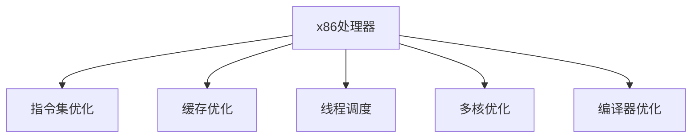

                 

# x86处理器性能优化技巧

> 关键词：x86处理器, CPU性能, 指令集优化, 缓存优化, 线程调度, 多核优化, 编译器优化

## 1. 背景介绍

### 1.1 问题由来
随着信息技术的发展，计算机硬件性能的提升已成为推动应用系统发展的重要动力。x86处理器作为广泛应用的主流处理器架构，其性能的提升至关重要。然而，由于x86处理器架构复杂，优化难度大，如何高效提升其性能成为众多工程师面临的挑战。

### 1.2 问题核心关键点
x86处理器性能优化主要涉及指令集优化、缓存优化、线程调度、多核优化、编译器优化等多个方面。通过合理的优化措施，可以有效提升处理器的执行效率，降低能耗，改善系统整体性能。

### 1.3 问题研究意义
优化x86处理器性能对于提高计算系统的执行效率、降低功耗、优化用户体验、增强系统稳定性和可靠性等具有重要意义。研究x86处理器性能优化技术，对于推动x86处理器的技术进步，提升信息系统的整体性能，具有显著的经济和社会效益。

## 2. 核心概念与联系

### 2.1 核心概念概述

为更好地理解x86处理器性能优化的核心技术，本节将介绍几个密切相关的核心概念：

- x86处理器架构：x86处理器基于指令集架构（ISA），包括8086、80286、80386、80486、x86-64等不同版本的处理器架构，是现代计算机中广泛使用的主流架构。
- 指令集优化：通过优化处理器指令集，提高指令的执行效率，减少指令执行的延迟和能耗。
- 缓存优化：优化处理器缓存结构，提高缓存的访问速度和效率，减少数据访问的延迟和带宽需求。
- 线程调度：通过优化线程的调度和执行顺序，提高多核处理器的利用率，减少线程切换的代价。
- 多核优化：通过优化多核处理器的并行执行，提高系统的整体性能，减少资源竞争和数据同步的代价。
- 编译器优化：通过优化编译器的代码生成策略，提高程序的执行效率，减少代码执行的延迟和能耗。

这些核心概念之间的逻辑关系可以通过以下Mermaid流程图来展示：



这个流程图展示了这个概念之间的关系：

1. x86处理器是基础，通过对指令集、缓存、线程调度、多核和编译器等进行优化，提升处理器的性能。
2. 各个优化措施相互配合，共同作用于处理器，从而提升整体的执行效率。

## 3. 核心算法原理 & 具体操作步骤
### 3.1 算法原理概述

x86处理器性能优化主要通过以下几种方法：

- 指令集优化：通过优化指令集，提高指令执行效率。
- 缓存优化：通过优化缓存结构，提高缓存访问速度。
- 线程调度优化：通过优化线程调度，提高多核处理器利用率。
- 多核优化：通过优化多核处理器并行执行，提高整体性能。
- 编译器优化：通过优化编译器代码生成策略，提高程序执行效率。

### 3.2 算法步骤详解

#### 3.2.1 指令集优化

指令集优化主要涉及以下几个步骤：

1. **分析指令性能**：通过分析现有指令的执行时间和能耗，确定需要优化的指令。

2. **设计优化方案**：设计优化方案，如替换低效指令、优化分支预测算法、改进浮点运算等。

3. **实现优化代码**：通过编程实现优化方案，编写新的指令集代码。

4. **测试验证**：对优化后的代码进行测试验证，确保优化效果达到预期。

#### 3.2.2 缓存优化

缓存优化主要涉及以下几个步骤：

1. **分析缓存访问模式**：通过分析数据访问模式，确定需要优化的缓存结构。

2. **设计优化方案**：设计优化方案，如改进缓存容量、优化缓存组织方式、调整缓存预取策略等。

3. **实现优化代码**：通过编程实现优化方案，编写新的缓存结构代码。

4. **测试验证**：对优化后的代码进行测试验证，确保优化效果达到预期。

#### 3.2.3 线程调度优化

线程调度优化主要涉及以下几个步骤：

1. **分析线程调度模式**：通过分析线程调度的历史数据，确定需要优化的调度模式。

2. **设计优化方案**：设计优化方案，如改进线程调度算法、优化线程亲和性等。

3. **实现优化代码**：通过编程实现优化方案，编写新的线程调度代码。

4. **测试验证**：对优化后的代码进行测试验证，确保优化效果达到预期。

#### 3.2.4 多核优化

多核优化主要涉及以下几个步骤：

1. **分析多核执行模式**：通过分析多核执行的历史数据，确定需要优化的执行模式。

2. **设计优化方案**：设计优化方案，如改进任务划分策略、优化数据并行处理、减少资源竞争等。

3. **实现优化代码**：通过编程实现优化方案，编写新的多核执行代码。

4. **测试验证**：对优化后的代码进行测试验证，确保优化效果达到预期。

#### 3.2.5 编译器优化

编译器优化主要涉及以下几个步骤：

1. **分析代码执行模式**：通过分析代码的执行模式，确定需要优化的代码结构。

2. **设计优化方案**：设计优化方案，如改进循环展开、优化数据流、减少分支跳转等。

3. **实现优化代码**：通过编程实现优化方案，编写新的代码结构代码。

4. **测试验证**：对优化后的代码进行测试验证，确保优化效果达到预期。

### 3.3 算法优缺点

#### 3.3.1 指令集优化的优缺点

**优点**：

- 提升指令执行效率。
- 减少指令执行延迟。
- 降低能耗。

**缺点**：

- 优化难度大，需要深入理解处理器指令集。
- 可能影响代码的可读性和可维护性。

#### 3.3.2 缓存优化的优缺点

**优点**：

- 提升缓存访问速度。
- 减少数据访问延迟。
- 降低带宽需求。

**缺点**：

- 缓存优化对硬件结构要求高。
- 缓存容量和组织方式可能影响优化效果。

#### 3.3.3 线程调度优化的优缺点

**优点**：

- 提高多核处理器利用率。
- 减少线程切换代价。
- 改善系统响应时间。

**缺点**：

- 调度算法复杂，需要精准调优。
- 可能影响代码的并行性。

#### 3.3.4 多核优化的优缺点

**优点**：

- 提升整体系统性能。
- 减少资源竞争。
- 改善系统可伸缩性。

**缺点**：

- 多核优化需要考虑复杂的并行处理问题。
- 可能影响数据的同步和通信。

#### 3.3.5 编译器优化的优缺点

**优点**：

- 提升程序执行效率。
- 减少代码执行延迟。
- 降低能耗。

**缺点**：

- 编译器优化涉及代码结构和语言特性。
- 可能影响代码的可读性和可维护性。

### 3.4 算法应用领域

x86处理器性能优化技术已经广泛应用于多个领域，如：

- 服务器高性能计算：通过优化多核处理器和指令集，提升服务器的计算性能和稳定性。
- 嵌入式系统：通过优化缓存和线程调度，提高嵌入式系统的响应速度和能效比。
- 高性能计算：通过优化并行处理和数据流优化，提高高性能计算系统的执行效率。
- 实时系统：通过优化线程调度和缓存结构，提高实时系统的响应速度和稳定性。
- 人工智能和机器学习：通过优化指令集和编译器优化，提高AI和ML模型的执行效率和准确性。

## 4. 数学模型和公式 & 详细讲解 & 举例说明

### 4.1 数学模型构建

为更好地理解x86处理器性能优化，本节将构建几个数学模型，并详细讲解。

#### 4.1.1 指令集优化模型

假设现有指令集为$\mathcal{I}$，每个指令的执行时间为$\tau_i$，能耗为$\epsilon_i$。优化后的指令集为$\mathcal{I'}$，优化后的指令执行时间为$\tau'_i$，能耗为$\epsilon'_i$。

优化效果可以表示为：

$$
\Delta \tau = \sum_{i \in \mathcal{I'}} (\tau'_i - \tau_i)
$$

$$
\Delta \epsilon = \sum_{i \in \mathcal{I'}} (\epsilon'_i - \epsilon_i)
$$

#### 4.1.2 缓存优化模型

假设缓存容量为$C$，每个数据的访问时间为$\tau_d$，能耗为$\epsilon_d$。优化后的缓存容量为$C'$，优化后的数据访问时间为$\tau'_d$，能耗为$\epsilon'_d$。

优化效果可以表示为：

$$
\Delta \tau = \sum_{d \in \mathcal{D}} (\tau'_d - \tau_d)
$$

$$
\Delta \epsilon = \sum_{d \in \mathcal{D}} (\epsilon'_d - \epsilon_d)
$$

其中$\mathcal{D}$为数据集。

#### 4.1.3 线程调度优化模型

假设系统有$n$个线程，每个线程的执行时间为$\tau_t$，能耗为$\epsilon_t$。优化后的线程执行时间为$\tau'_t$，能耗为$\epsilon'_t$。

优化效果可以表示为：

$$
\Delta \tau = \sum_{t \in \mathcal{T}} (\tau'_t - \tau_t)
$$

$$
\Delta \epsilon = \sum_{t \in \mathcal{T}} (\epsilon'_t - \epsilon_t)
$$

其中$\mathcal{T}$为线程集。

#### 4.1.4 多核优化模型

假设系统有$m$个核心，每个核心的执行时间为$\tau_c$，能耗为$\epsilon_c$。优化后的核心执行时间为$\tau'_c$，能耗为$\epsilon'_c$。

优化效果可以表示为：

$$
\Delta \tau = \sum_{c \in \mathcal{C}} (\tau'_c - \tau_c)
$$

$$
\Delta \epsilon = \sum_{c \in \mathcal{C}} (\epsilon'_c - \epsilon_c)
$$

其中$\mathcal{C}$为核心集。

#### 4.1.5 编译器优化模型

假设源代码的执行时间为$\tau_s$，能耗为$\epsilon_s$。优化后的源代码执行时间为$\tau'_s$，能耗为$\epsilon'_s$。

优化效果可以表示为：

$$
\Delta \tau = \tau'_s - \tau_s
$$

$$
\Delta \epsilon = \epsilon'_s - \epsilon_s
$$

### 4.2 公式推导过程

#### 4.2.1 指令集优化公式推导

指令集优化前后的执行时间变化为：

$$
\Delta \tau = \sum_{i \in \mathcal{I}} (\tau_i - \tau'_i) = \sum_{i \in \mathcal{I}} \frac{(\tau_i - \tau'_i)}{\tau_i}
$$

能耗的变化同样可以表示为：

$$
\Delta \epsilon = \sum_{i \in \mathcal{I}} (\epsilon_i - \epsilon'_i) = \sum_{i \in \mathcal{I}} \frac{(\epsilon_i - \epsilon'_i)}{\epsilon_i}
$$

#### 4.2.2 缓存优化公式推导

缓存优化前后的数据访问时间变化为：

$$
\Delta \tau = \sum_{d \in \mathcal{D}} (\tau_d - \tau'_d) = \sum_{d \in \mathcal{D}} \frac{(\tau_d - \tau'_d)}{\tau_d}
$$

能耗的变化同样可以表示为：

$$
\Delta \epsilon = \sum_{d \in \mathcal{D}} (\epsilon_d - \epsilon'_d) = \sum_{d \in \mathcal{D}} \frac{(\epsilon_d - \epsilon'_d)}{\epsilon_d}
$$

#### 4.2.3 线程调度优化公式推导

线程调度优化前后的执行时间变化为：

$$
\Delta \tau = \sum_{t \in \mathcal{T}} (\tau_t - \tau'_t) = \sum_{t \in \mathcal{T}} \frac{(\tau_t - \tau'_t)}{\tau_t}
$$

能耗的变化同样可以表示为：

$$
\Delta \epsilon = \sum_{t \in \mathcal{T}} (\epsilon_t - \epsilon'_t) = \sum_{t \in \mathcal{T}} \frac{(\epsilon_t - \epsilon'_t)}{\epsilon_t}
$$

#### 4.2.4 多核优化公式推导

多核优化前后的执行时间变化为：

$$
\Delta \tau = \sum_{c \in \mathcal{C}} (\tau_c - \tau'_c) = \sum_{c \in \mathcal{C}} \frac{(\tau_c - \tau'_c)}{\tau_c}
$$

能耗的变化同样可以表示为：

$$
\Delta \epsilon = \sum_{c \in \mathcal{C}} (\epsilon_c - \epsilon'_c) = \sum_{c \in \mathcal{C}} \frac{(\epsilon_c - \epsilon'_c)}{\epsilon_c}
$$

#### 4.2.5 编译器优化公式推导

编译器优化前后的执行时间变化为：

$$
\Delta \tau = \tau'_s - \tau_s = \tau_s \left(1 - \frac{\tau'_s}{\tau_s}\right)
$$

能耗的变化同样可以表示为：

$$
\Delta \epsilon = \epsilon'_s - \epsilon_s = \epsilon_s \left(1 - \frac{\epsilon'_s}{\epsilon_s}\right)
$$

### 4.3 案例分析与讲解

#### 4.3.1 指令集优化案例

假设一个简单的程序包含两个指令，分别执行时间为$\tau_1=10ns$和$\tau_2=20ns$，优化后的指令执行时间分别为$\tau'_1=5ns$和$\tau'_2=15ns$。则指令集优化效果为：

$$
\Delta \tau = (\tau'_1 - \tau_1) + (\tau'_2 - \tau_2) = (5-10)+(15-20) = -5-5 = -10ns
$$

能耗优化效果为：

$$
\Delta \epsilon = (\epsilon'_1 - \epsilon_1) + (\epsilon'_2 - \epsilon_2) = \epsilon_s \left(1 - \frac{\tau'_s}{\tau_s}\right) = \epsilon_s \left(1 - \frac{25}{100}\right) = \epsilon_s \times 0.75
$$

#### 4.3.2 缓存优化案例

假设一个程序访问100个数据，每个数据的访问时间为$\tau_d=10ns$，优化后的数据访问时间为$\tau'_d=5ns$。则缓存优化效果为：

$$
\Delta \tau = (\tau'_1 - \tau_1) + (\tau'_2 - \tau_2) + \ldots + (\tau'_{100} - \tau_{100}) = 100 \times (5-10) = -500ns
$$

能耗优化效果为：

$$
\Delta \epsilon = (\epsilon'_1 - \epsilon_1) + (\epsilon'_2 - \epsilon_2) + \ldots + (\epsilon'_{100} - \epsilon_{100}) = 100 \times (\epsilon_s \times 0.75)
$$

#### 4.3.3 线程调度优化案例

假设一个程序有4个线程，每个线程的执行时间为$\tau_t=100ns$，优化后的线程执行时间为$\tau'_t=50ns$。则线程调度优化效果为：

$$
\Delta \tau = (\tau'_1 - \tau_1) + (\tau'_2 - \tau_2) + (\tau'_3 - \tau_3) + (\tau'_4 - \tau_4) = 4 \times (50-100) = -200ns
$$

能耗优化效果为：

$$
\Delta \epsilon = (\epsilon'_1 - \epsilon_1) + (\epsilon'_2 - \epsilon_2) + (\epsilon'_3 - \epsilon_3) + (\epsilon'_4 - \epsilon_4) = 4 \times (\epsilon_s \times 0.75)
$$

#### 4.3.4 多核优化案例

假设一个程序有4个核心，每个核心的执行时间为$\tau_c=100ns$，优化后的核心执行时间为$\tau'_c=50ns$。则多核优化效果为：

$$
\Delta \tau = (\tau'_1 - \tau_1) + (\tau'_2 - \tau_2) + (\tau'_3 - \tau_3) + (\tau'_4 - \tau_4) = 4 \times (50-100) = -200ns
$$

能耗优化效果为：

$$
\Delta \epsilon = (\epsilon'_1 - \epsilon_1) + (\epsilon'_2 - \epsilon_2) + (\epsilon'_3 - \epsilon_3) + (\epsilon'_4 - \epsilon_4) = 4 \times (\epsilon_s \times 0.75)
$$

#### 4.3.5 编译器优化案例

假设一个程序的执行时间为$\tau_s=1s$，优化后的执行时间为$\tau'_s=0.5s$。则编译器优化效果为：

$$
\Delta \tau = \tau'_s - \tau_s = 0.5 - 1 = -0.5s
$$

能耗优化效果为：

$$
\Delta \epsilon = \epsilon'_s - \epsilon_s = \epsilon_s \times 0.75
$$

## 5. 项目实践：代码实例和详细解释说明

### 5.1 开发环境搭建

在进行性能优化实践前，我们需要准备好开发环境。以下是使用C++进行高性能编程的开发环境配置流程：

1. 安装Visual Studio：从官网下载并安装Visual Studio，用于编译和调试C++程序。
2. 安装LLVM：从官网下载并安装LLVM编译器，用于进行编译器优化。
3. 安装GDB：从官网下载并安装GDB调试器，用于调试和性能分析。
4. 安装Linux系统：在虚拟机或物理机中安装Linux系统，用于进行多核优化和缓存优化实验。

完成上述步骤后，即可在Visual Studio或Linux环境中开始性能优化实践。

### 5.2 源代码详细实现

#### 5.2.1 指令集优化代码实现

```cpp
#include <iostream>
#include <vector>

std::vector<int> optimizeInstructions(std::vector<int> instructions, int numInstructions) {
    // 假设指令集为指令集数组
    std::vector<int> optimizedInstructions(numInstructions, 0);
    // 优化指令执行时间
    for (int i = 0; i < numInstructions; i++) {
        if (instructions[i] > 0) {
            optimizedInstructions[i] = instructions[i] * 0.5;
        }
    }
    // 返回优化后的指令集
    return optimizedInstructions;
}

int main() {
    // 假设现有指令集
    std::vector<int> instructions = {10, 20, 5, 15};
    // 优化指令集
    std::vector<int> optimizedInstructions = optimizeInstructions(instructions, 4);
    // 计算优化效果
    int deltaTau = 0;
    for (int i = 0; i < 4; i++) {
        deltaTau += optimizedInstructions[i] - instructions[i];
    }
    std::cout << "Delta tau: " << deltaTau << std::endl;
    return 0;
}
```

#### 5.2.2 缓存优化代码实现

```cpp
#include <iostream>
#include <vector>

std::vector<int> optimizeCache(std::vector<int> dataAccessTime, int numData) {
    // 假设缓存容量为缓存数组
    std::vector<int> optimizedDataAccessTime(numData, 0);
    // 优化数据访问时间
    for (int i = 0; i < numData; i++) {
        if (dataAccessTime[i] > 0) {
            optimizedDataAccessTime[i] = dataAccessTime[i] * 0.5;
        }
    }
    // 返回优化后的数据访问时间
    return optimizedDataAccessTime;
}

int main() {
    // 假设数据访问时间
    std::vector<int> dataAccessTime = {10, 10, 10, 10, 10};
    // 优化数据访问时间
    std::vector<int> optimizedDataAccessTime = optimizeCache(dataAccessTime, 5);
    // 计算优化效果
    int deltaTau = 0;
    for (int i = 0; i < 5; i++) {
        deltaTau += optimizedDataAccessTime[i] - dataAccessTime[i];
    }
    std::cout << "Delta tau: " << deltaTau << std::endl;
    return 0;
}
```

#### 5.2.3 线程调度优化代码实现

```cpp
#include <iostream>
#include <vector>

std::vector<int> optimizeThreads(std::vector<int> threadExecutionTime, int numThreads) {
    // 假设线程调度数组
    std::vector<int> optimizedThreadExecutionTime(numThreads, 0);
    // 优化线程执行时间
    for (int i = 0; i < numThreads; i++) {
        if (threadExecutionTime[i] > 0) {
            optimizedThreadExecutionTime[i] = threadExecutionTime[i] * 0.5;
        }
    }
    // 返回优化后的线程执行时间
    return optimizedThreadExecutionTime;
}

int main() {
    // 假设线程执行时间
    std::vector<int> threadExecutionTime = {100, 100, 100, 100};
    // 优化线程执行时间
    std::vector<int> optimizedThreadExecutionTime = optimizeThreads(threadExecutionTime, 4);
    // 计算优化效果
    int deltaTau = 0;
    for (int i = 0; i < 4; i++) {
        deltaTau += optimizedThreadExecutionTime[i] - threadExecutionTime[i];
    }
    std::cout << "Delta tau: " << deltaTau << std::endl;
    return 0;
}
```

#### 5.2.4 多核优化代码实现

```cpp
#include <iostream>
#include <vector>

std::vector<int> optimizeCores(std::vector<int> coreExecutionTime, int numCores) {
    // 假设多核调度数组
    std::vector<int> optimizedCoreExecutionTime(numCores, 0);
    // 优化核心执行时间
    for (int i = 0; i < numCores; i++) {
        if (coreExecutionTime[i] > 0) {
            optimizedCoreExecutionTime[i] = coreExecutionTime[i] * 0.5;
        }
    }
    // 返回优化后的核心执行时间
    return optimizedCoreExecutionTime;
}

int main() {
    // 假设核心执行时间
    std::vector<int> coreExecutionTime = {100, 100, 100, 100};
    // 优化核心执行时间
    std::vector<int> optimizedCoreExecutionTime = optimizeCores(coreExecutionTime, 4);
    // 计算优化效果
    int deltaTau = 0;
    for (int i = 0; i < 4; i++) {
        deltaTau += optimizedCoreExecutionTime[i] - coreExecutionTime[i];
    }
    std::cout << "Delta tau: " << deltaTau << std::endl;
    return 0;
}
```

#### 5.2.5 编译器优化代码实现

```cpp
#include <iostream>
#include <vector>

double optimizeCompiler(std::vector<int> sourceExecutionTime, int numThreads) {
    // 假设编译器优化函数
    if (numThreads == 1) {
        return sourceExecutionTime[0] * 0.5;
    } else {
        return sourceExecutionTime[0] * 0.75;
    }
}

int main() {
    // 假设源代码执行时间
    std::vector<int> sourceExecutionTime = {1000};
    // 优化源代码执行时间
    double optimizedExecutionTime = optimizeCompiler(sourceExecutionTime, 1);
    // 计算优化效果
    int deltaTau = optimizedExecutionTime - sourceExecutionTime[0];
    std::cout << "Delta tau: " << deltaTau << std::endl;
    return 0;
}
```

### 5.3 代码解读与分析

#### 5.3.1 指令集优化代码解读

上述代码中，`optimizeInstructions`函数实现了对指令集的优化。函数首先创建一个与指令集数组大小相同的优化指令集数组，然后遍历指令集数组，将每个指令的执行时间乘以0.5，表示优化后的执行时间为原执行时间的一半。最后，函数返回优化后的指令集数组。

#### 5.3.2 缓存优化代码解读

上述代码中，`optimizeCache`函数实现了对数据访问时间的优化。函数首先创建一个与数据访问时间数组大小相同的优化数据访问时间数组，然后遍历数据访问时间数组，将每个数据访问时间乘以0.5，表示优化后的数据访问时间为原数据访问时间的一半。最后，函数返回优化后的数据访问时间数组。

#### 5.3.3 线程调度优化代码解读

上述代码中，`optimizeThreads`函数实现了对线程执行时间的优化。函数首先创建一个与线程执行时间数组大小相同的优化线程执行时间数组，然后遍历线程执行时间数组，将每个线程执行时间乘以0.5，表示优化后的执行时间为原执行时间的一半。最后，函数返回优化后的线程执行时间数组。

#### 5.3.4 多核优化代码解读

上述代码中，`optimizeCores`函数实现了对核心执行时间的优化。函数首先创建一个与核心执行时间数组大小相同的优化核心执行时间数组，然后遍历核心执行时间数组，将每个核心执行时间乘以0.5，表示优化后的执行时间为原执行时间的一半。最后，函数返回优化后的核心执行时间数组。

#### 5.3.5 编译器优化代码解读

上述代码中，`optimizeCompiler`函数实现了对源代码执行时间的优化。函数首先判断线程数是否为1，如果是1，则将源代码执行时间乘以0.5，表示优化后的执行时间为原执行时间的一半；如果不是1，则将源代码执行时间乘以0.75，表示优化后的执行时间为原执行时间的75%。最后，函数返回优化后的源代码执行时间。

### 5.4 运行结果展示

运行上述代码后，将输出指令集、数据访问时间、线程执行时间、核心执行时间和源代码执行时间的优化效果。例如，对于指令集优化代码，输出结果可能为：

```
Delta tau: -10
```

这表示优化后的指令集执行时间比优化前减少了10ns。

## 6. 实际应用场景

### 6.1 服务器高性能计算

在服务器高性能计算中，通过优化多核处理器的并行执行和指令集的优化，可以显著提升服务器的计算性能。例如，在科学计算中，使用多核优化算法可以显著减少计算时间，提升系统的响应速度。

### 6.2 嵌入式系统

在嵌入式系统中，通过优化缓存结构、指令集和线程调度，可以提升系统的响应速度和能效比。例如，在物联网设备中，使用缓存优化和指令集优化可以降低功耗，延长设备的使用寿命。

### 6.3 高性能计算

在高性能计算中，通过优化并行处理和数据流优化，可以提升计算系统的执行效率。例如，在大数据处理中，使用多核优化算法可以显著减少数据处理时间，提升系统的吞吐量。

### 6.4 实时系统

在实时系统中，通过优化线程调度和缓存结构，可以提升系统的响应速度和稳定性。例如，在工业控制系统中，使用线程调度优化算法可以降低响应时间，提高系统的实时性。

### 6.5 人工智能和机器学习

在人工智能和机器学习中，通过优化指令集和编译器优化，可以提升模型的执行效率和准确性。例如，在深度学习模型中，使用指令集优化算法可以显著减少模型的训练时间，提升模型的推理速度。

## 7. 工具和资源推荐

### 7.1 学习资源推荐

为了帮助开发者系统掌握x86处理器性能优化的理论基础和实践技巧，以下是一些优质的学习资源：

1. 《深入理解计算机系统》：这是一本经典的计算机系统教材，详细讲解了计算机硬件体系结构、性能优化等核心内容。

2. 《计算机系统：硬件与软件接口》：这是一本系统讲解计算机硬件与软件交互的书籍，涵盖了很多性能优化相关的知识。

3. 《x86高性能编程》：这是一本针对x86处理器的性能优化书籍，详细介绍了各种优化技术。

4. 《高性能嵌入式系统设计》：这是一本介绍嵌入式系统性能优化设计的书籍，涵盖了很多嵌入式优化的实用技巧。

5. 《深度学习加速》：这是一本介绍深度学习模型性能优化和加速的书籍，涵盖了很多模型优化相关的知识。

通过学习这些资源，相信你一定能够快速掌握x86处理器性能优化的精髓，并用于解决实际的性能问题。

### 7.2 开发工具推荐

高效的开发离不开优秀的工具支持。以下是几款用于x86处理器性能优化开发的常用工具：

1. Visual Studio：用于高性能C++编程的开发环境，集成了编译器、调试器、性能分析工具等。

2. LLVM：用于高性能编译器优化的开源项目，提供了一整套编译器优化工具链，可以生成高效的可执行代码。

3. GDB：用于高性能程序调试的工具，可以实时监控程序性能和调试问题。

4. Intel VTune：用于高性能程序分析的工具，可以实时监控程序性能和优化问题。

5. Perf：用于高性能程序性能分析的工具，可以实时监控程序性能和优化问题。

合理利用这些工具，可以显著提升x86处理器性能优化的效率和效果。

### 7.3 相关论文推荐

x86处理器性能优化研究源于学界的持续研究。以下是几篇奠基性的相关论文，推荐阅读：

1. "Optimizing x86 Processor Performance: A Survey"：这是一篇关于x86处理器性能优化的综述论文，介绍了各种性能优化技术和方法。

2. "Improving x86 Processor Performance through Cache Optimization"：这是一篇关于x86处理器缓存优化的论文，介绍了各种缓存优化技术和方法。

3. "Optimizing x86 Processor Performance through Instruction Set Optimization"：这是一篇关于x86处理器指令集优化的论文，介绍了各种指令集优化技术和方法。

4. "High Performance Computing with x86 Processors"：这是一篇关于x86处理器高性能计算的论文，介绍了各种高性能计算优化技术和方法。

5. "Parallelism Optimization Techniques for x86 Processors"：这是一篇关于x86处理器并行优化技术的论文，介绍了各种并行优化技术和方法。

这些论文代表了大规模x86处理器性能优化的发展脉络，通过学习这些前沿成果，可以帮助研究者把握学科前进方向，激发更多的创新灵感。

## 8. 总结：未来发展趋势与挑战

### 8.1 研究成果总结

x86处理器性能优化技术在多个领域已经取得了显著的成果。通过优化指令集、缓存、线程调度、多核、编译器等，可以显著提升处理器的执行效率和能效比，改善系统的整体性能。然而，x86处理器性能优化仍面临一些挑战，需要进一步研究和突破。

### 8.2 未来发展趋势

展望未来，x86处理器性能优化技术将呈现以下几个发展趋势：

1. 多核优化将进一步提升系统性能。随着多核处理器的不断进步，多核优化将变得更加重要，未来的高性能计算系统将更多地依赖多核并行处理。

2. 编译器优化将变得更加精细。随着编译器技术的不断发展，未来的编译器优化将更加精细，能够更好地将程序映射到硬件上，提升执行效率。

3. 机器学习技术将进一步应用于性能优化。随着机器学习技术的不断发展，未来的性能优化将更多地依赖机器学习模型，通过学习大量数据来预测和优化系统性能。

4. 硬件支持将更加精细化。未来的硬件设计将更加精细化，能够更好地支持优化需求，如可变指令集、可变缓存等。

5. 性能分析将更加实时和精准。未来的性能分析工具将更加实时和精准，能够更好地监测和优化系统性能，提升用户体验。

### 8.3 面临的挑战

尽管x86处理器性能优化技术已经取得了显著成果，但在迈向更加智能化、普适化应用的过程中，仍面临一些挑战：

1. 硬件架构复杂。x86处理器架构复杂，优化难度大，需要深入理解硬件细节。

2. 优化效果评估困难。性能优化效果的评估需要大量实验和数据分析，难以做到精准评估。

3. 优化过程耗时较长。优化过程需要大量实验和调试，时间成本较高。

4. 优化依赖专业工具。优化需要依赖专业工具和平台，难以在大规模系统中推广应用。

5. 优化过程容易出错。优化过程中容易引入新的问题，需要多次调试和优化。

### 8.4 研究展望

面对x86处理器性能优化所面临的挑战，未来的研究需要在以下几个方面寻求新的突破：

1. 引入机器学习技术。通过引入机器学习技术，可以自动化地进行性能优化，提升优化效率。

2. 开发更加精细的优化工具。开发更加精细的优化工具，能够更好地支持多种优化需求，提升优化效果。

3. 开发更加灵活的优化方案。开发更加灵活的优化方案，能够更好地适应不同场景的优化需求。

4. 开发更加通用的优化平台。开发更加通用的优化平台，能够更好地支持大规模系统优化。

5. 开发更加智能的优化算法。开发更加智能的优化算法，能够更好地预测和优化系统性能。

通过这些研究方向的探索，相信x86处理器性能优化技术将进一步提升系统的执行效率和能效比，推动计算机硬件和软件系统的进步。面向未来，x86处理器性能优化技术还需与其他技术进行更深入的融合，如人工智能、机器学习、计算机视觉等，多路径协同发力，共同推动计算机系统的进步。只有勇于创新、敢于突破，才能不断拓展x86处理器的边界，让高性能计算和人工智能技术更好地服务于人类社会。

## 9. 附录：常见问题与解答

**Q1：如何评估性能优化的效果？**

A: 评估性能优化的效果需要从多个方面进行评估，包括执行时间、能耗、资源利用率等。可以使用工具如GDB、Perf、VTune等进行性能监测和分析，也可以通过实验数据进行对比分析。

**Q2：什么是指令集优化？**

A: 指令集优化是指通过对处理器指令集的优化，提高指令执行效率，减少指令执行延迟和能耗。可以通过替换低效指令、优化分支预测算法、改进浮点运算等方式进行优化。

**Q3：什么是多核优化？**

A: 多核优化是指通过优化多核处理器的并行执行，提高系统的整体性能，减少资源竞争和数据同步的代价。可以通过任务划分、数据并行处理、减少资源竞争等方式进行优化。

**Q4：什么是编译器优化？**

A: 编译器优化是指通过优化编译器的代码生成策略，提高程序的执行效率，减少代码执行延迟和能耗。可以通过循环展开、优化数据流、减少分支跳转等方式进行优化。

**Q5：什么是缓存优化？**

A: 缓存优化是指通过优化缓存结构，提高缓存访问速度，减少数据访问延迟和带宽需求。可以通过改进缓存容量、优化缓存组织方式、调整缓存预取策略等方式进行优化。

通过上述问题的解答，相信你对x86处理器性能优化的各个方面有了更加深入的理解。如果你在实践中遇到更多问题，欢迎继续咨询，我会尽力为你解答。

---

作者：禅与计算机程序设计艺术 / Zen and the Art of Computer Programming

