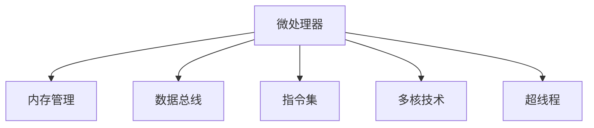

                 

# x86架构：深入理解PC处理器

> 关键词：x86架构, PC处理器, 微处理器, 内存管理, 数据总线和指令集

## 1. 背景介绍

### 1.1 问题由来

自1981年Intel推出第一款x86架构的微处理器以来，x86家族经历了多次重大变革。从早期的8086处理器，到现代的AMD Ryzen和Intel Core i9，x86架构已经经历了数代产品的演进，成为全球PC领域无可争议的主流架构。然而，尽管x86架构广为人知，但其内部机制仍然有许多微妙之处需要深入理解。

### 1.2 问题核心关键点

x86架构是一个复杂的系统，涵盖了微处理器、内存管理、数据总线和指令集等多个方面。为了深入理解其工作原理，我们需要从以下几个关键点入手：

- 微处理器的设计原理
- 内存管理的机制与优化策略
- 数据总线的工作原理和优化方法
- 指令集的发展历程和重要特性

通过深入理解这些核心点，可以更好地掌握x86架构的设计思想和技术细节，从而更好地应用和优化PC处理器。

## 2. 核心概念与联系

### 2.1 核心概念概述

为更好地理解x86架构，本节将介绍几个密切相关的核心概念：

- **微处理器（Microprocessor）**：也称为CPU，是PC的核心部件，负责执行指令和控制数据流。
- **内存管理（Memory Management）**：包括虚拟内存、分页、分段等机制，用于高效管理和保护内存资源。
- **数据总线（Data Bus）**：连接CPU与内存、I/O设备的数据传输通道。
- **指令集（Instruction Set Architecture, ISA）**：定义了CPU支持的指令类型和功能，包括操作码、寄存器、内存操作等。
- **多核技术（Multicore）**：通过多CPU核心协同工作，提升处理能力和效率。
- **超线程（Hyper-threading）**：利用CPU指令级并行，使单个物理核心同时执行多个线程，提升资源利用率。

这些核心概念之间的逻辑关系可以通过以下Mermaid流程图来展示：



这个流程图展示了我们需要掌握的核心概念及其之间的关系：

1. **微处理器**作为x86架构的核心，与内存管理、数据总线和指令集密切相关。
2. **内存管理**和**数据总线**负责内存和CPU之间的数据传输，是微处理器高效工作的基础。
3. **指令集**定义了CPU的功能和指令类型，是微处理器的核心设计。
4. **多核技术**和**超线程**进一步提升了微处理器的性能，是现代x86架构的重要组成部分。

## 3. 核心算法原理 & 具体操作步骤

### 3.1 算法原理概述

x86架构的微处理器内部机制复杂，涉及微指令执行、寄存器管理、中断处理等多个方面。其工作原理可以概括为以下几个关键步骤：

1. **指令取指与译码**：CPU从内存中读取指令，并解析其操作码和地址。
2. **指令执行**：根据指令类型，CPU在寄存器和内存之间传递数据，执行算术、逻辑等操作。
3. **结果存储**：将操作结果存储到寄存器或内存中。
4. **中断处理**：响应外设或软件中断，暂停当前指令执行。

这些步骤通过微指令的顺序执行，完成CPU的基本功能。

### 3.2 算法步骤详解

以一个简单的算术加法指令为例，详细说明微处理器的执行流程：

1. **取指**：CPU从内存中读取指令，识别操作码和地址码。
   $$
   \text{Fetch } OP\_add, \text{src1}, \text{src2}, \text{dest}
   $$
   
2. **译码**：解析指令操作码，确定运算类型和操作数地址。
   $$
   \text{Decode } OP\_add \rightarrow \text{add dest}, \text{src1}, \text{src2}
   $$
   
3. **执行**：将操作数从内存读取到寄存器中，执行加法操作，并将结果写入目标寄存器。
   $$
   \text{Read } \text{src1}, \text{src2} \rightarrow \text{Reg1}, \text{Reg2} \\
   \text{Add } \text{Reg1}, \text{Reg2} \rightarrow \text{Reg3} \\
   \text{Write } \text{dest} \rightarrow \text{Reg3}
   $$
   
4. **写入结果**：将结果写入目标寄存器或内存中。
   $$
   \text{Write } \text{dest} \rightarrow \text{Reg3}
   $$

以上是微处理器执行一个简单加法指令的基本步骤。实际上，现代x86处理器还支持更复杂的指令集和并行执行技术，如SIMD、向量指令、分支预测等。

### 3.3 算法优缺点

x86架构的微处理器具有以下优点：

1. **兼容性强**：与早期x86处理器兼容，便于升级。
2. **性能卓越**：支持多核和超线程技术，并行执行能力强。
3. **应用广泛**：广泛应用于PC、服务器、嵌入式等领域。
4. **生态丰富**：大量软硬件支持，开发成本低。

同时，x86架构也存在一些缺点：

1. **功耗高**：多核和并行执行增加了功耗。
2. **复杂度高**：内部机制复杂，设计难度大。
3. **依赖特定公司**：依赖Intel或AMD的硬件支持，生态开放度受限。
4. **扩展性差**：难以适应超大规模数据的处理需求。

尽管存在这些缺点，x86架构仍然是当前PC处理器的标准，广泛应用于各种高需求的应用场景。

### 3.4 算法应用领域

x86架构的微处理器广泛应用于以下几个领域：

1. **个人电脑**：包括台式机、笔记本电脑，是个人和企业办公的主要平台。
2. **服务器**：包括数据中心服务器、云计算服务器，支持高并发和重负载的应用。
3. **嵌入式设备**：如物联网设备、工业控制设备，具有低功耗、高可靠性的特点。
4. **图形处理**：包括图形卡、游戏机，支持高性能图像和视频处理。
5. **科学计算**：支持高性能计算和数值模拟，广泛应用于科学研究和工程计算。

这些应用领域展示了x86架构的强大适应性和广泛应用价值。

## 4. 数学模型和公式 & 详细讲解 & 举例说明

### 4.1 数学模型构建

x86架构的微处理器内部机制涉及多个部件和寄存器，其工作原理可以抽象为以下几个数学模型：

1. **寄存器模型**：用于存储和操作数据，包括通用寄存器、状态寄存器、控制寄存器等。
2. **内存模型**：用于存储程序和数据，通过虚拟内存和分页机制进行管理。
3. **数据总线模型**：用于CPU与内存、I/O设备之间的数据传输，支持多种数据宽度和速度。

### 4.2 公式推导过程

以一个简单的算术加法指令为例，推导其执行过程的数学公式：

1. **取指**：
   $$
   \text{Fetch } OP\_add, \text{src1}, \text{src2}, \text{dest} \rightarrow \text{FetchOp}, \text{Src1}, \text{Src2}, \text{Dest}
   $$
   
2. **译码**：
   $$
   \text{Decode } OP\_add \rightarrow \text{AddDest}, \text{Src1}, \text{Src2}
   $$
   
3. **执行**：
   $$
   \text{Read } \text{Src1}, \text{Src2} \rightarrow \text{Reg1}, \text{Reg2} \\
   \text{Add } \text{Reg1}, \text{Reg2} \rightarrow \text{Reg3} \\
   \text{Write } \text{Dest} \rightarrow \text{Reg3}
   $$

4. **写入结果**：
   $$
   \text{Write } \text{Dest} \rightarrow \text{Reg3}
   $$

这些数学公式展示了x86架构执行算术加法指令的基本步骤，帮助我们更好地理解其内部机制。

### 4.3 案例分析与讲解

以AMD Ryzen处理器为例，分析其架构特点和优化策略：

1. **微架构设计**：Ryzen处理器采用CCX（Cluster Compute Complex）设计，每个CCX包含多个核心和共享缓存。通过多核协同工作，提升整体性能。

2. **内存管理**：Ryzen处理器支持多级缓存和虚拟内存技术，支持页面表、段表等管理机制，提高内存访问效率。

3. **数据总线设计**：Ryzen处理器支持多种数据宽度和频率的内存总线，支持DDR4、ECC等标准，提高数据传输速度和可靠性。

4. **指令集优化**：Ryzen处理器支持多种指令集扩展，如AVX2、AVX512等，支持更多的数据类型和运算指令，提升计算能力。

这些优化策略使得Ryzen处理器在性能和效率上表现出色，广泛应用于各类高性能计算和图形处理任务。

## 5. 项目实践：代码实例和详细解释说明

### 5.1 开发环境搭建

进行x86架构的微处理器开发，需要安装以下工具：

1. **Intel SDK**：用于开发和调试x86架构的微处理器，提供编译器和调试器。
2. **GCC/Clang**：支持C/C++语言，支持多种操作系统和硬件平台。
3. **QEMU**：用于模拟x86架构的处理器，支持虚拟化技术。
4. **Bochs**：一种虚拟PC仿真器，用于模拟x86处理器运行。

完成环境配置后，可以在虚拟PC或真实硬件上测试和调试微处理器。

### 5.2 源代码详细实现

以下是一个简单的x86汇编程序，用于执行加法操作：

```assembly
section .text
    global _start

_start:
    ; 取指操作
    mov eax, 5     ; 操作数1
    mov ebx, 3     ; 操作数2
    add eax, ebx   ; 加法操作

    ; 写入结果
    mov eax, 0     ; 结果
    ret

section .data
```

该程序使用x86汇编语言，通过`mov`和`add`指令执行加法操作，并使用`ret`指令退出程序。

### 5.3 代码解读与分析

**代码详细解读**：

- `section .text`：定义代码段，其中包含可执行代码。
- `section .data`：定义数据段，其中包含初始化数据。
- `_start`：程序入口，定义程序执行的起始地址。
- `mov`：数据传递指令，用于寄存器间数据复制。
- `add`：加法指令，用于执行算术运算。
- `ret`：程序返回指令，用于退出程序。

**代码分析**：

该程序实现了简单的加法操作，通过取指、译码、执行和返回等步骤完成运算。寄存器`eax`和`ebx`作为操作数和结果寄存器，`add`指令执行加法操作。在实际应用中，这些指令和寄存器是x86架构微处理器的基本组成单位，通过不同的指令组合，可以实现各种复杂的计算任务。

### 5.4 运行结果展示

在虚拟PC上运行该程序，可以通过调试器查看其执行过程和结果。运行结果应为`7`，即`5 + 3 = 7`。

## 6. 实际应用场景

### 6.1 服务器应用

x86架构的微处理器在服务器应用中具有显著优势，主要体现在以下几个方面：

1. **高性能计算**：支持多核、多线程技术，提升处理能力和效率。
2. **可扩展性**：支持多种内存和存储技术，满足不同应用需求。
3. **稳定性和可靠性**：广泛应用于数据中心，具有高可靠性和可用性。

### 6.2 嵌入式应用

x86架构的微处理器在嵌入式应用中也具有广泛应用，主要体现在以下几个方面：

1. **低功耗**：支持多种功耗管理技术，如动态电压频率调节等。
2. **高性能**：支持高性能计算和实时处理，适用于工业控制、物联网等领域。
3. **丰富的生态系统**：具有丰富的软硬件支持，便于开发和维护。

### 6.3 图形处理应用

x86架构的微处理器在图形处理应用中也具有显著优势，主要体现在以下几个方面：

1. **高性能计算**：支持多核、多线程技术，提升图像和视频处理速度。
2. **丰富的图形API**：支持多种图形API，如OpenGL、Vulkan等，方便开发。
3. **跨平台支持**：支持跨平台开发，便于在不同系统上部署应用。

### 6.4 未来应用展望

随着x86架构的持续演进，未来其应用领域将进一步拓展，主要体现在以下几个方面：

1. **量子计算**：支持量子计算和量子通信，提升计算能力和数据处理速度。
2. **边缘计算**：支持边缘计算和人工智能，提升数据处理和存储能力。
3. **5G通信**：支持5G通信和物联网，提升通信速度和数据传输效率。
4. **云计算**：支持云计算和数据中心，提升计算能力和存储能力。

这些应用领域的拓展将进一步推动x86架构的发展，使其在未来的信息时代中继续发挥重要作用。

## 7. 工具和资源推荐

### 7.1 学习资源推荐

为了帮助开发者深入理解x86架构，以下是几本推荐书籍：

1. **《x86架构原理与编程》**：详细介绍x86架构的设计原理、指令集和编程技术。
2. **《Intel Xeon微处理器架构》**：介绍Intel Xeon处理器的设计和优化技术。
3. **《AMD Ryzen处理器技术详解》**：详细介绍AMD Ryzen处理器的设计特点和优化技术。
4. **《x86硬件编程》**：详细介绍x86硬件编程技术和优化策略。
5. **《x86架构编程实战》**：通过实际案例，展示x86架构的编程技术和应用场景。

通过这些书籍的学习，可以全面掌握x86架构的设计原理和编程技术。

### 7.2 开发工具推荐

进行x86架构的微处理器开发，可以使用以下工具：

1. **Intel SDK**：用于开发和调试x86架构的微处理器，提供编译器和调试器。
2. **GCC/Clang**：支持C/C++语言，支持多种操作系统和硬件平台。
3. **QEMU**：用于模拟x86架构的处理器，支持虚拟化技术。
4. **Bochs**：一种虚拟PC仿真器，用于模拟x86处理器运行。
5. **Visual Studio**：支持x86架构的开发和调试，提供丰富的工具集。

这些工具可以满足开发者的各种需求，提高开发效率和代码质量。

### 7.3 相关论文推荐

为了深入理解x86架构的研究进展，以下是几篇推荐论文：

1. **《x86微处理器架构设计》**：详细介绍x86架构的设计原理和技术细节。
2. **《x86处理器性能优化》**：研究x86处理器性能优化的关键技术，包括缓存管理、分支预测等。
3. **《x86架构的虚拟机技术》**：研究x86架构的虚拟机技术和优化策略。
4. **《x86架构的指令集扩展》**：研究x86架构的指令集扩展技术，如AVX2、AVX512等。
5. **《x86架构的安全性设计》**：研究x86架构的安全性设计和技术，提升系统安全性。

通过这些论文的学习，可以全面掌握x86架构的研究进展和关键技术。

## 8. 总结：未来发展趋势与挑战

### 8.1 总结

本文对x86架构的微处理器进行了全面系统的介绍。首先阐述了微处理器的设计原理和关键步骤，详细讲解了内存管理、数据总线和指令集等核心概念。其次，通过实例代码展示了x86架构的编程实现，分析了其实际应用场景和性能特点。最后，推荐了相关学习资源和开发工具，帮助开发者深入理解x86架构。

通过本文的系统梳理，可以看到，x86架构的微处理器在设计上注重高效性和兼容性，广泛应用于各类高性能计算和图形处理任务。其未来的发展趋势包括量子计算、边缘计算和5G通信等领域，预示着广阔的应用前景。同时，x86架构在扩展性、功耗和安全性等方面仍需不断优化和改进。

### 8.2 未来发展趋势

展望未来，x86架构的微处理器将呈现以下几个发展趋势：

1. **量子计算支持**：支持量子计算和量子通信，提升计算能力和数据处理速度。
2. **边缘计算支持**：支持边缘计算和人工智能，提升数据处理和存储能力。
3. **5G通信支持**：支持5G通信和物联网，提升通信速度和数据传输效率。
4. **云计算支持**：支持云计算和数据中心，提升计算能力和存储能力。

这些趋势将推动x86架构向更高性能和更广泛应用的方向发展，为未来的信息时代带来更多的可能性。

### 8.3 面临的挑战

尽管x86架构的微处理器具有显著优势，但其在发展过程中也面临一些挑战：

1. **功耗管理**：多核和并行执行增加了功耗，如何优化功耗管理是未来的重要挑战。
2. **扩展性**：难以适应超大规模数据的处理需求，如何提升扩展性需要进一步研究。
3. **安全性**：处理器面临多种安全威胁，如何提升安全性仍需不断改进。
4. **兼容性**：新架构的兼容性问题需要解决，以实现平滑升级和硬件替换。

### 8.4 研究展望

未来的研究需要关注以下几个方向：

1. **功耗管理**：研究新的功耗管理技术，提升微处理器的能效比。
2. **扩展性**：研究新的数据管理技术，支持超大规模数据的处理需求。
3. **安全性**：研究新的安全技术，提升微处理器的安全性。
4. **兼容性**：研究新的兼容技术，实现平滑升级和硬件替换。

只有不断解决这些挑战，x86架构的微处理器才能在未来的信息时代继续发挥重要作用，推动技术进步和社会发展。

## 9. 附录：常见问题与解答

**Q1：x86架构的微处理器如何支持多核和并行执行？**

A: x86架构的微处理器通过多核设计和超线程技术支持多核和并行执行。多核设计将处理器划分为多个独立的物理核心，每个核心独立执行指令。超线程技术通过模拟多线程执行，使单个物理核心同时执行多个线程，提升资源利用率。

**Q2：x86架构的微处理器如何支持虚拟内存和分页机制？**

A: x86架构的微处理器通过多级缓存和虚拟内存管理支持虚拟内存和分页机制。虚拟内存技术将物理内存映射到虚拟地址空间，通过分页机制将虚拟地址映射到物理地址，实现内存的动态管理和保护。

**Q3：x86架构的微处理器如何支持高性能计算？**

A: x86架构的微处理器通过多核、多线程、指令集扩展和并行计算技术支持高性能计算。多核和超线程技术提升并行执行能力，指令集扩展支持更多的数据类型和运算指令，并行计算技术如SIMD、向量指令等提升计算速度。

**Q4：x86架构的微处理器如何支持边缘计算？**

A: x86架构的微处理器通过低功耗管理和边缘计算技术支持边缘计算。低功耗管理技术如动态电压频率调节等提升处理器的能效比，边缘计算技术通过本地数据处理和分析提升计算速度和响应能力。

**Q5：x86架构的微处理器如何支持5G通信？**

A: x86架构的微处理器通过支持5G通信协议和标准支持5G通信。5G通信协议和标准支持更高的通信速度和更低的延迟，通过支持这些协议和标准，微处理器可以更好地支持5G通信和物联网应用。

以上问题与解答帮助开发者更好地理解x86架构的微处理器，掌握其设计原理和优化策略，为未来的应用开发提供参考。

---

作者：禅与计算机程序设计艺术 / Zen and the Art of Computer Programming

