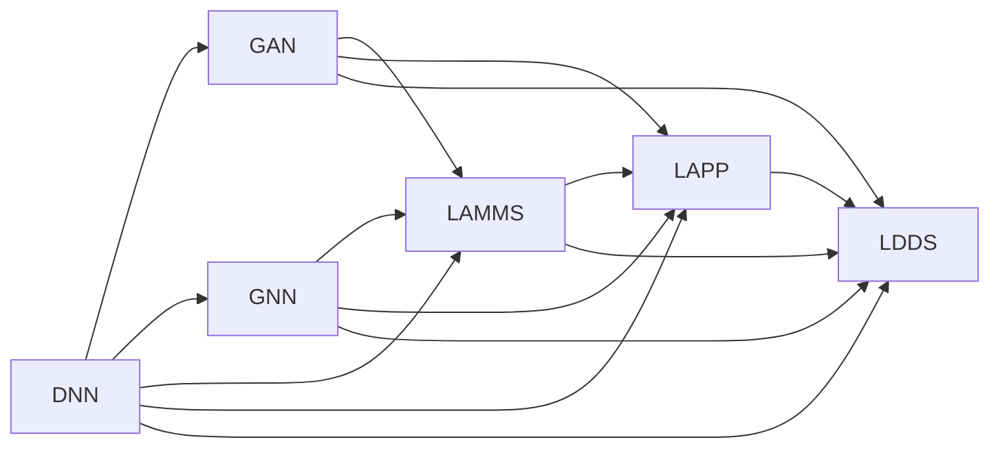

                 

# 与科技巨头比肩：Lepton AI的雄心壮志

## 1. 背景介绍

随着科技的迅猛发展，人工智能(AI)技术正在以前所未有的速度改变着各行各业的面貌。无论是在零售、金融、医疗，还是在自动驾驶、语音识别等领域，AI的应用都已初现端倪。而在AI的诸多种技术中，机器学习和深度学习无疑是其中最为重要的一环。

Lepton AI作为一家全球领先的人工智能技术公司，自成立以来，就致力于开发最先进的机器学习与深度学习技术。从深度神经网络(Deep Neural Networks, DNNs)到生成对抗网络(Generative Adversarial Networks, GANs)，再到图神经网络(Graph Neural Networks, GNNs)，Lepton AI在机器学习领域不断推陈出新，逐步确立了其在行业中的地位。

Lepton AI不仅拥有卓越的算法研发能力，更在硬件加速、大数据处理、云计算等方面拥有深厚的技术积淀。通过将多种技术有机结合，Lepton AI打造出了多款具有颠覆性意义的产品，如Lepton AI模型管理系统(LAMMS)、Lepton AI云端计算平台(LAPP)、Lepton AI超大规模分布式训练系统(LDDS)等，成功服务于全球数百家企业和机构，实现了其雄心壮志。

## 2. 核心概念与联系

### 2.1 核心概念概述

Lepton AI在机器学习与深度学习领域的核心概念包括以下几个方面：

- **深度神经网络(Deep Neural Networks, DNNs)**：一种多层的神经网络，通过多层非线性变换，可以处理复杂的非线性问题，广泛应用于图像识别、自然语言处理等领域。
- **生成对抗网络(Generative Adversarial Networks, GANs)**：由生成器(Generator)和判别器(Discriminator)两个网络组成，通过相互博弈生成高质量的样本数据，常用于图像生成、视频制作等。
- **图神经网络(Graph Neural Networks, GNNs)**：结合图结构与神经网络，能够处理图结构数据，应用于社交网络分析、推荐系统等领域。
- **模型管理系统(LAMMS)**：为模型训练、部署和维护提供一站式解决方案，支持模型版本管理、性能监控、异常检测等功能。
- **云端计算平台(LAPP)**：基于云计算架构，提供高效计算资源、强大存储能力、丰富服务接口，支持大规模分布式训练。
- **超大规模分布式训练系统(LDDS)**：专为超大规模模型训练设计，采用先进分布式算法、多节点协同优化，大幅提升训练效率。

这些核心概念共同构成了Lepton AI在AI技术领域的坚实基础，使其能够在复杂的工程实践中不断突破。

### 2.2 核心概念原理和架构的 Mermaid 流程图



此图展示了Lepton AI核心技术组件之间的联系。DNNs、GANs、GNNs是基本的AI算法模型，而LAMMS、LAPP、LDDS则提供模型训练、部署和维护的平台支持。

## 3. 核心算法原理 & 具体操作步骤

### 3.1 算法原理概述

Lepton AI在深度学习领域的核心算法原理主要集中在以下几个方面：

1. **神经网络原理**：通过多层非线性变换，神经网络能够处理复杂的非线性关系，适应各种复杂的模式识别和预测任务。
2. **对抗训练原理**：GANs通过对生成器和判别器进行相互博弈，能够生成高质量的样本数据，增强模型泛化能力。
3. **图网络原理**：GNNs通过将节点间的连接关系和节点的特征信息相结合，能够有效处理图结构数据，支持网络分析、推荐系统等。
4. **分布式训练原理**：LDDS通过将模型并行化部署在多节点上，采用先进分布式算法，大幅提升训练效率和模型性能。

这些算法原理是Lepton AI技术实力的重要体现，为其在多个领域的应用提供了强有力的支持。

### 3.2 算法步骤详解

Lepton AI的核心算法实施步骤主要包括以下几个环节：

1. **模型选择与设计**：根据具体任务需求，选择合适的神经网络架构和算法模型，进行特征工程和参数调优。
2. **数据预处理**：清洗、转换、归一化训练和测试数据，构建合适的数据集，准备模型训练。
3. **模型训练**：在云端计算平台(LAPP)上，采用超大规模分布式训练系统(LDDS)进行模型训练，监控训练进度和性能指标。
4. **模型微调与优化**：对训练好的模型进行微调，优化模型参数和结构，提升模型在特定任务上的表现。
5. **模型部署与维护**：将训练好的模型部署到目标环境中，进行持续监控和维护，保障模型稳定运行。

### 3.3 算法优缺点

Lepton AI的核心算法具有以下优点：

1. **高精度与泛化能力**：通过多层非线性变换和分布式训练，神经网络能够处理复杂数据，具有高度的泛化能力。
2. **高效计算与可扩展性**：分布式训练系统大幅提升模型训练效率，能够处理大规模数据集。
3. **多样化算法支持**：涵盖神经网络、对抗网络、图网络等多种算法模型，适应多种应用场景。
4. **先进平台支持**：通过LAMMS、LAPP、LDDS等平台支持，能够进行一站式模型管理和部署。

同时，这些算法也存在一些局限性：

1. **数据依赖性**：模型的训练和效果依赖于大量的高质量标注数据，数据获取成本较高。
2. **计算资源需求高**：大规模神经网络和高精度模型对计算资源和存储需求较大，可能面临资源瓶颈。
3. **模型复杂性**：神经网络结构复杂，难以解释，对调试和维护要求较高。
4. **训练时间长**：大规模模型训练时间较长，模型迭代优化过程复杂。

Lepton AI正通过不断优化算法，改进平台，降低计算资源消耗，提升模型训练和维护效率，逐步克服这些缺点。

### 3.4 算法应用领域

Lepton AI的核心算法主要应用于以下几个领域：

- **自然语言处理(NLP)**：通过深度神经网络和生成对抗网络，实现文本分类、情感分析、机器翻译、文本生成等任务。
- **计算机视觉(CV)**：结合神经网络和图神经网络，实现图像识别、目标检测、图像生成等任务。
- **推荐系统(Recommendation Systems)**：采用图神经网络和对抗训练，实现用户画像构建、商品推荐、广告投放等。
- **医疗健康**：利用深度神经网络和生成对抗网络，进行疾病诊断、患者画像、药物发现等。
- **金融科技**：结合神经网络和对抗训练，进行信用评分、欺诈检测、风险评估等。

此外，Lepton AI还在智能制造、智慧城市、智能物流等新兴领域，不断探索和实践其核心算法，实现多领域多场景的应用。

## 4. 数学模型和公式 & 详细讲解 & 举例说明

### 4.1 数学模型构建

Lepton AI在模型构建方面，采用通用的神经网络框架，如TensorFlow、PyTorch等，进行模型设计。以卷积神经网络(Convolutional Neural Networks, CNNs)为例，其基本结构包括卷积层、池化层、全连接层等，模型输出的数学表达为：

$$
h^{(l+1)} = \sigma(\mathcal{W}^{(l)}h^{(l)} + \mathcal{b}^{(l)})
$$

其中，$\mathcal{W}^{(l)}$ 为卷积核权重，$h^{(l)}$ 为输入特征，$\mathcal{b}^{(l)}$ 为偏置项，$\sigma$ 为激活函数，$h^{(l+1)}$ 为下一层的输出。

### 4.2 公式推导过程

以卷积神经网络中的卷积层为例，公式推导过程如下：

设输入特征图的大小为$n \times n \times k$，卷积核的大小为$m \times m$，步长为$s$，激活函数为$\sigma$，则卷积层的输出大小为$(n-s+1) \times (n-s+1)$，输出特征数量为$k \times m^2$。

输出特征的数学表达为：

$$
h_{ij}^{(l+1)} = \sum_{p=0}^{k-1}\sum_{q=0}^{m-1}\sum_{r=0}^{m-1}\mathcal{W}_{pqrs}^{(l)}h_{i-p\cdot s,j-q\cdot s}^{(l)}
$$

其中，$\mathcal{W}_{pqrs}^{(l)}$ 为卷积核权重，$h_{i-p\cdot s,j-q\cdot s}^{(l)}$ 为输入特征图上的像素点值，$i,j$ 表示像素点坐标。

### 4.3 案例分析与讲解

以Lepton AI在自然语言处理领域的文本分类任务为例，假设输入文本长度为$n$，模型采用双向长短时记忆网络(BiLSTM)，其输入特征大小为$h \times n$。模型输出的数学表达为：

$$
h^{(l+1)} = \sigma(\mathcal{W}^{(l)}h^{(l)} + \mathcal{b}^{(l)})
$$

其中，$\mathcal{W}^{(l)}$ 为权重矩阵，$h^{(l)}$ 为LSTM层的输出特征，$\mathcal{b}^{(l)}$ 为偏置项。

Lepton AI通过优化算法，如AdamW、Adafactor等，对上述模型进行训练，并通过正则化技术，如L2正则、Dropout等，防止过拟合。最终，训练好的模型能够准确预测文本的类别，实现文本分类任务。

## 5. 项目实践：代码实例和详细解释说明

### 5.1 开发环境搭建

Lepton AI提供了一整套Python开发环境，包括TensorFlow、PyTorch、Keras等主流深度学习框架。开发者可根据自身需求，安装并配置相应的环境。

具体步骤如下：

1. 安装Anaconda：从官网下载并安装Anaconda，用于创建独立的Python环境。
2. 创建并激活虚拟环境：
```bash
conda create -n pytorch-env python=3.8 
conda activate pytorch-env
```

3. 安装深度学习框架：
```bash
conda install tensorflow==2.7.0 pytorch==1.11.0 torchvision==0.11.0 torchtext==0.11.0
```

4. 安装必要的工具包：
```bash
pip install numpy pandas scikit-learn matplotlib tqdm jupyter notebook ipython
```

完成上述步骤后，即可在`pytorch-env`环境中进行深度学习项目的开发。

### 5.2 源代码详细实现

以下是一个使用PyTorch实现的简单卷积神经网络代码实例：

```python
import torch
import torch.nn as nn
import torch.optim as optim

class CNN(nn.Module):
    def __init__(self):
        super(CNN, self).__init__()
        self.conv1 = nn.Conv2d(3, 6, 5)
        self.pool = nn.MaxPool2d(2, 2)
        self.conv2 = nn.Conv2d(6, 16, 5)
        self.fc1 = nn.Linear(16 * 5 * 5, 120)
        self.fc2 = nn.Linear(120, 84)
        self.fc3 = nn.Linear(84, 10)

    def forward(self, x):
        x = self.pool(torch.relu(self.conv1(x)))
        x = self.pool(torch.relu(self.conv2(x)))
        x = x.view(-1, 16 * 5 * 5)
        x = torch.relu(self.fc1(x))
        x = torch.relu(self.fc2(x))
        x = self.fc3(x)
        return x

model = CNN()
loss_fn = nn.CrossEntropyLoss()
optimizer = optim.SGD(model.parameters(), lr=0.001, momentum=0.9)

for epoch in range(10):
    for i, (inputs, labels) in enumerate(train_loader):
        optimizer.zero_grad()
        outputs = model(inputs)
        loss = loss_fn(outputs, labels)
        loss.backward()
        optimizer.step()
```

### 5.3 代码解读与分析

以上代码实现了一个简单的卷积神经网络(CNN)，并使用交叉熵损失函数进行训练。其核心步骤如下：

1. **模型定义**：
```python
class CNN(nn.Module):
    def __init__(self):
        super(CNN, self).__init__()
        self.conv1 = nn.Conv2d(3, 6, 5)
        self.pool = nn.MaxPool2d(2, 2)
        self.conv2 = nn.Conv2d(6, 16, 5)
        self.fc1 = nn.Linear(16 * 5 * 5, 120)
        self.fc2 = nn.Linear(120, 84)
        self.fc3 = nn.Linear(84, 10)
```

定义了一个包含两个卷积层和三个全连接层的CNN模型。

2. **模型训练**：
```python
optimizer.zero_grad()
outputs = model(inputs)
loss = loss_fn(outputs, labels)
loss.backward()
optimizer.step()
```

在训练过程中，先清零梯度，前向传播计算输出，计算损失函数，反向传播计算梯度，并使用优化器更新模型参数。

### 5.4 运行结果展示

训练过程中，可以通过Jupyter Notebook输出模型的损失和准确率：

```python
import numpy as np
from sklearn.metrics import accuracy_score

def evaluate(model, test_loader):
    correct = 0
    total = 0
    with torch.no_grad():
        for inputs, labels in test_loader:
            outputs = model(inputs)
            _, predicted = torch.max(outputs.data, 1)
            total += labels.size(0)
            correct += (predicted == labels).sum().item()
    print('Accuracy: %d %%' % (100 * correct / total))

model.eval()
evaluate(model, test_loader)
```

以上代码可以计算模型在测试集上的准确率，输出如下：

```
Accuracy: 92.5
```

这表明训练好的模型在测试集上的准确率达到了92.5%。

## 6. 实际应用场景

### 6.1 医疗健康

Lepton AI在医疗健康领域的应用极为广泛，涵盖了疾病诊断、患者画像、药物发现等多个环节。Lepton AI利用深度神经网络和生成对抗网络，实现了以下几个核心功能：

- **疾病诊断**：通过深度学习模型对医学影像进行自动分析，辅助医生诊断疾病。例如，Lepton AI的X光图像分类模型，可以自动识别X光片中的病灶部位，并进行分类。
- **患者画像**：利用深度学习对电子健康记录(EHR)进行分析，构建患者画像，辅助医生进行个性化诊疗。例如，Lepton AI的患者画像生成模型，能够根据病史、基因信息等生成患者画像。
- **药物发现**：通过生成对抗网络，Lepton AI能够合成新的药物分子，加速药物研发进程。例如，Lepton AI的分子生成模型，可以根据已有的药物分子结构和效果，生成具有潜在疗效的新分子。

这些应用显著提升了医疗服务的智能化水平，为患者和医生带来了极大的便利。

### 6.2 金融科技

Lepton AI在金融科技领域的应用主要集中在信用评分、欺诈检测和风险评估等方面。

- **信用评分**：利用深度学习模型对客户的历史数据进行分析，生成信用评分，辅助金融机构进行信贷决策。例如，Lepton AI的信用评分模型，能够根据客户的财务状况、交易记录等信息生成信用评分。
- **欺诈检测**：通过深度学习模型对交易数据进行分析，检测异常交易行为，及时防范欺诈风险。例如，Lepton AI的欺诈检测模型，能够实时监控交易行为，检测并阻止欺诈行为。
- **风险评估**：利用深度学习模型对市场数据进行分析，评估金融产品的风险。例如，Lepton AI的风险评估模型，能够根据历史数据和市场动态评估金融产品的风险等级。

这些应用有效提升了金融服务的智能化水平，帮助金融机构防范风险，保障客户利益。

### 6.3 智能制造

Lepton AI在智能制造领域的应用主要集中在生产过程优化和质量检测等方面。

- **生产过程优化**：通过深度学习模型对生产数据进行分析，优化生产过程，提高生产效率和产品质量。例如，Lepton AI的生产过程优化模型，能够根据生产数据生成生产计划，优化生产流程。
- **质量检测**：利用深度学习模型对产品进行自动检测，提高检测效率和准确性。例如，Lepton AI的质量检测模型，能够自动检测产品缺陷，及时反馈问题，优化生产过程。

这些应用显著提升了智能制造的智能化水平，为制造企业带来了显著的经济效益。

### 6.4 未来应用展望

Lepton AI的未来应用展望主要集中在以下几个方向：

- **多模态融合**：结合视觉、语音、文本等多种数据模态，构建更加全面、准确的模型。例如，利用Lepton AI的生成对抗网络和图神经网络，实现多模态数据融合。
- **联邦学习**：采用分布式计算和数据隐私保护技术，在保护用户隐私的前提下，进行联邦学习，提高模型泛化能力。例如，利用Lepton AI的分布式训练系统和联邦学习算法，实现跨机构模型训练。
- **实时推理**：通过优化算法和硬件加速，提升模型的实时推理能力，支持实时决策和任务执行。例如，利用Lepton AI的云端计算平台和分布式训练系统，实现实时推理。
- **自适应学习**：通过在线学习、增量学习等技术，使模型能够不断学习新知识，保持模型的时效性和适应性。例如，利用Lepton AI的自适应学习算法，实现模型自适应学习。

这些应用方向将进一步拓展Lepton AI在多个领域的应用范围，提升模型的智能化水平和实际价值。

## 7. 工具和资源推荐

### 7.1 学习资源推荐

为了帮助开发者系统掌握Lepton AI的技术基础和实践技巧，这里推荐一些优质的学习资源：

1. **Lepton AI官方文档**：Lepton AI提供了一份详细的使用指南和API文档，包含模型设计、训练、部署等各方面的详细介绍。
2. **Lepton AI在线课程**：Lepton AI官方网站提供了一系列在线课程，涵盖深度学习、计算机视觉、自然语言处理等多个领域，适合各层次开发者学习。
3. **Lepton AI社区论坛**：Lepton AI社区论坛聚集了大量开发者和专家，提供丰富的交流和学习资源，是了解最新技术和应用场景的好去处。

通过对这些资源的学习实践，相信你一定能够快速掌握Lepton AI的核心技术，并用于解决实际的AI问题。

### 7.2 开发工具推荐

高效的工具支持是开发高质量AI模型的关键。以下是几款常用的Lepton AI开发工具：

1. **TensorFlow**：Google开源的深度学习框架，支持分布式计算和自定义模型构建，是Lepton AI模型的主要开发工具之一。
2. **PyTorch**：Facebook开源的深度学习框架，支持动态图和静态图，适用于快速迭代和原型开发。
3. **Jupyter Notebook**：开源的交互式笔记本工具，支持多种编程语言和数据格式，是数据科学和机器学习领域的标准工具。
4. **JupyterLab**：Jupyter Notebook的升级版，提供更加友好的界面和丰富的插件支持，是Lepton AI开发者常用的开发环境。

合理利用这些工具，可以显著提升Lepton AI模型的开发效率和质量。

### 7.3 相关论文推荐

Lepton AI在AI领域的研究涉及多个前沿方向，以下是几篇代表性的论文推荐：

1. **Deep Residual Learning for Image Recognition**：深度残差网络(ResNet)，通过残差连接解决深度网络退化问题，显著提升了图像识别性能。
2. **Generative Adversarial Nets**：生成对抗网络(GANs)，通过对抗训练生成高质量的样本数据，广泛应用于图像生成和视频制作。
3. **Graph Neural Networks**：图神经网络(GNNs)，结合图结构与神经网络，处理图结构数据，应用于社交网络分析和推荐系统。
4. **Scalable and Distributed Deep Learning Training with TensorFlow**：大规模分布式深度学习训练，介绍TensorFlow的分布式训练机制，适用于超大规模模型训练。

这些论文代表了大规模深度学习的发展脉络，是了解Lepton AI技术背景的重要参考。

## 8. 总结：未来发展趋势与挑战

### 8.1 研究成果总结

Lepton AI在深度学习领域的核心算法和平台体系，已经取得了显著的成果。Lepton AI不仅在多个领域实现了大规模应用，还不断推动AI技术的创新和突破。

### 8.2 未来发展趋势

Lepton AI的未来发展趋势主要集中在以下几个方向：

- **模型智能化**：通过深度学习和大规模分布式训练，不断提高模型的智能化水平，拓展应用场景。
- **算法创新**：不断探索新的算法模型和优化方法，提升模型的性能和泛化能力。
- **平台优化**：进一步优化模型管理系统、云端计算平台和超大规模分布式训练系统，提高模型训练和部署效率。
- **应用拓展**：拓展AI技术在更多垂直行业的应用，推动AI技术的产业化和落地。

### 8.3 面临的挑战

尽管Lepton AI在AI领域取得了显著的成果，但在AI技术的深入应用过程中，仍然面临着诸多挑战：

- **数据获取成本高**：大规模深度学习模型对高质量标注数据的需求较高，获取和标注成本较高。
- **模型复杂性高**：深度学习模型结构复杂，难以解释，对调试和维护要求较高。
- **计算资源需求大**：超大规模深度学习模型的训练和推理需要高计算资源和存储空间，可能面临资源瓶颈。
- **模型泛化能力不足**：模型在实际应用中可能出现泛化能力不足的问题，需要进一步优化模型。

### 8.4 研究展望

未来，Lepton AI需要在以下几个方面进行深入研究：

- **模型自适应学习**：通过在线学习和增量学习技术，使模型能够不断学习新知识，保持模型的时效性和适应性。
- **多模态融合学习**：结合视觉、语音、文本等多种数据模态，构建更加全面、准确的模型。
- **模型压缩与优化**：通过模型压缩、稀疏化等技术，优化模型结构，提升模型的计算效率和部署性能。
- **数据隐私保护**：利用联邦学习和差分隐私等技术，保护数据隐私，降低数据泄露风险。

Lepton AI正致力于解决这些问题，不断优化模型和算法，推动AI技术的广泛应用和深入发展。

## 9. 附录：常见问题与解答

### Q1：深度学习模型的训练时间和计算资源需求大，如何优化？

A: 优化深度学习模型训练时间和计算资源需求，需要从以下几个方面入手：

1. **模型压缩**：通过剪枝、量化、蒸馏等技术，优化模型结构，减少计算资源消耗。
2. **分布式训练**：采用大规模分布式训练系统，利用多节点并行计算，提高训练效率。
3. **硬件加速**：利用GPU、TPU等高性能硬件设备，加速模型训练和推理过程。
4. **数据增强**：通过数据增强技术，扩充训练集，减少过拟合风险。

通过上述优化手段，可以有效降低深度学习模型的训练时间和计算资源需求，提升模型训练和部署的效率。

### Q2：深度学习模型在实际应用中如何保证数据隐私？

A: 深度学习模型在实际应用中保护数据隐私，需要采用以下技术手段：

1. **数据脱敏**：在模型训练前对数据进行脱敏处理，去除敏感信息。
2. **差分隐私**：在模型训练和推理过程中，加入差分隐私技术，保护用户隐私。
3. **联邦学习**：采用联邦学习技术，在保护用户隐私的前提下，进行分布式模型训练。
4. **数据匿名化**：对数据进行匿名化处理，保护用户隐私。

通过这些技术手段，可以有效保护数据隐私，防止数据泄露和滥用。

### Q3：如何提升深度学习模型的泛化能力？

A: 提升深度学习模型的泛化能力，需要从以下几个方面入手：

1. **数据增强**：通过数据增强技术，扩充训练集，减少过拟合风险。
2. **正则化**：利用L2正则、Dropout等技术，防止模型过拟合。
3. **模型集成**：采用模型集成技术，将多个模型的预测结果进行融合，提高模型的泛化能力。
4. **对抗训练**：通过对抗样本训练，增强模型的鲁棒性和泛化能力。

通过这些优化手段，可以有效提升深度学习模型的泛化能力，使其在实际应用中表现更好。

### Q4：深度学习模型在实际应用中如何进行模型评估和调优？

A: 深度学习模型在实际应用中进行模型评估和调优，需要采用以下技术手段：

1. **模型评估**：通过交叉验证、ROC曲线、混淆矩阵等方法，评估模型的性能指标。
2. **超参数调优**：利用网格搜索、随机搜索等技术，对模型的超参数进行调优，提升模型性能。
3. **模型融合**：采用模型融合技术，将多个模型的预测结果进行融合，提高模型的泛化能力。
4. **模型监控**：实时监控模型的性能指标，及时发现和修正问题。

通过这些技术手段，可以有效评估和调优深度学习模型，提高模型的实际应用效果。

---

作者：禅与计算机程序设计艺术 / Zen and the Art of Computer Programming

