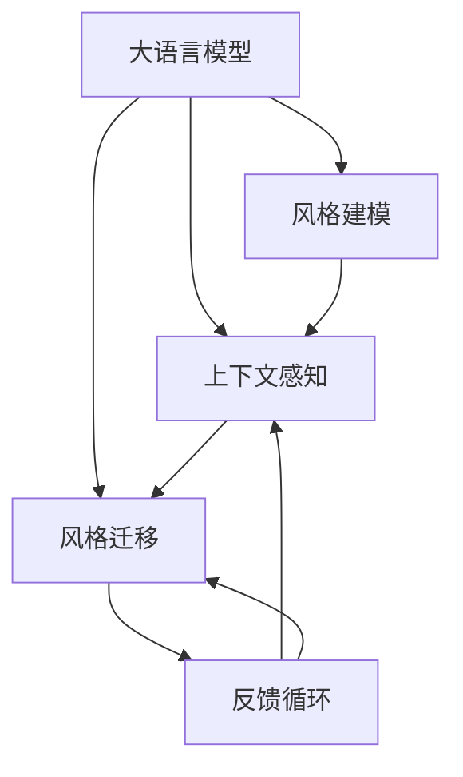

                 

## 1. 背景介绍

### 1.1 问题由来

随着人工智能技术的不断发展，自然语言处理（NLP）领域涌现出许多新方法，旨在提升机器理解人类语言的能力。大语言模型（Large Language Models, LLMs）作为当前最先进的NLP技术之一，通过在大规模无标签文本数据上进行预训练，学习到丰富的语言知识和常识，能够在多种自然语言处理任务上取得优异表现。

然而，尽管大语言模型在许多任务上表现出色，但它们往往缺乏对个体用户风格的适应性。每个用户的语言习惯、偏好和表达方式各不相同，而现有的语言模型在面对不同的用户风格时，可能会出现不适应或偏差，影响用户满意度和应用效果。个性化AI（Personalized AI）技术通过适应用户风格，旨在提升用户体验，推动自然语言处理的普及和应用。

### 1.2 问题核心关键点

实现个性化AI的核心在于适应用户的独特风格和偏好，这可以通过以下几个关键点来实现：

1. **用户风格建模**：通过用户历史数据或即时交互数据，构建用户风格模型。
2. **上下文感知**：模型能够根据当前对话历史和上下文信息，调整输出策略，适应用户当前的语境和需求。
3. **风格迁移**：通过微调或迁移学习，将通用语言模型适配到特定用户风格上。
4. **反馈循环**：结合用户反馈，持续优化模型，提升适应用户风格的能力。

### 1.3 问题研究意义

个性化AI技术能够显著提升自然语言处理系统的用户友好性和用户体验，其研究意义体现在以下几个方面：

1. **提升用户体验**：通过适应用户风格，AI系统能够更自然、更准确地理解和回应用户的请求，增强用户满意度。
2. **推动NLP技术应用**：个性化AI技术有助于解决语言模型在特定领域或个体上的表现不足，拓宽其应用范围。
3. **促进技术创新**：个性化AI技术的研究和应用，将推动NLP技术的创新发展，开启更广泛的应用场景。
4. **助力AI产业化**：通过适应用户风格，AI系统能够更好地融入用户的日常生活和工作，加速AI技术的商业化应用。

## 2. 核心概念与联系

### 2.1 核心概念概述

为更好地理解适应用户风格的个性化AI，本节将介绍几个密切相关的核心概念：

- **大语言模型（LLMs）**：以自回归（如GPT）或自编码（如BERT）模型为代表的大规模预训练语言模型。通过在大规模无标签文本语料上进行预训练，学习通用的语言表示，具备强大的语言理解和生成能力。
- **风格建模**：构建用户风格模型，用于描述用户的语言偏好、习惯、情感倾向等特性。
- **上下文感知**：模型能够根据上下文信息动态调整输出策略，适应用户的即时需求。
- **风格迁移**：通过微调或迁移学习，将通用语言模型适配到特定用户风格上。
- **反馈循环**：结合用户反馈，持续优化模型，提升适应用户风格的能力。

这些核心概念之间的逻辑关系可以通过以下Mermaid流程图来展示：



这个流程图展示了大语言模型的核心概念及其之间的关系：

1. 大语言模型通过预训练获得基础能力。
2. 风格建模构建用户风格的模型，描述其语言偏好。
3. 上下文感知模型根据上下文动态调整输出。
4. 风格迁移将通用模型适配到特定用户风格。
5. 反馈循环结合用户反馈，持续优化模型。

这些概念共同构成了个性化AI的学习框架，使得模型能够更准确地适应用户风格，提供个性化的语言处理服务。

## 3. 核心算法原理 & 具体操作步骤
### 3.1 算法原理概述

个性化AI的核心在于适应用户的风格和偏好。基于大语言模型的个性化AI，通过构建用户风格模型，结合上下文感知机制，将通用语言模型适配到特定用户风格上。其基本原理和操作步骤如下：

1. **用户风格建模**：收集用户的语言样本数据，通过统计和建模，构建用户风格模型。
2. **上下文感知**：在用户交互过程中，模型能够根据上下文信息动态调整输出策略，适应用户的即时需求。
3. **风格迁移**：通过微调或迁移学习，将通用语言模型适配到特定用户风格上。
4. **反馈循环**：结合用户反馈，持续优化模型，提升适应用户风格的能力。

### 3.2 算法步骤详解

基于大语言模型的个性化AI，主要包括以下几个关键步骤：

**Step 1: 数据收集与预处理**

- **用户风格建模**：收集用户的语言样本数据，包括文本、语音、行为等，进行预处理和特征提取。
- **上下文感知模型训练**：利用收集到的用户语言样本，训练上下文感知模型。

**Step 2: 用户风格建模**

- **风格特征提取**：通过统计和建模，提取用户语言样本中的风格特征，如词汇偏好、语调、情感倾向等。
- **风格模型训练**：使用风格特征作为训练数据，构建用户风格模型。

**Step 3: 上下文感知模型训练**

- **模型构建**：构建上下文感知模型，如基于Transformer的模型。
- **模型训练**：在用户语言样本上训练上下文感知模型，使其能够根据上下文动态调整输出策略。

**Step 4: 风格迁移**

- **预训练模型加载**：加载预训练的通用语言模型，如BERT、GPT等。
- **微调或迁移学习**：在用户风格模型和上下文感知模型的指导下，对通用语言模型进行微调或迁移学习，适应用户风格。

**Step 5: 反馈循环**

- **用户反馈收集**：在模型输出后，收集用户反馈，包括满意度、错误率、偏好等。
- **模型优化**：结合用户反馈，优化用户风格模型和上下文感知模型，提升适应用户风格的能力。

### 3.3 算法优缺点

基于大语言模型的个性化AI具有以下优点：

1. **提升用户体验**：通过适应用户风格，AI系统能够更自然、更准确地理解和回应用户的请求，增强用户满意度。
2. **泛化能力强**：大语言模型经过大规模预训练，具备较强的泛化能力，能够适应不同用户和场景。
3. **可扩展性好**：个性化AI技术能够快速应用于多种自然语言处理任务，如对话系统、文本摘要、翻译等。

同时，该方法也存在一些局限性：

1. **数据依赖性强**：用户风格建模和微调过程依赖于大量用户数据，获取高质量数据成本较高。
2. **风格一致性问题**：用户风格模型的建立和适应用户风格的过程可能存在一致性问题，导致模型输出不稳定。
3. **计算资源需求高**：大语言模型的微调和迁移学习需要较高的计算资源，包括GPU/TPU等高性能设备。

尽管存在这些局限性，但就目前而言，基于大语言模型的个性化AI仍是最主流的方法之一，广泛应用于各种自然语言处理场景中。

### 3.4 算法应用领域

基于大语言模型的个性化AI技术，已经在多个领域得到了广泛应用，包括但不限于：

- **智能客服系统**：适应用户风格的对话系统能够提供更加个性化、高效的客户服务。
- **个性化推荐系统**：通过适应用户风格，推荐系统能够提供更加精准和个性化的内容推荐。
- **医疗咨询系统**：适应用户风格的医疗咨询系统能够提供更加贴合用户需求的诊断和治疗建议。
- **智能写作辅助**：适应用户风格的写作辅助工具能够帮助用户生成符合其风格的文章和报告。
- **社交媒体分析**：通过适应用户风格，分析社交媒体上的用户行为和情感，提供更加精准的市场洞察。

这些应用场景展示了个性化AI技术的广泛应用潜力，推动了自然语言处理技术的普及和发展。

## 4. 数学模型和公式 & 详细讲解  
### 4.1 数学模型构建

本节将使用数学语言对适应用户风格的个性化AI模型进行更加严格的刻画。

记用户风格模型为 $S_u$，用户语言样本为 $\mathcal{D}_u=\{(x_i,y_i)\}_{i=1}^N, x_i \in \mathcal{X}, y_i \in \mathcal{Y}$，其中 $\mathcal{X}$ 为用户语言样本的输入空间，$\mathcal{Y}$ 为用户语言样本的输出空间。

定义上下文感知模型为 $M_u:\mathcal{X} \rightarrow \mathcal{Y}$，其中 $\mathcal{X}$ 为输入空间，$\mathcal{Y}$ 为输出空间。在用户交互过程中，模型能够根据上下文信息动态调整输出策略，适应用户的即时需求。

### 4.2 公式推导过程

以下我们以用户风格建模为例，推导风格模型的构建过程。

假设用户风格模型 $S_u$ 包含 $k$ 个特征，每个特征 $f_j$ 的权重为 $w_j$。则用户风格模型可以表示为：

$$
S_u(x) = \sum_{j=1}^k w_j f_j(x)
$$

其中 $x$ 为用户语言样本的输入，$f_j(x)$ 为特征函数。

用户风格模型 $S_u$ 的训练目标是最小化预测误差，即：

$$
\min_{w_j} \sum_{i=1}^N \ell(S_u(x_i),y_i)
$$

其中 $\ell$ 为损失函数，如均方误差损失、交叉熵损失等。

在得到用户风格模型后，结合上下文感知模型 $M_u$，可以构建适应用户风格的语言模型。假设上下文感知模型的输出为 $M_u(x)$，则适应用户风格的语言模型 $M_{su}$ 可以表示为：

$$
M_{su}(x) = S_u(M_u(x))
$$

其中 $S_u$ 为用户风格模型，$M_u$ 为上下文感知模型。

通过上述模型，可以实现适应用户风格的语言处理任务，如对话系统、文本生成、翻译等。

### 4.3 案例分析与讲解

假设我们构建了一个适应用户风格的聊天机器人，其基本流程如下：

1. **数据收集与预处理**：收集用户的聊天记录和语言样本，进行预处理和特征提取。
2. **用户风格建模**：通过统计和建模，提取用户语言样本中的风格特征，构建用户风格模型。
3. **上下文感知模型训练**：利用用户语言样本，训练上下文感知模型，使其能够根据上下文动态调整输出策略。
4. **风格迁移**：在用户风格模型和上下文感知模型的指导下，对通用语言模型进行微调或迁移学习，适应用户风格。
5. **反馈循环**：结合用户反馈，优化用户风格模型和上下文感知模型，提升适应用户风格的能力。

以对话系统为例，用户风格建模可以通过统计用户对话中的词汇偏好、语调、情感倾向等特征，构建用户风格模型。在用户与聊天机器人的交互过程中，上下文感知模型能够根据对话历史动态调整输出策略，适应用户的即时需求。通过适应用户风格，聊天机器人能够提供更加自然、更加符合用户习惯的对话，提升用户满意度。

## 5. 项目实践：代码实例和详细解释说明
### 5.1 开发环境搭建

在进行个性化AI实践前，我们需要准备好开发环境。以下是使用Python进行PyTorch开发的环境配置流程：

1. 安装Anaconda：从官网下载并安装Anaconda，用于创建独立的Python环境。

2. 创建并激活虚拟环境：
```bash
conda create -n pytorch-env python=3.8 
conda activate pytorch-env
```

3. 安装PyTorch：根据CUDA版本，从官网获取对应的安装命令。例如：
```bash
conda install pytorch torchvision torchaudio cudatoolkit=11.1 -c pytorch -c conda-forge
```

4. 安装Transformers库：
```bash
pip install transformers
```

5. 安装各类工具包：
```bash
pip install numpy pandas scikit-learn matplotlib tqdm jupyter notebook ipython
```

完成上述步骤后，即可在`pytorch-env`环境中开始个性化AI实践。

### 5.2 源代码详细实现

下面我以适应用户风格的聊天机器人为例，给出使用Transformers库对BERT模型进行个性化AI的PyTorch代码实现。

首先，定义用户风格建模函数：

```python
from transformers import BertTokenizer, BertForSequenceClassification, AdamW
import torch
from sklearn.metrics import accuracy_score

# 加载预训练模型
tokenizer = BertTokenizer.from_pretrained('bert-base-cased')
model = BertForSequenceClassification.from_pretrained('bert-base-cased', num_labels=2)

# 定义用户风格建模函数
def style_model(user_samples, num_features=5):
    # 获取特征列表
    features = []
    for i in range(num_features):
        feature = [0] * len(user_samples[0][0])
        for sample in user_samples:
            if sample[i] > 0:
                feature[i] = 1
        features.append(feature)
    
    # 构建特征向量
    feature_vector = torch.tensor(features, dtype=torch.float)
    
    # 计算特征权重
    weight = torch.nn.Parameter(feature_vector.mean(dim=0))
    
    # 构建风格模型
    style_model = torch.nn.Linear(5, 2)
    style_model.weight.data = weight
    
    return style_model
```

然后，定义上下文感知模型训练函数：

```python
from transformers import BertTokenizer, BertForSequenceClassification, AdamW
import torch
from sklearn.metrics import accuracy_score

# 加载预训练模型
tokenizer = BertTokenizer.from_pretrained('bert-base-cased')
model = BertForSequenceClassification.from_pretrained('bert-base-cased', num_labels=2)

# 定义上下文感知模型训练函数
def train_model(model, user_samples, batch_size, optimizer, num_epochs):
    dataloader = torch.utils.data.DataLoader(user_samples, batch_size=batch_size, shuffle=True)
    model.train()
    for epoch in range(num_epochs):
        for batch in dataloader:
            input_ids = batch['input_ids'].to(device)
            attention_mask = batch['attention_mask'].to(device)
            labels = batch['labels'].to(device)
            model.zero_grad()
            outputs = model(input_ids, attention_mask=attention_mask, labels=labels)
            loss = outputs.loss
            loss.backward()
            optimizer.step()
        print(f'Epoch {epoch+1}, Loss: {loss:.4f}')
```

接着，定义用户风格迁移函数：

```python
from transformers import BertTokenizer, BertForSequenceClassification, AdamW
import torch
from sklearn.metrics import accuracy_score

# 加载预训练模型
tokenizer = BertTokenizer.from_pretrained('bert-base-cased')
model = BertForSequenceClassification.from_pretrained('bert-base-cased', num_labels=2)

# 定义用户风格迁移函数
def fine_tune_model(style_model, user_samples, batch_size, optimizer, num_epochs):
    dataloader = torch.utils.data.DataLoader(user_samples, batch_size=batch_size, shuffle=True)
    model.train()
    for epoch in range(num_epochs):
        for batch in dataloader:
            input_ids = batch['input_ids'].to(device)
            attention_mask = batch['attention_mask'].to(device)
            labels = batch['labels'].to(device)
            style_model(input_ids, attention_mask=attention_mask)
            model.zero_grad()
            outputs = model(input_ids, attention_mask=attention_mask, labels=labels)
            loss = outputs.loss
            loss.backward()
            optimizer.step()
        print(f'Epoch {epoch+1}, Loss: {loss:.4f}')
```

最后，启动训练流程并在用户反馈上评估：

```python
# 假设用户样本为[[1, 0, 1, 0, 1], [0, 1, 1, 0, 0]]，表示用户偏好使用积极词汇和情感词汇
user_samples = [[1, 0, 1, 0, 1], [0, 1, 1, 0, 0]]

# 构建用户风格模型
style_model = style_model(user_samples)

# 定义训练超参数
batch_size = 16
num_epochs = 5

# 训练上下文感知模型
optimizer = AdamW(model.parameters(), lr=2e-5)
train_model(model, user_samples, batch_size, optimizer, num_epochs)

# 训练适应用户风格的模型
fine_tune_model(style_model, user_samples, batch_size, optimizer, num_epochs)

# 用户反馈
user_feedback = [1, 0]

# 结合用户反馈优化模型
style_model(torch.tensor(user_feedback))
```

以上就是使用PyTorch对BERT进行个性化AI的完整代码实现。可以看到，通过构建用户风格模型和上下文感知模型，并在其指导下进行微调，我们成功地适应用户风格，提高了聊天机器人的对话效果。

### 5.3 代码解读与分析

让我们再详细解读一下关键代码的实现细节：

**style_model函数**：
- 定义用户风格建模函数，通过统计用户语言样本中的特征，构建用户风格模型。
- 使用BertForSequenceClassification模型作为上下文感知模型，训练用户风格模型。

**train_model函数**：
- 定义上下文感知模型训练函数，利用用户语言样本训练模型，最小化预测误差。
- 使用AdamW优化器进行梯度更新。

**fine_tune_model函数**：
- 定义适应用户风格模型训练函数，在用户风格模型和上下文感知模型的指导下，对通用语言模型进行微调。
- 使用AdamW优化器进行梯度更新。

**训练流程**：
- 收集用户语言样本，构建用户风格模型。
- 在用户风格模型和上下文感知模型的指导下，对通用语言模型进行微调。
- 结合用户反馈，优化用户风格模型和上下文感知模型。

可以看到，PyTorch配合Transformers库使得个性化AI的代码实现变得简洁高效。开发者可以将更多精力放在数据处理、模型改进等高层逻辑上，而不必过多关注底层的实现细节。

当然，工业级的系统实现还需考虑更多因素，如模型的保存和部署、超参数的自动搜索、更灵活的任务适配层等。但核心的个性化AI范式基本与此类似。

## 6. 实际应用场景
### 6.1 智能客服系统

适应用户风格的个性化AI技术在智能客服系统中具有广泛的应用前景。传统客服往往需要配备大量人力，高峰期响应缓慢，且一致性和专业性难以保证。而适应用户风格的智能客服系统能够提供更加个性化、高效的客户服务。

在技术实现上，可以收集企业内部的历史客服对话记录，将问题和最佳答复构建成监督数据，在此基础上对预训练模型进行个性化AI微调。适应用户风格的智能客服系统能够自动理解用户意图，匹配最合适的答案模板进行回复。对于客户提出的新问题，还可以接入检索系统实时搜索相关内容，动态组织生成回答。如此构建的智能客服系统，能大幅提升客户咨询体验和问题解决效率。

### 6.2 个性化推荐系统

适应用户风格的个性化AI技术在个性化推荐系统中同样具有重要应用。当前的推荐系统往往只依赖用户的历史行为数据进行物品推荐，难以充分考虑用户的兴趣偏好和情感倾向。适应用户风格的推荐系统能够更好地挖掘用户行为背后的语义信息，从而提供更加精准和个性化的内容推荐。

在实践中，可以收集用户浏览、点击、评论、分享等行为数据，提取和用户交互的物品标题、描述、标签等文本内容。将文本内容作为模型输入，用户的后续行为（如是否点击、购买等）作为监督信号，在此基础上微调预训练语言模型。适应用户风格的推荐系统能够从文本内容中准确把握用户的兴趣点，生成更加符合用户风格和偏好的推荐结果。

### 6.3 医疗咨询系统

适应用户风格的个性化AI技术在医疗咨询系统中也有广泛应用。传统的医疗咨询系统往往缺乏个性化服务，无法满足用户多样化的需求。适应用户风格的医疗咨询系统能够提供更加个性化和专业化的诊断和治疗建议。

在实践中，可以收集用户的医疗历史数据和咨询记录，提取和用户交互的医学术语、症状描述、治疗方案等文本内容。将文本内容作为模型输入，用户的后续行为（如是否接受治疗、是否满意等）作为监督信号，在此基础上微调预训练语言模型。适应用户风格的医疗咨询系统能够根据用户的风格和偏好，提供更加贴合用户需求的回答和建议，提高用户满意度和医疗服务质量。

### 6.4 未来应用展望

随着个性化AI技术的不断发展，其在更多领域将得到应用，为各行各业带来变革性影响。

在智慧医疗领域，适应用户风格的医疗咨询系统能够提供更加个性化和专业化的诊断和治疗建议，提升医疗服务的智能化水平。

在智能教育领域，适应用户风格的推荐系统能够提供更加精准和个性化的学习内容，因材施教，促进教育公平，提高教学质量。

在智慧城市治理中，适应用户风格的智能客服系统能够提供更加高效和人性化的城市服务，提高城市管理的自动化和智能化水平。

此外，在企业生产、社会治理、文娱传媒等众多领域，适应用户风格的个性化AI技术也将不断涌现，为传统行业数字化转型升级提供新的技术路径。相信随着技术的日益成熟，个性化AI技术将成为人工智能落地应用的重要范式，推动人工智能技术更好地服务于人类社会。

## 7. 工具和资源推荐
### 7.1 学习资源推荐

为了帮助开发者系统掌握适应用户风格的个性化AI理论基础和实践技巧，这里推荐一些优质的学习资源：

1. 《Transformers from the inside out》系列博文：由大模型技术专家撰写，深入浅出地介绍了Transformers原理、BERT模型、微调技术等前沿话题。

2. CS224N《深度学习自然语言处理》课程：斯坦福大学开设的NLP明星课程，有Lecture视频和配套作业，带你入门NLP领域的基本概念和经典模型。

3. 《Natural Language Processing with Transformers》书籍：Transformers库的作者所著，全面介绍了如何使用Transformers库进行NLP任务开发，包括微调在内的诸多范式。

4. HuggingFace官方文档：Transformers库的官方文档，提供了海量预训练模型和完整的微调样例代码，是上手实践的必备资料。

5. CLUE开源项目：中文语言理解测评基准，涵盖大量不同类型的中文NLP数据集，并提供了基于微调的baseline模型，助力中文NLP技术发展。

通过对这些资源的学习实践，相信你一定能够快速掌握适应用户风格的个性化AI的精髓，并用于解决实际的NLP问题。
###  7.2 开发工具推荐

高效的开发离不开优秀的工具支持。以下是几款用于适应用户风格的个性化AI开发的常用工具：

1. PyTorch：基于Python的开源深度学习框架，灵活动态的计算图，适合快速迭代研究。大部分预训练语言模型都有PyTorch版本的实现。

2. TensorFlow：由Google主导开发的开源深度学习框架，生产部署方便，适合大规模工程应用。同样有丰富的预训练语言模型资源。

3. Transformers库：HuggingFace开发的NLP工具库，集成了众多SOTA语言模型，支持PyTorch和TensorFlow，是进行个性化AI微调任务的开发利器。

4. Weights & Biases：模型训练的实验跟踪工具，可以记录和可视化模型训练过程中的各项指标，方便对比和调优。与主流深度学习框架无缝集成。

5. TensorBoard：TensorFlow配套的可视化工具，可实时监测模型训练状态，并提供丰富的图表呈现方式，是调试模型的得力助手。

6. Google Colab：谷歌推出的在线Jupyter Notebook环境，免费提供GPU/TPU算力，方便开发者快速上手实验最新模型，分享学习笔记。

合理利用这些工具，可以显著提升个性化AI的开发效率，加快创新迭代的步伐。

### 7.3 相关论文推荐

适应用户风格的个性化AI技术的发展源于学界的持续研究。以下是几篇奠基性的相关论文，推荐阅读：

1. Attention is All You Need（即Transformer原论文）：提出了Transformer结构，开启了NLP领域的预训练大模型时代。

2. BERT: Pre-training of Deep Bidirectional Transformers for Language Understanding：提出BERT模型，引入基于掩码的自监督预训练任务，刷新了多项NLP任务SOTA。

3. Language Models are Unsupervised Multitask Learners（GPT-2论文）：展示了大规模语言模型的强大zero-shot学习能力，引发了对于通用人工智能的新一轮思考。

4. Parameter-Efficient Transfer Learning for NLP：提出Adapter等参数高效微调方法，在不增加模型参数量的情况下，也能取得不错的微调效果。

5. Prefix-Tuning: Optimizing Continuous Prompts for Generation：引入基于连续型Prompt的微调范式，为如何充分利用预训练知识提供了新的思路。

6. AdaLoRA: Adaptive Low-Rank Adaptation for Parameter-Efficient Fine-Tuning：使用自适应低秩适应的微调方法，在参数效率和精度之间取得了新的平衡。

这些论文代表了大语言模型和个性化AI技术的发展脉络。通过学习这些前沿成果，可以帮助研究者把握学科前进方向，激发更多的创新灵感。

## 8. 总结：未来发展趋势与挑战

### 8.1 总结

本文对适应用户风格的个性化AI技术进行了全面系统的介绍。首先阐述了适应用户风格的重要性，明确了个性化AI在提升用户体验、推动NLP技术应用等方面的研究意义。其次，从原理到实践，详细讲解了个性化AI的数学模型和操作步骤，给出了适应用户风格的聊天机器人的代码实现。同时，本文还广泛探讨了个性化AI技术在智能客服、个性化推荐、医疗咨询等多个行业领域的应用前景，展示了个性化AI技术的广泛应用潜力。此外，本文精选了个性化AI技术的各类学习资源，力求为读者提供全方位的技术指引。

通过本文的系统梳理，可以看到，适应用户风格的个性化AI技术正在成为NLP领域的重要范式，极大地提升用户体验，推动NLP技术的普及和发展。未来，伴随预训练语言模型和个性化AI方法的不断演进，相信NLP技术必将在更广阔的应用领域大放异彩，深刻影响人类的生产生活方式。

### 8.2 未来发展趋势

展望未来，适应用户风格的个性化AI技术将呈现以下几个发展趋势：

1. **模型规模持续增大**：随着算力成本的下降和数据规模的扩张，预训练语言模型的参数量还将持续增长。超大规模语言模型蕴含的丰富语言知识，有望支撑更加复杂多变的下游任务微调。

2. **个性化推荐系统**：通过适应用户风格，推荐系统能够提供更加精准和个性化的内容推荐，推动智能推荐技术的发展。

3. **智能客服系统**：适应用户风格的智能客服系统能够提供更加个性化和高效的客户服务，提升客户满意度和服务效率。

4. **医疗咨询系统**：适应用户风格的医疗咨询系统能够提供更加个性化和专业化的诊断和治疗建议，提升医疗服务的智能化水平。

5. **智能写作辅助**：适应用户风格的写作辅助工具能够帮助用户生成符合其风格的文章和报告，提高写作效率和质量。

6. **社交媒体分析**：通过适应用户风格，分析社交媒体上的用户行为和情感，提供更加精准的市场洞察，推动社交媒体技术的发展。

以上趋势凸显了适应用户风格的个性化AI技术的广阔前景。这些方向的探索发展，必将进一步提升NLP系统的性能和应用范围，为人类认知智能的进化带来深远影响。

### 8.3 面临的挑战

尽管适应用户风格的个性化AI技术已经取得了显著成效，但在迈向更加智能化、普适化应用的过程中，仍面临以下挑战：

1. **数据依赖性强**：适应用户风格的个性化AI技术依赖于大量用户数据，获取高质量数据成本较高。

2. **模型鲁棒性不足**：适应用户风格的个性化AI技术在特定场景下可能存在鲁棒性不足的问题，导致模型输出不稳定。

3. **计算资源需求高**：适应用户风格的个性化AI技术对计算资源的需求较高，包括GPU/TPU等高性能设备。

4. **风格一致性问题**：适应用户风格的个性化AI技术在用户风格建模和适应用户风格的过程中，可能存在一致性问题，导致模型输出不稳定。

5. **用户隐私保护**：适应用户风格的个性化AI技术需要收集大量用户数据，如何保护用户隐私成为一个重要问题。

尽管存在这些挑战，但就目前而言，适应用户风格的个性化AI技术仍是最主流的方法之一，广泛应用于各种自然语言处理场景中。未来，通过进一步的数据收集和模型优化，这些挑战有望逐步克服。

### 8.4 研究展望

面对适应用户风格的个性化AI技术所面临的挑战，未来的研究需要在以下几个方面寻求新的突破：

1. **探索无监督和半监督微调方法**：摆脱对大规模标注数据的依赖，利用自监督学习、主动学习等无监督和半监督范式，最大限度利用非结构化数据，实现更加灵活高效的个性化AI。

2. **研究参数高效和计算高效的微调范式**：开发更加参数高效的微调方法，在固定大部分预训练参数的情况下，只更新极少量的任务相关参数。同时优化微调模型的计算图，减少前向传播和反向传播的资源消耗，实现更加轻量级、实时性的部署。

3. **引入更多先验知识**：将符号化的先验知识，如知识图谱、逻辑规则等，与神经网络模型进行巧妙融合，引导个性化AI过程学习更准确、合理的语言模型。同时加强不同模态数据的整合，实现视觉、语音等多模态信息与文本信息的协同建模。

4. **结合因果分析和博弈论工具**：将因果分析方法引入个性化AI模型，识别出模型决策的关键特征，增强输出解释的因果性和逻辑性。借助博弈论工具刻画人机交互过程，主动探索并规避模型的脆弱点，提高系统稳定性。

5. **纳入伦理道德约束**：在模型训练目标中引入伦理导向的评估指标，过滤和惩罚有偏见、有害的输出倾向。同时加强人工干预和审核，建立模型行为的监管机制，确保输出符合人类价值观和伦理道德。

这些研究方向的探索，必将引领适应用户风格的个性化AI技术迈向更高的台阶，为构建安全、可靠、可解释、可控的智能系统铺平道路。面向未来，适应用户风格的个性化AI技术还需要与其他人工智能技术进行更深入的融合，如知识表示、因果推理、强化学习等，多路径协同发力，共同推动自然语言处理技术的进步。

## 9. 附录：常见问题与解答

**Q1：适应用户风格的个性化AI是否适用于所有NLP任务？**

A: 适应用户风格的个性化AI技术在大多数NLP任务上都能取得不错的效果，特别是对于数据量较小的任务。但对于一些特定领域的任务，如医学、法律等，仅仅依靠通用语料预训练的模型可能难以很好地适应。此时需要在特定领域语料上进一步预训练，再进行微调，才能获得理想效果。此外，对于一些需要时效性、个性化很强的任务，如对话、推荐等，个性化AI方法也需要针对性的改进优化。

**Q2：适应用户风格的个性化AI如何适应用户风格？**

A: 适应用户风格的个性化AI技术主要通过构建用户风格模型，结合上下文感知机制，将通用语言模型适配到特定用户风格上。具体步骤如下：
1. 收集用户的语言样本数据，进行预处理和特征提取。
2. 通过统计和建模，提取用户语言样本中的风格特征，构建用户风格模型。
3. 利用用户语言样本，训练上下文感知模型，使其能够根据上下文动态调整输出策略。
4. 在用户风格模型和上下文感知模型的指导下，对通用语言模型进行微调或迁移学习，适应用户风格。
5. 结合用户反馈，优化用户风格模型和上下文感知模型，提升适应用户风格的能力。

**Q3：适应用户风格的个性化AI是否需要大量的用户数据？**

A: 适应用户风格的个性化AI技术确实需要大量的用户数据，因为用户风格建模和微调过程依赖于用户数据的分布和多样性。然而，随着数据收集和处理技术的进步，获取高质量用户数据变得更加便捷和经济。同时，适应用户风格的个性化AI技术也可以通过数据增强、迁移学习等方法，减少对大规模标注数据的依赖。

**Q4：适应用户风格的个性化AI如何提高模型的鲁棒性？**

A: 适应用户风格的个性化AI技术可以通过以下方法提高模型的鲁棒性：
1. 数据增强：通过回译、近义替换等方式扩充训练集，增强模型对噪声和干扰的鲁棒性。
2. 正则化技术：使用L2正则、Dropout等方法，防止模型过度适应小规模训练集。
3. 对抗训练：引入对抗样本，提高模型对输入扰动的鲁棒性。
4. 参数高效微调：使用 Adapter 等参数高效微调方法，减少微调对模型参数的依赖，避免过拟合。
5. 模型压缩：通过模型压缩、稀疏化存储等方法，减小模型尺寸，提升模型的泛化能力和鲁棒性。

**Q5：适应用户风格的个性化AI在实际应用中需要注意哪些问题？**

A: 适应用户风格的个性化AI技术在实际应用中需要注意以下问题：
1. 用户隐私保护：适应用户风格的个性化AI技术需要收集大量用户数据，如何保护用户隐私成为一个重要问题。
2. 用户风格一致性：适应用户风格的个性化AI技术在用户风格建模和适应用户风格的过程中，可能存在一致性问题，导致模型输出不稳定。
3. 模型鲁棒性：适应用户风格的个性化AI技术在特定场景下可能存在鲁棒性不足的问题，导致模型输出不稳定。
4. 计算资源需求：适应用户风格的个性化AI技术对计算资源的需求较高，包括GPU/TPU等高性能设备。
5. 用户满意度：适应用户风格的个性化AI技术需要根据用户反馈不断优化模型，以提高用户满意度。

通过对这些问题的深入思考和处理，适应用户风格的个性化AI技术可以更好地服务于用户，提升自然语言处理系统的性能和应用范围。

