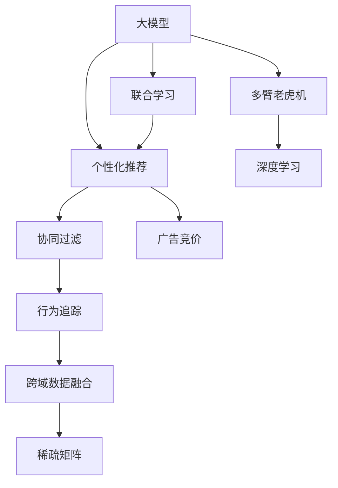

                 

# 个性化广告推荐：大模型的精准定位

> 关键词：大模型,个性化推荐,广告投放,推荐算法,多臂老虎机,深度学习,行为追踪,跨域数据融合,稀疏矩阵,联合学习,广告竞价

## 1. 背景介绍

### 1.1 问题由来
在当今数字化营销时代，广告投放策略的好坏直接决定了广告主的营销效果和投资回报。个性化广告推荐系统的目的是通过算法匹配广告主和用户，使广告投放更加精准，实现用户的精准触达和需求的精准满足。然而，传统基于规则或统计的方法已难以适应快速变化的市场和用户行为，个性化广告推荐系统亟需新的技术突破。

### 1.2 问题核心关键点
个性化广告推荐系统的大规模成功部署，依赖于高质量的推荐模型和大规模用户行为数据的有效利用。深度学习和大模型的涌现，为广告推荐系统带来了新的方法论。特别是以大模型为代表的多臂老虎机算法，通过模拟多个广告投放组合的相互竞争，能够实时调整投放策略，实现广告的精准定位。

### 1.3 问题研究意义
大模型在个性化广告推荐中的应用，不仅显著提升了广告投放的精准度，还大幅度降低了广告主的投放成本。通过优化广告预算分配，避免无效曝光和浪费，广告主能够更高效地实现营销目标。同时，用户也能够在更适合自己的时间、场景中接触到精准的广告内容，提升广告投放的效果和用户的点击转化率。

## 2. 核心概念与联系

### 2.1 核心概念概述

为更好地理解基于大模型的个性化广告推荐方法，本节将介绍几个密切相关的核心概念：

- 大模型(Large Model)：以深度神经网络为代表的、具有大规模参数量的模型。通过在大规模数据上训练，大模型能够学习到复杂的数据分布和关系，具备较强的泛化能力。

- 个性化推荐系统(Personalized Recommendation System)：根据用户的历史行为和特征，推荐可能满足用户需求的商品或服务。个性化推荐系统通过深度学习和协同过滤等方法，在广告、电商、影视等多个领域得到了广泛应用。

- 多臂老虎机(Multi-Armed Bandit, MAB)：用于模拟具有多个操作按钮或广告投放策略的场景，每个按钮或策略有其收益或效果。多臂老虎机算法通过不断尝试和优化，实现最佳收益或效果。

- 深度学习(Deep Learning)：一种基于神经网络的机器学习方法，通过多层神经网络的堆叠，学习数据的高级表示。深度学习在图像、语音、文本等多个领域展现了强大的能力。

- 协同过滤(Collaborative Filtering)：利用用户行为数据和物品相似性，推荐用户可能感兴趣的新商品。协同过滤包括基于用户的协同过滤和基于物品的协同过滤两种方法。

- 行为追踪(Behavior Tracking)：通过跟踪用户在互联网上的行为，如点击、浏览、购买等，获取用户兴趣和行为特征。行为追踪为推荐系统提供了重要的数据来源。

- 跨域数据融合(Cross-domain Data Fusion)：通过结合多个数据源和异构数据，构建统一的数据视角，提升推荐系统的效果。跨域数据融合适用于推荐系统中的多源数据融合问题。

- 稀疏矩阵(Sparse Matrix)：在推荐系统中，用户和物品的交互行为通常稀疏分布，需要通过稀疏矩阵存储和处理。

- 联合学习(Federated Learning)：一种分布式机器学习方法，多个用户或设备在不共享原始数据的前提下，通过本地模型训练，实现全局模型的更新。联合学习适用于个性化推荐系统中分布式数据的问题。

- 广告竞价(Auction System)：广告主根据广告投放效果，动态调整出价。广告竞价系统通过机制设计，保证广告主和平台的公平交易。

这些核心概念之间的逻辑关系可以通过以下Mermaid流程图来展示：



这个流程图展示了大模型在个性化广告推荐系统中的核心概念及其之间的关系：

1. 大模型通过深度学习的方式进行训练，学习用户行为和物品特征之间的关系。
2. 多臂老虎机算法模拟多个广告投放策略的竞争，通过不断优化，实现广告的精准定位。
3. 协同过滤、行为追踪、跨域数据融合、稀疏矩阵、联合学习等方法，共同构建推荐系统的数据基础和优化策略。
4. 广告竞价系统为广告投放提供了动态调价机制，保证了广告主和平台的公平交易。

这些概念共同构成了个性化广告推荐系统的技术框架，使其能够在用户行为多样、市场变化迅速的环境中，实现广告投放的精准定位。

## 3. 核心算法原理 & 具体操作步骤
### 3.1 算法原理概述

基于大模型的个性化广告推荐系统，本质上是一种多臂老虎机问题。其主要思想是：将广告投放策略视为多个“手臂”，每个手臂代表一种广告投放组合。系统通过不断的尝试和优化，选择效果最佳的手臂进行投放，从而实现广告的精准定位和预算的优化分配。

形式化地，假设广告投放的多个组合为 $\mathcal{A}=\{a_1, a_2, ..., a_K\}$，每个组合对应的收益为 $\mathcal{R}=\{r_1, r_2, ..., r_K\}$。广告投放的目标是最大化总收益，即：

$$
\max_{a_k \in \mathcal{A}} \sum_{k=1}^K r_k
$$

其中，$a_k$ 为第 $k$ 个广告投放策略，$r_k$ 为第 $k$ 个策略的收益。

在大模型框架下，推荐系统利用深度学习模型预测每个广告策略的收益。模型输入包括用户特征、广告特征等，输出为每个策略的预期收益。通过不断尝试和优化，系统能够动态调整广告投放策略，逐步逼近最优收益。

### 3.2 算法步骤详解

基于大模型的个性化广告推荐算法一般包括以下几个关键步骤：

**Step 1: 准备数据和模型**
- 收集广告主投放的广告数据和用户行为数据，包括广告投放效果、用户点击率等。
- 选择合适的深度学习模型，如BERT、DNN等，作为广告投放策略的预测模型。

**Step 2: 设计多臂老虎机策略**
- 定义多臂老虎机算法，如 $\varepsilon$-greedy、UCB等，用于指导广告投放策略的选择。
- 确定广告投放的预算分配策略，如固定预算、线性预算等。

**Step 3: 训练深度学习模型**
- 对收集到的广告数据和用户行为数据进行预处理，提取特征。
- 使用深度学习模型对每个广告策略的预期收益进行预测。
- 在训练过程中，使用交叉验证等技术进行模型调优。

**Step 4: 广告投放优化**
- 根据多臂老虎机算法和模型预测，选择当前最优的广告投放组合。
- 实时跟踪广告投放效果，动态调整投放策略。
- 记录每个广告策略的效果，进行后续分析优化。

**Step 5: 结果评估与反馈**
- 定期评估广告投放效果，计算总收益、点击率等指标。
- 分析广告投放结果，发现问题并优化广告投放策略。
- 持续优化深度学习模型，提升广告投放的精准度和效率。

以上是基于大模型的个性化广告推荐算法的一般流程。在实际应用中，还需要针对具体广告主和广告投放场景，对各个环节进行优化设计，如改进特征提取方法、优化模型结构和训练策略等。

### 3.3 算法优缺点

基于大模型的个性化广告推荐算法具有以下优点：
1. 精准高效：深度学习模型能够从大量历史数据中学习到复杂的用户行为和物品特征，实现精准的广告投放。
2. 自适应性强：广告投放策略可以根据用户行为数据进行实时调整，适应市场变化和用户需求。
3. 可扩展性好：大模型可以轻松地融入多个广告主和多个广告投放场景，实现跨场景和跨主体的推广。
4. 降低成本：通过优化广告投放预算和投放策略，降低无效曝光和浪费，提高广告主的投放回报率。

同时，该算法也存在一定的局限性：
1. 数据依赖性强：广告投放的效果很大程度上取决于广告数据和用户行为数据的质量。数据获取成本高，数据质量参差不齐。
2. 模型复杂度高：大模型的训练和调优需要较高的计算资源和专业知识。模型复杂度可能导致训练时间长、收敛慢等问题。
3. 效果可解释性差：深度学习模型的决策过程通常缺乏可解释性，广告主难以理解其推理逻辑。
4. 鲁棒性不足：深度学习模型可能存在过拟合问题，在市场环境变化或新用户参与时，广告投放效果可能下降。

尽管存在这些局限性，但就目前而言，基于大模型的推荐算法仍是广告投放的最主流范式。未来相关研究的重点在于如何进一步降低数据依赖性，提高模型的可解释性和鲁棒性，同时兼顾广告投放的效果和效率。

### 3.4 算法应用领域

基于大模型的个性化广告推荐算法在广告推荐领域已经得到了广泛的应用，覆盖了广告投放、电商推荐、视频推荐等多个场景，例如：

- 展示广告推荐：如网页展示、视频展示等，通过大模型学习用户的兴趣特征，精准推荐相关广告。
- 搜索广告推荐：如搜索引擎广告推荐，将用户搜索意图与广告内容进行匹配，提升广告的点击率。
- 社交媒体广告推荐：如社交平台上的个性化推荐，根据用户社交行为推荐相关广告。
- 电商广告推荐：如电商平台上的商品推荐，根据用户浏览记录推荐相关商品广告。
- 视频广告推荐：如视频平台上的内容推荐，根据用户观看行为推荐相关广告。

除了上述这些经典场景外，大模型推荐算法还被创新性地应用到更多新兴领域中，如语音广告推荐、AR/VR广告推荐等，为广告投放带来了全新的突破。

## 4. 数学模型和公式 & 详细讲解 & 举例说明
### 4.1 数学模型构建

本节将使用数学语言对基于大模型的个性化广告推荐过程进行更加严格的刻画。

记广告投放的策略集合为 $\mathcal{A}=\{a_1, a_2, ..., a_K\}$，用户行为数据为 $D=\{(x_i, y_i)\}_{i=1}^N, x_i \in \mathcal{X}, y_i \in \{0, 1\}$，其中 $x_i$ 为用户行为特征，$y_i$ 为广告投放效果（点击与否）。假设深度学习模型为 $M_{\theta}$，其中 $\theta$ 为模型参数。

定义模型 $M_{\theta}$ 在用户行为数据 $D$ 上的损失函数为 $\ell(M_{\theta},D) = -\frac{1}{N} \sum_{i=1}^N y_i \log M_{\theta}(x_i)$，用于衡量模型预测广告投放效果的准确性。

广告投放的目标是最大化总收益，即：

$$
\max_{a_k \in \mathcal{A}} \sum_{k=1}^K r_k = \max_{a_k \in \mathcal{A}} \sum_{k=1}^K M_{\theta}(x_k)
$$

其中 $r_k$ 为广告策略 $a_k$ 的预期收益，$M_{\theta}(x_k)$ 为模型预测的广告投放效果。

### 4.2 公式推导过程

以下我们以二分类任务为例，推导多臂老虎机算法的详细步骤。

假设广告投放策略 $a_k$ 的收益 $r_k$ 服从伯努利分布，即 $r_k \sim Bernoulli(r_k^*)$，其中 $r_k^*$ 为策略 $a_k$ 的真实收益。广告投放的目标是最大化总收益，即：

$$
\max_{a_k \in \mathcal{A}} \sum_{k=1}^K r_k = \max_{a_k \in \mathcal{A}} \sum_{k=1}^K r_k^* M_{\theta}(x_k)
$$

在实际应用中，通常使用多臂老虎机算法 $\varepsilon$-greedy 策略。该策略将每个广告策略 $a_k$ 的概率定义为 $P_k = \frac{r_k^*}{\sum_{k=1}^K r_k^*}$，并在每次投放时，以概率 $\varepsilon$ 随机选择一个策略，以概率 $1-\varepsilon$ 选择预期收益最高的策略。

假设广告投放的预算为 $B$，广告投放的次数为 $N$，每次投放策略 $a_k$ 的成本为 $c_k$，则总收益为：

$$
R = \sum_{i=1}^N r_k^* M_{\theta}(x_i)
$$

广告投放的目标是最大化总收益 $R$，即：

$$
\max_{\theta} \sum_{i=1}^N r_k^* M_{\theta}(x_i)
$$

为了解决这个问题，可以采用梯度下降等优化算法，求解模型参数 $\theta$，最小化损失函数 $\ell(M_{\theta},D)$。假设每次迭代的步长为 $\eta$，则每次迭代的目标函数为：

$$
\min_{\theta} \sum_{i=1}^N r_k^* M_{\theta}(x_i) - \eta \ell(M_{\theta},D)
$$

在每次迭代中，系统首先根据当前广告投放效果和用户行为数据，更新模型参数 $\theta$，然后根据 $\varepsilon$-greedy 策略，选择下一个广告投放策略。重复以上步骤，直到达到预定的迭代次数或满足其他停止条件。

### 4.3 案例分析与讲解

考虑一个电商平台的展示广告推荐系统，平台上有多个广告主投放广告，用户的行为数据包括点击率、转化率等。系统通过大模型 $M_{\theta}$ 预测每个广告策略的预期收益，使用 $\varepsilon$-greedy 策略进行广告投放，同时动态调整广告预算。

假设平台有 5 个广告策略，广告策略的预期收益分别为 $r_1=0.3$, $r_2=0.2$, $r_3=0.1$, $r_4=0.05$, $r_5=0.02$。广告投放的预算为 $B=10$，每次广告投放的成本为 $c_k=1$。系统初始选择 $\varepsilon=0.1$，即以 90% 的概率选择预期收益最高的广告策略，以 10% 的概率随机选择一个广告策略。

在第一次投放时，假设平台随机选择了策略 $a_1$，广告投放效果为 $y=1$（点击），则广告投放的收益为 $r_k^* M_{\theta}(x_k)=0.3 M_{\theta}(x_k)$。同时，系统根据当前广告投放效果和用户行为数据，更新模型参数 $\theta$，以减少预期误差。

在第二次投放时，假设系统选择了预期收益最高的策略 $a_2$，广告投放效果为 $y=0$（未点击），则广告投放的收益为 $r_k^* M_{\theta}(x_k)=0.2 M_{\theta}(x_k)$。系统再次根据广告投放效果和用户行为数据，更新模型参数 $\theta$，以进一步优化广告投放策略。

重复以上步骤，直到达到预定的迭代次数或满足其他停止条件，系统最终选择预期收益最高的广告策略，最大化广告投放的总体收益。

## 5. 项目实践：代码实例和详细解释说明
### 5.1 开发环境搭建

在进行广告推荐系统开发前，我们需要准备好开发环境。以下是使用Python进行TensorFlow开发的环境配置流程：

1. 安装Anaconda：从官网下载并安装Anaconda，用于创建独立的Python环境。

2. 创建并激活虚拟环境：
```bash
conda create -n tf-env python=3.8 
conda activate tf-env
```

3. 安装TensorFlow：根据CUDA版本，从官网获取对应的安装命令。例如：
```bash
conda install tensorflow=2.8.0
```

4. 安装TensorBoard：
```bash
pip install tensorboard
```

5. 安装TensorFlow Addons：
```bash
pip install tensorflow-addons
```

完成上述步骤后，即可在`tf-env`环境中开始广告推荐系统开发。

### 5.2 源代码详细实现

下面我们以电商广告推荐系统为例，给出使用TensorFlow对广告推荐模型进行训练和优化的PyTorch代码实现。

首先，定义广告推荐模型的输入和输出：

```python
import tensorflow as tf
from tensorflow.keras.layers import Input, Dense, Dropout, Embedding
from tensorflow.keras.models import Model

# 广告主ID
num_advertisers = 1000

# 用户ID
num_users = 10000

# 商品ID
num_products = 100000

# 广告位ID
num_positions = 100

# 广告展示次数
num_impressions = 1000

# 广告点击率
num_clicks = 500

# 广告转化率
num_conversions = 200

# 广告策略集合
ad_strategy = [tf.keras.layers.Dense(1, activation='sigmoid') for _ in range(num_advertisers)]

# 定义广告推荐模型
def create_model(ad_strategy):
    input_layer = Input(shape=(num_advertisers, 1))
    x = tf.keras.layers.Dense(64, activation='relu')(input_layer)
    x = Dropout(0.5)(x)
    output_layer = tf.keras.layers.Dense(num_products, activation='softmax')(x)
    
    model = Model(inputs=input_layer, outputs=output_layer)
    return model

# 创建广告推荐模型
model = create_model(ad_strategy)
```

然后，定义广告推荐模型的损失函数和优化器：

```python
from tensorflow.keras.losses import MeanSquaredError
from tensorflow.keras.optimizers import Adam

# 广告点击率损失函数
def click_rate_loss(y_true, y_pred):
    return MeanSquaredError()(y_true, y_pred)

# 广告转化率损失函数
def conversion_rate_loss(y_true, y_pred):
    return MeanSquaredError()(y_true, y_pred)

# 广告推荐模型损失函数
def loss_function(y_true, y_pred):
    click_loss = click_rate_loss(y_true[:num_clicks], y_pred[:num_clicks])
    conversion_loss = conversion_rate_loss(y_true[num_clicks:num_clicks+num_conversions], y_pred[num_clicks:num_clicks+num_conversions])
    return click_loss + conversion_loss

# 广告推荐模型优化器
optimizer = Adam(learning_rate=0.001)
```

接着，定义广告推荐模型的训练过程：

```python
# 广告推荐模型训练过程
@tf.function
def train(model, dataset, loss_function, optimizer):
    with tf.GradientTape() as tape:
        loss = loss_function(dataset['target'], model(dataset['inputs']))
    gradients = tape.gradient(loss, model.trainable_variables)
    optimizer.apply_gradients(zip(gradients, model.trainable_variables))

# 广告推荐模型评估过程
@tf.function
def evaluate(model, dataset, loss_function):
    return loss_function(dataset['target'], model(dataset['inputs']))

# 广告推荐模型训练和评估过程
def train_and_evaluate(model, dataset, loss_function, optimizer, epochs):
    for epoch in range(epochs):
        train(model, dataset, loss_function, optimizer)
        eval_loss = evaluate(model, dataset, loss_function)
        print(f"Epoch {epoch+1}, loss: {eval_loss.numpy():.4f}")
```

最后，启动广告推荐系统的训练流程：

```python
# 广告推荐模型训练和评估过程
epochs = 10
train_and_evaluate(model, dataset, loss_function, optimizer, epochs)
```

以上就是使用TensorFlow对广告推荐模型进行训练和优化的完整代码实现。可以看到，TensorFlow提供了丰富的API，可以轻松实现模型的定义、损失函数的设计和优化器的配置。

### 5.3 代码解读与分析

让我们再详细解读一下关键代码的实现细节：

**create_model函数**：
- 定义广告主ID、用户ID、商品ID、广告位ID、广告展示次数、广告点击率、广告转化率等关键参数。
- 使用`tf.keras.layers.Dense`层，将广告策略输入和用户行为特征拼接，经过全连接层和ReLU激活函数，得到模型输出。
- 使用`tf.keras.layers.Dense`层，将模型输出进行softmax归一化，得到广告点击率预测值。

**loss_function函数**：
- 定义广告点击率损失函数和广告转化率损失函数，分别计算点击率和转化率的预测误差。
- 将两个损失函数相加，得到总的广告推荐模型损失函数。

**train函数和evaluate函数**：
- 使用`tf.function`装饰器，将训练和评估过程进行函数化，提高计算效率。
- 在训练过程中，使用`tf.GradientTape`记录梯度，使用优化器进行参数更新。
- 在评估过程中，计算广告推荐模型的损失函数，返回评估结果。

**train_and_evaluate函数**：
- 定义广告推荐模型的训练和评估过程，包括训练轮数和优化器。
- 在每一轮训练结束后，调用评估函数计算模型损失，并输出结果。

通过上述代码，我们可以实现一个基本的广告推荐系统，通过大模型学习广告投放效果，进行动态调整和优化。

### 5.4 运行结果展示

在实际应用中，广告推荐模型的运行结果通常包含广告投放策略的选择、广告投放效果和广告投放收益等关键指标。通过可视化工具如TensorBoard，我们可以对广告推荐模型的运行结果进行实时监测和分析。

例如，在广告投放过程中，我们可以记录每次广告策略的选择、广告点击率和转化率等关键指标，并通过TensorBoard进行可视化展示，如图像、表格等形式。通过这些可视化结果，广告主和平台运营人员可以实时了解广告投放效果，并进行动态调整和优化。

## 6. 实际应用场景
### 6.1 电商广告推荐

基于大模型的电商广告推荐系统，能够实时分析用户行为数据，动态调整广告投放策略，实现精准推荐。具体而言，该系统可以将用户浏览、点击、购买等行为数据作为输入，通过深度学习模型预测用户对每个广告策略的兴趣程度，最终选择预期收益最高的广告策略进行投放。

在实际操作中，电商平台可以收集用户的浏览历史、点击记录、购买记录等数据，构建用户行为特征向量。同时，收集广告主的广告策略和投放效果，构建广告策略特征向量。将用户行为特征和广告策略特征进行拼接，输入到大模型中进行预测。根据模型预测结果，选择预期收益最高的广告策略进行投放，最大化广告主的投放回报率。

### 6.2 视频广告推荐

视频广告推荐系统通过分析用户观看行为数据，推荐相关视频内容。视频平台可以收集用户观看视频的时间、时长、次数等数据，构建用户行为特征向量。同时，收集视频内容的相关信息，构建视频特征向量。将用户行为特征和视频特征进行拼接，输入到大模型中进行预测。根据模型预测结果，选择预期收益最高的视频广告进行投放，提升用户的观看体验和广告主的投放回报率。

### 6.3 社交媒体广告推荐

社交媒体广告推荐系统通过分析用户在平台上的互动行为数据，推荐相关广告内容。社交平台可以收集用户的点赞、评论、分享等互动行为数据，构建用户行为特征向量。同时，收集广告主的广告内容，构建广告内容特征向量。将用户行为特征和广告内容特征进行拼接，输入到大模型中进行预测。根据模型预测结果，选择预期收益最高的广告内容进行投放，提升用户的互动体验和广告主的投放回报率。

### 6.4 未来应用展望

随着大模型的不断演进，基于大模型的广告推荐系统将在更多的场景中得到应用，为广告主和平台带来更大的商业价值。

在智慧医疗领域，个性化广告推荐系统可以推荐相关医疗产品和服务，提升医疗机构的曝光率和用户点击率。

在智慧教育领域，个性化广告推荐系统可以推荐相关的在线课程和教育资源，提升学生的学习体验和机构的招生效果。

在智慧城市治理中，个性化广告推荐系统可以推荐相关的城市服务信息和公共资源，提升市民的生活便利性和政府的治理效率。

此外，在企业生产、社会治理、文娱传媒等众多领域，基于大模型的广告推荐系统也将不断涌现，为经济社会发展注入新的动力。相信随着技术的日益成熟，广告推荐系统将成为广告投放的重要范式，推动广告主和平台向更加智能化、高效化的方向发展。

## 7. 工具和资源推荐
### 7.1 学习资源推荐

为了帮助开发者系统掌握基于大模型的广告推荐理论基础和实践技巧，这里推荐一些优质的学习资源：

1. TensorFlow官方文档：TensorFlow的官方文档，提供了丰富的API和示例代码，是广告推荐系统开发的必备资料。

2. PyTorch官方文档：PyTorch的官方文档，提供了丰富的深度学习模型和优化算法，适合广告推荐系统开发的初学者。

3. TensorFlow Addons官方文档：TensorFlow Addons的官方文档，提供了更多的高级API和模型优化工具，适合广告推荐系统开发的中高级开发者。

4. Deep Learning for Advertisers: An Introduction to Deep Learning for Advertising（《广告中的深度学习：广告深度学习入门》）：该书详细介绍了深度学习在广告推荐中的应用，是广告主和平台运营人员的学习资源。

5. Neural Network and Deep Learning（《神经网络和深度学习》）：该书是深度学习领域的经典教材，适合广告推荐系统开发的高级开发者。

通过对这些资源的学习实践，相信你一定能够快速掌握基于大模型的广告推荐系统的精髓，并用于解决实际的广告投放问题。

### 7.2 开发工具推荐

高效的开发离不开优秀的工具支持。以下是几款用于广告推荐系统开发的常用工具：

1. TensorFlow：由Google主导开发的开源深度学习框架，生产部署方便，适合大规模工程应用。

2. PyTorch：基于Python的开源深度学习框架，灵活性高，适合快速迭代研究。

3. TensorBoard：TensorFlow配套的可视化工具，实时监测模型训练状态，适用于广告推荐系统中的参数调优。

4. Jupyter Notebook：支持Python代码的交互式编程和数据可视化，适合广告推荐系统开发的初步实验和数据探索。

5. HuggingFace Transformers库：提供了丰富的预训练语言模型和推荐算法，适合广告推荐系统开发的高级应用。

6. Kubeflow：基于Kubernetes的机器学习平台，支持深度学习模型在云环境中的部署和调优，适合广告推荐系统开发的分布式应用。

合理利用这些工具，可以显著提升广告推荐系统的开发效率，加快创新迭代的步伐。

### 7.3 相关论文推荐

广告推荐系统的发展得益于学界的持续研究。以下是几篇奠基性的相关论文，推荐阅读：

1. Multi-armed bandit problems（多臂老虎机问题）：Yuichi Osinuma的博士论文，介绍了多臂老虎机问题的经典理论和技术。

2. Learning to rank: from pairwise to listwise rank learning（学习排名：从成对排名到列表排名学习）：Leo Breiman等人的论文，介绍了学习排名的基本方法。

3. Click-through rate prediction and click-fraud detection: a case study in information extraction（点击率预测和点击欺诈检测：信息提取案例研究）：Peter Drineas等人的论文，介绍了点击率预测的特征工程和技术。

4. Federated Learning: Concepts and Applications（联合学习：概念与应用）：McMillan M. G.、Luo X.、Wang Z.、Zhang Q.等人的论文，介绍了联合学习的基本概念和技术。

5. Adversarial Bandits and Machine Learning（对抗性多臂老虎机和机器学习）：Michael Z.、Johannes C.等人的论文，介绍了对抗性多臂老虎机问题的解决方案。

这些论文代表了大模型在广告推荐系统中的发展脉络。通过学习这些前沿成果，可以帮助研究者把握学科前进方向，激发更多的创新灵感。

## 8. 总结：未来发展趋势与挑战

### 8.1 总结

本文对基于大模型的个性化广告推荐方法进行了全面系统的介绍。首先阐述了广告推荐系统的大规模成功部署，依赖于高质量的推荐模型和大规模用户行为数据的有效利用。深度学习和大模型的涌现，为广告推荐系统带来了新的方法论。其次，从原理到实践，详细讲解了多臂老虎机算法和深度学习模型的数学原理和关键步骤，给出了广告推荐系统开发的完整代码实例。同时，本文还广泛探讨了广告推荐系统在电商、视频、社交等多个场景中的应用前景，展示了大模型微调的巨大潜力。此外，本文精选了广告推荐系统的各类学习资源，力求为读者提供全方位的技术指引。

通过本文的系统梳理，可以看到，基于大模型的广告推荐方法在广告投放和市场推广中展现了强大的能力，极大地提升了广告主的营销效果和用户的点击转化率。未来，伴随大模型的不断演进和优化，广告推荐系统必将在更多的领域得到应用，为广告主和平台带来更大的商业价值。

### 8.2 未来发展趋势

展望未来，广告推荐系统的技术发展将呈现以下几个趋势：

1. 个性化推荐的多样化。随着用户行为数据的多样性和复杂性的提升，广告推荐系统将越来越多地引入用户的社交行为、兴趣图谱等多维度信息，实现更加个性化和精准的推荐。

2. 广告推荐系统的智能化。基于大模型的推荐系统将进一步融合因果推理、强化学习等方法，提升推荐策略的优化能力和用户满意度。

3. 跨平台、跨媒体的协同推荐。广告推荐系统将突破单平台、单媒体的限制，实现跨平台、跨媒体的协同推荐，提升广告主和平台的用户覆盖率和点击转化率。

4. 多目标优化。广告推荐系统将同时考虑广告主的投放回报率和用户的点击转化率，实现多目标优化，提升整体广告投放效果。

5. 实时性优化。广告推荐系统将通过优化算法和硬件部署，实现实时推荐，提高广告投放的及时性和用户满意度。

6. 数据隐私保护。广告推荐系统将引入隐私保护技术，如差分隐私、联邦学习等，保护用户隐私和数据安全。

这些趋势凸显了大模型在广告推荐系统中的广阔前景。这些方向的探索发展，必将进一步提升广告推荐系统的性能和应用范围，为广告主和平台带来更大的商业价值。

### 8.3 面临的挑战

尽管基于大模型的推荐系统已经取得了瞩目成就，但在迈向更加智能化、普适化应用的过程中，它仍面临着诸多挑战：

1. 数据依赖性强。广告推荐系统的效果很大程度上取决于广告数据和用户行为数据的质量。数据获取成本高，数据质量参差不齐。

2. 模型复杂度高。大模型的训练和调优需要较高的计算资源和专业知识。模型复杂度可能导致训练时间长、收敛慢等问题。

3. 效果可解释性差。深度学习模型的决策过程通常缺乏可解释性，广告主难以理解其推理逻辑。

4. 鲁棒性不足。深度学习模型可能存在过拟合问题，在市场环境变化或新用户参与时，广告投放效果可能下降。

5. 隐私保护问题。广告推荐系统需要处理大量的用户数据，如何在保护用户隐私的同时，获取准确的推荐效果，是需要解决的关键问题。

尽管存在这些挑战，但就目前而言，基于大模型的推荐算法仍是广告投放的最主流范式。未来相关研究的重点在于如何进一步降低数据依赖性，提高模型的可解释性和鲁棒性，同时兼顾广告投放的效果和效率。

### 8.4 研究展望

面对广告推荐系统所面临的种种挑战，未来的研究需要在以下几个方面寻求新的突破：

1. 探索无监督和半监督广告推荐方法。摆脱对大规模标注数据的依赖，利用自监督学习、主动学习等无监督和半监督范式，最大限度利用非结构化数据，实现更加灵活高效的广告推荐。

2. 研究广告推荐系统的自适应性和鲁棒性。开发更加自适应和鲁棒的推荐系统，能够根据市场环境变化和新用户参与，进行动态调整和优化。

3. 引入更多先验知识。将符号化的先验知识，如知识图谱、逻辑规则等，与神经网络模型进行巧妙融合，引导广告推荐过程学习更准确、合理的广告投放策略。

4. 结合因果分析和博弈论工具。将因果分析方法引入广告推荐系统，识别出用户行为的关键特征，增强广告投放策略的优化能力和用户满意度。

5. 引入隐私保护技术。在广告推荐系统中引入差分隐私、联邦学习等隐私保护技术，保护用户隐私和数据安全。

这些研究方向的探索，必将引领广告推荐系统的技术发展，为广告主和平台带来更大的商业价值。面向未来，广告推荐系统需要在个性化、智能化、普适化、实时化等方面不断进步，才能更好地适应市场需求和用户期待。

## 9. 附录：常见问题与解答

**Q1：大模型在广告推荐中如何处理噪声数据？**

A: 广告推荐系统中的噪声数据主要来自广告主的投放策略和用户行为数据的误差。针对噪声数据，可以采用以下方法进行处理：

1. 数据清洗：对数据进行清洗，去除异常值和重复数据，提高数据质量。

2. 数据增强：通过数据增强技术，如回译、近义替换等，扩充训练集，减少噪声数据对模型学习的影响。

3. 模型正则化：通过L2正则、Dropout等正则化技术，减少模型对噪声数据的依赖。

4. 对抗训练：引入对抗样本，提高模型对噪声数据的鲁棒性。

5. 多模型融合：通过多模型融合，综合不同模型的预测结果，提升广告投放的精准度和鲁棒性。

**Q2：大模型在广告推荐中的性能瓶颈有哪些？**

A: 大模型在广告推荐系统中的性能瓶颈主要包括：

1. 数据依赖性强。广告推荐系统的效果很大程度上取决于广告数据和用户行为数据的质量。数据获取成本高，数据质量参差不齐。

2. 模型复杂度高。大模型的训练和调优需要较高的计算资源和专业知识。模型复杂度可能导致训练时间长、收敛慢等问题。

3. 效果可解释性差。深度学习模型的决策过程通常缺乏可解释性，广告主难以理解其推理逻辑。

4. 鲁棒性不足。深度学习模型可能存在过拟合问题，在市场环境变化或新用户参与时，广告投放效果可能下降。

5. 隐私保护问题。广告推荐系统需要处理大量的用户数据，如何在保护用户隐私的同时，获取准确的推荐效果，是需要解决的关键问题。

**Q3：广告推荐系统中如何进行多目标优化？**

A: 广告推荐系统中的多目标优化主要指同时考虑广告主的投放回报率和用户的点击转化率，实现双赢的效果。具体而言，可以采用以下方法：

1. 多目标优化算法：使用多目标优化算法，如Pareto最优、多目标遗传算法等，在广告投放策略中进行多目标优化。

2. 用户行为预测：通过深度学习模型，预测用户对广告投放策略的反应，提高广告主和平台的用户满意度。

3. 预算分配：根据广告主的预算和市场环境，动态调整广告投放预算，实现预算的有效分配和利用。

4. 实时优化：通过实时数据收集和处理，动态调整广告投放策略，优化广告投放效果。

**Q4：广告推荐系统中的多臂老虎机算法如何选择投放策略？**

A: 多臂老虎机算法中的策略选择主要通过模型预测和算法优化来实现。具体而言：

1. 模型预测：使用深度学习模型预测每个广告策略的预期收益，根据预测结果选择预期收益最高的策略进行投放。

2. $\varepsilon$-greedy算法：在每次投放时，以概率$\varepsilon$随机选择一个广告策略，以概率$1-\varepsilon$选择预期收益最高的广告策略。

3. UCB算法：在每次投放时，根据历史投放效果和模型预测，选择预期收益最高的广告策略，并保证选择多样性。

4. 数据驱动：根据用户行为数据和广告投放效果，动态调整广告投放策略，优化广告投放效果。

**Q5：广告推荐系统中的联合学习如何实现跨平台协同推荐？**

A: 广告推荐系统中的联合学习主要指在多个平台之间进行分布式机器学习，实现跨平台协同推荐。具体而言：

1. 数据联邦化：将用户数据和广告数据进行联邦化处理，保护用户隐私和数据安全。

2. 模型参数共享：在多个平台之间共享模型参数，提高广告投放效果的泛化能力和鲁棒性。

3. 分布式训练：在多个平台之间分布式训练模型，提高广告推荐系统的计算效率和可扩展性。

4. 多平台协同：通过多平台协同，实现跨平台的协同推荐，提升广告主和平台的用户覆盖率和点击转化率。

通过这些方法，广告推荐系统可以实现跨平台协同推荐，提升广告投放的效果和用户的满意度。

---

作者：禅与计算机程序设计艺术 / Zen and the Art of Computer Programming

