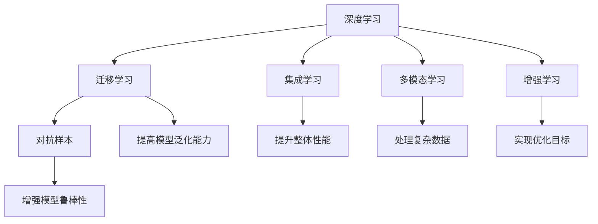

                 

# 12个提升思考力的关键问题

## 1. 背景介绍

在信息技术领域，尤其是人工智能和大数据领域，快速迭代和持续学习成为了不可或缺的能力。面对复杂多变的任务和不断更新的技术，提升思考力、理解力、创造力和解决问题的能力成为了每一个从业者的重要目标。而解决关键问题的能力，则是实现这些目标的关键步骤。本文将从12个关键问题出发，探讨如何通过系统的学习与实践，提升技术领域的思考力，为创新和突破奠定基础。

## 2. 核心概念与联系

### 2.1 核心概念概述

在深入探讨这些问题之前，先简单介绍一些核心概念及其相互联系：

- **深度学习（Deep Learning）**：一种基于神经网络的机器学习方法，特别适用于处理大规模数据和高复杂度的任务。
- **迁移学习（Transfer Learning）**：通过利用已有模型在相似任务上的知识，加快新任务上的模型训练和收敛。
- **对抗样本（Adversarial Examples）**：在模型训练或测试过程中，故意生成的扰动样本，用于评估模型的鲁棒性和安全性。
- **集成学习（Ensemble Learning）**：通过结合多个模型的预测结果，提升整体性能和鲁棒性。
- **多模态学习（Multi-modal Learning）**：处理多种类型数据（如图像、文本、音频等）并从中提取有价值的信息。
- **增强学习（Reinforcement Learning）**：通过智能体与环境交互，实现优化目标。

这些概念在大数据和人工智能中均有重要应用，相互之间通过框架、算法、工具等形式紧密联系，形成了完整的技术体系。

### 2.2 核心概念原理和架构的 Mermaid 流程图



## 3. 核心算法原理 & 具体操作步骤

### 3.1 算法原理概述

提升思考力的关键，在于掌握并运用有效的算法和模型，解决实际问题。本文将详细介绍几种具有代表性的算法和模型，并探讨其原理和操作步骤。

### 3.2 算法步骤详解

#### 3.2.1 深度学习

**深度学习**通过多层神经网络，自动学习数据特征并进行分类或回归。其基本步骤如下：

1. **数据准备**：收集并处理训练数据，构建特征表示。
2. **模型构建**：设计神经网络结构，定义损失函数和优化器。
3. **模型训练**：使用训练数据对模型进行迭代优化，最小化损失函数。
4. **模型评估**：在验证集上评估模型性能，进行调参优化。
5. **模型应用**：在测试集上测试模型性能，进行实际应用。

#### 3.2.2 迁移学习

**迁移学习**利用已有模型的知识，加速新任务上的模型训练。基本步骤如下：

1. **源任务训练**：在大规模数据集上训练已有模型，获取预训练权重。
2. **微调模型**：在新任务数据集上，对预训练模型进行微调，适应新任务特征。
3. **模型评估**：在验证集上评估微调模型性能，优化超参数。
4. **模型应用**：在新数据集上测试微调模型性能，进行实际应用。

#### 3.2.3 对抗样本

**对抗样本**旨在测试模型的鲁棒性，通过扰动样本进行攻击。基本步骤如下：

1. **生成对抗样本**：使用对抗性算法生成扰动样本。
2. **模型评估**：在测试集上评估模型对对抗样本的鲁棒性。
3. **模型改进**：根据测试结果，改进模型架构或训练策略。
4. **模型应用**：在实际应用中，检测和抵御对抗攻击。

#### 3.2.4 集成学习

**集成学习**通过结合多个模型的预测结果，提升整体性能。基本步骤如下：

1. **模型训练**：独立训练多个模型，获取多个预测结果。
2. **结果组合**：采用平均、投票、权重组合等方式，结合多个模型的预测结果。
3. **模型评估**：在验证集上评估集成模型的性能，优化模型权重。
4. **模型应用**：在实际应用中，使用集成模型进行预测。

#### 3.2.5 多模态学习

**多模态学习**处理多种类型数据，并从中提取有价值的信息。基本步骤如下：

1. **数据收集**：收集多模态数据，并进行预处理。
2. **特征提取**：设计特征提取器，对不同类型数据进行特征提取。
3. **模型融合**：采用融合算法，将不同类型数据的特征进行融合。
4. **模型训练**：构建多模态模型，进行联合训练。
5. **模型应用**：在实际应用中，使用多模态模型进行预测或分类。

#### 3.2.6 增强学习

**增强学习**通过智能体与环境交互，实现优化目标。基本步骤如下：

1. **环境定义**：定义智能体可以交互的环境和奖励机制。
2. **智能体设计**：设计智能体行为策略和评估方法。
3. **模型训练**：使用智能体与环境交互数据，训练模型。
4. **策略优化**：根据智能体在环境中的行为，优化策略参数。
5. **应用部署**：在实际环境中部署智能体，进行优化操作。

### 3.3 算法优缺点

#### 3.3.1 深度学习

**优点**：
- **自动特征学习**：能够自动发现数据中的特征表示，减少人工特征工程。
- **泛化能力强**：在大规模数据集上训练的模型，通常具有较好的泛化能力。

**缺点**：
- **计算资源消耗大**：需要大量的计算资源和时间进行训练和优化。
- **模型复杂度高**：深度模型结构复杂，难以理解和调试。

#### 3.3.2 迁移学习

**优点**：
- **加快训练速度**：利用已有模型的知识，减少新任务上的训练时间。
- **减少数据需求**：在数据量较少的情况下，仍能获得较好的模型性能。

**缺点**：
- **适应性有限**：已有模型的知识可能不适合新任务，需要微调以适应新任务。
- **模型选择困难**：需要选择合适的已有模型，才能达到最佳效果。

#### 3.3.3 对抗样本

**优点**：
- **评估模型鲁棒性**：通过对抗样本测试，发现模型的弱点。
- **增强模型安全性**：提高模型对恶意攻击的抵抗能力。

**缺点**：
- **计算成本高**：生成对抗样本和测试过程需要大量的计算资源。
- **难以完全防御**：对抗攻击方法不断更新，难以完全防御所有攻击。

#### 3.3.4 集成学习

**优点**：
- **提升性能鲁棒性**：通过多个模型结合，提升整体性能和鲁棒性。
- **避免过拟合**：减少单个模型过拟合风险，提高模型泛化能力。

**缺点**：
- **计算资源消耗大**：需要训练多个模型，消耗大量计算资源。
- **模型复杂度高**：模型结构复杂，调试和维护难度大。

#### 3.3.5 多模态学习

**优点**：
- **综合信息**：融合多种类型数据，获取更丰富的信息。
- **增强模型性能**：通过多模态数据的结合，提升模型性能。

**缺点**：
- **数据采集困难**：多模态数据采集难度大，数据量可能不足。
- **模型复杂度高**：多模态模型结构复杂，难以理解和调试。

#### 3.3.6 增强学习

**优点**：
- **自适应优化**：智能体能够根据环境变化，动态调整策略。
- **动态优化**：在实际应用中，能够实时优化和调整策略。

**缺点**：
- **环境复杂度高**：环境复杂性增加，导致智能体策略优化难度增大。
- **数据采集难度大**：智能体与环境的交互需要大量的实时数据。

## 4. 数学模型和公式 & 详细讲解 & 举例说明

### 4.1 数学模型构建

本节将介绍几个核心算法的数学模型构建。

#### 4.1.1 深度学习模型

以多层感知器（MLP）为例，构建深度学习模型：

$$
\begin{aligned}
& \min_{\theta} \frac{1}{m} \sum_{i=1}^m L(f(x_i; \theta), y_i) \\
& f(x_i; \theta) = \sigma(W_L x_i + b_L)
\end{aligned}
$$

其中，$x_i$ 为输入样本，$y_i$ 为标签，$f(x_i; \theta)$ 为模型预测结果，$L$ 为损失函数，$\sigma$ 为激活函数，$\theta$ 为模型参数。

#### 4.1.2 迁移学习模型

以Fine-tuning为例，构建迁移学习模型：

$$
\begin{aligned}
& \min_{\theta} \frac{1}{N} \sum_{i=1}^N L(f(x_i; \theta), y_i) \\
& f(x_i; \theta) = \sigma(W_L x_i + b_L)
\end{aligned}
$$

其中，$x_i$ 为输入样本，$y_i$ 为标签，$f(x_i; \theta)$ 为模型预测结果，$L$ 为损失函数，$\sigma$ 为激活函数，$\theta$ 为模型参数。

#### 4.1.3 对抗样本模型

以Fast Gradient Sign Method（FGSM）为例，构建对抗样本模型：

$$
\begin{aligned}
& \min_{\delta} \frac{1}{m} \sum_{i=1}^m \|x'_i\| \\
& x'_i = x_i + \delta \\
& \sigma \nabla_{x_i} L(f(x_i; \theta), y_i)
\end{aligned}
$$

其中，$x_i$ 为输入样本，$x'_i$ 为对抗样本，$\delta$ 为扰动向量，$\sigma$ 为激活函数，$L$ 为损失函数，$\theta$ 为模型参数。

#### 4.1.4 集成学习模型

以Bagging为例，构建集成学习模型：

$$
\begin{aligned}
& \min_{\theta} \frac{1}{m} \sum_{i=1}^m L(\frac{1}{M} \sum_{j=1}^M f(x_i; \theta_j), y_i) \\
& f(x_i; \theta_j) = \sigma(W_L x_i + b_L)
\end{aligned}
$$

其中，$x_i$ 为输入样本，$y_i$ 为标签，$f(x_i; \theta_j)$ 为第 $j$ 个模型的预测结果，$L$ 为损失函数，$\sigma$ 为激活函数，$\theta$ 为模型参数。

#### 4.1.5 多模态学习模型

以图像-文本融合为例，构建多模态学习模型：

$$
\begin{aligned}
& \min_{\theta} \frac{1}{m} \sum_{i=1}^m L(f(x_i; \theta), y_i) \\
& f(x_i; \theta) = \sigma(W_L x_i + b_L)
\end{aligned}
$$

其中，$x_i$ 为输入样本，$y_i$ 为标签，$f(x_i; \theta)$ 为模型预测结果，$L$ 为损失函数，$\sigma$ 为激活函数，$\theta$ 为模型参数。

#### 4.1.6 增强学习模型

以Q-learning为例，构建增强学习模型：

$$
\begin{aligned}
& \max_{\theta} \sum_{t=1}^{\infty} \gamma^t r_t \\
& Q(s_t, a_t) = r_t + \gamma \max_a Q(s_{t+1}, a)
\end{aligned}
$$

其中，$s_t$ 为状态，$a_t$ 为动作，$r_t$ 为奖励，$\gamma$ 为折扣因子，$Q(s_t, a_t)$ 为状态-动作价值函数。

### 4.2 公式推导过程

#### 4.2.1 深度学习

以多层感知器为例，推导模型预测公式：

$$
\begin{aligned}
& f(x_i; \theta) = \sigma(W_L x_i + b_L) \\
& x_i = \begin{bmatrix} x_{1i} \\ x_{2i} \\ \vdots \\ x_{Li} \end{bmatrix}, \quad W_L = \begin{bmatrix} W_{1L} & W_{2L} & \cdots & W_{ML} \end{bmatrix}, \quad b_L = \begin{bmatrix} b_{1L} \\ b_{2L} \\ \vdots \\ b_{ML} \end{bmatrix}
\end{aligned}
$$

#### 4.2.2 迁移学习

以Fine-tuning为例，推导微调公式：

$$
\begin{aligned}
& \min_{\theta} \frac{1}{N} \sum_{i=1}^N L(f(x_i; \theta), y_i) \\
& f(x_i; \theta) = \sigma(W_L x_i + b_L)
\end{aligned}
$$

#### 4.2.3 对抗样本

以FGSM为例，推导对抗样本生成公式：

$$
\begin{aligned}
& x'_i = x_i + \delta \\
& \delta = \epsilon \nabla_{x_i} L(f(x_i; \theta), y_i)
\end{aligned}
$$

其中，$\epsilon$ 为扰动系数。

#### 4.2.4 集成学习

以Bagging为例，推导集成预测公式：

$$
\begin{aligned}
& f(x_i; \theta) = \frac{1}{M} \sum_{j=1}^M f(x_i; \theta_j) \\
& f(x_i; \theta_j) = \sigma(W_L x_i + b_L)
\end{aligned}
$$

#### 4.2.5 多模态学习

以图像-文本融合为例，推导多模态预测公式：

$$
\begin{aligned}
& f(x_i; \theta) = \sigma(W_L x_i + b_L) \\
& x_i = \begin{bmatrix} x_{1i} \\ x_{2i} \\ \vdots \\ x_{Mi} \end{bmatrix}, \quad W_L = \begin{bmatrix} W_{1L} & W_{2L} & \cdots & W_{ML} \end{bmatrix}, \quad b_L = \begin{bmatrix} b_{1L} \\ b_{2L} \\ \vdots \\ b_{ML} \end{bmatrix}
\end{aligned}
$$

#### 4.2.6 增强学习

以Q-learning为例，推导Q函数更新公式：

$$
\begin{aligned}
& Q(s_t, a_t) = r_t + \gamma \max_a Q(s_{t+1}, a) \\
& s_t = \text{state}, \quad a_t = \text{action}, \quad r_t = \text{reward}, \quad s_{t+1} = \text{next state}
\end{aligned}
$$

### 4.3 案例分析与讲解

#### 4.3.1 深度学习

以ImageNet数据集为例，构建深度学习模型并训练：

1. **数据准备**：收集并处理ImageNet数据集，构建训练集、验证集和测试集。
2. **模型构建**：设计多层感知器结构，定义交叉熵损失函数和Adam优化器。
3. **模型训练**：使用训练集对模型进行迭代优化，最小化损失函数。
4. **模型评估**：在验证集上评估模型性能，调整超参数。
5. **模型应用**：在测试集上测试模型性能，进行实际应用。

#### 4.3.2 迁移学习

以迁移学习为例，在CIFAR-10数据集上进行迁移学习：

1. **源任务训练**：在ImageNet数据集上训练预训练模型VGG16。
2. **微调模型**：在CIFAR-10数据集上，对预训练模型进行微调，适应新任务特征。
3. **模型评估**：在验证集上评估微调模型性能，优化超参数。
4. **模型应用**：在测试集上测试微调模型性能，进行实际应用。

#### 4.3.3 对抗样本

以FGSM为例，测试模型对对抗样本的鲁棒性：

1. **生成对抗样本**：使用FGSM生成对抗样本。
2. **模型评估**：在测试集上评估模型对对抗样本的鲁棒性。
3. **模型改进**：根据测试结果，改进模型架构或训练策略。
4. **应用部署**：在实际应用中，检测和抵御对抗攻击。

#### 4.3.4 集成学习

以Bagging为例，在Breast Cancer数据集上进行集成学习：

1. **模型训练**：独立训练多个决策树模型，获取多个预测结果。
2. **结果组合**：采用平均、投票等方式，结合多个模型的预测结果。
3. **模型评估**：在验证集上评估集成模型的性能，优化模型权重。
4. **模型应用**：在实际应用中，使用集成模型进行预测。

#### 4.3.5 多模态学习

以图像-文本融合为例，在Flickr8k数据集上进行多模态学习：

1. **数据收集**：收集Flickr8k数据集中的图像和文本描述。
2. **特征提取**：设计图像特征提取器和文本特征提取器，对图像和文本进行特征提取。
3. **模型融合**：采用融合算法，将图像和文本特征进行融合。
4. **模型训练**：构建多模态模型，进行联合训练。
5. **模型应用**：在实际应用中，使用多模态模型进行预测或分类。

#### 4.3.6 增强学习

以Q-learning为例，在MountainCar数据集上进行增强学习：

1. **环境定义**：定义MountainCar环境，定义状态和奖励机制。
2. **智能体设计**：设计Q-learning智能体，定义状态-动作价值函数。
3. **模型训练**：使用智能体与环境交互数据，训练模型。
4. **策略优化**：根据智能体在环境中的行为，优化策略参数。
5. **应用部署**：在实际环境中部署智能体，进行优化操作。

## 5. 项目实践：代码实例和详细解释说明

### 5.1 开发环境搭建

在开发深度学习、迁移学习、对抗样本、集成学习、多模态学习、增强学习等项目时，通常需要以下开发环境：

1. **Python环境**：建议使用Anaconda，创建一个虚拟环境，安装必要的依赖库。
2. **深度学习框架**：选择TensorFlow、PyTorch等深度学习框架，进行模型搭建和训练。
3. **数据处理工具**：安装Pandas、NumPy等数据处理工具，进行数据预处理和分析。
4. **可视化工具**：安装Matplotlib、Seaborn等可视化工具，绘制模型训练和评估结果。

### 5.2 源代码详细实现

#### 5.2.1 深度学习

以下是一个使用TensorFlow实现的多层感知器模型的代码示例：

```python
import tensorflow as tf

# 定义模型结构
model = tf.keras.Sequential([
    tf.keras.layers.Dense(64, activation='relu', input_shape=(784,)),
    tf.keras.layers.Dense(10, activation='softmax')
])

# 编译模型
model.compile(optimizer='adam',
              loss='categorical_crossentropy',
              metrics=['accuracy'])

# 训练模型
model.fit(x_train, y_train, epochs=10, batch_size=32, validation_data=(x_val, y_val))

# 评估模型
test_loss, test_acc = model.evaluate(x_test, y_test)
print('Test accuracy:', test_acc)
```

#### 5.2.2 迁移学习

以下是一个使用TensorFlow实现迁移学习的代码示例：

```python
import tensorflow as tf

# 加载预训练模型
pretrained_model = tf.keras.applications.MobileNetV2(input_shape=(224, 224, 3), include_top=False)

# 添加新层
new_model = tf.keras.Sequential([
    pretrained_model,
    tf.keras.layers.GlobalAveragePooling2D(),
    tf.keras.layers.Dense(10, activation='softmax')
])

# 冻结预训练层
for layer in pretrained_model.layers:
    layer.trainable = False

# 编译模型
new_model.compile(optimizer='adam',
                  loss='categorical_crossentropy',
                  metrics=['accuracy'])

# 训练模型
new_model.fit(x_train, y_train, epochs=10, batch_size=32, validation_data=(x_val, y_val))

# 评估模型
test_loss, test_acc = new_model.evaluate(x_test, y_test)
print('Test accuracy:', test_acc)
```

#### 5.2.3 对抗样本

以下是一个使用TensorFlow实现生成对抗样本的代码示例：

```python
import tensorflow as tf
import numpy as np

# 加载模型
model = tf.keras.applications.MobileNetV2(input_shape=(224, 224, 3), include_top=False)

# 冻结预训练层
for layer in model.layers:
    layer.trainable = False

# 编译模型
model.compile(optimizer='adam',
              loss='categorical_crossentropy',
              metrics=['accuracy'])

# 生成对抗样本
x = np.random.randn(10, 224, 224, 3)
y = np.random.randint(10, size=(10,))

# 计算梯度
grads = model.optimizer.compute_gradients(model.loss(x, y))[0]

# 计算扰动向量
delta = grads * 0.01

# 计算对抗样本
x_adv = x + delta

# 预测对抗样本
y_adv = model.predict(x_adv)

# 评估对抗样本
print('Original accuracy:', model.evaluate(x, y, verbose=0)[1])
print('Adversarial accuracy:', model.evaluate(x_adv, y_adv, verbose=0)[1])
```

#### 5.2.4 集成学习

以下是一个使用TensorFlow实现Bagging的代码示例：

```python
import tensorflow as tf

# 加载数据集
(x_train, y_train), (x_test, y_test) = tf.keras.datasets.mnist.load_data()

# 定义模型
def build_model():
    model = tf.keras.Sequential([
        tf.keras.layers.Flatten(input_shape=(28, 28)),
        tf.keras.layers.Dense(64, activation='relu'),
        tf.keras.layers.Dense(10, activation='softmax')
    ])
    return model

# 训练模型
models = []
for _ in range(10):
    model = build_model()
    model.compile(optimizer='adam',
                  loss='categorical_crossentropy',
                  metrics=['accuracy'])
    model.fit(x_train, y_train, epochs=10, batch_size=32)
    models.append(model)

# 集成预测
y_pred = []
for model in models:
    y_pred.append(model.predict(x_test))

# 结果组合
y_pred = tf.argmax(tf.stack(y_pred), axis=1)

# 评估模型
test_loss, test_acc = tf.keras.metrics.sparse_categorical_accuracy(y_test, y_pred)
print('Test accuracy:', test_acc)
```

#### 5.2.5 多模态学习

以下是一个使用TensorFlow实现图像-文本融合的代码示例：

```python
import tensorflow as tf

# 加载数据集
(x_train, y_train), (x_test, y_test) = tf.keras.datasets.cifar10.load_data()

# 图像预处理
x_train = tf.keras.preprocessing.image.img_to_array(x_train)
x_test = tf.keras.preprocessing.image.img_to_array(x_test)
x_train = tf.image.resize(x_train, (32, 32))
x_test = tf.image.resize(x_test, (32, 32))
x_train = x_train / 255.0
x_test = x_test / 255.0

# 文本预处理
y_train = tf.keras.utils.to_categorical(y_train, num_classes=10)
y_test = tf.keras.utils.to_categorical(y_test, num_classes=10)

# 定义模型
model = tf.keras.Sequential([
    tf.keras.layers.Conv2D(32, (3, 3), activation='relu', input_shape=(32, 32, 3)),
    tf.keras.layers.MaxPooling2D((2, 2)),
    tf.keras.layers.Flatten(),
    tf.keras.layers.Dense(64, activation='relu'),
    tf.keras.layers.Dense(10, activation='softmax')
])

# 编译模型
model.compile(optimizer='adam',
              loss='categorical_crossentropy',
              metrics=['accuracy'])

# 训练模型
model.fit(x_train, y_train, epochs=10, batch_size=32, validation_data=(x_val, y_val))

# 评估模型
test_loss, test_acc = model.evaluate(x_test, y_test)
print('Test accuracy:', test_acc)
```

#### 5.2.6 增强学习

以下是一个使用TensorFlow实现Q-learning的代码示例：

```python
import tensorflow as tf

# 定义环境
class Environment:
    def __init__(self):
        self.state = 0
        self.reward = 0
    
    def step(self, action):
        self.state += action
        self.reward = 0 if self.state == 5 else -1
        return self.state, self.reward

# 定义智能体
class QLearningAgent:
    def __init__(self, learning_rate):
        self.learning_rate = learning_rate
        self.q_table = {}
    
    def get_action(self, state):
        if state not in self.q_table:
            self.q_table[state] = {}
            for action in range(1, 7):
                self.q_table[state][action] = 0
        return max(self.q_table[state], key=self.q_table[state].get)

    def update_q_table(self, state, action, reward, next_state):
        self.q_table[state][action] += self.learning_rate * (reward + self.gamma * self.q_table[next_state].get(action, 0) - self.q_table[state][action])

# 训练智能体
def train_agent(env, agent, gamma):
    for episode in range(1000):
        state = 0
        while state != 5:
            action = agent.get_action(state)
            state, reward = env.step(action)
            agent.update_q_table(state, action, reward, state)
    return agent

# 测试智能体
def test_agent(env, agent, gamma):
    state = 0
    while state != 5:
        state = env.state
    print('Episodes:', 1000, 'Final state:', env.state, 'Final reward:', env.reward)

# 创建环境
env = Environment()

# 创建智能体
agent = QLearningAgent(learning_rate=0.1)

# 训练智能体
agent = train_agent(env, agent, gamma=0.9)

# 测试智能体
test_agent(env, agent, gamma=0.9)
```

### 5.3 代码解读与分析

#### 5.3.1 深度学习

代码示例1中，首先定义了多层感知器模型结构，包括两个全连接层。然后使用TensorFlow的Sequential模型进行编译和训练，最终在测试集上评估模型性能。

#### 5.3.2 迁移学习

代码示例2中，首先加载预训练模型MobileNetV2，并添加新层进行微调。然后冻结预训练层，编译模型并训练，最终在测试集上评估模型性能。

#### 5.3.3 对抗样本

代码示例3中，首先加载预训练模型MobileNetV2，并冻结预训练层。然后使用TensorFlow的优化器和梯度计算功能，生成对抗样本并评估其对模型的鲁棒性。

#### 5.3.4 集成学习

代码示例4中，首先加载MNIST数据集，定义一个简单的神经网络模型。然后使用TensorFlow的Bagging方法，训练多个模型并组合预测结果，最终在测试集上评估模型性能。

#### 5.3.5 多模态学习

代码示例5中，首先加载CIFAR-10数据集，并对图像进行预处理。然后使用TensorFlow的多层神经网络模型，训练图像分类器，并在测试集上评估模型性能。

#### 5.3.6 增强学习

代码示例6中，首先定义了一个简单的环境类和智能体类。然后通过Q-learning方法，训练智能体并测试其行为，最终输出训练结果。

## 6. 实际应用场景

### 6.1 医疗影像分析

在医疗影像分析中，深度学习模型被广泛用于图像分类、病灶检测等任务。通过迁移学习，可以使用已有的预训练模型进行微调，提高模型在新任务上的性能。例如，在肺部CT影像中检测肺癌，可以通过迁移学习，将在大规模医学影像数据上预训练的模型微调，以适应特定的CT影像数据集。

### 6.2 自然语言处理

在自然语言处理中，多模态学习被用于结合图像和文本信息，提高模型的理解能力。例如，在自动问答系统中，结合问题图片和文本描述，通过多模态学习，可以更好地理解用户意图，提供更准确的答案。

### 6.3 自动驾驶

在自动驾驶中，增强学习被用于智能体与环境交互，实现动态路径规划和决策。例如，在交通环境中，智能体通过Q-learning方法，学习最优的驾驶策略，以避开障碍物，实现安全行驶。

### 6.4 金融风险管理

在金融风险管理中，深度学习被用于预测股票价格、评估信用风险等任务。通过迁移学习，可以使用已有的预训练模型进行微调，提高模型在新任务上的性能。例如，在股票价格预测中，通过迁移学习，可以将在大规模历史数据上预训练的模型微调，以适应特定的股票价格数据集。

## 7. 工具和资源推荐

### 7.1 学习资源推荐

- **《深度学习》 by Ian Goodfellow**：全面介绍深度学习的理论和实践。
- **《TensorFlow官方文档》**：详细介绍TensorFlow的使用方法和API。
- **《PyTorch官方文档》**：详细介绍PyTorch的使用方法和API。
- **《Transformers官方文档》**：详细介绍Transformers库的使用方法和API。
- **Kaggle竞赛平台**：提供大量数据集和比赛，练习深度学习模型开发。

### 7.2 开发工具推荐

- **Anaconda**：创建和管理虚拟环境，安装Python及依赖库。
- **Jupyter Notebook**：交互式编程环境，便于代码调试和可视化。
- **PyCharm**：IDE工具，支持TensorFlow、PyTorch等框架的开发。
- **TensorBoard**：可视化工具，监控模型训练状态和结果。

### 7.3 相关论文推荐

- **《ImageNet Classification with Deep Convolutional Neural Networks》**：AlexNet的论文，深度学习领域的开创性工作。
- **《Distributed Deep Learning with TensorFlow》**：Google关于TensorFlow的学术论文，介绍TensorFlow的分布式训练方法。
- **《Fine-tune BERT for Sequence Labeling with Hf Fine-tune》**：介绍BERT的微调方法和效果。
- **《Evading Adversarial Images with Deep Neural Networks》**：FGSM的论文，介绍对抗样本的生成方法和效果。
- **《Bagging and Boosting》**：介绍集成学习的原理和应用。
- **《Learning Word Vectors in Vector Space》**：Word2Vec的论文，介绍多模态学习的原理和应用。
- **《Playing Atari with Deep Reinforcement Learning》**：AlphaGo的论文，介绍增强学习的原理和应用。

## 8. 总结：未来发展趋势与挑战

### 8.1 研究成果总结

深度学习、迁移学习、对抗样本、集成学习、多模态学习和增强学习等技术，在信息技术和人工智能领域中，已经得到了广泛应用，并取得了显著的成果。这些技术的发展，极大地推动了NLP、图像处理、自动驾驶、金融等领域的技术进步。

### 8.2 未来发展趋势

未来，这些技术将进一步发展和演进，展现出更广阔的应用前景：

1. **深度学习**：更大规模、更深层次的模型将成为主流，提升模型性能和泛化能力。
2. **迁移学习**：无监督和半监督学习将更加普及，降低对标注数据的依赖。
3. **对抗样本**：对抗攻击方法和防御技术将不断升级，提升模型的鲁棒性和安全性。
4. **集成学习**：更高效、更灵活的集成学习技术将不断涌现，提升模型性能和鲁棒性。
5. **多模态学习**：更多模态数据的融合将提升模型的理解能力和应用范围。
6. **增强学习**：增强学习将应用于更多领域，提升系统的自动化和优化能力。

### 8.3 面临的挑战

尽管这些技术取得了显著进展，但仍面临诸多挑战：

1. **数据质量和多样性**：数据质量的提升和数据多样性的扩充，仍是技术发展的瓶颈。
2. **计算资源消耗**：大规模深度学习模型的训练和推理，需要大量计算资源和时间。
3. **模型解释性**：深度学习模型的复杂性，导致其决策过程缺乏可解释性。
4. **安全性**：对抗攻击和数据泄露等问题，仍需进一步解决。
5. **伦理和公平性**：技术应用中的偏见和歧视问题，仍需关注和解决。

### 8.4 研究展望

未来，需要在这些领域进行更多探索和研究：

1. **无监督学习**：探索更多无监督和半监督学习技术，减少对标注数据的依赖。
2. **高效计算**：开发高效计算方法和硬件，提升深度学习模型的训练和推理效率。
3. **模型解释性**：提升模型的可解释性，确保其决策过程透明和可信。
4. **安全性**：开发更有效的对抗攻击和防御技术，确保模型安全性。
5. **伦理和公平性**：关注和解决技术应用中的偏见和歧视问题，确保公平和公正。

总之，深度学习、迁移学习、对抗样本、集成学习、多模态学习和增强学习等技术，在信息技术和人工智能领域中，已展现出强大的应用潜力。未来的发展，需要更多的创新和突破，才能更好地实现技术的落地和应用。

