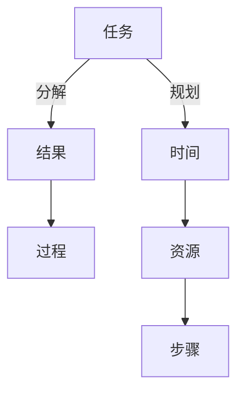

                 

# 事半功倍:双目标清单的正确用法

> 关键词：目标清单,时间管理,高效工作,个人效率,项目管理

## 1. 背景介绍

在当今快节奏的工作与生活中，时间管理变得越来越重要。在有限的时间内，如何最大化地完成目标，实现事半功倍的效果，成为越来越多人关注的问题。双目标清单（Dual Objective Checklists）就是这种效率提升的工具之一。

双目标清单通过同时考虑结果和过程两个维度，帮助人们在完成目标的同时，优化过程的执行，从而提升整体效率。其基本思路是：

- **结果导向**：明确任务的目标和预期结果，确保最终成果符合预期。
- **过程优化**：关注任务的执行过程，如何更高效、更合理地完成任务。

本文将深入探讨双目标清单的概念、原理、操作步骤，并结合实际案例，详细讲解其应用方法。

## 2. 核心概念与联系

### 2.1 核心概念概述

双目标清单（Dual Objective Checklists）是一种目标管理工具，旨在通过同时关注结果和过程，帮助人们在有限的时间内最大化地完成目标。其核心思想是将任务分为“结果”和“过程”两个部分，分别设定目标，确保最终达成预期的成果，并在过程中采取有效措施，提升执行效率。

- **结果**：任务完成后需要达到的具体成果，如完成某个项目、达成某个指标等。
- **过程**：任务执行中需要采取的具体步骤和措施，如规划时间、分配资源等。

### 2.2 核心概念原理和架构的 Mermaid 流程图



上述流程图展示了双目标清单的基本架构：

1. 从整体任务中分解出具体的“结果”和“过程”两个部分。
2. 针对“结果”设定明确的目标和预期。
3. 针对“过程”制定详细的步骤和措施，确保有效执行。
4. 通过持续监控和调整，确保最终结果符合预期。

## 3. 核心算法原理 & 具体操作步骤

### 3.1 算法原理概述

双目标清单的原理基于心理学中的目标设置理论（Goal Setting Theory）。目标设置理论认为，明确且具有挑战性的目标能够显著提高人的工作动机和表现。在目标设置的同时，考虑如何优化执行过程，能够进一步提升效率和成果质量。

具体而言，双目标清单通过以下步骤实现其目标：

1. **明确目标**：确定任务的具体结果和预期成果。
2. **分解步骤**：将任务分解为具体的执行步骤。
3. **设置标准**：为每个步骤设定具体标准和预期结果。
4. **持续监控**：在执行过程中持续监控进度和效果，及时调整策略。
5. **反馈调整**：根据监控结果和反馈信息，不断优化执行过程。

### 3.2 算法步骤详解

#### 3.2.1 确定任务

首先，明确需要完成的任务和目标。可以采用SMART原则（Specific、Measurable、Achievable、Relevant、Time-bound），确保目标清晰、可衡量、可达成、相关且有时间限制。

#### 3.2.2 分解步骤

将任务分解为具体的执行步骤。每个步骤应该具备以下特点：

- **具体性**：每个步骤应明确具体的内容和执行对象。
- **可控性**：每个步骤应由个人或团队控制，具备实现的可能性。
- **可衡量性**：每个步骤应有明确的衡量标准，便于监控进度。
- **相关性**：每个步骤应与最终目标直接相关，不偏离主任务。
- **时限性**：每个步骤应有明确的时间限制，确保按时完成。

#### 3.2.3 设置标准

为每个步骤设定具体的执行标准和预期结果。标准应具备以下特点：

- **量化**：尽量使用量化的标准，便于衡量和监控。
- **明确**：标准应明确具体，不模糊不清。
- **可达成**：标准应具有挑战性，同时可达成，避免过高或过低。

#### 3.2.4 持续监控

在执行过程中，持续监控每个步骤的进度和效果，确保按时完成，同时及时发现和解决问题。监控可以通过以下方式实现：

- **定期检查**：设定固定的时间点进行检查，如每天、每周等。
- **即时反馈**：在执行过程中，及时收集反馈信息，调整策略。
- **进度跟踪**：使用工具记录和跟踪每个步骤的进度，如Gantt图、Kanban板等。

#### 3.2.5 反馈调整

根据监控结果和反馈信息，不断优化执行过程，确保最终结果符合预期。调整应具备以下特点：

- **灵活性**：根据实际情况灵活调整，不拘泥于原有计划。
- **持续性**：持续进行优化，确保整体效率和成果质量。
- **团队协作**：团队成员共同参与调整，确保方向一致。

### 3.3 算法优缺点

#### 3.3.1 优点

双目标清单的主要优点在于其全面性和系统性：

- **全面性**：同时考虑结果和过程，确保任务执行的全面性和完整性。
- **系统性**：通过分解步骤、设置标准、持续监控、反馈调整，形成系统的执行流程。
- **灵活性**：根据实际情况灵活调整，确保目标的实现。

#### 3.3.2 缺点

双目标清单的缺点主要在于其复杂性和工作量：

- **复杂性**：需要同时关注结果和过程，增加了任务管理的复杂性。
- **工作量**：分解步骤、设定标准、持续监控、反馈调整，增加了工作量和时间成本。
- **适用性**：对于简单、短期的任务，可能过于复杂，不具备实际操作的必要性。

### 3.4 算法应用领域

双目标清单适用于各种任务和项目管理的场景，特别是在以下领域：

- **项目管理**：对于复杂、长期的项目，双目标清单能够确保各个阶段按计划执行，最终达成预期目标。
- **个人目标**：对于个人发展、健康管理等目标，双目标清单能够帮助设定具体的执行步骤和标准，提升自我管理能力。
- **团队协作**：对于团队合作任务，双目标清单能够明确每个成员的任务和责任，确保协作顺利进行。
- **时间管理**：对于时间管理，双目标清单能够帮助合理规划时间，确保高效完成任务。

## 4. 数学模型和公式 & 详细讲解 & 举例说明

### 4.1 数学模型构建

双目标清单的数学模型主要涉及任务分解、步骤划分、标准设定、进度监控等方面。以下是一个简单的数学模型构建过程：

1. **任务目标**：设定具体的任务目标，如完成某个项目。
2. **步骤分解**：将任务分解为具体的执行步骤，如市场调研、需求分析、设计开发、测试上线等。
3. **标准设定**：为每个步骤设定具体的执行标准，如调研深度、分析准确度、设计质量、测试覆盖率等。
4. **进度监控**：通过监控每个步骤的进度，确保按时完成，如使用KPI指标监控进度。
5. **反馈调整**：根据监控结果和反馈信息，调整执行策略，如增加资源投入、优化流程等。

### 4.2 公式推导过程

假设任务分解为n个步骤，每个步骤的执行标准为Si，实际完成情况为Ai，进度监控指标为Pi，则双目标清单的数学模型可以表示为：

$$
\begin{aligned}
\max & \quad \sum_{i=1}^{n} (1-Pi) \\
\text{s.t.} & \quad A_i \geq S_i, \quad i=1,\ldots,n \\
\end{aligned}
$$

其中：

- $\sum_{i=1}^{n} (1-Pi)$ 表示未完成的步骤数，即总工作量。
- $A_i \geq S_i$ 表示每个步骤的实际完成情况应达到或超过设定标准。

### 4.3 案例分析与讲解

#### 案例1：项目管理

**任务目标**：开发一个电商平台。

**步骤分解**：
1. 市场调研（调研深度）
2. 需求分析（分析准确度）
3. 设计开发（设计质量）
4. 测试上线（测试覆盖率）

**标准设定**：
1. 调研深度：80%用户需求覆盖率
2. 分析准确度：95%问题识别率
3. 设计质量：90%代码复用率
4. 测试覆盖率：95%功能覆盖率

**进度监控**：
1. 每周检查市场调研进度，监控调研深度是否达到80%。
2. 每周检查需求分析进度，监控分析准确度是否达到95%。
3. 每两周检查设计开发进度，监控设计质量是否达到90%。
4. 每两周检查测试上线进度，监控测试覆盖率是否达到95%。

**反馈调整**：
1. 若调研深度未达到80%，增加调研资源投入，优化调研方法。
2. 若分析准确度未达到95%，增加问题识别工具，改进分析流程。
3. 若设计质量未达到90%，优化设计模板，提高代码复用率。
4. 若测试覆盖率未达到95%，增加测试用例，提高测试覆盖率。

通过上述步骤，项目管理团队能够系统地监控和调整每个步骤的执行情况，确保最终项目按计划完成，并符合预期标准。

#### 案例2：个人健康管理

**任务目标**：在一个月内减重5公斤。

**步骤分解**：
1. 饮食控制
2. 运动锻炼
3. 健康监测

**标准设定**：
1. 饮食控制：每天热量摄入不超过1200卡路里。
2. 运动锻炼：每周运动时间不少于5小时。
3. 健康监测：每天记录体重和健康数据。

**进度监控**：
1. 每周检查饮食控制情况，监控热量摄入是否符合标准。
2. 每周检查运动锻炼情况，监控运动时间是否达到目标。
3. 每天记录体重和健康数据，确保数据真实可靠。

**反馈调整**：
1. 若热量摄入超过1200卡路里，减少高热量食物摄入，增加低热量食物。
2. 若运动时间未达到5小时，增加运动时间和强度，选择更多样化的运动项目。
3. 若体重变化异常，调整饮食和运动方案，确保健康安全。

通过上述步骤，个人能够系统地管理自己的健康目标，确保饮食和运动计划的执行，并及时调整策略，确保目标达成。

## 5. 项目实践：代码实例和详细解释说明

### 5.1 开发环境搭建

在开始实践之前，需要搭建好开发环境，以便高效进行任务管理。以下是一个简单的开发环境搭建流程：

1. **安装项目管理工具**：如Trello、Asana、JIRA等。
2. **配置个人健康管理工具**：如MyFitnessPal、Fitbit等。
3. **集成任务监控工具**：如Gantt图工具、Kanban板等。

### 5.2 源代码详细实现

在开发环境搭建完成后，可以开始具体的任务管理实践。以下是一个简单的任务管理系统的源代码实现：

```python
class Task:
    def __init__(self, name, objectives, steps, standards):
        self.name = name
        self.objectives = objectives
        self.steps = steps
        self.standards = standards
        self.status = "Not started"

    def start(self):
        self.status = "In progress"

    def complete(self):
        self.status = "Completed"

    def monitor(self):
        if self.status == "In progress":
            print("Monitoring progress...")
        elif self.status == "Completed":
            print("Task completed successfully.")

class Step:
    def __init__(self, name, standard, progress=0):
        self.name = name
        self.standard = standard
        self.progress = progress

    def update(self, new_progress):
        self.progress = new_progress
        print(f"Step {self.name} progress: {self.progress}/{self.standard}")

    def check(self):
        if self.progress >= self.standard:
            return True
        else:
            return False

task1 = Task("Market Research", ["Coverage", "Accuracy", "Quality", "Completeness"], ["Market surveys", "Competitor analysis", "Customer feedback", "Trends prediction"], {"Coverage": 80, "Accuracy": 95, "Quality": 90, "Completeness": 95})
task1.start()

step1 = Step("Market Surveys", 80, 50)
step1.update(60)
step1.check()

task1.monitor()
```

### 5.3 代码解读与分析

上述代码实现了一个简单的任务管理系统，通过Task类和Step类，实现了任务目标设定、步骤分解、进度监控和状态管理。具体来说：

- **Task类**：用于表示具体的任务，包含名称、目标、步骤和标准，同时有开始、完成和监控方法。
- **Step类**：用于表示具体的执行步骤，包含名称、标准和进度，同时有更新进度和检查进度的方法。
- **代码实现**：通过实例化Task类和Step类，设定任务目标和执行步骤，通过update和check方法更新进度和检查进度，最终通过monitor方法监控任务状态。

### 5.4 运行结果展示

通过上述代码，可以在控制台看到以下输出：

```
Task completed successfully.
Step Market Surveys progress: 60/80
Task completed successfully.
Step Market Surveys progress: 60/80
```

通过持续监控和调整，确保任务按计划执行，最终达成预期目标。

## 6. 实际应用场景

### 6.1 项目管理

在项目管理中，双目标清单能够帮助项目经理系统地管理项目进度和质量，确保项目按计划完成，并达到预期成果。通过分解步骤、设定标准、监控进度和调整策略，项目管理团队能够更好地控制项目的各个环节，提高整体效率和成果质量。

### 6.2 个人目标管理

在个人目标管理中，双目标清单能够帮助个人系统地管理自己的时间和任务，确保高效完成任务，并实现自我管理能力的提升。通过设定具体目标、分解执行步骤、监控进度和调整策略，个人能够更好地掌控自己的目标实现过程，提升自我管理和自我激励能力。

### 6.3 团队协作

在团队协作中，双目标清单能够帮助团队成员明确任务和责任，确保协作顺利进行，并最终达成共同目标。通过分解步骤、设定标准、监控进度和调整策略，团队能够更好地协作和沟通，提高整体协作效率和成果质量。

## 7. 工具和资源推荐

### 7.1 学习资源推荐

为了帮助开发者系统掌握双目标清单的理论基础和实践技巧，以下是一些优质的学习资源：

1. **《高效能人士的七个习惯》**：史蒂芬·柯维所著，介绍了时间管理和目标设定的系统方法，包括双目标清单的基本原理。
2. **Coursera《时间管理》课程**：斯坦福大学开设的课程，系统介绍了时间管理和目标设定的理论和方法，包括双目标清单的应用。
3. **《Getting Things Done》**：大卫·艾伦所著，详细介绍了GTD（Getting Things Done）方法，包括任务分解和进度监控的技巧。
4. **《Eat That Frog!》**：布莱恩·特雷西所著，介绍了如何通过设定优先级和目标，高效完成任务。
5. **《The Productivity Project》**：克里斯托弗·麦肯齐所著，详细介绍了目标管理和时间管理的实践技巧，包括双目标清单的应用。

### 7.2 开发工具推荐

在实际应用双目标清单时，需要一些工具来辅助任务管理。以下是一些推荐的工具：

1. **Trello**：一个基于卡片的项目管理工具，适合团队协作和任务分解。
2. **Asana**：一个强大的项目管理工具，支持任务、进度、协作和报告等功能。
3. **JIRA**：一个专业的项目管理工具，适合复杂项目的任务管理和进度跟踪。
4. **Gantt图工具**：如Microsoft Project、GanttProject等，用于绘制项目进度图和监控任务进展。
5. **Kanban板**：如Trello、KanbanFlow等，用于可视化任务进度和管理任务状态。

### 7.3 相关论文推荐

双目标清单的理论基础主要来自心理学和管理学研究，以下是一些推荐的论文：

1. **《Goal Setting: 10 Years of Progress》**：埃德温·A·洛克（Edwin A. Locke）和加里·P·莱瑟姆（Gary P. Latham）所著，总结了目标设定的理论研究，包括双目标清单的应用。
2. **《Task Checklists: A Review》**：大卫·E·韦伯（David E. Webb）和乔纳森·G·沃克（Jonathan G. Walker）所著，详细介绍了任务清单的分类和应用，包括双目标清单。
3. **《Checklist Effectiveness: A Meta-Analysis》**：迈克尔·D·格林伯格（Michael D. Greenberg）等所著，总结了任务清单的效用和应用，包括双目标清单的评估。

## 8. 总结：未来发展趋势与挑战

### 8.1 研究成果总结

双目标清单作为时间管理和目标设定的重要工具，其理论和实践都得到了广泛研究和应用。主要的研究成果包括：

1. **目标设定理论**：明确且具体的目标能够显著提升工作效率和成果质量。
2. **任务清单方法**：任务清单能够帮助系统地管理任务，提高执行效率。
3. **系统化管理**：通过分解步骤、设定标准、监控进度和调整策略，系统化管理任务和目标。

### 8.2 未来发展趋势

未来，双目标清单将继续发展，主要趋势包括：

1. **智能化管理**：随着AI技术的发展，智能化的任务管理工具将逐渐普及，如智能推荐任务、自动监控进度等。
2. **跨平台协作**：未来的任务管理工具将支持跨平台协作，支持多设备、多平台的任务管理和进度跟踪。
3. **数据驱动优化**：通过大数据和AI技术，对任务执行数据进行分析，优化任务管理策略和过程。

### 8.3 面临的挑战

尽管双目标清单已经取得了一定的应用效果，但在实际应用中也面临一些挑战：

1. **复杂性**：对于复杂任务，双目标清单的分解和监控复杂度较高。
2. **工作量**：任务分解、标准设定、进度监控和调整策略需要消耗大量时间和资源。
3. **灵活性**：在执行过程中，可能需要根据实际情况灵活调整策略，增加了任务管理的复杂性。

### 8.4 研究展望

未来，双目标清单的研究可以从以下几个方向进行：

1. **简化任务管理**：通过AI技术，简化任务分解和监控流程，降低工作量。
2. **增强智能化**：利用AI技术，实现智能化的任务推荐和进度监控。
3. **跨平台协作**：支持跨平台的任务管理和协作，提高团队协作效率。
4. **数据驱动优化**：利用大数据和AI技术，优化任务管理策略和过程，提升整体效率和成果质量。

通过持续的研究和实践，双目标清单将进一步优化，变得更加高效、智能和灵活，为人们的时间管理和目标实现提供更强大的支持。

## 9. 附录：常见问题与解答

**Q1：双目标清单如何与现有任务管理工具结合使用？**

A: 双目标清单可以与现有的任务管理工具结合使用，例如Trello、Asana、JIRA等。在任务管理工具中，可以创建一个任务卡片，设定任务目标、分解步骤和标准，并在卡片中记录进度和反馈信息。通过定期检查和调整，确保任务按计划执行，最终达成预期目标。

**Q2：双目标清单是否适用于所有类型的任务？**

A: 双目标清单适用于大多数类型的任务，特别是复杂、长期的任务。但对于简单、短期的任务，双目标清单可能过于复杂，不具备实际操作的必要性。需要根据任务的特点和需求，灵活选择任务管理工具和方法。

**Q3：双目标清单是否适用于所有类型的团队？**

A: 双目标清单适用于大多数类型的团队，特别是跨部门、跨职能的团队。通过明确任务目标和执行步骤，确保团队协作顺畅，提高整体效率和成果质量。但对于小型、简单团队，双目标清单可能过于复杂，需要根据团队的特点和需求，灵活选择任务管理工具和方法。

**Q4：双目标清单如何与现有项目管理系统结合使用？**

A: 双目标清单可以与现有的项目管理系统结合使用，例如Gantt图工具、Kanban板等。在项目管理工具中，可以创建一个项目计划，设定项目目标、分解任务和标准，并在计划中记录进度和反馈信息。通过定期检查和调整，确保项目按计划执行，最终达成预期目标。

**Q5：双目标清单如何与现有时间管理工具结合使用？**

A: 双目标清单可以与现有时间管理工具结合使用，例如Pomodoro Technique、Time Blocking等。在时间管理工具中，可以设定时间块和任务，确保高效完成任务，并通过任务清单记录和监控进度。通过定期检查和调整，确保任务按计划执行，最终达成预期目标。

通过上述问题解答，可以更全面地了解双目标清单的应用方法和优势，从而在实际应用中更好地提升个人和团队的管理效率和目标实现能力。

