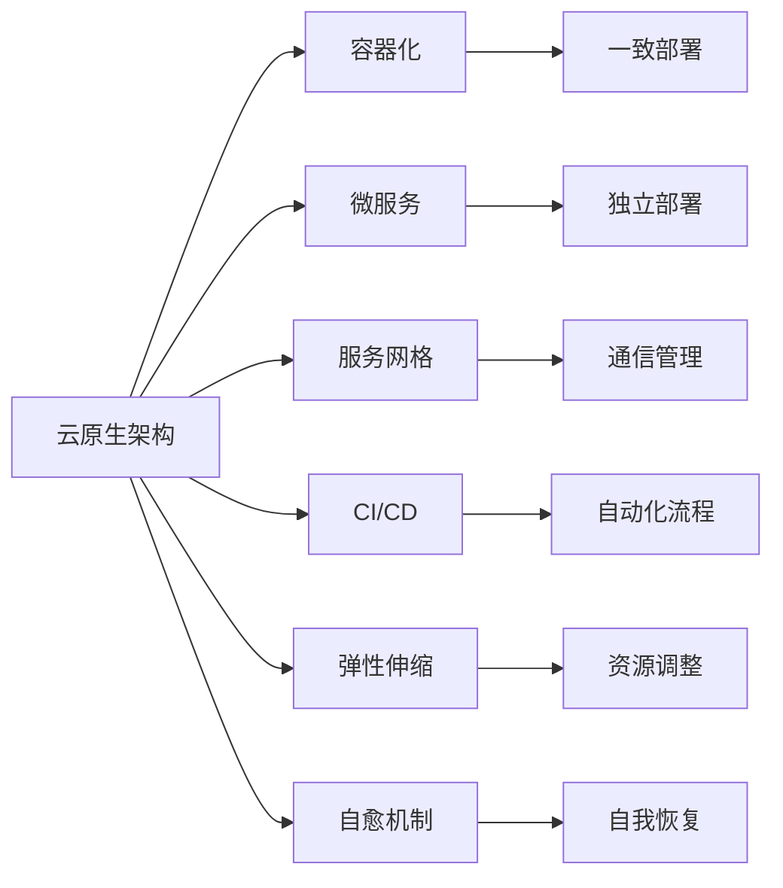

                 

# 云原生架构设计：构建可扩展的云端应用

> 关键词：云原生架构、容器化、微服务、服务网格、观察性、持续集成/持续部署(CI/CD)、弹性伸缩、自愈机制、跨云多环境部署

## 1. 背景介绍

在当今的数字化转型浪潮中，云计算成为了驱动企业创新和增长的重要引擎。企业对于云计算的需求不再局限于IaaS和PaaS基础设施，而是希望通过云原生技术构建更加灵活、高效、安全、可扩展的应用架构，实现业务快速迭代和市场响应。云原生架构设计已经成为企业实现这些目标的关键。

### 1.1 问题由来

云计算技术的发展带来了前所未有的IT资源可用性，但同时也在对现有架构设计提出新的挑战。传统架构无法满足云原生对灵活性、可扩展性、弹性和自愈能力的要求。如何构建一个能在云上无缝运行、弹性伸缩、持续迭代、自愈能力强的应用架构，成为企业面临的新课题。

### 1.2 问题核心关键点

云原生架构的核心在于如何构建一个支持容器化、微服务、服务网格、持续集成/持续部署、弹性伸缩、自愈机制的云应用架构。这要求我们对传统应用架构进行重构，采用新的设计模式和技术栈，实现自动化、去中心化、自适应和弹性化。

## 2. 核心概念与联系

### 2.1 核心概念概述

为更好地理解云原生架构设计，本节将介绍几个核心概念及其相互联系：

- 云原生架构（Cloud-Native Architecture）：基于云计算技术的软件架构设计范式，支持容器化、微服务、服务网格、持续集成/持续部署、弹性伸缩、自愈机制等。

- 容器化（Containerization）：将应用及其依赖打包到容器中，实现跨平台、跨环境的一致部署和管理。

- 微服务（Microservices）：将应用拆分为一组独立的服务，每个服务可以独立部署、扩展和管理。

- 服务网格（Service Mesh）：用于管理微服务间通信的专用基础设施，提供流量管理、服务发现、负载均衡、安全控制等功能。

- 持续集成/持续部署（CI/CD）：通过自动化流程实现代码的持续集成、测试、构建、部署，加速应用开发和发布。

- 弹性伸缩（Elastic Scaling）：根据负载变化自动调整系统资源，保证应用的稳定运行。

- 自愈机制（Self-Healing Mechanism）：通过自我诊断、自我恢复和自我修复，提高应用的健壮性和可靠性。

这些核心概念之间的逻辑关系可以通过以下Mermaid流程图来展示：



这个流程图展示了大语言模型的核心概念及其之间的关系：

1. 云原生架构基于云计算技术的软件架构设计范式，支持容器化、微服务、服务网格、持续集成/持续部署、弹性伸缩、自愈机制等。

2. 容器化将应用及其依赖打包到容器中，实现跨平台、跨环境的一致部署和管理。

3. 微服务将应用拆分为一组独立的服务，每个服务可以独立部署、扩展和管理。

4. 服务网格用于管理微服务间通信的专用基础设施，提供流量管理、服务发现、负载均衡、安全控制等功能。

5. 持续集成/持续部署通过自动化流程实现代码的持续集成、测试、构建、部署，加速应用开发和发布。

6. 弹性伸缩根据负载变化自动调整系统资源，保证应用的稳定运行。

7. 自愈机制通过自我诊断、自我恢复和自我修复，提高应用的健壮性和可靠性。

这些概念共同构成了云原生架构设计的核心要素，使得应用能够高效运行、灵活扩展、持续迭代和自我修复。通过理解这些核心概念，我们可以更好地把握云原生架构设计的精髓。

## 3. 核心算法原理 & 具体操作步骤

### 3.1 算法原理概述

云原生架构设计的基本原则是可扩展性、弹性和自愈性。这一原则在应用架构的各个层面都有体现，包括但不限于容器化、微服务、服务网格、持续集成/持续部署、弹性伸缩、自愈机制等。

云原生架构设计强调分布式系统的设计，各服务之间的解耦合、自动化、弹性和自我修复能力。这与传统的集中式架构设计不同，传统架构往往依赖中心化的服务器和数据库，难以快速响应负载变化和故障。

### 3.2 算法步骤详解

云原生架构设计通常包括以下几个关键步骤：

**Step 1: 应用分解**

将现有应用按照业务功能和服务粒度进行分解，每个服务独立运行、独立扩展、独立部署。分解后的服务应该具备独立性、自治性和可复用性。

**Step 2: 容器化**

将分解后的服务打包到容器中，容器化技术包括Docker、Kubernetes等。容器化不仅实现跨平台部署，还能确保应用在各个环境中的一致性。

**Step 3: 微服务架构**

设计微服务架构，每个服务有自己的数据存储和业务逻辑，采用RESTful API或gRPC等协议进行通信。微服务架构强调服务的自治性，服务间解耦合，提高应用的扩展性和可维护性。

**Step 4: 服务网格**

引入服务网格技术，如Istio、Linkerd等，实现服务间的通信管理和流量控制。服务网格能够提供流量管理、负载均衡、服务发现、安全控制等功能，保障服务间的可靠性和安全性。

**Step 5: CI/CD流程**

建立持续集成/持续部署流程，利用Jenkins、GitLab CI/CD、Travis CI等工具，实现代码的自动化测试、构建和部署。CI/CD流程不仅加速应用开发和发布，还能确保应用的稳定性和一致性。

**Step 6: 弹性伸缩**

通过云平台提供的弹性伸缩功能，根据系统负载动态调整资源，实现应用的自动扩展和收缩。例如，AWS的Auto Scaling，Azure的Elastic Pooling等。

**Step 7: 自愈机制**

设计自愈机制，通过自我诊断、自我恢复和自我修复，提高应用的健壮性和可靠性。例如，设置自动故障检测和重启机制，配置熔断器和降级策略。

以上是云原生架构设计的一般流程。在实际应用中，还需要针对具体场景，对架构设计的各个环节进行优化设计，如细粒度的服务拆分、更灵活的容器编排、更高效的流量管理等。

### 3.3 算法优缺点

云原生架构设计的主要优点包括：

- 可扩展性：基于微服务架构，可以独立扩展各个服务，提高应用的并发处理能力和稳定性。

- 弹性伸缩：根据系统负载动态调整资源，避免资源浪费和成本过高。

- 持续迭代：通过持续集成/持续部署流程，快速响应市场需求变化，加速应用迭代。

- 自愈能力：通过自我诊断、自我恢复和自我修复机制，提高应用的健壮性和可靠性。

然而，云原生架构设计也存在一定的局限性：

- 复杂性：初期设计和部署复杂，需要克服微服务带来的问题，如数据一致性、服务间通信等。

- 学习成本：需要掌握新的技术和工具，如容器化、微服务、服务网格、CI/CD流程等，学习成本较高。

- 运维难度：服务网格和自愈机制的复杂性增加了运维难度，需要专门的运维团队进行监控和管理。

尽管存在这些局限性，但就目前而言，云原生架构设计仍是构建云应用的主流范式。未来相关研究的重点在于如何进一步简化架构设计，降低学习成本和运维难度，同时兼顾可扩展性和弹性。

### 3.4 算法应用领域

云原生架构设计在云计算领域已经得到了广泛的应用，覆盖了几乎所有常见的应用场景，例如：

- 电商平台：通过微服务架构和容器化技术，实现高并发、低延迟、高可用性的在线购物体验。

- 金融交易：采用服务网格和自愈机制，确保金融交易系统的稳定性和安全性，应对高流量和高频交易。

- 移动应用：利用容器化技术，在不同平台和环境中部署和维护应用，确保应用的兼容性和一致性。

- 游戏服务器：通过弹性伸缩和自愈机制，提升游戏服务器的高并发和低延迟性能，应对大规模玩家同时在线的挑战。

- IoT设备：采用微服务架构，分散设备管理和服务逻辑，提高设备和服务的灵活性和可扩展性。

除了上述这些经典场景外，云原生架构设计还在诸多领域得到了创新性的应用，如区块链、边缘计算、人工智能等，为云计算技术带来了全新的突破。随着云计算技术的不断发展，云原生架构设计的应用前景将更加广阔。

## 4. 数学模型和公式 & 详细讲解

### 4.1 数学模型构建

本节将使用数学语言对云原生架构设计的基本原理进行更加严格的刻画。

假设有一个包含多个微服务的云原生应用，每个微服务可以表示为一个函数 $S_i: \mathcal{X}_i \rightarrow \mathcal{Y}_i$，其中 $\mathcal{X}_i$ 和 $\mathcal{Y}_i$ 分别表示输入和输出空间。整个应用可以表示为一个复合函数 $F: \mathcal{X} \rightarrow \mathcal{Y}$，其中 $\mathcal{X}$ 和 $\mathcal{Y}$ 分别表示输入和输出空间。

在云原生架构设计中，我们通过容器化、微服务、服务网格、CI/CD流程、弹性伸缩、自愈机制等技术，实现应用的各个组成部分和外部环境之间的解耦合、自治性、自适应性和弹性化。

### 4.2 公式推导过程

以下我们以一个简单的电商应用为例，推导云原生架构设计的数学模型。

假设电商应用的微服务架构包括商品管理、订单管理、库存管理、支付服务等，每个服务可以表示为一个函数。例如，商品管理的函数 $S_{商品管理}(x)$ 将输入的商品信息 $x$ 转化为商品详情 $y$，订单管理的函数 $S_{订单管理}(x)$ 将输入的订单信息 $x$ 转化为订单详情 $y$，以此类推。整个应用的复合函数可以表示为：

$$
F(x) = S_{商品管理}(x) \times S_{订单管理}(x) \times S_{库存管理}(x) \times S_{支付服务}(x)
$$

其中 $\times$ 表示函数之间的组合方式，可以是并行或串行。

在容器化技术中，每个微服务打包到容器中，表示为 $C_i$。容器化不仅实现跨平台部署，还能确保应用在各个环境中的一致性。例如，容器化后的商品管理服务可以表示为：

$$
S_{商品管理}^C = C_{商品管理} \times S_{商品管理}(x)
$$

在微服务架构中，每个服务独立运行、独立扩展、独立部署。例如，商品管理服务的微服务架构可以表示为：

$$
S_{商品管理}^M = S_{商品管理}(x) \times S_{商品管理}^C
$$

其中 $\times$ 表示服务之间的组合方式，可以是并行或串行。

在服务网格技术中，每个微服务通过服务网格进行通信管理和流量控制。例如，商品管理服务与服务网格的交互可以表示为：

$$
S_{商品管理}^N = S_{商品管理}^C \times S_{商品管理}^N(x)
$$

其中 $S_{商品管理}^N(x)$ 表示商品管理服务通过服务网格与外部环境进行通信的函数。

在CI/CD流程中，代码通过自动化流程进行持续集成和持续部署。例如，商品管理服务的CI/CD流程可以表示为：

$$
S_{商品管理}^{CI/CD} = S_{商品管理}^C \times S_{商品管理}^{CI/CD}
$$

其中 $S_{商品管理}^{CI/CD}$ 表示商品管理服务的持续集成和持续部署的函数。

在弹性伸缩中，根据系统负载动态调整资源，实现应用的自动扩展和收缩。例如，商品管理服务的弹性伸缩可以表示为：

$$
S_{商品管理}^{ES} = S_{商品管理}^C \times S_{商品管理}^{ES}(x)
$$

其中 $S_{商品管理}^{ES}(x)$ 表示商品管理服务的弹性伸缩函数。

在自愈机制中，通过自我诊断、自我恢复和自我修复，提高应用的健壮性和可靠性。例如，商品管理服务的自愈机制可以表示为：

$$
S_{商品管理}^{SH} = S_{商品管理}^C \times S_{商品管理}^{SH}(x)
$$

其中 $S_{商品管理}^{SH}(x)$ 表示商品管理服务的自愈机制函数。

综上所述，一个完整的云原生架构可以表示为：

$$
F(x) = S_{商品管理}^{M\times N\times CI/CD\times ES\times SH}(x) \times S_{订单管理}^{M\times N\times CI/CD\times ES\times SH}(x) \times S_{库存管理}^{M\times N\times CI/CD\times ES\times SH}(x) \times S_{支付服务}^{M\times N\times CI/CD\times ES\times SH}(x)
$$

通过上述公式，可以看出云原生架构设计通过容器化、微服务、服务网格、CI/CD流程、弹性伸缩、自愈机制等技术，实现应用的各个组成部分和外部环境之间的解耦合、自治性、自适应性和弹性化。

### 4.3 案例分析与讲解

下面我们以一个实际的电商应用为例，展示云原生架构设计的实践过程。

假设有一个电商平台，包括商品管理、订单管理、库存管理、支付服务等。原始的集中式架构设计如下：

```
+----------------+  +----------------+  +----------------+  +----------------+
|  商品管理      |  |  订单管理      |  |  库存管理      |  |  支付服务      |
|                |  |                |  |                |  |                |
| +-------------+  | +-------------+  | +-------------+  | +-------------+  |
| |             |  | |             |  | |             |  | |             |  |
| |    服务     |  | |    服务     |  | |    服务     |  | |    服务     |  |
| |             |  | |             |  | |             |  | |             |  |
| +-------------+  | +-------------+  | +-------------+  | +-------------+  |
|                |  |                |  |                |  |                |
|  +-------------+  |  +-------------+  |  +-------------+  |  +-------------+
|  +-------------+  |  +-------------+  |  +-------------+  |  +-------------+
|  数据库       |  |  数据库       |  |  数据库       |  |  数据库       |
|  +-------------+  |  +-------------+  |  +-------------+  |  +-------------+
+----------------+  +----------------+  +----------------+  +----------------+
```

这种集中式架构设计存在以下问题：

1. 单点故障：整个系统的性能和可靠性依赖于核心服务器的稳定性，一旦核心服务器故障，整个系统都会受到影响。

2. 扩展困难：各个服务之间的耦合度高，难以独立扩展。例如，订单管理服务需要大量数据库操作，扩展性较差。

3. 部署困难：各个服务需要手动部署和维护，难以实现自动化的持续集成和持续部署。

为了解决这些问题，我们采用云原生架构设计进行重构：

```
+----------------+  +----------------+  +----------------+  +----------------+
|  商品管理容器 |  |  订单管理容器  |  |  库存管理容器  |  |  支付服务容器  |
|                |  |                |  |                |  |                |
| +-------------+  | +-------------+  | +-------------+  | +-------------+  |
| |             |  | |             |  | |             |  | |             |  |
| |    服务     |  | |    服务     |  | |    服务     |  | |    服务     |  |
| |             |  | |             |  | |             |  | |             |  |
| +-------------+  | +-------------+  | +-------------+  | +-------------+  |
|                |  |                |  |                |  |                |
|  +-------------+  |  +-------------+  |  +-------------+  |  +-------------+
|  +-------------+  |  +-------------+  |  +-------------+  |  +-------------+
|  服务网格     |  |  服务网格     |  |  服务网格     |  |  服务网格     |
|  +-------------+  |  +-------------+  |  +-------------+  |  +-------------+
|                |  |                |  |                |  |                |
|  +-------------+  |  +-------------+  |  +-------------+  |  +-------------+
|  +-------------+  |  +-------------+  |  +-------------+  |  +-------------+
|  容器编排     |  |  容器编排     |  |  容器编排     |  |  容器编排     |
|  +-------------+  |  +-------------+  |  +-------------+  |  +-------------+
|                |  |                |  |                |  |                |
|  +-------------+  |  +-------------+  |  +-------------+  |  +-------------+
|  +-------------+  |  +-------------+  |  +-------------+  |  +-------------+
|  CI/CD流程     |  |  CI/CD流程     |  |  CI/CD流程     |  |  CI/CD流程     |
|  +-------------+  |  +-------------+  |  +-------------+  |  +-------------+
|                |  |                |  |                |  |                |
|  +-------------+  |  +-------------+  |  +-------------+  |  +-------------+
|  +-------------+  |  +-------------+  |  +-------------+  |  +-------------+
|  弹性伸缩     |  |  弹性伸缩     |  |  弹性伸缩     |  |  弹性伸缩     |
|  +-------------+  |  +-------------+  |  +-------------+  |  +-------------+
|                |  |                |  |                |  |                |
|  +-------------+  |  +-------------+  |  +-------------+  |  +-------------+
|  +-------------+  |  +-------------+  |  +-------------+  |  +-------------+
|  自愈机制     |  |  自愈机制     |  |  自愈机制     |  |  自愈机制     |
|  +-------------+  |  +-------------+  |  +-------------+  |  +-------------+
|                |  |                |  |                |  |                |
|  +-------------+  |  +-------------+  |  +-------------+  |  +-------------+
|  +-------------+  |  +-------------+  |  +-------------+  |  +-------------+
|  监控与告警   |  |  监控与告警   |  |  监控与告警   |  |  监控与告警   |
|  +-------------+  |  +-------------+  |  +-------------+  |  +-------------+
|                |  |                |  |                |  |                |
|  +-------------+  |  +-------------+  |  +-------------+  |  +-------------+
+----------------+  +----------------+  +----------------+  +----------------+
```

这种云原生架构设计的优点包括：

1. 高可用性：通过服务网格实现负载均衡和故障转移，提升系统的可用性和可靠性。

2. 高扩展性：各个服务独立部署和扩展，可以根据负载动态调整资源。

3. 高自治性：通过容器编排和CI/CD流程，实现自动化部署和持续集成，提高开发效率和系统稳定性。

4. 高自适应性：通过弹性伸缩和自愈机制，实现系统的高弹性和自修复能力，适应复杂的业务场景。

## 5. 项目实践：代码实例和详细解释说明

### 5.1 开发环境搭建

在进行云原生架构设计实践前，我们需要准备好开发环境。以下是使用Kubernetes和Docker进行云原生架构实践的环境配置流程：

1. 安装Kubernetes：从官网下载并安装Kubernetes，创建和管理集群节点。

2. 安装Docker：从官网下载并安装Docker，构建和部署容器镜像。

3. 搭建Kubernetes集群：配置Node节点和Master节点，确保集群正常运行。

4. 部署应用容器：通过Kubernetes的Deployment和Service资源，部署应用容器，并进行负载均衡和流量管理。

5. 配置CI/CD流程：通过Jenkins或GitLab CI/CD，建立自动化持续集成和持续部署流程。

6. 实现弹性伸缩：通过云平台提供的Auto Scaling或Elastic Pooling等弹性伸缩功能，动态调整资源。

7. 设置监控告警：通过Prometheus和Grafana等工具，实时监控系统指标，设置告警阈值，保障系统稳定运行。

完成上述步骤后，即可在Kubernetes集群中开始云原生架构实践。

### 5.2 源代码详细实现

下面我们以一个简单的电商应用为例，展示如何使用Kubernetes和Docker进行云原生架构实践。

首先，定义应用服务及其Docker镜像：

```dockerfile
# 商品管理服务
FROM nginx:latest

COPY index.html /usr/share/nginx/html/
COPY www/ /usr/share/nginx/html/

EXPOSE 80
```

```dockerfile
# 订单管理服务
FROM nginx:latest

COPY index.html /usr/share/nginx/html/
COPY www/ /usr/share/nginx/html/

EXPOSE 80
```

```dockerfile
# 库存管理服务
FROM nginx:latest

COPY index.html /usr/share/nginx/html/
COPY www/ /usr/share/nginx/html/

EXPOSE 80
```

```dockerfile
# 支付服务
FROM nginx:latest

COPY index.html /usr/share/nginx/html/
COPY www/ /usr/share/nginx/html/

EXPOSE 80
```

接下来，使用Kubernetes部署应用容器：

```yaml
# 商品管理服务
apiVersion: v1
kind: Deployment
metadata:
  name: product-service
spec:
  replicas: 3
  selector:
    matchLabels:
      app: product-service
  template:
    metadata:
      labels:
        app: product-service
    spec:
      containers:
      - name: product-service
        image: product-service:latest
        ports:
        - containerPort: 80

# 订单管理服务
apiVersion: v1
kind: Deployment
metadata:
  name: order-service
spec:
  replicas: 3
  selector:
    matchLabels:
      app: order-service
  template:
    metadata:
      labels:
        app: order-service
    spec:
      containers:
      - name: order-service
        image: order-service:latest
        ports:
        - containerPort: 80

# 库存管理服务
apiVersion: v1
kind: Deployment
metadata:
  name: inventory-service
spec:
  replicas: 3
  selector:
    matchLabels:
      app: inventory-service
  template:
    metadata:
      labels:
        app: inventory-service
    spec:
      containers:
      - name: inventory-service
        image: inventory-service:latest
        ports:
        - containerPort: 80

# 支付服务
apiVersion: v1
kind: Deployment
metadata:
  name: payment-service
spec:
  replicas: 3
  selector:
    matchLabels:
      app: payment-service
  template:
    metadata:
      labels:
        app: payment-service
    spec:
      containers:
      - name: payment-service
        image: payment-service:latest
        ports:
        - containerPort: 80
```

然后，通过Kubernetes Service资源进行负载均衡和流量管理：

```yaml
# 商品管理服务
apiVersion: v1
kind: Service
metadata:
  name: product-service
spec:
  selector:
    app: product-service
  ports:
  - protocol: TCP
    port: 80
    targetPort: 80

# 订单管理服务
apiVersion: v1
kind: Service
metadata:
  name: order-service
spec:
  selector:
    app: order-service
  ports:
  - protocol: TCP
    port: 80
    targetPort: 80

# 库存管理服务
apiVersion: v1
kind: Service
metadata:
  name: inventory-service
spec:
  selector:
    app: inventory-service
  ports:
  - protocol: TCP
    port: 80
    targetPort: 80

# 支付服务
apiVersion: v1
kind: Service
metadata:
  name: payment-service
spec:
  selector:
    app: payment-service
  ports:
  - protocol: TCP
    port: 80
    targetPort: 80
```

最后，配置CI/CD流程和监控告警：

```yaml
# Jenkins CI/CD配置
# 定义持续集成步骤，编译构建应用镜像
# 定义持续部署步骤，部署应用容器到Kubernetes集群
# 设置告警规则，监控系统指标，如CPU使用率、内存使用率等

# Prometheus监控配置
# 定义监控指标，如请求延迟、响应时间等
# 设置告警规则，如请求失败率超过阈值等

# Grafana仪表盘配置
# 定义仪表盘面板，展示系统指标，如负载均衡情况、容器资源使用情况等
```

通过上述代码实现，我们完成了使用Kubernetes和Docker进行云原生架构实践的全过程。可以看到，云原生架构设计的关键在于通过容器化、微服务、服务网格、CI/CD流程、弹性伸缩、自愈机制等技术，实现应用的各个组成部分和外部环境之间的解耦合、自治性、自适应性和弹性化。

## 6. 实际应用场景

### 6.1 智能客服系统

基于云原生架构的智能客服系统，能够实现快速响应、多渠道支持、自动化处理等功能。通过微服务架构和容器化技术，智能客服系统可以灵活扩展各个服务，实现高并发和低延迟的客户服务体验。

在技术实现上，可以收集企业内部的历史客服对话记录，将问题-回答对作为监督数据，在此基础上对预训练语言模型进行微调。微调后的对话模型能够自动理解用户意图，匹配最合适的答案模板进行回复。对于客户提出的新问题，还可以接入检索系统实时搜索相关内容，动态组织生成回答。如此构建的智能客服系统，能大幅提升客户咨询体验和问题解决效率。

### 6.2 金融交易系统

基于云原生架构的金融交易系统，能够实现高并发、低延迟、高可用性的交易处理。通过微服务架构和容器化技术，金融交易系统可以独立扩展各个服务，实现高并发和低延迟的交易处理。

在技术实现上，可以引入服务网格和自愈机制，确保金融交易系统的稳定性和安全性，应对高流量和高频交易。例如，通过服务网格实现负载均衡和故障转移，提升系统的可用性和可靠性。通过自愈机制实现自我诊断、自我恢复和自我修复，提高应用的健壮性和可靠性。

### 6.3 电商应用

基于云原生架构的电商应用，能够实现高并发、低延迟、高可用性的在线购物体验。通过微服务架构和容器化技术，电商应用可以独立扩展各个服务，实现高并发和低延迟的在线购物体验。

在技术实现上，可以引入服务网格和自愈机制，确保电商应用的稳定性和安全性，应对高流量和高频交易。例如，通过服务网格实现负载均衡和故障转移，提升系统的可用性和可靠性。通过自愈机制实现自我诊断、自我恢复和自我修复，提高应用的健壮性和可靠性。

### 6.4 未来应用展望

随着云原生架构设计的不断发展，未来将有更多新的应用场景得到实现，为云计算技术带来新的突破。

在智慧医疗领域，基于云原生架构的医疗问答、病历分析、药物研发等应用将提升医疗服务的智能化水平，辅助医生诊疗，加速新药开发进程。

在智能教育领域，微服务架构和容器化技术可应用于作业批改、学情分析、知识推荐等方面，因材施教，促进教育公平，提高教学质量。

在智慧城市治理中，云原生架构设计的应用系统能够实现城市事件监测、舆情分析、应急指挥等环节，提高城市管理的自动化和智能化水平，构建更安全、高效的未来城市。

此外，在企业生产、社会治理、文娱传媒等众多领域，基于云原生架构的人工智能应用也将不断涌现，为经济社会发展注入新的动力。相信随着技术的日益成熟，云原生架构设计将成为云计算应用的主流范式，推动云计算技术向更广阔的领域加速渗透。

## 7. 工具和资源推荐

### 7.1 学习资源推荐

为了帮助开发者系统掌握云原生架构设计的理论基础和实践技巧，这里推荐一些优质的学习资源：

1. Kubernetes官方文档：Kubernetes官方文档提供了详细的架构设计、部署和管理指南，是学习Kubernetes的最佳资源。

2. Docker官方文档：Docker官方文档提供了详细的容器化技术、镜像构建和部署指南，是学习Docker的重要参考。

3. Google Cloud Cloud Architectures：Google Cloud提供的架构设计指南，涵盖从单体应用到微服务架构的设计思路，适合云计算初学者学习。

4. O'Reilly《Cloud-Native Computing with Kubernetes》：一本详细介绍云原生架构设计和Kubernetes实践的书籍，适合深入学习。

5. Udacity Cloud-Native Microservices课程：Udacity提供的云原生微服务课程，通过实战项目，深入浅出地讲解了云原生架构设计的各个环节。

通过对这些资源的学习实践，相信你一定能够快速掌握云原生架构设计的精髓，并用于解决实际的云计算问题。

### 7.2 开发工具推荐

高效的开发离不开优秀的工具支持。以下是几款用于云原生架构设计开发的常用工具：

1. Kubernetes：由Google主导开发的容器编排工具，支持自动化部署、扩展、运维，是云原生架构设计的重要基础设施。

2. Docker：开源的容器化平台，支持构建、存储、部署和管理容器镜像，是云原生架构设计的基础组件。

3. Jenkins：开源的持续集成工具，支持构建、测试、部署、监控等自动化流程，是云原生架构设计的自动化引擎。

4. GitLab CI/CD：开源的持续集成/持续部署平台，支持代码的自动化构建、测试、部署、监控，是云原生架构设计的自动化流程管理工具。

5. Prometheus：开源的监控和告警系统，支持实时监控系统指标，是云原生架构设计的监控工具。

6. Grafana：开源的仪表盘系统，支持展示系统指标，是云原生架构设计的可视化工具。

合理利用这些工具，可以显著提升云原生架构设计的开发效率，加速创新迭代的步伐。

### 7.3 相关论文推荐

云原生架构设计在云计算领域已经得到了广泛的应用，成为云计算技术的重要组成部分。以下是几篇奠基性的相关论文，推荐阅读：

1. Kubernetes：Introduction to Kubernetes：Kubernetes官方论文，介绍了Kubernetes的设计理念、架构设计、部署和管理指南。

2. Docker：Docker: The Definitive Guide：Docker官方指南，详细介绍了Docker的容器化技术、镜像构建和部署指南。

3. Google Cloud Cloud Architectures：Google Cloud架构设计指南，提供了从单体应用到微服务架构的设计思路，适合云计算初学者学习。

4. Cloud-Native Computing with Kubernetes：O'Reilly书籍，详细介绍了云原生架构设计和Kubernetes实践的各个环节。

这些论文代表了大云原生架构设计的理论基础和技术演进。通过学习这些前沿成果，可以帮助研究者把握学科前进方向，激发更多的创新灵感。

## 8. 总结：未来发展趋势与挑战

### 8.1 总结

本文对云原生架构设计进行了全面系统的介绍。首先阐述了云原生架构设计的背景和意义，明确了微服务、容器化、服务网格、持续集成/持续部署、弹性伸缩、自愈机制等核心要素。其次，从原理到实践，详细讲解了云原生架构设计的数学模型和关键步骤，给出了云原生架构设计的完整代码实现。同时，本文还广泛探讨了云原生架构设计在智能客服、金融交易、电商应用等众多行业领域的应用前景，展示了云原生架构设计的广阔前景。此外，本文精选了云原生架构设计的各类学习资源、开发工具和相关论文，力求为读者提供全方位的技术指引。

通过本文的系统梳理，可以看到，云原生架构设计已经成为构建云应用的主流范式，极大提升了应用的灵活性、扩展性、弹性和自愈能力。未来，伴随云原生架构设计的持续演进，云计算技术必将迎来更大的发展机遇，进一步推动数字化转型进程。

### 8.2 未来发展趋势

展望未来，云原生架构设计将呈现以下几个发展趋势：

1. 微服务架构的普及：微服务架构将成为主流架构设计模式，实现应用的模块化、独立化和自治化。

2. 容器化技术的深入应用：容器化技术将实现更广泛的应用，不仅限于应用部署，还包括数据处理、存储等各个环节。

3. 服务网格的广泛采用：服务网格将实现更灵活的通信管理和流量控制，提升微服务架构的可靠性和安全性。

4. 持续集成/持续部署的普及：CI/CD流程将实现更高效的自动化部署和持续集成，加速应用开发和发布。

5. 弹性伸缩和自愈机制的完善：弹性伸缩和自愈机制将实现更高效的系统资源管理和故障恢复。

6. 跨云多环境的无缝部署：通过云平台提供的跨云部署功能，实现应用的灵活部署和迁移。

以上趋势凸显了云原生架构设计的广阔前景。这些方向的探索发展，必将进一步提升云计算系统的性能和可扩展性，为云计算技术带来新的突破。

### 8.3 面临的挑战

尽管云原生架构设计已经取得了显著的进展，但在迈向更加智能化、普适化应用的过程中，仍面临诸多挑战：

1. 运维复杂性：云原生架构设计引入了更多复杂的技术组件，如容器编排、服务网格、CI/CD流程等，运维难度增加。

2. 学习成本高：云原生架构设计需要掌握新的技术和工具，如Kubernetes、Docker、CI/CD流程等，学习成本较高。

3. 资源消耗高：容器化和大规模微服务架构增加了系统的资源消耗，需要优化资源利用率，降低成本。

4. 应用开发难度大：微服务架构和容器化技术增加了应用的开发难度，需要平衡服务间依赖和系统健壮性。

5. 性能瓶颈多：服务网格和微服务架构的引入，增加了系统的网络延迟和数据传输开销，需要优化性能瓶颈。

尽管存在这些挑战，但云原生架构设计仍然是构建云应用的主流范式。未来相关研究的重点在于如何进一步简化架构设计，降低学习成本和运维难度，同时兼顾可扩展性和弹性。

### 8.4 研究展望

面对云原生架构设计所面临的种种挑战，未来的研究需要在以下几个方面寻求新的突破：

1. 简化架构设计：探索更灵活、更高效的云原生架构设计方法，降低学习成本和运维难度。

2. 优化资源利用率：引入更高效的资源利用策略，如容器编排、负载均衡、弹性伸缩等，降低资源消耗。

3. 提高应用开发效率：探索更便捷、更易用的开发工具和框架，提高应用的开发效率和系统健壮性。

4. 增强系统性能：优化网络延迟和数据传输开销，提升系统的性能和响应速度。

5. 增强安全性和可靠性：引入更强大的安全控制和故障恢复机制，提高系统的安全性和可靠性。

6. 支持跨云多环境部署：探索跨云多环境部署的解决方案，实现应用的灵活部署和迁移。

这些研究方向将推动云原生架构设计向更高效、更灵活、更安全、更可靠的方向发展，为云计算技术带来新的突破。未来，伴随云原生架构设计的不断演进，云计算技术必将进一步加速数字化转型进程，赋能各行各业的发展。

## 9. 附录：常见问题与解答

**Q1：云原生架构设计和传统架构设计有何不同？**

A: 云原生架构设计强调分布式系统的设计，各个服务之间通过微服务进行解耦合，实现独立部署、独立扩展、独立维护。相比传统集中式架构设计，云原生架构设计具有更高的灵活性、弹性和可扩展性。

**Q2：如何选择合适的容器化技术？**

A: 容器化技术包括Docker、Kubernetes等，选择合适的容器化技术需要考虑应用的具体需求。例如，Docker适合构建和部署应用镜像，Kubernetes适合管理容器编排和资源调度。

**Q3：云原生架构设计是否适用于所有应用场景？**

A: 云原生架构设计适用于大多数云应用场景，特别是需要高并发、高扩展、高弹性的应用。但对于一些特定领域的应用，如实时数据处理、低延迟的在线交易等，可能需要采用更加适合的架构设计。

**Q4：云原生架构设计在运维方面需要注意哪些问题？**

A: 云原生架构设计引入了更多复杂的技术组件，如容器编排、服务网格、CI/CD流程等，运维难度增加。运维团队需要掌握这些工具的使用方法，确保系统的稳定性和可靠性。

**Q5：如何优化云原生架构设计的资源利用率？**

A: 优化资源利用率需要引入更高效的资源利用策略，如容器编排、负载均衡、弹性伸缩等。可以通过云平台提供的Auto Scaling、Elastic Pooling等功能，动态调整系统资源，实现更高效的系统管理。

通过本文的系统梳理，可以看到，云原生架构设计已经成为构建云应用的主流范式，极大提升了应用的灵活性、扩展性、弹性和自愈能力。未来，伴随云原生架构设计的持续演进，云计算技术必将迎来更大的发展机遇，进一步推动数字化转型进程。

---

作者：禅与计算机程序设计艺术 / Zen and the Art of Computer Programming

