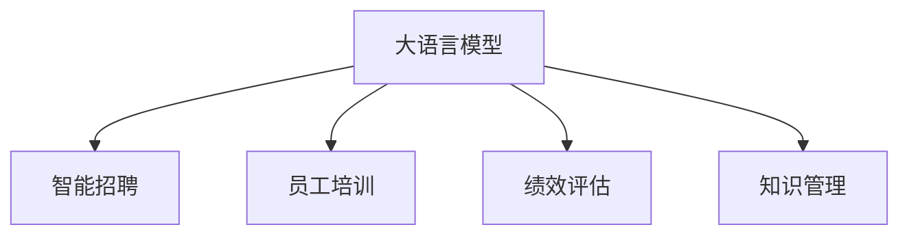

                 

# 人力资源管理师：LLM 优化人才管理

> 关键词：大语言模型,人才管理,智能招聘,员工培训,绩效评估

## 1. 背景介绍

### 1.1 问题由来
在人工智能(AI)迅速发展的今天，人力资源管理领域正面临一场深刻变革。传统的招聘、培训、绩效评估等环节，都需要依赖大量的人力和时间，效率低下，准确性不高。而大语言模型(Large Language Models, LLMs)的出现，为优化人力资源管理提供了新的可能性。通过将LLM应用于人才管理，企业可以大幅提升招聘效率、提升培训效果、优化绩效评估，从而在激烈的人才竞争中获得优势。

### 1.2 问题核心关键点
大语言模型在人力资源管理中的应用，主要体现在以下几个方面：

- **智能招聘**：通过分析候选人的简历、作品集等文本数据，预测其适配度、能力和潜力，辅助招聘决策。
- **员工培训**：利用LLM生成的课程材料、个性化推荐和模拟考试，提高员工的技能水平和业务能力。
- **绩效评估**：通过自然语言处理技术，对员工的日常工作记录、项目评估报告进行自动分析，生成客观公正的绩效评估结果。
- **员工福利优化**：根据员工的兴趣和需求，定制个性化的福利方案，提升员工满意度和忠诚度。
- **知识管理**：整合公司内部知识资源，通过LLM实现高效的信息检索和知识分享。

这些关键点突出了LLM在人力资源管理中的广泛应用场景，展示了其巨大的潜力和价值。

### 1.3 问题研究意义
大语言模型在人力资源管理中的应用，对于提升企业的人才管理和运营效率，具有重要意义：

1. **提升招聘效率**：通过智能招聘系统，企业可以大幅缩短招聘周期，提高招聘决策的准确性和满意度。
2. **提升培训效果**：个性化和互动式的培训内容，可以显著提高员工的学习效果和职业成长速度。
3. **优化绩效评估**：自动化的绩效评估过程，可以消除主观偏见，提升评估的客观性和公正性。
4. **增强员工福利**：通过智能化的福利方案设计，提升员工的整体满意度和忠诚度。
5. **促进知识管理**：利用大语言模型的强大信息检索和知识融合能力，实现高效的知识管理。

此外，LLM的引入还可以促进企业的人才战略落地，帮助企业构建更加智慧、高效、人性化的管理模式，提升企业的市场竞争力。

## 2. 核心概念与联系

### 2.1 核心概念概述

为了更好地理解大语言模型在人力资源管理中的应用，本节将介绍几个密切相关的核心概念：

- **大语言模型**：以自回归(如GPT)或自编码(如BERT)模型为代表的大规模预训练语言模型。通过在海量无标签文本数据上进行预训练，学习通用的语言知识和常识，具备强大的自然语言理解和生成能力。

- **智能招聘**：利用自然语言处理技术，对候选人简历、项目作品等文本数据进行分析，预测其适配度、能力和潜力，辅助招聘决策。

- **员工培训**：通过智能化的培训系统，生成个性化的学习材料、模拟测试和互动式课程，提升员工的技能水平和业务能力。

- **绩效评估**：通过自然语言处理技术，对员工的工作记录、项目评估报告等文本数据进行自动分析，生成客观公正的绩效评估结果。

- **知识管理**：整合公司内部知识资源，利用大语言模型的强大信息检索和知识融合能力，实现高效的信息检索和知识分享。

这些核心概念之间的逻辑关系可以通过以下Mermaid流程图来展示：



这个流程图展示了大语言模型在人力资源管理中的应用逻辑：

1. 大语言模型通过预训练获得基础能力。
2. 智能招聘系统、员工培训系统、绩效评估系统和知识管理系统，利用大语言模型的语言理解能力和知识融合能力，实现特定功能的优化。
3. 这些系统通过人机协同，提升人力资源管理的效率和效果。

## 3. 核心算法原理 & 具体操作步骤
### 3.1 算法原理概述

大语言模型在人力资源管理中的应用，本质上是一种基于自然语言处理的监督学习任务。其核心思想是：利用大语言模型的强大语言理解能力和知识融合能力，对候选人的简历、项目作品、工作记录等文本数据进行分析，辅助招聘决策、员工培训、绩效评估和知识管理等环节。

形式化地，假设企业有 $N$ 个候选人简历，每个简历 $x_i$ 描述了一个候选人的背景、经历、技能等。大语言模型 $M_{\theta}$ 能够自动学习这些简历的通用语言表示。企业希望模型能够预测每个简历 $x_i$ 适配度的高低，从而辅助招聘决策。假设适配度预测任务为二分类问题，即候选人是否适配某个职位。模型的目标是最小化预测错误，即：

$$
\hat{\theta}=\mathop{\arg\min}_{\theta} \mathcal{L}(M_{\theta},D)
$$

其中 $\mathcal{L}$ 为交叉熵损失函数，$D=\{(x_i,y_i)\}_{i=1}^N$ 为标注数据集，$y_i \in \{0,1\}$ 表示候选人是否适配。通过最小化损失函数，优化模型参数 $\theta$，使得模型能够准确预测适配度。

### 3.2 算法步骤详解

基于大语言模型的人力资源管理优化，一般包括以下几个关键步骤：

**Step 1: 准备数据集**
- 收集候选人的简历、项目作品、工作记录等文本数据。这些数据需包含候选人的基本信息、经历、技能、成果等。
- 准备标注数据集，标注每个简历是否适配某职位。通常通过人工标注或自动标注的方式获取。

**Step 2: 选择模型和任务适配层**
- 选择合适的预训练语言模型 $M_{\theta}$，如BERT、GPT等。
- 根据具体任务需求，在预训练模型的基础上设计任务适配层。对于智能招聘，任务适配层可以是适配度预测的分类器；对于员工培训，可以是课程推荐和模拟测试的生成器；对于绩效评估，可以是绩效指标提取和评估结果生成的模块。

**Step 3: 设置微调超参数**
- 选择合适的优化算法及其参数，如 AdamW、SGD 等，设置学习率、批大小、迭代轮数等。
- 设置正则化技术及强度，包括权重衰减、Dropout、Early Stopping等。
- 确定冻结预训练参数的策略，如仅微调顶层，或全部参数都参与微调。

**Step 4: 执行梯度训练**
- 将训练集数据分批次输入模型，前向传播计算损失函数。
- 反向传播计算参数梯度，根据设定的优化算法和学习率更新模型参数。
- 周期性在验证集上评估模型性能，根据性能指标决定是否触发 Early Stopping。
- 重复上述步骤直至满足预设的迭代轮数或 Early Stopping 条件。

**Step 5: 测试和部署**
- 在测试集上评估微调后模型 $M_{\hat{\theta}}$ 的性能，对比微调前后的适配度提升。
- 使用微调后的模型对新简历进行适配度预测，集成到实际的应用系统中。
- 持续收集新的简历数据，定期重新微调模型，以适应数据分布的变化。

### 3.3 算法优缺点

基于大语言模型的人力资源管理优化方法具有以下优点：
1. **高效性**：利用大语言模型的强大语言理解能力，可以自动处理大量的文本数据，提高招聘、培训、评估的效率。
2. **准确性**：通过监督学习任务，可以提升适配度预测的准确性，减少人工主观偏见的影响。
3. **可扩展性**：不同任务只需在预训练模型的基础上添加不同的任务适配层，能够灵活应对多变的业务需求。
4. **个性化**：利用大语言模型的生成能力，可以生成个性化的培训材料和福利方案，提升员工满意度和忠诚度。

同时，该方法也存在一定的局限性：
1. **依赖标注数据**：智能招聘和绩效评估等环节需要大量高质量的标注数据，标注成本较高。
2. **数据隐私**：在处理大量简历和员工数据时，需要确保数据隐私和安全，避免数据泄露和滥用。
3. **泛化能力**：如果预训练模型和任务适配层设计的质量不高，模型在不同数据分布上的泛化能力有限。
4. **交互性不足**：现有模型多为静态分析，缺乏与人机交互的能力，难以应对复杂多变的业务场景。
5. **可解释性不足**：现有模型多为黑盒系统，缺乏解释性，难以对其决策过程进行解释和调试。

尽管存在这些局限性，但就目前而言，基于大语言模型的方法仍是人资源管理优化的主流范式。未来相关研究的重点在于如何进一步降低标注数据的依赖，提高模型的泛化能力，同时兼顾可解释性和数据隐私等问题。

### 3.4 算法应用领域

基于大语言模型的人力资源管理优化方法，已经在多个领域得到了应用，包括但不限于：

- **智能招聘**：通过分析候选人的简历、项目作品等文本数据，预测其适配度、能力和潜力，辅助招聘决策。
- **员工培训**：利用LLM生成的课程材料、个性化推荐和模拟考试，提高员工的技能水平和业务能力。
- **绩效评估**：通过自然语言处理技术，对员工的工作记录、项目评估报告等文本数据进行自动分析，生成客观公正的绩效评估结果。
- **员工福利优化**：根据员工的兴趣和需求，定制个性化的福利方案，提升员工满意度和忠诚度。
- **知识管理**：整合公司内部知识资源，利用大语言模型的强大信息检索和知识融合能力，实现高效的信息检索和知识分享。

除了上述这些经典应用外，大语言模型还可以被创新性地应用到更多场景中，如候选人面试视频分析、员工心理状态监测、职场情绪识别等，为人力资源管理带来全新的突破。

## 4. 数学模型和公式 & 详细讲解  
### 4.1 数学模型构建

本节将使用数学语言对基于大语言模型的人力资源管理优化过程进行更加严格的刻画。

记企业收集到的简历集合为 $D=\{(x_i,y_i)\}_{i=1}^N, x_i \in \mathcal{X}, y_i \in \{0,1\}$，其中 $x_i$ 为简历文本，$y_i$ 为适配度标签。假设模型 $M_{\theta}$ 在输入 $x_i$ 上的输出为 $\hat{y}=M_{\theta}(x_i) \in [0,1]$，表示简历 $x_i$ 适配职位的概率。则适配度预测任务的形式化目标为：

$$
\hat{\theta}=\mathop{\arg\min}_{\theta} \mathcal{L}(M_{\theta},D)
$$

其中 $\mathcal{L}$ 为交叉熵损失函数，定义为：

$$
\ell(M_{\theta}(x),y) = -[y\log \hat{y} + (1-y)\log (1-\hat{y})]
$$

将其代入经验风险公式，得：

$$
\mathcal{L}(\theta) = -\frac{1}{N}\sum_{i=1}^N [y_i\log M_{\theta}(x_i)+(1-y_i)\log(1-M_{\theta}(x_i))]
$$

根据链式法则，损失函数对参数 $\theta_k$ 的梯度为：

$$
\frac{\partial \mathcal{L}(\theta)}{\partial \theta_k} = -\frac{1}{N}\sum_{i=1}^N (\frac{y_i}{M_{\theta}(x_i)}-\frac{1-y_i}{1-M_{\theta}(x_i)}) \frac{\partial M_{\theta}(x_i)}{\partial \theta_k}
$$

其中 $\frac{\partial M_{\theta}(x_i)}{\partial \theta_k}$ 可进一步递归展开，利用自动微分技术完成计算。

### 4.2 公式推导过程

以下我们以智能招聘任务为例，推导适配度预测的交叉熵损失函数及其梯度的计算公式。

假设模型 $M_{\theta}$ 在输入 $x_i$ 上的输出为 $\hat{y}=M_{\theta}(x_i) \in [0,1]$，表示简历 $x_i$ 适配职位的概率。真实标签 $y_i \in \{0,1\}$。则交叉熵损失函数定义为：

$$
\ell(M_{\theta}(x),y) = -[y\log \hat{y} + (1-y)\log (1-\hat{y})]
$$

将其代入经验风险公式，得：

$$
\mathcal{L}(\theta) = -\frac{1}{N}\sum_{i=1}^N [y_i\log M_{\theta}(x_i)+(1-y_i)\log(1-M_{\theta}(x_i))]
$$

根据链式法则，损失函数对参数 $\theta_k$ 的梯度为：

$$
\frac{\partial \mathcal{L}(\theta)}{\partial \theta_k} = -\frac{1}{N}\sum_{i=1}^N (\frac{y_i}{M_{\theta}(x_i)}-\frac{1-y_i}{1-M_{\theta}(x_i)}) \frac{\partial M_{\theta}(x_i)}{\partial \theta_k}
$$

其中 $\frac{\partial M_{\theta}(x_i)}{\partial \theta_k}$ 可进一步递归展开，利用自动微分技术完成计算。

在得到损失函数的梯度后，即可带入参数更新公式，完成模型的迭代优化。重复上述过程直至收敛，最终得到适应智能招聘任务的模型参数 $\theta^*$。

## 5. 项目实践：代码实例和详细解释说明
### 5.1 开发环境搭建

在进行人力资源管理优化实践前，我们需要准备好开发环境。以下是使用Python进行PyTorch开发的环境配置流程：

1. 安装Anaconda：从官网下载并安装Anaconda，用于创建独立的Python环境。

2. 创建并激活虚拟环境：
```bash
conda create -n pytorch-env python=3.8 
conda activate pytorch-env
```

3. 安装PyTorch：根据CUDA版本，从官网获取对应的安装命令。例如：
```bash
conda install pytorch torchvision torchaudio cudatoolkit=11.1 -c pytorch -c conda-forge
```

4. 安装HuggingFace Transformers库：
```bash
pip install transformers
```

5. 安装各类工具包：
```bash
pip install numpy pandas scikit-learn matplotlib tqdm jupyter notebook ipython
```

完成上述步骤后，即可在`pytorch-env`环境中开始人力资源管理优化实践。

### 5.2 源代码详细实现

下面我们以智能招聘系统为例，给出使用Transformers库对BERT模型进行适配度预测的PyTorch代码实现。

首先，定义适配度预测任务的数据处理函数：

```python
from transformers import BertTokenizer
from torch.utils.data import Dataset
import torch

class ResumeDataset(Dataset):
    def __init__(self, resumes, labels, tokenizer, max_len=128):
        self.resumes = resumes
        self.labels = labels
        self.tokenizer = tokenizer
        self.max_len = max_len
        
    def __len__(self):
        return len(self.resumes)
    
    def __getitem__(self, item):
        resume = self.resumes[item]
        label = self.labels[item]
        
        encoding = self.tokenizer(resume, return_tensors='pt', max_length=self.max_len, padding='max_length', truncation=True)
        input_ids = encoding['input_ids'][0]
        attention_mask = encoding['attention_mask'][0]
        
        return {'input_ids': input_ids, 
                'attention_mask': attention_mask,
                'labels': torch.tensor(label, dtype=torch.long)}
```

然后，定义模型和优化器：

```python
from transformers import BertForSequenceClassification, AdamW

model = BertForSequenceClassification.from_pretrained('bert-base-cased', num_labels=2)

optimizer = AdamW(model.parameters(), lr=2e-5)
```

接着，定义训练和评估函数：

```python
from torch.utils.data import DataLoader
from tqdm import tqdm
from sklearn.metrics import classification_report

device = torch.device('cuda') if torch.cuda.is_available() else torch.device('cpu')
model.to(device)

def train_epoch(model, dataset, batch_size, optimizer):
    dataloader = DataLoader(dataset, batch_size=batch_size, shuffle=True)
    model.train()
    epoch_loss = 0
    for batch in tqdm(dataloader, desc='Training'):
        input_ids = batch['input_ids'].to(device)
        attention_mask = batch['attention_mask'].to(device)
        labels = batch['labels'].to(device)
        model.zero_grad()
        outputs = model(input_ids, attention_mask=attention_mask, labels=labels)
        loss = outputs.loss
        epoch_loss += loss.item()
        loss.backward()
        optimizer.step()
    return epoch_loss / len(dataloader)

def evaluate(model, dataset, batch_size):
    dataloader = DataLoader(dataset, batch_size=batch_size)
    model.eval()
    preds, labels = [], []
    with torch.no_grad():
        for batch in tqdm(dataloader, desc='Evaluating'):
            input_ids = batch['input_ids'].to(device)
            attention_mask = batch['attention_mask'].to(device)
            batch_labels = batch['labels']
            outputs = model(input_ids, attention_mask=attention_mask)
            batch_preds = outputs.logits.argmax(dim=2).to('cpu').tolist()
            batch_labels = batch_labels.to('cpu').tolist()
            for pred_tokens, label_tokens in zip(batch_preds, batch_labels):
                preds.append(pred_tokens[:len(label_tokens)])
                labels.append(label_tokens)
                
    print(classification_report(labels, preds))
```

最后，启动训练流程并在验证集上评估：

```python
epochs = 5
batch_size = 16

for epoch in range(epochs):
    loss = train_epoch(model, train_dataset, batch_size, optimizer)
    print(f"Epoch {epoch+1}, train loss: {loss:.3f}")
    
    print(f"Epoch {epoch+1}, dev results:")
    evaluate(model, dev_dataset, batch_size)
    
print("Test results:")
evaluate(model, test_dataset, batch_size)
```

以上就是使用PyTorch对BERT进行智能招聘系统适配度预测的完整代码实现。可以看到，得益于Transformers库的强大封装，我们可以用相对简洁的代码完成BERT模型的加载和微调。

### 5.3 代码解读与分析

让我们再详细解读一下关键代码的实现细节：

**ResumeDataset类**：
- `__init__`方法：初始化简历、标签、分词器等关键组件。
- `__len__`方法：返回数据集的样本数量。
- `__getitem__`方法：对单个样本进行处理，将简历输入编码为token ids，将标签编码为数字，并对其进行定长padding，最终返回模型所需的输入。

**适配度标签**：
- 定义适配度标签与数字id之间的映射，用于将token-wise的预测结果解码回真实的适配度。

**训练和评估函数**：
- 使用PyTorch的DataLoader对数据集进行批次化加载，供模型训练和推理使用。
- 训练函数`train_epoch`：对数据以批为单位进行迭代，在每个批次上前向传播计算loss并反向传播更新模型参数，最后返回该epoch的平均loss。
- 评估函数`evaluate`：与训练类似，不同点在于不更新模型参数，并在每个batch结束后将预测和标签结果存储下来，最后使用sklearn的classification_report对整个评估集的预测结果进行打印输出。

**训练流程**：
- 定义总的epoch数和batch size，开始循环迭代
- 每个epoch内，先在训练集上训练，输出平均loss
- 在验证集上评估，输出适配度预测的准确率
- 所有epoch结束后，在测试集上评估，给出最终测试结果

可以看到，PyTorch配合Transformers库使得BERT微调的代码实现变得简洁高效。开发者可以将更多精力放在数据处理、模型改进等高层逻辑上，而不必过多关注底层的实现细节。

当然，工业级的系统实现还需考虑更多因素，如模型的保存和部署、超参数的自动搜索、更灵活的任务适配层等。但核心的微调范式基本与此类似。

## 6. 实际应用场景
### 6.1 智能招聘

基于大语言模型的智能招聘系统，可以通过分析候选人的简历、项目作品等文本数据，预测其适配度、能力和潜力，辅助招聘决策。

在技术实现上，可以收集企业内部的历史招聘数据，将简历、项目作品等文本数据作为监督数据，在此基础上对预训练模型进行微调。微调后的模型能够自动学习简历文本的适配度表示，预测候选人的适配度，辅助招聘决策。对于候选人面试视频，还可以利用LLM进行视频内容分析，识别面试者的行为、语言、情绪等信息，辅助决策。

### 6.2 员工培训

利用大语言模型生成的课程材料、个性化推荐和模拟考试，可以提高员工的技能水平和业务能力。

具体而言，可以收集员工的培训需求、历史学习记录等文本数据，将其作为监督数据，对预训练模型进行微调。微调后的模型可以自动生成个性化的课程推荐、模拟测试和学习材料，帮助员工有针对性地提升技能水平。同时，通过学习记录和考试结果的分析，模型还可以生成个性化的学习计划，推荐合适的学习路径。

### 6.3 绩效评估

通过自然语言处理技术，对员工的工作记录、项目评估报告等文本数据进行自动分析，生成客观公正的绩效评估结果。

具体实现上，可以将员工的工作记录、项目评估报告等文本数据作为监督数据，对预训练模型进行微调。微调后的模型可以自动提取绩效指标，如工作量、质量、创新性等，并生成综合评估报告。模型还可以通过文本分类技术，自动识别员工的情感状态，辅助绩效评估。

### 6.4 员工福利优化

根据员工的兴趣和需求，定制个性化的福利方案，提升员工满意度和忠诚度。

通过收集员工的福利偏好、工作习惯等文本数据，可以利用微调后的模型预测员工的福利需求，生成个性化的福利方案。例如，根据员工的兴趣和需求，推荐合适的健身、休闲、学习等福利项目，提升员工的工作满意度和忠诚度。

### 6.5 知识管理

利用大语言模型的强大信息检索和知识融合能力，实现高效的信息检索和知识分享。

在知识管理系统中，可以通过微调后的模型，自动对公司内部的文档、论文、知识库等文本资源进行分类和索引。同时，利用模型的语言理解和生成能力，自动提取文本中的关键信息，生成简明的摘要和知识点。用户可以通过自然语言查询，获取相关的知识和文档，提升知识获取的效率。

## 7. 工具和资源推荐
### 7.1 学习资源推荐

为了帮助开发者系统掌握大语言模型在人力资源管理中的应用，这里推荐一些优质的学习资源：

1. 《Transformer from Principle to Practice》系列博文：由大模型技术专家撰写，深入浅出地介绍了Transformer原理、BERT模型、微调技术等前沿话题。

2. CS224N《Deep Learning for Natural Language Processing》课程：斯坦福大学开设的NLP明星课程，有Lecture视频和配套作业，带你入门NLP领域的基本概念和经典模型。

3. 《Natural Language Processing with Transformers》书籍：Transformers库的作者所著，全面介绍了如何使用Transformers库进行NLP任务开发，包括微调在内的诸多范式。

4. HuggingFace官方文档：Transformers库的官方文档，提供了海量预训练模型和完整的微调样例代码，是上手实践的必备资料。

5. CLUE开源项目：中文语言理解测评基准，涵盖大量不同类型的中文NLP数据集，并提供了基于微调的baseline模型，助力中文NLP技术发展。

通过对这些资源的学习实践，相信你一定能够快速掌握大语言模型在人力资源管理中的应用，并用于解决实际的NLP问题。
###  7.2 开发工具推荐

高效的开发离不开优秀的工具支持。以下是几款用于大语言模型微调开发的常用工具：

1. PyTorch：基于Python的开源深度学习框架，灵活动态的计算图，适合快速迭代研究。大部分预训练语言模型都有PyTorch版本的实现。

2. TensorFlow：由Google主导开发的开源深度学习框架，生产部署方便，适合大规模工程应用。同样有丰富的预训练语言模型资源。

3. Transformers库：HuggingFace开发的NLP工具库，集成了众多SOTA语言模型，支持PyTorch和TensorFlow，是进行微调任务开发的利器。

4. Weights & Biases：模型训练的实验跟踪工具，可以记录和可视化模型训练过程中的各项指标，方便对比和调优。与主流深度学习框架无缝集成。

5. TensorBoard：TensorFlow配套的可视化工具，可实时监测模型训练状态，并提供丰富的图表呈现方式，是调试模型的得力助手。

6. Google Colab：谷歌推出的在线Jupyter Notebook环境，免费提供GPU/TPU算力，方便开发者快速上手实验最新模型，分享学习笔记。

合理利用这些工具，可以显著提升大语言模型微调任务的开发效率，加快创新迭代的步伐。

### 7.3 相关论文推荐

大语言模型和微调技术的发展源于学界的持续研究。以下是几篇奠基性的相关论文，推荐阅读：

1. Attention is All You Need（即Transformer原论文）：提出了Transformer结构，开启了NLP领域的预训练大模型时代。

2. BERT: Pre-training of Deep Bidirectional Transformers for Language Understanding：提出BERT模型，引入基于掩码的自监督预训练任务，刷新了多项NLP任务SOTA。

3. Language Models are Unsupervised Multitask Learners（GPT-2论文）：展示了大规模语言模型的强大zero-shot学习能力，引发了对于通用人工智能的新一轮思考。

4. Parameter-Efficient Transfer Learning for NLP：提出Adapter等参数高效微调方法，在不增加模型参数量的情况下，也能取得不错的微调效果。

5. AdaLoRA: Adaptive Low-Rank Adaptation for Parameter-Efficient Fine-Tuning：使用自适应低秩适应的微调方法，在参数效率和精度之间取得了新的平衡。

6. Prompt Learning：引入基于连续型Prompt的微调范式，为如何充分利用预训练知识提供了新的思路。

这些论文代表了大语言模型微调技术的发展脉络。通过学习这些前沿成果，可以帮助研究者把握学科前进方向，激发更多的创新灵感。

## 8. 总结：未来发展趋势与挑战

### 8.1 总结

本文对基于大语言模型的智能招聘、员工培训、绩效评估、员工福利优化和知识管理进行了全面系统的介绍。首先阐述了大语言模型在人力资源管理中的应用背景和意义，明确了智能招聘、员工培训、绩效评估、员工福利优化和知识管理在人力资源管理中的关键作用。其次，从原理到实践，详细讲解了监督学习任务的目标函数、损失函数和梯度计算等核心步骤，给出了微调任务开发的完整代码实例。同时，本文还广泛探讨了大语言模型在人力资源管理中的应用场景，展示了其巨大的潜力和价值。

通过本文的系统梳理，可以看到，基于大语言模型的微调方法正在成为人力资源管理的重要范式，极大地提升了大语言模型在招聘、培训、评估等环节的效率和效果。未来，伴随大语言模型和微调方法的持续演进，相信人力资源管理技术必将在人力资源管理领域大放异彩，深刻影响企业的运营和创新。

### 8.2 未来发展趋势

展望未来，大语言模型在人力资源管理中的应用将呈现以下几个发展趋势：

1. **高效性提升**：随着算力成本的下降和数据规模的扩张，预训练语言模型的参数量还将持续增长。超大规模语言模型蕴含的丰富语言知识，有望支撑更加复杂多变的招聘、培训、评估任务。

2. **微调方法的创新**：除了传统的全参数微调外，未来会涌现更多参数高效的微调方法，如Prefix-Tuning、LoRA等，在节省计算资源的同时也能保证微调精度。

3. **持续学习成为常态**：随着数据分布的不断变化，微调模型也需要持续学习新知识以保持性能。如何在不遗忘原有知识的同时，高效吸收新样本信息，将成为重要的研究课题。

4. **知识管理能力的增强**：未来的知识管理系统将利用大语言模型的强大信息检索和知识融合能力，实现高效的知识管理。模型可以通过与知识库的互动，动态更新和扩充知识资源，提升信息检索的效率和准确性。

5. **个性化服务的提升**：通过大语言模型的生成能力，可以生成个性化的招聘、培训和福利方案，提升员工满意度和忠诚度。

6. **多模态微调崛起**：当前微调主要聚焦于纯文本数据，未来会进一步拓展到图像、视频、语音等多模态数据微调。多模态信息的融合，将显著提升语言模型对现实世界的理解和建模能力。

以上趋势凸显了大语言模型在人力资源管理中的应用前景。这些方向的探索发展，必将进一步提升人力资源管理的效率和效果，为企业的运营和发展注入新的动力。

### 8.3 面临的挑战

尽管大语言模型在人力资源管理中的应用已经取得了显著成果，但在迈向更加智能化、普适化应用的过程中，仍面临诸多挑战：

1. **标注成本瓶颈**：智能招聘和绩效评估等环节需要大量高质量的标注数据，标注成本较高。如何进一步降低微调对标注数据的依赖，将是一大难题。

2. **数据隐私**：在处理大量简历和员工数据时，需要确保数据隐私和安全，避免数据泄露和滥用。

3. **泛化能力有限**：如果预训练模型和任务适配层设计的质量不高，模型在不同数据分布上的泛化能力有限。

4. **交互性不足**：现有模型多为静态分析，缺乏与人机交互的能力，难以应对复杂多变的业务场景。

5. **可解释性不足**：现有模型多为黑盒系统，缺乏解释性，难以对其决策过程进行解释和调试。

尽管存在这些局限性，但就目前而言，基于大语言模型的方法仍是人资源管理优化的主流范式。未来相关研究的重点在于如何进一步降低标注数据的依赖，提高模型的泛化能力，同时兼顾可解释性和数据隐私等问题。

### 8.4 未来突破

面对大语言模型在人力资源管理中所面临的挑战，未来的研究需要在以下几个方面寻求新的突破：

1. **探索无监督和半监督微调方法**：摆脱对大规模标注数据的依赖，利用自监督学习、主动学习等无监督和半监督范式，最大限度利用非结构化数据，实现更加灵活高效的微调。

2. **研究参数高效和计算高效的微调范式**：开发更加参数高效的微调方法，在固定大部分预训练参数的同时，只更新极少量的任务相关参数。同时优化微调模型的计算图，减少前向传播和反向传播的资源消耗，实现更加轻量级、实时性的部署。

3. **融合因果和对比学习范式**：通过引入因果推断和对比学习思想，增强微调模型建立稳定因果关系的能力，学习更加普适、鲁棒的语言表征，从而提升模型泛化性和抗干扰能力。

4. **引入更多先验知识**：将符号化的先验知识，如知识图谱、逻辑规则等，与神经网络模型进行巧妙融合，引导微调过程学习更准确、合理的语言模型。同时加强不同模态数据的整合，实现视觉、语音等多模态信息与文本信息的协同建模。

5. **结合因果分析和博弈论工具**：将因果分析方法引入微调模型，识别出模型决策的关键特征，增强输出解释的因果性和逻辑性。借助博弈论工具刻画人机交互过程，主动探索并规避模型的脆弱点，提高系统稳定性。

6. **纳入伦理道德约束**：在模型训练目标中引入伦理导向的评估指标，过滤和惩罚有偏见、有害的输出倾向。同时加强人工干预和审核，建立模型行为的监管机制，确保输出符合人类价值观和伦理道德。

这些研究方向的探索，必将引领大语言模型在人力资源管理中的应用走向更高的台阶，为构建安全、可靠、可解释、可控的智能系统铺平道路。面向未来，大语言模型在人力资源管理中的应用还需要与其他人工智能技术进行更深入的融合，如知识表示、因果推理、强化学习等，多路径协同发力，共同推动自然语言理解和智能交互系统的进步。只有勇于创新、敢于突破，才能不断拓展语言模型的边界，让智能技术更好地造福人类社会。

## 9. 附录：常见问题与解答

**Q1：大语言模型在智能招聘中的应用效果如何？**

A: 大语言模型在智能招聘中的应用效果显著，主要体现在以下几个方面：
1. **适配度预测准确**：通过适配度预测，智能招聘系统可以快速筛选出适配度高的候选人，减少人工筛选的负担，提升招聘效率。
2. **多样化招聘渠道**：系统可以自动抓取各招聘平台的简历数据，并进行适配度分析，拓展招聘渠道，增加候选人来源。
3. **个性化招聘推荐**：基于候选人的简历和项目作品，智能招聘系统可以生成个性化的招聘推荐，提升招聘效果。

**Q2：在员工培训过程中，大语言模型如何实现个性化推荐？**

A: 在员工培训中，大语言模型可以通过以下方式实现个性化推荐：
1. **学习历史数据**：收集员工的历史学习记录、培训需求、评价等信息，作为监督数据，训练适配度预测模型。
2. **生成个性化课程推荐**：根据员工的兴趣、能力和需求，生成个性化的课程推荐列表。
3. **动态调整学习路径**：通过实时分析员工的学习进度和效果，动态调整学习路径，提供更合适的培训内容。

**Q3：大语言模型在绩效评估中的应用效果如何？**

A: 大语言模型在绩效评估中的应用效果显著，主要体现在以下几个方面：
1. **客观公正性提升**：通过自动分析员工的日常工作记录、项目评估报告等文本数据，可以生成客观公正的绩效评估结果，减少人工主观偏见。
2. **多维度评估**：模型可以提取不同的绩效指标，如工作量、质量、创新性等，提供多维度的绩效评估。
3. **情感状态分析**：通过自然语言处理技术，模型可以识别员工的情感状态，辅助绩效评估。

**Q4：大语言模型在员工福利优化中的应用效果如何？**

A: 大语言模型在员工福利优化中的应用效果显著，主要体现在以下几个方面：
1. **个性化福利方案**：通过收集员工的福利偏好、工作习惯等信息，利用微调后的模型预测员工的福利需求，生成个性化的福利方案。
2. **福利效果评估**：通过员工的反馈和满意度调查，模型可以评估福利方案的效果，不断优化福利策略。
3. **成本效益提升**：通过精准匹配员工需求，提升福利方案的针对性和有效性，减少福利成本。

**Q5：大语言模型在知识管理中的应用效果如何？**

A: 大语言模型在知识管理中的应用效果显著，主要体现在以下几个方面：
1. **高效信息检索**：通过自动分类和索引，模型可以快速检索公司内部的文档、论文、知识库等文本资源，提升信息获取的效率。
2. **知识融合与共享**：模型可以通过文本分类和抽取技术，生成简明的摘要和知识点，促进知识资源的共享和利用。
3. **知识动态更新**：模型可以与知识库进行互动，动态更新和扩充知识资源，保持知识的最新性。

**Q6：大语言模型在智能招聘中的标注数据如何准备？**

A: 在智能招聘中，标注数据通常通过以下方式准备：
1. **手动标注**：对现有招聘数据进行手动标注，生成适配度标签。可以使用开源标注工具，如Labelbox、Prodigy等，提高标注效率和质量。
2. **半自动标注**：结合自动标注和人工校验，提高标注数据的准确性和完备性。
3. **合成数据**：通过文本生成技术，生成仿真招聘数据，进行辅助标注。

**Q7：大语言模型在员工培训中的应用效果如何？**

A: 大语言模型在员工培训中的应用效果显著，主要体现在以下几个方面：
1. **个性化学习内容**：通过生成个性化的课程材料和模拟测试，提升员工的学习效果和职业成长速度。
2. **互动式学习**：模型可以生成互动式的学习内容，如模拟测试和个性化推荐，提升学习体验和参与度。
3. **学习效果评估**：通过学习记录和考试结果的分析，模型可以生成个性化的学习计划，推荐合适的学习路径。

**Q8：大语言模型在绩效评估中的应用效果如何？**

A: 大语言模型在绩效评估中的应用效果显著，主要体现在以下几个方面：
1. **客观公正性提升**：通过自动分析员工的日常工作记录、项目评估报告等文本数据，可以生成客观公正的绩效评估结果，减少人工主观偏见。
2. **多维度评估**：模型可以提取不同的绩效指标，如工作量、质量、创新性等，提供多维度的绩效评估。
3. **情感状态分析**：通过自然语言处理技术，模型可以识别员工的情感状态，辅助绩效评估。

---

作者：禅与计算机程序设计艺术 / Zen and the Art of Computer Programming

