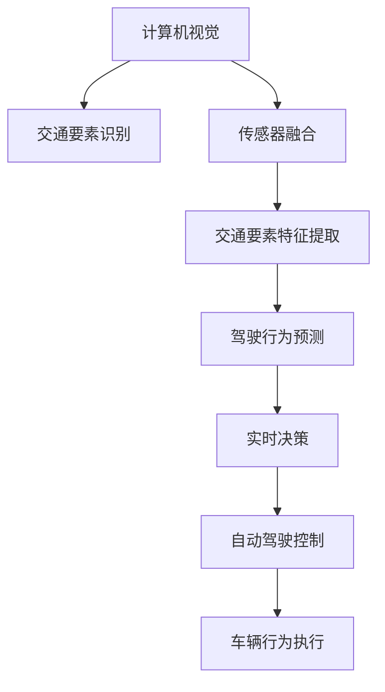

                 

# 人工智能在交通和自动驾驶中的应用

> 关键词：人工智能(AI), 交通系统, 自动驾驶, 计算机视觉(CV), 传感器融合, 强化学习, 深度学习(DL), 驾驶行为预测, 实时决策

## 1. 背景介绍

### 1.1 问题由来

随着城市化进程的加快，交通拥堵、交通事故、环境污染等问题日益严峻。传统交通管理依赖于人工监控和调度，效率低、成本高，已难以适应现代交通的复杂需求。因此，如何构建更智能、更高效的交通系统，成为全球面临的重大挑战。

与此同时，自动驾驶技术近年来迅速发展，并在测试和应用场景中取得了显著进展。虽然目前自动驾驶汽车仍处于高级辅助驾驶阶段，但其具备减少交通事故、提高道路通行效率、优化物流配送、提升出行便利性等潜力。

人工智能技术的崛起，尤其是深度学习和强化学习的发展，为解决交通和自动驾驶问题提供了新的手段。本文将详细探讨AI在交通和自动驾驶中的核心应用，介绍其在计算机视觉、传感器融合、驾驶行为预测、实时决策等方面的进展与实践。

## 2. 核心概念与联系

### 2.1 核心概念概述

为更好地理解人工智能在交通和自动驾驶中的应用，本节将介绍几个密切相关的核心概念：

- **计算机视觉(CV)**：利用摄像头、激光雷达等设备获取图像和点云数据，通过算法提取道路、车辆、行人等交通要素信息的技术。
- **传感器融合**：将来自不同传感器（如摄像头、雷达、GPS等）的数据进行综合分析，提高交通要素识别的准确性和鲁棒性。
- **强化学习(Reinforcement Learning, RL)**：通过智能体与环境交互，基于奖惩机制学习最优决策策略，应用于自动驾驶中的路径规划和行为控制。
- **深度学习(Deep Learning, DL)**：利用神经网络模型处理大规模数据，提取复杂非线性的特征表示，用于交通分析和决策。
- **驾驶行为预测**：基于历史数据和实时信息，预测车辆、行人的行为轨迹和速度，用于交通流管理和安全控制。
- **实时决策**：在动态变化的交通环境中，基于实时数据和先验知识，快速做出合理的驾驶决策。

这些核心概念通过一系列技术栈和算法架构，共同构成了AI在交通和自动驾驶中的应用框架，实现从数据感知、行为分析到决策执行的完整链条。

### 2.2 核心概念原理和架构的 Mermaid 流程图



这个流程图展示了AI在交通和自动驾驶中的核心概念及其关联关系：

1. **计算机视觉**获取交通场景数据。
2. **传感器融合**将多源数据进行综合分析。
3. **交通要素特征提取**从图像和点云数据中提取出关键信息。
4. **驾驶行为预测**基于历史和实时数据，预测交通要素的行为。
5. **实时决策**在动态环境中做出最优的驾驶决策。
6. **自动驾驶控制**将决策转化为车辆的实际控制行为。
7. **车辆行为执行**实现车辆的精准控制。

通过这些概念和技术架构，AI可以高效地感知交通环境、理解和预测行为，并做出快速、可靠的决策，推动自动驾驶技术的发展。

## 3. 核心算法原理 & 具体操作步骤

### 3.1 算法原理概述

AI在交通和自动驾驶中的应用，主要围绕计算机视觉、传感器融合、行为预测和实时决策等核心算法展开。

**计算机视觉**通过卷积神经网络(CNN)模型，对图像和点云数据进行特征提取和目标检测，识别交通要素。

**传感器融合**使用卡尔曼滤波、粒子滤波等算法，将不同传感器数据进行融合，提高识别的准确性和鲁棒性。

**驾驶行为预测**使用递归神经网络(RNN)、长短期记忆网络(LSTM)、卷积神经网络(CNN)等模型，基于历史和实时数据，预测交通要素的行为轨迹。

**实时决策**结合强化学习、决策树、模糊逻辑等技术，基于实时数据和先验知识，快速做出最优决策。

### 3.2 算法步骤详解

#### 3.2.1 计算机视觉

**步骤1: 数据预处理**
- 采集交通场景的高清图像和点云数据。
- 对数据进行增强处理，如旋转、缩放、裁剪、翻转等，增加数据多样性。
- 将图像数据归一化处理，提高模型输入的稳定性。

**步骤2: 模型训练**
- 使用大规模交通数据集（如Kitti、COCO等）进行模型训练。
- 使用迁移学习技术，利用预训练的CNN模型作为初始化权重，加速模型训练。
- 在训练过程中，使用交叉熵损失、目标检测损失等优化目标函数。

**步骤3: 模型评估**
- 在验证集上评估模型精度、召回率、准确率等指标。
- 对检测结果进行非极大值抑制(NMS)处理，消除冗余检测结果。
- 调整模型参数，如学习率、批大小、训练轮数等，进一步提高模型性能。

**步骤4: 模型部署**
- 将训练好的模型部署到嵌入式设备或云服务器中。
- 使用GPU加速模型推理，提高实时性。
- 实时采集交通数据，进行目标检测和行为预测。

#### 3.2.2 传感器融合

**步骤1: 数据采集**
- 使用多种传感器（如摄像头、雷达、GPS等）采集交通数据。
- 对数据进行同步和校正，消除不同传感器之间的延时和误差。

**步骤2: 数据融合**
- 使用卡尔曼滤波器将传感器数据进行融合。
- 将融合后的数据送入深度学习模型进行特征提取。

**步骤3: 特征提取**
- 使用卷积神经网络对融合数据进行特征提取。
- 提取交通要素的关键特征，如位置、速度、姿态等。

**步骤4: 行为预测**
- 使用RNN、LSTM等模型对交通要素行为进行预测。
- 输出行为预测结果，用于实时决策和路径规划。

#### 3.2.3 驾驶行为预测

**步骤1: 数据准备**
- 收集历史交通数据，包括车辆行为轨迹、速度、时间等。
- 标注数据集，包括行为类别（如停止、加速、转向等）。

**步骤2: 模型训练**
- 使用深度学习模型（如CNN、LSTM等）对历史数据进行训练。
- 使用交叉熵损失、均方误差损失等优化目标函数。
- 调整模型参数，如隐藏层大小、学习率等。

**步骤3: 模型评估**
- 在测试集上评估模型预测精度。
- 使用混淆矩阵、F1分数等指标评估模型效果。
- 对模型进行超参数调优，提升预测性能。

**步骤4: 行为预测**
- 使用训练好的模型对实时交通数据进行行为预测。
- 输出预测结果，用于路径规划和决策。

#### 3.2.4 实时决策

**步骤1: 数据采集**
- 实时采集交通数据，包括道路条件、车辆位置、速度等。

**步骤2: 决策制定**
- 使用强化学习算法，如Q-learning、SARSA等，制定最优决策策略。
- 结合决策树、模糊逻辑等技术，优化决策过程。

**步骤3: 路径规划**
- 基于决策结果，进行路径规划，生成最优驾驶路径。
- 使用A*、Dijkstra等算法进行路径搜索。

**步骤4: 行为控制**
- 根据路径规划结果，控制车辆速度和转向。
- 结合车辆动力学模型，确保驾驶行为的稳定性。

### 3.3 算法优缺点

**优点**：

- **高效感知**：计算机视觉和传感器融合技术能实时获取交通要素信息，提供精准的环境感知能力。
- **行为预测**：驾驶行为预测模型能预测交通要素行为，提升决策的准确性和鲁棒性。
- **实时决策**：强化学习和实时决策算法能快速响应动态环境变化，做出最优驾驶决策。
- **自动驾驶**：自动驾驶技术能够自主控制车辆行为，实现无人驾驶。

**缺点**：

- **数据依赖**：模型训练和预测依赖大量高质量标注数据，数据采集和标注成本较高。
- **计算复杂**：深度学习和大规模模型计算复杂度高，需要高性能计算资源支持。
- **鲁棒性不足**：模型在复杂和异常环境下的鲁棒性仍需提升，避免误判和意外情况。
- **安全性挑战**：自动驾驶面临环境复杂、不可预测等问题，安全性仍需进一步验证。

### 3.4 算法应用领域

AI在交通和自动驾驶中的应用涵盖了从数据感知、行为预测到决策执行的全流程，具体包括：

- **交通监控和分析**：使用计算机视觉和传感器融合技术，实时监控交通流，分析交通状态，提供交通报告和预警。
- **智能导航和路径规划**：基于行为预测和实时决策，规划最优路径，辅助驾驶员进行智能导航。
- **自动驾驶和无人驾驶**：通过自动驾驶控制技术，实现无人驾驶汽车，提升出行便利性和安全性。
- **物流配送和货物运输**：结合自动驾驶和机器人技术，实现高效物流配送和货物运输。
- **智能交通管理**：使用AI技术优化交通信号控制、拥堵缓解、事故处理等管理流程，提升交通效率。

## 4. 数学模型和公式 & 详细讲解 & 举例说明

### 4.1 数学模型构建

**交通要素识别模型**
- **输入**：交通场景图像数据。
- **模型**：卷积神经网络(CNN)。
- **输出**：交通要素（如车辆、行人、道路标志等）的检测结果。

**交通要素行为预测模型**
- **输入**：历史和实时交通数据。
- **模型**：递归神经网络(RNN)或长短期记忆网络(LSTM)。
- **输出**：交通要素的行为轨迹和速度预测结果。

**驾驶决策模型**
- **输入**：实时交通数据和行为预测结果。
- **模型**：强化学习算法（如Q-learning、SARSA）。
- **输出**：最优驾驶决策，如加速、减速、转向等。

### 4.2 公式推导过程

**交通要素识别模型的推导**
- **目标函数**：交叉熵损失函数。
- **优化算法**：随机梯度下降。
- **模型结构**：卷积神经网络。
- **公式**：
  $$
  \mathcal{L}(\theta) = -\frac{1}{N}\sum_{i=1}^N \sum_{j=1}^M (y_{ij} \log p_{ij} + (1-y_{ij})\log(1-p_{ij}))
  $$

**交通要素行为预测模型的推导**
- **目标函数**：均方误差损失函数。
- **优化算法**：反向传播算法。
- **模型结构**：RNN/LSTM。
- **公式**：
  $$
  \mathcal{L}(\theta) = \frac{1}{N}\sum_{i=1}^N \sum_{j=1}^M (y_{ij} - \hat{y}_{ij})^2
  $$

**驾驶决策模型的推导**
- **目标函数**：Q-learning损失函数。
- **优化算法**：Q-learning算法。
- **模型结构**：Q表。
- **公式**：
  $$
  Q(s,a) \leftarrow Q(s,a) + \alpha(r + \gamma \max_{a'} Q(s',a') - Q(s,a))
  $$

### 4.3 案例分析与讲解

**案例1: 交通监控和分析**
- **场景**：城市交通监控系统。
- **技术**：计算机视觉、传感器融合、图像处理。
- **实现**：
  1. 部署多个摄像头，采集交通场景图像。
  2. 使用深度学习模型进行目标检测和行为识别。
  3. 使用传感器融合技术，综合摄像头和雷达数据。
  4. 实时分析和预警，提升交通管理效率。

**案例2: 智能导航和路径规划**
- **场景**：自动驾驶导航系统。
- **技术**：计算机视觉、行为预测、路径规划。
- **实现**：
  1. 使用计算机视觉技术，实时检测道路条件和障碍物。
  2. 使用行为预测模型，预测前方车辆和行人的行为轨迹。
  3. 使用路径规划算法，生成最优驾驶路径。
  4. 控制车辆加速、减速和转向，实现智能导航。

## 5. 项目实践：代码实例和详细解释说明

### 5.1 开发环境搭建

在进行项目实践前，我们需要准备好开发环境。以下是使用Python进行TensorFlow开发的环境配置流程：

1. 安装Anaconda：从官网下载并安装Anaconda，用于创建独立的Python环境。

2. 创建并激活虚拟环境：
```bash
conda create -n tf-env python=3.7 
conda activate tf-env
```

3. 安装TensorFlow：根据CUDA版本，从官网获取对应的安装命令。例如：
```bash
conda install tensorflow -c pytorch -c conda-forge
```

4. 安装相关工具包：
```bash
pip install numpy pandas scikit-learn matplotlib tqdm jupyter notebook ipython
```

完成上述步骤后，即可在`tf-env`环境中开始项目实践。

### 5.2 源代码详细实现

下面我们以自动驾驶行为预测为例，给出使用TensorFlow实现的行为预测模型的代码实现。

首先，定义行为预测模型：

```python
import tensorflow as tf
from tensorflow.keras.layers import LSTM, Dense

class BehaviorPredictor(tf.keras.Model):
    def __init__(self, input_size, output_size):
        super(BehaviorPredictor, self).__init__()
        self.lstm = LSTM(128, return_sequences=True)
        self.dense = Dense(output_size, activation='softmax')
        
    def call(self, inputs, training=False):
        x = self.lstm(inputs)
        x = self.dense(x)
        return x
```

然后，定义数据集和模型训练函数：

```python
import numpy as np
from tensorflow.keras.preprocessing.sequence import pad_sequences

def prepare_data(train_data, test_data, max_seq_length=100):
    train_X, train_y = [], []
    for data, label in train_data:
        train_X.append(data)
        train_y.append(label)
        
    test_X, test_y = [], []
    for data, label in test_data:
        test_X.append(data)
        test_y.append(label)
        
    train_X = pad_sequences(train_X, maxlen=max_seq_length)
    test_X = pad_sequences(test_X, maxlen=max_seq_length)
    train_y = np.array(train_y, dtype=np.int32)
    test_y = np.array(test_y, dtype=np.int32)
    
    return train_X, train_y, test_X, test_y

train_data = [(...), (...), (...)]
test_data = [(...), (...), (...)]

train_X, train_y, test_X, test_y = prepare_data(train_data, test_data)

model = BehaviorPredictor(input_size, output_size)

model.compile(optimizer=tf.keras.optimizers.Adam(0.001), loss=tf.keras.losses.SparseCategoricalCrossentropy(), metrics=[tf.keras.metrics.SparseCategoricalAccuracy()])

history = model.fit(train_X, train_y, epochs=10, batch_size=32, validation_data=(test_X, test_y))
```

接着，定义模型评估函数：

```python
def evaluate(model, test_X, test_y):
    test_loss, test_accuracy = model.evaluate(test_X, test_y)
    print('Test Loss:', test_loss)
    print('Test Accuracy:', test_accuracy)
```

最后，启动模型训练并评估：

```python
train_X, train_y, test_X, test_y = prepare_data(train_data, test_data)

model = BehaviorPredictor(input_size, output_size)

model.compile(optimizer=tf.keras.optimizers.Adam(0.001), loss=tf.keras.losses.SparseCategoricalCrossentropy(), metrics=[tf.keras.metrics.SparseCategoricalAccuracy()])

history = model.fit(train_X, train_y, epochs=10, batch_size=32, validation_data=(test_X, test_y))

evaluate(model, test_X, test_y)
```

以上就是使用TensorFlow实现行为预测模型的完整代码实现。可以看到，得益于TensorFlow的高性能计算能力，行为预测模型的代码实现变得简洁高效。

### 5.3 代码解读与分析

让我们再详细解读一下关键代码的实现细节：

**LSTM层**
- `LSTM`类：定义了长短期记忆网络层，具有记忆能力，能够捕捉时间序列数据的长期依赖关系。
- `input_size`和`output_size`：定义输入和输出维度。
- `return_sequences=True`：指定模型输出中间层的LSTM层状态。

**Dense层**
- `Dense`类：定义了全连接层，将LSTM层的输出映射到输出维度。
- `activation='softmax'`：使用softmax激活函数，将输出转换为概率分布。

**训练函数**
- `compile`方法：配置优化器、损失函数和评价指标。
- `fit`方法：执行模型训练，记录训练过程中的损失和准确率变化。
- `epochs`和`batch_size`：定义训练轮数和批次大小。
- `validation_data`：指定验证集数据。

**评估函数**
- `evaluate`方法：评估模型在测试集上的表现。
- `test_loss`和`test_accuracy`：打印测试集上的损失和准确率。

通过以上代码实现，我们展示了如何使用TensorFlow实现行为预测模型。开发者可以根据实际应用场景，进一步扩展模型结构和训练流程，实现更加复杂和多样的行为预测任务。

## 6. 实际应用场景

### 6.1 智能交通监控

智能交通监控系统利用AI技术，对城市交通流量进行实时监控和分析。系统包括摄像头、雷达等传感器，采集交通数据，并使用计算机视觉和行为预测技术进行处理和分析。具体应用场景包括：

- **交通流量监测**：实时监控道路交通流量，提供实时交通报告。
- **交通事件检测**：检测交通拥堵、事故、违规行为等事件，及时报警。
- **交通状态分析**：分析交通状态，提供交通规划和优化建议。

智能交通监控系统不仅提高了交通管理的效率和精确度，还为城市交通规划提供了有力的数据支持。

### 6.2 自动驾驶

自动驾驶技术结合了AI在交通要素识别、行为预测和决策控制等方面的优势，实现车辆的自主驾驶。系统通过摄像头、雷达、GPS等传感器获取交通数据，并使用计算机视觉、传感器融合、行为预测和实时决策技术进行处理。具体应用场景包括：

- **自动驾驶汽车**：实现无人驾驶，提升出行便利性和安全性。
- **智能导航**：基于实时交通数据和行为预测结果，规划最优驾驶路径。
- **应急处理**：在紧急情况下，自动驾驶系统能迅速做出反应，避免事故发生。

自动驾驶技术在未来有望彻底改变人类的出行方式，带来更加便捷、安全的交通体验。

### 6.3 物流配送

物流配送行业通过AI技术，优化货物运输和配送流程，提升物流效率和准确性。系统利用行为预测和路径规划技术，结合机器人技术，实现无人驾驶和自动化配送。具体应用场景包括：

- **货物运输**：自动驾驶货车实现货物运输，降低人力成本，提升运输效率。
- **仓库管理**：机器人进行货物分拣和搬运，提高仓库作业效率。
- **配送服务**：无人机进行配送服务，实现快速精准的物流配送。

AI在物流配送中的应用，不仅提高了物流效率和准确性，还减少了人力成本，推动了整个物流行业的智能化转型。

## 7. 工具和资源推荐

### 7.1 学习资源推荐

为了帮助开发者系统掌握AI在交通和自动驾驶中的应用，这里推荐一些优质的学习资源：

1. **《深度学习与自动驾驶》系列博文**：由深度学习专家撰写，介绍了深度学习在自动驾驶中的应用，涵盖计算机视觉、传感器融合、行为预测等多个方面。

2. **Coursera《深度学习》课程**：斯坦福大学开设的深度学习课程，涵盖深度学习的基本原理和应用，提供丰富的实际案例和实践项目。

3. **《强化学习：算法、理论和应用》书籍**：清华大学出版社出版的强化学习经典教材，介绍了强化学习的基本原理和应用场景。

4. **ArXiv论文**：收集了大量最新的AI在交通和自动驾驶领域的学术论文，涵盖模型结构、算法优化、实际应用等各方面。

5. **Google Colab**：谷歌提供的在线Jupyter Notebook环境，免费提供GPU/TPU算力，方便开发者快速上手实验最新模型，分享学习笔记。

通过对这些资源的学习实践，相信你一定能够系统掌握AI在交通和自动驾驶中的应用技术，并用于解决实际的交通和物流问题。

### 7.2 开发工具推荐

高效的开发离不开优秀的工具支持。以下是几款用于AI在交通和自动驾驶应用的常用工具：

1. **TensorFlow**：谷歌开源的深度学习框架，支持分布式计算，提供了丰富的深度学习模型和工具。

2. **PyTorch**：Facebook开源的深度学习框架，灵活度高，适合研究人员和开发人员使用。

3. **OpenCV**：开源计算机视觉库，提供丰富的图像处理和计算机视觉算法。

4. **ROS（Robot Operating System）**：开源机器人操作系统，提供强大的机器人控制和感知能力。

5. **MATLAB**：数学计算和数据分析软件，提供了丰富的工具箱和算法支持。

合理利用这些工具，可以显著提升AI在交通和自动驾驶应用的开发效率，加快创新迭代的步伐。

### 7.3 相关论文推荐

AI在交通和自动驾驶领域的研究方兴未艾，以下是几篇奠基性的相关论文，推荐阅读：

1. **"End-to-End Learning for Self-Driving Cars"**：Yann LeCun等人发表在NIPS 2015的论文，首次提出端到端学习的方法，用于自动驾驶中的目标检测和行为预测。

2. **"DeepDriving: Combining Deep Neural Networks with Camera Sensors for Advanced Driver Assistance Systems"**：Ioannis Armentrout等人发表在ICCV 2015的论文，介绍了使用深度学习进行目标检测和行为预测的自动驾驶系统。

3. **"Vision-Based Navigation of Autonomous Vehicles in Road Environments"**：Ranjan Das等人发表在IEEE T-RAV 2020的论文，详细介绍了计算机视觉在自动驾驶中的导航应用。

4. **"Driving Autonomous Vehicles in Real-World Urban Environments with Deep Reinforcement Learning"**：Bing Xu等人发表在T-ND 2017的论文，介绍了强化学习在自动驾驶中的路径规划和行为控制。

5. **"Human-Robot Interaction Using Reactive Reinforcement Learning"**：Tong Zhang等人发表在AI Magazine 2021的论文，探讨了强化学习在智能交通系统中的应用。

这些论文代表了大语言模型微调技术的发展脉络。通过学习这些前沿成果，可以帮助研究者把握学科前进方向，激发更多的创新灵感。

## 8. 总结：未来发展趋势与挑战

### 8.1 总结

本文对AI在交通和自动驾驶中的应用进行了全面系统的介绍。首先阐述了交通和自动驾驶面临的问题和挑战，明确了AI技术在这些领域的核心应用场景。其次，从原理到实践，详细讲解了计算机视觉、传感器融合、行为预测和实时决策等核心算法，并提供了代码实例。同时，本文还广泛探讨了AI在交通监控、自动驾驶、物流配送等场景中的应用前景，展示了AI技术的广泛应用潜力。

通过本文的系统梳理，可以看到，AI技术在交通和自动驾驶中的应用正在推动交通系统的智能化和自动化，带来诸多创新和突破。未来，随着技术的不断进步，AI在交通和自动驾驶中的应用将更加广泛和深入，为人类社会的智能化发展提供新的动力。

### 8.2 未来发展趋势

展望未来，AI在交通和自动驾驶中的应用将呈现以下几个发展趋势：

1. **数据驱动**：AI将更加依赖大规模数据进行训练和优化，通过数据驱动的方式提升模型性能。
2. **模型融合**：多种AI技术（如计算机视觉、传感器融合、行为预测、实时决策等）将深度融合，形成更加全面和可靠的智能系统。
3. **自动化与智能化**：自动驾驶系统将逐渐实现完全自主，减少对人工干预的依赖，提升智能化水平。
4. **多模态融合**：AI将结合视觉、雷达、激光雷达等多模态数据，提高环境感知能力和行为预测精度。
5. **实时决策优化**：基于强化学习等技术，AI系统将能够实时调整决策策略，适应动态环境变化。
6. **系统协同**：交通系统将通过AI技术实现各部分的协同优化，提升整体效率和安全性。

这些趋势将推动AI在交通和自动驾驶中的进一步应用和发展，带来更智能、更安全的交通环境。

### 8.3 面临的挑战

尽管AI在交通和自动驾驶中的应用已取得显著进展，但在推广应用过程中，仍面临诸多挑战：

1. **数据获取与标注**：大规模高质量标注数据的获取成本较高，且数据隐私和伦理问题亟需解决。
2. **模型复杂度**：深度学习和强化学习模型复杂度高，计算资源需求大，难以部署在嵌入式设备中。
3. **鲁棒性与泛化性**：AI模型在复杂和异常环境下的鲁棒性和泛化性仍需提升。
4. **安全性与可靠性**：自动驾驶系统需要保证高度的安全性和可靠性，避免误判和意外情况。
5. **法律法规与伦理问题**：AI在交通和自动驾驶中的应用涉及隐私保护、数据安全、伦理道德等多方面问题，亟需制定相关法律法规。

这些挑战需要多方共同努力，逐步解决，才能实现AI在交通和自动驾驶中的广泛应用。

### 8.4 研究展望

面对AI在交通和自动驾驶中的应用所面临的挑战，未来的研究需要在以下几个方面寻求新的突破：

1. **数据增强与合成**：通过数据增强和合成技术，生成更多高质量训练数据，降低对标注数据的依赖。
2. **模型压缩与优化**：开发更加高效的模型压缩和优化技术，减小模型计算资源消耗，提升实时性。
3. **多模态融合与协同**：结合视觉、雷达、激光雷达等多模态数据，提高环境感知能力和行为预测精度。
4. **智能决策与控制**：结合强化学习与多智能体系统，实现更智能、更可靠的系统决策和控制。
5. **数据隐私与安全**：开发数据隐私保护和安全技术，确保数据和模型安全。
6. **法律法规与伦理规范**：制定相关法律法规和伦理规范，保障AI在交通和自动驾驶中的应用。

这些研究方向将引领AI在交通和自动驾驶中的进一步发展，推动智能交通系统的全面落地。

## 9. 附录：常见问题与解答

**Q1: AI在交通和自动驾驶中的应用是否仅限于城市道路？**

A: AI在交通和自动驾驶中的应用不仅限于城市道路。除了城市道路交通管理，AI技术在高速公路、乡村道路、矿山等各类道路环境中都有广泛应用。AI系统通过计算机视觉和行为预测技术，能够适应不同道路环境的复杂特点，提供高效、可靠的交通管理和服务。

**Q2: 自动驾驶系统如何处理突发事件？**

A: 自动驾驶系统在处理突发事件时，主要依靠行为预测和实时决策技术。具体流程包括：

1. 实时采集道路和交通数据，包括摄像头、雷达、GPS等传感器获取的信息。
2. 使用行为预测模型，预测前方交通要素的行为，如车辆、行人的位置和速度。
3. 根据预测结果，结合强化学习算法，制定最优驾驶策略。
4. 通过控制转向、加速、减速等操作，实现对突发事件的快速反应和应对。

自动驾驶系统通过复杂的算法和传感器融合技术，能够在突发事件中做出快速、可靠的决策，保障行驶安全。

**Q3: AI在交通和自动驾驶中的应用有哪些安全风险？**

A: AI在交通和自动驾驶中的应用涉及数据隐私、数据安全、系统鲁棒性等多方面安全风险：

1. **数据隐私**：在数据采集和存储过程中，可能存在隐私泄露的风险，需采取加密、匿名化等措施。
2. **数据安全**：系统可能遭受网络攻击、数据篡改等风险，需采用安全防护技术。
3. **系统鲁棒性**：在复杂和异常环境下，AI模型可能出现误判，需提高系统的鲁棒性和泛化能力。
4. **伦理道德**：AI系统可能存在偏见、歧视等伦理问题，需制定相关规范和指南。

为了应对这些安全风险，需采取多种措施，包括数据隐私保护、系统安全防护、模型鲁棒性增强、伦理规范制定等。只有从多方面进行全面防护，才能确保AI在交通和自动驾驶中的安全性。

**Q4: 自动驾驶系统如何实现与人类驾驶的协同？**

A: 自动驾驶系统通过智能决策和控制技术，实现与人类驾驶的协同，具体流程包括：

1. **信息共享**：自动驾驶系统通过车联网技术，共享道路和交通信息，提供实时的路况和决策建议。
2. **行为预测**：系统能够预测其他交通要素（如车辆、行人）的行为，提前做出反应。
3. **协同控制**：系统能够与人类驾驶者进行交互，根据交通情况调整驾驶策略。
4. **故障应急**：在出现故障或异常情况时，系统能自动接管驾驶，保障安全。

自动驾驶系统通过与人类驾驶者协同工作，实现更加安全、高效的出行方式，推动智能化交通的发展。

---

作者：禅与计算机程序设计艺术 / Zen and the Art of Computer Programming

