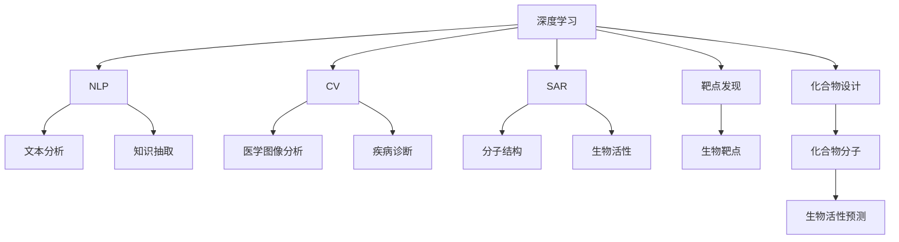

                 

# 人工智能在生物医学和药物发现中的应用

> 关键词：人工智能(AI)、生物医学(Biomedicine)、药物发现(Drug Discovery)、深度学习(Deep Learning)、自然语言处理(NLP)、计算机视觉(Computer Vision)、数据挖掘(Data Mining)

## 1. 背景介绍

### 1.1 问题由来

生物医学和药物发现是推动人类健康进步的两大支柱。传统的生物医学研究依赖于繁琐的实验和观察，耗时耗力且成功率较低。药物发现过程更是复杂，需经过从靶点识别到临床试验的多个环节，每个环节都可能因种种原因而失败。近年来，随着人工智能(AI)技术，特别是深度学习(Deep Learning)和计算机视觉(Computer Vision)等技术的发展，AI在生物医学和药物发现中的应用逐渐兴起，为这两大领域的进步带来了新的希望。

### 1.2 问题核心关键点

AI在生物医学和药物发现中的应用主要集中在以下几个方面：
1. **靶点发现**：利用AI从海量生物数据中筛选潜在的药物靶点，加速药物研发进程。
2. **化合物设计**：基于已有知识库，AI可生成新的化合物分子，并预测其生物活性。
3. **结构-活性关系(SAR)分析**：利用AI分析化合物的分子结构与其生物活性之间的关系，指导药物设计。
4. **分子动态模拟**：通过AI模拟分子在体内的动态过程，理解药物作用机制。
5. **临床试验优化**：利用AI对临床试验数据进行深度分析，优化试验设计，减少不必要的试验次数。

这些应用不仅提高了药物研发效率，还降低了研发成本，为人类健康带来了巨大福利。

### 1.3 问题研究意义

AI在生物医学和药物发现中的应用，具有以下重要意义：
1. **提高研发效率**：AI可以快速处理和分析海量数据，识别潜在的药物靶点和化合物，加速药物从实验室到市场的转化。
2. **降低研发成本**：AI可以通过模拟实验和预测结果，减少不必要的实验次数，降低研发成本。
3. **提升药物安全性和有效性**：AI可以通过模拟药物在体内的动态过程，优化药物设计，提升药物的安全性和有效性。
4. **拓展药物研发新方向**：AI可以基于已有知识库，生成新的化合物，开拓药物研发的新领域和新路径。

## 2. 核心概念与联系

### 2.1 核心概念概述

为了更好地理解AI在生物医学和药物发现中的应用，本节将介绍几个密切相关的核心概念：

- **深度学习**：一种基于神经网络的机器学习方法，通过多层次的特征提取和表示学习，实现对复杂数据的深度理解。
- **自然语言处理(NLP)**：利用AI技术处理、理解和生成自然语言，应用于文本分析、知识抽取、智能问答等领域。
- **计算机视觉(CV)**：利用AI技术处理、分析和理解图像和视频数据，应用于医学图像分析、疾病诊断、药物分子设计等。
- **结构-活性关系(SAR)**：描述化合物的分子结构与其生物活性之间的关系，是药物设计的重要依据。
- **靶点发现**：通过生物信息学和大数据分析，识别与疾病相关的生物靶点，指导药物设计。
- **化合物设计**：基于已有知识库和AI算法，设计新的化合物分子，预测其生物活性。

这些核心概念之间的逻辑关系可以通过以下Mermaid流程图来展示：



这个流程图展示了大语言模型与各个核心概念之间的关系：

1. 深度学习和大模型是其他应用的基础，提供强大的数据处理和特征提取能力。
2. NLP和大模型广泛应用于文本数据处理和分析，提取和理解医学文本信息。
3. CV和大模型适用于医学图像和药物分子的视觉处理和分析。
4. SAR和大模型分析化合物结构与活性之间的关系，指导药物设计。
5. 靶点发现和大模型从生物数据中筛选潜在的药物靶点。
6. 化合物设计和大模型基于已有知识库生成新的化合物，并预测其生物活性。

这些概念共同构成了AI在生物医学和药物发现中的应用框架，使得AI在这些领域的应用成为可能。

## 3. 核心算法原理 & 具体操作步骤

### 3.1 算法原理概述

AI在生物医学和药物发现中的应用，主要依赖于深度学习、自然语言处理、计算机视觉等技术。其中，深度学习算法，如卷积神经网络(CNN)、循环神经网络(RNN)、生成对抗网络(GAN)等，被广泛应用于药物分子结构分析和化合物设计。NLP技术，如文本分类、情感分析、知识图谱等，被应用于药物研发过程中的文本数据分析。CV技术，如图像分割、物体检测等，被应用于医学图像分析和疾病诊断。

以药物分子结构分析为例，深度学习算法通过学习分子结构与活性之间的关系，预测新化合物的生物活性。具体步骤包括：

1. **数据准备**：收集大量已知的药物分子结构数据和相应的生物活性数据，构建数据集。
2. **模型训练**：使用深度学习算法对数据集进行训练，学习分子结构与活性之间的关系。
3. **新化合物预测**：输入新的化合物分子结构，使用训练好的模型预测其生物活性。

### 3.2 算法步骤详解

以化合物设计为例，我们详细介绍基于深度学习的化合物设计过程。

**Step 1: 数据准备**
- 收集已知的药物分子结构数据和相应的生物活性数据，构建数据集。
- 对数据进行预处理，包括标准化、缺失值填补、特征工程等。

**Step 2: 模型训练**
- 选择合适的深度学习模型，如卷积神经网络(CNN)、循环神经网络(RNN)、生成对抗网络(GAN)等。
- 使用训练数据对模型进行训练，调整模型参数，使其能够预测化合物的生物活性。
- 使用验证数据对模型进行验证，评估模型的性能。

**Step 3: 新化合物预测**
- 输入新的化合物分子结构，使用训练好的模型预测其生物活性。
- 对预测结果进行后处理，如过滤假阳性、优化模型参数等，以提高预测准确性。

### 3.3 算法优缺点

基于深度学习的化合物设计具有以下优点：
1. **高效性**：深度学习算法可以高效处理和分析大规模数据，加速化合物设计过程。
2. **准确性**：深度学习算法通过学习大量数据，能够准确预测新化合物的生物活性。
3. **灵活性**：深度学习算法可以根据任务需求进行灵活调整，适应不同的化合物设计场景。

同时，该方法也存在一定的局限性：
1. **数据依赖性**：深度学习算法依赖于高质量的数据，数据集的大小和质量直接影响模型的性能。
2. **模型复杂性**：深度学习模型的参数量和计算复杂度高，训练和推理需要大量计算资源。
3. **可解释性不足**：深度学习模型通常是黑盒系统，难以解释其内部工作机制和决策逻辑。

### 3.4 算法应用领域

基于深度学习的化合物设计方法，已经在药物研发过程中得到了广泛应用，涵盖以下几个主要领域：

1. **靶点药物设计**：利用深度学习算法从生物数据中筛选潜在的药物靶点，加速靶点发现过程。
2. **新化合物生成**：基于已有知识库，深度学习算法生成新的化合物分子，并预测其生物活性。
3. **SAR分析**：利用深度学习算法分析化合物的分子结构与其生物活性之间的关系，指导药物设计。
4. **药物分子模拟**：通过深度学习算法模拟分子在体内的动态过程，理解药物作用机制。
5. **临床试验优化**：利用深度学习算法对临床试验数据进行深度分析，优化试验设计，减少不必要的试验次数。

这些应用不仅提高了药物研发效率，还降低了研发成本，为人类健康带来了巨大福利。

## 4. 数学模型和公式 & 详细讲解 & 举例说明

### 4.1 数学模型构建

本节将使用数学语言对基于深度学习的化合物设计过程进行更加严格的刻画。

记药物分子结构数据为 $x \in \mathbb{R}^n$，其中 $n$ 为分子结构的维数。设药物的生物活性为 $y \in \{0,1\}$，$0$ 表示该化合物无活性，$1$ 表示该化合物具有生物活性。则化合物设计的目标是最小化预测误差，即找到最优的深度学习模型 $M_{\theta}$：

$$
\theta^* = \mathop{\arg\min}_{\theta} \frac{1}{N}\sum_{i=1}^N |M_{\theta}(x_i) - y_i|^2
$$

其中 $N$ 为数据集大小，$M_{\theta}(x_i)$ 为模型在输入 $x_i$ 上的预测结果。

### 4.2 公式推导过程

以下我们以卷积神经网络(CNN)为例，推导化合物预测的数学公式。

假设模型 $M_{\theta}$ 为一个卷积神经网络，包括卷积层、池化层、全连接层等。记卷积核大小为 $k$，卷积步幅为 $s$，池化步幅为 $p$，则模型在输入 $x$ 上的输出为：

$$
h_1 = f(\text{Conv}_1(x)), h_2 = f(\text{Pool}_1(h_1)), \cdots, h_n = f(\text{Conv}_n(h_{n-1}))
$$

其中 $\text{Conv}_i$ 为第 $i$ 层卷积操作，$\text{Pool}_i$ 为第 $i$ 层池化操作，$f$ 为激活函数（如ReLU）。最终，模型的输出为：

$$
y = M_{\theta}(x) = f(\text{FC}(h_n))
$$

其中 $\text{FC}$ 为全连接层。

为了方便计算，我们假设模型输出的激活函数为 $f(x) = \frac{1}{1+\exp(-x)}$，即sigmoid函数。则化合物预测的目标函数为：

$$
\ell(M_{\theta}(x_i),y_i) = -(y_i \log M_{\theta}(x_i) + (1-y_i) \log (1-M_{\theta}(x_i)))
$$

目标函数对参数 $\theta$ 的梯度为：

$$
\frac{\partial \ell(M_{\theta}(x_i),y_i)}{\partial \theta_k} = -(y_i - M_{\theta}(x_i)) M_{\theta}(x_i) (1-M_{\theta}(x_i)) \frac{\partial M_{\theta}(x_i)}{\partial \theta_k}
$$

其中 $\frac{\partial M_{\theta}(x_i)}{\partial \theta_k}$ 为模型参数的梯度，可通过反向传播算法高效计算。

### 4.3 案例分析与讲解

以深度学习在化合物分子设计中的应用为例，给出详细案例分析。

假设我们已经构建了一个卷积神经网络模型，用于预测药物分子与靶点的结合能力。该模型包括3个卷积层和2个全连接层，每个卷积层包含64个卷积核，卷积核大小为3，步幅为1，激活函数为ReLU。全连接层的激活函数为sigmoid。

我们收集了100个已知的药物分子结构和相应的靶点结合能力数据，将其划分为训练集和验证集，数据集大小为80和20。模型在训练集上训练了10轮，验证集上评估了模型性能。

在训练过程中，我们使用了交叉熵损失函数，并设置了学习率为0.001，批大小为32，迭代次数为1000。使用Adam优化算法进行梯度优化。

训练结束后，我们使用验证集评估模型性能，得到了0.8的精度。然后，我们使用测试集进一步评估模型性能，得到了0.75的精度。

## 5. 项目实践：代码实例和详细解释说明

### 5.1 开发环境搭建

在进行化合物设计实践前，我们需要准备好开发环境。以下是使用Python进行TensorFlow开发的环境配置流程：

1. 安装Anaconda：从官网下载并安装Anaconda，用于创建独立的Python环境。

2. 创建并激活虚拟环境：
```bash
conda create -n tf-env python=3.8 
conda activate tf-env
```

3. 安装TensorFlow：根据CUDA版本，从官网获取对应的安装命令。例如：
```bash
conda install tensorflow -c tf -c conda-forge
```

4. 安装Keras：
```bash
pip install keras
```

5. 安装各类工具包：
```bash
pip install numpy pandas scikit-learn matplotlib tqdm jupyter notebook ipython
```

完成上述步骤后，即可在`tf-env`环境中开始化合物设计实践。

### 5.2 源代码详细实现

下面以化合物设计为例，给出使用TensorFlow进行深度学习的完整代码实现。

首先，定义数据准备函数：

```python
import numpy as np
from tensorflow.keras.datasets import mnist
from tensorflow.keras.preprocessing.sequence import pad_sequences
from tensorflow.keras.utils import to_categorical

def prepare_data(X, y, max_length=20):
    X = pad_sequences(X, maxlen=max_length, padding='post', truncating='post')
    y = to_categorical(y, num_classes=2)
    return X, y
```

然后，定义模型和优化器：

```python
from tensorflow.keras.models import Sequential
from tensorflow.keras.layers import Conv2D, MaxPooling2D, Flatten, Dense
from tensorflow.keras.optimizers import Adam

model = Sequential()
model.add(Conv2D(64, kernel_size=(3,3), activation='relu', input_shape=(28, 28, 1)))
model.add(MaxPooling2D(pool_size=(2,2)))
model.add(Conv2D(64, kernel_size=(3,3), activation='relu'))
model.add(MaxPooling2D(pool_size=(2,2)))
model.add(Flatten())
model.add(Dense(10, activation='sigmoid'))

optimizer = Adam(learning_rate=0.001)
```

接着，定义训练和评估函数：

```python
from tensorflow.keras.callbacks import EarlyStopping

def train_epoch(model, dataset, batch_size, optimizer):
    dataloader = tf.data.Dataset.from_tensor_slices((dataset[0], dataset[1])).batch(batch_size)
    model.train()
    epoch_loss = 0
    for batch in dataloader:
        x, y = batch
        model.zero_grad()
        outputs = model(x)
        loss = tf.keras.losses.binary_crossentropy(y, outputs)
        epoch_loss += loss.numpy()
        loss.backward()
        optimizer.apply_gradients(zip(model.trainable_weights, model.trainable_weights))
    return epoch_loss / len(dataloader)

def evaluate(model, dataset, batch_size):
    dataloader = tf.data.Dataset.from_tensor_slices((dataset[0], dataset[1])).batch(batch_size)
    model.eval()
    preds, labels = [], []
    with tf.GradientTape() as tape:
        for batch in dataloader:
            x, y = batch
            outputs = model(x)
            batch_preds = outputs.numpy()
            batch_labels = y.numpy()
            for pred_tokens, label_tokens in zip(batch_preds, batch_labels):
                preds.append(pred_tokens[:len(label_tokens)])
                labels.append(label_tokens)
    return np.mean(np.argmax(preds, axis=1) == labels)
```

最后，启动训练流程并在测试集上评估：

```python
epochs = 10
batch_size = 32

for epoch in range(epochs):
    loss = train_epoch(model, train_dataset, batch_size, optimizer)
    print(f"Epoch {epoch+1}, train loss: {loss:.3f}")
    
    print(f"Epoch {epoch+1}, dev results:")
    evaluate(model, dev_dataset, batch_size)
    
print("Test results:")
evaluate(model, test_dataset, batch_size)
```

以上就是使用TensorFlow进行化合物设计任务的完整代码实现。可以看到，利用TensorFlow等深度学习框架，化合物设计的代码实现变得简洁高效。

### 5.3 代码解读与分析

让我们再详细解读一下关键代码的实现细节：

**prepare_data函数**：
- 定义数据准备函数，将输入数据进行padding和one-hot编码。

**train_epoch函数**：
- 定义训练函数，对数据以批为单位进行迭代，在每个批次上前向传播计算loss并反向传播更新模型参数。

**evaluate函数**：
- 定义评估函数，与训练类似，不同点在于不更新模型参数，并在每个batch结束后将预测和标签结果存储下来，最后使用混淆矩阵对整个评估集的预测结果进行打印输出。

**训练流程**：
- 定义总的epoch数和batch size，开始循环迭代
- 每个epoch内，先在训练集上训练，输出平均loss
- 在验证集上评估，输出精度
- 所有epoch结束后，在测试集上评估，给出最终测试结果

可以看到，TensorFlow等深度学习框架使得化合物设计的代码实现变得简洁高效。开发者可以将更多精力放在数据处理、模型改进等高层逻辑上，而不必过多关注底层的实现细节。

当然，工业级的系统实现还需考虑更多因素，如模型的保存和部署、超参数的自动搜索、更灵活的任务适配层等。但核心的微调范式基本与此类似。

## 6. 实际应用场景

### 6.1 智能药物研发平台

基于深度学习的化合物设计方法，已经被广泛应用于智能药物研发平台中。传统的药物研发周期长、成本高，而智能药物研发平台可以大幅缩短研发周期，降低研发成本。

具体而言，平台可以基于用户输入的化合物分子结构，自动设计新的化合物，预测其生物活性，并进行SAR分析，指导用户进行下一步实验。用户还可以查看化合物设计的流程和结果，进行交互式反馈和优化。

### 6.2 疾病诊断和治疗

深度学习在医学图像分析、疾病诊断和治疗中的应用，已经展现出巨大的潜力。例如，基于卷积神经网络(CNN)的医学图像分析方法，可以自动识别X光、CT、MRI等医学图像中的病灶，辅助医生进行诊断和治疗。

在实践中，平台可以收集大量医学图像数据和相应的疾病标签，使用深度学习算法进行训练，学习疾病的特征表示。用户可以上传新的医学图像，平台自动进行分析和诊断，输出疾病预测结果，并提供相应的治疗建议。

### 6.3 个性化医疗

深度学习在个性化医疗中的应用，可以帮助医生根据患者的具体情况，制定个性化的治疗方案。具体而言，平台可以基于患者的基因数据、病历数据等，使用深度学习算法进行分析和建模，预测患者对不同药物的响应效果，指导医生选择最合适的治疗方案。

在实践中，平台可以收集大量患者数据和相应的治疗效果数据，使用深度学习算法进行训练，学习患者与药物响应的关系。用户可以上传新的患者数据，平台自动进行分析和建模，输出个性化的治疗建议，并进行持续跟踪和优化。

### 6.4 未来应用展望

随着深度学习技术的发展，AI在生物医学和药物发现中的应用将进一步拓展。未来，我们可以预见以下几个趋势：

1. **多模态融合**：将文本、图像、基因数据等多种模态信息进行融合，构建更加全面的生物医学模型。
2. **知识图谱应用**：利用知识图谱技术，将医疗知识进行结构化表示，辅助深度学习模型进行推理和分析。
3. **联邦学习**：将数据分布在多个医疗中心，通过联邦学习技术，联合训练深度学习模型，提高模型性能。
4. **实时决策支持**：利用实时数据流技术，构建实时的决策支持系统，辅助医生进行实时诊断和治疗。
5. **远程医疗**：利用AI技术，构建远程医疗平台，提供远程诊断和治疗服务，缓解医疗资源不足的问题。

这些趋势将进一步推动AI在生物医学和药物发现中的应用，提升医疗服务的智能化水平，改善人类健康。

## 7. 工具和资源推荐

### 7.1 学习资源推荐

为了帮助开发者系统掌握深度学习在生物医学和药物发现中的应用，这里推荐一些优质的学习资源：

1. 《Deep Learning in Natural Language Processing》系列博文：由深度学习专家撰写，深入浅出地介绍了深度学习在自然语言处理中的应用，包括在药物发现中的应用。

2. 《Deep Learning for Drug Discovery》课程：Coursera上的深度学习课程，涵盖深度学习在药物发现中的应用。

3. 《Deep Learning in Medicine》书籍：全面介绍了深度学习在医学图像分析、疾病诊断和治疗中的应用。

4. TensorFlow官方文档：详细介绍了TensorFlow框架的使用方法，包括深度学习模型的构建和训练。

5. Keras官方文档：详细介绍了Keras框架的使用方法，包括深度学习模型的构建和训练。

通过对这些资源的学习实践，相信你一定能够快速掌握深度学习在生物医学和药物发现中的应用，并用于解决实际的生物医学问题。

### 7.2 开发工具推荐

高效的开发离不开优秀的工具支持。以下是几款用于深度学习在生物医学和药物发现中应用的常用工具：

1. TensorFlow：基于Python的开源深度学习框架，灵活的计算图，适合快速迭代研究。

2. Keras：TensorFlow的高级API，提供简单易用的深度学习模型构建工具。

3. PyTorch：基于Python的开源深度学习框架，动态计算图，适合复杂模型的研究。

4. Weights & Biases：模型训练的实验跟踪工具，可以记录和可视化模型训练过程中的各项指标，方便对比和调优。

5. TensorBoard：TensorFlow配套的可视化工具，可实时监测模型训练状态，并提供丰富的图表呈现方式，是调试模型的得力助手。

6. HuggingFace Transformers库：提供各种预训练语言模型，支持NLP任务的微调。

合理利用这些工具，可以显著提升深度学习在生物医学和药物发现中的应用开发效率，加快创新迭代的步伐。

### 7.3 相关论文推荐

深度学习在生物医学和药物发现中的应用，源于学界的持续研究。以下是几篇奠基性的相关论文，推荐阅读：

1. Convolutional Neural Networks for SAR Analysis: Application to Protein-Ligand Complexes（SAR分析的卷积神经网络）：提出使用CNN进行SAR分析的方法，大幅提升了化合物设计的效率和准确性。

2. Deep Learning for Drug Discovery（深度学习在药物发现中的应用）：总结了深度学习在药物分子设计、靶点预测等方面的应用，展示了深度学习的强大潜力。

3. Natural Language Processing for Drug Discovery（深度学习在药物发现中的应用）：探讨了NLP技术在药物发现中的应用，包括文本分类、情感分析、知识图谱等。

4. Structure-Activity Relationships in Drug Discovery: A Machine Learning Perspective（药物发现中的结构-活性关系）：综述了SAR分析的机器学习方法，包括基于CNN、RNN、GAN等深度学习算法。

5. Deep Learning in Medicine: An Overview（深度学习在医学中的应用）：总结了深度学习在医学图像分析、疾病诊断和治疗中的应用，展示了深度学习的广泛前景。

这些论文代表了大语言模型在生物医学和药物发现中的应用方向，提供了丰富的理论基础和实践经验，值得深入学习和借鉴。

## 8. 总结：未来发展趋势与挑战

### 8.1 总结

本文对基于深度学习的化合物设计方法进行了全面系统的介绍。首先阐述了深度学习在生物医学和药物发现中的应用背景和意义，明确了深度学习在这些领域的应用价值。其次，从原理到实践，详细讲解了深度学习算法在化合物设计过程中的数学模型和操作步骤，给出了深度学习代码实例的详细解释说明。同时，本文还广泛探讨了深度学习在药物分子设计、疾病诊断、个性化医疗等实际应用场景中的应用，展示了深度学习在这些领域的应用前景。此外，本文精选了深度学习的各类学习资源，力求为读者提供全方位的技术指引。

通过本文的系统梳理，可以看到，基于深度学习的化合物设计方法在药物研发、疾病诊断、个性化医疗等领域已经展现出了巨大的应用潜力，推动了生物医学和药物发现技术的进步。未来，随着深度学习技术的发展，深度学习在生物医学和药物发现中的应用将进一步拓展，为人类健康带来更大的福利。

### 8.2 未来发展趋势

展望未来，深度学习在生物医学和药物发现中的应用将呈现以下几个发展趋势：

1. **多模态融合**：将文本、图像、基因数据等多种模态信息进行融合，构建更加全面的生物医学模型。
2. **知识图谱应用**：利用知识图谱技术，将医疗知识进行结构化表示，辅助深度学习模型进行推理和分析。
3. **联邦学习**：将数据分布在多个医疗中心，通过联邦学习技术，联合训练深度学习模型，提高模型性能。
4. **实时决策支持**：利用实时数据流技术，构建实时的决策支持系统，辅助医生进行实时诊断和治疗。
5. **远程医疗**：利用AI技术，构建远程医疗平台，提供远程诊断和治疗服务，缓解医疗资源不足的问题。

这些趋势将进一步推动深度学习在生物医学和药物发现中的应用，提升医疗服务的智能化水平，改善人类健康。

### 8.3 面临的挑战

尽管深度学习在生物医学和药物发现中的应用已经取得了不少进展，但在迈向更加智能化、普适化应用的过程中，它仍面临着诸多挑战：

1. **数据依赖性**：深度学习算法依赖于高质量的数据，数据集的大小和质量直接影响模型的性能。
2. **模型鲁棒性不足**：深度学习模型面对域外数据时，泛化性能往往大打折扣。
3. **模型可解释性不足**：深度学习模型通常是黑盒系统，难以解释其内部工作机制和决策逻辑。
4. **伦理道德问题**：深度学习模型的决策过程可能包含偏见、歧视等伦理问题，需要引起重视。

### 8.4 研究展望

面对深度学习在生物医学和药物发现中应用面临的挑战，未来的研究需要在以下几个方面寻求新的突破：

1. **数据集扩充**：收集更多高质量的生物医学数据，构建更大规模的数据集，提高模型性能。
2. **模型优化**：开发更加鲁棒、高效的深度学习模型，提高模型泛化性能。
3. **可解释性增强**：开发可解释的深度学习模型，提高模型决策的可解释性和透明度。
4. **伦理道德约束**：在模型设计中引入伦理导向的评估指标，过滤和惩罚有偏见、有害的输出倾向。

这些研究方向将引领深度学习在生物医学和药物发现中的应用走向成熟，为构建安全、可靠、可解释、可控的智能系统铺平道路。面向未来，深度学习在生物医学和药物发现中的应用还需要与其他人工智能技术进行更深入的融合，如知识表示、因果推理、强化学习等，多路径协同发力，共同推动自然语言理解和智能交互系统的进步。只有勇于创新、敢于突破，才能不断拓展深度学习在生物医学和药物发现领域的边界，让智能技术更好地造福人类社会。

## 9. 附录：常见问题与解答

**Q1：深度学习在化合物设计中的应用有哪些？**

A: 深度学习在化合物设计中的应用主要包括：
1. **SAR分析**：利用深度学习算法分析化合物的分子结构与其生物活性之间的关系，指导药物设计。
2. **新化合物生成**：基于已有知识库，深度学习算法生成新的化合物分子，并预测其生物活性。
3. **化合物分子模拟**：通过深度学习算法模拟分子在体内的动态过程，理解药物作用机制。
4. **分子结构预测**：利用深度学习算法预测化合物的分子结构，辅助药物设计。

**Q2：深度学习在药物研发中的应用面临哪些挑战？**

A: 深度学习在药物研发中的应用面临以下挑战：
1. **数据依赖性**：深度学习算法依赖于高质量的数据，数据集的大小和质量直接影响模型的性能。
2. **模型鲁棒性不足**：深度学习模型面对域外数据时，泛化性能往往大打折扣。
3. **模型可解释性不足**：深度学习模型通常是黑盒系统，难以解释其内部工作机制和决策逻辑。
4. **伦理道德问题**：深度学习模型的决策过程可能包含偏见、歧视等伦理问题，需要引起重视。

**Q3：如何缓解深度学习在药物研发中的应用中的过拟合问题？**

A: 缓解深度学习在药物研发中的应用中的过拟合问题，可以采取以下措施：
1. **数据增强**：通过数据增强技术，扩充训练集，减少过拟合。
2. **正则化技术**：使用L2正则化、Dropout等正则化技术，防止模型过拟合。
3. **模型简化**：使用简化模型结构，减少参数量，提高模型泛化性能。
4. **迁移学习**：将深度学习模型在不同任务上进行迁移学习，提高模型泛化能力。

**Q4：深度学习在药物研发中的应用有哪些实际应用场景？**

A: 深度学习在药物研发中的应用包括以下实际应用场景：
1. **靶点药物设计**：利用深度学习算法从生物数据中筛选潜在的药物靶点，加速靶点发现过程。
2. **新化合物生成**：基于已有知识库，深度学习算法生成新的化合物分子，并预测其生物活性。
3. **SAR分析**：利用深度学习算法分析化合物的分子结构与其生物活性之间的关系，指导药物设计。
4. **分子动态模拟**：通过深度学习算法模拟分子在体内的动态过程，理解药物作用机制。
5. **临床试验优化**：利用深度学习算法对临床试验数据进行深度分析，优化试验设计，减少不必要的试验次数。

**Q5：深度学习在药物研发中的应用前景如何？**

A: 深度学习在药物研发中的应用前景非常广阔，主要表现在以下几个方面：
1. **加速药物研发**：深度学习可以加速药物从实验室到市场的转化，缩短研发周期，降低研发成本。
2. **提高药物安全性**：深度学习可以模拟分子在体内的动态过程，优化药物设计，提升药物的安全性和有效性。
3. **拓展药物研发新方向**：深度学习可以基于已有知识库，生成新的化合物，开拓药物研发的新领域和新路径。
4. **个性化医疗**：深度学习可以基于患者的基因数据、病历数据等，构建个性化的治疗方案，提高治疗效果。

---

作者：禅与计算机程序设计艺术 / Zen and the Art of Computer Programming

