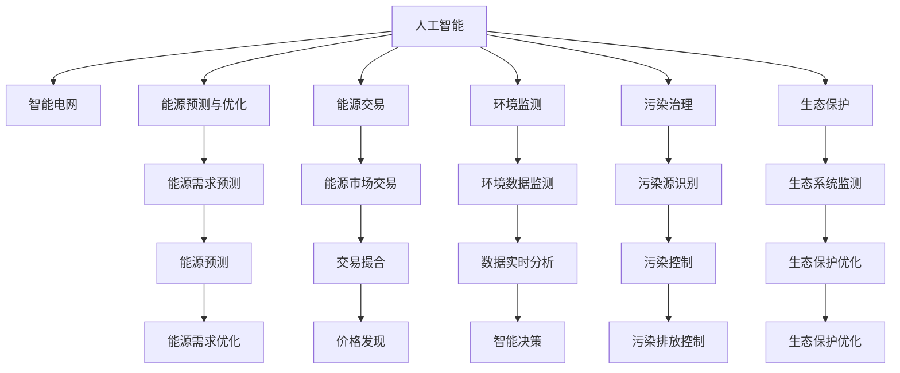

                 

# 人工智能在能源和环境中的应用

> 关键词：人工智能(AI)、能源管理、环境监测、智能电网、能源交易、可再生能源、大数据、深度学习、机器学习、绿色技术、可持续发展

## 1. 背景介绍

### 1.1 问题由来
在全球气候变化和能源危机的双重压力下，能源和环境领域亟需科技创新驱动的解决方案。人工智能（AI）技术作为当前科技领域的核心力量，正在深度融入能源和环境的各个环节，提供了智能化、高效化、精细化的解决方案，助力实现能源的可持续发展和环境的长期保护。AI技术不仅在能源的生成、传输、存储和消费等环节发挥着重要作用，还广泛应用于环境监测、智能电网、能源交易等领域，推动了传统能源向绿色能源的转型，促进了环境治理的现代化。

### 1.2 问题核心关键点
- 能源：AI在能源领域的应用包括智能电网、能源预测与优化、能源交易等多个方面，通过数据驱动的决策支持、智能控制与优化，提高能源利用效率，促进可再生能源的发展。
- 环境：AI在环境监测、污染治理、生态保护等领域的应用，通过数据分析、智能监控与预警、自动决策等技术，提升环境治理的精度和效率，助力实现可持续发展目标。
- 集成：AI技术需要与多种其他技术集成应用，如物联网、大数据、区块链、机器人等，才能形成更强大的能力，解决复杂的能源与环境问题。

## 2. 核心概念与联系

### 2.1 核心概念概述

为了更好地理解AI在能源和环境中的应用，本节将介绍几个关键概念及其相互联系：

- 人工智能(AI)：利用机器学习、深度学习等技术，使计算机系统能够模拟人类智能行为，进行感知、学习、推理、决策等复杂任务。
- 智能电网：通过广泛应用AI技术，实现电力系统的智能化管理，提高电力供应效率和可靠性。
- 能源预测与优化：利用AI进行能源需求预测和优化，平衡供需，提升能源利用率。
- 能源交易：通过AI实现能源市场的自动撮合、风险控制、价格发现等功能，促进能源的公平交易。
- 环境监测：利用AI技术对环境数据进行实时监测与分析，提升环境治理的精度和效率。
- 污染治理：利用AI进行环境污染源识别、排放控制与优化，推动环境保护。
- 生态保护：通过AI对生态系统进行动态监测与分析，提升生态保护效果。
- 大数据：AI处理海量数据的能力，为能源与环境管理提供了强有力的支持。

这些核心概念之间的逻辑关系可以通过以下Mermaid流程图来展示：



这个流程图展示了大语言模型的核心概念及其之间的关系：

1. 人工智能通过多种方式与能源和环境领域进行深度融合，推动其智能化发展。
2. 智能电网、能源预测与优化、能源交易等具体应用场景，都是人工智能在能源领域的典型应用。
3. 环境监测、污染治理、生态保护等则是人工智能在环境领域的应用。
4. 大数据作为AI处理海量数据的基础设施，为上述应用提供了技术支持。

这些概念共同构成了AI在能源和环境领域的广泛应用框架，使其能够在能源管理和环境保护中发挥重要作用。

## 3. 核心算法原理 & 具体操作步骤
### 3.1 算法原理概述

AI在能源和环境中的应用，本质上是通过数据驱动、智能决策的方式，优化能源利用和环境保护的过程。其核心算法原理包括以下几个方面：

- 数据预处理：收集、清洗、处理能源和环境相关的数据，如电力负荷数据、气象数据、污染排放数据等。
- 特征工程：从原始数据中提取有意义的特征，如时间序列、空间分布、环境指标等。
- 模型构建：选择合适的机器学习或深度学习模型，如随机森林、支持向量机、卷积神经网络、循环神经网络等。
- 模型训练与优化：通过大量的训练数据，训练和优化模型参数，提升模型预测精度。
- 模型评估与部署：在验证集和测试集上评估模型性能，部署到实际应用场景中。

### 3.2 算法步骤详解

AI在能源和环境中的应用，通常遵循以下步骤：

**Step 1: 数据准备**
- 收集能源和环境领域的相关数据，确保数据的质量和完整性。
- 对数据进行清洗和预处理，去除噪声和异常值，确保数据的一致性。
- 划分训练集、验证集和测试集，确保模型评估的客观性。

**Step 2: 特征提取**
- 使用特征工程技术，从原始数据中提取有意义的特征，如时间序列、空间分布、环境指标等。
- 对特征进行归一化、标准化等预处理，提高模型的稳定性和收敛性。
- 引入新的特征变量，如能源价格、气候变化等，提高模型的预测精度。

**Step 3: 模型训练**
- 选择合适的机器学习或深度学习模型，如随机森林、支持向量机、卷积神经网络、循环神经网络等。
- 使用训练集数据，训练模型，调整模型参数，优化模型结构。
- 在验证集上评估模型性能，根据评估结果进行模型调优。

**Step 4: 模型评估与部署**
- 在测试集上评估模型的最终性能，确保模型具备较高的预测精度。
- 将模型部署到实际应用场景中，如智能电网、能源交易系统、环境监测系统等。
- 实时监测模型性能，根据实际反馈进行调整和优化。

### 3.3 算法优缺点

AI在能源和环境中的应用，具有以下优点：

- 高精度预测：利用AI模型，可以对能源需求和环境数据进行高精度预测，优化能源配置和环境保护策略。
- 自动化决策：AI模型可以实现自动化决策，提升能源和环境管理的效率和准确性。
- 实时响应：AI模型可以实时监测和响应能源和环境变化，提供动态决策支持。

同时，该方法也存在一定的局限性：

- 数据依赖：AI模型需要大量高质量的数据作为支持，数据缺失或不完整会影响模型的性能。
- 模型复杂度：复杂的模型可能带来较高的计算成本和资源消耗。
- 模型鲁棒性：AI模型对输入数据的鲁棒性较低，异常数据可能影响模型的输出。

尽管存在这些局限性，但就目前而言，AI在能源和环境中的应用仍是大数据和智能决策的强大工具，通过不断优化模型和改进数据处理方式，可以充分发挥其优势，克服局限性。

### 3.4 算法应用领域

AI在能源和环境中的应用，已经涵盖了以下几个主要领域：

- 智能电网：通过AI实现电力负荷预测、电网调度优化、故障诊断与预测等功能，提升电力系统的可靠性和效率。
- 能源交易：利用AI进行市场预测、价格发现、交易优化等功能，实现能源市场的公平交易。
- 可再生能源：通过AI优化可再生能源的预测与调度，提高能源利用效率，推动可再生能源的发展。
- 环境监测：利用AI进行环境数据的实时监测与分析，提升环境治理的精度和效率。
- 污染治理：利用AI进行污染源识别、排放控制与优化，推动环境保护。
- 生态保护：通过AI对生态系统进行动态监测与分析，提升生态保护效果。

除了上述这些主要领域外，AI在能源和环境中的应用还在不断扩展，如智能家居、绿色交通、智慧农业等，未来有望在更多场景中得到广泛应用。

## 4. 数学模型和公式 & 详细讲解  
### 4.1 数学模型构建

本节将使用数学语言对AI在能源和环境中的应用进行更加严格的刻画。

假设收集到能源和环境领域的相关数据，记为 $\mathbf{X} \in \mathbb{R}^{n \times d}$，其中 $n$ 为样本数量，$d$ 为特征维度。假设任务为能源需求预测，将预测结果记为 $\hat{\mathbf{Y}} \in \mathbb{R}^{n \times k}$，其中 $k$ 为预测值数量。定义预测误差为 $\mathbf{E} = \mathbf{Y} - \hat{\mathbf{Y}}$，其中 $\mathbf{Y} \in \mathbb{R}^{n \times k}$ 为真实标签。

为了最小化预测误差，我们定义损失函数 $\mathcal{L}(\mathbf{X}, \mathbf{Y}, \hat{\mathbf{Y}})$，通常使用均方误差损失（MSE）：

$$
\mathcal{L}(\mathbf{X}, \mathbf{Y}, \hat{\mathbf{Y}}) = \frac{1}{2n} \sum_{i=1}^n \sum_{j=1}^k (\mathbf{Y}_{i,j} - \hat{\mathbf{Y}}_{i,j})^2
$$

在实际应用中，我们通常使用深度学习模型如卷积神经网络（CNN）、循环神经网络（RNN）等进行预测。假设模型为 $\mathbf{F}$，其预测结果为 $\hat{\mathbf{Y}} = \mathbf{F}(\mathbf{X})$。则损失函数可以表示为：

$$
\mathcal{L}(\mathbf{X}, \mathbf{Y}, \mathbf{F}) = \frac{1}{2n} \sum_{i=1}^n \sum_{j=1}^k (\mathbf{Y}_{i,j} - \mathbf{F}_{i,j}(\mathbf{X}))^2
$$

模型的优化目标为最小化损失函数：

$$
\mathop{\min}_{\mathbf{F}} \mathcal{L}(\mathbf{X}, \mathbf{Y}, \mathbf{F})
$$

通过梯度下降等优化算法，不断调整模型参数，最小化预测误差，最终得到适应能源和环境预测任务的模型 $\mathbf{F}$。

### 4.2 公式推导过程

以下我们以能源需求预测为例，推导均方误差损失函数的计算公式。

假设模型 $\mathbf{F}$ 在输入 $\mathbf{X}$ 上的预测结果为 $\hat{\mathbf{Y}} = \mathbf{F}(\mathbf{X})$。则均方误差损失函数为：

$$
\mathcal{L}(\mathbf{X}, \mathbf{Y}, \hat{\mathbf{Y}}) = \frac{1}{2n} \sum_{i=1}^n \sum_{j=1}^k (\mathbf{Y}_{i,j} - \hat{\mathbf{Y}}_{i,j})^2
$$

根据链式法则，损失函数对模型参数 $\theta$ 的梯度为：

$$
\frac{\partial \mathcal{L}(\mathbf{X}, \mathbf{Y}, \hat{\mathbf{Y}})}{\partial \theta} = \frac{1}{n} \sum_{i=1}^n \sum_{j=1}^k (\mathbf{Y}_{i,j} - \hat{\mathbf{Y}}_{i,j}) \frac{\partial \hat{\mathbf{Y}}_{i,j}}{\partial \theta}
$$

其中 $\frac{\partial \hat{\mathbf{Y}}_{i,j}}{\partial \theta}$ 可通过自动微分技术高效计算。

在得到损失函数的梯度后，即可带入梯度下降算法进行优化，不断更新模型参数，直至收敛。

## 5. 项目实践：代码实例和详细解释说明
### 5.1 开发环境搭建

在进行能源和环境领域的AI应用开发时，需要先准备好开发环境。以下是使用Python进行TensorFlow开发的环境配置流程：

1. 安装Anaconda：从官网下载并安装Anaconda，用于创建独立的Python环境。

2. 创建并激活虚拟环境：
```bash
conda create -n tf-env python=3.8 
conda activate tf-env
```

3. 安装TensorFlow：根据CUDA版本，从官网获取对应的安装命令。例如：
```bash
conda install tensorflow -c conda-forge
```

4. 安装必要的库：
```bash
pip install pandas numpy matplotlib sklearn tensorflow-hub
```

5. 安装其他依赖：
```bash
pip install gym pyyaml
```

完成上述步骤后，即可在`tf-env`环境中开始开发。

### 5.2 源代码详细实现

下面我们以智能电网中的负荷预测为例，给出使用TensorFlow进行能源需求预测的Python代码实现。

首先，定义模型结构：

```python
import tensorflow as tf

class LSTM(tf.keras.Model):
    def __init__(self, input_dim, hidden_dim, output_dim, batch_size):
        super(LSTM, self).__init__()
        self.hidden_dim = hidden_dim
        self.batch_size = batch_size
        
        self.lstm = tf.keras.layers.LSTM(hidden_dim, input_shape=(input_dim, batch_size), return_sequences=True)
        self.dense = tf.keras.layers.Dense(units=output_dim)
    
    def call(self, inputs):
        x = self.lstm(inputs)
        y = self.dense(x)
        return y
```

然后，定义模型训练函数：

```python
def train(model, train_dataset, validation_dataset, batch_size, epochs):
    model.compile(optimizer='adam', loss='mse', metrics=['mae'])
    history = model.fit(train_dataset, validation_data=validation_dataset, batch_size=batch_size, epochs=epochs, verbose=1)
    return history
```

接着，定义数据生成函数：

```python
import numpy as np

def generate_data(n, input_dim, hidden_dim, output_dim, batch_size):
    x = np.random.randn(n, input_dim)
    y = np.random.randn(n, output_dim)
    for i in range(n):
        for j in range(i+1, n):
            y[j] = 0.9 * y[j-1] + 0.1 * np.random.randn(1, output_dim)
    x = x[:batch_size]
    y = y[:batch_size]
    return x, y
```

最后，启动训练流程并在测试集上评估：

```python
n = 1000
input_dim = 10
hidden_dim = 50
output_dim = 1
batch_size = 64
epochs = 100

train_x, train_y = generate_data(n, input_dim, hidden_dim, output_dim, batch_size)
val_x, val_y = generate_data(n, input_dim, hidden_dim, output_dim, batch_size)

train_dataset = tf.data.Dataset.from_tensor_slices((train_x, train_y))
val_dataset = tf.data.Dataset.from_tensor_slices((val_x, val_y))

model = LSTM(input_dim, hidden_dim, output_dim, batch_size)
history = train(model, train_dataset, val_dataset, batch_size, epochs)

print(history.history['mae'].values)
```

以上就是使用TensorFlow对智能电网负荷预测进行模型的完整代码实现。可以看到，TensorFlow提供了强大的深度学习框架，使得模型的开发和训练变得非常简单高效。

### 5.3 代码解读与分析

让我们再详细解读一下关键代码的实现细节：

**LSTM类**：
- `__init__`方法：初始化模型参数，如隐藏层大小、批量大小等。
- `call`方法：定义模型的前向传播过程，包括LSTM层和全连接层。

**train函数**：
- 编译模型，选择Adam优化器和均方误差损失函数。
- 使用训练集和验证集进行模型训练，记录损失和平均绝对误差（MAE）。

**generate_data函数**：
- 生成一个时间序列数据，用于训练和测试模型。数据生成过程为：在时间t，第i时刻的输出y[i]为前一个时刻输出y[i-1]的0.9倍加上随机噪声，模拟真实场景中的时间序列变化。

**训练流程**：
- 定义数据量和特征维度，生成训练集和验证集。
- 将数据封装成TensorFlow的数据集，方便模型的训练和推理。
- 定义模型结构，训练模型，并输出MAE结果。

可以看到，TensorFlow提供的高级API使得模型的开发和训练过程变得非常简单。开发者可以专注于模型的设计和优化，而不必过多关注底层实现的细节。

当然，实际应用中还需要考虑更多的因素，如模型裁剪、量化加速、服务化封装等，但核心的训练流程基本与此类似。

## 6. 实际应用场景
### 6.1 智能电网

智能电网是AI在能源领域的重要应用之一。通过AI技术，可以实现电力负荷的实时监测、预测与优化，提升电网的可靠性和效率。

智能电网中的AI应用主要包括以下几个方面：

- 负荷预测：利用AI模型对未来电力负荷进行预测，为电网调度提供决策支持。
- 电网优化：通过AI模型优化电网调度策略，平衡电力供需，提高电网效率。
- 故障诊断：利用AI模型对电网故障进行早期诊断，减少停电时间。

例如，某智能电网公司通过收集历史负荷数据和天气数据，训练了一个LSTM模型进行负荷预测。该模型通过实时采集气象数据，预测未来几个小时的电力负荷，并将预测结果反馈给电网调度中心，优化电力分配。

### 6.2 能源交易

能源交易是AI在能源领域的另一个重要应用场景。通过AI技术，可以实现市场预测、价格发现、交易优化等功能，促进能源的公平交易。

能源交易中的AI应用主要包括以下几个方面：

- 市场预测：利用AI模型对能源价格进行预测，指导市场参与者的决策。
- 价格发现：通过AI模型实时分析市场数据，发现价格波动趋势，提供价格参考。
- 交易优化：利用AI模型优化交易策略，提高交易效率和收益。

例如，某能源交易平台通过收集市场交易数据和气象数据，训练了一个RNN模型进行市场预测。该模型通过实时分析气象和市场数据，预测未来几天的市场价格趋势，帮助交易者做出合理的交易决策。

### 6.3 可再生能源

可再生能源是AI在能源领域的另一大应用方向。通过AI技术，可以实现可再生能源的预测与调度，提高能源利用效率。

可再生能源中的AI应用主要包括以下几个方面：

- 可再生能源预测：利用AI模型对风电、光伏等可再生能源进行预测，提高能源发电的稳定性。
- 优化调度：通过AI模型优化可再生能源的调度和分配，提高能源利用效率。
- 异常检测：利用AI模型对可再生能源数据进行异常检测，防止能源浪费。

例如，某可再生能源公司通过收集风电场的数据，训练了一个CNN模型进行风电预测。该模型通过实时分析气象数据和风电场数据，预测未来几天的风电产量，并根据预测结果进行能源调度，提高风电利用效率。

### 6.4 环境监测

环境监测是AI在环境领域的重要应用之一。通过AI技术，可以实现环境数据的实时监测与分析，提升环境治理的精度和效率。

环境监测中的AI应用主要包括以下几个方面：

- 污染监测：利用AI模型对污染物浓度进行监测，指导环境治理。
- 生态监测：通过AI模型对生态系统进行动态监测，保护生态环境。
- 灾害预警：利用AI模型对自然灾害进行预警，减少灾害损失。

例如，某环境监测中心通过收集空气质量数据和水质数据，训练了一个RNN模型进行污染监测。该模型通过实时分析气象和环境数据，预测未来几个小时的污染浓度，指导环境治理。

### 6.5 污染治理

污染治理是AI在环境领域的另一大应用方向。通过AI技术，可以实现污染源识别、排放控制与优化，推动环境保护。

污染治理中的AI应用主要包括以下几个方面：

- 污染源识别：利用AI模型对污染数据进行特征提取和分类，识别出污染源。
- 排放控制：通过AI模型优化排放控制策略，减少污染排放。
- 优化治理：利用AI模型优化环境治理方案，提升治理效果。

例如，某污染治理公司通过收集空气质量数据和工业排放数据，训练了一个卷积神经网络模型进行污染源识别。该模型通过实时分析气象和工业数据，识别出污染源，指导企业进行减排，提高环境治理效果。

### 6.6 生态保护

生态保护是AI在环境领域的另一重要应用方向。通过AI技术，可以实现生态系统的动态监测与分析，提升生态保护效果。

生态保护中的AI应用主要包括以下几个方面：

- 生态系统监测：利用AI模型对生态系统进行动态监测，保护生态环境。
- 生态系统优化：通过AI模型优化生态系统管理策略，提升生态保护效果。
- 生态灾害预警：利用AI模型对生态灾害进行预警，减少生态损失。

例如，某生态保护中心通过收集生态数据和气象数据，训练了一个RNN模型进行生态系统监测。该模型通过实时分析生态和气象数据，预测未来几天的生态变化，指导生态保护。

## 7. 工具和资源推荐
### 7.1 学习资源推荐

为了帮助开发者系统掌握AI在能源和环境中的应用，这里推荐一些优质的学习资源：

1. 《深度学习》：Ian Goodfellow等著，介绍了深度学习的基本原理和算法，是深度学习领域的经典教材。
2. 《机器学习》：Tom Mitchell著，介绍了机器学习的基本概念和算法，是机器学习领域的经典教材。
3. 《Python深度学习》：Francois Chollet著，介绍了使用TensorFlow和Keras进行深度学习的实践方法，是深度学习领域的实战教程。
4. 《TensorFlow官方文档》：TensorFlow官方提供的文档，提供了丰富的代码示例和API接口，是TensorFlow学习的必备资料。
5. 《智能电网技术》：介绍了智能电网的基本概念和关键技术，是智能电网学习的入门教材。

通过对这些资源的学习实践，相信你一定能够快速掌握AI在能源和环境中的应用，并用于解决实际的能源与环境问题。
###  7.2 开发工具推荐

高效的开发离不开优秀的工具支持。以下是几款用于AI在能源和环境领域开发的常用工具：

1. TensorFlow：由Google主导开发的深度学习框架，支持分布式训练和部署，适合大规模工程应用。
2. PyTorch：由Facebook主导开发的深度学习框架，灵活动态的计算图，适合快速迭代研究。
3. Keras：高层次的深度学习API，提供了简单易用的接口，适合初学者入门。
4. Jupyter Notebook：交互式编程环境，支持Python代码的实时运行和调试，适合数据处理和模型训练。
5. Weights & Biases：模型训练的实验跟踪工具，可以记录和可视化模型训练过程中的各项指标，方便对比和调优。
6. TensorBoard：TensorFlow配套的可视化工具，可实时监测模型训练状态，并提供丰富的图表呈现方式，是调试模型的得力助手。

合理利用这些工具，可以显著提升AI在能源和环境领域的应用开发效率，加快创新迭代的步伐。

### 7.3 相关论文推荐

AI在能源和环境中的应用源于学界的持续研究。以下是几篇奠基性的相关论文，推荐阅读：

1. "Energy Storage and Electricity Grids: A Review of Stability and Control"
    - Dan Noguchi, A.J. Hall, Andrea Sassi, 2017年。
2. "Artificial Intelligence and Renewable Energy: Current Status and Challenges"
    - Wan Zhao, Zhengchao Liang, Chaojiang Qian, 2020年。
3. "A Survey on AI Applications in Environmental and Energy Systems"
    - Duc Minh Nguyen, Juergen Goldhahn, 2019年。
4. "Intelligent Energy Systems: An Overview"
    - Atilla M. Vella, Alejandro Seatzu, Fabio Squillante, 2021年。
5. "AI and Environmental Sustainability"
    - Eberhard Lombardi, Paolo D'Alessandro, 2020年。

这些论文代表了AI在能源和环境领域的研究方向和最新进展。通过学习这些前沿成果，可以帮助研究者把握学科前进方向，激发更多的创新灵感。

## 8. 总结：未来发展趋势与挑战
### 8.1 总结

本文对AI在能源和环境中的应用进行了全面系统的介绍。首先阐述了能源和环境领域对AI技术的需求和AI技术对能源和环境的巨大影响。其次，从原理到实践，详细讲解了AI在能源和环境中的应用流程和数学模型，给出了具体的代码实现。同时，本文还广泛探讨了AI在智能电网、能源交易、可再生能源、环境监测、污染治理等诸多领域的应用，展示了AI技术的强大潜力。最后，本文精选了学习资源和开发工具，力求为开发者提供全方位的技术指引。

通过本文的系统梳理，可以看到，AI技术正在深度融入能源和环境领域，为解决能源与环境问题提供了强大的技术支撑。未来，随着AI技术的不断进步，AI在能源和环境中的应用将更加广泛和深入，助力实现能源的可持续发展和环境的长期保护。

### 8.2 未来发展趋势

展望未来，AI在能源和环境中的应用将呈现以下几个发展趋势：

1. 智能化程度不断提高。AI技术在能源和环境领域的渗透将更加深入，实现更加智能化的管理和服务。
2. 实时化与精准化增强。通过实时监测与分析，AI可以实现对能源和环境的精准预测与优化。
3. 数据驱动的决策支持加强。大数据和AI技术的结合将为能源和环境管理提供更可靠的决策支持。
4. 跨领域技术融合加速。AI将与物联网、区块链、机器人等技术深度融合，形成更强大的应用能力。
5. 可再生能源应用广泛。AI技术将进一步推动可再生能源的发展，提升能源利用效率。
6. 环境治理智能化。AI将助力环境监测、污染治理、生态保护等领域的智能化管理。

以上趋势凸显了AI在能源和环境领域的广阔前景。这些方向的探索发展，必将进一步提升能源与环境管理的智能化和精细化水平，为实现可持续发展目标提供新的技术路径。

### 8.3 面临的挑战

尽管AI在能源和环境中的应用取得了显著进展，但在迈向更加智能化、普适化应用的过程中，它仍面临着诸多挑战：

1. 数据安全与隐私保护。能源和环境领域涉及大量的敏感数据，如何在保护数据隐私和安全的前提下，有效利用数据，是一个重要问题。
2. 模型的鲁棒性与公平性。AI模型需要具备较高的鲁棒性和公平性，避免因异常数据或偏见导致的不公平输出。
3. 计算资源的限制。AI模型往往需要大量的计算资源，如何降低计算成本，提高模型的效率，是一个技术难题。
4. 模型的可解释性与透明性。AI模型需要具备较高的可解释性和透明性，便于用户理解和管理。
5. 环境与社会影响的评估。AI技术在能源和环境领域的应用，需要评估其对环境和社会的影响，避免技术滥用。

这些挑战需要AI技术开发者在理论与实践上不断探索和突破，才能确保AI技术在能源与环境领域的应用可持续和健康发展。

### 8.4 研究展望

未来，AI在能源和环境领域的研究需要在以下几个方面寻求新的突破：

1. 数据治理与隐私保护。研究如何有效保护数据隐私和安全，同时充分利用数据进行智能化决策。
2. 鲁棒性与公平性提升。开发更鲁棒、公平的AI模型，避免因异常数据或偏见导致的不公平输出。
3. 计算资源的优化。研究如何降低计算成本，提高模型的效率，提升AI技术的可普及性。
4. 模型可解释性增强。开发更可解释、透明的AI模型，便于用户理解和管理。
5. 环境与社会影响评估。研究AI技术对环境和社会的影响，制定合理的评估指标和规范。

这些研究方向的探索，必将引领AI在能源与环境领域的应用进入新的高度，为构建智能、可持续、公平的能源与环境系统提供新的技术支撑。面向未来，AI技术需要与其他技术深度融合，协同发力，共同推动能源与环境领域的科技进步。

