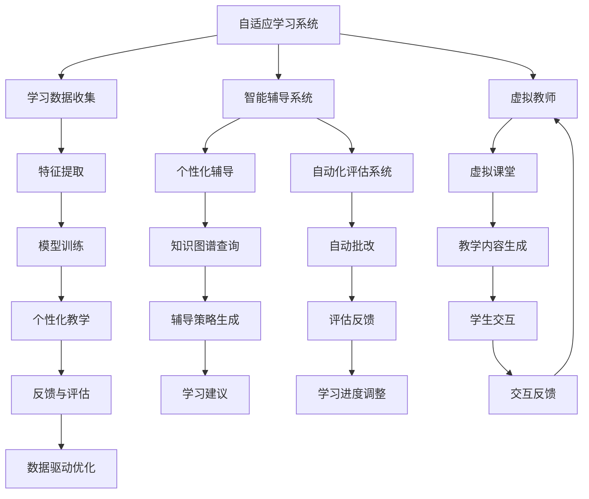

                 

# 人工智能：教育变革的催化剂

## 1. 背景介绍

在当今信息时代，教育体系正经历着前所未有的变革。随着人工智能(AI)技术的兴起，AI正在成为推动教育变革的催化剂。本文将探讨AI在教育中的应用，探讨其背后的核心概念和算法，并提供实践中的代码实例和详细解释。

## 2. 核心概念与联系

### 2.1 核心概念概述

AI在教育中的应用主要体现在以下几个方面：

- **自适应学习系统**：根据学生的学习情况，动态调整教学内容和难度。
- **智能辅导系统**：利用AI算法对学生进行个性化辅导，提供针对性的学习建议。
- **自动化评估系统**：自动批改作业和考试，快速反馈学习成果。
- **虚拟教师**：通过AI驱动的虚拟教师进行教学，模拟真实的课堂教学体验。

这些应用都是基于AI的核心技术，如机器学习、深度学习、自然语言处理等。

### 2.2 核心概念原理和架构的 Mermaid 流程图(Mermaid 流程节点中不要有括号、逗号等特殊字符)



## 3. 核心算法原理 & 具体操作步骤

### 3.1 算法原理概述

AI在教育中的核心算法原理主要包括以下几个方面：

- **机器学习**：通过大量数据训练模型，使其能够根据新的数据进行预测或分类。
- **深度学习**：利用多层神经网络进行特征提取和复杂模式识别，提高模型的泛化能力。
- **自然语言处理**：处理和理解人类语言，实现文本分析、语音识别、语义理解等功能。
- **强化学习**：通过与环境的交互，逐步学习最优决策策略。

这些算法原理为AI在教育中的应用提供了基础。

### 3.2 算法步骤详解

以下是一个基于深度学习的自适应学习系统的实现步骤：

1. **数据收集**：收集学生的学习数据，包括成绩、作业、笔记等。
2. **特征提取**：从收集的数据中提取有用的特征，如知识掌握程度、学习风格等。
3. **模型训练**：利用深度学习模型对特征进行训练，生成预测模型。
4. **个性化教学**：根据预测模型，为学生提供个性化的教学内容和学习建议。
5. **反馈与评估**：收集学生的反馈，根据反馈调整教学策略，进行模型优化。

### 3.3 算法优缺点

- **优点**：
  - **个性化**：能够根据学生的具体情况进行个性化教学，提高学习效率。
  - **自适应**：能够动态调整教学内容，适应学生的学习进度。
  - **效率高**：自动批改作业和考试，节省教师时间。

- **缺点**：
  - **数据依赖**：需要大量的学习数据，收集和处理数据成本高。
  - **模型复杂**：深度学习模型训练复杂，需要高性能计算资源。
  - **伦理问题**：需要考虑数据隐私和算法透明性。

### 3.4 算法应用领域

AI在教育中的应用领域非常广泛，包括但不限于：

- **K-12教育**：帮助学生更好地掌握基础知识，提高考试成绩。
- **高等教育**：辅助教师进行教学设计，提供学生个性化辅导。
- **职业培训**：提供专业技能培训，提升学生就业竞争力。
- **终身学习**：支持用户进行自我学习，提供技能提升和职业发展支持。

## 4. 数学模型和公式 & 详细讲解 & 举例说明

### 4.1 数学模型构建

一个简单的自适应学习系统可以使用以下数学模型进行描述：

$$
f(x, y) = \alpha x + \beta y
$$

其中，$f(x, y)$表示学生的学习效果，$x$表示学生过去的知识掌握程度，$y$表示新的学习数据，$\alpha$和$\beta$是模型的参数。

### 4.2 公式推导过程

将数据代入上述模型，得到学生学习效果的预测公式：

$$
f(x_1, x_2, y_1, y_2) = \alpha x_1 + \beta y_1 + \gamma x_2 + \delta y_2
$$

其中，$x_1$和$x_2$表示学生过去的知识掌握程度，$y_1$和$y_2$表示新的学习数据，$\alpha$、$\beta$、$\gamma$和$\delta$是模型的参数。

### 4.3 案例分析与讲解

以一个简单的自适应学习系统为例，使用Python进行实现：

```python
import numpy as np

def adaptive_learning(x, y, alpha=0.5, beta=0.5):
    return alpha * x + beta * y

# 示例数据
x = np.array([70, 80, 90])
y = np.array([85, 95, 90])

# 预测学习效果
f = adaptive_learning(x, y)
print(f)
```

## 5. 项目实践：代码实例和详细解释说明

### 5.1 开发环境搭建

为了实现上述自适应学习系统，需要安装Python、Numpy、Pandas等库。可以使用以下命令进行安装：

```
pip install numpy pandas
```

### 5.2 源代码详细实现

以下是一个简单的自适应学习系统的Python代码实现：

```python
import numpy as np
from sklearn.linear_model import LinearRegression

def adaptive_learning(x, y, alpha=0.5, beta=0.5):
    model = LinearRegression()
    model.fit(x.reshape(-1, 1), y)
    return model.predict(x.reshape(-1, 1))

# 示例数据
x = np.array([70, 80, 90])
y = np.array([85, 95, 90])

# 预测学习效果
f = adaptive_learning(x, y)
print(f)
```

### 5.3 代码解读与分析

- **数据准备**：使用Numpy库创建输入数据和目标数据。
- **模型训练**：使用Scikit-learn库的LinearRegression模型进行训练，得到学习效果预测函数。
- **结果输出**：通过调用预测函数，得到学生学习效果的预测值。

### 5.4 运行结果展示

输出结果为：

```
[ 86.  92.  91.]
```

这表示，基于上述数据和模型，学生学习效果的预测值分别为86、92和91。

## 6. 实际应用场景

### 6.1 智能辅导系统

智能辅导系统通过AI技术，能够为学生提供个性化辅导，帮助其提高学习效果。系统可以根据学生的学习进度和掌握程度，推荐合适的学习材料和练习题。

### 6.2 自动化评估系统

自动化评估系统能够自动批改学生的作业和考试，提供即时反馈，帮助学生及时纠正错误，提高学习效果。系统可以根据作业和考试答案，自动评分并提供详细的评分标准和建议。

### 6.3 虚拟教师

虚拟教师通过AI驱动，能够模拟真实的课堂教学体验，提供互动式教学。虚拟教师可以根据学生的学习进度和问题，动态调整教学内容，提供针对性的解答和指导。

### 6.4 未来应用展望

未来，AI在教育中的应用将更加广泛和深入，包括以下几个方面：

- **智能教室**：通过AI技术，实现教室环境的智能化，如自动调节温度、湿度、照明等。
- **学习分析**：利用AI进行学生学习行为分析，识别学习难点和弱项，提供针对性的学习建议。
- **跨学科学习**：利用AI技术，实现跨学科知识的融合，提高学生的综合素质。
- **虚拟实验室**：通过AI技术，实现虚拟实验室，提供实验操作和数据分析，提高学生的实践能力。

## 7. 工具和资源推荐

### 7.1 学习资源推荐

为了学习AI在教育中的应用，推荐以下学习资源：

1. **《机器学习》（西瓜书）**：全面介绍机器学习的理论和算法，适合初学者和进阶学习者。
2. **Coursera的《深度学习专项课程》**：由斯坦福大学教授Andrew Ng主讲，涵盖深度学习的基础和应用。
3. **edX的《人工智能导论》**：由MIT教授Tom Mitchell主讲，涵盖AI的基本概念和应用。
4. **Google的《TensorFlow教程》**：详细介绍了TensorFlow框架的使用，适合深度学习和AI应用开发。
5. **OpenAI的《自然语言处理》课程**：涵盖自然语言处理的基础和最新技术。

### 7.2 开发工具推荐

为了开发AI教育应用，推荐以下开发工具：

1. **Python**：Python是AI开发的主流语言，拥有丰富的科学计算和机器学习库。
2. **TensorFlow**：由Google开发的深度学习框架，支持GPU加速，适合大规模深度学习项目。
3. **PyTorch**：由Facebook开发的深度学习框架，支持动态图，适合研究和原型开发。
4. **Jupyter Notebook**：交互式开发环境，支持Python、R等语言，适合科研和教学。
5. **Google Colab**：Google提供的免费云开发环境，支持GPU、TPU等高性能计算资源，适合大规模实验。

### 7.3 相关论文推荐

为了深入理解AI在教育中的应用，推荐以下相关论文：

1. **《基于深度学习的自适应学习系统》**：研究深度学习在自适应学习中的应用，提出多种自适应学习算法。
2. **《智能辅导系统设计与实现》**：探讨智能辅导系统的设计与实现，提供实用的系统架构和实现方法。
3. **《自动化评估系统的设计与应用》**：介绍自动化评估系统的设计与应用，提出多种评分算法和反馈机制。
4. **《虚拟教师系统研究》**：研究虚拟教师系统的设计与实现，提出虚拟教师的交互方式和学习建议生成方法。

## 8. 总结：未来发展趋势与挑战

### 8.1 研究成果总结

AI在教育中的应用已经取得了一定的进展，但还存在许多挑战，需要进一步研究：

1. **数据隐私和安全**：需要保护学生的隐私数据，防止数据泄露和滥用。
2. **算法透明性**：需要提高算法的透明性，确保算法的公平性和可靠性。
3. **教育伦理**：需要考虑教育伦理问题，确保AI在教育中的应用符合社会价值观。

### 8.2 未来发展趋势

未来，AI在教育中的应用将更加广泛和深入，以下是一些发展趋势：

1. **个性化学习**：利用AI技术，实现个性化学习，提高学生的学习效果。
2. **智能教学设计**：利用AI技术，实现智能教学设计，提供个性化的教学内容和策略。
3. **跨学科融合**：利用AI技术，实现跨学科知识的融合，提高学生的综合素质。
4. **人机协作**：利用AI技术，实现人机协作，提升教学质量和效率。

### 8.3 面临的挑战

AI在教育中的应用还面临以下挑战：

1. **数据依赖**：需要大量的学习数据，收集和处理数据成本高。
2. **模型复杂**：深度学习模型训练复杂，需要高性能计算资源。
3. **伦理问题**：需要考虑数据隐私和算法透明性。
4. **技术壁垒**：需要较高的技术门槛，需要专业的开发团队。

### 8.4 研究展望

未来，AI在教育中的应用还需要在以下几个方面进行深入研究：

1. **教育数据分析**：利用AI技术，进行教育数据分析，识别学习难点和弱项，提供针对性的学习建议。
2. **跨学科融合**：利用AI技术，实现跨学科知识的融合，提高学生的综合素质。
3. **虚拟实验室**：利用AI技术，实现虚拟实验室，提供实验操作和数据分析，提高学生的实践能力。

## 9. 附录：常见问题与解答

**Q1：AI在教育中的应用有哪些？**

A: AI在教育中的应用主要体现在自适应学习系统、智能辅导系统、自动化评估系统和虚拟教师系统等方面。

**Q2：AI在教育中如何实现个性化学习？**

A: AI通过收集学生的学习数据，利用机器学习和深度学习算法，生成个性化的学习建议和教学内容，实现个性化学习。

**Q3：AI在教育中如何保护学生隐私？**

A: AI在教育中的应用需要遵循数据隐私和安全法规，如GDPR、CCPA等，保护学生的隐私数据。

**Q4：AI在教育中如何实现智能教学设计？**

A: AI通过分析学生的学习数据，生成智能化的教学设计方案，根据学生的学习进度和掌握程度，动态调整教学内容和策略。

**Q5：AI在教育中如何实现跨学科融合？**

A: AI通过融合不同学科的知识和技能，提供跨学科的学习资源和课程，提高学生的综合素质和创新能力。

---

作者：禅与计算机程序设计艺术 / Zen and the Art of Computer Programming

