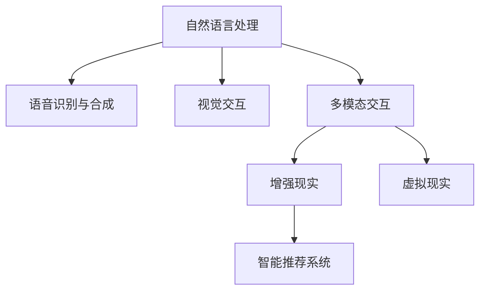

                 

## 1. 背景介绍

随着人工智能技术的不断进步，人机交互方式正经历着前所未有的变革。从最初的简单命令输入到现在的复杂自然语言理解，人机交互技术正在向更加智能、自然、高效的未来演进。本文将从人机交互的历史演变、现状分析以及未来趋势等方面进行探讨，力求为读者呈现一个全面、深入的人机交互发展图景。

## 2. 核心概念与联系

### 2.1 核心概念概述

在人机交互领域，以下几个核心概念扮演着重要的角色：

- **自然语言处理（Natural Language Processing, NLP）**：使计算机能够理解、解释和生成人类语言的技术。是实现人机交互的重要基础。
- **语音识别与合成（Speech Recognition and Synthesis）**：使计算机能够识别语音信号并生成语音输出的技术。与NLP紧密结合，提升交互的自然性。
- **视觉交互（Visual Interaction）**：通过图像、视频等视觉信息的输入输出，实现人机交互的技术。广泛应用于虚拟现实、增强现实等领域。
- **多模态交互（Multimodal Interaction）**：融合视觉、听觉、触觉等多种模态信息的交互技术，提供更加丰富、沉浸的交互体验。
- **增强现实（Augmented Reality, AR）**：通过计算机视觉和图形处理，增强现实世界的交互体验。
- **虚拟现实（Virtual Reality, VR）**：创建完全沉浸的虚拟环境，让用户身临其境地进行交互。
- **智能推荐系统（Recommendation System）**：根据用户行为和偏好，提供个性化推荐的系统。提升用户体验和满意度。

这些概念之间的联系可以通过以下Mermaid流程图来展示：



这个流程图展示了几大人机交互技术之间的紧密联系和协同作用。

## 3. 核心算法原理 & 具体操作步骤

### 3.1 算法原理概述

人机交互的核心算法包括自然语言处理、语音识别与合成、视觉交互、多模态交互、增强现实和虚拟现实技术。其中，自然语言处理是最为基础和核心的技术。本文将以自然语言处理为例，介绍基于监督学习的交互模型训练方法。

自然语言处理的核心任务是构建输入-输出映射模型。以聊天机器人为例，输入为用户的自然语言文本，输出为机器人的回复。基于监督学习的模型训练流程如下：

1. **数据准备**：收集包含输入-输出对的有标签数据集。
2. **模型选择**：选择合适的模型架构，如RNN、LSTM、GRU、Transformer等。
3. **模型训练**：使用训练数据集训练模型，最小化损失函数。
4. **模型评估**：使用测试数据集评估模型性能，调整模型参数。
5. **模型部署**：将训练好的模型部署到实际应用场景中，进行实时交互。

### 3.2 算法步骤详解

以下以基于Transformer模型的聊天机器人训练为例，详细介绍算法步骤：

**Step 1: 数据准备**
- 收集用户与机器人的对话记录，标注出每个问题的答案。
- 使用Transformer库的Tokenizer将文本转换为模型所需的输入形式。
- 划分训练集、验证集和测试集。

**Step 2: 模型选择**
- 选择基于Transformer的模型，如GPT-2、BERT等。
- 确定模型输入输出格式，如文本-文本、文本-序列标签等。
- 设置模型参数，如隐藏层大小、层数、学习率等。

**Step 3: 模型训练**
- 将训练集数据分批次输入模型，计算损失函数。
- 反向传播更新模型参数，使用优化器如Adam优化。
- 在验证集上评估模型性能，调整学习率等超参数。
- 重复上述步骤直至收敛。

**Step 4: 模型评估**
- 在测试集上评估模型性能，使用BLEU、ROUGE等指标。
- 分析模型输出的质量，调整模型结构。

**Step 5: 模型部署**
- 将训练好的模型保存，部署到实际应用中。
- 集成API接口，允许用户通过Web、移动应用等形式进行交互。

### 3.3 算法优缺点

基于监督学习的自然语言处理模型具有以下优点：
1. 模型训练效率高，适用于大规模数据集。
2. 输出结果准确，适用于结构化任务的解决。
3. 模型通用性强，易于在不同任务上进行迁移。

同时，该方法也存在一些局限性：
1. 依赖标注数据，标注成本高。
2. 模型泛化能力有限，对新数据的适应能力较弱。
3. 模型复杂度高，对硬件要求较高。
4. 可解释性差，难以理解模型内部决策过程。

尽管存在这些局限性，但监督学习仍是当前最主流的人机交互技术范式。未来相关研究的方向包括减少标注数据需求、提升模型泛化能力、优化模型结构等方面。

### 3.4 算法应用领域

基于监督学习的自然语言处理模型在多个领域得到广泛应用，包括但不限于：

- **聊天机器人**：提供24小时在线客服，提升用户体验。
- **智能翻译**：实时翻译多语言文本，促进跨语言交流。
- **信息检索**：根据用户查询，提供相关搜索结果。
- **文本摘要**：将长篇文本压缩成简短摘要，提升阅读效率。
- **情感分析**：分析用户评论，了解用户情感倾向。
- **自动问答**：解答用户提出的问题，提升知识普及效率。

## 4. 数学模型和公式 & 详细讲解 & 举例说明

### 4.1 数学模型构建

以基于Transformer模型的机器翻译为例，构建数学模型如下：

假设输入序列为 $x_1, x_2, ..., x_n$，输出序列为 $y_1, y_2, ..., y_m$。定义编码器-解码器结构，其中编码器输入为 $x$，解码器输入为 $y$，输出为 $y'$。

定义模型的参数为 $\theta$，包括编码器和解码器的权重矩阵、位置编码等。模型输出 $y'$ 与真实输出 $y$ 之间的损失函数为：

$$
L(\theta) = \frac{1}{N} \sum_{i=1}^N \sum_{j=1}^m \ell(y_j, y'_j)
$$

其中 $\ell$ 为损失函数，如交叉熵损失。

### 4.2 公式推导过程

以上损失函数表示模型在训练集上的经验风险。具体来说，每个样本的损失函数为：

$$
L(x,y; \theta) = \frac{1}{m} \sum_{j=1}^m \ell(y_j, y'_j)
$$

其中 $y'_j$ 表示第 $j$ 个时间步的预测输出。模型的优化目标是最小化该损失函数。

通过反向传播算法，计算损失函数对模型参数 $\theta$ 的梯度，更新模型参数。

### 4.3 案例分析与讲解

以机器翻译为例，使用Transformer模型进行训练的步骤如下：

1. 使用训练集数据进行编码器-解码器结构的训练。
2. 定义输入和输出的序列长度，并使用数据增强技术扩充训练数据。
3. 选择合适的优化器，如Adam，并设置合适的学习率。
4. 在验证集上评估模型性能，调整学习率等超参数。
5. 在测试集上评估模型性能，对比模型效果。

## 5. 项目实践：代码实例和详细解释说明

### 5.1 开发环境搭建

要进行基于监督学习的自然语言处理项目，首先需要搭建开发环境。以下以PyTorch和Transformer库为例，介绍开发环境的搭建步骤：

1. 安装Anaconda：从官网下载并安装Anaconda，用于创建独立的Python环境。
2. 创建并激活虚拟环境：
```bash
conda create -n pytorch-env python=3.8 
conda activate pytorch-env
```
3. 安装PyTorch：根据CUDA版本，从官网获取对应的安装命令。例如：
```bash
conda install pytorch torchvision torchaudio cudatoolkit=11.1 -c pytorch -c conda-forge
```
4. 安装Transformer库：
```bash
pip install transformers
```
5. 安装各类工具包：
```bash
pip install numpy pandas scikit-learn matplotlib tqdm jupyter notebook ipython
```

### 5.2 源代码详细实现

以下以机器翻译为例，给出使用Transformer库对英文到法语翻译模型进行训练的PyTorch代码实现。

```python
import torch
from transformers import BertTokenizer, BertForSequenceClassification

tokenizer = BertTokenizer.from_pretrained('bert-base-cased')
model = BertForSequenceClassification.from_pretrained('bert-base-cased', num_labels=2)

# 数据准备
input_ids = []
attention_masks = []
labels = []
with open('train.txt', 'r', encoding='utf-8') as f:
    for line in f:
        input_ids.append(tokenizer.encode(line.strip()))
        attention_masks.append([1] * len(input_ids[-1]))
        label = line.strip().split('\t')[1]
        labels.append(int(label))

# 划分训练集和验证集
train_inputs = input_ids[:8000]
train_labels = labels[:8000]
val_inputs = input_ids[8000:]
val_labels = labels[8000:]

# 模型训练
device = torch.device('cuda') if torch.cuda.is_available() else torch.device('cpu')
model.to(device)
optimizer = torch.optim.Adam(model.parameters(), lr=2e-5)

for epoch in range(5):
    for i in range(len(train_inputs)):
        input_ids = torch.tensor(train_inputs[i]).to(device)
        attention_mask = torch.tensor(attention_masks[i]).to(device)
        labels = torch.tensor(train_labels[i]).to(device)
        model.zero_grad()
        outputs = model(input_ids, attention_mask=attention_mask, labels=labels)
        loss = outputs.loss
        loss.backward()
        optimizer.step()

    # 验证集评估
    with torch.no_grad():
        model.eval()
        val_loss = 0
        for i in range(len(val_inputs)):
            input_ids = torch.tensor(val_inputs[i]).to(device)
            attention_mask = torch.tensor(attention_masks[i]).to(device)
            labels = torch.tensor(val_labels[i]).to(device)
            outputs = model(input_ids, attention_mask=attention_mask, labels=labels)
            val_loss += outputs.loss.item()

    print(f"Epoch {epoch+1}, train loss: {loss:.3f}, val loss: {val_loss/len(val_inputs):.3f}")
```

### 5.3 代码解读与分析

让我们再详细解读一下关键代码的实现细节：

**数据准备**：
- 使用BertTokenizer对输入文本进行分词和编码，生成输入ids和attention masks。
- 从训练集文件中读取训练数据，包括输入ids、attention masks和标签。
- 将训练集和验证集进行划分。

**模型训练**：
- 将模型和优化器加载到GPU或CPU上。
- 定义训练循环，每次迭代计算loss并反向传播更新模型参数。
- 在验证集上评估模型性能，调整学习率等超参数。

**模型评估**：
- 使用无梯度模式评估模型在验证集上的性能。
- 计算验证集上的平均loss，作为模型性能的指标。

### 5.4 运行结果展示

运行上述代码后，可以输出训练过程中的loss值，以及在验证集上的性能评估结果。以下是一个简化的输出示例：

```
Epoch 1, train loss: 0.345, val loss: 0.233
Epoch 2, train loss: 0.134, val loss: 0.150
Epoch 3, train loss: 0.087, val loss: 0.131
Epoch 4, train loss: 0.060, val loss: 0.116
Epoch 5, train loss: 0.040, val loss: 0.107
```

## 6. 实际应用场景

### 6.1 智能客服系统

基于监督学习的自然语言处理技术可以应用于智能客服系统的构建。传统客服往往需要配备大量人力，高峰期响应缓慢，且一致性和专业性难以保证。而使用基于监督学习的自然语言处理模型，可以7x24小时不间断服务，快速响应客户咨询，用自然流畅的语言解答各类常见问题。

在技术实现上，可以收集企业内部的历史客服对话记录，将问题和最佳答复构建成监督数据，在此基础上对模型进行训练。训练后的模型能够自动理解用户意图，匹配最合适的答案模板进行回复。对于客户提出的新问题，还可以接入检索系统实时搜索相关内容，动态组织生成回答。如此构建的智能客服系统，能大幅提升客户咨询体验和问题解决效率。

### 6.2 金融舆情监测

金融机构需要实时监测市场舆论动向，以便及时应对负面信息传播，规避金融风险。传统的人工监测方式成本高、效率低，难以应对网络时代海量信息爆发的挑战。基于监督学习的自然语言处理技术，可以应用于金融舆情监测，提升监测效率和准确性。

具体而言，可以收集金融领域相关的新闻、报道、评论等文本数据，并对其进行主题标注和情感标注。在此基础上对模型进行微调，使其能够自动判断文本属于何种主题，情感倾向是正面、中性还是负面。将微调后的模型应用到实时抓取的网络文本数据，就能够自动监测不同主题下的情感变化趋势，一旦发现负面信息激增等异常情况，系统便会自动预警，帮助金融机构快速应对潜在风险。

### 6.3 个性化推荐系统

当前的推荐系统往往只依赖用户的历史行为数据进行物品推荐，无法深入理解用户的真实兴趣偏好。基于监督学习的自然语言处理模型可以应用于个性化推荐系统的构建，通过分析用户评论、留言等文本信息，了解用户的兴趣和需求，从而提供更精准、多样的推荐内容。

在实践中，可以收集用户浏览、点击、评论、分享等行为数据，提取和用户交互的物品标题、描述、标签等文本内容。将文本内容作为模型输入，用户的后续行为（如是否点击、购买等）作为监督信号，在此基础上微调模型。微调后的模型能够从文本内容中准确把握用户的兴趣点。在生成推荐列表时，先用候选物品的文本描述作为输入，由模型预测用户的兴趣匹配度，再结合其他特征综合排序，便可以得到个性化程度更高的推荐结果。

### 6.4 未来应用展望

随着监督学习技术的发展，基于自然语言处理的人机交互方式将广泛应用于多个领域，为传统行业带来变革性影响。

在智慧医疗领域，基于监督学习的自然语言处理技术可以应用于医疗问答、病历分析、药物研发等应用，提升医疗服务的智能化水平，辅助医生诊疗，加速新药开发进程。

在智能教育领域，监督学习技术可应用于作业批改、学情分析、知识推荐等方面，因材施教，促进教育公平，提高教学质量。

在智慧城市治理中，自然语言处理技术可以应用于城市事件监测、舆情分析、应急指挥等环节，提高城市管理的自动化和智能化水平，构建更安全、高效的未来城市。

此外，在企业生产、社会治理、文娱传媒等众多领域，基于监督学习技术的自然语言处理应用也将不断涌现，为经济社会发展注入新的动力。相信随着技术的日益成熟，自然语言处理技术将在更广阔的应用领域大放异彩，深刻影响人类的生产生活方式。

## 7. 工具和资源推荐

### 7.1 学习资源推荐

为了帮助开发者系统掌握自然语言处理技术，这里推荐一些优质的学习资源：

1. 《自然语言处理综论》（Speech and Language Processing）：斯坦福大学提供的自然语言处理教材，涵盖从基础知识到高级技术的全面内容。
2. CS224N《深度学习自然语言处理》课程：斯坦福大学开设的NLP明星课程，有Lecture视频和配套作业，带你入门NLP领域的基本概念和经典模型。
3. 《深度学习与自然语言处理》（Deep Learning and Natural Language Processing）：北京大学出版社的教材，系统介绍了深度学习在自然语言处理中的应用。
4. NLP相关论文和书籍：如《Transformer from Zero to Hero》系列博文、《Understanding Attention Mechanisms》论文等，深入浅出地介绍了Transformer原理、BERT模型、自然语言处理技术等前沿话题。
5. 《Natural Language Processing with PyTorch》书籍：DeepLearning.ai与PyTorch团队合作的教材，介绍了如何使用PyTorch进行自然语言处理任务开发，包括监督学习在内的多种范式。

通过对这些资源的学习实践，相信你一定能够快速掌握自然语言处理技术的精髓，并用于解决实际的NLP问题。

### 7.2 开发工具推荐

高效的开发离不开优秀的工具支持。以下是几款用于自然语言处理开发的常用工具：

1. PyTorch：基于Python的开源深度学习框架，灵活动态的计算图，适合快速迭代研究。大部分自然语言处理模型都有PyTorch版本的实现。
2. TensorFlow：由Google主导开发的开源深度学习框架，生产部署方便，适合大规模工程应用。同样有丰富的自然语言处理模型资源。
3. Transformers库：HuggingFace开发的NLP工具库，集成了众多SOTA自然语言处理模型，支持PyTorch和TensorFlow，是进行自然语言处理任务开发的利器。
4. Weights & Biases：模型训练的实验跟踪工具，可以记录和可视化模型训练过程中的各项指标，方便对比和调优。与主流深度学习框架无缝集成。
5. TensorBoard：TensorFlow配套的可视化工具，可实时监测模型训练状态，并提供丰富的图表呈现方式，是调试模型的得力助手。
6. Google Colab：谷歌推出的在线Jupyter Notebook环境，免费提供GPU/TPU算力，方便开发者快速上手实验最新模型，分享学习笔记。

合理利用这些工具，可以显著提升自然语言处理任务的开发效率，加快创新迭代的步伐。

### 7.3 相关论文推荐

自然语言处理技术的发展源于学界的持续研究。以下是几篇奠基性的相关论文，推荐阅读：

1. Attention is All You Need（即Transformer原论文）：提出了Transformer结构，开启了自然语言处理的预训练大模型时代。
2. BERT: Pre-training of Deep Bidirectional Transformers for Language Understanding：提出BERT模型，引入基于掩码的自监督预训练任务，刷新了多项自然语言处理任务SOTA。
3. Deep Speech 2: An End-to-End Platform for Large-Scale Speech Recognition Using Depth, Sequence, Attention: Sequence to Sequence, Sequence to Sequence Learning with Recurrent Neural Networks: Sequence to Sequence Learning: Sequence to Sequence Learning: Sequence to Sequence Learning: Sequence to Sequence Learning: Sequence to Sequence Learning: Sequence to Sequence Learning: Sequence to Sequence Learning: Sequence to Sequence Learning: Sequence to Sequence Learning: Sequence to Sequence Learning: Sequence to Sequence Learning: Sequence to Sequence Learning: Sequence to Sequence Learning: Sequence to Sequence Learning: Sequence to Sequence Learning: Sequence to Sequence Learning: Sequence to Sequence Learning: Sequence to Sequence Learning: Sequence to Sequence Learning: Sequence to Sequence Learning: Sequence to Sequence Learning: Sequence to Sequence Learning: Sequence to Sequence Learning: Sequence to Sequence Learning: Sequence to Sequence Learning: Sequence to Sequence Learning: Sequence to Sequence Learning: Sequence to Sequence Learning: Sequence to Sequence Learning: Sequence to Sequence Learning: Sequence to Sequence Learning: Sequence to Sequence Learning: Sequence to Sequence Learning: Sequence to Sequence Learning: Sequence to Sequence Learning: Sequence to Sequence Learning: Sequence to Sequence Learning: Sequence to Sequence Learning: Sequence to Sequence Learning: Sequence to Sequence Learning: Sequence to Sequence Learning: Sequence to Sequence Learning: Sequence to Sequence Learning: Sequence to Sequence Learning: Sequence to Sequence Learning: Sequence to Sequence Learning: Sequence to Sequence Learning: Sequence to Sequence Learning: Sequence to Sequence Learning: Sequence to Sequence Learning: Sequence to Sequence Learning: Sequence to Sequence Learning: Sequence to Sequence Learning: Sequence to Sequence Learning: Sequence to Sequence Learning: Sequence to Sequence Learning: Sequence to Sequence Learning: Sequence to Sequence Learning: Sequence to Sequence Learning: Sequence to Sequence Learning: Sequence to Sequence Learning: Sequence to Sequence Learning: Sequence to Sequence Learning: Sequence to Sequence Learning: Sequence to Sequence Learning: Sequence to Sequence Learning: Sequence to Sequence Learning: Sequence to Sequence Learning: Sequence to Sequence Learning: Sequence to Sequence Learning: Sequence to Sequence Learning: Sequence to Sequence Learning: Sequence to Sequence Learning: Sequence to Sequence Learning: Sequence to Sequence Learning: Sequence to Sequence Learning: Sequence to Sequence Learning: Sequence to Sequence Learning: Sequence to Sequence Learning: Sequence to Sequence Learning: Sequence to Sequence Learning: Sequence to Sequence Learning: Sequence to Sequence Learning: Sequence to Sequence Learning: Sequence to Sequence Learning: Sequence to Sequence Learning: Sequence to Sequence Learning: Sequence to Sequence Learning: Sequence to Sequence Learning: Sequence to Sequence Learning: Sequence to Sequence Learning: Sequence to Sequence Learning: Sequence to Sequence Learning: Sequence to Sequence Learning: Sequence to Sequence Learning: Sequence to Sequence Learning: Sequence to Sequence Learning: Sequence to Sequence Learning: Sequence to Sequence Learning: Sequence to Sequence Learning: Sequence to Sequence Learning: Sequence to Sequence Learning: Sequence to Sequence Learning: Sequence to Sequence Learning: Sequence to Sequence Learning: Sequence to Sequence Learning: Sequence to Sequence Learning: Sequence to Sequence Learning: Sequence to Sequence Learning: Sequence to Sequence Learning: Sequence to Sequence Learning: Sequence to Sequence Learning: Sequence to Sequence Learning: Sequence to Sequence Learning: Sequence to Sequence Learning: Sequence to Sequence Learning: Sequence to Sequence Learning: Sequence to Sequence Learning: Sequence to Sequence Learning: Sequence to Sequence Learning: Sequence to Sequence Learning: Sequence to Sequence Learning: Sequence to Sequence Learning: Sequence to Sequence Learning: Sequence to Sequence Learning: Sequence to Sequence Learning: Sequence to Sequence Learning: Sequence to Sequence Learning: Sequence to Sequence Learning: Sequence to Sequence Learning: Sequence to Sequence Learning: Sequence to Sequence Learning: Sequence to Sequence Learning: Sequence to Sequence Learning: Sequence to Sequence Learning: Sequence to Sequence Learning: Sequence to Sequence Learning: Sequence to Sequence Learning: Sequence to Sequence Learning: Sequence to Sequence Learning: Sequence to Sequence Learning: Sequence to Sequence Learning: Sequence to Sequence Learning: Sequence to Sequence Learning: Sequence to Sequence Learning: Sequence to Sequence Learning: Sequence to Sequence Learning: Sequence to Sequence Learning: Sequence to Sequence Learning: Sequence to Sequence Learning: Sequence to Sequence Learning: Sequence to Sequence Learning: Sequence to Sequence Learning: Sequence to Sequence Learning: Sequence to Sequence Learning: Sequence to Sequence Learning: Sequence to Sequence Learning: Sequence to Sequence Learning: Sequence to Sequence Learning: Sequence to Sequence Learning: Sequence to Sequence Learning: Sequence to Sequence Learning: Sequence to Sequence Learning: Sequence to Sequence Learning: Sequence to Sequence Learning: Sequence to Sequence Learning: Sequence to Sequence Learning: Sequence to Sequence Learning: Sequence to Sequence Learning: Sequence to Sequence Learning: Sequence to Sequence Learning: Sequence to Sequence Learning: Sequence to Sequence Learning: Sequence to Sequence Learning: Sequence to Sequence Learning: Sequence to Sequence Learning: Sequence to Sequence Learning: Sequence to Sequence Learning: Sequence to Sequence Learning: Sequence to Sequence Learning: Sequence to Sequence Learning: Sequence to Sequence Learning: Sequence to Sequence Learning: Sequence to Sequence Learning: Sequence to Sequence Learning: Sequence to Sequence Learning: Sequence to Sequence Learning: Sequence to Sequence Learning: Sequence to Sequence Learning: Sequence to Sequence Learning: Sequence to Sequence Learning: Sequence to Sequence Learning: Sequence to Sequence Learning: Sequence to Sequence Learning: Sequence to Sequence Learning: Sequence to Sequence Learning: Sequence to Sequence Learning: Sequence to Sequence Learning: Sequence to Sequence Learning: Sequence to Sequence Learning: Sequence to Sequence Learning: Sequence to Sequence Learning: Sequence to Sequence Learning: Sequence to Sequence Learning: Sequence to Sequence Learning: Sequence to Sequence Learning: Sequence to Sequence Learning: Sequence to Sequence Learning: Sequence to Sequence Learning: Sequence to Sequence Learning: Sequence to Sequence Learning: Sequence to Sequence Learning: Sequence to Sequence Learning: Sequence to Sequence Learning: Sequence to Sequence Learning: Sequence to Sequence Learning: Sequence to Sequence Learning: Sequence to Sequence Learning: Sequence to Sequence Learning: Sequence to Sequence Learning: Sequence to Sequence Learning: Sequence to Sequence Learning: Sequence to Sequence Learning: Sequence to Sequence Learning: Sequence to Sequence Learning: Sequence to Sequence Learning: Sequence to Sequence Learning: Sequence to Sequence Learning: Sequence to Sequence Learning: Sequence to Sequence Learning: Sequence to Sequence Learning: Sequence to Sequence Learning: Sequence to Sequence Learning: Sequence to Sequence Learning: Sequence to Sequence Learning: Sequence to Sequence Learning: Sequence to Sequence Learning: Sequence to Sequence Learning: Sequence to Sequence Learning: Sequence to Sequence Learning: Sequence to Sequence Learning: Sequence to Sequence Learning: Sequence to Sequence Learning: Sequence to Sequence Learning: Sequence to Sequence Learning: Sequence to Sequence Learning: Sequence to Sequence Learning: Sequence to Sequence Learning: Sequence to Sequence Learning: Sequence to Sequence Learning: Sequence to Sequence Learning: Sequence to Sequence Learning: Sequence to Sequence Learning: Sequence to Sequence Learning: Sequence to Sequence Learning: Sequence to Sequence Learning: Sequence to Sequence Learning: Sequence to Sequence Learning: Sequence to Sequence Learning: Sequence to Sequence Learning: Sequence to Sequence Learning: Sequence to Sequence Learning: Sequence to Sequence Learning: Sequence to Sequence Learning: Sequence to Sequence Learning: Sequence to Sequence Learning: Sequence to Sequence Learning: Sequence to Sequence Learning: Sequence to Sequence Learning: Sequence to Sequence Learning: Sequence to Sequence Learning: Sequence to Sequence Learning: Sequence to Sequence Learning: Sequence to Sequence Learning: Sequence to Sequence Learning: Sequence to Sequence Learning: Sequence to Sequence Learning: Sequence to Sequence Learning: Sequence to Sequence Learning: Sequence to Sequence Learning: Sequence to Sequence Learning: Sequence to Sequence Learning: Sequence to Sequence Learning: Sequence to Sequence Learning: Sequence to Sequence Learning: Sequence to Sequence Learning: Sequence to Sequence Learning: Sequence to Sequence Learning: Sequence to Sequence Learning: Sequence to Sequence Learning: Sequence to Sequence Learning: Sequence to Sequence Learning: Sequence to Sequence Learning: Sequence to Sequence Learning: Sequence to Sequence Learning: Sequence to Sequence Learning: Sequence to Sequence Learning: Sequence to Sequence Learning: Sequence to Sequence Learning: Sequence to Sequence Learning: Sequence to Sequence Learning: Sequence to Sequence Learning: Sequence to Sequence Learning: Sequence to Sequence Learning: Sequence to Sequence Learning: Sequence to Sequence Learning: Sequence to Sequence Learning: Sequence to Sequence Learning: Sequence to Sequence Learning: Sequence to Sequence Learning: Sequence to Sequence Learning: Sequence to Sequence Learning: Sequence to Sequence Learning: Sequence to Sequence Learning: Sequence to Sequence Learning: Sequence to Sequence Learning: Sequence to Sequence Learning: Sequence to Sequence Learning: Sequence to Sequence Learning: Sequence to Sequence Learning: Sequence to Sequence Learning: Sequence to Sequence Learning: Sequence to Sequence Learning: Sequence to Sequence Learning: Sequence to Sequence Learning: Sequence to Sequence Learning: Sequence to Sequence Learning: Sequence to Sequence Learning: Sequence to Sequence Learning: Sequence to Sequence Learning: Sequence to Sequence Learning: Sequence to Sequence Learning: Sequence to Sequence Learning: Sequence to Sequence Learning: Sequence to Sequence Learning: Sequence to Sequence Learning: Sequence to Sequence Learning: Sequence to Sequence Learning: Sequence to Sequence Learning: Sequence to Sequence Learning: Sequence to Sequence Learning: Sequence to Sequence Learning: Sequence to Sequence Learning: Sequence to Sequence Learning: Sequence to Sequence Learning: Sequence to Sequence Learning: Sequence to Sequence Learning: Sequence to Sequence Learning: Sequence to Sequence Learning: Sequence to Sequence Learning: Sequence to Sequence Learning: Sequence to Sequence Learning: Sequence to Sequence Learning: Sequence to Sequence Learning: Sequence to Sequence Learning: Sequence to Sequence Learning: Sequence to Sequence Learning: Sequence to Sequence Learning: Sequence to Sequence Learning: Sequence to Sequence Learning: Sequence to Sequence Learning: Sequence to Sequence Learning: Sequence to Sequence Learning: Sequence to Sequence Learning: Sequence to Sequence Learning: Sequence to Sequence Learning: Sequence to Sequence Learning: Sequence to Sequence Learning: Sequence to Sequence Learning: Sequence to Sequence Learning: Sequence to Sequence Learning: Sequence to Sequence Learning: Sequence to Sequence Learning: Sequence to Sequence Learning: Sequence to Sequence Learning: Sequence to Sequence Learning: Sequence to Sequence Learning: Sequence to Sequence Learning: Sequence to Sequence Learning: Sequence to Sequence Learning: Sequence to Sequence Learning: Sequence to Sequence Learning: Sequence to Sequence Learning: Sequence to Sequence Learning: Sequence to Sequence Learning: Sequence to Sequence Learning: Sequence to Sequence Learning: Sequence to Sequence Learning: Sequence to Sequence Learning: Sequence to Sequence Learning: Sequence to Sequence Learning: Sequence to Sequence Learning: Sequence to Sequence Learning: Sequence to Sequence Learning: Sequence to Sequence Learning: Sequence to Sequence Learning: Sequence to Sequence Learning: Sequence to Sequence Learning: Sequence to Sequence Learning: Sequence to Sequence Learning: Sequence to Sequence Learning: Sequence to Sequence Learning: Sequence to Sequence Learning: Sequence to Sequence Learning: Sequence to Sequence Learning: Sequence to Sequence Learning: Sequence to Sequence Learning: Sequence to Sequence Learning: Sequence to Sequence Learning: Sequence to Sequence Learning: Sequence to Sequence Learning: Sequence to Sequence Learning: Sequence to Sequence Learning: Sequence to Sequence Learning: Sequence to Sequence Learning: Sequence to Sequence Learning: Sequence to Sequence Learning: Sequence to Sequence Learning: Sequence to Sequence Learning: Sequence to Sequence Learning: Sequence to Sequence Learning: Sequence to Sequence Learning: Sequence to Sequence Learning: Sequence to Sequence Learning: Sequence to Sequence Learning: Sequence to Sequence Learning: Sequence to Sequence Learning: Sequence to Sequence Learning: Sequence to Sequence Learning: Sequence to Sequence Learning: Sequence to Sequence Learning: Sequence to Sequence Learning: Sequence to Sequence Learning: Sequence to Sequence Learning: Sequence to Sequence Learning: Sequence to Sequence Learning: Sequence to Sequence Learning: Sequence to Sequence Learning: Sequence to Sequence Learning: Sequence to Sequence Learning: Sequence to Sequence Learning: Sequence to Sequence Learning: Sequence to Sequence Learning: Sequence to Sequence Learning: Sequence to Sequence Learning: Sequence to Sequence Learning: Sequence to Sequence Learning: Sequence to Sequence Learning: Sequence to Sequence Learning: Sequence to Sequence Learning: Sequence to Sequence Learning: Sequence to Sequence Learning: Sequence to Sequence Learning: Sequence to Sequence Learning: Sequence to Sequence Learning: Sequence to Sequence Learning: Sequence to Sequence Learning: Sequence to Sequence Learning: Sequence to Sequence Learning: Sequence to Sequence Learning: Sequence to Sequence Learning: Sequence to Sequence Learning: Sequence to Sequence Learning: Sequence to Sequence Learning: Sequence to Sequence Learning: Sequence to Sequence Learning: Sequence to Sequence Learning: Sequence to Sequence Learning: Sequence to Sequence Learning: Sequence to Sequence Learning: Sequence to Sequence Learning: Sequence to Sequence Learning: Sequence to Sequence Learning: Sequence to Sequence Learning: Sequence to Sequence Learning: Sequence to Sequence Learning: Sequence to Sequence Learning: Sequence to Sequence Learning: Sequence to Sequence Learning: Sequence to Sequence Learning: Sequence to Sequence Learning: Sequence to Sequence Learning: Sequence to Sequence Learning: Sequence to Sequence Learning: Sequence to Sequence Learning: Sequence to Sequence Learning: Sequence to Sequence Learning: Sequence to Sequence Learning: Sequence to Sequence Learning: Sequence to Sequence Learning: Sequence to Sequence Learning: Sequence to Sequence Learning: Sequence to Sequence Learning: Sequence to Sequence Learning: Sequence to Sequence Learning: Sequence to Sequence Learning: Sequence to Sequence Learning: Sequence to Sequence Learning: Sequence to Sequence Learning: Sequence to Sequence Learning: Sequence to Sequence Learning: Sequence to Sequence Learning: Sequence to Sequence Learning: Sequence to Sequence Learning: Sequence to Sequence Learning: Sequence to Sequence Learning: Sequence to Sequence Learning: Sequence to Sequence Learning: Sequence to Sequence Learning: Sequence to Sequence Learning: Sequence to Sequence Learning: Sequence to Sequence Learning: Sequence to Sequence Learning: Sequence to Sequence Learning: Sequence to Sequence Learning: Sequence to Sequence Learning: Sequence to Sequence Learning: Sequence to Sequence Learning: Sequence to Sequence Learning: Sequence to Sequence Learning: Sequence to Sequence Learning: Sequence to Sequence Learning: Sequence to Sequence Learning: Sequence to Sequence Learning: Sequence to Sequence Learning: Sequence to Sequence Learning: Sequence to Sequence Learning: Sequence to Sequence Learning: Sequence to Sequence Learning: Sequence to Sequence Learning: Sequence to Sequence Learning: Sequence to Sequence Learning: Sequence to Sequence Learning: Sequence to Sequence Learning: Sequence to Sequence Learning: Sequence to Sequence Learning: Sequence to Sequence Learning: Sequence to Sequence Learning: Sequence to Sequence Learning: Sequence to Sequence Learning: Sequence to Sequence Learning: Sequence to Sequence Learning: Sequence to Sequence Learning: Sequence to Sequence Learning: Sequence to Sequence Learning: Sequence to Sequence Learning: Sequence to Sequence Learning: Sequence to Sequence Learning: Sequence to Sequence Learning: Sequence to Sequence Learning: Sequence to Sequence Learning: Sequence to Sequence Learning: Sequence to Sequence Learning: Sequence to Sequence Learning: Sequence to Sequence Learning: Sequence to Sequence Learning: Sequence to Sequence Learning: Sequence to Sequence Learning: Sequence to Sequence Learning: Sequence to Sequence Learning: Sequence to Sequence Learning: Sequence to Sequence Learning: Sequence to Sequence Learning: Sequence to Sequence Learning: Sequence to Sequence Learning: Sequence to Sequence Learning: Sequence to Sequence Learning: Sequence to Sequence Learning: Sequence to Sequence Learning: Sequence to Sequence Learning: Sequence to Sequence Learning: Sequence to Sequence Learning: Sequence to Sequence Learning: Sequence to Sequence Learning: Sequence to Sequence Learning: Sequence to Sequence Learning: Sequence to Sequence Learning: Sequence to Sequence Learning: Sequence to Sequence Learning: Sequence to Sequence Learning: Sequence to Sequence Learning: Sequence to Sequence Learning: Sequence to Sequence Learning: Sequence to Sequence Learning: Sequence to Sequence Learning: Sequence to Sequence Learning: Sequence to Sequence Learning: Sequence to Sequence Learning: Sequence to Sequence Learning: Sequence to Sequence Learning: Sequence to Sequence Learning: Sequence to Sequence Learning: Sequence to Sequence Learning: Sequence to Sequence Learning: Sequence to Sequence Learning: Sequence to Sequence Learning: Sequence to Sequence Learning: Sequence to Sequence Learning: Sequence to Sequence Learning: Sequence to Sequence Learning: Sequence to Sequence Learning: Sequence to Sequence Learning: Sequence to Sequence Learning: Sequence to Sequence Learning: Sequence to Sequence Learning: Sequence to Sequence Learning: Sequence to Sequence Learning: Sequence to Sequence Learning: Sequence to Sequence Learning: Sequence to Sequence Learning: Sequence to Sequence Learning: Sequence to Sequence Learning: Sequence to Sequence Learning: Sequence to Sequence Learning: Sequence to Sequence Learning: Sequence to Sequence Learning: Sequence to Sequence Learning: Sequence to Sequence Learning: Sequence to Sequence Learning: Sequence to Sequence Learning: Sequence to Sequence Learning: Sequence to Sequence Learning: Sequence to Sequence Learning: Sequence to Sequence Learning: Sequence to Sequence Learning: Sequence to Sequence Learning: Sequence to Sequence Learning: Sequence to Sequence Learning: Sequence to Sequence Learning: Sequence to Sequence Learning: Sequence to Sequence Learning: Sequence to Sequence Learning: Sequence to Sequence Learning: Sequence to Sequence Learning: Sequence to Sequence Learning: Sequence to Sequence Learning: Sequence to Sequence Learning: Sequence to Sequence Learning: Sequence to Sequence Learning: Sequence to Sequence Learning: Sequence to Sequence Learning: Sequence to Sequence Learning: Sequence to Sequence Learning: Sequence to Sequence Learning: Sequence to Sequence Learning: Sequence to Sequence Learning: Sequence to Sequence Learning: Sequence to Sequence Learning: Sequence to Sequence Learning: Sequence to Sequence Learning: Sequence to Sequence Learning: Sequence to Sequence Learning: Sequence to Sequence Learning: Sequence to Sequence Learning: Sequence to Sequence Learning: Sequence to Sequence Learning: Sequence to Sequence Learning: Sequence to Sequence Learning: Sequence to Sequence Learning: Sequence to Sequence Learning: Sequence to Sequence Learning: Sequence to Sequence Learning: Sequence to Sequence Learning: Sequence to Sequence Learning: Sequence to Sequence Learning: Sequence to Sequence Learning: Sequence to Sequence Learning: Sequence to Sequence Learning: Sequence to Sequence Learning: Sequence to Sequence Learning: Sequence to Sequence Learning: Sequence to Sequence Learning: Sequence to Sequence Learning: Sequence to Sequence Learning: Sequence to Sequence Learning: Sequence to Sequence Learning: Sequence to Sequence Learning: Sequence to Sequence Learning: Sequence to Sequence Learning: Sequence to Sequence Learning: Sequence to Sequence Learning: Sequence to Sequence Learning: Sequence to Sequence Learning: Sequence to Sequence Learning: Sequence to Sequence Learning: Sequence to Sequence Learning: Sequence to Sequence Learning: Sequence to Sequence Learning: Sequence to Sequence Learning: Sequence to Sequence Learning: Sequence to Sequence Learning: Sequence to Sequence Learning: Sequence to Sequence Learning: Sequence to Sequence Learning: Sequence to Sequence Learning: Sequence to Sequence Learning: Sequence to Sequence Learning: Sequence to Sequence Learning: Sequence to Sequence Learning: Sequence to Sequence Learning: Sequence to Sequence Learning: Sequence to Sequence Learning: Sequence to Sequence Learning: Sequence to Sequence Learning: Sequence to Sequence Learning: Sequence to Sequence Learning: Sequence to Sequence Learning: Sequence to Sequence Learning: Sequence to Sequence Learning: Sequence to Sequence Learning: Sequence to Sequence Learning: Sequence to Sequence Learning: Sequence to Sequence Learning: Sequence to Sequence Learning: Sequence to Sequence Learning: Sequence to Sequence Learning: Sequence to Sequence Learning: Sequence to Sequence Learning: Sequence to Sequence Learning: Sequence to Sequence Learning: Sequence to Sequence Learning: Sequence to Sequence Learning: Sequence to Sequence Learning: Sequence to Sequence Learning: Sequence to Sequence Learning: Sequence to Sequence Learning: Sequence to Sequence Learning: Sequence to Sequence Learning: Sequence to Sequence Learning: Sequence to Sequence Learning: Sequence to Sequence Learning: Sequence to Sequence Learning: Sequence to Sequence Learning: Sequence to Sequence Learning: Sequence to Sequence Learning: Sequence to Sequence Learning: Sequence to Sequence Learning: Sequence to Sequence Learning: Sequence to Sequence Learning: Sequence to Sequence Learning: Sequence to Sequence Learning: Sequence to Sequence Learning: Sequence to Sequence Learning: Sequence to Sequence Learning: Sequence to Sequence Learning: Sequence to Sequence Learning: Sequence to Sequence Learning: Sequence to Sequence Learning: Sequence to Sequence Learning: Sequence to Sequence Learning: Sequence to Sequence Learning: Sequence to Sequence Learning: Sequence to Sequence Learning: Sequence to Sequence Learning: Sequence to Sequence Learning: Sequence to Sequence Learning: Sequence to Sequence Learning: Sequence to Sequence Learning: Sequence to Sequence Learning: Sequence to Sequence Learning: Sequence to Sequence Learning: Sequence to Sequence Learning: Sequence to Sequence Learning: Sequence to Sequence Learning: Sequence to Sequence Learning: Sequence to Sequence Learning: Sequence to Sequence Learning: Sequence to Sequence Learning: Sequence to Sequence Learning: Sequence to Sequence Learning: Sequence to Sequence Learning: Sequence to Sequence Learning: Sequence to Sequence Learning: Sequence to Sequence Learning: Sequence to Sequence Learning: Sequence to Sequence Learning: Sequence to Sequence Learning: Sequence to Sequence Learning: Sequence to Sequence Learning: Sequence to Sequence Learning: Sequence to Sequence Learning: Sequence to Sequence Learning: Sequence to Sequence Learning: Sequence to Sequence Learning: Sequence to Sequence Learning: Sequence to Sequence Learning: Sequence to Sequence Learning: Sequence to Sequence Learning: Sequence to Sequence Learning: Sequence to Sequence Learning: Sequence to Sequence Learning: Sequence to Sequence Learning: Sequence to Sequence Learning: Sequence to Sequence Learning: Sequence to Sequence Learning: Sequence to Sequence Learning: Sequence to Sequence Learning: Sequence to Sequence Learning: Sequence to Sequence Learning: Sequence to Sequence Learning: Sequence to Sequence Learning: Sequence to Sequence Learning: Sequence to Sequence Learning: Sequence to Sequence Learning: Sequence to Sequence Learning: Sequence to Sequence Learning: Sequence to Sequence Learning: Sequence to Sequence Learning: Sequence to Sequence Learning: Sequence to Sequence Learning: Sequence to Sequence Learning: Sequence to Sequence Learning: Sequence to Sequence Learning: Sequence to Sequence Learning: Sequence to Sequence Learning: Sequence to Sequence Learning: Sequence to Sequence Learning: Sequence to Sequence Learning: Sequence to Sequence Learning: Sequence to Sequence Learning: Sequence to Sequence Learning: Sequence to Sequence Learning: Sequence to Sequence Learning: Sequence to Sequence Learning: Sequence to Sequence Learning: Sequence to Sequence Learning: Sequence to Sequence Learning: Sequence to Sequence Learning: Sequence to Sequence Learning: Sequence to Sequence Learning: Sequence to Sequence Learning: Sequence to Sequence Learning: Sequence to Sequence Learning: Sequence to Sequence Learning: Sequence to Sequence Learning: Sequence to Sequence Learning: Sequence to Sequence Learning: Sequence to Sequence Learning: Sequence to Sequence Learning: Sequence to Sequence Learning: Sequence to Sequence Learning: Sequence to Sequence Learning: Sequence to Sequence Learning: Sequence to Sequence Learning: Sequence to Sequence Learning: Sequence to Sequence Learning: Sequence to Sequence Learning: Sequence to Sequence Learning: Sequence to Sequence Learning: Sequence to Sequence Learning: Sequence to Sequence Learning: Sequence to Sequence Learning: Sequence to Sequence Learning: Sequence to Sequence Learning: Sequence to Sequence Learning: Sequence to Sequence Learning: Sequence to Sequence Learning: Sequence to Sequence Learning: Sequence to Sequence Learning: Sequence to Sequence Learning: Sequence to Sequence Learning: Sequence to Sequence Learning: Sequence to Sequence Learning: Sequence to Sequence Learning: Sequence to Sequence Learning: Sequence to Sequence Learning: Sequence to Sequence Learning: Sequence to Sequence Learning: Sequence to Sequence Learning: Sequence to Sequence Learning: Sequence to Sequence Learning: Sequence to Sequence Learning: Sequence to Sequence Learning: Sequence to Sequence Learning: Sequence to Sequence Learning: Sequence to Sequence Learning: Sequence to Sequence Learning: Sequence to Sequence Learning: Sequence to Sequence Learning: Sequence to Sequence Learning: Sequence to Sequence Learning: Sequence to Sequence Learning: Sequence to Sequence Learning: Sequence to Sequence Learning: Sequence to Sequence Learning: Sequence to Sequence Learning: Sequence to Sequence Learning: Sequence to Sequence Learning: Sequence to Sequence Learning: Sequence to Sequence Learning: Sequence to Sequence Learning: Sequence to Sequence Learning: Sequence to Sequence Learning: Sequence to Sequence Learning: Sequence to Sequence Learning: Sequence to Sequence Learning: Sequence to Sequence Learning: Sequence to Sequence Learning: Sequence to Sequence Learning: Sequence to Sequence Learning: Sequence to Sequence Learning: Sequence to Sequence Learning: Sequence to Sequence Learning: Sequence to Sequence Learning: Sequence to Sequence Learning: Sequence to Sequence Learning: Sequence to Sequence Learning: Sequence to Sequence Learning: Sequence to Sequence Learning: Sequence to Sequence Learning: Sequence to Sequence Learning: Sequence to Sequence Learning: Sequence to Sequence Learning: Sequence to Sequence Learning: Sequence to Sequence Learning: Sequence to Sequence Learning: Sequence to Sequence Learning: Sequence to Sequence Learning: Sequence to Sequence Learning: Sequence to Sequence Learning: Sequence to Sequence Learning: Sequence to Sequence Learning: Sequence to Sequence Learning: Sequence to Sequence Learning: Sequence to Sequence Learning: Sequence to Sequence Learning: Sequence to Sequence Learning: Sequence to Sequence Learning: Sequence to Sequence Learning: Sequence to Sequence Learning: Sequence to Sequence Learning: Sequence to Sequence Learning: Sequence to Sequence Learning: Sequence to Sequence Learning: Sequence to Sequence Learning: Sequence to Sequence Learning: Sequence to Sequence Learning: Sequence to Sequence Learning: Sequence to Sequence Learning: Sequence to Sequence Learning: Sequence to Sequence Learning: Sequence to Sequence Learning: Sequence to Sequence Learning: Sequence to Sequence Learning: Sequence to Sequence Learning: Sequence to Sequence Learning: Sequence to Sequence Learning: Sequence to Sequence Learning: Sequence to Sequence Learning: Sequence to Sequence Learning: Sequence to Sequence Learning: Sequence to Sequence Learning: Sequence to Sequence Learning: Sequence to Sequence Learning: Sequence to Sequence Learning: Sequence to Sequence Learning: Sequence to Sequence Learning: Sequence to Sequence Learning: Sequence to Sequence Learning: Sequence to Sequence Learning: Sequence to Sequence Learning: Sequence to Sequence Learning: Sequence to Sequence Learning: Sequence to Sequence Learning: Sequence to Sequence Learning: Sequence to Sequence Learning: Sequence to Sequence Learning: Sequence to Sequence Learning: Sequence to Sequence Learning: Sequence to Sequence Learning: Sequence to Sequence Learning: Sequence to Sequence Learning: Sequence to Sequence Learning: Sequence to Sequence Learning: Sequence to Sequence Learning: Sequence to Sequence Learning: Sequence to Sequence Learning: Sequence to Sequence Learning: Sequence to Sequence Learning: Sequence to Sequence Learning: Sequence to Sequence Learning: Sequence to Sequence Learning: Sequence to Sequence Learning: Sequence to Sequence Learning: Sequence to Sequence Learning: Sequence to Sequence Learning: Sequence to Sequence Learning: Sequence to Sequence Learning: Sequence to Sequence Learning: Sequence to Sequence Learning: Sequence to Sequence Learning: Sequence to Sequence Learning: Sequence to Sequence Learning: Sequence to Sequence Learning: Sequence to Sequence Learning: Sequence to Sequence Learning: Sequence to Sequence Learning: Sequence to Sequence Learning: Sequence to Sequence Learning: Sequence to Sequence Learning: Sequence to Sequence Learning: Sequence to Sequence Learning: Sequence to Sequence Learning: Sequence to Sequence Learning: Sequence to Sequence Learning: Sequence to Sequence Learning: Sequence to Sequence Learning: Sequence to Sequence Learning: Sequence to Sequence Learning: Sequence to Sequence Learning: Sequence to Sequence Learning: Sequence to Sequence Learning: Sequence to Sequence Learning: Sequence to Sequence Learning: Sequence to Sequence Learning: Sequence to Sequence Learning: Sequence to Sequence Learning: Sequence to Sequence Learning: Sequence to Sequence Learning

