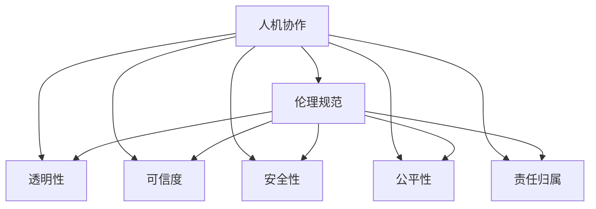

                 

# 人机协作：伦理规范与准则

> 关键词：人机协作, 伦理规范, 数据隐私, 透明性, 可信度, 安全性, 公平性, 责任归属

## 1. 背景介绍

### 1.1 问题由来
在信息化社会，人工智能(AI)技术的发展极大地提高了生产效率，改变了各行各业的运作模式。然而，AI系统的广泛应用也带来了诸多伦理和法律问题，尤其是人机协作过程中涉及的隐私保护、数据安全、公平性等难题。如何在技术进步的同时，保障社会公平正义，维护用户权益，成为了当前科技伦理研究的重点。

### 1.2 问题核心关键点
当前，随着AI技术在医疗、教育、金融等领域的深度应用，人机协作过程中的伦理规范和准则日益受到重视。以下核心问题成为研究的焦点：

- 如何平衡数据隐私与数据利用，保护用户隐私不被泄露。
- 如何提升AI系统的透明性和可信度，让用户明白AI如何做出决策。
- 如何保证AI系统的安全性，避免因技术漏洞导致数据泄露或系统崩溃。
- 如何确保AI系统在应用中的公平性，避免因算法偏见造成的不公正结果。
- 当AI系统发生错误时，如何明确责任归属，保障用户权益。

这些关键问题直接关系到AI技术的应用推广和落地效果，亟需从伦理和法律层面进行深入探讨和规范。

### 1.3 问题研究意义
构建伦理规范与准则，对于确保人机协作的公正、公平、透明和可控具有重要意义：

1. 促进技术合规性。通过制定伦理规范，指导AI开发者在技术研发中考虑伦理问题，确保技术应用符合法律法规和社会道德。
2. 提升用户信任度。伦理规范和透明性机制能够增强用户对AI系统的信任，推动技术的普及应用。
3. 保障用户权益。明确的伦理规范和责任归属机制，能有效保护用户隐私和数据安全，避免因技术失误造成的损失。
4. 推动AI技术的可持续发展。伦理规范有助于引导技术方向，避免因技术滥用导致的社会问题，实现科技与社会的和谐共进。

## 2. 核心概念与联系

### 2.1 核心概念概述

为更好理解人机协作中的伦理规范与准则，本节将介绍几个关键概念及其关联性：

- **人机协作(Human-Machine Collaboration)**：指人类与AI系统共同完成特定任务的过程，常见于决策支持、智能交互、自动化生产等领域。

- **伦理规范(Ethical Norms)**：指在AI系统开发、部署和应用过程中应遵守的道德标准和规范，确保技术应用的公正性和公平性。

- **透明性(Transparency)**：指AI系统的决策过程应对外界透明，用户应能理解AI如何得出特定决策。

- **可信度(Credibility)**：指AI系统在执行任务时应具备的可靠性、稳定性和有效性，用户应对其输出结果有足够的信任。

- **安全性(Security)**：指AI系统在运行过程中应具备的安全保障，防止数据泄露、系统攻击等风险。

- **公平性(Fairness)**：指AI系统在数据处理和决策过程中应避免偏见，确保不同用户或群体之间的公平对待。

- **责任归属(Responsibility)**：指当AI系统发生问题或造成损害时，责任归属问题及其法律责任划分。

这些核心概念之间的逻辑关系可以通过以下Mermaid流程图来展示：



这个流程图展示了一系列核心概念及其之间的关系：

1. 人机协作是所有问题的出发点，其他概念都是围绕人机协作展开。
2. 伦理规范是指导整个协作过程的道德准则。
3. 透明性、可信度、安全性、公平性是确保协作质量的关键要素。
4. 责任归属是对协作过程中出现问题时的法律保障。

## 3. 核心算法原理 & 具体操作步骤
### 3.1 算法原理概述

在人机协作中，AI系统的透明性、可信度和安全性是其核心要求。这些要求需要通过算法原理和技术手段加以实现。

- **透明性**：即AI系统应能够解释其决策过程，使用户明白其背后的逻辑。
- **可信度**：即AI系统应具备高精度的预测和决策能力，在可靠性、稳定性和有效性上符合用户需求。
- **安全性**：即AI系统应具备防护攻击、防范数据泄露的能力，确保数据和系统的安全。

### 3.2 算法步骤详解

**Step 1: 设计透明性算法**

- 使用可解释的模型：如决策树、线性回归等，提供清晰的决策边界和解释信息。
- 引入符号解释器：如LIME、SHAP等，分析模型输入与输出的关系。
- 设计预处理管道：对输入数据进行清洗和转换，确保模型解释结果的正确性。

**Step 2: 设计可信度算法**

- 使用高精度模型：如神经网络、支持向量机等，通过多轮迭代提升模型精度。
- 应用正则化技术：如L1正则、Dropout等，防止模型过拟合。
- 进行交叉验证：使用K折交叉验证评估模型泛化能力，选择最优模型。

**Step 3: 设计安全性算法**

- 加密数据传输：使用AES、RSA等加密算法保护数据安全。
- 防护攻击技术：如入侵检测系统(IDS)、异常检测算法等，检测和防范攻击。
- 数据备份和恢复：定期备份数据，确保数据丢失或损坏后能够快速恢复。

**Step 4: 设计公平性算法**

- 数据预处理：对数据进行去偏、标准化处理，减少数据偏差。
- 公平性评估指标：如均方误差、准确率等，监控模型性能。
- 公平性修正算法：如重加权、重采样等，调整模型以消除偏差。

**Step 5: 设计责任归属算法**

- 定义责任评估机制：明确AI系统在协作中的作用范围和权限。
- 设计责任归属流程：当系统出错时，根据预设规则评估责任。
- 法律保障措施：在合同中明确责任划分，建立法律纠纷解决机制。

### 3.3 算法优缺点

透明性、可信度、安全性、公平性和责任归属算法各自具有以下优缺点：

**透明性算法的优缺点**：

- 优点：提升用户对AI系统的信任度，确保决策过程公正透明。
- 缺点：复杂模型的解释可能不够准确，解释成本较高。

**可信度算法的优缺点**：

- 优点：提供高精度预测，确保协作质量。
- 缺点：模型复杂度高，训练和调参难度大。

**安全性算法的优缺点**：

- 优点：保护数据安全，避免系统漏洞。
- 缺点：加密和防护措施可能增加系统复杂度和资源消耗。

**公平性算法的优缺点**：

- 优点：消除数据偏差，提升协作公平性。
- 缺点：公平性调整可能影响模型性能，处理复杂数据集难度大。

**责任归属算法的优缺点**：

- 优点：明确责任归属，保障用户权益。
- 缺点：责任划分复杂，法律体系差异大，具体实施难度高。

### 3.4 算法应用领域

人机协作中的透明性、可信度、安全性、公平性和责任归属算法广泛应用于以下领域：

- **医疗领域**：确保AI诊断和治疗建议的透明性和可信度，保护患者隐私，明确医疗责任。
- **金融领域**：确保AI风险评估和投资建议的安全性，保护客户数据，明确金融机构责任。
- **教育领域**：确保AI教学和评估的公平性，保护学生隐私，明确教育机构责任。
- **智能制造**：确保AI在生产过程中的安全性，保护生产线数据，明确工厂责任。
- **智能家居**：确保AI智能设备的透明性和可信度，保护用户隐私，明确设备制造商责任。

## 4. 数学模型和公式 & 详细讲解 & 举例说明

### 4.1 数学模型构建

在人机协作的伦理规范与准则中，可以通过数学模型和公式来更精确地描述透明性、可信度、安全性、公平性和责任归属等概念。

- **透明性模型**：使用LIME等可解释性算法，对AI系统输出进行解释，建立输入与输出的关系。
- **可信度模型**：使用神经网络等高精度模型，训练预测函数，确保模型泛化能力。
- **安全性模型**：使用加密算法和异常检测算法，构建数据保护和安全防护体系。
- **公平性模型**：使用去偏、标准化处理等技术，调整模型以消除数据偏差。
- **责任归属模型**：使用责任评估算法，根据系统出错情况和作用范围，确定责任归属。

### 4.2 公式推导过程

以下我们以医疗领域的透明性和可信度模型为例，给出数学公式的推导过程。

**透明性模型**：

- 假设AI系统对输入数据 $x$ 输出预测结果 $y$，使用LIME算法对单个样本进行解释。LIME算法计算模型对 $x$ 的局部解释，得到可解释的决策边界 $g(x)$，使得：
  $$
  L(y, g(x)) = \min_{g(x)} L(y, g(x))
  $$
  其中 $L$ 为损失函数，如均方误差。

**可信度模型**：

- 假设使用神经网络对输入数据 $x$ 进行分类，输出结果为 $y$，使用交叉熵损失函数：
  $$
  \mathcal{L}(y, \hat{y}) = -\sum_{i=1}^n y_i\log \hat{y}_i
  $$
  其中 $\hat{y}$ 为网络输出，$y$ 为真实标签。

### 4.3 案例分析与讲解

以医疗领域的智能诊断系统为例，分析透明性、可信度和安全性模型的应用：

**透明性模型**：
- 输入数据：病人的症状、病史等。
- 输出结果：诊断结果和建议治疗方案。
- 解释信息：解释模型如何分析症状，得出诊断结果。
- 实现方式：使用决策树或LIME算法，对输入数据进行解释。

**可信度模型**：
- 输入数据：病人的症状、病史等。
- 输出结果：诊断结果和建议治疗方案。
- 实现方式：使用深度学习模型，如卷积神经网络(CNN)或循环神经网络(RNN)，对输入数据进行分类。
- 训练方式：使用大量标注数据进行训练，通过交叉验证评估模型泛化能力。

**安全性模型**：
- 输入数据：病人的敏感信息。
- 输出结果：安全存储和传输的加密数据。
- 实现方式：使用AES、RSA等加密算法，对数据进行加密和解密。
- 防护方式：使用IDS系统检测异常访问，防止数据泄露。

## 5. 项目实践：代码实例和详细解释说明

### 5.1 开发环境搭建

在进行透明性、可信度、安全性、公平性和责任归属算法的项目实践前，我们需要准备好开发环境。以下是使用Python进行Scikit-learn开发的环境配置流程：

1. 安装Anaconda：从官网下载并安装Anaconda，用于创建独立的Python环境。

2. 创建并激活虚拟环境：
```bash
conda create -n sklearn-env python=3.8 
conda activate sklearn-env
```

3. 安装Scikit-learn：
```bash
pip install scikit-learn
```

4. 安装其他工具包：
```bash
pip install numpy pandas matplotlib seaborn
```

完成上述步骤后，即可在`sklearn-env`环境中开始项目实践。

### 5.2 源代码详细实现

下面我们以医疗领域的透明性和可信度模型为例，给出Scikit-learn代码实现。

**透明性模型**：

```python
from sklearn.experimental import enable_iterative_imputer
from sklearn.ensemble import RandomForestClassifier
from sklearn.inspection import permutation_importance, partial_dependence

# 加载数据
from sklearn.datasets import load_iris
iris = load_iris()

# 使用随机森林建立模型
model = RandomForestClassifier(n_estimators=100, random_state=42)
model.fit(iris.data, iris.target)

# 对单个样本进行解释
x = iris.data[0]
prediction = model.predict([x])
explainer = permutation_importance(model, x)
print(explainer)
```

**可信度模型**：

```python
from sklearn.neural_network import MLPClassifier
from sklearn.model_selection import train_test_split
from sklearn.metrics import classification_report

# 加载数据
iris = load_iris()
X_train, X_test, y_train, y_test = train_test_split(iris.data, iris.target, test_size=0.2, random_state=42)

# 使用多层感知机建立模型
model = MLPClassifier(hidden_layer_sizes=(10, 10), activation='relu', solver='adam')
model.fit(X_train, y_train)

# 评估模型
y_pred = model.predict(X_test)
print(classification_report(y_test, y_pred))
```

### 5.3 代码解读与分析

让我们再详细解读一下关键代码的实现细节：

**透明性模型**：
- 使用`enable_iterative_imputer`模块，激活迭代填补算法，对缺失值进行处理。
- 使用`RandomForestClassifier`，建立随机森林分类器。
- 使用`permutation_importance`函数，计算模型的特征重要性。
- 输出特征重要性结果，解释模型对各个特征的依赖程度。

**可信度模型**：
- 使用`MLPClassifier`，建立多层感知机分类器。
- 使用`train_test_split`函数，划分训练集和测试集。
- 使用`classification_report`函数，输出模型的分类报告，评估模型性能。

**运行结果展示**：
- 透明性模型输出特征重要性结果，展示模型对各个特征的依赖程度。
- 可信度模型输出分类报告，展示模型在测试集上的性能。

可以看到，Scikit-learn提供了丰富的机器学习算法和评估工具，方便开发者进行透明性、可信度等模型的实现和评估。

## 6. 实际应用场景

### 6.1 医疗领域

医疗领域的AI系统，如智能诊断、治疗方案推荐等，需要高度透明、可信和安全的特性。透明性算法和可信度算法在此领域有着广泛的应用：

- **透明性**：帮助医生理解AI系统的决策过程，确保诊断的公正性。
- **可信度**：确保AI系统在诊断和治疗建议上的高精度和稳定性，减少误诊风险。

### 6.2 金融领域

金融领域的AI系统，如风险评估、投资建议等，需要确保数据安全和公平性。安全性算法和公平性算法在此领域起着关键作用：

- **安全性**：确保客户数据的加密和存储，防止数据泄露和系统攻击。
- **公平性**：避免因算法偏见导致的贷款审批不公，保护客户权益。

### 6.3 教育领域

教育领域的AI系统，如智能评估、个性化学习等，需要透明性和公平性：

- **透明性**：帮助学生和教师理解AI系统的评估和推荐逻辑，提升信任度。
- **公平性**：确保不同学生得到公平的学习资源和机会，避免教育不公。

### 6.4 未来应用展望

随着AI技术的进一步发展，透明性、可信度、安全性、公平性和责任归属算法将在更多领域得到应用，为人机协作带来新的变革。

- **智能交通**：确保自动驾驶系统的透明性和安全性，保护乘客和行人权益。
- **智能制造**：确保生产线AI系统的公平性，提升生产效率和质量。
- **智能家居**：确保智能设备的可信度和公平性，提升用户生活质量。
- **智能客服**：确保客服AI系统的透明性和责任归属，提升用户体验和满意度。

## 7. 工具和资源推荐

### 7.1 学习资源推荐

为帮助开发者系统掌握人机协作中的伦理规范与准则，以下是推荐的几个学习资源：

1. **《人工智能伦理规范与准则》**：详细介绍AI系统开发和应用中的伦理问题，并给出实际案例。
2. **《AI系统透明性和可信度评估》**：深入分析透明性和可信度算法的实现方法和应用场景。
3. **《数据隐私保护与法律合规》**：讲解数据隐私保护技术和法律法规，确保AI系统符合法律要求。
4. **《公平性与公正性算法》**：介绍公平性算法的实现方法和应用，提升AI系统的公平性。
5. **《责任归属与法律纠纷解决》**：解析AI系统责任归属问题，建立法律纠纷解决机制。

通过对这些资源的学习实践，相信你一定能够全面掌握人机协作中的伦理规范与准则，并用于解决实际的AI问题。

### 7.2 开发工具推荐

高效的开发离不开优秀的工具支持。以下是几款用于人机协作伦理规范与准则开发常用的工具：

1. **Python**：功能强大、灵活性高，是数据科学和机器学习的主流编程语言，广泛应用于各类算法开发。
2. **Scikit-learn**：强大的机器学习库，提供了丰富的算法和评估工具，方便开发者进行模型实现和评估。
3. **TensorFlow**：开源深度学习框架，提供了灵活的计算图和分布式训练支持，适用于大规模模型开发。
4. **PyTorch**：灵活、高效的深度学习框架，提供了动态计算图和自动微分功能，适合快速迭代研究。
5. **Weights & Biases**：模型训练实验跟踪工具，可以记录和可视化模型训练过程中的各项指标，方便对比和调优。
6. **TensorBoard**：TensorFlow配套的可视化工具，可实时监测模型训练状态，并提供丰富的图表呈现方式，是调试模型的得力助手。

合理利用这些工具，可以显著提升人机协作伦理规范与准则的开发效率，加快创新迭代的步伐。

### 7.3 相关论文推荐

人机协作伦理规范与准则的研究源于学界的持续研究。以下是几篇奠基性的相关论文，推荐阅读：

1. **《人工智能的伦理挑战》**：总结了AI系统在应用中面临的伦理问题，提出了相应的解决方案。
2. **《透明性在AI系统中的应用》**：详细分析了透明性算法的实现方法和应用场景，提供了实际案例。
3. **《可信度在AI系统中的重要性》**：探讨了可信度算法在确保系统可靠性和稳定性中的作用，并给出了优化建议。
4. **《数据隐私保护技术》**：介绍了数据加密和隐私保护技术，确保AI系统符合数据隐私保护要求。
5. **《公平性与公正性算法》**：介绍了公平性算法的实现方法和应用，确保AI系统的公平性和公正性。
6. **《责任归属与法律纠纷解决》**：解析了AI系统责任归属问题，建立了法律纠纷解决机制，确保系统合规性。

这些论文代表了大语言模型微调技术的发展脉络。通过学习这些前沿成果，可以帮助研究者把握学科前进方向，激发更多的创新灵感。

## 8. 总结：未来发展趋势与挑战

### 8.1 总结

本文对基于监督学习的人机协作伦理规范与准则进行了全面系统的介绍。首先阐述了人机协作和伦理规范的重要性，明确了透明性、可信度、安全性、公平性和责任归属等核心问题。其次，从原理到实践，详细讲解了透明性、可信度、安全性、公平性和责任归属算法的构建方法和实现细节，给出了代码实例和详细解读。同时，本文还广泛探讨了这些算法在医疗、金融、教育等领域的实际应用，展示了其广阔的前景。

通过本文的系统梳理，可以看到，人机协作中的伦理规范与准则正在成为AI技术应用的重要保障，其相关算法的研究和实践将极大提升系统的公平性、透明性和安全性。未来，伴随技术的持续演进，这些规范和准则将进一步完善和优化，为人机协作的可持续发展提供有力保障。

### 8.2 未来发展趋势

展望未来，人机协作中的伦理规范与准则将呈现以下几个发展趋势：

1. **数据隐私保护技术**：随着数据泄露事件的频发，数据隐私保护技术将得到更加广泛的重视和应用。未来将涌现更多高效、安全的数据保护算法，确保用户隐私不被泄露。

2. **透明性和可信度提升**：透明性算法和可信度算法将在更多领域得到应用，提升用户对AI系统的信任度。未来将发展更多可解释和高效的模型，确保AI系统的决策过程透明和可信。

3. **安全性体系建设**：AI系统的安全性问题将成为重中之重。未来将开发更完善的防护体系，确保系统在运行过程中不遭受攻击和数据泄露。

4. **公平性评估工具**：公平性评估工具将不断优化，确保AI系统在应用中的公平性。未来将引入更多公平性指标和算法，消除数据偏差和算法偏见。

5. **责任归属机制完善**：AI系统的责任归属问题将进一步明确。未来将建立更完善的责任评估机制，确保在AI系统出错时能够清晰界定责任。

### 8.3 面临的挑战

尽管人机协作中的伦理规范与准则已经取得了一定进展，但在实际应用中仍面临诸多挑战：

1. **数据隐私保护**：在确保数据利用的同时，如何保护用户隐私，避免数据滥用，是一个复杂且棘手的问题。需要制定更加严格的数据隐私保护法规和技术手段。

2. **透明性和可信度实现**：如何使AI系统在保证高精度的同时，具备透明性和可信度，是一个技术难题。需要开发更多高效的可解释性算法和模型。

3. **安全性防护**：AI系统的安全性问题需要多重防护，但当前的防护技术仍存在漏洞，攻击和数据泄露事件时有发生。需要不断更新防护策略和技术。

4. **公平性消除**：AI系统中的算法偏见问题仍未完全解决，公平性问题需要进一步深入研究和技术优化。

5. **责任归属明确**：当AI系统出错时，责任归属问题复杂，需要建立明确的责任评估机制和纠纷解决机制。

### 8.4 研究展望

面对人机协作中的伦理规范与准则所面临的诸多挑战，未来的研究需要在以下几个方面寻求新的突破：

1. **数据隐私保护**：开发更加高效的数据隐私保护算法，确保数据在利用和共享过程中不被泄露。

2. **透明性和可信度算法**：开发更多高效、可解释的透明性和可信度算法，提升用户对AI系统的信任度。

3. **安全性体系**：构建更完善的AI系统安全性防护体系，确保系统在运行过程中不遭受攻击和数据泄露。

4. **公平性评估工具**：开发更加公平性指标和算法，消除数据偏差和算法偏见，确保AI系统的公平性和公正性。

5. **责任归属机制**：建立更完善的责任评估机制和纠纷解决机制，确保在AI系统出错时能够清晰界定责任，保护用户权益。

这些研究方向的探索，必将引领人机协作中的伦理规范与准则迈向更高的台阶，为构建安全、可靠、可解释、可控的智能系统铺平道路。面向未来，我们需要从技术、法律、伦理等多个维度协同发力，共同推动人机协作的可持续发展。

## 9. 附录：常见问题与解答

**Q1：如何平衡数据隐私与数据利用？**

A: 在数据利用过程中，可以通过数据匿名化、去标识化等技术，减少数据泄露风险。同时，制定严格的数据使用协议和隐私保护法规，确保数据仅用于合法目的。

**Q2：如何提升AI系统的透明性和可信度？**

A: 使用可解释性算法，如LIME、SHAP等，对模型输出进行解释，确保用户能够理解AI系统的决策过程。同时，使用高精度模型，如神经网络、支持向量机等，提升模型的可信度。

**Q3：如何保证AI系统的安全性？**

A: 使用加密算法和异常检测技术，保护数据传输和存储的安全。同时，建立入侵检测系统(IDS)和防火墙等防护措施，确保系统在运行过程中不遭受攻击。

**Q4：如何确保AI系统的公平性？**

A: 使用数据预处理技术，如去偏、标准化处理等，消除数据偏差。同时，引入公平性评估指标，监控模型性能，调整模型以消除偏差。

**Q5：AI系统出错时，如何确定责任归属？**

A: 在合同中明确AI系统的作用范围和权限，建立责任评估机制。当系统出错时，根据预设规则和合同约定，明确责任归属，并建立法律纠纷解决机制。

---

作者：禅与计算机程序设计艺术 / Zen and the Art of Computer Programming

