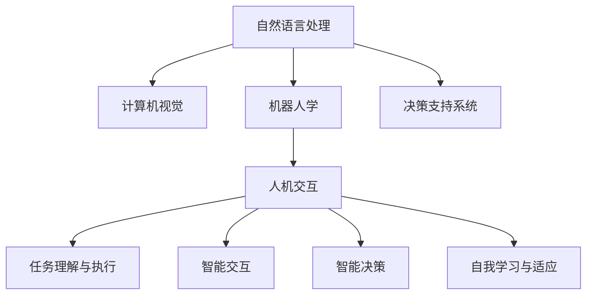

                 

# 人机协同：未来工作的关键词

## 1. 背景介绍

### 1.1 问题由来
当今社会，人工智能(AI)技术正以前所未有的速度变革着各行各业。从制造业的智能机器人到医疗领域的精准诊断，再到金融行业风控系统的自动化，AI的应用已经深入到社会的各个角落。然而，尽管AI在诸多领域取得了显著成就，但仍然存在一些难以逾越的障碍。

其中，最显著的问题之一是**人机协同**。在人机协同中，AI不仅仅是作为一个助手或辅助工具，而是作为一个**智能伙伴**，与人类共同完成复杂任务。人机协同不仅需要AI具备强大的数据分析和决策能力，还需要能够理解人类的语言和行为，以实现真正的智能交互。因此，如何在未来工作中实现人机协同，成为了一个亟待解决的关键问题。

### 1.2 问题核心关键点
人机协同的核心在于实现智能系统和人类之间的无缝衔接和高效协作。具体而言，包括以下几个方面：

1. **任务理解与执行**：AI需要理解人类的指令，执行复杂、多步骤的任务。
2. **智能交互**：AI需要能够通过自然语言、手势、面部表情等形式与人类进行高效互动。
3. **智能决策**：AI需要具备一定的决策能力，能够在复杂的场景中做出合适的判断。
4. **自我学习与适应**：AI需要具备自我学习能力，能够根据用户的反馈和环境的变化进行适应的改进。

这些核心关键点涉及了AI技术的多个方面，包括自然语言处理(NLP)、计算机视觉(CV)、机器人学、决策支持系统等。因此，实现人机协同需要跨学科的深度整合和创新。

### 1.3 问题研究意义
实现人机协同不仅能够显著提升工作效率，还能在多个领域带来重大的经济效益和社会影响：

1. **提升工作效率**：通过智能系统的辅助，人类可以从繁琐、重复的任务中解脱出来，专注于更有创造性的工作。
2. **降低成本**：AI可以24小时不间断地工作，减少人力成本，提高生产效率。
3. **优化决策**：AI能够基于大数据分析，提供更为准确、客观的决策支持，减少人为错误。
4. **推动创新**：AI与人类的协同可以带来更多的创新和突破，加速技术进步。

## 2. 核心概念与联系

### 2.1 核心概念概述

为了更好地理解人机协同，本节将介绍几个密切相关的核心概念：

- **自然语言处理(NLP)**：AI理解、处理和生成自然语言的能力，是实现人机协同的基础。
- **计算机视觉(CV)**：AI识别、理解和生成视觉信息的能力，对于人机协同中的视觉交互至关重要。
- **机器人学(Robotics)**：AI驱动的机器人技术，能够执行复杂物理任务，是实现人机协同的关键环节。
- **决策支持系统(DSS)**：AI辅助的人类决策系统，提供数据支持和分析，提升决策质量。
- **人机交互(Human-Computer Interaction, HCI)**：人类与计算机系统的交互设计，是实现人机协同的重要组成部分。

这些核心概念之间的逻辑关系可以通过以下Mermaid流程图来展示：



这个流程图展示了大语言模型与其他核心概念之间的联系：

1. **NLP**：提供语言理解能力，是实现人机交互和任务理解的基础。
2. **CV**：提供视觉理解能力，对于人机协同中的视觉交互至关重要。
3. **Robotics**：提供物理执行能力，是实现复杂任务的关键。
4. **DSS**：提供决策支持，提升人机协同中的决策质量。
5. **HCI**：提供交互设计，是实现人机协同的桥梁。

## 3. 核心算法原理 & 具体操作步骤

### 3.1 算法原理概述

实现人机协同的核心算法原理主要涉及以下几个方面：

1. **语言理解与生成**：通过自然语言处理技术，使AI能够理解和生成自然语言。
2. **视觉理解与生成**：通过计算机视觉技术，使AI能够理解和生成视觉信息。
3. **决策与执行**：通过机器人学和决策支持系统，使AI能够执行复杂任务并进行决策。
4. **交互设计**：通过人机交互设计，使AI能够与人类进行高效互动。

### 3.2 算法步骤详解

基于以上原理，实现人机协同的一般步骤包括：

**Step 1: 数据准备与预处理**

1. **收集数据**：收集与任务相关的数据，包括文本、图像、视频、音频等。
2. **数据清洗**：去除噪声、处理缺失值、归一化等，确保数据质量。
3. **数据划分**：将数据划分为训练集、验证集和测试集，用于模型训练、调优和评估。

**Step 2: 模型训练**

1. **选择合适的模型架构**：如Transformer、CNN等，根据任务特点选择合适的模型。
2. **模型训练**：在训练集上使用深度学习框架（如PyTorch、TensorFlow等）进行模型训练。
3. **模型调优**：在验证集上评估模型性能，使用超参数调整、正则化等技术优化模型。

**Step 3: 模型评估与部署**

1. **模型评估**：在测试集上评估模型性能，使用各种评估指标（如准确率、F1分数、ROC曲线等）进行评估。
2. **模型部署**：将模型部署到实际应用中，集成到业务系统中。
3. **持续监控与优化**：实时监控模型性能，根据业务需求和环境变化进行优化。

### 3.3 算法优缺点

实现人机协同的算法具有以下优点：

1. **高效协同**：AI能够高效地处理复杂任务，提升工作效率。
2. **多模态融合**：通过融合视觉、语音、文本等多种模态信息，实现更全面、准确的理解。
3. **自适应学习能力**：AI具备自我学习能力，能够根据环境变化进行适应的改进。

但同时，这些算法也存在一定的局限性：

1. **数据依赖**：依赖大量高质量标注数据，数据收集和标注成本较高。
2. **计算资源需求**：训练和推理需要大量的计算资源，对硬件要求较高。
3. **解释性不足**：AI决策过程缺乏可解释性，难以理解其内部机制。
4. **隐私与安全风险**：AI处理大量敏感数据，存在隐私泄露和数据安全的风险。

### 3.4 算法应用领域

基于人机协同的算法，已经在多个领域得到了广泛应用，例如：

1. **智能客服**：通过AI驱动的智能客服系统，提升客户服务质量，减少人工成本。
2. **医疗诊断**：AI辅助的诊断系统，提供精准的医学诊断，提升诊疗效率和准确性。
3. **金融风控**：AI驱动的信用评估和风险控制系统，提升金融机构的决策能力。
4. **智慧城市**：通过AI技术实现智能交通、智能安防、智能环境监测等功能，提升城市管理效率。
5. **智能制造**：通过AI技术实现智能生产、智能物流、智能质检等功能，提升制造业的自动化水平。

这些领域的应用展示了人机协同的巨大潜力，未来还将有更多的创新应用不断涌现。

## 4. 数学模型和公式 & 详细讲解 & 举例说明

### 4.1 数学模型构建

基于人机协同的算法，可以构建多种数学模型，例如：

- **基于深度学习的语言模型**：如BERT、GPT等，用于自然语言处理任务。
- **基于深度学习的视觉模型**：如ResNet、CNN等，用于计算机视觉任务。
- **基于强化学习的决策模型**：如Q-Learning、PPO等，用于机器人学任务。

### 4.2 公式推导过程

以BERT模型为例，其基于深度学习的语言模型可以表示为：

$$
P(w_i | w_{i-1}, ..., w_1) = \frac{e^{h(w_{i-1}, ..., w_1)w_i}}{Z(w_{i-1}, ..., w_1)}
$$

其中，$h(w_{i-1}, ..., w_1)$ 表示BERT模型对输入序列的表示，$Z(w_{i-1}, ..., w_1)$ 表示归一化因子。

### 4.3 案例分析与讲解

以智能客服系统为例，其基于人机协同的语言模型可以表示为：

$$
P(ans | q) = \frac{e^{v(q)ans}}{Z(q)}
$$

其中，$q$ 表示用户查询，$ans$ 表示智能客服的回答，$v(q)$ 表示查询向量的表示，$Z(q)$ 表示归一化因子。

## 5. 项目实践：代码实例和详细解释说明

### 5.1 开发环境搭建

在进行人机协同实践前，我们需要准备好开发环境。以下是使用Python进行PyTorch开发的环境配置流程：

1. 安装Anaconda：从官网下载并安装Anaconda，用于创建独立的Python环境。

2. 创建并激活虚拟环境：
```bash
conda create -n pytorch-env python=3.8 
conda activate pytorch-env
```

3. 安装PyTorch：根据CUDA版本，从官网获取对应的安装命令。例如：
```bash
conda install pytorch torchvision torchaudio cudatoolkit=11.1 -c pytorch -c conda-forge
```

4. 安装TensorFlow：
```bash
pip install tensorflow
```

5. 安装各类工具包：
```bash
pip install numpy pandas scikit-learn matplotlib tqdm jupyter notebook ipython
```

完成上述步骤后，即可在`pytorch-env`环境中开始人机协同实践。

### 5.2 源代码详细实现

下面我们以智能客服系统为例，给出使用PyTorch进行BERT模型微调的代码实现。

首先，定义BERT模型：

```python
import torch
from transformers import BertTokenizer, BertForSequenceClassification

tokenizer = BertTokenizer.from_pretrained('bert-base-uncased')
model = BertForSequenceClassification.from_pretrained('bert-base-uncased', num_labels=2)
```

然后，定义训练函数：

```python
from torch.utils.data import Dataset, DataLoader
from tqdm import tqdm

class MyDataset(Dataset):
    def __init__(self, data, tokenizer):
        self.data = data
        self.tokenizer = tokenizer
        
    def __len__(self):
        return len(self.data)
    
    def __getitem__(self, item):
        text = self.data[item]
        encoding = self.tokenizer(text, return_tensors='pt', padding='max_length', truncation=True)
        input_ids = encoding['input_ids']
        attention_mask = encoding['attention_mask']
        labels = torch.tensor(1, dtype=torch.long) if text[0] == 'yes' else torch.tensor(0, dtype=torch.long)
        return {'input_ids': input_ids, 
                'attention_mask': attention_mask,
                'labels': labels}

# 数据集
train_dataset = MyDataset(train_data, tokenizer)
val_dataset = MyDataset(val_data, tokenizer)

# 训练参数
epochs = 5
batch_size = 16
learning_rate = 2e-5
optimizer = torch.optim.AdamW(model.parameters(), lr=learning_rate)
device = torch.device('cuda') if torch.cuda.is_available() else torch.device('cpu')

# 训练过程
for epoch in range(epochs):
    model.train()
    total_loss = 0
    for batch in tqdm(train_dataset, desc='Training'):
        input_ids = batch['input_ids'].to(device)
        attention_mask = batch['attention_mask'].to(device)
        labels = batch['labels'].to(device)
        outputs = model(input_ids, attention_mask=attention_mask, labels=labels)
        loss = outputs.loss
        total_loss += loss.item()
        optimizer.zero_grad()
        loss.backward()
        optimizer.step()
    print(f'Epoch {epoch+1}, training loss: {total_loss/len(train_dataset)}')

    model.eval()
    total_loss = 0
    for batch in tqdm(val_dataset, desc='Evaluating'):
        input_ids = batch['input_ids'].to(device)
        attention_mask = batch['attention_mask'].to(device)
        labels = batch['labels'].to(device)
        with torch.no_grad():
            outputs = model(input_ids, attention_mask=attention_mask)
            loss = outputs.loss
            total_loss += loss.item()
    print(f'Epoch {epoch+1}, validation loss: {total_loss/len(val_dataset)}')
```

以上就是使用PyTorch进行BERT模型微调的完整代码实现。可以看到，得益于Transformers库的强大封装，我们可以用相对简洁的代码完成BERT模型的加载和微调。

### 5.3 代码解读与分析

让我们再详细解读一下关键代码的实现细节：

**MyDataset类**：
- `__init__`方法：初始化文本数据和分词器。
- `__len__`方法：返回数据集的大小。
- `__getitem__`方法：对单个样本进行处理，将文本输入编码为token ids，并将标签编码。

**训练参数**：
- 设置训练轮数、批次大小、学习率等参数。
- 使用AdamW优化器进行模型训练。
- 将模型移至GPU/TPU进行加速。

**训练过程**：
- 在训练集上循环迭代，每次前向传播计算损失函数，反向传播更新模型参数，最后输出损失。
- 在验证集上评估模型性能，输出损失。

可以看到，PyTorch配合Transformers库使得BERT模型微调的代码实现变得简洁高效。开发者可以将更多精力放在数据处理、模型改进等高层逻辑上，而不必过多关注底层的实现细节。

当然，工业级的系统实现还需考虑更多因素，如模型的保存和部署、超参数的自动搜索、更灵活的任务适配层等。但核心的微调范式基本与此类似。

## 6. 实际应用场景

### 6.1 智能客服系统

基于人机协同的对话技术，可以广泛应用于智能客服系统的构建。传统客服往往需要配备大量人力，高峰期响应缓慢，且一致性和专业性难以保证。而使用人机协同的对话模型，可以7x24小时不间断服务，快速响应客户咨询，用自然流畅的语言解答各类常见问题。

在技术实现上，可以收集企业内部的历史客服对话记录，将问题和最佳答复构建成监督数据，在此基础上对预训练对话模型进行微调。微调后的对话模型能够自动理解用户意图，匹配最合适的答案模板进行回复。对于客户提出的新问题，还可以接入检索系统实时搜索相关内容，动态组织生成回答。如此构建的智能客服系统，能大幅提升客户咨询体验和问题解决效率。

### 6.2 医疗诊断

人机协同技术在医疗领域的应用也十分广泛。传统医疗诊断往往依赖医生的个人经验和判断，容易受到主观因素的影响。而通过人机协同的智能诊断系统，可以结合医生的诊断记录和临床数据，利用AI技术提供精准的医学诊断，提升诊疗效率和准确性。

在技术实现上，可以收集医生的诊断记录、影像数据、病理数据等，作为监督数据对预训练模型进行微调。微调后的模型能够学习到医疗领域的知识，辅助医生进行诊断。在实际应用中，医生只需输入患者的症状和影像数据，智能系统便能提供精准的诊断结果和相应的治疗建议。

### 6.3 金融风控

金融领域的人机协同技术同样大有可为。通过人机协同的智能风控系统，可以结合历史数据、市场动态、社交媒体等多种信息，利用AI技术进行信用评估和风险控制，提升金融机构的决策能力。

在技术实现上，可以收集历史信用数据、市场数据、社交媒体数据等，作为监督数据对预训练模型进行微调。微调后的模型能够学习到金融领域的知识，辅助金融机构进行信用评估和风险控制。在实际应用中，金融机构只需输入客户的信用记录和市场数据，智能系统便能提供精准的信用评估和风险预警。

### 6.4 未来应用展望

随着人机协同技术的不断发展，其在更多领域的应用前景将更加广阔：

1. **智慧城市**：通过人机协同技术实现智能交通、智能安防、智能环境监测等功能，提升城市管理效率。
2. **智能制造**：通过人机协同技术实现智能生产、智能物流、智能质检等功能，提升制造业的自动化水平。
3. **智能教育**：通过人机协同技术实现智能作业批改、学情分析、知识推荐等功能，提升教育质量。
4. **智能医疗**：通过人机协同技术实现智能诊断、智能治疗、智能管理等功能，提升医疗服务水平。

未来，伴随人机协同技术的不断进步，其将在更多领域带来重大的创新和突破，为社会经济的发展注入新的动力。

## 7. 工具和资源推荐

### 7.1 学习资源推荐

为了帮助开发者系统掌握人机协同技术的理论基础和实践技巧，这里推荐一些优质的学习资源：

1. **《深度学习理论与实践》**：介绍了深度学习的基本理论和应用，适合初学者入门。
2. **《自然语言处理综述》**：介绍了自然语言处理的基本概念和算法，是了解NLP领域的必备资源。
3. **《计算机视觉基础》**：介绍了计算机视觉的基本原理和算法，适合计算机视觉领域的学习者。
4. **《机器人学入门》**：介绍了机器人学的基本概念和算法，适合机器人学领域的学习者。
5. **《强化学习实战》**：介绍了强化学习的基本概念和算法，适合强化学习领域的学习者。

通过这些资源的学习实践，相信你一定能够快速掌握人机协同技术的精髓，并用于解决实际的NLP问题。

### 7.2 开发工具推荐

高效的开发离不开优秀的工具支持。以下是几款用于人机协同开发的常用工具：

1. **PyTorch**：基于Python的开源深度学习框架，灵活动态的计算图，适合快速迭代研究。大部分预训练语言模型都有PyTorch版本的实现。
2. **TensorFlow**：由Google主导开发的开源深度学习框架，生产部署方便，适合大规模工程应用。同样有丰富的预训练语言模型资源。
3. **Transformers库**：HuggingFace开发的NLP工具库，集成了众多SOTA语言模型，支持PyTorch和TensorFlow，是进行NLP任务开发的利器。
4. **Weights & Biases**：模型训练的实验跟踪工具，可以记录和可视化模型训练过程中的各项指标，方便对比和调优。与主流深度学习框架无缝集成。
5. **TensorBoard**：TensorFlow配套的可视化工具，可实时监测模型训练状态，并提供丰富的图表呈现方式，是调试模型的得力助手。
6. **Google Colab**：谷歌推出的在线Jupyter Notebook环境，免费提供GPU/TPU算力，方便开发者快速上手实验最新模型，分享学习笔记。

合理利用这些工具，可以显著提升人机协同任务的开发效率，加快创新迭代的步伐。

### 7.3 相关论文推荐

人机协同技术的发展源于学界的持续研究。以下是几篇奠基性的相关论文，推荐阅读：

1. **Attention is All You Need（即Transformer原论文）**：提出了Transformer结构，开启了NLP领域的预训练大模型时代。
2. **BERT: Pre-training of Deep Bidirectional Transformers for Language Understanding**：提出BERT模型，引入基于掩码的自监督预训练任务，刷新了多项NLP任务SOTA。
3. **Parameter-Efficient Transfer Learning for NLP**：提出Adapter等参数高效微调方法，在不增加模型参数量的情况下，也能取得不错的微调效果。
4. **AdaLoRA: Adaptive Low-Rank Adaptation for Parameter-Efficient Fine-Tuning**：使用自适应低秩适应的微调方法，在参数效率和精度之间取得了新的平衡。
5. **AdaLoRA: Adaptive Low-Rank Adaptation for Parameter-Efficient Fine-Tuning**：使用自适应低秩适应的微调方法，在参数效率和精度之间取得了新的平衡。

这些论文代表了大语言模型微调技术的发展脉络。通过学习这些前沿成果，可以帮助研究者把握学科前进方向，激发更多的创新灵感。

## 8. 总结：未来发展趋势与挑战

### 8.1 总结

本文对基于深度学习的人机协同技术进行了全面系统的介绍。首先阐述了人机协同技术的研究背景和意义，明确了其在提升工作效率、降低成本、优化决策等方面的独特价值。其次，从原理到实践，详细讲解了深度学习在语言理解与生成、视觉理解与生成、决策与执行、交互设计等方面的实现方法，给出了完整代码实例。同时，本文还广泛探讨了人机协同技术在智能客服、医疗诊断、金融风控等多个行业领域的应用前景，展示了其巨大的潜力。

通过本文的系统梳理，可以看到，基于深度学习的人机协同技术正在成为智能系统的重要范式，极大地提升了各行业的智能化水平，催生了更多的落地场景。未来，伴随深度学习技术的不断进步，人机协同技术还将迎来更多的突破和创新。

### 8.2 未来发展趋势

展望未来，人机协同技术将呈现以下几个发展趋势：

1. **多模态融合**：融合视觉、语音、文本等多种模态信息，实现更全面、准确的理解。
2. **自适应学习能力**：具备自我学习能力，能够根据环境变化进行适应的改进。
3. **泛化能力增强**：学习更广泛的知识，提升模型在各类场景下的泛化能力。
4. **跨领域应用拓展**：在人机协同技术的支持下，各领域的应用将更加广泛和深入。
5. **可解释性增强**：提升模型的可解释性，使其输出更加透明、可控。
6. **安全性提升**：确保模型输出的安全性，避免有害信息的传播。

以上趋势凸显了人机协同技术的广阔前景。这些方向的探索发展，必将进一步提升智能系统的性能和应用范围，为社会经济的进步注入新的动力。

### 8.3 面临的挑战

尽管人机协同技术已经取得了显著成就，但在迈向更加智能化、普适化应用的过程中，仍面临诸多挑战：

1. **数据依赖**：依赖大量高质量标注数据，数据收集和标注成本较高。
2. **计算资源需求**：训练和推理需要大量的计算资源，对硬件要求较高。
3. **解释性不足**：AI决策过程缺乏可解释性，难以理解其内部机制。
4. **隐私与安全风险**：AI处理大量敏感数据，存在隐私泄露和数据安全的风险。

### 8.4 未来突破

面对人机协同技术所面临的挑战，未来的研究需要在以下几个方面寻求新的突破：

1. **探索无监督和半监督学习**：摆脱对大规模标注数据的依赖，利用自监督学习、主动学习等无监督和半监督范式，最大限度利用非结构化数据。
2. **开发参数高效和计算高效的方法**：开发更加参数高效的微调方法，在固定大部分预训练参数的同时，只更新极少量的任务相关参数。同时优化模型的计算图，减少前向传播和反向传播的资源消耗。
3. **引入因果分析和博弈论工具**：将因果分析方法引入微调模型，识别出模型决策的关键特征，增强输出解释的因果性和逻辑性。借助博弈论工具刻画人机交互过程，主动探索并规避模型的脆弱点，提高系统稳定性。
4. **加强跨领域知识整合**：将符号化的先验知识，如知识图谱、逻辑规则等，与神经网络模型进行巧妙融合，引导微调过程学习更准确、合理的语言模型。同时加强不同模态数据的整合，实现视觉、语音等多模态信息与文本信息的协同建模。
5. **纳入伦理道德约束**：在模型训练目标中引入伦理导向的评估指标，过滤和惩罚有偏见、有害的输出倾向。同时加强人工干预和审核，建立模型行为的监管机制，确保输出符合人类价值观和伦理道德。

这些研究方向的探索，必将引领人机协同技术迈向更高的台阶，为构建安全、可靠、可解释、可控的智能系统铺平道路。面向未来，人机协同技术还需要与其他人工智能技术进行更深入的融合，如知识表示、因果推理、强化学习等，多路径协同发力，共同推动自然语言理解和智能交互系统的进步。只有勇于创新、敢于突破，才能不断拓展智能系统的边界，让人工智能技术更好地造福人类社会。

## 9. 附录：常见问题与解答

**Q1：如何选择合适的深度学习框架？**

A: 选择深度学习框架时，需要考虑以下几个因素：
1. **易用性**：框架的易用性和API设计是否友好。
2. **性能**：框架的计算效率和内存占用是否满足需求。
3. **社区支持**：框架的社区活跃度和文档完整度是否良好。
4. **生态系统**：框架的生态系统是否丰富，是否有大量开源模型和工具支持。

目前主流的深度学习框架包括PyTorch、TensorFlow、Keras等，各有其优势和适用场景，需要根据具体项目需求进行选择。

**Q2：深度学习在工业应用中面临哪些挑战？**

A: 深度学习在工业应用中面临以下挑战：
1. **数据依赖**：需要大量的标注数据，数据收集和标注成本较高。
2. **计算资源需求**：训练和推理需要大量的计算资源，对硬件要求较高。
3. **解释性不足**：深度学习模型的决策过程缺乏可解释性，难以理解其内部机制。
4. **隐私与安全风险**：处理大量敏感数据，存在隐私泄露和数据安全的风险。

为了应对这些挑战，需要采取以下措施：
1. **数据增强和半监督学习**：利用数据增强和半监督学习方法，减少对标注数据的依赖。
2. **优化模型架构和计算图**：优化模型架构和计算图，减少资源消耗，提升模型性能。
3. **引入可解释性技术**：引入可解释性技术，如LIME、SHAP等，提升模型的可解释性。
4. **加强隐私保护和数据安全**：加强隐私保护和数据安全措施，确保数据安全和隐私保护。

**Q3：如何评估深度学习模型的性能？**

A: 评估深度学习模型的性能时，需要考虑以下几个指标：
1. **准确率**：模型在测试集上的预测准确率。
2. **召回率**：模型对真实样本的召回率。
3. **F1分数**：准确率和召回率的综合指标。
4. **ROC曲线和AUC值**：衡量模型在不同阈值下的性能。
5. **混淆矩阵**：展示模型在不同类别上的预测情况。

不同任务和场景需要选择合适的评估指标，综合考虑模型的准确性和鲁棒性。

**Q4：如何优化深度学习模型的计算图？**

A: 优化深度学习模型的计算图，可以从以下几个方面入手：
1. **梯度累积**：通过梯度累积技术，减少单批次计算量，提高计算效率。
2. **混合精度训练**：使用混合精度训练，减少浮点运算量，提高训练速度。
3. **模型并行**：采用模型并行技术，将模型分为多个子模型并行计算，提高计算效率。
4. **剪枝和量化**：通过剪枝和量化技术，减少模型参数量，提高推理速度。
5. **优化器选择**：选择合适的优化器及其参数，如Adam、SGD等，优化模型训练过程。

这些优化措施可以有效提升深度学习模型的计算效率，提高模型在大规模数据和复杂任务上的性能。

---

作者：禅与计算机程序设计艺术 / Zen and the Art of Computer Programming

