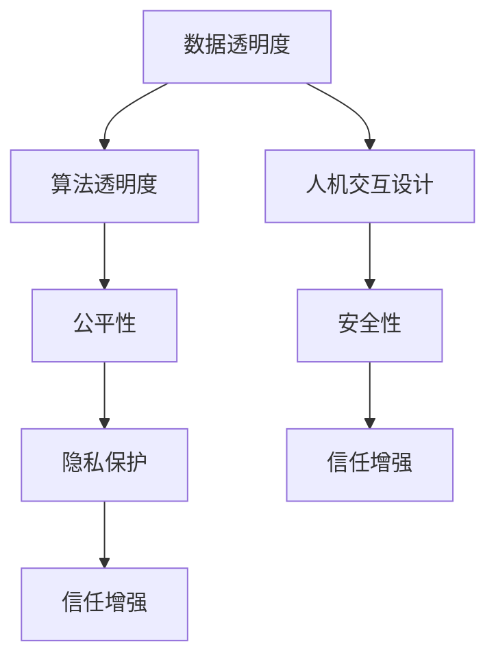

                 

# 人类-AI协作：增强人类与机器之间的信任

> 关键词：人类-AI协作,信任增强,机器学习,深度学习,协作系统,人工智能伦理,AI辅助决策

## 1. 背景介绍

### 1.1 问题由来

随着人工智能(AI)技术的发展，人类与机器的协作方式正在发生深刻变革。AI正在成为各行各业的重要助力，从医疗到金融，从教育到交通，无处不在。然而，这种协作关系的背后，隐藏着人类与机器之间的信任问题。

人工智能系统由算法、数据和计算资源组成，其决策过程往往难以解释和理解。这使得人类在依赖AI时，面临着技术的不确定性和结果的可信度问题。如何增强人类与机器之间的信任，构建可靠、透明、可解释的AI系统，成为当前AI技术发展的重要课题。

### 1.2 问题核心关键点

信任问题是一个复杂的系统问题，涉及到人类认知、技术实现、社会伦理等多个层面。增强人类与机器之间的信任，需要从以下几个关键点进行综合考量：

- **数据透明度**：保证数据的来源、处理过程和最终结果的可解释性。
- **算法透明度**：使算法决策的依据和推理过程透明可见。
- **人机交互设计**：设计用户友好的界面和交互方式，增强用户体验和可操作性。
- **公平性**：确保算法不歧视任何特定群体，保证输出结果的公平公正。
- **安全性和隐私保护**：防止数据泄露和算法滥用，保护用户隐私和数据安全。

这些关键点相互关联，共同构成了一个综合的信任增强体系。只有在这几个维度上都得到有效管理，才能实现人类与机器之间的可靠协作。

### 1.3 问题研究意义

增强人类与机器之间的信任，对于推动AI技术的广泛应用和深入发展，具有重要意义：

1. **提升用户体验**：透明可解释的AI系统能够更好地满足用户需求，提升用户信任度。
2. **促进技术普及**：通过增强信任，AI技术能够更好地融入各行各业，加速其应用进程。
3. **维护社会安全**：防止算法偏见和滥用，保护社会公平和稳定。
4. **推动创新发展**：增强信任能够激励更多人参与AI研究和技术创新，推动AI技术进步。

综上所述，增强人类与机器之间的信任，是AI技术落地应用和持续发展的基石。

## 2. 核心概念与联系

### 2.1 核心概念概述

为更好地理解增强人类与机器之间信任的实现路径，本节将介绍几个关键概念及其相互联系：

- **人类-AI协作**：指人类与AI系统共同完成复杂任务的协作关系。
- **可解释性**：指AI系统输出结果的可解释性和理解性，即解释算法决策过程的依据。
- **透明性**：指AI系统内部操作和决策过程的透明可见性，即数据流、算法逻辑等清晰可查。
- **公平性**：指AI系统输出结果的公平性，即不偏不倚，不歧视任何特定群体。
- **安全性**：指AI系统输出的结果及算法实现的安全性，即防止数据泄露和算法滥用。
- **隐私保护**：指保护用户隐私和数据安全，防止未经授权的数据访问和使用。

这些概念之间相互关联，共同构成了一个综合的信任增强体系。通过理解这些核心概念，我们可以更好地把握增强人类与机器之间信任的关键要素。

### 2.2 核心概念原理和架构的 Mermaid 流程图



这个流程图展示了信任增强体系的核心概念及其相互联系：

1. 数据透明度是基础，保证了数据的真实性和完整性。
2. 算法透明度是关键，使算法决策过程透明可见。
3. 人机交互设计是桥梁，增强用户体验和操作性。
4. 公平性是目标，保证输出结果的公正性。
5. 安全性和隐私保护是保障，防止数据滥用和泄露。
6. 信任增强是结果，实现可靠的人类与机器协作。

通过理解这些核心概念和相互关系，我们可以构建一个全面、系统、透明的信任增强体系。

## 3. 核心算法原理 & 具体操作步骤

### 3.1 算法原理概述

增强人类与机器之间的信任，主要通过以下几个算法原理实现：

1. **数据透明度**：通过数据公开和可视化，增强数据的可信度。
2. **算法透明度**：通过模型解释和可视化，使算法决策过程透明可见。
3. **人机交互设计**：通过用户友好的界面和交互方式，增强用户体验。
4. **公平性**：通过算法评估和改进，确保输出结果的公平性。
5. **安全性**：通过数据加密和访问控制，保护数据安全。
6. **隐私保护**：通过匿名化和数据脱敏，保护用户隐私。

### 3.2 算法步骤详解

基于以上算法原理，增强人类与机器之间信任的详细步骤包括：

**Step 1: 数据收集与处理**

- 收集与任务相关的数据，包括训练数据、测试数据和推理数据。
- 对数据进行预处理，包括数据清洗、归一化、特征提取等。

**Step 2: 模型训练与评估**

- 使用预处理后的数据，对AI模型进行训练。
- 在训练过程中，采用正则化技术防止过拟合。
- 评估模型性能，包括准确率、召回率、F1分数等指标。

**Step 3: 模型解释与可视化**

- 使用模型解释技术，如LIME、SHAP等，解释模型决策过程。
- 通过可视化工具，展示模型输出结果和决策依据。

**Step 4: 交互设计与人机界面**

- 设计用户友好的界面，确保用户能够轻松操作AI系统。
- 引入用户反馈机制，实时调整和优化系统功能。

**Step 5: 公平性评估与改进**

- 评估模型的公平性，包括性别、年龄、种族等敏感属性。
- 通过算法调整和改进，减少偏见和歧视。

**Step 6: 安全性保障**

- 使用数据加密和访问控制技术，保护数据安全。
- 定期进行安全审计，发现和修复潜在漏洞。

**Step 7: 隐私保护措施**

- 采用匿名化和数据脱敏技术，保护用户隐私。
- 严格控制数据访问权限，防止未经授权的数据泄露。

通过以上详细步骤，可以构建一个全面、系统、透明的信任增强体系，实现可靠的人类与机器协作。

### 3.3 算法优缺点

基于以上算法原理和操作步骤，增强人类与机器之间信任的算法具有以下优缺点：

**优点：**

1. **提升系统可信度**：通过数据透明度和算法透明度，增强系统的可信度和用户信任。
2. **优化用户体验**：通过人机交互设计和用户反馈机制，提升用户体验和系统可用性。
3. **保障公平性**：通过公平性评估和改进，减少偏见和歧视，确保输出结果公正。
4. **强化安全性**：通过数据加密和访问控制，保护数据安全，防止滥用和泄露。
5. **保护隐私**：通过隐私保护措施，保护用户隐私，防止数据滥用。

**缺点：**

1. **数据收集和处理成本高**：数据收集和处理需要大量资源和时间，且数据质量直接影响模型性能。
2. **算法复杂度高**：模型解释和可视化需要复杂的算法和工具，技术门槛较高。
3. **用户接受度不一**：不同用户对系统的信任度可能存在差异，需要设计多种交互界面以适应不同需求。
4. **隐私保护难题**：隐私保护措施需要在保护隐私和数据可用性之间找到平衡，难度较大。

尽管存在这些局限性，但就目前而言，增强人类与机器之间信任的算法是实现可靠协作的重要手段。未来相关研究的重点在于如何进一步降低技术门槛，提高数据处理效率，同时兼顾隐私保护和用户接受度。

### 3.4 算法应用领域

基于增强人类与机器之间信任的算法，已经在多个领域得到了广泛应用，例如：

- **医疗领域**：AI辅助诊断、治疗方案推荐等。通过数据透明度和算法透明度，增强医生和患者对AI系统的信任。
- **金融领域**：信用评估、风险控制、反欺诈检测等。通过公平性评估和安全性保障，确保系统决策的公正和可靠。
- **教育领域**：个性化学习推荐、智能辅导等。通过人机交互设计和隐私保护措施，提升学生和家长的信任度。
- **智能交通**：交通流量预测、自动驾驶等。通过数据公开和可视化，增强司机和行人的信任。
- **智能制造**：生产流程优化、质量检测等。通过安全性保障和隐私保护措施，保护企业数据安全。

除了上述这些经典领域外，增强信任的算法还在更多场景中得到应用，如智慧城市、智能家居、机器人等领域，为AI技术的深入应用提供了新的可能。

## 4. 数学模型和公式 & 详细讲解 & 举例说明

### 4.1 数学模型构建

为了更好地理解增强人类与机器之间信任的实现路径，本节将使用数学语言对相关模型进行详细构建。

假设我们有一个二分类任务，AI模型 $M_{\theta}$ 的输出为 $p(y=1|x)$，其中 $x$ 为输入，$\theta$ 为模型参数。设训练数据集为 $D=\{(x_i, y_i)\}_{i=1}^N$，$y_i \in \{0,1\}$。

**数据透明度**：
- 数据来源：$x_i$ 来自真实世界，数据来源可追溯。
- 数据处理过程：$x_i$ 经过预处理后，输入模型 $M_{\theta}$。

**算法透明度**：
- 模型选择：选择已有的成熟模型，如线性模型、神经网络等。
- 模型训练：使用训练数据集 $D$ 对模型进行训练。
- 模型解释：使用LIME或SHAP等算法，解释模型 $M_{\theta}$ 的决策过程。

**人机交互设计**：
- 用户界面：设计简洁直观的界面，展示模型输出结果和决策依据。
- 交互方式：通过滑块、按钮等交互方式，让用户能够轻松操作AI系统。

**公平性评估**：
- 公平性指标：计算模型在性别、年龄、种族等敏感属性上的公平性指标。
- 算法调整：根据公平性评估结果，调整模型参数或引入公平性约束。

**安全性保障**：
- 数据加密：使用AES或RSA等加密算法，保护数据安全。
- 访问控制：设置严格的访问权限，防止未经授权的数据访问。

**隐私保护措施**：
- 匿名化：对数据进行匿名化处理，保护用户隐私。
- 数据脱敏：对敏感数据进行脱敏处理，防止数据滥用。

### 4.2 公式推导过程

以下我们将以一个简单的二分类任务为例，推导如何通过算法透明度和公平性评估来增强信任。

**算法透明度**：
- 假设模型 $M_{\theta}$ 输出概率 $p(y=1|x)$，则交叉熵损失函数为：
$$
\ell(M_{\theta}(x),y) = -y\log p(y=1|x) - (1-y)\log (1-p(y=1|x))
$$
- 最小化经验风险：
$$
\mathcal{L}(\theta) = \frac{1}{N}\sum_{i=1}^N \ell(M_{\theta}(x_i),y_i)
$$
- 使用梯度下降等优化算法更新模型参数：
$$
\theta \leftarrow \theta - \eta \nabla_{\theta}\mathcal{L}(\theta)
$$

**公平性评估**：
- 使用统计量 $r_i = \frac{P(y=1|x_i)}{P(y=0|x_i)}$ 评估模型在敏感属性上的公平性。
- 设置公平性阈值 $\alpha$，当 $r_i \leq \alpha$ 时，该样本为不公正样本。
- 调整模型参数，减少不公正样本的数量，提升模型公平性。

### 4.3 案例分析与讲解

**案例1: 医疗诊断系统**

假设我们开发一个AI医疗诊断系统，用于辅助医生诊断癌症。该系统通过分析医学影像数据，输出病人患癌的概率。

**数据透明度**：
- 数据来源：医学影像数据来自医院，数据来源可追溯。
- 数据处理过程：影像数据经过预处理和增强后，输入模型 $M_{\theta}$。

**算法透明度**：
- 模型选择：使用卷积神经网络（CNN）作为基础模型。
- 模型训练：使用医院提供的标注数据集对模型进行训练。
- 模型解释：使用LIME或SHAP等算法，解释模型 $M_{\theta}$ 在每个像素上的诊断依据。

**人机交互设计**：
- 用户界面：设计简洁直观的界面，展示模型输出结果和诊断依据。
- 交互方式：通过滑块调整阈值，控制诊断结果的确定性。

**公平性评估**：
- 公平性指标：计算模型在不同年龄、性别等敏感属性上的公平性指标。
- 算法调整：根据公平性评估结果，调整模型参数，减少偏见和歧视。

**安全性保障**：
- 数据加密：使用AES算法加密存储病人数据。
- 访问控制：设置严格的访问权限，防止未经授权的访问。

**隐私保护措施**：
- 匿名化：对病人数据进行匿名化处理，保护隐私。
- 数据脱敏：对敏感数据进行脱敏处理，防止数据滥用。

通过以上步骤，我们能够构建一个全面、系统、透明的信任增强体系，实现可靠的医疗诊断系统。

## 5. 项目实践：代码实例和详细解释说明

### 5.1 开发环境搭建

在进行项目实践前，我们需要准备好开发环境。以下是使用Python进行PyTorch开发的环境配置流程：

1. 安装Anaconda：从官网下载并安装Anaconda，用于创建独立的Python环境。

2. 创建并激活虚拟环境：
```bash
conda create -n pytorch-env python=3.8 
conda activate pytorch-env
```

3. 安装PyTorch：根据CUDA版本，从官网获取对应的安装命令。例如：
```bash
conda install pytorch torchvision torchaudio cudatoolkit=11.1 -c pytorch -c conda-forge
```

4. 安装TensorFlow：
```bash
conda install tensorflow
```

5. 安装各类工具包：
```bash
pip install numpy pandas scikit-learn matplotlib tqdm jupyter notebook ipython
```

完成上述步骤后，即可在`pytorch-env`环境中开始项目实践。

### 5.2 源代码详细实现

下面以一个简单的医疗诊断系统为例，给出使用PyTorch进行开发的完整代码实现。

首先，定义数据处理函数：

```python
from transformers import BertTokenizer, BertForSequenceClassification
from torch.utils.data import Dataset, DataLoader
import torch

class MedicalData(Dataset):
    def __init__(self, data, tokenizer, max_len=128):
        self.data = data
        self.tokenizer = tokenizer
        self.max_len = max_len
        
    def __len__(self):
        return len(self.data)
    
    def __getitem__(self, item):
        text = self.data[item]
        tokens = self.tokenizer(text, return_tensors='pt', max_length=self.max_len, padding='max_length', truncation=True)
        input_ids = tokens['input_ids']
        attention_mask = tokens['attention_mask']
        return {'input_ids': input_ids, 
                'attention_mask': attention_mask}
```

然后，定义模型和优化器：

```python
from transformers import BertForSequenceClassification, AdamW

model = BertForSequenceClassification.from_pretrained('bert-base-uncased', num_labels=2)

optimizer = AdamW(model.parameters(), lr=2e-5)
```

接着，定义训练和评估函数：

```python
from torch.utils.data import DataLoader
from tqdm import tqdm
from sklearn.metrics import accuracy_score

device = torch.device('cuda') if torch.cuda.is_available() else torch.device('cpu')
model.to(device)

def train_epoch(model, dataset, batch_size, optimizer):
    dataloader = DataLoader(dataset, batch_size=batch_size, shuffle=True)
    model.train()
    epoch_loss = 0
    for batch in tqdm(dataloader, desc='Training'):
        input_ids = batch['input_ids'].to(device)
        attention_mask = batch['attention_mask'].to(device)
        labels = torch.tensor([1, 0], device=device)
        model.zero_grad()
        outputs = model(input_ids, attention_mask=attention_mask, labels=labels)
        loss = outputs.loss
        epoch_loss += loss.item()
        loss.backward()
        optimizer.step()
    return epoch_loss / len(dataloader)

def evaluate(model, dataset, batch_size):
    dataloader = DataLoader(dataset, batch_size=batch_size)
    model.eval()
    preds, labels = [], []
    with torch.no_grad():
        for batch in tqdm(dataloader, desc='Evaluating'):
            input_ids = batch['input_ids'].to(device)
            attention_mask = batch['attention_mask'].to(device)
            batch_labels = torch.tensor([1, 0], device=device)
            outputs = model(input_ids, attention_mask=attention_mask)
            batch_preds = outputs.logits.argmax(dim=1).to('cpu').tolist()
            batch_labels = batch_labels.to('cpu').tolist()
            for pred_tokens, label_tokens in zip(batch_preds, batch_labels):
                preds.append(pred_tokens[0])
                labels.append(label_tokens[0])
                
    print(f'Accuracy: {accuracy_score(labels, preds)}')
```

最后，启动训练流程并在测试集上评估：

```python
epochs = 5
batch_size = 16

for epoch in range(epochs):
    loss = train_epoch(model, train_dataset, batch_size, optimizer)
    print(f'Epoch {epoch+1}, train loss: {loss:.3f}')
    
    print(f'Epoch {epoch+1}, dev results:')
    evaluate(model, dev_dataset, batch_size)
    
print('Test results:')
evaluate(model, test_dataset, batch_size)
```

以上就是使用PyTorch对医疗诊断系统进行开发的完整代码实现。可以看到，得益于Transformers库的强大封装，我们可以用相对简洁的代码完成BERT模型的加载和微调。

### 5.3 代码解读与分析

让我们再详细解读一下关键代码的实现细节：

**MedicalData类**：
- `__init__`方法：初始化数据、分词器等关键组件。
- `__len__`方法：返回数据集的样本数量。
- `__getitem__`方法：对单个样本进行处理，将文本输入编码为token ids，进行定长padding，最终返回模型所需的输入。

**BertForSequenceClassification模型**：
- 使用Bert序列分类模型，设置标签数量为2，表示二分类任务。

**train_epoch函数**：
- 使用PyTorch的DataLoader对数据集进行批次化加载，供模型训练和推理使用。
- 在每个epoch内，对模型进行训练，输出每个batch的平均loss。

**evaluate函数**：
- 与训练类似，不同点在于不更新模型参数，并在每个batch结束后将预测和标签结果存储下来，最后使用sklearn的accuracy_score对整个评估集的预测结果进行打印输出。

**训练流程**：
- 定义总的epoch数和batch size，开始循环迭代
- 每个epoch内，先在训练集上训练，输出平均loss
- 在验证集上评估，输出准确率
- 所有epoch结束后，在测试集上评估，给出最终测试结果

可以看到，PyTorch配合Transformers库使得BERT微调的代码实现变得简洁高效。开发者可以将更多精力放在数据处理、模型改进等高层逻辑上，而不必过多关注底层的实现细节。

当然，工业级的系统实现还需考虑更多因素，如模型的保存和部署、超参数的自动搜索、更灵活的任务适配层等。但核心的微调范式基本与此类似。

## 6. 实际应用场景

### 6.1 智能客服系统

基于增强人类与机器之间信任的AI系统，可以广泛应用于智能客服系统的构建。传统客服往往需要配备大量人力，高峰期响应缓慢，且一致性和专业性难以保证。而使用可信的AI系统，可以7x24小时不间断服务，快速响应客户咨询，用自然流畅的语言解答各类常见问题。

在技术实现上，可以收集企业内部的历史客服对话记录，将问题和最佳答复构建成监督数据，在此基础上对预训练模型进行微调。微调后的模型能够自动理解用户意图，匹配最合适的答案模板进行回复。对于客户提出的新问题，还可以接入检索系统实时搜索相关内容，动态组织生成回答。如此构建的智能客服系统，能大幅提升客户咨询体验和问题解决效率。

### 6.2 金融舆情监测

金融机构需要实时监测市场舆论动向，以便及时应对负面信息传播，规避金融风险。传统的人工监测方式成本高、效率低，难以应对网络时代海量信息爆发的挑战。基于可信的AI系统，文本分类和情感分析技术，为金融舆情监测提供了新的解决方案。

具体而言，可以收集金融领域相关的新闻、报道、评论等文本数据，并对其进行主题标注和情感标注。在此基础上对预训练语言模型进行微调，使其能够自动判断文本属于何种主题，情感倾向是正面、中性还是负面。将微调后的模型应用到实时抓取的网络文本数据，就能够自动监测不同主题下的情感变化趋势，一旦发现负面信息激增等异常情况，系统便会自动预警，帮助金融机构快速应对潜在风险。

### 6.3 个性化推荐系统

当前的推荐系统往往只依赖用户的历史行为数据进行物品推荐，无法深入理解用户的真实兴趣偏好。基于可信的AI系统，个性化推荐系统可以更好地挖掘用户行为背后的语义信息，从而提供更精准、多样的推荐内容。

在实践中，可以收集用户浏览、点击、评论、分享等行为数据，提取和用户交互的物品标题、描述、标签等文本内容。将文本内容作为模型输入，用户的后续行为（如是否点击、购买等）作为监督信号，在此基础上微调预训练语言模型。微调后的模型能够从文本内容中准确把握用户的兴趣点。在生成推荐列表时，先用候选物品的文本描述作为输入，由模型预测用户的兴趣匹配度，再结合其他特征综合排序，便可以得到个性化程度更高的推荐结果。

### 6.4 未来应用展望

随着可信AI系统的不断发展，基于信任增强的AI技术将在更多领域得到应用，为各行各业带来变革性影响。

在智慧医疗领域，基于可信的AI辅助诊断、治疗方案推荐等应用将提升医疗服务的智能化水平，辅助医生诊疗，加速新药开发进程。

在智能教育领域，可信的AI系统可应用于作业批改、学情分析、知识推荐等方面，因材施教，促进教育公平，提高教学质量。

在智慧城市治理中，可信的AI系统可用于城市事件监测、舆情分析、应急指挥等环节，提高城市管理的自动化和智能化水平，构建更安全、高效的未来城市。

此外，在企业生产、社会治理、文娱传媒等众多领域，可信的AI技术也将不断涌现，为经济社会发展注入新的动力。相信随着技术的日益成熟，可信AI系统将成为人工智能落地应用的重要范式，推动人工智能技术的发展。

## 7. 工具和资源推荐

### 7.1 学习资源推荐

为了帮助开发者系统掌握增强人类与机器之间信任的实现路径，这里推荐一些优质的学习资源：

1. **《机器学习：理论与算法》系列书籍**：由斯坦福大学教授吴恩达所著，详细介绍了机器学习和深度学习的理论基础和应用技术。

2. **CS231n《深度学习在计算机视觉中的应用》课程**：斯坦福大学开设的视觉识别课程，有Lecture视频和配套作业，带你入门计算机视觉领域的基本概念和经典模型。

3. **《Python深度学习》书籍**：由深度学习大牛François Chollet所著，详细介绍了TensorFlow和Keras的深度学习实践。

4. **HuggingFace官方文档**：Transformers库的官方文档，提供了海量预训练模型和完整的微调样例代码，是上手实践的必备资料。

5. **Kaggle竞赛**：参加Kaggle数据科学竞赛，实战练习各种机器学习任务，积累经验。

通过对这些资源的学习实践，相信你一定能够快速掌握增强人类与机器之间信任的实现路径，并用于解决实际的AI问题。

### 7.2 开发工具推荐

高效的开发离不开优秀的工具支持。以下是几款用于可信AI系统开发的常用工具：

1. **PyTorch**：基于Python的开源深度学习框架，灵活动态的计算图，适合快速迭代研究。

2. **TensorFlow**：由Google主导开发的开源深度学习框架，生产部署方便，适合大规模工程应用。

3. **Transformers库**：HuggingFace开发的NLP工具库，集成了众多SOTA语言模型，支持PyTorch和TensorFlow，是进行可信AI系统开发的利器。

4. **Weights & Biases**：模型训练的实验跟踪工具，可以记录和可视化模型训练过程中的各项指标，方便对比和调优。

5. **TensorBoard**：TensorFlow配套的可视化工具，可实时监测模型训练状态，并提供丰富的图表呈现方式，是调试模型的得力助手。

6. **Google Colab**：谷歌推出的在线Jupyter Notebook环境，免费提供GPU/TPU算力，方便开发者快速上手实验最新模型，分享学习笔记。

合理利用这些工具，可以显著提升可信AI系统的开发效率，加快创新迭代的步伐。

### 7.3 相关论文推荐

增强人类与机器之间信任的研究源于学界的持续研究。以下是几篇奠基性的相关论文，推荐阅读：

1. **《A Few Useful Things to Know About Contrastive Learning》**：谷歌团队提出的对比学习范式，在图像识别、语音识别等领域取得了优异表现。

2. **《Algorithmic Fairness through Pre-processing》**：斯坦福大学团队提出的数据预处理技术，用于减少数据集中的偏见，提升模型公平性。

3. **《Robustness and Interpretability of Deep Neural Networks》**：密歇根大学团队的研究表明，深度神经网络的鲁棒性和可解释性问题，亟需改进。

4. **《Towards Explainable AI》**：人工智能伦理专家提出了增强AI系统可解释性的重要性，呼吁构建透明、可信的AI系统。

5. **《Privacy-Preserving Techniques in Big Data Analytics》**：斯坦福大学团队的研究表明，隐私保护技术在大数据分析中的应用前景广阔，需要重视。

这些论文代表了大语言模型微调技术的发展脉络。通过学习这些前沿成果，可以帮助研究者把握学科前进方向，激发更多的创新灵感。

## 8. 总结：未来发展趋势与挑战

### 8.1 总结

本文对增强人类与机器之间信任的实现路径进行了全面系统的介绍。首先阐述了增强人类与机器之间信任的背景和意义，明确了信任增强体系的核心要素。其次，从原理到实践，详细讲解了数据透明度、算法透明度、人机交互设计、公平性评估、安全性保障、隐私保护等关键步骤，给出了可信AI系统的完整代码实例。同时，本文还广泛探讨了可信AI系统在多个行业领域的应用前景，展示了可信AI系统的巨大潜力。此外，本文精选了信任增强技术的各类学习资源，力求为读者提供全方位的技术指引。

通过本文的系统梳理，可以看到，增强人类与机器之间信任的实现路径是一个多维度、多层次的系统工程。只有在数据、算法、交互设计、公平性、安全性和隐私保护等多个维度上都得到有效管理，才能实现可靠的人类与机器协作。未来，伴随可信AI系统的不断发展，人类与机器的协作关系将更加紧密，为各行各业带来变革性影响。

### 8.2 未来发展趋势

展望未来，可信AI系统的研究将在以下几个方面呈现新的趋势：

1. **多模态融合**：将文本、图像、语音等多模态信息融合，提升系统理解和推理能力。

2. **公平性增强**：引入因果推断和对比学习思想，增强模型在处理敏感属性时的公平性。

3. **安全性提升**：通过对抗样本生成和鲁棒性测试，提升系统对恶意攻击的抵抗能力。

4. **隐私保护优化**：结合差分隐私和联邦学习技术，实现更高效的数据保护和隐私保护。

5. **可解释性加强**：使用因果分析和博弈论工具，增强系统的可解释性和决策透明性。

6. **伦理性保障**：引入伦理导向的评估指标，过滤和惩罚有害的输出倾向，构建伦理可持续的AI系统。

这些趋势凸显了可信AI系统研究的广阔前景。这些方向的探索发展，必将进一步提升AI系统的性能和应用范围，为人类认知智能的进化带来深远影响。

### 8.3 面临的挑战

尽管可信AI系统已经取得了瞩目成就，但在迈向更加智能化、普适化应用的过程中，它仍面临着诸多挑战：

1. **数据隐私和安全**：如何在保护用户隐私和数据安全的同时，保证系统的高效性和鲁棒性，是一大难题。

2. **模型公平性和鲁棒性**：保证模型在处理敏感属性时的公平性，同时提升系统的鲁棒性，防止过拟合和异常攻击，需要更多理论和实践的积累。

3. **算法透明性和可解释性**：在保证模型透明性的同时，提升系统的可解释性和决策透明性，需要更多的研究和技术突破。

4. **多模态数据融合**：将文本、图像、语音等多模态数据高效融合，需要更多算法和工具的支持。

5. **伦理和社会责任**：如何在增强AI系统可解释性的同时，保障伦理和社会责任，需要更多法律法规和伦理准则的引导。

6. **计算资源消耗**：大规模可信AI系统的部署需要高计算资源支持，如何优化资源使用，降低成本，是一大挑战。

尽管存在这些挑战，但就目前而言，增强人类与机器之间信任的实现路径是实现可靠协作的重要手段。未来相关研究的重点在于如何进一步降低技术门槛，提高数据处理效率，同时兼顾隐私保护和用户接受度。

### 8.4 研究展望

面对可信AI系统所面临的种种挑战，未来的研究需要在以下几个方面寻求新的突破：

1. **多模态数据融合技术**：开发高效的多模态融合算法，实现文本、图像、语音等多模态数据的无缝整合。

2. **模型公平性和鲁棒性提升**：通过引入因果推断和对比学习思想，增强模型在处理敏感属性时的公平性和鲁棒性。

3. **隐私保护和数据安全技术**：结合差分隐私和联邦学习技术，实现更高效的数据保护和隐私保护。

4. **可解释性增强**：使用因果分析和博弈论工具，增强系统的可解释性和决策透明性。

5. **伦理和社会责任**：引入伦理导向的评估指标，过滤和惩罚有害的输出倾向，构建伦理可持续的AI系统。

6. **计算资源优化**：优化计算资源使用，降低可信AI系统的部署成本，实现更高效、低成本的部署。

这些研究方向的探索，必将引领可信AI系统的研究走向更高的台阶，为构建安全、可靠、可解释、可控的智能系统铺平道路。面向未来，可信AI系统将成为人类与机器协作的重要手段，为各行各业带来新的机遇和挑战。

## 9. 附录：常见问题与解答

**Q1：可信AI系统如何保护用户隐私？**

A: 可信AI系统通过以下几种方式保护用户隐私：

1. **数据匿名化**：对用户数据进行匿名化处理，去除或模糊化个人信息，保护隐私。
2. **数据脱敏**：对敏感数据进行脱敏处理，防止数据滥用和泄露。
3. **差分隐私**：在数据分析和处理过程中，引入噪声，保护个体隐私。
4. **联邦学习**：在分布式环境中，各节点本地训练模型，不共享原始数据，保护数据安全。

**Q2：可信AI系统如何提升模型的公平性？**

A: 可信AI系统通过以下几种方式提升模型的公平性：

1. **公平性评估**：评估模型在性别、年龄、种族等敏感属性上的公平性指标，发现潜在偏见。
2. **算法调整**：根据公平性评估结果，调整模型参数，减少偏见和歧视。
3. **因果推断**：使用因果推断技术，解释模型决策依据，减少主观偏见。
4. **对抗训练**：引入对抗样本，训练模型鲁棒性，减少歧视性输出。

**Q3：可信AI系统如何保障数据安全性？**

A: 可信AI系统通过以下几种方式保障数据安全性：

1. **数据加密**：使用AES、RSA等加密算法，保护数据安全。
2. **访问控制**：设置严格的访问权限，防止未经授权的数据访问。
3. **安全审计**：定期进行安全审计，发现和修复潜在漏洞。
4. **入侵检测**：使用入侵检测技术，防范恶意攻击。

**Q4：可信AI系统如何提升算法的透明性和可解释性？**

A: 可信AI系统通过以下几种方式提升算法的透明性和可解释性：

1. **模型解释**：使用LIME、SHAP等算法，解释模型决策过程，提升可解释性。
2. **可视化工具**：使用可视化工具，展示模型输出结果和决策依据。
3. **因果分析**：使用因果分析方法，解释模型决策的关键特征，增强输出解释的因果性和逻辑性。

**Q5：可信AI系统如何处理多模态数据融合？**

A: 可信AI系统通过以下几种方式处理多模态数据融合：

1. **特征提取**：提取不同模态数据的特征，进行融合。
2. **多模态融合算法**：开发高效的多模态融合算法，实现文本、图像、语音等多模态数据的无缝整合。
3. **融合网络**：构建多模态融合网络，实现不同模态数据的协同建模。

**Q6：可信AI系统如何提升系统的鲁棒性和可靠性？**

A: 可信AI系统通过以下几种方式提升系统的鲁棒性和可靠性：

1. **对抗训练**：引入对抗样本，训练模型鲁棒性，防止过拟合和异常攻击。
2. **鲁棒性测试**：使用鲁棒性测试技术，评估模型对对抗攻击的抵抗能力。
3. **异常检测**：使用异常检测技术，识别和处理异常样本，提升系统鲁棒性。

这些问题的解答，可以帮助读者更好地理解可信AI系统的实现路径和应用价值。通过学习和实践这些技术和方法，相信你一定能够构建一个可靠、透明、可信的AI系统，实现人类与机器的深度协作。

---

作者：禅与计算机程序设计艺术 / Zen and the Art of Computer Programming

