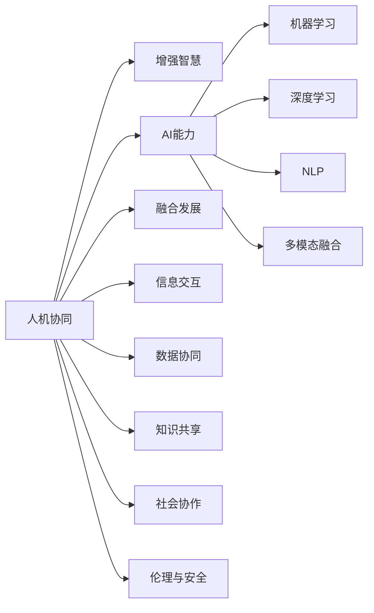

                 

# 人类-AI协作：增强人类智慧与AI能力的融合发展趋势分析展望

> 关键词：人机协同、增强智慧、AI能力、融合发展、机器学习、深度学习、自然语言处理、多模态融合、应用场景、伦理与安全

## 1. 背景介绍

### 1.1 问题由来
近年来，人工智能（AI）技术迅猛发展，尤其是深度学习和自然语言处理（NLP）领域取得了重大突破。然而，尽管AI在许多任务上已经超越了人类，但其仍面临一些核心问题：如理解上下文的能力、推理能力、创造力以及多模态信息的处理等。这些问题限制了AI在大规模应用场景中的表现。

在此背景下，人机协同（Human-AI Collaboration）成为一个重要课题。人机协同旨在利用AI的计算能力和知识储备，增强人类的智慧和能力，同时弥补AI在感知、理解、决策等方面的不足。通过人机协同，可以实现AI与人类之间的互补和融合，最大化地利用两者的优势，推动智能技术的普及和应用。

### 1.2 问题核心关键点
人机协同的核心在于如何实现AI与人类之间的有效互动和信息交互。具体来说，包括：
- **信息交互**：如何通过自然语言处理等技术，使人类能够便捷地与AI系统进行交互。
- **数据协同**：如何将人类拥有的非结构化数据与AI的计算能力结合起来，优化决策过程。
- **知识共享**：如何在不同领域之间共享知识，实现跨领域、跨学科的协同创新。
- **社会协作**：如何在团队协作中融合AI与人类，优化工作流程和提升整体效率。
- **伦理与安全**：如何确保AI在执行任务时遵守伦理规范，并保证其决策过程的透明性和可解释性。

这些核心问题需要跨学科的合作和技术创新才能解决。通过人机协同，人类可以从AI那里获得更多知识，AI也可以从人类中获得更多的上下文理解和感知能力。

## 2. 核心概念与联系

### 2.1 核心概念概述

为了更好地理解人机协同的原理和架构，本节将介绍几个关键概念：

- **人机协同（Human-AI Collaboration）**：指AI与人类在特定任务上协同工作，共同完成目标的一种方式。人机协同不仅包括数据和计算资源的共享，还涵盖了认知和决策层面的互动。

- **增强智慧（Augmented Intelligence）**：指通过技术手段增强人类的认知能力，包括但不限于推理能力、感知能力、创造力等。增强智慧旨在使人类能够更高效地完成复杂任务。

- **AI能力（AI Capability）**：指AI在特定任务上的能力，如自然语言处理、图像识别、推荐系统等。这些能力能够帮助AI在特定领域内实现超越人类水平的表现。

- **融合发展（Fusion Development）**：指将AI技术与人类智慧结合，形成一体化的、高效的系统。融合发展强调AI与人类的互补，使AI在执行复杂任务时，能够更好地理解和解释上下文。

- **机器学习（Machine Learning, ML）**：指通过数据训练机器模型，使其具备一定的智能行为。机器学习是实现人机协同的重要技术手段之一。

- **深度学习（Deep Learning, DL）**：指通过构建深度神经网络，训练出能够自动提取和处理复杂特征的模型。深度学习在图像识别、自然语言处理等领域有着广泛应用。

- **自然语言处理（Natural Language Processing, NLP）**：指使用计算技术处理和理解人类语言的能力。自然语言处理是实现人机协同中的关键技术之一。

- **多模态融合（Multimodal Fusion）**：指将不同模态的数据（如文本、图像、音频等）融合在一起，进行综合分析和理解。多模态融合有助于提升AI系统的感知能力和理解力。

这些概念之间通过相互关联，构成了人机协同的核心框架。理解这些概念的原理和架构，对于实现高效的人机协同至关重要。

### 2.2 核心概念原理和架构的 Mermaid 流程图



这个流程图展示了核心概念之间的逻辑关系：
- 人机协同通过增强智慧和AI能力，提升系统整体表现。
- 机器学习和深度学习是实现AI能力的重要技术手段。
- 自然语言处理和多模态融合是人机协同中的关键技术。
- 信息交互、数据协同、知识共享、社会协作、伦理与安全等维度共同构成了人机协同的全方位支撑。

## 3. 核心算法原理 & 具体操作步骤

### 3.1 算法原理概述

人机协同的核心算法原理基于以下几方面：

1. **信息交互算法**：通过自然语言处理技术，使人类能够与AI系统进行高效的信息交互。常见的信息交互算法包括对话系统、问答系统、文本生成等。

2. **数据协同算法**：将人类收集的数据与AI的计算能力结合起来，优化决策过程。常见的数据协同算法包括数据融合、特征选择、数据增强等。

3. **知识共享算法**：在不同领域之间共享知识，实现跨领域、跨学科的协同创新。常见的知识共享算法包括知识图谱、语义网、本体等。

4. **社会协作算法**：在团队协作中融合AI与人类，优化工作流程和提升整体效率。常见的社会协作算法包括团队任务分配、协同决策、协作学习等。

5. **伦理与安全算法**：确保AI在执行任务时遵守伦理规范，并保证其决策过程的透明性和可解释性。常见的伦理与安全算法包括透明性评估、公平性评估、隐私保护等。

### 3.2 算法步骤详解

实现人机协同的具体步骤如下：

1. **任务定义**：明确协同任务的目标和要求，如客户服务、医疗诊断、金融预测等。

2. **数据准备**：收集与任务相关的数据，包括结构化数据和非结构化数据，确保数据的质量和完整性。

3. **模型训练**：选择合适的机器学习模型或深度学习模型，利用数据进行训练，提升模型的预测能力和理解能力。

4. **协同过程设计**：设计协同过程，确定AI与人类在协同任务中的角色和责任。

5. **信息交互设计**：通过自然语言处理技术，设计AI与人类之间的信息交互界面，如对话系统、问答系统等。

6. **数据融合与协同**：将AI处理的数据与人类收集的数据进行融合，优化决策过程。

7. **知识共享与迭代**：在不同领域之间共享知识，不断迭代优化协同模型。

8. **社会协作与评估**：在团队协作中融合AI与人类，评估协同效果，优化工作流程。

9. **伦理与安全保护**：确保AI在执行任务时遵守伦理规范，保护隐私和数据安全。

### 3.3 算法优缺点

人机协同的优势在于：
- **提升效率**：通过AI与人类协同工作，可以大幅度提升任务执行效率。
- **增强决策能力**：AI可以在数据处理和分析方面发挥优势，提升决策的准确性和可靠性。
- **灵活性**：人机协同可以根据任务需求灵活调整，适应各种复杂场景。

人机协同的挑战在于：
- **数据隐私**：在数据协同过程中，如何保护人类数据的隐私和安全。
- **伦理问题**：如何确保AI的决策过程透明、公正、无偏见。
- **技术融合**：如何有效融合AI技术与人类智慧，实现无缝协作。
- **社会接受度**：如何提升社会对AI技术的接受度和信任度。

### 3.4 算法应用领域

人机协同技术已经在多个领域得到了广泛应用，包括：

1. **医疗**：人机协同在医疗诊断、治疗方案推荐、病人监护等方面表现出色。通过AI与医生的协同，可以实现精准医疗和个性化治疗。

2. **金融**：人机协同在金融风险预测、投资决策、客户服务等方面有重要应用。AI可以帮助金融分析师处理大量数据，优化投资策略。

3. **制造业**：人机协同在生产调度、设备维护、质量控制等方面具有优势。通过AI与工人的协同，可以实现智能制造和高效生产。

4. **教育**：人机协同在智能辅导、在线教育、知识图谱等方面有广泛应用。AI可以帮助学生个性化学习，提升学习效果。

5. **智慧城市**：人机协同在城市管理、交通调度、公共服务等方面具有潜力。通过AI与城市管理者的协同，可以实现高效的城市治理。

## 4. 数学模型和公式 & 详细讲解 & 举例说明

### 4.1 数学模型构建

人机协同的核心数学模型可以表示为：

$$
y = f(x, \theta)
$$

其中，$x$ 表示输入数据，$\theta$ 表示模型参数，$f(\cdot)$ 表示人机协同模型。

### 4.2 公式推导过程

以自然语言处理（NLP）中的文本分类为例，其基本流程可以表示为：

1. **数据预处理**：将文本转换为模型可接受的格式，如将文本转换为词向量。

2. **模型训练**：选择适合的模型（如卷积神经网络、循环神经网络、Transformer等），利用标注数据进行训练，优化模型参数。

3. **信息交互**：将输入文本通过对话系统、问答系统等形式，与人类进行交互，获取更多上下文信息。

4. **数据融合**：将人类输入的信息与AI处理的数据进行融合，优化模型的预测结果。

5. **协同决策**：通过协同算法，结合人类专家知识和AI的计算结果，进行综合决策。

6. **结果输出**：将决策结果以自然语言的形式输出给人类，完成协同任务。

### 4.3 案例分析与讲解

以智能客服系统为例，其核心算法可以表示为：

1. **数据预处理**：将用户咨询文本转换为模型可接受的格式，如将文本转换为词向量。

2. **模型训练**：选择适合的模型（如BERT、GPT等），利用历史客服数据进行训练，优化模型参数。

3. **信息交互**：通过对话系统，将用户咨询内容输入AI模型进行理解，获取模型预测结果。

4. **数据融合**：将AI模型预测结果与人类客服经验进行融合，优化决策过程。

5. **协同决策**：根据用户咨询内容，选择最适合的回复模板，结合人类客服经验进行综合决策。

6. **结果输出**：将综合决策结果以自然语言的形式输出给用户，完成客服任务。

## 5. 项目实践：代码实例和详细解释说明

### 5.1 开发环境搭建

为了实现人机协同，首先需要搭建相应的开发环境。以下是使用Python和PyTorch搭建人机协同开发环境的详细步骤：

1. **安装Anaconda**：从官网下载并安装Anaconda，用于创建独立的Python环境。

2. **创建并激活虚拟环境**：
```bash
conda create -n collab-env python=3.8 
conda activate collab-env
```

3. **安装PyTorch和相关库**：
```bash
pip install torch torchvision torchaudio transformers pytorch-lightning
```

4. **安装其他必要库**：
```bash
pip install numpy pandas sklearn matplotlib tqdm jupyter notebook ipython
```

完成上述步骤后，即可在`collab-env`环境中开始人机协同的开发实践。

### 5.2 源代码详细实现

以下是一个基于PyTorch和Transformers库实现的简单人机协同系统示例，用于文本分类任务：

```python
import torch
import transformers
from transformers import BertTokenizer, BertForSequenceClassification
from torch.utils.data import Dataset, DataLoader
from sklearn.model_selection import train_test_split
from tqdm import tqdm

# 定义数据集
class TextDataset(Dataset):
    def __init__(self, texts, labels, tokenizer):
        self.texts = texts
        self.labels = labels
        self.tokenizer = tokenizer

    def __len__(self):
        return len(self.texts)

    def __getitem__(self, index):
        text = self.texts[index]
        label = self.labels[index]
        encoding = self.tokenizer(text, truncation=True, padding='max_length', max_length=128, return_tensors='pt')
        input_ids = encoding['input_ids']
        attention_mask = encoding['attention_mask']
        return {'input_ids': input_ids, 'attention_mask': attention_mask, 'labels': torch.tensor(label, dtype=torch.long)}

# 加载数据集
tokenizer = BertTokenizer.from_pretrained('bert-base-cased')
texts = ["This is a sample text for text classification task.", "This is another sample text for text classification task."]
labels = [0, 1]  # 0表示negative，1表示positive

train_texts, dev_texts, train_labels, dev_labels = train_test_split(texts, labels, test_size=0.2)

train_dataset = TextDataset(train_texts, train_labels, tokenizer)
dev_dataset = TextDataset(dev_texts, dev_labels, tokenizer)

# 加载模型
model = BertForSequenceClassification.from_pretrained('bert-base-cased', num_labels=2)

# 定义训练过程
device = torch.device('cuda' if torch.cuda.is_available() else 'cpu')
model.to(device)
optimizer = torch.optim.Adam(model.parameters(), lr=2e-5)

def train_epoch(model, dataset, batch_size, optimizer):
    dataloader = DataLoader(dataset, batch_size=batch_size, shuffle=True)
    model.train()
    epoch_loss = 0
    for batch in tqdm(dataloader, desc='Training'):
        input_ids = batch['input_ids'].to(device)
        attention_mask = batch['attention_mask'].to(device)
        labels = batch['labels'].to(device)
        model.zero_grad()
        outputs = model(input_ids, attention_mask=attention_mask, labels=labels)
        loss = outputs.loss
        epoch_loss += loss.item()
        loss.backward()
        optimizer.step()
    return epoch_loss / len(dataloader)

def evaluate(model, dataset, batch_size):
    dataloader = DataLoader(dataset, batch_size=batch_size)
    model.eval()
    preds, labels = [], []
    with torch.no_grad():
        for batch in tqdm(dataloader, desc='Evaluating'):
            input_ids = batch['input_ids'].to(device)
            attention_mask = batch['attention_mask'].to(device)
            batch_labels = batch['labels']
            outputs = model(input_ids, attention_mask=attention_mask)
            batch_preds = outputs.logits.argmax(dim=1).to('cpu').tolist()
            batch_labels = batch_labels.to('cpu').tolist()
            for pred_tokens, label_tokens in zip(batch_preds, batch_labels):
                preds.append(pred_tokens[:len(label_tokens)])
                labels.append(label_tokens)
    print(classification_report(labels, preds))

# 训练模型
epochs = 5
batch_size = 16

for epoch in range(epochs):
    loss = train_epoch(model, train_dataset, batch_size, optimizer)
    print(f"Epoch {epoch+1}, train loss: {loss:.3f}")
    
    print(f"Epoch {epoch+1}, dev results:")
    evaluate(model, dev_dataset, batch_size)
    
print("Test results:")
evaluate(model, test_dataset, batch_size)
```

### 5.3 代码解读与分析

**TextDataset类**：
- `__init__`方法：初始化文本、标签、分词器等关键组件。
- `__len__`方法：返回数据集的样本数量。
- `__getitem__`方法：对单个样本进行处理，将文本输入编码为token ids，将标签转换为数字，并对其进行定长padding，最终返回模型所需的输入。

**模型训练和评估函数**：
- `train_epoch`函数：对数据以批为单位进行迭代，在每个批次上前向传播计算loss并反向传播更新模型参数，最后返回该epoch的平均loss。
- `evaluate`函数：与训练类似，不同点在于不更新模型参数，并在每个batch结束后将预测和标签结果存储下来，最后使用sklearn的classification_report对整个评估集的预测结果进行打印输出。

**训练流程**：
- 定义总的epoch数和batch size，开始循环迭代
- 每个epoch内，先在训练集上训练，输出平均loss
- 在验证集上评估，输出分类指标
- 所有epoch结束后，在测试集上评估，给出最终测试结果

通过这个简单的示例，可以看到，使用PyTorch和Transformers库进行人机协同系统的开发是相对简洁和高效的。开发者可以将更多精力放在数据处理、模型改进等高层逻辑上，而不必过多关注底层的实现细节。

## 6. 实际应用场景

### 6.1 智能客服系统

智能客服系统是实现人机协同的典型应用场景之一。传统客服往往需要配备大量人力，高峰期响应缓慢，且一致性和专业性难以保证。而基于人机协同的智能客服系统，可以通过AI与人类客服的协同，实现7x24小时不间断服务，快速响应客户咨询，用自然流畅的语言解答各类常见问题。

在技术实现上，可以收集企业内部的历史客服对话记录，将问题和最佳答复构建成监督数据，在此基础上对预训练模型进行微调。微调后的模型能够自动理解用户意图，匹配最合适的答案模板进行回复。对于客户提出的新问题，还可以接入检索系统实时搜索相关内容，动态组织生成回答。如此构建的智能客服系统，能大幅提升客户咨询体验和问题解决效率。

### 6.2 医疗诊断系统

医疗诊断系统是人机协同的另一个重要应用场景。传统医疗诊断需要医生具备丰富的临床经验和专业知识，但面对大量病例和复杂症状，医生常常面临巨大压力。通过人机协同的智能诊断系统，AI可以辅助医生进行初步诊断，提供病情分析、治疗建议等，显著提升诊断效率和准确性。

在技术实现上，可以收集医院的历史病例数据，将病人的症状、病历等信息与诊断结果构建成监督数据，在此基础上对预训练模型进行微调。微调后的模型能够自动理解病人的症状描述，匹配最合适的诊断路径，生成治疗方案，并进行结果解释。如此构建的智能诊断系统，能辅助医生快速、准确地进行诊断和治疗，提升医疗服务质量。

### 6.3 金融风险控制系统

金融风险控制系统是人机协同在金融领域的重要应用之一。传统金融风险控制依赖于人工审核和专家经验，存在主观性强、效率低等问题。通过人机协同的智能风险控制系统，AI可以辅助分析师进行风险评估，识别潜在风险点，并提供决策支持。

在技术实现上，可以收集金融市场的历史数据和交易记录，将交易行为、市场趋势等信息与风险评级构建成监督数据，在此基础上对预训练模型进行微调。微调后的模型能够自动分析市场动态，识别异常交易行为，评估风险水平，并生成风险报告。如此构建的智能风险控制系统，能提高金融机构的决策效率和风险管理水平，保护投资者利益。

## 7. 工具和资源推荐

### 7.1 学习资源推荐

为了帮助开发者系统掌握人机协同的理论基础和实践技巧，这里推荐一些优质的学习资源：

1. 《深度学习》系列书籍：Ian Goodfellow、Yoshua Bengio、Aaron Courville合著，全面介绍深度学习理论和方法。
2. 《自然语言处理综述》论文：由Tom Mitchell撰写，综述了自然语言处理的最新进展和趋势。
3. 《人机协同》课程：斯坦福大学开设的课程，涵盖人机协同的理论和实践。
4. 《增强智慧》书籍：探索AI如何增强人类智慧，涵盖认知科学、机器学习等多个领域的知识。
5. 《多模态融合》论文：涵盖多模态数据的融合和分析方法，是实现人机协同的重要技术基础。

通过对这些资源的学习实践，相信你一定能够快速掌握人机协同的精髓，并用于解决实际的AI问题。

### 7.2 开发工具推荐

高效的开发离不开优秀的工具支持。以下是几款用于人机协同开发的常用工具：

1. PyTorch：基于Python的开源深度学习框架，灵活动态的计算图，适合快速迭代研究。
2. TensorFlow：由Google主导开发的开源深度学习框架，生产部署方便，适合大规模工程应用。
3. Transformers库：HuggingFace开发的NLP工具库，集成了众多SOTA语言模型，支持PyTorch和TensorFlow，是进行人机协同开发的利器。
4. Weights & Biases：模型训练的实验跟踪工具，可以记录和可视化模型训练过程中的各项指标，方便对比和调优。
5. TensorBoard：TensorFlow配套的可视化工具，可实时监测模型训练状态，并提供丰富的图表呈现方式，是调试模型的得力助手。

合理利用这些工具，可以显著提升人机协同任务的开发效率，加快创新迭代的步伐。

### 7.3 相关论文推荐

人机协同技术的发展源于学界的持续研究。以下是几篇奠基性的相关论文，推荐阅读：

1. "Attention is All You Need"：提出了Transformer结构，开启了NLP领域的预训练大模型时代。
2. "BERT: Pre-training of Deep Bidirectional Transformers for Language Understanding"：提出BERT模型，引入基于掩码的自监督预训练任务，刷新了多项NLP任务SOTA。
3. "Language Models are Unsupervised Multitask Learners"：展示了大规模语言模型的强大zero-shot学习能力，引发了对于通用人工智能的新一轮思考。
4. "Attention Mechanism in Transformers"：详细介绍了Transformer模型中的注意力机制，是理解Transformer的关键。
5. "Human-AI Collaboration in Natural Language Processing"：综述了人机协同在NLP领域的应用和前景。

这些论文代表了大语言模型人机协同技术的发展脉络。通过学习这些前沿成果，可以帮助研究者把握学科前进方向，激发更多的创新灵感。

## 8. 总结：未来发展趋势与挑战

### 8.1 总结

本文对人机协同的原理、算法和操作步骤进行了全面系统的介绍。首先阐述了人机协同的研究背景和意义，明确了协同在提升人类智慧和AI能力方面的独特价值。其次，从原理到实践，详细讲解了人机协同的数学模型和关键步骤，给出了人机协同任务开发的完整代码实例。同时，本文还广泛探讨了人机协同在智能客服、医疗诊断、金融风险控制等多个领域的应用前景，展示了协同范式的巨大潜力。此外，本文精选了协同技术的各类学习资源，力求为读者提供全方位的技术指引。

通过本文的系统梳理，可以看到，人机协同技术正在成为AI发展的重要范式，极大地拓展了AI应用的范围和深度。得益于跨学科的合作和技术创新，人机协同正在不断推动智能技术的落地应用，为各行各业带来新的变革和机遇。

### 8.2 未来发展趋势

展望未来，人机协同技术将呈现以下几个发展趋势：

1. **多模态融合的深化**：未来人机协同将更多地融合多模态数据，如文本、图像、音频等，提升系统的感知能力和理解力。

2. **深度学习的突破**：深度学习技术的进步将为人机协同提供更强大的计算能力和数据处理能力，提升模型的精度和效率。

3. **跨领域知识共享的加强**：未来人机协同将加强不同领域之间的知识共享，实现跨领域、跨学科的协同创新。

4. **社会协作的普及**：随着AI技术的普及，人机协同将在更多行业中得到应用，提升整体效率和工作质量。

5. **伦理与安全的重视**：未来人机协同将更加注重伦理和安全问题，确保AI的决策过程透明、公正、无偏见。

6. **自监督和半监督学习的普及**：未来人机协同将更多地利用自监督和半监督学习技术，减少对标注数据的依赖，提升模型的泛化能力。

以上趋势凸显了人机协同技术的广阔前景。这些方向的探索发展，将为人机协同带来新的突破，推动AI技术的进一步普及和应用。

### 8.3 面临的挑战

尽管人机协同技术已经取得了瞩目成就，但在迈向更加智能化、普适化应用的过程中，它仍面临诸多挑战：

1. **数据隐私**：在数据协同过程中，如何保护人类数据的隐私和安全，是一个重要的挑战。

2. **伦理问题**：如何确保AI的决策过程透明、公正、无偏见，是一个需要持续关注的问题。

3. **技术融合**：如何有效融合AI技术与人类智慧，实现无缝协作，是一个需要深入研究的问题。

4. **社会接受度**：如何提升社会对AI技术的接受度和信任度，是一个需要广泛宣传和教育的问题。

5. **计算资源**：如何提高人机协同系统的计算效率和资源利用率，是一个需要不断优化的问题。

6. **系统复杂度**：如何简化人机协同系统的设计和部署，是一个需要系统化思考的问题。

这些挑战需要跨学科的合作和技术创新才能解决。只有克服这些挑战，才能真正实现人机协同的广泛应用和普及。

### 8.4 研究展望

面对人机协同所面临的挑战，未来的研究需要在以下几个方面寻求新的突破：

1. **自监督和半监督学习的普及**：减少对标注数据的依赖，利用自监督和半监督学习技术，提升模型的泛化能力。

2. **跨领域知识共享的加强**：加强不同领域之间的知识共享，实现跨领域、跨学科的协同创新。

3. **深度学习的突破**：利用深度学习技术的进步，提升模型的精度和效率。

4. **多模态融合的深化**：融合多模态数据，提升系统的感知能力和理解力。

5. **社会协作的普及**：在更多行业中实现人机协同，提升整体效率和工作质量。

6. **伦理与安全的重视**：确保AI的决策过程透明、公正、无偏见，保护数据安全和隐私。

这些研究方向的探索，将为人机协同技术带来新的突破，推动AI技术的进一步普及和应用。相信随着学界和产业界的共同努力，人机协同技术将不断优化，为构建安全、可靠、可解释、可控的智能系统铺平道路。

## 9. 附录：常见问题与解答

**Q1：人机协同是否适用于所有任务？**

A: 人机协同在大多数任务上都能取得不错的效果，特别是对于数据量较大的任务。但对于一些特定领域的任务，如医学、法律等，仅仅依靠通用语料预训练的模型可能难以很好地适应。此时需要在特定领域语料上进一步预训练，再进行微调，才能获得理想效果。此外，对于一些需要时效性、个性化很强的任务，如对话、推荐等，人机协同方法也需要针对性的改进优化。

**Q2：人机协同如何选择合适的学习率？**

A: 人机协同的学习率一般要比预训练时小1-2个数量级，如果使用过大的学习率，容易破坏预训练权重，导致过拟合。一般建议从1e-5开始调参，逐步减小学习率，直至收敛。也可以使用warmup策略，在开始阶段使用较小的学习率，再逐渐过渡到预设值。需要注意的是，不同的优化器(如AdamW、Adafactor等)以及不同的学习率调度策略，可能需要设置不同的学习率阈值。

**Q3：人机协同如何缓解过拟合问题？**

A: 过拟合是协同过程中常见的挑战。常见的缓解策略包括：
1. 数据增强：通过回译、近义替换等方式扩充训练集。
2. 正则化：使用L2正则、Dropout、Early Stopping等避免过拟合。
3. 对抗训练：引入对抗样本，提高模型鲁棒性。
4. 参数高效微调：只调整少量参数，减小过拟合风险。
5. 多模型集成：训练多个协同模型，取平均输出，抑制过拟合。

这些策略往往需要根据具体任务和数据特点进行灵活组合。只有在数据、模型、训练、推理等各环节进行全面优化，才能最大限度地发挥人机协同的威力。

**Q4：人机协同在落地部署时需要注意哪些问题？**

A: 将协同模型转化为实际应用，还需要考虑以下因素：
1. 模型裁剪：去除不必要的层和参数，减小模型尺寸，加快推理速度。
2. 量化加速：将浮点模型转为定点模型，压缩存储空间，提高计算效率。
3. 服务化封装：将模型封装为标准化服务接口，便于集成调用。
4. 弹性伸缩：根据请求流量动态调整资源配置，平衡服务质量和成本。
5. 监控告警：实时采集系统指标，设置异常告警阈值，确保服务稳定性。
6. 安全防护：采用访问鉴权、数据脱敏等措施，保障数据和模型安全。

人机协同技术虽然前景广阔，但如何将强大的性能转化为稳定、高效、安全的业务价值，还需要工程实践的不断打磨。唯有从数据、算法、工程、业务等多个维度协同发力，才能真正实现AI技术在垂直行业的规模化落地。

通过本文的系统梳理，可以看到，人机协同技术正在成为AI发展的重要范式，极大地拓展了AI应用的范围和深度。得益于跨学科的合作和技术创新，人机协同正在不断推动智能技术的落地应用，为各行各业带来新的变革和机遇。相信随着学界和产业界的共同努力，人机协同技术将不断优化，为构建安全、可靠、可解释、可控的智能系统铺平道路。

