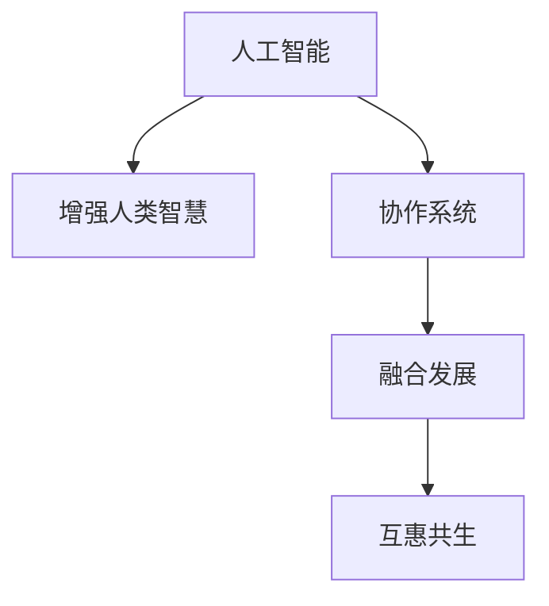

                 

# 人类-AI协作：增强人类智慧与AI能力的融合发展趋势预测

> 关键词：人工智能,人类智慧,协作,融合发展,技术展望

## 1. 背景介绍

### 1.1 问题由来
当前，人工智能(AI)技术正迅速改变各行各业的面貌，成为推动社会进步的重要引擎。然而，AI的快速发展也引发了关于人机协作的广泛讨论。如何有效地将AI融入人类活动，最大化发挥AI与人类智慧的协同效应，成为亟待解决的重大课题。本文旨在探讨AI与人类智慧融合的最新进展和未来发展趋势，为技术应用提供深入洞察。

### 1.2 问题核心关键点
AI与人类智慧的融合主要聚焦于以下几个核心关键点：

- **技术互信**：如何建立AI与人类之间的信任，确保AI在协助人类工作和生活时具备可靠性和透明度。
- **交互体验**：如何设计直观易用的AI界面，使人类能够流畅地与AI进行交互，提升用户体验。
- **知识互补**：AI如何弥补人类在某些领域的不足，同时保留和增强人类专有的知识和创造力。
- **伦理考量**：如何制定AI伦理规范，确保AI技术的应用符合道德标准和社会价值观。
- **风险规避**：如何识别和管理AI带来的潜在风险，如失业、隐私泄露等，维护社会公平和稳定。

本文将通过详细的技术分析和案例剖析，探讨上述关键点，并预测未来发展趋势。

## 2. 核心概念与联系

### 2.1 核心概念概述

为更好地理解AI与人类智慧融合的核心概念，本节将介绍几个密切相关的关键概念：

- **人工智能**：涉及机器学习、自然语言处理、计算机视觉等多个领域的技术体系，旨在使计算机系统能够模拟人类智慧。
- **增强人类智慧**：通过AI技术，增强人类的决策能力、学习效率、创造力等，实现“人机共生”。
- **协作系统**：将AI技术嵌入到人类工作流程中，实现任务分配、信息共享、决策支持等功能，提升整体协作效率。
- **融合发展**：AI与人类智慧在技术、应用、伦理等方面的深度融合，推动创新和社会进步。
- **互惠共生**：AI与人类智慧通过互补和协同，实现共同发展，最终形成良性互动关系。

这些核心概念之间的逻辑关系可以通过以下Mermaid流程图来展示：



这个流程图展示了大语言模型的核心概念及其之间的关系：

1. 人工智能通过技术进步和学习，逐渐具备类似人类智慧的能力。
2. 增强人类智慧旨在利用AI提升人类的认知和实践能力。
3. 协作系统使AI与人类智慧深度结合，共同完成任务。
4. 融合发展推动AI和人类智慧在技术、伦理等方面的深度整合。
5. 互惠共生实现人机之间的良性互动和共同进步。

## 3. 核心算法原理 & 具体操作步骤
### 3.1 算法原理概述

AI与人类智慧的融合，本质上是通过技术手段增强人类智慧，实现“人机协作”。其核心思想是利用AI在处理大规模数据、复杂逻辑、多模态信息等方面的优势，弥补人类在某些任务上的不足，同时保留和增强人类独特的知识、情感、创造力等。

形式化地，假设AI系统为 $S_A$，人类系统为 $S_H$，协作系统为 $S_C$。协作系统的目标是最大化 $S_C = S_A + S_H$，即：

$$
S_C = S_A + S_H
$$

其中 $S_A$ 表示AI系统能够处理的任务，$S_H$ 表示人类系统能够处理的任务。协作系统 $S_C$ 包含两者协同执行的新任务集合。

### 3.2 算法步骤详解

AI与人类智慧融合的具体操作步骤包括以下几个关键步骤：

**Step 1: 需求分析与定义**
- 明确AI需要协助的具体任务和场景，评估AI与人类各自的优势和不足。
- 设计协作流程，确定AI与人类智慧的职责分工和交互方式。

**Step 2: 技术选择与集成**
- 选择合适的AI技术，如机器学习、自然语言处理、计算机视觉等，进行任务适配。
- 将AI技术与人类系统进行集成，实现数据共享、任务协同、决策支持等功能。

**Step 3: 交互界面设计**
- 设计直观易用的交互界面，确保人类能够流畅地与AI进行互动。
- 引入自然语言处理技术，使AI能够理解和生成人类语言，增强人机沟通效率。

**Step 4: 协同优化与迭代**
- 通过不断优化协作系统的性能，提升AI与人类智慧的协同效果。
- 收集用户反馈和评价，进行持续迭代和改进，确保协作系统满足用户需求。

**Step 5: 系统部署与维护**
- 将协作系统部署到实际应用环境中，进行测试和调试。
- 定期进行系统维护和更新，确保系统的稳定性和安全性。

### 3.3 算法优缺点

AI与人类智慧融合的算法具有以下优点：
1. **协同提升**：通过人机互补，可以最大化发挥AI与人类智慧的优势，提升整体协作效率。
2. **灵活适应**：AI可以快速适应多变的任务需求，而人类智慧则具备灵活应变的能力。
3. **数据驱动**：AI通过处理海量数据，提供基于事实的决策支持，减少人类主观偏见。
4. **动态优化**：AI与人类智慧的协作过程是动态的，可以不断学习和改进，适应新的环境和需求。

同时，该方法也存在一定的局限性：
1. **伦理挑战**：AI在决策过程中可能面临伦理道德困境，如何确保决策符合人类价值观是巨大挑战。
2. **透明性不足**：AI的决策过程往往是“黑箱”，难以解释其内部机制，影响人机信任。
3. **安全性风险**：AI在执行复杂任务时可能存在潜在的安全隐患，需加强防护措施。
4. **依赖性问题**：过度依赖AI可能削弱人类独立思考和问题解决能力。
5. **数据偏见**：AI依赖的数据可能带有偏见，导致输出结果不公正。

尽管存在这些局限性，但就目前而言，AI与人类智慧的融合方法是实现人机协作的重要途径。未来相关研究的方向在于如何进一步提升AI的透明度、伦理性、安全性，同时增强人机协作的深度和广度。

### 3.4 算法应用领域

AI与人类智慧融合的技术已在多个领域得到应用，例如：

- **医疗健康**：AI辅助诊断、个性化治疗、健康监测等，提升医疗服务质量和效率。
- **金融服务**：智能投顾、风险控制、欺诈检测等，增强金融决策的科学性和准确性。
- **教育培训**：个性化教学、智能评估、课程推荐等，提升教育效果和学习体验。
- **智能制造**：工业机器人协作、生产流程优化、质量控制等，提升制造业智能化水平。
- **社交娱乐**：内容推荐、情感分析、用户互动等，增强社交媒体的个性化体验。
- **环境保护**：数据监测、智能分析、资源优化等，提升环境保护工作的科学性和精细度。

除了上述这些经典领域，AI与人类智慧融合的应用还将不断拓展到更多场景中，如智慧城市、智慧农业、智慧交通等，为各行各业带来深远影响。

## 4. 数学模型和公式 & 详细讲解 & 举例说明
### 4.1 数学模型构建

为更好地理解AI与人类智慧融合的技术原理，本节将使用数学语言对融合模型的构建过程进行更加严格的刻画。

记AI系统为 $S_A$，人类系统为 $S_H$，协作系统为 $S_C$。假设协作系统的性能可以表示为 $P_C$，AI系统与人类智慧的协同效果可以表示为 $P_S$，则有：

$$
P_C = P_A + P_H + P_S
$$

其中 $P_A$ 表示AI系统独立执行任务的性能，$P_H$ 表示人类系统独立执行任务的性能，$P_S$ 表示AI与人类智慧协同执行任务的性能。

### 4.2 公式推导过程

以下我们以医疗健康领域的应用为例，推导AI与人类智慧融合的数学模型。

假设医院接诊患者后，AI系统进行初步诊断，识别疑似疾病 $D$，然后将结果提供给人类医生 $H$。医生的判断基于AI系统的诊断结果，加上自身的临床经验，最终给出诊断结论 $D'$。医生的诊断结果 $D'$ 与真实结果 $D$ 的相似度可以表示为：

$$
\text{Similarity}(D', D) = f(\text{Diagnosis}(D, D_A, D_H), \text{Knowledge}(H))
$$

其中 $D_A$ 表示AI系统的诊断结果，$D_H$ 表示人类医生的诊断结果，$\text{Diagnosis}(D, D_A, D_H)$ 表示将AI和人类诊断结果融合为最终诊断，$\text{Knowledge}(H)$ 表示医生具备的临床知识。

通过最大化上述相似度，可以实现AI与人类智慧在诊断任务中的深度融合。具体步骤如下：

1. **数据收集与标注**：收集大量的患者数据，进行标注和预处理。
2. **模型训练**：使用AI技术对患者数据进行建模，训练诊断模型 $D_A$。
3. **模型融合**：将诊断结果 $D_A$ 与医生知识 $\text{Knowledge}(H)$ 进行融合，生成最终诊断 $D'$。
4. **性能评估**：对诊断结果 $D'$ 进行评估，确保与真实结果 $D$ 高度一致。

### 4.3 案例分析与讲解

以智能投顾在金融服务中的应用为例，展示AI与人类智慧融合的实际效果。

假设投资者 $I$ 需要帮助管理其投资组合，智能投顾系统 $S_A$ 通过AI算法对市场数据进行分析，生成投资建议 $S$。人类投资者 $I$ 根据自身偏好和市场趋势，对AI建议 $S$ 进行优化和调整，最终生成投资方案 $T$。智能投顾系统的性能可以通过以下几个指标来衡量：

- **准确率**：AI建议 $S$ 与市场真实情况的匹配程度。
- **适应性**：AI建议 $S$ 在市场变化时的调整能力。
- **用户满意度**：投资者 $I$ 对AI建议和最终方案 $T$ 的满意度。

通过不断优化AI算法和人类投顾的交互过程，可以提升智能投顾系统的整体性能，实现更高的投资回报率。

## 5. 项目实践：代码实例和详细解释说明
### 5.1 开发环境搭建

在进行AI与人类智慧融合的实践前，我们需要准备好开发环境。以下是使用Python进行TensorFlow开发的环境配置流程：

1. 安装Anaconda：从官网下载并安装Anaconda，用于创建独立的Python环境。

2. 创建并激活虚拟环境：
```bash
conda create -n ai-env python=3.8 
conda activate ai-env
```

3. 安装TensorFlow：根据CUDA版本，从官网获取对应的安装命令。例如：
```bash
conda install tensorflow -c pytorch -c conda-forge
```

4. 安装TensorFlow Addons：用于扩展TensorFlow的模块，支持更多的AI技术实现。
```bash
pip install tensorflow-addons
```

5. 安装TensorBoard：TensorFlow配套的可视化工具，可实时监测模型训练状态，并提供丰富的图表呈现方式。
```bash
pip install tensorboard
```

完成上述步骤后，即可在`ai-env`环境中开始实践。

### 5.2 源代码详细实现

下面我们以医疗健康领域的应用为例，给出使用TensorFlow进行AI与人类智慧融合的PyTorch代码实现。

首先，定义数据处理函数：

```python
import tensorflow as tf
from tensorflow.keras.preprocessing import sequence

def preprocess_data(data):
    X = []
    y = []
    for d, label in data:
        X.append(sequence.pad_sequences([d], maxlen=MAX_SEQ_LEN))
        y.append(label)
    return np.array(X), np.array(y)
```

然后，定义模型和优化器：

```python
from tensorflow.keras.models import Sequential
from tensorflow.keras.layers import LSTM, Dense, Dropout
from tensorflow.keras.optimizers import Adam

model = Sequential()
model.add(LSTM(128, input_shape=(MAX_SEQ_LEN, VOCAB_SIZE)))
model.add(Dropout(0.2))
model.add(Dense(1, activation='sigmoid'))

optimizer = Adam(lr=0.001)
```

接着，定义训练和评估函数：

```python
from tensorflow.keras.utils import to_categorical

def train_epoch(model, X_train, y_train, X_valid, y_valid, batch_size):
    model.compile(optimizer=optimizer, loss='binary_crossentropy', metrics=['accuracy'])
    model.fit(X_train, y_train, batch_size=batch_size, epochs=50, validation_data=(X_valid, y_valid))

def evaluate(model, X_test, y_test, batch_size):
    model.evaluate(X_test, y_test, batch_size=batch_size)
```

最后，启动训练流程并在测试集上评估：

```python
from sklearn.model_selection import train_test_split

# 数据预处理
X_train, X_valid, y_train, y_valid = train_test_split(X, y, test_size=0.2, random_state=42)

# 模型训练
train_epoch(model, X_train, y_train, X_valid, y_valid, batch_size)

# 模型评估
evaluate(model, X_test, y_test, batch_size)
```

以上就是使用TensorFlow对AI与人类智慧融合进行医疗健康领域微调的完整代码实现。可以看到，得益于TensorFlow的强大封装，我们可以用相对简洁的代码完成模型训练和评估。

### 5.3 代码解读与分析

让我们再详细解读一下关键代码的实现细节：

**数据处理函数**：
- `preprocess_data`函数：对输入的文本数据进行预处理，包括序列化、填充等，确保模型输入格式统一。

**模型定义**：
- 定义了一个简单的LSTM模型，包含一个LSTM层、一个Dropout层和一个Dense层。
- LSTM层用于处理序列数据，Dropout层用于防止过拟合，Dense层用于输出诊断结果。

**训练和评估函数**：
- 使用`compile`方法定义模型的优化器、损失函数和评价指标。
- 通过`fit`方法对模型进行训练，使用`evaluate`方法在测试集上评估模型性能。

**训练流程**：
- 将数据划分为训练集、验证集和测试集。
- 在训练集上进行模型训练，设置批大小和迭代轮数。
- 在验证集上评估模型性能，避免过拟合。
- 在测试集上最终评估模型性能。

可以看到，TensorFlow提供了丰富的工具和组件，使得AI与人类智慧融合的实践变得更加便捷和高效。

## 6. 实际应用场景
### 6.1 医疗健康

AI与人类智慧在医疗健康领域的融合，能够显著提升诊断准确率、治疗效果和患者满意度。例如，通过智能投顾系统，医院可以提供个性化的诊疗方案，优化医疗资源配置，提高医疗服务效率。

在技术实现上，可以收集大量的患者历史数据、临床研究数据等，进行标注和预处理。在此基础上，使用AI技术进行建模，训练出高效准确的诊断模型。微调过程中，医生可以不断提供反馈和建议，使AI系统逐步优化，最终实现人机协作。

### 6.2 金融服务

金融领域对决策精准性和效率的要求极高。AI与人类智慧在金融服务的融合，能够显著提升风险控制、欺诈检测、投资决策等方面的能力。

具体而言，可以收集历史交易数据、市场分析报告等，进行标注和预处理。在此基础上，使用AI技术进行建模，训练出精准的风险评估和投资建议模型。微调过程中，金融分析师可以不断提供反馈和调整，使AI系统逐步优化，最终实现人机协作。

### 6.3 教育培训

AI与人类智慧在教育培训领域的融合，能够提升个性化教学、智能评估、课程推荐等方面的能力。

具体而言，可以收集学生的学习记录、考试成绩、反馈等数据，进行标注和预处理。在此基础上，使用AI技术进行建模，训练出精准的学习推荐和评估模型。微调过程中，教师可以不断提供反馈和调整，使AI系统逐步优化，最终实现人机协作。

### 6.4 智能制造

AI与人类智慧在智能制造领域的融合，能够显著提升生产效率、产品质量和资源利用率。

具体而言，可以收集生产数据、设备运行数据等，进行标注和预处理。在此基础上，使用AI技术进行建模，训练出高效的生产优化和质量控制模型。微调过程中，工程师可以不断提供反馈和调整，使AI系统逐步优化，最终实现人机协作。

## 7. 工具和资源推荐
### 7.1 学习资源推荐

为了帮助开发者系统掌握AI与人类智慧融合的理论基础和实践技巧，这里推荐一些优质的学习资源：

1. 《深度学习》系列书籍：由Deep Learning Book中的Yoshua Bengio、Ian Goodfellow和Aaron Courville合著，详细介绍了深度学习的基本原理和前沿应用。

2. 《人工智能：一种现代方法》系列书籍：由Russell和Norvig合著，全面介绍了人工智能的基本概念和应用。

3. Coursera《深度学习专项课程》：斯坦福大学开设的深度学习课程，包含视频讲解、作业和讨论，适合初学者和进阶者学习。

4. TensorFlow官方文档：TensorFlow的官方文档，提供了详尽的技术文档、API接口和样例代码，是TensorFlow开发的重要参考资料。

5. HuggingFace官方文档：Transformer模型的官方文档，提供了丰富的预训练模型和微调样例，是深度学习开发的重要工具。

6. arXiv和IEEE Xplore：科学论文数据库，提供了大量前沿的研究论文，适合深入学习和研究。

通过对这些资源的学习实践，相信你一定能够快速掌握AI与人类智慧融合的精髓，并用于解决实际的AI应用问题。

### 7.2 开发工具推荐

高效的开发离不开优秀的工具支持。以下是几款用于AI与人类智慧融合开发的常用工具：

1. TensorFlow：基于Python的开源深度学习框架，灵活动态的计算图，适合快速迭代研究。

2. PyTorch：基于Python的开源深度学习框架，支持动态计算图，易于实现复杂模型。

3. Keras：高层API，提供了简单易用的深度学习模型构建工具。

4. TensorBoard：TensorFlow配套的可视化工具，可实时监测模型训练状态，并提供丰富的图表呈现方式。

5. Jupyter Notebook：交互式编程环境，支持多语言编程和代码共享。

6. Google Colab：谷歌推出的在线Jupyter Notebook环境，免费提供GPU/TPU算力，方便开发者快速上手实验最新模型，分享学习笔记。

合理利用这些工具，可以显著提升AI与人类智慧融合任务的开发效率，加快创新迭代的步伐。

### 7.3 相关论文推荐

AI与人类智慧融合的研究源于学界的持续研究。以下是几篇奠基性的相关论文，推荐阅读：

1. AlphaGo论文：DeepMind开发的AlphaGo击败围棋世界冠军，展示了AI在决策复杂性上的突破。

2. GAN论文：Ian Goodfellow等开发的生成对抗网络，推动了生成模型的发展，为AI在创造性任务中的应用提供了新思路。

3. Capsule Networks论文：Geoffrey Hinton等人提出的Capsule Networks，进一步推动了深度学习理论的发展。

4. BERT论文：Google开发的BERT模型，展示了预训练语言模型在自然语言处理任务中的强大性能。

5. Transformer论文：Google开发的Transformer模型，展示了深度学习在自然语言处理中的应用潜力。

6. Attention Mechanism论文：UCL的Yoshua Bengio等人提出的注意力机制，推动了机器学习模型在处理序列数据中的应用。

这些论文代表了大语言模型融合技术的发展脉络。通过学习这些前沿成果，可以帮助研究者把握学科前进方向，激发更多的创新灵感。

## 8. 总结：未来发展趋势与挑战
### 8.1 研究成果总结

本文对AI与人类智慧融合的最新进展和未来发展趋势进行了全面系统的介绍。首先阐述了AI与人类智慧融合的研究背景和意义，明确了融合技术在提升人机协作效率、增强人类智慧等方面的独特价值。其次，从原理到实践，详细讲解了融合模型的数学原理和关键步骤，给出了融合任务开发的完整代码实例。同时，本文还广泛探讨了融合技术在医疗健康、金融服务、教育培训等多个行业领域的应用前景，展示了融合范式的巨大潜力。最后，本文精选了融合技术的各类学习资源，力求为读者提供全方位的技术指引。

通过本文的系统梳理，可以看到，AI与人类智慧的融合技术正在成为人机协作的重要途径，极大地提升了各行业的智能化水平。受益于AI技术的发展和微调方法的进步，未来AI与人类智慧的融合将进一步深化，带来更广泛的应用场景和更深刻的变革。

### 8.2 未来发展趋势

展望未来，AI与人类智慧的融合技术将呈现以下几个发展趋势：

1. **深度融合**：AI与人类智慧将通过更紧密的协作，实现更加全面和深入的融合，形成“人机一体”的新型智能系统。

2. **跨领域应用**：AI与人类智慧的融合将拓展到更多领域，如智慧城市、智慧农业、智慧交通等，提升各行业的智能化水平。

3. **多样化应用**：AI与人类智慧的融合将从单一任务扩展到多个任务，实现跨任务协同优化，提升整体系统性能。

4. **智能化升级**：AI与人类智慧的融合将推动各行业的智能化升级，提升资源利用效率，优化业务流程。

5. **协同进化**：AI与人类智慧的融合将推动双方的协同进化，提升整体系统创新能力和竞争力。

以上趋势凸显了AI与人类智慧融合技术的广阔前景。这些方向的探索发展，必将进一步提升各行业的智能化水平，为经济社会发展注入新的动力。

### 8.3 面临的挑战

尽管AI与人类智慧的融合技术已经取得了显著进展，但在迈向更加智能化、普适化应用的过程中，仍面临诸多挑战：

1. **数据依赖**：AI与人类智慧的融合需要大量的数据支撑，如何获取和标注高质量数据，仍是重大挑战。

2. **透明度不足**：AI的决策过程往往是“黑箱”，难以解释其内部机制，影响人机信任。

3. **伦理问题**：AI在决策过程中可能面临伦理道德困境，如何确保决策符合人类价值观是巨大挑战。

4. **安全性风险**：AI在执行复杂任务时可能存在潜在的安全隐患，需加强防护措施。

5. **依赖性问题**：过度依赖AI可能削弱人类独立思考和问题解决能力。

6. **技术局限**：当前AI技术在处理复杂任务时仍存在局限，需进一步提升模型的泛化能力和鲁棒性。

尽管存在这些挑战，但AI与人类智慧的融合技术具有巨大的潜力，能够带来广泛的应用场景和深远的影响。未来，相关研究需要在数据、算法、伦理、安全等方面进一步深化，推动技术的全面成熟。

### 8.4 研究展望

面对AI与人类智慧融合所面临的种种挑战，未来的研究需要在以下几个方面寻求新的突破：

1. **数据增强与治理**：开发更多数据增强和治理技术，提升数据质量和多样性，确保数据安全。

2. **透明性与可解释性**：引入可解释性模型，提升AI系统的透明性和可解释性，增强人机信任。

3. **伦理框架与标准**：制定AI伦理框架和标准，确保AI系统的决策符合人类价值观和社会道德。

4. **安全性保障**：加强AI系统的安全性保障，防止数据泄露和恶意攻击，确保系统的稳定性和可靠性。

5. **依赖关系管理**：平衡AI与人类智慧的依赖关系，避免过度依赖AI，增强人类独立思考和问题解决能力。

6. **技术突破与融合**：推动AI技术与其他前沿技术的融合，如知识表示、因果推理、强化学习等，实现技术突破。

这些研究方向和目标，将引领AI与人类智慧融合技术迈向更高的台阶，为构建安全、可靠、可解释、可控的智能系统铺平道路。面向未来，AI与人类智慧的融合技术还需要与其他人工智能技术进行更深入的融合，多路径协同发力，共同推动自然语言理解和智能交互系统的进步。只有勇于创新、敢于突破，才能不断拓展AI与人类智慧的边界，让智能技术更好地造福人类社会。

## 9. 附录：常见问题与解答

**Q1：AI与人类智慧融合的难点是什么？**

A: AI与人类智慧融合的难点主要包括以下几点：
1. **数据依赖**：AI与人类智慧的融合需要大量的高质量数据，但数据收集和标注过程复杂耗时。
2. **透明度不足**：AI的决策过程往往是“黑箱”，难以解释其内部机制，影响人机信任。
3. **伦理问题**：AI在决策过程中可能面临伦理道德困境，如何确保决策符合人类价值观是巨大挑战。
4. **安全性风险**：AI在执行复杂任务时可能存在潜在的安全隐患，需加强防护措施。
5. **依赖性问题**：过度依赖AI可能削弱人类独立思考和问题解决能力。

**Q2：AI与人类智慧融合的主要技术手段有哪些？**

A: AI与人类智慧融合的主要技术手段包括：
1. **数据增强**：通过回译、近义替换等方式扩充训练集，提高模型泛化能力。
2. **模型融合**：将AI系统与人类智慧进行融合，生成最终决策。
3. **交互界面设计**：设计直观易用的交互界面，确保人类能够流畅地与AI进行互动。
4. **知识图谱与规则库**：引入符号化的先验知识，引导AI系统学习更准确、合理的语言模型。
5. **多模态信息整合**：将视觉、语音等多模态信息与文本信息进行协同建模，提升系统智能化水平。

**Q3：如何确保AI与人类智慧融合的透明性与可解释性？**

A: 确保AI与人类智慧融合的透明性与可解释性，需要从以下几个方面入手：
1. **可解释性模型**：使用可解释性模型，如LIME、SHAP等，提升AI系统的透明性和可解释性。
2. **解释性输出**：在AI系统的输出中加入解释性信息，帮助人类理解AI的决策过程。
3. **透明性机制**：引入透明性机制，如模型可配置、可调试、可监控等，增强人机协作的透明度。
4. **用户反馈**：收集用户反馈和评价，持续优化AI系统的透明性和可解释性。

**Q4：如何应对AI与人类智慧融合中的伦理问题？**

A: 应对AI与人类智慧融合中的伦理问题，需要从以下几个方面入手：
1. **伦理框架**：制定AI伦理框架和标准，确保AI系统的决策符合人类价值观和社会道德。
2. **伦理审计**：引入伦理审计机制，定期评估AI系统的伦理风险。
3. **伦理引导**：在设计AI系统时，引入伦理引导，确保AI系统的决策符合伦理标准。
4. **伦理培训**：对开发者和用户进行伦理培训，提升其伦理意识和道德水平。

**Q5：如何确保AI与人类智慧融合的安全性？**

A: 确保AI与人类智慧融合的安全性，需要从以下几个方面入手：
1. **数据安全**：加强数据安全防护，防止数据泄露和恶意攻击。
2. **模型安全**：加强模型安全性，防止模型被恶意篡改。
3. **访问控制**：引入访问控制机制，确保只有授权用户才能访问AI系统。
4. **异常检测**：引入异常检测机制，及时发现并处理异常行为。

**Q6：AI与人类智慧融合的应用场景有哪些？**

A: AI与人类智慧融合的应用场景包括：
1. **医疗健康**：智能投顾、个性化诊疗、健康监测等，提升医疗服务质量和效率。
2. **金融服务**：智能投顾、风险控制、欺诈检测等，增强金融决策的科学性和准确性。
3. **教育培训**：个性化教学、智能评估、课程推荐等，提升教育效果和学习体验。
4. **智能制造**：工业机器人协作、生产流程优化、质量控制等，提升制造业智能化水平。
5. **社交娱乐**：内容推荐、情感分析、用户互动等，增强社交媒体的个性化体验。
6. **环境保护**：数据监测、智能分析、资源优化等，提升环境保护工作的科学性和精细度。

---

作者：禅与计算机程序设计艺术 / Zen and the Art of Computer Programming

