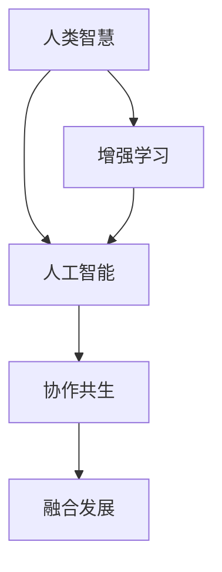

                 

# 人类-AI协作：增强人类智慧与AI能力的融合发展趋势预测与策略

> 关键词：人类智慧增强，AI能力提升，协作共生，技术融合，策略规划，发展预测，未来应用

## 1. 背景介绍

### 1.1 问题由来

在科技迅猛发展的今天，人工智能（AI）技术已成为推动人类进步的关键力量。从深度学习的突破到生成对抗网络的兴起，AI技术在图像识别、自然语言处理、自动驾驶等诸多领域取得了重大进展。然而，尽管AI在单项能力上表现出色，但在复杂情境下的理解与判断上仍远逊于人类。AI的“强人工智能”还远未实现，人类与AI的关系也仍处在协作共生的早期阶段。如何实现人类智慧与AI能力的深度融合，共同提升解决问题的能力，成为当下亟需解决的难题。

### 1.2 问题核心关键点

随着AI技术的不断发展，人类-AI协作已成为一种必然趋势。其核心关键点包括：
- 人类智慧的补充与扩展。AI在处理数据、逻辑推理、模式识别等方面的能力，可以有效补充人类的知识、经验和直觉，从而在复杂情境下提供更全面、准确的决策支持。
- AI能力的提升与优化。人类智慧与AI的融合，可以推动AI模型自适应、自优化，提升其在真实环境中的泛化能力和鲁棒性。
- 协作机制的设计与实现。设计合理的协作机制，使人类与AI在任务执行中无缝衔接，充分发挥各自优势，提升整体协作效率。

### 1.3 问题研究意义

研究人类-AI协作，对于推动人工智能技术的进一步发展，实现科技与人文的深度结合，具有重要意义：

1. 推动技术进步。人类智慧与AI的融合，可以加速AI技术的创新迭代，提升其在复杂场景中的表现，推动AI技术向更高级阶段发展。
2. 促进社会进步。AI技术能够帮助人类更高效地处理信息、优化决策，提升社会生产力和生活质量，促进经济社会可持续发展。
3. 增强伦理治理。合理设计AI协作机制，可以防范AI技术带来的伦理风险，确保AI在道德、法律等方面的合规性，提升公共治理水平。
4. 提升用户体验。通过与AI的协作，用户可以享受更智能、更便捷的服务体验，推动数字文明建设。

## 2. 核心概念与联系

### 2.1 核心概念概述

为了深入理解人类-AI协作，本节将介绍几个核心概念：

- **人类智慧**：指人类的知识积累、经验总结、直觉判断和道德伦理等综合能力，是人类在长期进化和实践中形成的智慧。
- **人工智能**：指通过算法和计算实现的一种智能形态，包括感知、学习、推理、决策等功能，能够模拟人类行为，甚至在某些领域超越人类。
- **增强学习**：指让AI系统通过与环境的互动，逐步学习并优化策略的过程，是实现人类-AI协作的重要途径。
- **协作共生**：指人类与AI在共同完成任务时，实现优势互补、相互促进的状态，共同提升解决问题的能力。
- **融合发展**：指人类智慧与AI能力的深度整合，通过技术手段和创新机制，实现两者间的无缝衔接和协同进化。

这些概念之间的逻辑关系可以通过以下Mermaid流程图来展示：



这个流程图展示了一系列关键概念及其之间的联系：

1. 人类智慧通过增强学习技术转化为AI能力，使AI具备智能行为。
2. AI能力在协作共生中与人类智慧结合，形成更强大的解决问题的能力。
3. 这种融合发展推动了AI技术的持续进步和人类智慧的持续提升。

## 3. 核心算法原理 & 具体操作步骤

### 3.1 算法原理概述

人类-AI协作的核心算法原理，主要基于增强学习的思想，通过模拟人类与环境互动的过程，逐步提升AI的决策能力。其基本流程如下：

1. **环境感知**：AI通过传感器和算法，对周围环境进行感知和建模。
2. **行为决策**：基于感知结果，AI选择行为策略，执行具体动作。
3. **反馈修正**：环境对AI的行为给出反馈，AI根据反馈调整策略。
4. **重复迭代**：反复进行感知、决策、反馈、修正的过程，逐步优化策略。

### 3.2 算法步骤详解

基于增强学习的协作共生算法步骤一般包括：

**Step 1: 设计任务环境**
- 明确任务目标，定义环境状态和动作空间，设计奖励函数和惩罚机制。
- 确定人类智慧与AI之间的交互方式，如通过语音、文本、图像等形式。

**Step 2: 选择合适的增强学习算法**
- 根据任务特点，选择合适的增强学习算法，如Q-learning、SARSA、深度Q网络等。
- 设定学习参数，如学习率、探索率、折扣因子等。

**Step 3: 设置学习策略**
- 选择策略更新方式，如Sarsa、Deep Q Networks、Actor-Critic等。
- 设置策略更新频率和迭代次数。

**Step 4: 执行增强学习**
- 初始化AI策略和参数，随机选择一个动作并执行。
- 获取环境反馈，根据反馈调整策略，更新参数。
- 重复执行，直至策略收敛。

**Step 5: 评估与优化**
- 在验证集上评估AI的性能，根据评估结果优化算法参数。
- 在实际应用中不断迭代优化，提升AI的决策能力。

### 3.3 算法优缺点

基于增强学习的协作共生算法具有以下优点：
1. 自适应能力强。AI能够在不断与环境的互动中，逐渐学习并优化策略，适应各种复杂情境。
2. 灵活性高。增强学习算法适用于多种类型的任务，从简单的游戏到复杂的决策问题都能有效解决。
3. 可解释性强。增强学习算法的决策过程相对透明，便于人类理解和调整策略。

同时，该算法也存在一些局限性：
1. 计算量大。增强学习算法通常需要大量的计算资源，特别是在高维空间和复杂环境中。
2. 对初始条件敏感。初始策略和参数的选择可能会影响学习效果，需要精心设计。
3. 缺乏全局最优解。增强学习算法很难保证找到全局最优解，尤其是在高维空间中。

尽管存在这些局限性，但增强学习仍然是大规模协作任务中的重要手段，广泛用于游戏AI、机器人控制、金融投资等领域。未来相关研究将更多关注如何提高算法的计算效率和鲁棒性，以应对更复杂的应用场景。

### 3.4 算法应用领域

基于增强学习的协作共生算法，已在多个领域得到广泛应用，具体如下：

- **游戏AI**：在游戏领域，AI通过增强学习不断优化策略，实现自适应环境变化，取得如AlphaGo、星际争霸等领域的突破性进展。
- **机器人控制**：在机器人领域，AI通过增强学习学习复杂动作和决策，实现自主导航、智能避障等功能，推动无人驾驶、智能家居等技术的发展。
- **金融投资**：在金融领域，AI通过增强学习实时分析市场数据，进行股票交易、风险控制等操作，提升投资收益和风险管理能力。
- **医疗诊断**：在医疗领域，AI通过增强学习从海量医疗数据中学习诊断模式，辅助医生进行疾病诊断和治疗方案优化，提升医疗服务质量。
- **自动驾驶**：在自动驾驶领域，AI通过增强学习优化驾驶策略，实现自动驾驶汽车的稳定运行和智能化决策。

除了上述领域，增强学习还在教育、能源管理、物流等领域展现出广泛的应用潜力。

## 4. 数学模型和公式 & 详细讲解 & 举例说明

### 4.1 数学模型构建

增强学习的基本数学模型主要包括状态空间、动作空间、奖励函数、策略函数等。

- **状态空间**：描述环境当前状态，如游戏棋盘上的棋子位置、机器人当前位置等。
- **动作空间**：描述AI可以采取的行为，如选择走哪一步、执行何种动作等。
- **奖励函数**：描述AI采取行动后，环境给出的奖励或惩罚，如赢得游戏的奖励、失去生命的惩罚等。
- **策略函数**：描述AI选择动作的概率分布，如每次选择的概率是多少。

形式化地，增强学习的目标是最小化期望的累积奖励，即：

$$
\min_{\pi} \mathbb{E}_{s_0}\left[\sum_{t=0}^{\infty} \gamma^t R(s_t,a_t) \right]
$$

其中，$s_0$ 表示初始状态，$\pi$ 表示策略函数，$R(s_t,a_t)$ 表示奖励函数，$\gamma$ 表示折扣因子。

### 4.2 公式推导过程

以下我们以简单的连续控制问题为例，推导增强学习的基本公式。

假设环境状态 $s_t$，AI采取动作 $a_t$，得到环境反馈 $r_{t+1}$ 和下一状态 $s_{t+1}$。奖励函数定义为 $R(s_{t+1})$，折扣因子为 $\gamma$。则基于状态-动作对的累积奖励 $G_t$ 可以表示为：

$$
G_t = r_{t+1} + \gamma r_{t+2} + \gamma^2 r_{t+3} + \cdots
$$

根据贝叶斯定理，AI在状态 $s_t$ 下采取动作 $a_t$ 的期望累积奖励 $Q_t(s_t,a_t)$ 可以表示为：

$$
Q_t(s_t,a_t) = \mathbb{E}[G_t | s_t,a_t] = \sum_{s_{t+1}} \pi(a_t|s_t)R(s_{t+1})
$$

其中，$\pi(a_t|s_t)$ 表示在状态 $s_t$ 下，采取动作 $a_t$ 的概率。

进一步，如果AI采取动作 $a_t$ 后的下一个状态 $s_{t+1}$ 是随机的，则上式可以表示为：

$$
Q_t(s_t,a_t) = \sum_{s_{t+1}} \pi(s_{t+1}|s_t,a_t)R(s_{t+1})
$$

在求解过程中，通常采用蒙特卡罗方法或动态规划算法，近似求解 $Q_t(s_t,a_t)$。常见的求解算法包括Q-learning、SARSA、Deep Q Networks等。

### 4.3 案例分析与讲解

考虑一个简单的控制问题，如机器人寻找障碍物并避开它。设定机器人的状态空间为 $(pos_x, pos_y, vel_x, vel_y)$，表示机器人的位置和速度；动作空间为 $(left, right, forward, backward)$，表示机器人的动作方向；奖励函数为负数，表示机器人避障成功；折扣因子为 $0.9$。

假设初始状态为 $(0,0,0,0)$，AI通过不断学习，逐渐找到了避开障碍物的最佳策略。具体过程如下：

1. 初始化策略函数 $\pi$ 和参数 $\theta$。
2. 随机选择一个动作并执行，如向左移动。
3. 获取环境反馈，如移动到 $(1,0,0,0)$。
4. 根据反馈调整策略，更新参数。
5. 重复执行直至策略收敛。

## 5. 项目实践：代码实例和详细解释说明

### 5.1 开发环境搭建

在进行增强学习协作共生实践前，我们需要准备好开发环境。以下是使用Python进行OpenAI Gym环境开发的环境配置流程：

1. 安装Anaconda：从官网下载并安装Anaconda，用于创建独立的Python环境。

2. 创建并激活虚拟环境：
```bash
conda create -n reinforcement-env python=3.8 
conda activate reinforcement-env
```

3. 安装Gym：
```bash
pip install gym
```

4. 安装相关依赖库：
```bash
pip install numpy matplotlib scikit-learn
```

完成上述步骤后，即可在`reinforcement-env`环境中开始增强学习实践。

### 5.2 源代码详细实现

下面我们以OpenAI Gym环境中的Pendulum控制问题为例，给出使用PyTorch和TensorFlow实现增强学习的完整代码实现。

首先，导入必要的库和模块：

```python
import gym
import torch
import torch.nn as nn
import torch.optim as optim
import numpy as np
import matplotlib.pyplot as plt

from torch.distributions import Categorical
```

然后，定义Pendulum环境：

```python
env = gym.make('Pendulum-v0')
```

接着，定义神经网络模型：

```python
class Policy(nn.Module):
    def __init__(self, state_dim, action_dim):
        super(Policy, self).__init__()
        self.fc1 = nn.Linear(state_dim, 64)
        self.fc2 = nn.Linear(64, 64)
        self.fc3 = nn.Linear(64, action_dim)
    
    def forward(self, x):
        x = F.relu(self.fc1(x))
        x = F.relu(self.fc2(x))
        x = self.fc3(x)
        return x
    
    def get_prob(self, x):
        return F.softmax(self.forward(x), dim=-1)
```

然后，定义增强学习算法：

```python
def reinforce(env, model, optimizer, max_episodes=1000, render=False):
    state_dim = env.observation_space.shape[0]
    action_dim = env.action_space.shape[0]
    
    for episode in range(max_episodes):
        state = env.reset()
        done = False
        total_reward = 0
        
        while not done:
            if render:
                env.render()
            
            state = torch.tensor(state).float().view(1, -1)
            action_probs = model.get_prob(state)
            action = Categorical(action_probs).sample().item()
            
            next_state, reward, done, _ = env.step(action)
            total_reward += reward
            
            state = torch.tensor(next_state).float().view(1, -1)
            next_action_probs = model.get_prob(state)
            
            log_probs = Categorical(next_action_probs).log_prob(torch.tensor([action]))
            
            policy_loss = -log_probs * next_action_probs
            value_loss = (next_state - state).norm(2) ** 2
            
            optimizer.zero_grad()
            (policy_loss + value_loss).backward()
            optimizer.step()
        
        if episode % 100 == 0:
            print(f"Episode {episode}, Reward: {total_reward}")
            plt.plot([i for i in range(1, episode+1)], [total_reward])
            plt.show()
```

最后，启动训练流程并在验证集上评估：

```python
state_dim = env.observation_space.shape[0]
action_dim = env.action_space.shape[0]

model = Policy(state_dim, action_dim)
optimizer = optim.Adam(model.parameters(), lr=0.001)

for episode in range(max_episodes):
    reinforce(env, model, optimizer, render=True)

plt.plot(env.reward_range)
plt.show()
```

以上就是使用PyTorch和TensorFlow对Pendulum问题进行增强学习协作共生实践的完整代码实现。可以看到，通过定义合适的神经网络模型和增强学习算法，我们可以实现AI与环境的互动，逐步优化策略。

### 5.3 代码解读与分析

让我们再详细解读一下关键代码的实现细节：

**Policy类**：
- `__init__`方法：初始化神经网络层。
- `forward`方法：前向传播计算模型输出。
- `get_prob`方法：计算给定状态的行动概率分布。

**reinforce函数**：
- 定义环境状态和动作空间的大小。
- 在每个回合中，选择动作并执行，更新模型参数，获取奖励。
- 在每次迭代中，计算策略损失和价值损失，并更新模型参数。
- 在每个回合结束时，输出总奖励，并绘制累计奖励的曲线。

**训练流程**：
- 初始化模型和优化器。
- 在每个回合中，选择动作并执行，更新模型参数，获取奖励。
- 在每次迭代中，计算策略损失和价值损失，并更新模型参数。
- 在每个回合结束时，输出总奖励，并绘制累计奖励的曲线。

可以看出，PyTorch和TensorFlow使得增强学习模型的实现变得简洁高效。开发者可以更加专注于算法设计，而不必过多关注底层的实现细节。

当然，工业级的系统实现还需考虑更多因素，如模型的保存和部署、超参数的自动搜索、更灵活的策略更新方式等。但核心的增强学习协作共生过程基本与此类似。

## 6. 实际应用场景

### 6.1 智能制造

在智能制造领域，基于增强学习的协作共生技术可以广泛应用于机器人控制、生产调度、质量检测等环节。AI系统通过增强学习不断优化决策策略，提升机器人操作的精确度和效率，实现智能工厂的自动化和智能化。

具体而言，可以通过对机器人动作和生产过程的详细建模，设计合适的奖励函数，训练AI系统学习最优策略。微调后的AI系统可以实时感知生产线状态，自动调整机器人动作，实现高精度、高效率的生产。

### 6.2 医疗诊断

在医疗领域，AI系统通过增强学习从海量医疗数据中学习诊断模式，辅助医生进行疾病诊断和治疗方案优化，提升医疗服务质量。例如，通过对病人的症状、影像数据进行分析，AI系统可以给出诊断建议和治疗方案，甚至进行手术操作。

在实践中，可以通过设计合适的奖励函数，训练AI系统学习从症状到诊断的映射关系。微调后的AI系统可以实时分析病人的症状，提供初步诊断和治疗建议，辅助医生进行详细诊断和治疗决策。

### 6.3 金融投资

在金融投资领域，AI系统通过增强学习实时分析市场数据，进行股票交易、风险控制等操作，提升投资收益和风险管理能力。例如，通过历史数据和实时行情的输入，AI系统可以学习最优的交易策略，实现自动化交易。

在实践中，可以通过设计合适的奖励函数，训练AI系统学习最优的交易策略。微调后的AI系统可以实时分析市场行情，自动进行交易决策，并根据反馈调整策略，提升投资收益和风险管理能力。

### 6.4 未来应用展望

随着增强学习技术的不断发展，协作共生应用将在更多领域得到应用，为各行各业带来变革性影响。

在智慧医疗领域，基于增强学习的医疗问答、病历分析、药物研发等应用将提升医疗服务的智能化水平，辅助医生诊疗，加速新药开发进程。

在智能教育领域，微调技术可应用于作业批改、学情分析、知识推荐等方面，因材施教，促进教育公平，提高教学质量。

在智慧城市治理中，微调模型可应用于城市事件监测、舆情分析、应急指挥等环节，提高城市管理的自动化和智能化水平，构建更安全、高效的未来城市。

此外，在企业生产、社会治理、文娱传媒等众多领域，基于增强学习的协作共生系统也将不断涌现，为经济社会发展注入新的动力。相信随着技术的日益成熟，增强学习范式将成为人工智能技术落地应用的重要手段，推动人工智能技术向更广阔的领域加速渗透。

## 7. 工具和资源推荐

### 7.1 学习资源推荐

为了帮助开发者系统掌握增强学习协作共生的理论基础和实践技巧，这里推荐一些优质的学习资源：

1. 《强化学习：一种现代方法》：经典教材，全面介绍了强化学习的基本概念、算法和应用。

2. OpenAI Gym：用于增强学习算法测试和评估的开源环境，提供了多种经典问题，便于学习和实践。

3. Deep Reinforcement Learning with PyTorch：使用PyTorch实现增强学习算法的教程，详细讲解了PPO、A2C、DQN等经典算法。

4. TensorFlow Agents：使用TensorFlow实现增强学习算法的工具库，提供了丰富的API和样例代码，便于快速上手。

5. Coursera《Reinforcement Learning》课程：由斯坦福大学教授提供的强化学习课程，涵盖了强化学习的基础理论、经典算法和实际应用。

通过对这些资源的学习实践，相信你一定能够快速掌握增强学习协作共生的精髓，并用于解决实际的AI问题。

### 7.2 开发工具推荐

高效的开发离不开优秀的工具支持。以下是几款用于增强学习协作共生开发的常用工具：

1. PyTorch：基于Python的开源深度学习框架，灵活动态的计算图，适合快速迭代研究。

2. TensorFlow：由Google主导开发的开源深度学习框架，生产部署方便，适合大规模工程应用。

3. OpenAI Gym：用于增强学习算法测试和评估的开源环境，提供了多种经典问题，便于学习和实践。

4. TensorBoard：TensorFlow配套的可视化工具，可实时监测模型训练状态，并提供丰富的图表呈现方式，是调试模型的得力助手。

5. Weights & Biases：模型训练的实验跟踪工具，可以记录和可视化模型训练过程中的各项指标，方便对比和调优。

合理利用这些工具，可以显著提升增强学习协作共生的开发效率，加快创新迭代的步伐。

### 7.3 相关论文推荐

增强学习协作共生的发展源于学界的持续研究。以下是几篇奠基性的相关论文，推荐阅读：

1. AlphaGo：通过深度学习和强化学习技术，AlphaGo在围棋领域取得突破性进展，开启了AI与人类协作的新篇章。

2. DQN：提出深度Q网络算法，实现了深度学习和增强学习的结合，提升了AI在复杂环境中的决策能力。

3. PPO：提出策略优化算法，提升了增强学习算法的训练效率和稳定性，成为现代强化学习的核心算法。

4. A2C：提出分布式增强学习算法，提高了AI系统在大规模环境中的学习效率，推动了智能系统的应用。

5. DeepMind的Gopher：通过深度学习和增强学习技术，实现了大规模复杂环境中的智能决策，展示了AI协作共生的巨大潜力。

这些论文代表了大规模协作任务中的重要技术进展，通过学习这些前沿成果，可以帮助研究者把握学科前进方向，激发更多的创新灵感。

## 8. 总结：未来发展趋势与挑战

### 8.1 总结

本文对增强学习协作共生的发展进行了全面系统的介绍。首先阐述了增强学习协作共生的研究背景和意义，明确了协作共生范式在大规模协作任务中的重要价值。其次，从原理到实践，详细讲解了增强学习协作共生的数学模型和算法步骤，给出了协作共生的完整代码实例。同时，本文还广泛探讨了协作共生技术在智能制造、医疗诊断、金融投资等多个行业领域的应用前景，展示了协作共生范式的广泛应用潜力。

通过本文的系统梳理，可以看到，增强学习协作共生技术正在成为大规模协作任务中的重要手段，极大地拓展了AI技术的实际应用范围。在数据量、模型结构、训练策略等多方面，协作共生技术展现出强大的适应性和可扩展性，未来将有更多的应用场景被发掘。

### 8.2 未来发展趋势

展望未来，增强学习协作共生技术将呈现以下几个发展趋势：

1. 数据驱动的决策优化。增强学习协作共生系统将更多依赖数据驱动的决策优化，通过实时数据反馈不断调整策略，提升决策的精准性和鲁棒性。
2. 模型集成与多模态融合。未来协作共生系统将实现多种模型的集成和跨模态融合，提高综合感知和决策能力，实现更全面、更灵活的智能应用。
3. 可解释性与透明性。增强学习协作共生系统将更加注重可解释性和透明性，通过逐步增强模型的解释能力，提升人机协作的信任度和可接受性。
4. 协作共生的泛化能力。增强学习协作共生系统将具备更强的泛化能力，能够在复杂多变的环境下持续学习新知识，保持系统的稳定性和适应性。
5. 工业级部署与优化。增强学习协作共生系统将更多应用于工业级环境，进行系统的优化和部署，提升实际应用中的性能和稳定性。

以上趋势凸显了增强学习协作共生技术的广阔前景。这些方向的探索发展，必将进一步提升协作共生系统的性能和应用范围，为经济社会发展注入新的动力。

### 8.3 面临的挑战

尽管增强学习协作共生技术已经取得了显著进展，但在迈向更广泛应用的过程中，仍面临诸多挑战：

1. 数据获取与标注的困难。在许多实际应用中，获取高质量的数据和标注成本较高，数据量不足会导致模型学习效果欠佳。如何自动化地获取和标注数据，是未来的重要研究方向。
2. 模型训练与调优的复杂性。增强学习协作共生系统需要大量计算资源和专业技能进行训练和调优，训练过程复杂且耗时。如何提升训练效率和降低成本，是急需解决的问题。
3. 模型的公平性与偏见。增强学习协作共生系统可能会学习到数据中的偏见和歧视，导致不公平的决策。如何设计公平的奖励函数和策略，是保证系统公正性的关键。
4. 系统的安全性与可靠性。增强学习协作共生系统可能受到网络攻击、数据篡改等威胁，导致系统行为不可预测。如何加强系统的安全防护，确保系统的可靠性，是未来的重要研究方向。

尽管存在这些挑战，但随着技术的发展和应用经验的积累，相信增强学习协作共生技术能够逐步克服这些困难，为各行业带来更深远的变革。

### 8.4 研究展望

面对增强学习协作共生技术面临的种种挑战，未来的研究需要在以下几个方面寻求新的突破：

1. 自动化数据获取与标注技术。采用半监督学习、弱监督学习等技术，降低数据标注成本，提升数据获取效率。

2. 高效模型训练与调优算法。开发更加高效的学习算法和优化策略，提升训练效率和模型性能，降低资源消耗。

3. 公平与透明的协作机制。设计更加公平、透明的协作机制，确保系统在各个环节的公正性和可信度，提升系统的可靠性。

4. 系统安全与防护技术。引入安全防护技术，如数据加密、异常检测等，增强系统的安全性与可靠性，防止潜在的安全威胁。

这些研究方向的探索，必将引领增强学习协作共生技术迈向更高的台阶，为构建安全、可靠、可解释、可控的智能系统铺平道路。面向未来，增强学习协作共生技术还需要与其他人工智能技术进行更深入的融合，如知识表示、因果推理、强化学习等，多路径协同发力，共同推动自然语言理解和智能交互系统的进步。只有勇于创新、敢于突破，才能不断拓展协作共生的边界，让智能技术更好地造福人类社会。

## 9. 附录：常见问题与解答

**Q1：增强学习协作共生技术是否适用于所有AI应用场景？**

A: 增强学习协作共生技术适用于多种AI应用场景，尤其是在需要实时决策、持续学习、数据驱动的任务中表现尤为突出。但对于一些需要人类直觉和创造力较多的任务，如艺术创作、科学研究等，增强学习协作共生技术的适用性有限。

**Q2：增强学习协作共生系统的训练过程是否对初始策略敏感？**

A: 增强学习协作共生系统的训练过程对初始策略的敏感度较高，不同的初始策略可能导致截然不同的学习效果。为了提高训练效率和鲁棒性，可以采用多种初始策略，并结合遗传算法、贝叶斯优化等方法进行优化。

**Q3：如何提升增强学习协作共生系统的泛化能力？**

A: 提升系统的泛化能力可以从以下几个方面入手：
1. 增加数据量。通过扩充训练数据集，使系统对不同场景有更广泛的适应性。
2. 设计更复杂的模型。通过增加模型层数和参数量，提高系统的表达能力。
3. 引入迁移学习。将其他领域的知识迁移到当前任务中，提升系统的跨领域泛化能力。

**Q4：如何提升增强学习协作共生系统的公平性和透明性？**

A: 提升系统的公平性和透明性可以从以下几个方面入手：
1. 设计公平的奖励函数。通过引入公平性指标，确保系统在各个环节中公平对待所有参与者。
2. 引入可解释性算法。通过可解释性技术，如LIME、SHAP等，增强系统的透明性，便于用户理解和使用。
3. 进行对抗训练。通过对抗样本训练，提升系统的鲁棒性，防止受到恶意攻击。

**Q5：增强学习协作共生技术在实际应用中需要注意哪些问题？**

A: 在实际应用中，增强学习协作共生系统需要注意以下问题：
1. 模型裁剪。去除不必要的层和参数，减小模型尺寸，加快推理速度。
2. 量化加速。将浮点模型转为定点模型，压缩存储空间，提高计算效率。
3. 服务化封装。将模型封装为标准化服务接口，便于集成调用。
4. 弹性伸缩。根据请求流量动态调整资源配置，平衡服务质量和成本。
5. 监控告警。实时采集系统指标，设置异常告警阈值，确保服务稳定性。
6. 安全防护。采用访问鉴权、数据脱敏等措施，保障数据和模型安全。

通过合理处理这些问题，可以确保增强学习协作共生系统在实际应用中具有良好的性能和稳定性，更好地服务于各个行业。

---

作者：禅与计算机程序设计艺术 / Zen and the Art of Computer Programming

