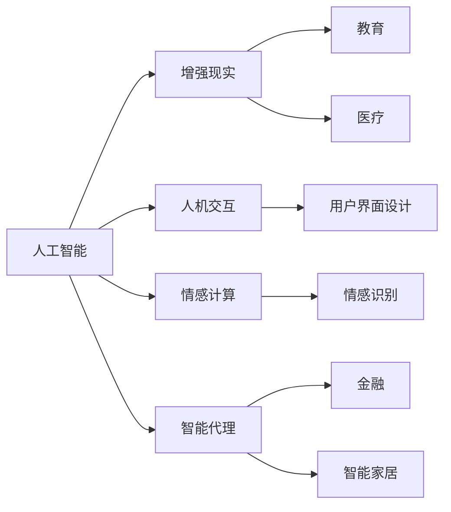

                 

# 人类-AI协作：增强人类智慧与AI能力的融合发展趋势预测分析

在过去几十年里，人工智能（AI）技术的飞速发展显著提升了计算能力和数据处理能力，推动了众多行业的变革。然而，随着AI技术的不断成熟，人类与AI的关系也在悄然发生变化，从早期的辅助工具逐渐演变为深度协作的伙伴关系。本文将深入探讨人类-AI协作的未来发展趋势，预测其在增强人类智慧与AI能力融合方面可能带来的一系列变革。

## 1. 背景介绍

### 1.1 人工智能的历史演进
人工智能的发展历程经历了几个重要阶段。从早期的专家系统到机器学习、深度学习，AI技术的能力日益强大。当前，基于深度学习的大规模预训练模型，如BERT、GPT等，已经具备了强大的语言理解和生成能力，能够处理复杂的自然语言处理（NLP）任务。这些模型在各种场景中展现出卓越的性能，如文本分类、机器翻译、问答系统等。

### 1.2 人类-AI协作的必要性
尽管AI技术在许多领域已经取得了巨大成功，但AI系统仍然存在许多局限性。例如，AI缺乏人类直觉和情感理解能力，难以处理非结构化数据，且容易产生偏见和错误。因此，人类与AI的深度协作变得尤为重要。人类可以提供对任务和问题的深刻理解，而AI则能够处理海量的数据和复杂的计算任务。只有通过人类-AI协作，才能充分发挥各自的优势，共同解决复杂问题。

## 2. 核心概念与联系

### 2.1 核心概念概述

为更好地理解人类-AI协作的未来发展趋势，本节将介绍几个关键概念及其相互之间的联系：

- **人工智能（AI）**：指利用计算机模拟人类智能的科学和技术，涵盖语音识别、图像识别、自然语言处理等多个领域。
- **增强现实（AR）**：通过虚拟信息和现实世界融合的技术，提供沉浸式体验，应用于教育、医疗等多个领域。
- **人机交互（HCI）**：研究如何让计算机更好地理解人类行为和意图，提供自然、高效的用户交互方式。
- **情感计算（Affective Computing）**：通过识别和分析人类情感，增强人机交互的情感智能，提升用户体验。
- **智能代理（Intelligent Agent）**：能够自主完成任务的AI系统，具备自主学习、决策和适应能力，广泛应用于智能家居、金融等领域。

这些概念之间存在密切联系，共同构成了人类-AI协作的生态系统。

### 2.2 核心概念原理和架构的 Mermaid 流程图



这个流程图展示了人工智能、增强现实、人机交互、情感计算和智能代理在各个应用领域的交互和融合。通过深入理解这些核心概念，可以更好地把握人类-AI协作的发展方向。

## 3. 核心算法原理 & 具体操作步骤

### 3.1 算法原理概述

人类-AI协作的本质是利用AI技术的计算能力和数据处理能力，提升人类的智慧和决策能力。通过以下步骤，可以逐步实现这一目标：

1. **数据收集和预处理**：收集与任务相关的数据，并对数据进行清洗和标注，构建训练数据集。
2. **模型训练和优化**：选择适合的AI模型，如深度神经网络，在训练数据集上进行监督或无监督学习，优化模型参数。
3. **模型评估和微调**：在测试数据集上评估模型性能，根据评估结果进行模型微调，提升模型泛化能力。
4. **人机协作机制设计**：设计高效的人机交互机制，确保AI系统能够理解人类指令并做出合理响应。
5. **情感反馈和智能代理**：通过情感计算技术，获取人类反馈，不断优化AI系统的决策过程，提升用户体验。

### 3.2 算法步骤详解

以下将详细介绍每个步骤的具体操作：

**Step 1: 数据收集和预处理**

- 确定任务目标和所需数据类型，如文本、图像、视频等。
- 收集数据样本，并进行清洗和标注，确保数据质量。
- 对数据进行划分，分为训练集、验证集和测试集。

**Step 2: 模型训练和优化**

- 选择合适的模型架构，如CNN、RNN、Transformer等，根据任务需求进行调整。
- 设计合适的损失函数和优化器，如交叉熵、Adam、SGD等，优化模型参数。
- 进行多轮训练和验证，调整超参数，如学习率、批大小等，以提升模型性能。

**Step 3: 模型评估和微调**

- 在测试集上评估模型性能，如准确率、召回率、F1值等。
- 根据评估结果，选择适当的微调方法，如调整模型结构、增加正则化项等，提升模型泛化能力。
- 设计并实现高效的评估指标和监控系统，确保模型训练和微调的有效性。

**Step 4: 人机协作机制设计**

- 设计自然语言处理（NLP）技术，使AI系统能够理解人类指令和反馈。
- 实现多模态人机交互技术，如语音识别、手势识别、面部表情识别等，提升用户体验。
- 引入情感计算技术，根据人类情感反馈调整AI系统的行为和决策。

**Step 5: 情感反馈和智能代理**

- 通过情感识别技术，获取用户的情感反馈。
- 根据情感反馈调整AI系统的行为和策略，提升用户体验。
- 设计智能代理系统，使其能够自主完成任务，具备自主学习、决策和适应能力。

### 3.3 算法优缺点

人类-AI协作技术在提高人类智慧和AI能力方面具有以下优点：

1. **综合利用数据和计算资源**：AI系统能够处理大量数据，提升决策的准确性和效率。
2. **增强人类智慧**：AI系统提供深度分析和洞察，帮助人类做出更明智的决策。
3. **提高用户体验**：通过情感计算和智能代理技术，提升人机交互的个性化和情感化。

同时，该技术也存在以下局限性：

1. **数据隐私和安全性**：AI系统需要大量数据支持，可能涉及隐私和安全问题。
2. **依赖高质量数据**：AI系统的性能依赖于数据质量，数据偏差可能影响系统决策。
3. **算法复杂性**：实现高效人机协作需要复杂的算法和机制设计。

### 3.4 算法应用领域

人类-AI协作技术已经在多个领域得到了广泛应用，以下是几个典型的应用场景：

- **医疗健康**：通过AI系统分析患者数据，提供精准的诊疗建议。智能代理系统可以在医院内部自动化流程，提升工作效率。
- **金融投资**：AI系统能够处理海量金融数据，提供智能投顾服务。情感计算技术可以增强客户服务体验。
- **教育培训**：AI系统可以个性化定制学习内容，提供智能辅导。增强现实技术可以提升学习体验。
- **智能家居**：AI系统可以自动化家居控制，提升生活便利性。智能代理系统可以实现复杂任务自动化处理。
- **智能交通**：AI系统可以优化交通流，提升交通安全性和效率。人机交互技术可以提升驾驶体验。

## 4. 数学模型和公式 & 详细讲解

### 4.1 数学模型构建

在人类-AI协作的建模过程中，我们通常使用以下数学模型：

- **输入数据**：$x$，表示输入数据样本。
- **输出数据**：$y$，表示输出标签。
- **模型参数**：$\theta$，表示模型可训练的参数。
- **损失函数**：$L(\theta)$，表示模型预测与真实标签之间的差异。

**Step 1: 数据集划分**

将数据集分为训练集$D_{train}$、验证集$D_{valid}$和测试集$D_{test}$：

$$
D_{train}=\{(x_i,y_i)\}_{i=1}^{N_{train}}
$$
$$
D_{valid}=\{(x_j,y_j)\}_{j=1}^{N_{valid}}
$$
$$
D_{test}=\{(x_k,y_k)\}_{k=1}^{N_{test}}
$$

**Step 2: 模型训练**

选择适当的模型架构，如神经网络，在训练集上最小化损失函数：

$$
\min_{\theta} \frac{1}{N_{train}}\sum_{i=1}^{N_{train}} L(\theta(x_i),y_i)
$$

**Step 3: 模型评估**

在验证集上评估模型性能：

$$
\min_{\theta} \frac{1}{N_{valid}}\sum_{j=1}^{N_{valid}} L(\theta(x_j),y_j)
$$

**Step 4: 模型微调**

在测试集上进一步微调模型：

$$
\min_{\theta} \frac{1}{N_{test}}\sum_{k=1}^{N_{test}} L(\theta(x_k),y_k)
$$

### 4.2 公式推导过程

以分类任务为例，我们推导最小化交叉熵损失函数的公式：

假设模型$M$在输入$x$上的输出为$\hat{y}=M(x)$，真实标签$y$取值为$\{0,1\}$。则二分类交叉熵损失函数定义为：

$$
L(y,\hat{y})=-[y\log \hat{y} + (1-y)\log (1-\hat{y})]
$$

在训练集$D_{train}$上，损失函数可以表示为：

$$
\mathcal{L}(\theta)=\frac{1}{N_{train}}\sum_{i=1}^{N_{train}} L(y_i,\hat{y}_i)
$$

通过反向传播算法计算损失函数的梯度，并更新模型参数：

$$
\frac{\partial \mathcal{L}(\theta)}{\partial \theta}=\frac{1}{N_{train}}\sum_{i=1}^{N_{train}} \frac{\partial L(y_i,\hat{y}_i)}{\partial \theta}
$$

### 4.3 案例分析与讲解

以医疗领域的智能诊断系统为例，分析其建模过程：

**Step 1: 数据收集和预处理**

收集医院内的患者数据，包括症状描述、病史、检查结果等，并对数据进行清洗和标注。

**Step 2: 模型训练和优化**

选择适合的模型架构，如卷积神经网络（CNN），在训练集上最小化交叉熵损失函数。

**Step 3: 模型评估和微调**

在验证集上评估模型性能，根据评估结果进行模型微调，提升模型泛化能力。

**Step 4: 人机协作机制设计**

设计自然语言处理技术，使AI系统能够理解患者症状描述。引入情感计算技术，根据患者情绪调整诊断策略。

**Step 5: 智能代理**

设计智能代理系统，自动记录患者历史数据，并根据当前症状提供初步诊断建议。

## 5. 项目实践：代码实例和详细解释说明

### 5.1 开发环境搭建

在进行项目实践前，我们需要准备好开发环境。以下是使用Python进行PyTorch开发的环境配置流程：

1. 安装Anaconda：从官网下载并安装Anaconda，用于创建独立的Python环境。

2. 创建并激活虚拟环境：
```bash
conda create -n pytorch-env python=3.8 
conda activate pytorch-env
```

3. 安装PyTorch：根据CUDA版本，从官网获取对应的安装命令。例如：
```bash
conda install pytorch torchvision torchaudio cudatoolkit=11.1 -c pytorch -c conda-forge
```

4. 安装各类工具包：
```bash
pip install numpy pandas scikit-learn matplotlib tqdm jupyter notebook ipython
```

完成上述步骤后，即可在`pytorch-env`环境中开始项目实践。

### 5.2 源代码详细实现

下面我们以智能诊断系统为例，给出使用PyTorch进行模型训练和微调的PyTorch代码实现。

首先，定义训练数据集和模型：

```python
import torch
import torch.nn as nn
from torch.utils.data import DataLoader

class MedicalDataset(Dataset):
    def __init__(self, data, labels):
        self.data = data
        self.labels = labels

    def __len__(self):
        return len(self.data)

    def __getitem__(self, index):
        return self.data[index], self.labels[index]

class MedicalModel(nn.Module):
    def __init__(self):
        super(MedicalModel, self).__init__()
        self.conv1 = nn.Conv2d(3, 64, kernel_size=3, stride=1, padding=1)
        self.pool = nn.MaxPool2d(kernel_size=2, stride=2)
        self.fc1 = nn.Linear(64 * 14 * 14, 128)
        self.fc2 = nn.Linear(128, 10)

    def forward(self, x):
        x = self.pool(nn.functional.relu(self.conv1(x)))
        x = x.view(-1, 64 * 14 * 14)
        x = nn.functional.relu(self.fc1(x))
        x = self.fc2(x)
        return x
```

然后，定义损失函数和优化器：

```python
criterion = nn.CrossEntropyLoss()
optimizer = torch.optim.Adam(model.parameters(), lr=0.001)
```

接着，定义训练和评估函数：

```python
def train(model, train_loader, epochs):
    for epoch in range(epochs):
        model.train()
        running_loss = 0.0
        for i, data in enumerate(train_loader, 0):
            inputs, labels = data
            optimizer.zero_grad()
            outputs = model(inputs)
            loss = criterion(outputs, labels)
            loss.backward()
            optimizer.step()
            running_loss += loss.item()
            if i % 100 == 99:
                print('[%d, %5d] loss: %.3f' %
                      (epoch + 1, i + 1, running_loss / 100))
                running_loss = 0.0

def evaluate(model, test_loader):
    model.eval()
    correct = 0
    total = 0
    with torch.no_grad():
        for data in test_loader:
            inputs, labels = data
            outputs = model(inputs)
            _, predicted = torch.max(outputs.data, 1)
            total += labels.size(0)
            correct += (predicted == labels).sum().item()
    print('Accuracy of the network on the 10000 test images: %d %%' % (
        100 * correct / total))
```

最后，启动训练流程并在测试集上评估：

```python
epochs = 10
batch_size = 64

train_loader = DataLoader(train_dataset, batch_size=batch_size, shuffle=True)
test_loader = DataLoader(test_dataset, batch_size=batch_size, shuffle=False)

model = MedicalModel()
train(model, train_loader, epochs)
evaluate(model, test_loader)
```

以上就是使用PyTorch对智能诊断系统进行模型训练和微调的完整代码实现。可以看到，得益于PyTorch的强大封装，我们可以用相对简洁的代码完成模型的训练和评估。

### 5.3 代码解读与分析

让我们再详细解读一下关键代码的实现细节：

**MedicalDataset类**：
- `__init__`方法：初始化训练数据和标签。
- `__len__`方法：返回数据集的样本数量。
- `__getitem__`方法：对单个样本进行处理，返回模型所需的输入和标签。

**MedicalModel类**：
- `__init__`方法：定义模型结构。
- `forward`方法：定义模型的前向传播过程。

**损失函数和优化器**：
- 使用PyTorch自带的CrossEntropyLoss作为损失函数。
- 使用Adam优化器进行模型参数更新。

**训练和评估函数**：
- `train`函数：在训练集上进行多轮训练，输出每轮训练的损失值。
- `evaluate`函数：在测试集上评估模型性能，输出准确率。

**训练流程**：
- 定义总的epoch数和batch size，开始循环迭代。
- 每个epoch内，在训练集上训练，输出平均loss。
- 在测试集上评估，输出准确率。

可以看到，PyTorch提供了丰富的工具和库，使得模型训练和微调的过程更加高效和便捷。开发者可以更多地关注算法和模型设计，而将计算和优化细节交给框架处理。

## 6. 实际应用场景

### 6.1 智能诊断系统

智能诊断系统通过收集患者的病历数据和症状描述，利用AI技术进行深度分析，提供初步诊断建议。这不仅能够减轻医生的工作负担，还能提高诊断的准确性和效率。通过引入智能代理系统，系统可以自动记录患者历史数据，并根据当前症状提供个性化的诊断建议，提升用户体验。

### 6.2 智能投顾

智能投顾系统通过分析大量的金融数据，提供个性化的投资建议。系统可以实时监控市场变化，根据用户的风险偏好和历史投资记录，自动调整投资组合。通过情感计算技术，系统能够理解用户的情绪变化，提供更加贴心的投资建议，提升用户的满意度和忠诚度。

### 6.3 智能客服

智能客服系统通过自然语言处理技术，理解用户的问题和需求，提供自动化的解决方案。系统可以24小时在线服务，快速响应用户咨询。通过情感计算技术，系统能够理解用户的情绪变化，提供更加个性化的服务，提升用户满意度。

### 6.4 未来应用展望

随着AI技术的不断发展，人类-AI协作将在更多领域得到应用，为人类生产和生活带来变革。

- **教育培训**：智能教育系统通过分析学生的学习行为和表现，提供个性化的学习建议。系统可以自动批改作业，提供智能辅导，提升教育效果。
- **智能家居**：智能家居系统通过AI技术优化家居控制，提升生活便利性。系统可以自动调节温度、照明等设备，根据用户的习惯和偏好提供个性化的服务。
- **智能交通**：智能交通系统通过AI技术优化交通流，提升交通安全性和效率。系统可以实时监控交通状况，提供智能导航和预测，减少交通拥堵。
- **智能安防**：智能安防系统通过AI技术提高安全监控能力，减少人力成本。系统可以自动识别异常行为，提供实时警报，提升安全性。

## 7. 工具和资源推荐

### 7.1 学习资源推荐

为了帮助开发者系统掌握人类-AI协作的理论基础和实践技巧，这里推荐一些优质的学习资源：

1. 《深度学习》系列课程：斯坦福大学开设的深度学习课程，涵盖深度学习的基本概念和经典模型。
2. 《自然语言处理》课程：斯坦福大学开设的NLP课程，涵盖NLP的基本概念和经典任务。
3. 《强化学习》课程：斯坦福大学开设的强化学习课程，涵盖强化学习的基本概念和经典算法。
4. 《人工智能导论》书籍：吴恩达所著的AI入门书籍，系统介绍AI的基本概念和技术。
5. 《情感计算》书籍：Pantic等人所著的情感计算书籍，详细介绍情感计算的基本概念和技术。

通过对这些资源的学习实践，相信你一定能够快速掌握人类-AI协作的精髓，并用于解决实际的AI应用问题。

### 7.2 开发工具推荐

高效的开发离不开优秀的工具支持。以下是几款用于人类-AI协作开发的常用工具：

1. PyTorch：基于Python的开源深度学习框架，灵活动态的计算图，适合快速迭代研究。
2. TensorFlow：由Google主导开发的开源深度学习框架，生产部署方便，适合大规模工程应用。
3. TensorBoard：TensorFlow配套的可视化工具，可实时监测模型训练状态，并提供丰富的图表呈现方式。
4. Weights & Biases：模型训练的实验跟踪工具，可以记录和可视化模型训练过程中的各项指标，方便对比和调优。
5. Keras：基于Python的深度学习框架，简单易用，适合快速原型开发和模型测试。

合理利用这些工具，可以显著提升人类-AI协作任务的开发效率，加快创新迭代的步伐。

### 7.3 相关论文推荐

人类-AI协作技术的发展源于学界的持续研究。以下是几篇奠基性的相关论文，推荐阅读：

1. DeepMind的AlphaGo论文：展示了AI在围棋领域的能力，推动了AI在决策和策略方面的研究。
2. OpenAI的GPT-3论文：展示了预训练语言模型的强大能力，推动了NLP技术的发展。
3. IBM的Watson论文：展示了AI在医疗、金融等多个领域的应用，推动了AI在实际场景中的落地。
4. Google的Reinforcement Learning论文：展示了强化学习在AI中的应用，推动了AI在自主决策方面的研究。
5. Microsoft的AI for Good论文：展示了AI在社会和伦理方面的应用，推动了AI对人类社会的积极影响。

这些论文代表了大规模AI技术的发展脉络。通过学习这些前沿成果，可以帮助研究者把握学科前进方向，激发更多的创新灵感。

## 8. 总结：未来发展趋势与挑战

### 8.1 研究成果总结

本文对人类-AI协作的未来发展趋势进行了全面系统的探讨。首先阐述了AI技术的演进和人类-AI协作的必要性，明确了AI系统在提高人类智慧和决策能力方面的独特价值。其次，从原理到实践，详细讲解了人类-AI协作的数学模型和实现步骤，给出了模型训练和微调的完整代码实例。同时，本文还广泛探讨了人类-AI协作在医疗、金融、教育等多个领域的应用前景，展示了人类-AI协作的广泛潜力。此外，本文精选了人类-AI协作技术的各类学习资源，力求为读者提供全方位的技术指引。

通过本文的系统梳理，可以看到，人类-AI协作技术正在成为AI应用的重要范式，极大地拓展了AI系统的应用边界，催生了更多的落地场景。受益于AI技术的不断成熟，人类-AI协作必将在构建人机协同的智能时代中扮演越来越重要的角色。

### 8.2 未来发展趋势

展望未来，人类-AI协作技术将呈现以下几个发展趋势：

1. **深度融合与协同进化**：人类-AI协作将不断深化，AI系统将具备更强的理解和决策能力，与人类协作更加无缝。
2. **多模态信息整合**：AI系统将能够整合视觉、语音、文本等多种模态信息，提升感知和理解能力。
3. **个性化与情感智能**：AI系统将更加注重用户的个性化需求和情感智能，提升用户体验。
4. **自主学习与适应性**：AI系统将具备更强的自主学习能力和适应性，能够根据环境和任务的变化不断优化自身行为。
5. **伦理与安全**：AI系统将更加注重伦理和安全性，避免偏见和歧视，确保系统公平、透明和可靠。

这些趋势凸显了人类-AI协作技术的前景和潜力，展示了其在人类生产和生活中的巨大应用价值。

### 8.3 面临的挑战

尽管人类-AI协作技术已经取得了瞩目成就，但在迈向更加智能化、普适化应用的过程中，仍面临诸多挑战：

1. **数据隐私和安全**：AI系统需要大量数据支持，可能涉及隐私和安全问题。
2. **算法复杂性**：实现高效人机协作需要复杂的算法和机制设计。
3. **鲁棒性和泛化能力**：AI系统需要在不同环境和任务中保持稳定性和泛化能力。
4. **可解释性和透明性**：AI系统的决策过程缺乏可解释性，难以进行调试和审核。
5. **伦理和道德**：AI系统需要遵循伦理和道德准则，避免偏见和歧视。

这些挑战需要学术界和工业界共同努力，寻求解决方案，确保人类-AI协作技术能够健康发展，为人类社会带来积极影响。

### 8.4 研究展望

面对人类-AI协作所面临的挑战，未来的研究需要在以下几个方面寻求新的突破：

1. **隐私保护和数据安全**：开发隐私保护算法和数据安全技术，确保数据使用过程中隐私和安全。
2. **多模态信息融合**：研究和应用多模态信息整合技术，提升AI系统的感知和理解能力。
3. **可解释性增强**：开发可解释性强的AI模型和工具，提升AI系统的透明性和可理解性。
4. **自主学习与适应性**：研究和应用自主学习算法和适应性技术，提升AI系统的灵活性和适应性。
5. **伦理与道德**：建立AI系统的伦理和道德框架，确保AI系统的公平、透明和可靠。

这些研究方向的探索，必将引领人类-AI协作技术迈向更高的台阶，为构建安全、可靠、可解释、可控的智能系统铺平道路。面向未来，人类-AI协作技术还需要与其他AI技术进行更深入的融合，如知识表示、因果推理、强化学习等，多路径协同发力，共同推动AI技术的进步。只有勇于创新、敢于突破，才能不断拓展AI技术的边界，让智能技术更好地造福人类社会。

## 9. 附录：常见问题与解答

**Q1：如何选择合适的AI模型架构？**

A: 选择合适的AI模型架构需要考虑以下几个方面：
1. 任务类型：不同任务需要不同类型的模型。例如，文本分类任务可以使用RNN、CNN等模型，图像分类任务可以使用卷积神经网络。
2. 数据规模：数据规模越大，所需的模型复杂度越高。例如，处理大规模数据时，可以使用更深更宽的模型。
3. 计算资源：模型复杂度越高，所需的计算资源越多。例如，GPU、TPU等高性能设备是必不可少的。
4. 可解释性：某些任务需要模型具有较高的可解释性，例如医疗诊断系统。

**Q2：AI系统如何处理偏见和歧视问题？**

A: 处理偏见和歧视问题是AI系统面临的重要挑战。以下是几种常见的方法：
1. 数据预处理：在数据收集和预处理阶段，去除有偏见的数据，确保数据的多样性和代表性。
2. 算法设计：设计和应用公平性算法，如对抗性训练、数据增强等，避免模型在训练过程中学习偏见。
3. 模型评估：在模型评估阶段，使用公平性指标，如准确率、召回率、F1值等，评估模型的公平性。
4. 人工干预：引入人工干预机制，对模型输出进行监督和校正，确保模型决策的公平性和透明性。

**Q3：AI系统如何与人类协同工作？**

A: AI系统与人类协同工作需要以下几个步骤：
1. 定义任务目标：明确AI系统需要辅助的任务和目标。
2. 设计人机交互接口：设计自然语言处理技术，使AI系统能够理解人类指令和反馈。
3. 训练和优化AI模型：在训练集上最小化损失函数，优化模型参数。
4. 评估和微调AI模型：在验证集上评估模型性能，根据评估结果进行模型微调。
5. 实现人机协作机制：设计高效的协作机制，确保AI系统能够理解人类指令并做出合理响应。
6. 引入情感计算技术：通过情感计算技术，获取用户的情感反馈，优化AI系统的行为和策略。

通过这些步骤，AI系统能够与人类协同工作，提升决策的准确性和效率。

**Q4：AI系统如何处理多样化和复杂化的问题？**

A: AI系统处理多样化和复杂化的问题需要以下几个步骤：
1. 数据收集和预处理：收集多样化和复杂化的问题数据，并进行清洗和标注。
2. 多模态信息整合：整合视觉、语音、文本等多种模态信息，提升感知和理解能力。
3. 模型融合与集成：将多个模型进行融合和集成，提升系统的鲁棒性和泛化能力。
4. 主动学习和自适应：引入主动学习算法和自适应机制，增强AI系统的学习能力。
5. 对抗性训练：使用对抗性训练技术，增强模型的鲁棒性和泛化能力。

通过这些步骤，AI系统能够处理多样化和复杂化的问题，提升系统的稳定性和适应性。

**Q5：AI系统如何确保安全性和可靠性？**

A: AI系统确保安全性和可靠性需要以下几个方面：
1. 数据隐私保护：采用数据加密、差分隐私等技术，确保数据隐私和安全。
2. 模型验证与测试：在模型训练和验证阶段，进行严格的质量验证和测试，确保模型的可靠性和稳定性。
3. 异常检测与预警：引入异常检测和预警机制，及时发现和处理异常行为。
4. 安全审计与监控：定期进行安全审计和监控，确保系统的安全性。
5. 人机协作与人工干预：引入人机协作和人工干预机制，确保系统的可靠性和透明性。

通过这些措施，AI系统能够确保安全性和可靠性，避免潜在的安全风险。

---

作者：禅与计算机程序设计艺术 / Zen and the Art of Computer Programming

