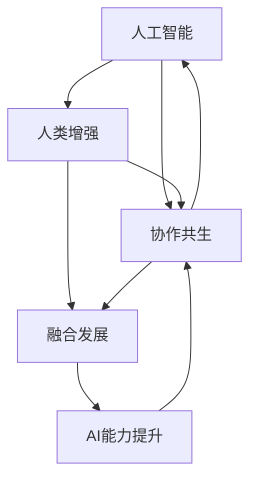

                 

# 人类-AI协作：增强人类潜能与AI能力的融合发展趋势分析预测机遇

> 关键词：人类增强,人工智能,协作共生,融合发展,AI能力提升,趋势分析,预测机遇

## 1. 背景介绍

### 1.1 问题由来

当前，人类正处于数字化转型的关键阶段，信息技术在各行各业的应用日益广泛。然而，技术的快速发展也带来了新的挑战：一方面，AI技术的广泛应用提升了生产效率，创造了巨大的经济价值；另一方面，技术的不成熟、数据隐私、伦理道德等问题也逐渐凸显，需要引起重视。在此背景下，如何实现人类与AI技术的深度融合，构建协作共生的未来，成为社会各界关注的焦点。

### 1.2 问题核心关键点

为了更好地理解和应对这一问题，本文将从人类增强与AI能力的融合发展趋势入手，深入分析预测未来AI技术对人类社会的影响，探索AI与人类协作共生的发展机遇。具体而言，我们将关注以下几个关键问题：

1. AI技术如何提升人类生产效率、改善生活质量，同时确保数据隐私和伦理道德。
2. AI与人类协作共生的最佳模式，如何实现技术的普及和应用。
3. 未来AI技术的演进路径，以及它对人类社会的深远影响。
4. 人类-AI协作的发展机遇，如何结合人工智能与人类智慧，推动社会进步。

## 2. 核心概念与联系

### 2.1 核心概念概述

为了更好地理解人类-AI协作的趋势和机遇，首先需要明确以下几个核心概念：

- **人工智能(AI)**：以数据驱动、算法驱动的机器学习、深度学习等为代表的智能技术，能够模拟和延伸人类智能能力。
- **人类增强(Human Augmentation)**：通过人工智能技术，增强人类的感知、认知、决策等能力，实现人机协同。
- **协作共生(Co-Existence)**：AI技术与人类在各自擅长的领域内协同工作，共同解决复杂问题，实现互补。
- **融合发展(Fusion Development)**：AI技术与人类智慧的深度融合，实现技术与人文、伦理、社会的有机结合。
- **AI能力提升(Enhancement of AI Capabilities)**：通过算法优化、数据增强等手段，提升AI系统的性能和效率，推动技术边界扩展。

### 2.2 核心概念原理和架构的 Mermaid 流程图



这个流程图展示了各个概念之间的关系：人工智能通过增强人类的能力，进而促进协作共生，实现融合发展，同时不断提升AI自身的性能。人类增强和协作共生是未来AI技术发展的两个关键方向。

## 3. 核心算法原理 & 具体操作步骤

### 3.1 算法原理概述

人类-AI协作的本质是利用AI技术的优势，弥补人类能力的短板，实现人机互补。具体而言，AI能力提升是协作共生的基础，通过算法优化、数据增强等手段，提升AI系统的性能和效率。而人类增强则是协作共生的关键，通过增强人类的感知、认知、决策等能力，实现人机协同。

### 3.2 算法步骤详解

实现人类-AI协作通常需要经过以下步骤：

1. **数据收集与预处理**：收集相关数据，进行清洗、标注等预处理，为AI模型训练提供数据基础。
2. **模型训练与优化**：选择合适的算法和模型，在预处理后的数据上训练模型，并通过交叉验证等手段优化模型参数。
3. **增强技术应用**：将训练好的模型应用于实际场景，提升人类感知、认知、决策等能力。
4. **协作共生实现**：在实际应用中，将AI技术与人类智慧相结合，实现协作共生。

### 3.3 算法优缺点

**优点**：
- 利用AI技术的高效处理能力，提升人类工作效率和决策质量。
- 通过AI技术对大数据的深度挖掘，发现人类难以发现的模式和规律。
- 实现人机互补，提高问题解决的多样性和创新性。

**缺点**：
- AI技术的自动化可能取代部分人类工作，导致失业问题。
- 数据隐私和伦理道德问题，如数据泄露、算法偏见等。
- AI技术的普及和应用需要大量的技术投入和人力资源。

### 3.4 算法应用领域

人类-AI协作的应用领域非常广泛，包括但不限于以下几个方面：

- **医疗健康**：利用AI技术进行疾病诊断、治疗方案推荐、健康管理等，提升医疗服务质量和效率。
- **金融保险**：通过AI技术进行风险评估、欺诈检测、客户服务等，提高金融服务的精准性和安全性。
- **教育培训**：利用AI技术进行个性化教学、智能辅导、学习分析等，提升教育效果和教学体验。
- **智能制造**：通过AI技术进行生产调度、质量控制、设备维护等，提高制造业的智能化水平。
- **交通出行**：利用AI技术进行交通流量分析、路径优化、自动驾驶等，提升交通管理的效率和安全性。

## 4. 数学模型和公式 & 详细讲解 & 举例说明

### 4.1 数学模型构建

在人类-AI协作的实现过程中，数据收集、模型训练和优化等环节都需要构建相应的数学模型。以下以医疗健康领域的疾病预测为例，构建一个简单的数学模型：

设 $X = (x_1, x_2, ..., x_n)$ 为患者的症状、生活习惯等特征向量，$Y$ 为疾病状态（如0表示健康，1表示患病），$h(X)$ 为疾病预测模型。则疾病预测的数学模型为：

$$
Y = h(X) = \sigma(WX + b)
$$

其中 $\sigma$ 为激活函数，$W$ 和 $b$ 为模型的权重和偏置。

### 4.2 公式推导过程

在构建模型后，通过训练数据集对模型进行优化。以随机梯度下降法为例，其优化过程如下：

1. 初始化模型参数 $W$ 和 $b$。
2. 随机从训练集中选取一个小样本 $(x_i, y_i)$。
3. 计算模型预测输出 $\hat{y}_i = \sigma(Wx_i + b)$。
4. 计算损失函数 $L = (y_i - \hat{y}_i)^2$。
5. 更新模型参数：

$$
W \leftarrow W - \eta \nabla_L W, \quad b \leftarrow b - \eta \nabla_L b
$$

其中 $\eta$ 为学习率。

### 4.3 案例分析与讲解

假设我们收集了1000名患者的症状和疾病数据，将其分为训练集和测试集。通过随机梯度下降法对模型进行训练，最终得到疾病预测模型 $h(X)$。然后，使用测试集对模型进行评估，计算预测准确率。

## 5. 项目实践：代码实例和详细解释说明

### 5.1 开发环境搭建

要实现上述数学模型的训练和评估，需要搭建一个Python开发环境。以下是一个简单的搭建步骤：

1. 安装Python：从官网下载并安装最新版本的Python。
2. 安装Pip：在终端输入 `python -m pip install --upgrade pip` 更新Pip。
3. 安装相关库：使用Pip安装NumPy、SciPy、Pandas等科学计算库。

### 5.2 源代码详细实现

以下是一个简单的Python代码实现：

```python
import numpy as np
from sklearn.model_selection import train_test_split
from sklearn.linear_model import LogisticRegression
from sklearn.metrics import accuracy_score

# 构造样本数据
X = np.random.randn(1000, 10)
y = np.random.randint(2, size=1000)

# 数据分割
X_train, X_test, y_train, y_test = train_test_split(X, y, test_size=0.2, random_state=42)

# 初始化模型
model = LogisticRegression()

# 模型训练
model.fit(X_train, y_train)

# 模型评估
y_pred = model.predict(X_test)
accuracy = accuracy_score(y_test, y_pred)
print(f"Accuracy: {accuracy}")
```

### 5.3 代码解读与分析

以上代码实现了基本的逻辑回归模型，并计算了模型在测试集上的准确率。代码中，首先构造了1000个样本数据，将其分为训练集和测试集。然后，使用逻辑回归模型对训练集进行训练，并使用测试集评估模型的准确率。

## 6. 实际应用场景

### 6.1 医疗健康

在医疗健康领域，AI技术已经得到了广泛应用。以下是一个简单的应用场景：

**场景描述**：某医院希望通过AI技术提升疾病预测能力。

**技术实现**：
1. 收集大量患者症状、生活习惯等数据，进行清洗和标注。
2. 使用随机梯度下降法训练逻辑回归模型，对疾病进行预测。
3. 将模型应用于实际临床数据，提升疾病预测准确率。

**效果评估**：通过评估模型的预测准确率和误差率，确定模型在实际应用中的表现。

### 6.2 金融保险

在金融保险领域，AI技术可以用于风险评估、欺诈检测、客户服务等。以下是一个简单的应用场景：

**场景描述**：某银行希望通过AI技术提升欺诈检测能力。

**技术实现**：
1. 收集客户的交易记录、行为数据等，进行清洗和标注。
2. 使用深度学习模型，如卷积神经网络、循环神经网络等，对客户行为进行特征提取和分类。
3. 将模型应用于实时交易数据，检测可疑交易行为。

**效果评估**：通过评估模型的检测准确率和误报率，确定模型在实际应用中的表现。

### 6.3 教育培训

在教育培训领域，AI技术可以用于个性化教学、智能辅导、学习分析等。以下是一个简单的应用场景：

**场景描述**：某在线教育平台希望通过AI技术提升个性化教学能力。

**技术实现**：
1. 收集学生的学习行为数据，如观看时长、练习成绩等。
2. 使用深度学习模型，对学生进行行为特征提取和分类。
3. 根据学生的学习情况，推荐适合的课程和学习资源。

**效果评估**：通过评估学生的学习效果和满意度，确定模型在实际应用中的表现。

### 6.4 智能制造

在智能制造领域，AI技术可以用于生产调度、质量控制、设备维护等。以下是一个简单的应用场景：

**场景描述**：某制造企业希望通过AI技术提升生产效率。

**技术实现**：
1. 收集生产设备的数据，如温度、湿度、振动等。
2. 使用深度学习模型，对设备状态进行预测和诊断。
3. 根据设备状态，调整生产计划和维护方案。

**效果评估**：通过评估生产效率和设备维护成本，确定模型在实际应用中的表现。

### 6.5 交通出行

在交通出行领域，AI技术可以用于交通流量分析、路径优化、自动驾驶等。以下是一个简单的应用场景：

**场景描述**：某城市希望通过AI技术提升交通管理效率。

**技术实现**：
1. 收集交通流量、路况、车辆位置等数据。
2. 使用深度学习模型，对交通流量进行预测和优化。
3. 将模型应用于交通信号灯控制，优化交通流量。

**效果评估**：通过评估交通流量和车辆通行时间，确定模型在实际应用中的表现。

## 7. 工具和资源推荐

### 7.1 学习资源推荐

为了更好地掌握人类-AI协作的相关知识，以下推荐几个优质的学习资源：

1. **《深度学习》课程**：斯坦福大学开设的深度学习课程，涵盖深度学习基础、算法和应用。
2. **《人类增强与AI协作》书籍**：详细介绍了AI技术在各领域的应用，并探讨了AI与人类协作的融合发展。
3. **ArXiv预印本**：最新的AI研究论文，涵盖多个领域的前沿技术，能够获取最新的学术进展。
4. **GitHub代码库**：开源项目和代码库，提供丰富的AI技术实现案例，适合实践和参考。
5. **在线课程平台**：Coursera、edX等平台，提供系统化的AI课程，适合初学者和进阶者。

### 7.2 开发工具推荐

以下是几个常用的AI开发工具：

1. **TensorFlow**：由Google开发的深度学习框架，功能强大，支持多种模型训练和优化。
2. **PyTorch**：Facebook开发的深度学习框架，灵活高效，适用于科研和工业开发。
3. **Scikit-learn**：Python的机器学习库，提供了多种算法和模型，易于使用。
4. **Keras**：基于TensorFlow和Theano的高级API，提供简单易用的模型构建和训练接口。
5. **Jupyter Notebook**：Python的交互式编程环境，支持多种编程语言和数据处理工具。

### 7.3 相关论文推荐

以下推荐几篇关于人类-AI协作的重要论文，值得深入阅读：

1. **《人工智能与人类增强：一种协同共生视角》**：探讨AI技术与人类增强的协作共生，提出协同共生的理论框架和应用场景。
2. **《深度学习在医疗健康领域的应用》**：介绍深度学习在疾病预测、影像分析等方面的应用，并探讨其对医疗健康的影响。
3. **《AI与金融服务：融合与创新》**：探讨AI技术在金融服务中的融合创新，提出AI与金融服务的协同共生模式。
4. **《教育领域的人工智能：个性化教学与智能辅导》**：介绍AI技术在教育中的应用，探讨其对教育改革的影响。
5. **《智能制造与AI技术的融合发展》**：探讨AI技术在智能制造中的应用，提出智能制造的未来发展方向。

## 8. 总结：未来发展趋势与挑战

### 8.1 研究成果总结

通过以上分析和实践，我们可以看到，人类-AI协作是一个多领域、多层次、多维度的复杂系统。AI技术在各个领域的应用，能够提升人类生产效率、改善生活质量，但同时也面临数据隐私、伦理道德等挑战。

### 8.2 未来发展趋势

未来，人类-AI协作的发展趋势主要包括以下几个方面：

1. **AI技术普及和应用**：随着AI技术的成熟和普及，AI技术与人类协作的领域将不断扩大，应用场景将更加丰富。
2. **AI与人类智慧的融合**：未来AI技术将更加注重与人类智慧的融合，实现人机互补，推动社会进步。
3. **协作共生模式多样化**：AI技术与人类协作的模式将更加多样化，如辅助决策、智能辅导、智能运营等。
4. **伦理道德和安全保障**：AI技术的应用将更加注重伦理道德和安全保障，确保技术应用的合法合规。

### 8.3 面临的挑战

尽管AI技术在各领域的应用前景广阔，但未来发展仍面临以下挑战：

1. **数据隐私和安全**：AI技术的应用需要大量的数据支持，但数据隐私和安全问题亟待解决。
2. **伦理道德问题**：AI技术的应用可能带来伦理道德问题，如算法偏见、决策透明性等。
3. **技术普及障碍**：AI技术的普及和应用需要大量的技术投入和人力资源，需要克服技术普及障碍。
4. **人机协作的复杂性**：人机协作的复杂性需要深入研究，如任务分配、交互界面设计等。

### 8.4 研究展望

未来的研究需要在以下几个方面进行探索：

1. **数据隐私保护技术**：开发高效的数据隐私保护技术，确保数据隐私和安全。
2. **伦理道德规范**：建立AI技术的伦理道德规范，确保技术应用的合法合规。
3. **多模态融合技术**：研究多模态数据融合技术，提升AI系统的性能和效率。
4. **人机协作模式**：研究人机协作模式，实现更高效、更智能的协作共生。

## 9. 附录：常见问题与解答

### Q1：AI技术如何提升人类生产效率、改善生活质量？

**A1**：AI技术通过自动化和智能化的方式，提升了人类生产效率。例如，在制造业中，AI可以用于生产调度、质量控制、设备维护等，从而提高生产效率和产品质量。在医疗健康领域，AI可以用于疾病预测、治疗方案推荐等，提升医疗服务质量和效率。

### Q2：AI技术与人类协作共生的最佳模式是什么？

**A2**：AI技术与人类协作共生的最佳模式需要根据具体应用场景而定。一般来说，应根据任务特性选择合适的技术手段，如AI辅助决策、智能辅导等。同时，应注重人类在任务中的主导地位，确保人机协同的合理性。

### Q3：AI技术在各领域的应用前景如何？

**A3**：AI技术在医疗健康、金融保险、教育培训、智能制造、交通出行等领域的未来应用前景广阔。通过AI技术的深度应用，可以提升各个领域的工作效率和服务质量，推动社会进步。

### Q4：如何确保AI技术应用的伦理道德性？

**A4**：确保AI技术应用的伦理道德性需要建立完善的伦理道德规范，如数据隐私保护、算法透明度、决策可解释性等。同时，应加强对AI技术的监管和审核，确保技术应用的合法合规。

### Q5：未来AI技术的发展方向有哪些？

**A5**：未来AI技术的发展方向包括AI技术的普及和应用、AI与人类智慧的融合、协作共生模式的多样化、伦理道德和安全保障等。通过不断的技术创新和应用实践，AI技术将为人类社会带来更多的发展机遇。

---

作者：禅与计算机程序设计艺术 / Zen and the Art of Computer Programming

