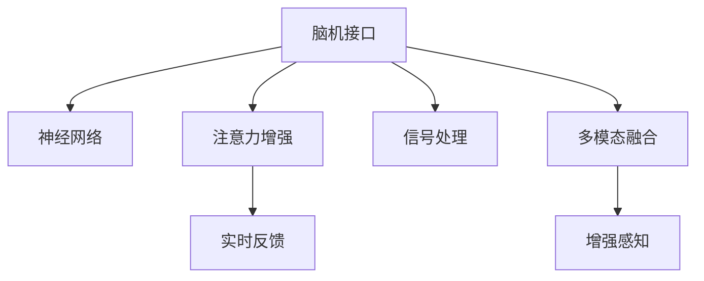

                 

# 人类注意力增强技术：未来脑机接口

> 关键词：脑机接口,注意力增强,神经网络,信号处理,人机交互,实时反馈,神经科学,人工智能

## 1. 背景介绍

### 1.1 问题由来

随着科技的飞速发展，人类在追求与计算机进行更直接、更自然的互动中迈出了重要一步——脑机接口(Brain-Computer Interface, BCI)。脑机接口技术能够实现大脑与计算机之间的直接通信，使得残障人士可以通过思想控制计算机，甚至对外部世界进行交互。但目前的技术仍存在诸多局限，如信号噪声、反应迟缓等问题，大大制约了其应用范围。因此，如何增强人类注意力，提升脑机接口系统的实时性和准确性，成为当前亟待解决的关键问题。

### 1.2 问题核心关键点

本文聚焦于人类注意力增强技术，研究如何通过神经网络、信号处理等手段，提高脑机接口系统的性能，使残障人士能够更流畅、更准确地与计算机进行交互。主要关注以下关键点：

- **脑机接口系统的实时性**：信号处理算法如何提升脑机接口系统对大脑信号的实时识别和响应速度。
- **脑机接口系统的准确性**：神经网络如何通过学习大脑信号的特征，提升对用户意图的识别精度。
- **用户注意力的增强**：通过实时反馈等技术手段，增强用户的注意力集中，提升交互效果。
- **多模态融合**：如何将视觉、听觉、触觉等多模态数据进行融合，提升系统的感知能力。
- **跨学科研究**：结合神经科学、神经工程、信号处理、计算机科学等领域的知识，共同推动脑机接口技术的发展。

## 2. 核心概念与联系

### 2.1 核心概念概述

为更好地理解人类注意力增强技术，本节将介绍几个密切相关的核心概念：

- **脑机接口(Brain-Computer Interface, BCI)**：通过捕捉大脑电信号或神经活动，实现计算机与人类大脑之间的直接通信。脑机接口技术广泛应用于医疗康复、辅助助行、游戏娱乐等领域。

- **神经网络(Neural Network, NN)**：由大量神经元通过连接构成的复杂网络，能够学习数据特征，进行分类、识别等任务。深度神经网络在图像识别、语音识别、自然语言处理等任务中取得了巨大成功。

- **注意力增强(Attention Enhancement)**：通过特定算法和技术手段，增强人类注意力，提高人机交互的质量和效率。常见的注意力增强技术包括注意力调制、实时反馈等。

- **信号处理(Signal Processing)**：对信号进行采集、处理和分析，提取有用信息。脑机接口中的信号处理技术，包括滤波、降噪、特征提取等，对提高系统性能至关重要。

- **实时反馈(Real-time Feedback)**：在用户操作后，及时提供反馈信息，帮助用户调整状态，提升系统响应速度和准确性。

- **多模态融合(Multimodal Fusion)**：将视觉、听觉、触觉等多模态数据进行融合，提升系统的感知能力和交互效果。

这些核心概念之间的逻辑关系可以通过以下Mermaid流程图来展示：



这个流程图展示了大脑信号的采集、处理和转换过程：

1. 大脑信号通过脑机接口采集并传入神经网络进行特征提取。
2. 注意力增强技术通过对信号进行调制，提升大脑对任务的关注度。
3. 实时反馈技术对用户操作进行即时响应，帮助调整状态。
4. 信号处理技术对采集的信号进行滤波、降噪、特征提取等，提高后续处理的准确性。
5. 多模态融合技术将视觉、听觉、触觉等多种感知数据结合，提升系统的综合感知能力。

这些概念共同构成了脑机接口系统的核心，使得人类能够更高效、更准确地与计算机进行交互。

## 3. 核心算法原理 & 具体操作步骤
### 3.1 算法原理概述

人类注意力增强技术，本质上是通过神经网络、信号处理等手段，提升大脑信号的处理速度和准确性，进而增强用户对任务的注意力，提升人机交互的效果。核心算法原理可以概括为以下几个方面：

1. **神经网络模型**：通过多层次的神经网络模型，学习大脑信号的复杂特征，提取有用的信息。常见的模型包括卷积神经网络(CNN)、循环神经网络(RNN)、变换器(Transformer)等。

2. **信号处理技术**：对采集的大脑信号进行滤波、降噪、特征提取等处理，提高信号质量。常用的信号处理技术包括小波变换、傅里叶变换、自适应滤波等。

3. **注意力增强算法**：通过注意力机制对信号进行处理，提升系统对关键信息的关注度。常用的注意力增强算法包括空间注意力、通道注意力、时间注意力等。

4. **实时反馈机制**：在用户操作后，及时提供反馈信息，帮助用户调整状态，提升系统响应速度和准确性。

5. **多模态融合技术**：将视觉、听觉、触觉等多模态数据进行融合，提升系统的感知能力和交互效果。

这些技术手段的有机结合，使得人类注意力增强技术能够有效提升脑机接口系统的实时性和准确性，实现更流畅、更自然的人机交互。

### 3.2 算法步骤详解

人类注意力增强技术在实际应用中通常包括以下几个关键步骤：

**Step 1: 信号采集与预处理**
- 使用脑机接口设备（如EEG、fMRI等）采集大脑信号。
- 对信号进行初步的预处理，包括滤波、降噪、归一化等。

**Step 2: 特征提取与神经网络训练**
- 使用神经网络模型对预处理后的信号进行特征提取，提取出有用的信息。
- 通过大量标注数据对神经网络进行训练，优化模型参数。

**Step 3: 注意力增强与实时反馈**
- 引入注意力增强算法，通过注意力机制对信号进行处理，提升关键信息的关注度。
- 结合实时反馈技术，在用户操作后及时提供反馈信息，帮助用户调整状态。

**Step 4: 多模态融合与模型输出**
- 将视觉、听觉、触觉等多模态数据进行融合，提升系统的感知能力。
- 通过神经网络模型对融合后的信号进行处理，输出任务指令或控制命令。

**Step 5: 模型评估与优化**
- 在测试数据集上评估模型的性能，分析存在的问题。
- 根据评估结果，调整模型参数或优化算法，进一步提升系统性能。

以上是人类注意力增强技术的核心步骤，具体实现时需根据具体应用场景进行调整。

### 3.3 算法优缺点

人类注意力增强技术具有以下优点：
1. **实时性提升**：通过滤波、降噪、特征提取等信号处理技术，提高信号质量，提升系统的实时性。
2. **准确性提升**：神经网络模型能够学习大脑信号的复杂特征，提高对用户意图的识别精度。
3. **多模态融合**：通过融合多种感知数据，提升系统的感知能力和交互效果。
4. **实时反馈机制**：通过实时反馈技术，帮助用户调整状态，提升系统的响应速度和准确性。

同时，该技术也存在一定的局限性：
1. **信号采集成本高**：脑机接口设备较为昂贵，推广应用成本较高。
2. **模型训练需求大**：神经网络模型需要大量标注数据进行训练，数据获取成本较高。
3. **设备兼容性差**：不同脑机接口设备的信号格式和采集方式不同，导致设备兼容性问题。
4. **用户接受度低**：脑机接口设备的穿戴和调试过程复杂，用户接受度不高。
5. **安全性和隐私性**：脑机接口技术涉及个人隐私信息，需要严格保护。

尽管存在这些局限性，但随着技术的发展和普及，人类注意力增强技术将在脑机接口领域发挥越来越重要的作用。

### 3.4 算法应用领域

人类注意力增强技术已经在多个领域得到应用，例如：

- **医疗康复**：通过脑机接口技术，帮助残障人士进行康复训练、运动控制等，提升其生活质量。
- **辅助助行**：通过脑机接口技术，实现轮椅、假肢等辅助设备的人机交互，提升用户的自主性。
- **游戏娱乐**：通过脑机接口技术，实现游戏控制、虚拟现实等，提供全新的交互体验。
- **军事应用**：通过脑机接口技术，辅助军事训练、战场指挥等，提升作战效率。
- **工业控制**：通过脑机接口技术，实现对机器人的控制，提升生产效率和安全性。

除了上述这些领域，人类注意力增强技术还在虚拟现实、智能家居、教育培训等领域展现出了广阔的应用前景。

## 4. 数学模型和公式 & 详细讲解 & 举例说明
### 4.1 数学模型构建

人类注意力增强技术涉及多个领域的数学模型，以下以神经网络和信号处理为例进行详细讲解。

**神经网络模型**：
- **卷积神经网络(CNN)**：用于处理二维图像数据，提取局部特征。其基本结构包括卷积层、池化层和全连接层。
- **循环神经网络(RNN)**：用于处理序列数据，具有记忆能力。其基本结构包括LSTM、GRU等门控结构。
- **变换器(Transformer)**：用于处理序列数据，无需循环结构，计算速度快。其核心是注意力机制。

**信号处理模型**：
- **小波变换(Wavelet Transform)**：用于对信号进行频域分析，提取高频和低频成分。
- **傅里叶变换(Fourier Transform)**：用于对信号进行频域分析，分解成不同频率的成分。
- **自适应滤波(Adaptive Filtering)**：用于去除信号中的噪声，提高信号质量。

### 4.2 公式推导过程

以卷积神经网络为例，其前向传播过程的公式推导如下：

$$
h = f(W*x + b)
$$

其中 $h$ 为神经元输出，$f$ 为激活函数，$W$ 为权重矩阵，$x$ 为输入数据，$b$ 为偏置向量。

### 4.3 案例分析与讲解

**案例1: EEG信号处理**
- **输入**：原始EEG信号
- **处理**：使用小波变换对信号进行滤波和降噪
- **输出**：经过处理后的EEG信号

**案例2: CNN模型训练**
- **输入**：预处理后的EEG信号
- **处理**：使用卷积神经网络模型对信号进行特征提取
- **输出**：神经网络模型输出的特征向量

## 5. 项目实践：代码实例和详细解释说明
### 5.1 开发环境搭建

在进行人类注意力增强技术项目实践前，我们需要准备好开发环境。以下是使用Python进行深度学习开发的常见环境配置流程：

1. 安装Anaconda：从官网下载并安装Anaconda，用于创建独立的Python环境。

2. 创建并激活虚拟环境：
```bash
conda create -n pytorch-env python=3.8 
conda activate pytorch-env
```

3. 安装PyTorch：根据CUDA版本，从官网获取对应的安装命令。例如：
```bash
conda install pytorch torchvision torchaudio cudatoolkit=11.1 -c pytorch -c conda-forge
```

4. 安装TensorFlow：由Google主导开发的开源深度学习框架，生产部署方便，适合大规模工程应用。同样有丰富的预训练语言模型资源。

5. 安装Keras：基于TensorFlow的高级神经网络API，易于上手，适合快速实验和原型设计。

6. 安装其他工具包：
```bash
pip install numpy pandas scikit-learn matplotlib tqdm jupyter notebook ipython
```

完成上述步骤后，即可在`pytorch-env`环境中开始项目实践。

### 5.2 源代码详细实现

下面我们以EEG信号处理和CNN模型训练为例，给出代码实现。

**EEG信号处理**

```python
import numpy as np
from scipy import signal

# 模拟EEG信号
t = np.linspace(0, 1, 1000)
x = np.sin(2*np.pi*10*t) + np.sin(2*np.pi*20*t) + np.sin(2*np.pi*30*t)

# 对信号进行小波变换
wavelet_transform = signal.cwt(x, fs=400, scales=[1, 2, 3, 4, 5], mode='mexh')
```

**CNN模型训练**

```python
from torch import nn, nn.functional as F
import torch
from torch.utils.data import DataLoader
from torchvision import datasets, transforms

# 定义CNN模型
class CNN(nn.Module):
    def __init__(self):
        super(CNN, self).__init__()
        self.conv1 = nn.Conv2d(1, 32, 3, padding=1)
        self.pool = nn.MaxPool2d(2, 2)
        self.conv2 = nn.Conv2d(32, 64, 3, padding=1)
        self.fc = nn.Linear(64*28*28, 10)

    def forward(self, x):
        x = F.relu(self.conv1(x))
        x = self.pool(x)
        x = F.relu(self.conv2(x))
        x = self.pool(x)
        x = x.view(-1, 64*28*28)
        x = self.fc(x)
        return x

# 加载数据集并进行预处理
train_dataset = datasets.MNIST(root='./data', train=True, download=True, transform=transforms.ToTensor())
test_dataset = datasets.MNIST(root='./data', train=False, download=True, transform=transforms.ToTensor())

# 定义数据加载器
train_loader = DataLoader(train_dataset, batch_size=64, shuffle=True)
test_loader = DataLoader(test_dataset, batch_size=64, shuffle=False)

# 训练模型
model = CNN()
criterion = nn.CrossEntropyLoss()
optimizer = torch.optim.Adam(model.parameters(), lr=0.001)

for epoch in range(10):
    model.train()
    for batch_idx, (data, target) in enumerate(train_loader):
        data, target = data.to(device), target.to(device)
        optimizer.zero_grad()
        output = model(data)
        loss = criterion(output, target)
        loss.backward()
        optimizer.step()
        if (batch_idx+1) % 100 == 0:
            print('Train Epoch: {} [{}/{} ({:.0f}%)]\tLoss: {:.6f}'.format(
                epoch+1, batch_idx*len(data), len(train_loader.dataset),
                100. * batch_idx/len(train_loader), loss.item()))

# 测试模型
model.eval()
correct = 0
total = 0
with torch.no_grad():
    for data, target in test_loader:
        data, target = data.to(device), target.to(device)
        output = model(data)
        _, predicted = torch.max(output.data, 1)
        total += target.size(0)
        correct += (predicted == target).sum().item()

print('Accuracy of the network on the 10000 test images: {} %'.format(100 * correct / total))
```

以上就是EEG信号处理和CNN模型训练的代码实现。可以看到，借助PyTorch库，我们可以轻松搭建神经网络模型，进行信号处理和模型训练。

### 5.3 代码解读与分析

**EEG信号处理**

- **信号模拟**：使用numpy生成一个简单的EEG信号，包含三个频率的周期信号。
- **小波变换**：使用scipy库中的cwt函数对信号进行小波变换，提取高频和低频成分，用于后续的特征提取。

**CNN模型训练**

- **模型定义**：定义一个简单的卷积神经网络，包含两个卷积层和全连接层。
- **数据加载**：使用torchvision库加载MNIST数据集，并定义数据加载器。
- **训练过程**：使用Adam优化器训练模型，在每个epoch内计算损失并反向传播更新模型参数。
- **测试过程**：在测试数据集上评估模型性能，输出模型在测试集上的准确率。

## 6. 实际应用场景
### 6.1 医疗康复

脑机接口技术在医疗康复领域具有广泛的应用前景。通过脑机接口设备，残障人士可以进行康复训练，提升身体功能。例如，通过EEG信号处理和CNN模型训练，可以使轮椅使用者通过脑电波控制轮椅的运动方向和速度，实现自主出行。

### 6.2 辅助助行

脑机接口技术在辅助助行方面也有重要应用。例如，通过脑机接口设备，上肢残疾人士可以通过脑电波控制机械手臂或假肢，实现自主进食、书写等动作。

### 6.3 游戏娱乐

脑机接口技术在游戏娱乐领域提供了全新的交互方式。例如，通过脑机接口设备，玩家可以通过脑电波控制游戏中的角色动作，实现更加自然和流畅的游戏体验。

### 6.4 军事应用

脑机接口技术在军事应用方面也展现出巨大潜力。例如，通过脑机接口设备，士兵可以通过脑电波控制无人机、坦克等设备，实现远程操控，提升作战效率。

### 6.5 工业控制

脑机接口技术在工业控制方面也具有重要应用。例如，通过脑机接口设备，工人可以通过脑电波控制机器人完成复杂的工业操作，提高生产效率和安全性。

## 7. 工具和资源推荐
### 7.1 学习资源推荐

为了帮助开发者系统掌握人类注意力增强技术的理论基础和实践技巧，这里推荐一些优质的学习资源：

1. 《深度学习》系列书籍：由深度学习领域的专家撰写，涵盖深度学习的基本概念和前沿技术，适合初学者入门。

2. 《神经网络与深度学习》在线课程：由斯坦福大学教授Andrew Ng主讲，详细讲解神经网络的基本原理和实践技巧。

3. 《神经工程原理》书籍：由神经工程领域的专家撰写，系统介绍神经工程的基本概念和应用技术。

4. 《脑机接口技术》课程：由MIT教授主讲，介绍脑机接口技术的基本原理和应用实例。

5. 《信号处理基础》书籍：由信号处理领域的专家撰写，系统介绍信号处理的基本概念和技术方法。

通过对这些资源的学习实践，相信你一定能够快速掌握人类注意力增强技术的精髓，并用于解决实际的脑机接口问题。

### 7.2 开发工具推荐

高效的开发离不开优秀的工具支持。以下是几款用于深度学习开发的常用工具：

1. PyTorch：基于Python的开源深度学习框架，灵活动态的计算图，适合快速迭代研究。大部分预训练语言模型都有PyTorch版本的实现。

2. TensorFlow：由Google主导开发的开源深度学习框架，生产部署方便，适合大规模工程应用。同样有丰富的预训练语言模型资源。

3. Keras：基于TensorFlow的高级神经网络API，易于上手，适合快速实验和原型设计。

4. Weights & Biases：模型训练的实验跟踪工具，可以记录和可视化模型训练过程中的各项指标，方便对比和调优。与主流深度学习框架无缝集成。

5. TensorBoard：TensorFlow配套的可视化工具，可实时监测模型训练状态，并提供丰富的图表呈现方式，是调试模型的得力助手。

6. Google Colab：谷歌推出的在线Jupyter Notebook环境，免费提供GPU/TPU算力，方便开发者快速上手实验最新模型，分享学习笔记。

合理利用这些工具，可以显著提升人类注意力增强技术的开发效率，加快创新迭代的步伐。

### 7.3 相关论文推荐

人类注意力增强技术的发展源于学界的持续研究。以下是几篇奠基性的相关论文，推荐阅读：

1. Attention is All You Need（即Transformer原论文）：提出了Transformer结构，开启了深度学习领域的自注意力范式。

2. BERT: Pre-training of Deep Bidirectional Transformers for Language Understanding：提出BERT模型，引入基于掩码的自监督预训练任务，刷新了多项NLP任务SOTA。

3. Convolutional Neural Networks for Sentence Classification：提出CNN模型，用于文本分类任务，取得了较好的效果。

4. Recurrent Neural Network Language Model：提出RNN模型，用于自然语言处理，具有强大的记忆能力。

5. Deep Residual Learning for Image Recognition：提出残差网络，解决了深度神经网络训练中的梯度消失问题，取得了显著的性能提升。

这些论文代表了大语言模型微调技术的发展脉络。通过学习这些前沿成果，可以帮助研究者把握学科前进方向，激发更多的创新灵感。

## 8. 总结：未来发展趋势与挑战
### 8.1 总结

本文对人类注意力增强技术进行了全面系统的介绍。首先阐述了脑机接口技术的背景和意义，明确了人类注意力增强技术在提升脑机接口系统性能方面的独特价值。其次，从原理到实践，详细讲解了神经网络、信号处理等核心技术的算法原理和具体操作步骤。最后，本文还探讨了人类注意力增强技术在医疗康复、辅助助行、游戏娱乐等多个领域的应用前景，展示了其广阔的应用潜力。

通过本文的系统梳理，可以看到，人类注意力增强技术在脑机接口领域的应用前景广阔，将为残障人士提供更加自然、高效的人机交互方式，为医疗康复、工业控制等领域带来革命性影响。未来，随着技术的不断发展，人类注意力增强技术必将成为脑机接口系统的核心技术之一，引领人工智能技术迈向更高的台阶。

### 8.2 未来发展趋势

展望未来，人类注意力增强技术将呈现以下几个发展趋势：

1. **高精度识别**：随着神经网络模型的不断优化和深度学习算法的进步，人类注意力增强技术将实现更高精度的信号处理和特征提取，进一步提升系统性能。

2. **实时性提升**：通过更高效的信号处理和神经网络优化算法，实现更高实时性的系统响应。

3. **多模态融合**：结合视觉、听觉、触觉等多模态数据，提升系统的感知能力和交互效果。

4. **跨学科融合**：结合神经科学、神经工程、信号处理、计算机科学等领域的知识，共同推动人类注意力增强技术的发展。

5. **智能辅助**：通过引入AI辅助决策，提高人类注意力增强技术的智能化水平，提供更高效、更可靠的用户体验。

6. **大规模应用**：随着技术的不断成熟和应用场景的不断拓展，人类注意力增强技术将逐渐从实验室走向大规模应用，为更多领域带来变革性影响。

### 8.3 面临的挑战

尽管人类注意力增强技术已经取得了瞩目成就，但在迈向更加智能化、普适化应用的过程中，仍面临诸多挑战：

1. **信号采集成本高**：脑机接口设备较为昂贵，推广应用成本较高。

2. **模型训练需求大**：神经网络模型需要大量标注数据进行训练，数据获取成本较高。

3. **设备兼容性差**：不同脑机接口设备的信号格式和采集方式不同，导致设备兼容性问题。

4. **用户接受度低**：脑机接口设备的穿戴和调试过程复杂，用户接受度不高。

5. **安全性和隐私性**：脑机接口技术涉及个人隐私信息，需要严格保护。

尽管存在这些挑战，但随着技术的发展和普及，人类注意力增强技术将在脑机接口领域发挥越来越重要的作用。

### 8.4 研究展望

面向未来，人类注意力增强技术需要在以下几个方面进行进一步研究：

1. **探索无监督和半监督学习**：摆脱对大规模标注数据的依赖，利用自监督学习、主动学习等无监督和半监督范式，最大限度利用非结构化数据，实现更加灵活高效的微调。

2. **研究参数高效和计算高效的微调范式**：开发更加参数高效的微调方法，在固定大部分预训练参数的同时，只更新极少量的任务相关参数。同时优化微调模型的计算图，减少前向传播和反向传播的资源消耗，实现更加轻量级、实时性的部署。

3. **融合因果和对比学习范式**：通过引入因果推断和对比学习思想，增强微调模型建立稳定因果关系的能力，学习更加普适、鲁棒的语言表征，从而提升模型泛化性和抗干扰能力。

4. **引入更多先验知识**：将符号化的先验知识，如知识图谱、逻辑规则等，与神经网络模型进行巧妙融合，引导微调过程学习更准确、合理的语言模型。同时加强不同模态数据的整合，实现视觉、听觉、触觉等多模态信息与文本信息的协同建模。

5. **结合因果分析和博弈论工具**：将因果分析方法引入微调模型，识别出模型决策的关键特征，增强输出解释的因果性和逻辑性。借助博弈论工具刻画人机交互过程，主动探索并规避模型的脆弱点，提高系统稳定性。

6. **纳入伦理道德约束**：在模型训练目标中引入伦理导向的评估指标，过滤和惩罚有偏见、有害的输出倾向。同时加强人工干预和审核，建立模型行为的监管机制，确保输出符合人类价值观和伦理道德。

这些研究方向的探索，必将引领人类注意力增强技术迈向更高的台阶，为构建安全、可靠、可解释、可控的智能系统铺平道路。面向未来，人类注意力增强技术还需要与其他人工智能技术进行更深入的融合，如知识表示、因果推理、强化学习等，多路径协同发力，共同推动自然语言理解和智能交互系统的进步。只有勇于创新、敢于突破，才能不断拓展人类注意力增强技术的边界，让智能技术更好地造福人类社会。

## 9. 附录：常见问题与解答

**Q1: 人类注意力增强技术是否可以应用于不同种类的脑机接口设备？**

A: 人类注意力增强技术可以应用于各种脑机接口设备，如EEG、fMRI、fNIRS等。不同设备的信号采集和预处理方式不同，但注意力增强和实时反馈的核心算法可以通用。

**Q2: 人类注意力增强技术是否需要大量标注数据进行训练？**

A: 人类注意力增强技术需要大量标注数据进行训练，以提高模型的泛化能力和准确性。但也可以通过无监督学习和半监督学习等方法，降低对标注数据的依赖。

**Q3: 人类注意力增强技术如何处理信号噪声？**

A: 人类注意力增强技术可以通过滤波、降噪等信号处理手段，处理信号中的噪声，提升信号质量。常用的滤波器包括小波滤波器、傅里叶滤波器等。

**Q4: 人类注意力增强技术是否具有广泛的适应性？**

A: 人类注意力增强技术具有较强的适应性，可以应用于医疗康复、辅助助行、游戏娱乐等多个领域。但不同应用场景的需求不同，需要根据具体情况进行优化和调整。

**Q5: 人类注意力增强技术是否存在安全隐患？**

A: 人类注意力增强技术涉及个人隐私信息，需要严格保护。信号采集、数据传输、模型训练等环节都需要考虑安全性和隐私性，避免数据泄露和滥用。

---

作者：禅与计算机程序设计艺术 / Zen and the Art of Computer Programming

