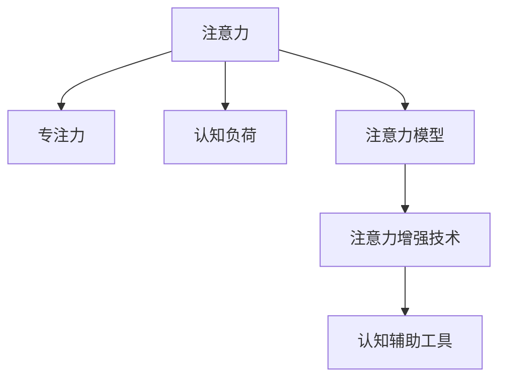

                 

# 人类注意力增强：提升专注力和注意力在商业中的未来展望

## 1. 背景介绍

### 1.1 问题由来

在信息爆炸的时代，如何提升人类注意力、增强专注力，已经成为商业和技术领域亟待解决的关键问题。无论是个人用户还是企业组织，频繁的信息干扰、工作疲劳以及认知负荷都严重影响着决策质量和工作效率。为了应对这一挑战，人们开始探索通过技术手段辅助提升注意力水平，从而提升个人及企业的工作表现。

### 1.2 问题核心关键点

目前，提升注意力的方法多种多样，包括冥想、工作坊、时间管理技巧等。然而，这些方法往往难以系统化、数据化，且效果受个体差异影响较大。随着AI技术的发展，尤其是注意力增强（Attention Enhancement）领域的突破，基于技术的注意力提升方案正在逐渐成为可能。

该领域的核心关键点包括：

1. **注意力模型**：研究如何通过机器学习模型精准识别和分析注意力变化规律，以指导干预措施。
2. **注意力增强技术**：开发出能够根据用户的注意力状态动态调整内容、工作方式的技术工具。
3. **数据驱动**：利用生理数据、行为数据等进行精确的用户状态识别和行为预测，为注意力干预提供数据支撑。

## 2. 核心概念与联系

### 2.1 核心概念概述

为更好地理解注意力增强方法，本节将介绍几个密切相关的核心概念：

- **注意力**：认知心理学领域的一个重要概念，指个体在特定时间内对外部刺激的选择和集中注意力的能力。
- **专注力**：指个体在处理复杂任务时能够持续保持注意力的状态。
- **认知负荷**：个体在处理信息时所承受的认知压力和负担，过高的认知负荷会影响注意力和工作效率。
- **注意力模型**：用于分析注意力状态和变化规律，指导注意力干预的模型和算法。
- **注意力增强技术**：通过技术手段提升个体注意力和专注力的技术应用。
- **认知辅助工具**：辅助提升注意力、降低认知负荷的智能设备、软件工具等。

这些核心概念之间的逻辑关系可以通过以下Mermaid流程图来展示：



这个流程图展示了几组关键概念及其相互关系：

1. 注意力是认知的基础，与专注力和认知负荷密切相关。
2. 注意力模型用于识别和分析注意力状态，为注意力增强提供指导。
3. 注意力增强技术通过技术手段提升注意力水平，辅助认知辅助工具实现。
4. 认知辅助工具进一步应用注意力增强技术，提升用户体验和工作效率。

## 3. 核心算法原理 & 具体操作步骤

### 3.1 算法原理概述

注意力增强的核心思想是通过机器学习模型分析用户的注意力状态和变化规律，并在此基础上，动态调整内容或工作方式，从而提升用户的注意力和专注力。这一过程可以分为以下几个关键步骤：

1. **注意力识别**：使用生理传感器或行为数据收集用户的注意力状态信息，如眼动轨迹、脑电信号等。
2. **注意力模型训练**：基于收集的数据，训练注意力模型，学习用户的注意力变化规律。
3. **注意力状态预测**：实时预测用户的当前注意力状态，为注意力干预提供数据支持。
4. **注意力干预**：根据预测的注意力状态，动态调整内容或工作方式，如提醒休息、调整界面布局、智能推荐等。

### 3.2 算法步骤详解

基于注意力增强的算法流程一般包括：

**Step 1: 数据收集**

- 使用生理传感器或行为追踪器收集用户的注意力状态数据，如眼动轨迹、脑电信号、鼠标轨迹等。
- 将生理数据和行为数据通过预处理和特征工程转换为模型输入。

**Step 2: 模型训练**

- 选择合适的模型架构和算法，如深度神经网络、支持向量机等。
- 使用收集到的数据集进行模型训练，学习用户的注意力变化规律。
- 对模型进行调参和验证，确保其泛化性能。

**Step 3: 注意力状态预测**

- 实时监测用户的注意力状态，如眼动轨迹、屏幕点击等。
- 将监测到的数据输入模型进行预测，得到用户的当前注意力状态。

**Step 4: 注意力干预**

- 根据预测的注意力状态，动态调整工作界面，如提醒休息、调整屏幕亮度、智能推荐任务等。
- 监控用户反馈，不断优化干预措施。

**Step 5: 效果评估**

- 收集用户反馈和行为数据，评估注意力干预的效果。
- 持续优化模型和干预策略，提升注意力提升效果。

### 3.3 算法优缺点

注意力增强技术具有以下优点：

1. **数据驱动**：利用生理数据和行为数据进行精确的用户状态识别，有助于设计针对性干预措施。
2. **实时调整**：根据实时注意力状态，动态调整工作内容，提升用户体验和工作效率。
3. **提升效率**：通过降低认知负荷，帮助用户保持长时间的高效工作状态。

然而，该技术也存在一些局限性：

1. **隐私保护**：生理数据和行为数据的收集和存储涉及隐私问题，需要严格的数据保护措施。
2. **数据偏差**：模型训练依赖于数据集的代表性，数据偏差可能导致模型预测不准确。
3. **模型复杂性**：复杂的注意力模型可能需要大量计算资源和时间进行训练和部署。
4. **用户依赖**：技术手段对用户的依存度高，用户接受度和适应性可能影响干预效果。

### 3.4 算法应用领域

注意力增强技术已经在多个领域得到应用，包括但不限于：

- **教育培训**：帮助学生保持专注，提升学习效率。
- **远程工作**：减少远程工作中的注意力分散，提升工作效率。
- **医疗健康**：监测患者的注意力状态，辅助心理治疗和疾病诊断。
- **游戏娱乐**：提升游戏玩家的沉浸感和体验，延长游戏时间。
- **智能家居**：根据用户注意力状态，动态调整家居环境，提高生活质量。

这些领域的应用展示了注意力增强技术的广泛前景，未来有望在更多场景中得到推广和应用。

## 4. 数学模型和公式 & 详细讲解 & 举例说明

### 4.1 数学模型构建

本节将使用数学语言对注意力增强方法进行更加严格的刻画。

假设用户的注意力状态由向量 $x \in \mathbb{R}^n$ 表示，其中 $n$ 为特征维度。设 $y \in \mathbb{R}^m$ 为模型预测的注意力状态，$m$ 为模型输出的维度。注意力模型 $f$ 定义为：

$$
f(x; \theta) = y
$$

其中 $\theta$ 为模型参数。注意力模型训练的目标是最小化预测误差，即：

$$
\min_{\theta} \frac{1}{N} \sum_{i=1}^N (y_i - f(x_i; \theta))^2
$$

### 4.2 公式推导过程

以神经网络模型为例，假设使用单层感知器进行注意力状态预测，模型结构如图：


输入为用户的注意力特征向量 $x$，模型参数为权重矩阵 $W$ 和偏置向量 $b$。模型输出为：

$$
y = f(x; W, b) = Wx + b
$$

将 $y$ 与 $x$ 之间的关系代入最小化误差目标中，得到：

$$
\min_{W, b} \frac{1}{N} \sum_{i=1}^N (Wx_i + b - y_i)^2
$$

通过求解上述优化问题，可以得到最优的权重矩阵 $W$ 和偏置向量 $b$。

### 4.3 案例分析与讲解

以教育和远程工作为例，介绍注意力增强技术的应用。

**教育领域**：

- **数据收集**：使用眼动追踪器收集学生的注意力状态数据，分析其注意力集中度。
- **模型训练**：训练基于注意力状态的分类模型，预测学生是否专注。
- **注意力干预**：根据预测结果，动态调整教学内容和节奏，如增加互动环节、适当提醒休息等。

**远程工作**：

- **数据收集**：使用鼠标轨迹和键盘输入数据，监测员工的工作行为和注意力状态。
- **模型训练**：训练基于行为数据的注意力模型，预测员工当前的工作状态。
- **注意力干预**：根据预测结果，调整工作界面和任务分配，如提醒员工适当休息、优化工作环境等。

## 5. 项目实践：代码实例和详细解释说明

### 5.1 开发环境搭建

在进行注意力增强项目开发前，我们需要准备好开发环境。以下是使用Python进行TensorFlow开发的开发环境配置流程：

1. 安装Anaconda：从官网下载并安装Anaconda，用于创建独立的Python环境。

2. 创建并激活虚拟环境：
```bash
conda create -n attention-env python=3.8 
conda activate attention-env
```

3. 安装TensorFlow：根据CUDA版本，从官网获取对应的安装命令。例如：
```bash
conda install tensorflow==2.6 -c pytorch -c conda-forge
```

4. 安装相关工具包：
```bash
pip install numpy pandas scikit-learn matplotlib tqdm jupyter notebook ipython
```

完成上述步骤后，即可在`attention-env`环境中开始注意力增强的开发和测试。

### 5.2 源代码详细实现

这里以一个基于神经网络注意力增强的简单例子进行介绍，使用TensorFlow实现注意力状态预测。

首先，定义注意力模型的输入和输出：

```python
import tensorflow as tf

input_size = 100
output_size = 1

x = tf.keras.layers.Input(shape=(input_size,))
y = tf.keras.layers.Dense(output_size, activation='sigmoid')(x)

model = tf.keras.Model(inputs=x, outputs=y)
```

然后，定义模型的损失函数和优化器：

```python
loss = tf.keras.losses.MeanSquaredError()
optimizer = tf.keras.optimizers.Adam()
```

接着，训练模型：

```python
def train_step(x, y_true):
    with tf.GradientTape() as tape:
        y_pred = model(x)
        loss_value = loss(y_pred, y_true)
    gradients = tape.gradient(loss_value, model.trainable_variables)
    optimizer.apply_gradients(zip(gradients, model.trainable_variables))
    return loss_value

def train_epoch(model, data, batch_size):
    for x, y in data:
        loss = train_step(x, y)
        print(f'Batch loss: {loss:.4f}')

train_data = ...
val_data = ...

epochs = 100

for epoch in range(epochs):
    train_loss = train_epoch(model, train_data, batch_size=batch_size)
    val_loss = train_epoch(model, val_data, batch_size=batch_size)
    print(f'Epoch {epoch+1}, train loss: {train_loss:.4f}, val loss: {val_loss:.4f}')
```

最后，进行注意力状态预测：

```python
def predict(model, x):
    y_pred = model(x)
    return y_pred

x_test = ...
y_test = predict(model, x_test)
print(y_test)
```

以上就是使用TensorFlow实现注意力增强的完整代码实现。可以看到，利用TensorFlow提供的高级API，开发注意力增强模型变得简洁高效。

### 5.3 代码解读与分析

让我们再详细解读一下关键代码的实现细节：

**定义输入和输出**：

```python
input_size = 100
output_size = 1

x = tf.keras.layers.Input(shape=(input_size,))
y = tf.keras.layers.Dense(output_size, activation='sigmoid')(x)
```

- `input_size`和`output_size`分别表示输入向量和输出向量的维度。
- `Input`层用于定义模型的输入，`Dense`层用于定义全连接层，`sigmoid`激活函数用于将输出映射到[0,1]区间。

**定义损失函数和优化器**：

```python
loss = tf.keras.losses.MeanSquaredError()
optimizer = tf.keras.optimizers.Adam()
```

- `MeanSquaredError`表示均方误差损失函数，用于衡量模型预测与真实值之间的差异。
- `Adam`优化器是一种常用的梯度下降算法，能够快速收敛且不易陷入局部最优解。

**训练模型**：

```python
def train_step(x, y_true):
    with tf.GradientTape() as tape:
        y_pred = model(x)
        loss_value = loss(y_pred, y_true)
    gradients = tape.gradient(loss_value, model.trainable_variables)
    optimizer.apply_gradients(zip(gradients, model.trainable_variables))
    return loss_value

def train_epoch(model, data, batch_size):
    for x, y in data:
        loss = train_step(x, y)
        print(f'Batch loss: {loss:.4f}')

train_data = ...
val_data = ...

epochs = 100

for epoch in range(epochs):
    train_loss = train_epoch(model, train_data, batch_size=batch_size)
    val_loss = train_epoch(model, val_data, batch_size=batch_size)
    print(f'Epoch {epoch+1}, train loss: {train_loss:.4f}, val loss: {val_loss:.4f}')
```

- `train_step`函数用于计算每个批次的损失值和梯度，并使用优化器更新模型参数。
- `train_epoch`函数用于对整个数据集进行迭代训练，并在每个epoch输出训练和验证损失。

**进行注意力状态预测**：

```python
def predict(model, x):
    y_pred = model(x)
    return y_pred

x_test = ...
y_test = predict(model, x_test)
print(y_test)
```

- `predict`函数用于对新样本进行预测，得到其注意力状态。
- `x_test`为新样本的输入向量，`y_test`为预测得到的注意力状态。

可以看到，使用TensorFlow进行注意力增强模型的开发，利用其提供的高级API，可以显著简化模型设计和训练流程，提升开发效率。

当然，在实际应用中，还需要针对具体任务进行优化设计，如引入更复杂的模型架构、使用更高效的数据处理技术等。但核心的注意力增强范式基本与此类似。

## 6. 实际应用场景

### 6.1 教育领域

在教育领域，注意力增强技术可以帮助学生更好地集中注意力，提高学习效率。具体应用包括：

- **学习内容推荐**：根据学生的注意力状态，智能推荐适合其当前认知水平的学习内容，提高学习兴趣和效率。
- **作业批改**：通过分析学生完成作业的注意力状态，辅助教师进行更精准的作业批改和反馈。
- **个性化辅导**：根据学生的注意力变化，动态调整教学节奏和策略，提供个性化的学习辅导。

### 6.2 远程工作

远程工作环境下，注意力分散是影响工作效率的重要因素。注意力增强技术可以通过以下方式提升远程工作体验：

- **任务分配**：根据员工的注意力状态，动态调整任务分配，将高注意力时间段留给重要任务，降低认知负荷。
- **工作环境优化**：根据员工的注意力变化，调整工作界面和环境设置，如改变屏幕亮度、调整椅子和桌子高度等，提升工作舒适度和专注力。
- **休息提醒**：监测员工的工作状态，及时提醒其休息，防止长时间连续工作带来的疲劳和注意力下降。

### 6.3 医疗健康

在医疗领域，注意力增强技术可以帮助患者保持专注，改善心理状态。具体应用包括：

- **心理干预**：通过监测患者的注意力状态，辅助心理医生进行心理评估和治疗，提升治疗效果。
- **康复训练**：帮助患者在康复训练中保持专注，提高训练效果。
- **辅助诊断**：监测患者的注意力变化，辅助医生进行疾病诊断和康复评估。

### 6.4 游戏娱乐

在游戏娱乐领域，注意力增强技术可以提升玩家的游戏体验，延长游戏时间。具体应用包括：

- **游戏内容推荐**：根据玩家的注意力状态，智能推荐适合当前状态的游戏内容和任务，增加游戏粘性。
- **游戏难度调整**：动态调整游戏难度和挑战，保持玩家的高兴趣度和沉浸感。
- **游戏引导**：通过注意力监测，引导玩家更快地掌握游戏技巧和策略。

## 7. 工具和资源推荐

### 7.1 学习资源推荐

为了帮助开发者系统掌握注意力增强的理论基础和实践技巧，这里推荐一些优质的学习资源：

1. **《深度学习基础》系列课程**：由斯坦福大学和谷歌等机构提供，涵盖深度学习基础知识和前沿技术，适合初学者和进阶者。

2. **《认知负荷与注意力》书籍**：深入探讨认知负荷和注意力机制，为注意力增强提供理论支撑。

3. **TensorFlow官方文档**：提供了丰富的TensorFlow教程和代码示例，适合快速上手开发。

4. **NeuroPy**：专注于神经网络的开源库，包含丰富的注意力增强模型和算法实现。

5. **Coursera注意力增强课程**：由各知名大学和研究机构提供，涵盖注意力增强的多种方法和应用。

通过对这些资源的学习实践，相信你一定能够快速掌握注意力增强技术的精髓，并用于解决实际的注意力问题。

### 7.2 开发工具推荐

高效的开发离不开优秀的工具支持。以下是几款用于注意力增强开发的常用工具：

1. **TensorFlow**：由谷歌主导开发的深度学习框架，生产部署方便，适合大规模工程应用。提供了丰富的神经网络模型和注意力增强算法。

2. **PyTorch**：基于Python的开源深度学习框架，灵活动态的计算图，适合快速迭代研究。提供了多种注意力增强模型和工具。

3. **Keras**：高层次的深度学习框架，易于上手，适合快速原型开发和实验验证。

4. **Jupyter Notebook**：交互式开发环境，适合进行数据探索、模型验证和可视化。

5. **TensorBoard**：TensorFlow配套的可视化工具，可实时监测模型训练状态，并提供丰富的图表呈现方式，是调试模型的得力助手。

6. **Gym**：OpenAI开发的强化学习框架，适合进行注意力增强相关的强化学习实验。

合理利用这些工具，可以显著提升注意力增强任务的开发效率，加快创新迭代的步伐。

### 7.3 相关论文推荐

注意力增强领域的发展源于学界的持续研究。以下是几篇奠基性的相关论文，推荐阅读：

1. **Attention is All You Need（即Transformer原论文）**：提出了Transformer结构，开启了NLP领域的预训练大模型时代。

2. **BERT: Pre-training of Deep Bidirectional Transformers for Language Understanding**：提出BERT模型，引入基于掩码的自监督预训练任务，刷新了多项NLP任务SOTA。

3. **Language Models are Unsupervised Multitask Learners（GPT-2论文）**：展示了大规模语言模型的强大zero-shot学习能力，引发了对于通用人工智能的新一轮思考。

4. **Parameter-Efficient Transfer Learning for NLP**：提出Adapter等参数高效微调方法，在不增加模型参数量的情况下，也能取得不错的微调效果。

5. **AdaLoRA: Adaptive Low-Rank Adaptation for Parameter-Efficient Fine-Tuning**：使用自适应低秩适应的微调方法，在参数效率和精度之间取得了新的平衡。

这些论文代表了大语言模型微调技术的发展脉络。通过学习这些前沿成果，可以帮助研究者把握学科前进方向，激发更多的创新灵感。

## 8. 总结：未来发展趋势与挑战

### 8.1 总结

本文对注意力增强方法进行了全面系统的介绍。首先阐述了注意力增强的研究背景和意义，明确了注意力增强在提升专注力和工作效率方面的独特价值。其次，从原理到实践，详细讲解了注意力增强的数学原理和关键步骤，给出了注意力增强任务开发的完整代码实例。同时，本文还广泛探讨了注意力增强方法在教育、远程工作、医疗健康等多个领域的应用前景，展示了注意力增强技术的广阔前景。

通过本文的系统梳理，可以看到，注意力增强技术正在成为提升个体和组织注意力的重要手段，极大地拓展了人工智能技术的应用边界，为提升人类认知智能和生产力提供了新的可能性。未来，伴随注意力增强方法的持续演进，相信注意力增强技术必将在更多领域得到应用，为构建更智能、高效的人类社会铺平道路。

### 8.2 未来发展趋势

展望未来，注意力增强技术将呈现以下几个发展趋势：

1. **个性化程度提升**：通过更精准的注意力监测和更智能的模型设计，提供更加个性化的注意力提升方案。
2. **多模态融合**：结合视觉、听觉、触觉等多种感官信息，提升注意力监测和增强效果。
3. **实时性增强**：实现对用户注意力状态的实时监测和动态调整，提升用户体验和工作效率。
4. **跨领域应用**：扩展到更多垂直领域，如智能家居、车载娱乐、智慧城市等，提升生活和工作质量。
5. **隐私保护增强**：在数据收集和处理中加强隐私保护，确保用户数据安全。
6. **伦理与安全**：在模型设计和应用中考虑伦理和安全因素，避免负面影响和滥用。

这些趋势凸显了注意力增强技术的广阔前景，未来有望在更多场景中得到应用，为人类认知智能的进化带来深远影响。

### 8.3 面临的挑战

尽管注意力增强技术已经取得了瞩目成就，但在迈向更加智能化、普适化应用的过程中，它仍面临着诸多挑战：

1. **数据隐私**：生理数据和行为数据的收集涉及隐私问题，需要严格的数据保护措施。
2. **数据偏见**：模型训练依赖于数据集的代表性，数据偏差可能导致模型预测不准确。
3. **技术复杂性**：注意力增强技术涉及多学科交叉，技术实现复杂度高。
4. **用户接受度**：技术手段对用户的依存度高，用户接受度和适应性可能影响干预效果。
5. **模型鲁棒性**：注意力增强模型面对复杂的注意力变化和干扰，鲁棒性有待提升。
6. **资源消耗**：高维数据的处理和实时监测对计算资源和时间消耗较高。

正视注意力增强面临的这些挑战，积极应对并寻求突破，将使注意力增强技术走向成熟，进一步提升人类认知智能的潜力。

### 8.4 研究展望

面对注意力增强技术所面临的挑战，未来的研究需要在以下几个方面寻求新的突破：

1. **跨模态注意力监测**：结合多种感官信息，提升注意力监测的全面性和准确性。
2. **混合智能增强**：结合人工智能和人类智能，提供更灵活、高效的注意力增强方案。
3. **端到端优化**：从数据采集、模型训练到干预策略，进行全流程优化，提升注意力增强效果。
4. **实时动态调整**：实现对用户注意力状态的实时监测和动态调整，提升用户体验和工作效率。
5. **隐私保护技术**：研发更安全、隐私保护更强的数据处理和存储技术。
6. **伦理与安全**：在模型设计和应用中考虑伦理和安全因素，确保技术应用的透明性和安全性。

这些研究方向将引领注意力增强技术迈向更高的台阶，为构建智能、高效、安全的人类社会提供新的技术支撑。面向未来，注意力增强技术还需要与其他人工智能技术进行更深入的融合，如知识表示、因果推理、强化学习等，多路径协同发力，共同推动人类认知智能的进步。

## 9. 附录：常见问题与解答

**Q1：注意力增强技术是否适用于所有应用场景？**

A: 注意力增强技术在许多场景中已经得到应用，但并非所有应用场景都适合使用注意力增强技术。例如，对于无需长时间保持专注的任务，注意力增强技术可能并无必要。因此，在使用前需要根据具体场景进行评估和选择。

**Q2：注意力增强技术的精度如何保证？**

A: 注意力增强技术的精度主要依赖于模型训练的充分性和数据质量。通常使用多维度的生理数据和行为数据，结合先进的机器学习模型进行训练，可以显著提高注意力监测的精度。此外，持续的数据收集和模型优化也是提高精度的重要手段。

**Q3：注意力增强技术的使用是否会对用户产生副作用？**

A: 注意力增强技术的使用需注意用户接受度和隐私保护。使用不当可能引发用户不适，如频繁提醒可能扰乱正常工作节奏。因此，在设计和应用中需考虑到用户的主体性和需求，设计合理的干预策略。

**Q4：注意力增强技术如何与现有系统集成？**

A: 注意力增强技术需要与现有系统进行集成，以提供更智能、高效的用户体验。可以通过API接口、插件等方式实现与现有系统的无缝集成。同时，注意确保技术应用的安全性和隐私保护，避免负面影响。

**Q5：注意力增强技术的未来发展方向是什么？**

A: 未来的注意力增强技术将继续深化多模态融合、实时性增强、个性化提升等方面的研究。同时，注重隐私保护、伦理安全等问题的解决，确保技术的健康发展和应用。

通过以上系统梳理，我们不仅掌握了注意力增强技术的核心原理和操作步骤，还了解了其未来发展趋势和面临的挑战。相信这些知识将为你的进一步学习和实践提供坚实的基础。在未来的研究与应用中，通过持续探索和创新，相信注意力增强技术必将在提升人类认知智能和生产力方面发挥更加重要的作用。

