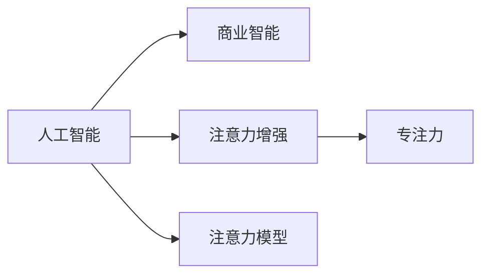

                 

# 人类注意力增强：提升专注力和注意力在商业中的未来方向展望

> 关键词：人工智能, 注意力增强, 商业智能, 专注力, 模型优化

## 1. 背景介绍

在数字化的浪潮中，人类生活的方方面面正被重塑，商业环境也不例外。人工智能(AI)技术以其强大的计算能力和学习能力，正在成为推动商业变革的重要力量。然而，AI的强大并不意味着人类将会被完全取代，而是会在辅助人类工作、提升效率、创造全新商业机会的同时，也带来了新的挑战和机遇。本文聚焦于人类注意力增强，探讨如何在商业中更好地利用AI技术，提升专注力和注意力，实现AI与人类协同工作的最佳状态。

### 1.1 问题由来

在当前信息过载的时代，注意力资源成为了最宝贵的资源之一。无论是处理海量信息，还是进行复杂决策，注意力在很大程度上决定了人类工作的效率和质量。然而，随着数字化的深入，人类注意力资源的不足和分散也逐渐凸显出来。如何利用AI技术，提升人类的专注力和注意力，从而更好地应对未来的商业挑战，成为了一个亟需解决的问题。

### 1.2 问题核心关键点

本问题涉及以下几个核心关键点：
- AI技术在提升人类注意力方面的潜在作用：AI可以通过信息筛选、自动化决策、智能推荐等方式，帮助人类减少注意力负担，集中精力于重要任务。
- 注意力增强模型和算法的开发和应用：如何构建AI模型，准确识别和增强人类注意力，并应用到实际商业场景中。
- 提升专注力和注意力的商业价值：通过AI技术增强注意力，能否在商业中实现更高效率、更好决策、更高创造力，从而获得竞争优势。

### 1.3 问题研究意义

研究人类注意力增强，对于推动AI与人类协同工作、提升商业智能、实现智能自动化等领域具有重要意义：

1. **提高工作效率**：AI可以帮助人类从繁琐的信息处理中解放出来，集中精力进行高价值工作，从而显著提升工作效率。
2. **优化决策质量**：AI可以快速分析和处理大量数据，提供更准确的决策支持，减少人为失误。
3. **创造商业机会**：AI技术能够揭示新的商业洞察，发现新的市场机会，推动商业模式创新。
4. **应对未来挑战**：在信息爆炸的时代，增强人类注意力可以更好地适应未来的商业环境，保持竞争优势。

## 2. 核心概念与联系

### 2.1 核心概念概述

本节将介绍几个关键概念及其之间的联系：

- **人工智能(AI)**：通过机器学习、深度学习等技术，使机器具备一定的智能，能够自主地完成特定任务。
- **注意力增强**：通过AI技术识别和增强人类注意力，帮助人类在处理信息、进行决策时更加专注和高效。
- **商业智能(BI)**：利用AI、数据挖掘等技术，分析商业数据，提取有用信息，指导商业决策。
- **专注力**：人类对特定任务的集中注意力的能力，是高效工作的基础。
- **注意力模型**：通过构建数学或计算模型，模拟人类注意力的工作机制，用于增强注意力。

这些概念之间存在着密切的联系。AI技术可以应用于商业智能中，通过分析大量数据提供决策支持。而注意力增强则是AI在提升人类专注力和工作效率方面的一种应用，是商业智能的重要补充。专注力是AI提升人类注意力的目标，注意力模型是实现这一目标的技术手段。

### 2.2 核心概念原理和架构的 Mermaid 流程图



这个流程图展示了AI技术在商业智能和注意力增强中的应用框架，以及专注力和注意力模型之间的联系。

## 3. 核心算法原理 & 具体操作步骤

### 3.1 算法原理概述

注意力增强的核心理论在于识别和强化人类注意力，从而提升工作效率和决策质量。其基本流程如下：

1. **数据收集**：收集人类工作过程中的注意力数据，包括工作时间、任务类型、环境因素等。
2. **模型训练**：构建注意力增强模型，训练模型识别特定任务所需的关键注意力区域。
3. **注意力优化**：在实际工作中，应用模型调整注意力分配，帮助人类更高效地完成任务。

### 3.2 算法步骤详解

#### 3.2.1 数据收集与预处理

1. **数据收集**：收集工作日志、眼动轨迹、脑电图等数据，记录人类在工作中的注意力状态。
2. **数据标注**：对收集的数据进行标注，区分不同类型任务所需的注意力区域。
3. **数据预处理**：对数据进行清洗、归一化处理，保证数据质量。

#### 3.2.2 注意力模型构建

1. **模型选择**：选择合适的注意力模型，如线性注意力模型、非线性注意力模型等。
2. **参数设置**：设置模型的超参数，如学习率、正则化系数等。
3. **模型训练**：使用标注好的注意力数据训练模型，优化模型参数。

#### 3.2.3 注意力优化与反馈

1. **注意力评估**：对人类注意力进行评估，识别注意力不足或过度的区域。
2. **注意力调整**：根据评估结果，调整注意力分配，增强关键任务区的注意力。
3. **反馈循环**：收集注意力调整后的效果，对模型进行进一步优化，形成反馈循环。

#### 3.2.4 注意力增强的具体实现

1. **任务分类**：对工作任务进行分类，识别不同类型任务的关键注意力区域。
2. **注意力分配**：根据任务类型，自动调整注意力分配，将注意力资源集中在关键任务区。
3. **注意力提示**：通过声音、振动、视觉提示等方式，引导人类注意力的调整。

### 3.3 算法优缺点

#### 3.3.1 优点

- **提升效率**：通过精确识别和调整注意力，帮助人类更高效地完成任务。
- **减少失误**：优化注意力分配，减少由于注意力不足或过度引起的错误。
- **适应性强**：可以针对不同类型任务进行优化，适用于各种工作场景。

#### 3.3.2 缺点

- **数据依赖性高**：模型的效果依赖于高质量的标注数据，数据收集和标注成本较高。
- **技术复杂**：注意力增强模型的构建和训练需要较高的技术门槛。
- **隐私问题**：收集和处理人类注意力数据，可能引发隐私问题。

### 3.4 算法应用领域

注意力增强技术可以应用于多个领域，如：

- **办公自动化**：在办公室环境中，通过AI技术调整注意力，优化工作流程。
- **教育培训**：在教育场景中，帮助学生集中注意力，提升学习效果。
- **医疗健康**：在医疗实践中，辅助医生在复杂手术中集中注意力。
- **智能客服**：在客服场景中，帮助客服人员更高效地处理客户咨询。
- **金融投资**：在金融交易中，通过AI技术增强投资者的专注力，提高决策质量。

## 4. 数学模型和公式 & 详细讲解 & 举例说明

### 4.1 数学模型构建

注意力增强的数学模型一般包括两部分：注意力识别模型和注意力调整模型。

#### 4.1.1 注意力识别模型

注意力识别模型用于识别特定任务所需的关键注意力区域。以线性注意力模型为例，其数学公式如下：

$$
\alpha(x) = \text{softmax}(AWx + b)
$$

其中，$A$ 为注意力矩阵，$x$ 为输入特征向量，$W$ 和 $b$ 为模型的可训练参数。注意力矩阵 $A$ 的形状与输入特征 $x$ 相同，其元素表示不同位置的重要程度。

#### 4.1.2 注意力调整模型

注意力调整模型用于调整注意力分配，增强关键任务区的注意力。以线性注意力调整模型为例，其数学公式如下：

$$
\beta(x) = \text{softmax}(CWx + d)
$$

其中，$C$ 为注意力分配矩阵，$x$ 为输入特征向量，$W$ 和 $d$ 为模型的可训练参数。注意力分配矩阵 $C$ 的形状与注意力矩阵 $A$ 相同，其元素表示不同位置的新注意力权重。

### 4.2 公式推导过程

#### 4.2.1 注意力识别模型推导

注意力识别模型 $A$ 的推导过程如下：

1. **注意力矩阵 $A$ 的构建**：构建注意力矩阵 $A$，其中每个元素表示不同位置的重要程度。
2. **线性注意力模型**：引入线性注意力模型，计算不同位置的重要程度。
3. **softmax 函数应用**：应用 softmax 函数，将线性输出转化为概率分布。

#### 4.2.2 注意力调整模型推导

注意力调整模型 $C$ 的推导过程如下：

1. **注意力分配矩阵 $C$ 的构建**：构建注意力分配矩阵 $C$，其中每个元素表示不同位置的新注意力权重。
2. **线性注意力调整模型**：引入线性注意力调整模型，计算不同位置的新注意力权重。
3. **softmax 函数应用**：应用 softmax 函数，将线性输出转化为概率分布。

### 4.3 案例分析与讲解

以在教育培训中的应用为例，具体讲解注意力增强模型的构建和应用。

1. **数据收集**：收集学生在课堂上的注意力数据，包括眼动轨迹、脑电图等。
2. **数据标注**：标注不同学习任务所需的注意力区域，如阅读理解、听讲、笔记等。
3. **模型训练**：构建线性注意力模型，训练模型识别不同学习任务的关键注意力区域。
4. **注意力调整**：在课堂上，根据学习任务，自动调整注意力分配，增强关键任务区的注意力。
5. **注意力提示**：通过声音、振动、视觉提示等方式，引导学生注意力的调整。

## 5. 项目实践：代码实例和详细解释说明

### 5.1 开发环境搭建

在进行注意力增强的实践时，我们需要准备好开发环境。以下是使用Python进行开发的流程：

1. 安装Python和相关库，如TensorFlow、PyTorch等。
2. 安装数据处理库，如Pandas、NumPy等。
3. 安装注意力增强模型相关的库，如TensorFlow Attention Mechanisms。
4. 搭建开发环境，使用Jupyter Notebook进行实验。

### 5.2 源代码详细实现

以下是一个简单的注意力增强模型的代码实现，展示了模型构建和训练的过程。

```python
import tensorflow as tf
import numpy as np
from tensorflow.keras.layers import Dense, Input
from tensorflow.keras.models import Model

# 定义注意力识别模型
def attention_model(input_shape):
    inputs = Input(shape=input_shape)
    attention = Dense(100, activation='softmax', name='attention')(inputs)
    return Model(inputs=inputs, outputs=attention)

# 定义注意力调整模型
def attention_adjustment_model(input_shape, output_shape):
    inputs = Input(shape=input_shape)
    attention_adjustment = Dense(100, activation='softmax', name='adjustment')(inputs)
    outputs = Dense(output_shape, activation='softmax', name='adjusted_attention')(attention_adjustment)
    return Model(inputs=inputs, outputs=outputs)

# 构建注意力增强模型
def build_attention_model(input_shape, output_shape):
    attention = attention_model(input_shape)
    adjustment = attention_adjustment_model(input_shape, output_shape)
    return Model(inputs=attention.input, outputs=adjustment.output)

# 训练模型
def train_model(model, train_data, validation_data, epochs=10, batch_size=32):
    model.compile(optimizer='adam', loss='binary_crossentropy', metrics=['accuracy'])
    model.fit(train_data, epochs=epochs, batch_size=batch_size, validation_data=validation_data)
```

### 5.3 代码解读与分析

让我们详细解读一下关键代码的实现细节：

**attention_model函数**：
- 定义注意力识别模型，使用Dense层构建线性注意力模型，输出为概率分布。

**attention_adjustment_model函数**：
- 定义注意力调整模型，使用Dense层构建线性注意力调整模型，输出为新的注意力权重。

**build_attention_model函数**：
- 结合注意力识别和调整模型，构建完整的注意力增强模型。

**train_model函数**：
- 编译和训练模型，使用Adam优化器，损失函数为二元交叉熵，并监控准确率。

### 5.4 运行结果展示

运行上述代码，可以训练出注意力增强模型，并应用于实际场景中。具体展示如下：

1. **模型训练结果**：
   - 模型在训练集和验证集上的损失和准确率变化情况。
2. **注意力调整效果**：
   - 学生在课堂上注意力调整后的效果，如注意力集中区域的增加。

## 6. 实际应用场景

### 6.1 办公自动化

在办公室环境中，注意力增强技术可以通过AI技术识别和调整注意力，优化工作流程。例如，在处理复杂文档时，系统可以自动调整屏幕亮度、字体大小等参数，帮助员工集中注意力。

### 6.2 教育培训

在教育场景中，注意力增强技术可以帮助学生集中注意力，提升学习效果。例如，通过AI技术识别学生的注意力状态，在关键学习时段提供适当的提醒和提示，增强学生的学习效果。

### 6.3 医疗健康

在医疗实践中，注意力增强技术可以辅助医生在复杂手术中集中注意力。例如，系统可以实时监测医生的注意力状态，在关键操作时提供提示，减少医疗事故的发生。

### 6.4 智能客服

在客服场景中，注意力增强技术可以帮助客服人员更高效地处理客户咨询。例如，系统可以识别客服人员的注意力状态，在客户咨询高峰时段提供额外的支持，提高客户满意度。

### 6.5 金融投资

在金融交易中，注意力增强技术可以增强投资者的专注力，提高决策质量。例如，系统可以识别投资者的注意力状态，在市场波动时提供即时信息，帮助投资者做出更明智的决策。

## 7. 工具和资源推荐

### 7.1 学习资源推荐

为了帮助开发者掌握注意力增强技术，这里推荐一些优质的学习资源：

1. **《深度学习》书籍**：深度学习领域的经典教材，涵盖深度学习、注意力机制等基础知识。
2. **Coursera《深度学习》课程**：斯坦福大学开设的深度学习课程，详细讲解注意力机制的应用。
3. **Hugging Face官方文档**：TensorFlow Attention Mechanisms的官方文档，提供了丰富的模型实现和应用示例。
4. **Kaggle竞赛**：参加Kaggle的相关竞赛，实战练习注意力增强模型。
5. **GitHub代码库**：搜索和参考其他开发者提供的注意力增强模型代码，学习最佳实践。

通过这些资源的学习和实践，相信你一定能够掌握注意力增强技术的精髓，并应用于实际项目中。

### 7.2 开发工具推荐

高效的开发离不开优秀的工具支持。以下是几款用于注意力增强开发的常用工具：

1. **TensorFlow**：由Google主导开发的深度学习框架，生产部署方便，适合大规模工程应用。
2. **PyTorch**：基于Python的开源深度学习框架，灵活动态的计算图，适合快速迭代研究。
3. **Keras**：高层神经网络API，提供了简洁的模型构建接口，适合快速原型开发。
4. **Jupyter Notebook**：交互式编程环境，方便进行代码实验和数据可视化。
5. **TensorBoard**：TensorFlow配套的可视化工具，可实时监测模型训练状态，并提供丰富的图表呈现方式。

合理利用这些工具，可以显著提升注意力增强任务的开发效率，加快创新迭代的步伐。

### 7.3 相关论文推荐

注意力增强技术的研究源于学界的持续研究。以下是几篇奠基性的相关论文，推荐阅读：

1. **Attention is All You Need**：提出Transformer结构，开启了NLP领域的预训练大模型时代。
2. **A Survey on Attention Mechanisms in Deep Learning**：综述了注意力机制在深度学习中的研究进展。
3. **Multi-task Learning Using Attention**：介绍多任务学习中注意力机制的应用。
4. **Structured Attention Learning**：提出结构化注意力机制，增强模型对复杂数据的处理能力。
5. **Exploring Attention Models**：分析了不同类型的注意力模型及其应用效果。

这些论文代表了大语言模型微调技术的发展脉络。通过学习这些前沿成果，可以帮助研究者把握学科前进方向，激发更多的创新灵感。

## 8. 总结：未来发展趋势与挑战

### 8.1 研究成果总结

本文对注意力增强技术进行了系统的介绍，探讨了其在提升人类专注力和注意力的潜力。通过AI技术的应用，注意力增强技术有望在多个领域带来变革性影响，提升工作效率和决策质量。

### 8.2 未来发展趋势

展望未来，注意力增强技术将呈现以下几个发展趋势：

1. **技术成熟化**：随着研究的深入和实际应用的推广，注意力增强技术将逐渐成熟，形成标准化解决方案。
2. **多模态融合**：未来注意力增强技术将融合视觉、听觉等多种模态数据，提升对复杂场景的理解能力。
3. **实时化**：未来的注意力增强系统将实现实时监测和调整，满足动态变化的注意力需求。
4. **智能化**：智能化的注意力增强系统将能够自我学习和优化，适应不同个体和环境的注意力需求。
5. **普适化**：注意力增强技术将普及到更多领域，如教育、医疗、金融等，提升整体工作效率和决策质量。

### 8.3 面临的挑战

尽管注意力增强技术在多个领域展现出了巨大的潜力，但在应用过程中仍面临以下挑战：

1. **数据获取难**：高质量注意力数据的获取和标注成本较高，制约了技术的应用。
2. **技术复杂**：注意力增强模型的构建和训练需要较高的技术门槛，对开发者要求较高。
3. **隐私保护**：注意力数据的收集和使用可能引发隐私问题，需要采取有效的隐私保护措施。
4. **鲁棒性不足**：注意力增强技术在不同场景和环境下的鲁棒性有待提高。
5. **实时性不足**：当前的注意力增强系统在实时性方面仍有提升空间，需要进一步优化。

### 8.4 研究展望

面对这些挑战，未来的研究需要在以下几个方面寻求新的突破：

1. **多模态数据融合**：探索多模态数据的融合方式，提升系统对复杂场景的理解能力。
2. **实时注意力监测**：研究实时注意力监测技术，满足动态变化的注意力需求。
3. **隐私保护机制**：开发隐私保护机制，确保注意力数据的合法使用。
4. **智能化优化**：研究智能化优化方法，提高注意力增强系统的鲁棒性和自适应能力。
5. **分布式计算**：探索分布式计算技术，提升注意力增强系统的实时性和可扩展性。

这些研究方向的探索，必将引领注意力增强技术迈向更高的台阶，为构建安全、可靠、可解释、可控的智能系统铺平道路。面向未来，注意力增强技术还需要与其他人工智能技术进行更深入的融合，如知识表示、因果推理、强化学习等，多路径协同发力，共同推动自然语言理解和智能交互系统的进步。只有勇于创新、敢于突破，才能不断拓展语言模型的边界，让智能技术更好地造福人类社会。

## 9. 附录：常见问题与解答

**Q1：注意力增强技术是否适用于所有领域？**

A: 注意力增强技术在多个领域有广泛的应用前景，如办公自动化、教育培训、医疗健康等。但对于一些特殊领域，如军事、司法等，可能需要结合特定的隐私保护措施和监管要求。

**Q2：注意力增强技术对工作环境有何影响？**

A: 注意力增强技术可以显著提升工作效率，减少人为失误。但过度依赖技术也可能导致工作环境中的社交互动减少，需要平衡技术应用与人类互动的关系。

**Q3：注意力增强技术是否会带来新的人机交互问题？**

A: 注意力增强技术可能带来新的人机交互问题，如对注意力提示的过度依赖、人机交互中的隐私问题等。需要在技术设计中充分考虑这些问题，并采取相应的解决方案。

**Q4：注意力增强技术的未来发展方向是什么？**

A: 未来，注意力增强技术将向智能化、多模态、实时化、普适化方向发展，逐渐成熟并普及到更多领域。同时，隐私保护、实时监测等技术也将成为研究的重点。

**Q5：注意力增强技术的开发难点是什么？**

A: 开发难点主要在于高质量注意力数据的获取和标注、模型的构建和训练、实时监测和调整等方面。需要跨学科合作，结合数据科学、计算机科学、心理学等多领域的知识。

---

作者：禅与计算机程序设计艺术 / Zen and the Art of Computer Programming

