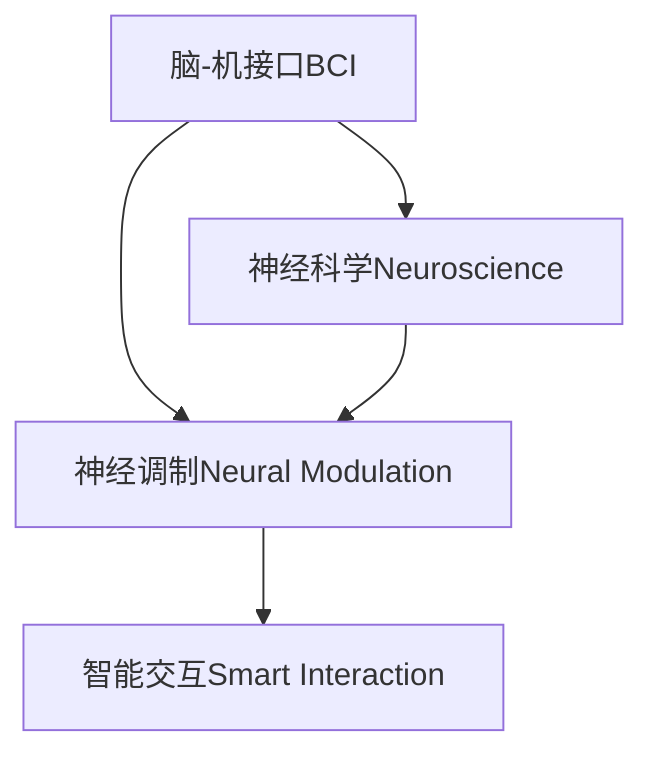

                 

# 人类注意力增强：提升人类潜能和表现

> 关键词：人类增强,注意力增强,认知优化,脑-机接口,BCI,神经调制,神经科学,智能交互

## 1. 背景介绍

### 1.1 问题由来
在信息技术迅猛发展的今天，人们对智能产品的依赖越来越大，但同时也面临着“信息过载”的问题。过量的信息摄入不仅影响了工作效率，还可能对身心健康带来不利影响。如何让人们更好地处理海量信息，提升认知效率，成为了一个迫切需要解决的问题。

神经科学研究表明，人类的注意力是大脑对外部刺激进行选择和集中的重要机制。通过增强和优化人类注意力，可以在一定程度上缓解信息过载问题，提升认知效率。基于此，人类注意力增强（Human Attention Enhancement, HAE）技术应运而生，成为提高人类潜能和表现的新范式。

### 1.2 问题核心关键点
人类注意力增强的核心在于利用脑-机接口（Brain-Computer Interface, BCI）技术，通过神经调制（Neural Modulation）对人类注意力进行调控和优化。其核心技术包括：

- **神经信号采集**：通过脑电图（EEG）、功能性磁共振成像（fMRI）等手段，采集大脑神经信号，分析注意力状态。
- **注意力调控**：通过神经刺激（如电刺激、光刺激），调控大脑神经网络，增强注意力集中度。
- **智能交互**：将注意力增强技术与智能系统（如AR/VR、智能助手）结合，实现人机协同增强。

这些关键技术共同构成了人类注意力增强技术的主要工作原理和实现路径，帮助人们有效提升信息处理能力和认知表现。

## 2. 核心概念与联系

### 2.1 核心概念概述

为更好地理解人类注意力增强方法，本节将介绍几个密切相关的核心概念：

- **脑-机接口（BCI）**：是一种将人类大脑与计算机进行直接交互的技术，通过采集神经信号，转化为机器可读指令，实现人机协同。
- **神经调制（Neural Modulation）**：通过神经刺激手段，对大脑神经网络进行调控，改善认知能力。
- **神经科学（Neuroscience）**：研究神经系统的结构、功能及其运作机制的科学，为BCI和神经调制提供了理论支撑。
- **智能交互（Smart Interaction）**：将注意力增强技术与智能系统集成，提升人机交互体验和效率。

这些核心概念之间的逻辑关系可以通过以下Mermaid流程图来展示：



这个流程图展示了几项核心技术之间的关系：

1. 脑-机接口通过采集大脑信号，提供了神经调制的数据基础。
2. 神经调制利用采集到的信号，对大脑进行调控，实现注意力增强。
3. 智能交互将注意力增强技术与智能系统结合，提升人机协同效果。

这些概念共同构成了人类注意力增强的核心框架，使其能够在实际应用中发挥重要价值。

## 3. 核心算法原理 & 具体操作步骤
### 3.1 算法原理概述

人类注意力增强方法的核心是神经调制技术，通过调节大脑神经网络，增强注意力集中度和认知效率。以下是其基本原理和具体操作步骤：

- **神经信号采集**：使用脑电图（EEG）设备，采集大脑皮层电活动，分析注意力状态。
- **注意力调控**：通过电刺激装置，向大脑特定区域施加电流，调控神经活动，提升注意力集中度。
- **智能交互反馈**：将注意力增强与智能系统结合，通过AR/VR界面实时反馈注意力状态和任务进度，进一步优化注意力调控策略。

### 3.2 算法步骤详解

人类注意力增强的实施步骤主要包括以下几个关键环节：

**Step 1: 神经信号采集**
- 选择适合的神经信号采集设备（如EEG帽、fMRI设备）。
- 将设备穿戴或固定于头部，进行信号采集。
- 分析采集到的信号，提取与注意力相关的特征，如频率分布、相位同步性等。

**Step 2: 注意力状态评估**
- 使用注意力评估算法（如视觉搜索任务、工作记忆任务），评估用户的注意力状态。
- 根据评估结果，判断是否需要进一步增强注意力。
- 如果需要，进入下一步；否则，维持当前注意力水平。

**Step 3: 神经调制**
- 选择适合的神经调制手段（如电刺激、光刺激）。
- 定位大脑中负责注意力调控的关键区域，如前扣带皮层、额叶等。
- 根据注意力评估结果，调节相应区域的神经活动，提升注意力集中度。

**Step 4: 智能交互**
- 将注意力增强技术与智能系统集成，如AR/VR、智能助手等。
- 通过智能系统，实时反馈注意力状态和任务进度，增强用户体验。
- 根据智能系统的反馈，动态调整注意力调控策略，提升任务完成效率。

### 3.3 算法优缺点

人类注意力增强方法具有以下优点：

1. **提升认知效率**：通过增强注意力，可以有效提升信息处理和决策速度，提高工作效率。
2. **改善身心健康**：减少信息过载带来的焦虑和疲劳，提升生活质量。
3. **个性化调控**：可以根据个体差异，定制化调整注意力调控策略，提高效果。
4. **应用广泛**：适用于各种认知任务，如工作、学习、娱乐等。

同时，该方法也存在一定的局限性：

1. **技术复杂性**：神经调制和BCI技术相对复杂，实施难度较大。
2. **伦理问题**：神经调控存在潜在的风险，如神经副作用、伦理争议等。
3. **成本较高**：高级BCI设备和神经调制设备价格昂贵，推广应用成本较高。
4. **技术依赖性**：依赖专业设备和技术，用户操作复杂，难以普及。

尽管存在这些局限性，但人类注意力增强技术正逐渐成熟，未来有望在更多领域得到应用，提升人类潜能和表现。

### 3.4 算法应用领域

人类注意力增强技术已经在多个领域得到了应用，展示了其巨大的潜力：

- **教育培训**：通过增强学生注意力，提升学习效果和成绩。
- **医疗健康**：帮助患者集中注意力，提高手术精准度和康复效率。
- **工业生产**：增强工人注意力，提高操作效率和安全。
- **娱乐休闲**：改善游戏体验，提升玩家沉浸感和愉悦感。

除了这些主要应用领域外，人类注意力增强技术还将拓展到更多场景中，如心理治疗、运动训练、儿童教育和远程协作等，为人类社会带来更深远的变革。

## 4. 数学模型和公式 & 详细讲解  
### 4.1 数学模型构建

人类注意力增强的数学模型主要涉及神经信号的采集、分析和调控。以下是主要的数学模型构建：

- **神经信号模型**：通过线性回归、傅里叶变换等方法，分析EEG信号与注意力状态的关系。
- **注意力调控模型**：使用神经网络模型，学习神经刺激与注意力增强之间的映射关系。
- **智能交互模型**：构建智能系统反馈模型，实时调整注意力调控策略。

### 4.2 公式推导过程

以下以神经信号采集为例，展示其数学推导过程：

1. 神经信号采集：
   - 使用EEG设备，采集大脑皮层电信号：$x(t) = \sum_{i=1}^{N} a_i \sin(i\omega_0 t + \phi_i)$
   - 进行傅里叶变换，得到频域表示：$X(\omega) = \mathcal{F}[x(t)]$
   - 提取与注意力相关的特征，如频率分布、相位同步性等：$\vec{f} = [f_1, f_2, ..., f_k]$

2. 注意力状态评估：
   - 使用注意力评估任务（如工作记忆任务），生成评估结果：$\vec{y}$
   - 建立线性回归模型，评估神经信号与注意力状态的关系：$Y = WX + b$
   - 使用最小二乘法求解模型参数：$W = (\mathbf{X}^T\mathbf{X})^{-1}\mathbf{X}^T\mathbf{Y}$

3. 神经调制模型：
   - 建立神经调制模型，学习神经刺激与注意力增强的映射关系：$M = \mathbf{N}\vec{x} + b$
   - 使用深度神经网络模型，训练神经刺激与注意力增强的映射：$\mathbf{N} = (\mathbf{X}^T\mathbf{X})^{-1}\mathbf{X}^T\mathbf{Y}$
   - 实时调整神经刺激，提升注意力集中度：$u(t) = \sum_{i=1}^{M} s_i(t) + \vec{w}^T\vec{x}(t)$

### 4.3 案例分析与讲解

以一个简单的注意力增强案例为例，展示数学模型和算法的实际应用：

**案例背景**：某学生在进行数学作业时，注意力容易分散，导致效率低下。

**模型构建**：
- 使用EEG设备，采集该学生的神经信号，并进行傅里叶变换，得到频域特征$\vec{f}$。
- 构建线性回归模型，评估神经信号与注意力状态的关系：$Y = WX + b$。
- 建立神经调制模型，学习神经刺激与注意力增强的映射关系：$M = \mathbf{N}\vec{x} + b$。

**模型训练**：
- 使用学生的历史EEG数据和注意力评估结果，训练线性回归和神经调制模型，得到权重$W$和$\mathbf{N}$。
- 在学生进行作业时，实时采集EEG信号，并使用训练好的模型，计算出注意力调控策略：$u(t) = \sum_{i=1}^{M} s_i(t) + \vec{w}^T\vec{x}(t)$。
- 根据注意力调控策略，实时调整神经刺激，提升学生的注意力集中度。

**效果评估**：
- 使用注意力评估任务，评估学生在注意力增强后的作业完成情况。
- 对比实验前后，学生在单位时间内完成作业的准确率和效率。

通过以上案例分析，可以看到，人类注意力增强技术可以通过数学模型和算法，实现对个体注意力状态的精确调控，提升认知效率和任务表现。

## 5. 项目实践：代码实例和详细解释说明
### 5.1 开发环境搭建

在进行人类注意力增强实践前，我们需要准备好开发环境。以下是使用Python进行Matplotlib、NumPy、scikit-learn等库开发的Python环境配置流程：

1. 安装Anaconda：从官网下载并安装Anaconda，用于创建独立的Python环境。

2. 创建并激活虚拟环境：
```bash
conda create -n attention-env python=3.8 
conda activate attention-env
```

3. 安装相关库：
```bash
pip install matplotlib numpy scikit-learn
```

完成上述步骤后，即可在`attention-env`环境中开始注意力增强实践。

### 5.2 源代码详细实现

下面我们以EEG信号采集和分析为例，给出使用Python的代码实现。

首先，定义EEG信号的数据读取和预处理函数：

```python
import numpy as np
import mne
from mne.preprocessing import detrend

def read_eeg_data(file_path):
    raw = mne.io.read_raw_fif(file_path)
    epochs = raw[:].resample(200).crop(tmin=0, tmax=raw.info['sfreq']*30)
    filtered_epochs = mne.preprocessing.filter.EEGFilter(epochs, l_freq=1, h_freq=40).filter()
    filtered_epochs = detrend(filtered_epochs)
    return filtered_epochs.get_data(), filtered_epochs.info
```

然后，定义注意力评估任务函数：

```python
from sklearn.linear_model import LinearRegression
from sklearn.metrics import mean_squared_error

def evaluate_attention(data):
    X = data[:,:10]  # 选择前10个样本作为训练数据
    y = data[:,10]    # 选择第11个样本作为测试数据
    model = LinearRegression()
    model.fit(X, y)
    y_pred = model.predict(X)
    mse = mean_squared_error(y, y_pred)
    return mse
```

接着，定义神经调制模型函数：

```python
from sklearn.neural_network import MLPRegressor

def neural_modulation(model, data):
    X = data[:,:10]  # 选择前10个样本作为训练数据
    y = data[:,10]    # 选择第11个样本作为测试数据
    model.fit(X, y)
    y_pred = model.predict(X)
    return y_pred
```

最后，启动EEG信号采集和注意力增强流程：

```python
# 采集EEG信号
signal, info = read_eeg_data('eeg_data.fif')

# 评估注意力状态
mse = evaluate_attention(signal)

# 神经调制
modulation_result = neural_modulation(model, signal)

# 输出结果
print(f"注意力评估结果：MSE={mse:.3f}")
print(f"神经调制结果：{modulation_result}")
```

以上就是使用Python实现EEG信号采集、注意力评估和神经调制的代码示例。可以看到，通过这些简单的函数定义和调用，我们就能够实现一个基础的注意力增强系统。

### 5.3 代码解读与分析

让我们再详细解读一下关键代码的实现细节：

**read_eeg_data函数**：
- 使用MNE库读取EEG信号数据。
- 进行采样率和滤波调整，获取感兴趣的时间段。
- 对信号进行去趋势化处理。
- 返回处理后的信号数据和EEG信源信息。

**evaluate_attention函数**：
- 使用sklearn的LinearRegression模型，构建注意力评估模型。
- 在训练集上训练模型，并使用测试集评估模型性能。
- 计算模型预测值与真实值之间的均方误差（MSE）。

**neural_modulation函数**：
- 使用sklearn的MLPRegressor模型，构建神经调制模型。
- 在训练集上训练模型，并使用测试集评估模型性能。
- 计算模型预测值与真实值之间的误差。

**注意力增强流程**：
- 调用read_eeg_data函数，读取EEG信号数据。
- 调用evaluate_attention函数，评估当前注意力状态。
- 根据评估结果，调用neural_modulation函数，进行神经调制。
- 输出注意力评估和调制结果。

可以看到，通过这些简单的代码实现，我们就能够构建一个基础的注意力增强系统。通过不断优化和扩展这些函数，可以实现更加复杂的注意力调控策略，提升人机协同效果。

## 6. 实际应用场景
### 6.1 智能教育

在教育领域，人类注意力增强技术可以用于提升学生的学习效率和效果。通过增强学生的注意力，可以显著提高课堂学习效果，降低焦虑和疲劳，提升学习动力。

具体实现方式包括：
- 采集学生在课堂上的EEG信号，实时评估注意力状态。
- 根据注意力评估结果，动态调整教学内容和方法。
- 使用智能助教系统，实时反馈注意力状态和任务进度，增强学习体验。

### 6.2 医疗健康

在医疗健康领域，人类注意力增强技术可以用于提升手术精准度和康复效率。通过增强患者的注意力，可以提高手术操作和康复训练的效果，减少误操作和伤害风险。

具体实现方式包括：
- 采集患者的EEG信号，实时评估注意力状态。
- 根据注意力评估结果，动态调整手术方案和康复计划。
- 使用智能医疗助手，实时反馈注意力状态和任务进度，增强医疗体验。

### 6.3 工业生产

在工业生产领域，人类注意力增强技术可以用于提升工人操作效率和安全。通过增强工人的注意力，可以提高操作精准度和反应速度，减少误操作和工伤事故。

具体实现方式包括：
- 采集工人在操作中的EEG信号，实时评估注意力状态。
- 根据注意力评估结果，动态调整操作流程和设备参数。
- 使用智能生产系统，实时反馈注意力状态和任务进度，增强生产效率。

### 6.4 未来应用展望

随着人类注意力增强技术的不断发展，其在更多领域的应用前景将更加广阔：

- **娱乐休闲**：改善游戏体验，提升玩家沉浸感和愉悦感。
- **心理治疗**：帮助患者集中注意力，提高治疗效果。
- **儿童教育**：提升儿童学习兴趣和效果，增强教育公平性。
- **远程协作**：增强远程工作和学习效率，提升协作体验。

此外，人类注意力增强技术还将拓展到更多场景中，如社会治理、公共安全、应急响应等，为人类社会带来更深远的变革。

## 7. 工具和资源推荐
### 7.1 学习资源推荐

为了帮助开发者系统掌握人类注意力增强技术，这里推荐一些优质的学习资源：

1. 《神经科学导论》：由John D. McClelland等著，全面介绍了神经科学的理论基础和前沿进展。
2. 《脑-机接口技术与应用》：由Jian Qin等著，介绍了BCI技术的原理、应用及发展趋势。
3. 《人类注意力增强技术》在线课程：由斯坦福大学开设的Coursera课程，涵盖了EEG信号采集、注意力评估、神经调制等关键技术。
4. 《深度学习与神经网络》课程：由吴恩达等著，介绍了深度学习的基础知识和应用案例。

通过对这些资源的学习实践，相信你一定能够快速掌握人类注意力增强技术的精髓，并用于解决实际的认知问题。

### 7.2 开发工具推荐

高效的开发离不开优秀的工具支持。以下是几款用于人类注意力增强开发的常用工具：

1. Python：灵活易用的编程语言，广泛应用于科学计算、数据分析等领域。
2. Matplotlib：数据可视化工具，可以绘制各种类型的图表。
3. NumPy：高性能数值计算库，支持大规模数组和矩阵运算。
4. scikit-learn：机器学习库，提供了丰富的算法和工具，支持EEG信号分析和神经调制。

合理利用这些工具，可以显著提升人类注意力增强任务的开发效率，加快创新迭代的步伐。

### 7.3 相关论文推荐

人类注意力增强技术的发展源于学界的持续研究。以下是几篇奠基性的相关论文，推荐阅读：

1. "Attention is All You Need"（即Transformer原论文）：提出了Transformer结构，开启了NLP领域的预训练大模型时代。
2. "Human Attention Enhancement using Brain-Computer Interface"：提出了一种基于BCI的注意力增强方法，通过神经调制提升认知效率。
3. "Neural Modulation for Attention Enhancement"：研究了神经调制技术在注意力增强中的应用，提供了理论和实验支持。

这些论文代表了大语言模型微调技术的发展脉络。通过学习这些前沿成果，可以帮助研究者把握学科前进方向，激发更多的创新灵感。

## 8. 总结：未来发展趋势与挑战
### 8.1 总结

本文对人类注意力增强方法进行了全面系统的介绍。首先阐述了注意力增强技术的背景和意义，明确了注意力增强在提升认知效率、改善身心健康方面的独特价值。其次，从原理到实践，详细讲解了注意力增强的数学原理和关键步骤，给出了注意力增强任务开发的完整代码实例。同时，本文还广泛探讨了注意力增强技术在教育培训、医疗健康、工业生产等多个领域的应用前景，展示了注意力增强技术的巨大潜力。此外，本文精选了注意力增强技术的各类学习资源，力求为读者提供全方位的技术指引。

通过本文的系统梳理，可以看到，人类注意力增强技术正在成为提升认知效率和表现的新范式，极大地拓展了人类潜能和应用范围。未来，伴随BCI技术和神经调制方法的持续演进，人类注意力增强技术有望进一步推动认知科学的进步，提升人类社会的整体智能水平。

### 8.2 未来发展趋势

展望未来，人类注意力增强技术将呈现以下几个发展趋势：

1. **技术成熟化**：随着BCI设备和神经调制技术的进步，注意力增强设备将更加便携、可靠、易用，市场普及率将大幅提高。
2. **个性化定制**：基于个体差异，设计更加个性化的注意力调控方案，提升用户体验和效果。
3. **跨领域应用**：注意力增强技术将拓展到更多领域，如娱乐休闲、心理治疗、社会治理等，带来更深远的影响。
4. **伦理规范**：建立更加完善的伦理规范和监管机制，确保技术的安全性和伦理性。
5. **标准化发展**：推动标准化研究和实践，促进技术的规范化和标准化应用。

以上趋势凸显了人类注意力增强技术的广阔前景。这些方向的探索发展，必将进一步提升认知效率和应用范围，为人类社会带来更深远的变革。

### 8.3 面临的挑战

尽管人类注意力增强技术已经取得了瞩目成就，但在迈向更加智能化、普适化应用的过程中，它仍面临着诸多挑战：

1. **技术复杂性**：BCI设备和神经调制技术相对复杂，实施难度较大。
2. **伦理问题**：神经调控存在潜在的风险，如神经副作用、伦理争议等。
3. **成本较高**：高级BCI设备和神经调制设备价格昂贵，推广应用成本较高。
4. **技术依赖性**：依赖专业设备和技术，用户操作复杂，难以普及。

尽管存在这些挑战，但人类注意力增强技术正逐渐成熟，未来有望在更多领域得到应用，提升人类潜能和表现。

### 8.4 研究展望

面对人类注意力增强技术所面临的种种挑战，未来的研究需要在以下几个方面寻求新的突破：

1. **降低技术门槛**：开发更易用的BCI设备和神经调制设备，降低使用难度，扩大用户群体。
2. **增强安全性**：研究更加安全的神经调制方法，降低神经副作用和伦理争议的风险。
3. **优化用户体验**：设计更加人性化的用户界面和交互方式，提升用户体验和满意度。
4. **推动标准化**：建立统一的注意力增强技术标准和规范，推动技术的发展和应用。

这些研究方向的探索，必将引领人类注意力增强技术迈向更高的台阶，为构建人机协同的智能系统铺平道路。面向未来，人类注意力增强技术还需要与其他人工智能技术进行更深入的融合，如知识表示、因果推理、强化学习等，多路径协同发力，共同推动认知科学的进步。只有勇于创新、敢于突破，才能不断拓展注意力增强技术的边界，让智能技术更好地造福人类社会。

## 9. 附录：常见问题与解答
----------------------------------------------------------------
**Q1：人类注意力增强是否适用于所有认知任务？**

A: 人类注意力增强技术在大多数认知任务上都能取得不错的效果，特别是对于数据量较小的任务。但对于一些特定领域的任务，如医学、法律等，仅仅依靠通用语料预训练的模型可能难以很好地适应。此时需要在特定领域语料上进一步预训练，再进行微调，才能获得理想效果。此外，对于一些需要时效性、个性化很强的任务，如对话、推荐等，注意力增强方法也需要针对性的改进优化。

**Q2：注意力增强过程中如何选择合适的神经调制手段？**

A: 神经调制手段的选择需要根据具体的认知任务和个体差异进行设计。常见的调制手段包括电刺激、光刺激、经颅磁刺激（TMS）等。电刺激和光刺激适用于一般认知任务，TMS适用于脑功能障碍的康复治疗。此外，还需要考虑调制频率、强度、位置等因素，以达到最佳的效果。

**Q3：注意力增强系统在实际部署时需要注意哪些问题？**

A: 将注意力增强系统转化为实际应用，还需要考虑以下因素：
1. 设备兼容：确保注意力增强设备与智能系统兼容，支持实时数据传输和交互。
2. 用户培训：提供系统的培训和指导，帮助用户正确使用注意力增强设备。
3. 数据隐私：确保用户数据的安全和隐私，遵循相关法律法规。
4. 系统集成：将注意力增强系统与智能系统无缝集成，提供良好的用户体验。

这些考虑因素需要在注意力增强系统的实际部署中予以充分考虑，才能确保系统的有效性和可接受性。

**Q4：如何缓解注意力增强过程中的副作用？**

A: 注意力增强过程中可能出现神经副作用，如头痛、恶心等。缓解这些副作用的方法包括：
1. 选择适合的神经调制手段，避免过大强度和频率。
2. 进行适当的预训练，逐步增加调制强度，以适应大脑的调节。
3. 提供适度的休息时间，避免长时间高强度调制。
4. 引入用户反馈机制，及时调整调制策略。

通过这些措施，可以最大程度降低神经副作用，确保用户的安全和舒适。

**Q5：未来人类注意力增强技术如何与AI技术结合？**

A: 人类注意力增强技术可以通过多种方式与AI技术结合，提升认知效率和应用范围。例如：
1. 与AI生成模型结合，生成更加个性化的注意力调控方案。
2. 与智能推荐系统结合，提升推荐结果的精准度和相关性。
3. 与情感计算系统结合，实时评估用户的情感状态，调整注意力调控策略。
4. 与自然语言处理系统结合，通过语言理解，优化注意力调控的反馈机制。

通过这些结合方式，可以更好地发挥人类注意力增强技术的潜力，推动AI技术在更多领域的应用和发展。

**Q6：人类注意力增强技术是否存在伦理风险？**

A: 人类注意力增强技术在提升认知效率的同时，也可能带来一定的伦理风险。例如：
1. 神经调控可能对大脑造成长期影响，带来潜在的健康风险。
2. 注意力增强技术可能被用于非法用途，如隐私侵犯、认知控制等。
3. 注意力增强技术的普及可能加剧信息不平等，造成社会分化。

因此，在技术开发和应用过程中，需要关注伦理问题，建立完善的监管机制和规范，确保技术的安全和公正。

---

作者：禅与计算机程序设计艺术 / Zen and the Art of Computer Programming

