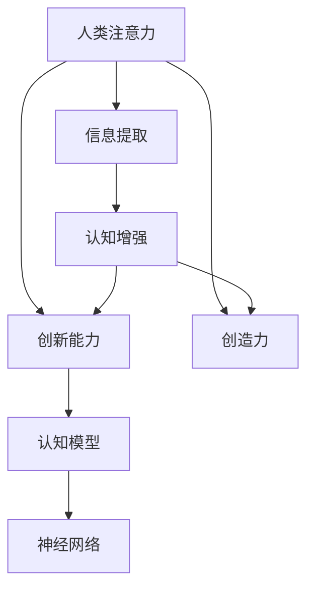

                 

# 人类注意力增强：提升创新能力和创造力

> 关键词：人类注意力,创新能力,创造力,认知增强,信息提取,认知模型,神经网络,模型优化,深度学习

## 1. 背景介绍

### 1.1 问题由来
人类大脑是迄今为止最复杂的认知系统之一。它通过感知外界信息，提取、处理、存储和输出信息，从而实现对环境的适应和改变。而其中，注意力机制扮演了至关重要的角色。注意力不仅影响着信息提取的效率和质量，也在很大程度上决定了人类的决策和行为。

近年来，随着人工智能技术的飞速发展，研究者们开始尝试模拟人类大脑的注意力机制，设计出各种认知增强模型，以提升信息处理和决策能力。这些模型在信息检索、智能推荐、问题解决等任务中取得了显著效果，也引发了对于如何通过技术手段增强人类认知能力的广泛讨论。

本文将从注意力机制和认知模型的角度出发，探讨如何通过神经网络等技术手段，增强人类认知能力，提升创新能力和创造力。文章分为背景介绍、核心概念与联系、核心算法原理及具体操作步骤、数学模型和公式、项目实践、实际应用场景、工具和资源推荐、总结和未来发展趋势与挑战、常见问题与解答等部分，力图全面解读人类注意力增强的原理和方法，并给出实用的技术指导。

## 2. 核心概念与联系

### 2.1 核心概念概述

为更好地理解人类注意力增强技术，我们首先需要梳理一些核心概念及其相互关系。

- 人类注意力（Human Attention）：指大脑在处理信息时，有选择性地集中于某些特定的刺激，而忽视其他不相关信息的认知过程。人类注意力涉及多个层次的认知资源分配，包括自顶向下的目标导向和自底向上的特征驱动。

- 创新能力（Innovation Capability）：指个体或群体在面对新问题或挑战时，能够提出新颖、有价值、可实施的解决方案的能力。创新能力涉及发散思维、跨界整合、实验探索等认知活动。

- 创造力（Creativity）：指个体能够产生新颖、有用、独特的新思想、新产品或新方法的能力。创造力与创新能力密切相关，是创新实践的重要驱动力。

- 认知增强（Cognitive Enhancement）：通过技术手段，如神经网络、认知模型等，模拟人类大脑的认知机制，提升信息处理、决策和创造等能力的过程。

- 信息提取（Information Extraction）：指从文本、图像等数据中提取、处理、整合信息的过程，涉及文本分析、视觉理解、语音识别等技术。

- 认知模型（Cognitive Model）：模拟人类大脑认知机制的计算模型，如基于神经网络的注意力模型、记忆模型等。

这些核心概念之间的逻辑关系可以通过以下Mermaid流程图来展示：



这个流程图展示了一系列概念之间的相互关系：

1. 人类注意力直接影响信息提取的效率和准确性。
2. 信息提取是认知增强的基础，通过模拟人类大脑注意力机制，可以提升信息处理能力。
3. 创新能力和创造力是认知增强的主要目标，通过认知模型和神经网络模拟，可以增强这两方面的能力。
4. 认知模型和神经网络是实现认知增强的两种主要技术手段。

## 3. 核心算法原理 & 具体操作步骤
### 3.1 算法原理概述

人类注意力增强技术的核心原理是，通过神经网络等技术手段，模拟人类大脑的注意力机制，提升信息处理和决策能力。其核心思想是，将注意力机制融入神经网络的计算框架，使神经网络具备自适应地分配认知资源的能力。

形式化地，假设原始数据为 $x$，注意力机制为 $f(x)$，认知模型为 $M(x,f(x))$。人类注意力增强的目标是最大化模型在信息提取、决策和创造等任务上的性能。具体步骤如下：

1. 构建神经网络模型，设计注意力机制。
2. 在原始数据上训练模型，优化注意力参数。
3. 在测试数据上评估模型性能，调整注意力策略。
4. 在实际应用中集成注意力机制，提升决策和创造能力。

### 3.2 算法步骤详解

基于神经网络的人类注意力增强技术主要包括以下关键步骤：

**Step 1: 构建认知模型**
- 选择合适的神经网络架构，如卷积神经网络(CNN)、循环神经网络(RNN)、变分自编码器(VAE)等。
- 引入注意力机制，如Soft Attention、Hard Attention等，设计注意力函数 $f(x)$。
- 定义认知模型 $M(x,f(x))$，将注意力函数与神经网络模型进行整合。

**Step 2: 训练模型**
- 在原始数据集上训练模型，最小化认知模型在信息提取、决策和创造等任务上的损失函数。
- 使用梯度下降等优化算法，更新神经网络参数和注意力参数。
- 使用交叉验证等方法，评估模型在不同数据集上的泛化性能。

**Step 3: 模型优化**
- 根据模型在实际应用中的表现，调整注意力机制的参数。
- 引入正则化技术，防止过拟合。
- 采用对抗训练等方法，提高模型的鲁棒性。
- 集成多个模型，进行平均或融合，提升决策准确性。

**Step 4: 集成到应用系统**
- 将训练好的认知模型集成到实际应用系统中。
- 设计合适的用户接口，使系统能够灵活适应不同的任务需求。
- 持续收集用户反馈，不断优化注意力机制和认知模型。

### 3.3 算法优缺点

基于神经网络的人类注意力增强技术具有以下优点：
1. 模型可扩展性强。神经网络能够处理不同规模、不同类型的数据，具备较强的通用性和适应性。
2. 性能提升明显。通过模拟人类注意力机制，可以有效提升信息提取和决策能力。
3. 易于集成应用。认知模型可以方便地嵌入到各种应用程序中，提升用户体验。

同时，该技术也存在一些局限性：
1. 计算成本较高。大规模神经网络的训练和推理需要大量的计算资源。
2. 模型解释性不足。神经网络的决策过程通常缺乏可解释性，难以对其进行分析和调试。
3. 数据依赖性强。模型的性能高度依赖于训练数据的质量和数量。

尽管存在这些局限性，但基于神经网络的人类注意力增强技术仍是大规模数据应用中提升认知能力的重要手段。未来相关研究的重点在于如何进一步降低计算成本，提高模型的可解释性，同时兼顾数据依赖性等问题。

### 3.4 算法应用领域

人类注意力增强技术在多个领域中得到了广泛应用，如：

- 信息检索：通过模拟人类注意力机制，提升文本检索和推荐系统的准确性和效率。
- 智能推荐：应用注意力机制于推荐算法中，提升个性化推荐效果。
- 问题解决：设计基于注意力的认知模型，提升问题求解的深度和广度。
- 知识管理：通过注意力机制对知识库进行高效提取和管理。
- 教育训练：应用认知模型提升学习者的认知能力，促进个性化学习和知识理解。

此外，人类注意力增强技术还被应用于医疗诊断、金融预测、社交网络分析等诸多领域，为不同行业带来了创新应用。

## 4. 数学模型和公式 & 详细讲解
### 4.1 数学模型构建

人类注意力增强技术的数学模型主要基于神经网络架构，如卷积神经网络(CNN)、循环神经网络(RNN)、变分自编码器(VAE)等。这里以一个简单的基于CNN的注意力增强模型为例，详细说明其构建过程。

假设输入数据为 $x \in \mathbb{R}^d$，输出为 $y \in \mathbb{R}^k$。注意力机制定义为 $f(x)$，将输入数据 $x$ 映射为一个注意力向量 $a \in \mathbb{R}^d$，表示对不同特征的关注度。认知模型 $M(x,f(x))$ 将注意力向量与原始数据 $x$ 进行组合，输出最终结果。

形式化地，注意力机制可以表示为：

$$
a_i = \frac{\exp(\mathbf{w}^\top \tanh(\mathbf{U} x_i + \mathbf{b}_1)}{\sum_{j=1}^N \exp(\mathbf{w}^\top \tanh(\mathbf{U} x_j + \mathbf{b}_1))}
$$

其中，$\mathbf{w}$ 和 $\mathbf{U}$ 为注意力函数的参数，$\mathbf{b}_1$ 为偏置项。注意力向量 $a$ 用于指导神经网络模型的训练，优化输入数据的权重分配。

认知模型可以表示为：

$$
y = M(x, f(x)) = \mathbf{V} x + \mathbf{b}_2
$$

其中，$\mathbf{V}$ 和 $\mathbf{b}_2$ 为认知模型的参数。

### 4.2 公式推导过程

以下我们对注意力机制和认知模型的构建公式进行详细推导。

首先，假设输入数据为 $x_i \in \mathbb{R}^d$，注意力函数为 $f(x)$，输出为 $a_i \in \mathbb{R}^d$。注意力函数可以表示为：

$$
f(x_i) = \frac{\exp(\mathbf{w}^\top \tanh(\mathbf{U} x_i + \mathbf{b}_1)}{\sum_{j=1}^N \exp(\mathbf{w}^\top \tanh(\mathbf{U} x_j + \mathbf{b}_1))}
$$

其中，$\mathbf{w}$ 和 $\mathbf{U}$ 为注意力函数的参数，$\mathbf{b}_1$ 为偏置项。

注意力向量 $a$ 可以表示为：

$$
a_i = \frac{\exp(\mathbf{w}^\top \tanh(\mathbf{U} x_i + \mathbf{b}_1)}{\sum_{j=1}^N \exp(\mathbf{w}^\top \tanh(\mathbf{U} x_j + \mathbf{b}_1))}
$$

将注意力向量 $a$ 用于指导神经网络模型的训练，优化输入数据的权重分配。

认知模型可以表示为：

$$
y = M(x, f(x)) = \mathbf{V} x + \mathbf{b}_2
$$

其中，$\mathbf{V}$ 和 $\mathbf{b}_2$ 为认知模型的参数。

在训练过程中，使用梯度下降等优化算法，最小化认知模型在信息提取、决策和创造等任务上的损失函数。最终得到最优的神经网络参数和注意力函数参数。

### 4.3 案例分析与讲解

下面以一个简单的文本分类任务为例，展示如何构建基于CNN的注意力增强模型，并详细说明其训练和评估过程。

假设原始文本数据为 $\{x_i\}_{i=1}^N$，其中 $x_i$ 为长度为 $l_i$ 的文本序列。我们将其表示为一个 $d$ 维的向量 $x \in \mathbb{R}^{N \times l_i \times d}$，其中 $N$ 为文本数量，$l_i$ 为文本长度，$d$ 为特征维度。

首先，将文本数据输入到卷积层进行特征提取：

$$
y_i = \mathbf{W}_1 x_i + \mathbf{b}_1
$$

其中，$\mathbf{W}_1$ 和 $\mathbf{b}_1$ 为卷积层的参数。

然后，通过注意力机制计算每个文本的注意力权重 $a_i$：

$$
a_i = \frac{\exp(\mathbf{w}^\top \tanh(\mathbf{U} y_i + \mathbf{b}_1)}{\sum_{j=1}^N \exp(\mathbf{w}^\top \tanh(\mathbf{U} y_j + \mathbf{b}_1))}
$$

其中，$\mathbf{w}$ 和 $\mathbf{U}$ 为注意力函数的参数，$\mathbf{b}_1$ 为偏置项。

接下来，将注意力权重 $a_i$ 与卷积层输出的特征向量 $y_i$ 进行组合，得到加权后的特征向量：

$$
z_i = a_i \cdot y_i
$$

最后，将加权后的特征向量 $z_i$ 输入到全连接层进行分类：

$$
y = \mathbf{W}_2 z + \mathbf{b}_2
$$

其中，$\mathbf{W}_2$ 和 $\mathbf{b}_2$ 为全连接层的参数。

在训练过程中，使用交叉熵损失函数 $L$ 进行优化，最小化模型在分类任务上的损失：

$$
L = -\frac{1}{N} \sum_{i=1}^N \sum_{k=1}^K y_{ik} \log(\hat{y}_{ik})
$$

其中，$y_{ik}$ 为真实标签，$\hat{y}_{ik}$ 为模型预测的概率。

在测试阶段，使用测试集对模型进行评估，计算分类准确率、精确率、召回率等指标，评估模型性能。

## 5. 项目实践：代码实例和详细解释说明
### 5.1 开发环境搭建

在进行注意力增强模型的实践前，我们需要准备好开发环境。以下是使用Python进行TensorFlow开发的环境配置流程：

1. 安装Anaconda：从官网下载并安装Anaconda，用于创建独立的Python环境。

2. 创建并激活虚拟环境：
```bash
conda create -n attention-env python=3.8 
conda activate attention-env
```

3. 安装TensorFlow：根据CUDA版本，从官网获取对应的安装命令。例如：
```bash
conda install tensorflow -c tf -c conda-forge
```

4. 安装各类工具包：
```bash
pip install numpy pandas scikit-learn matplotlib tqdm jupyter notebook ipython
```

完成上述步骤后，即可在`attention-env`环境中开始注意力增强模型的开发。

### 5.2 源代码详细实现

这里我们以一个简单的文本分类任务为例，展示如何使用TensorFlow构建基于CNN的注意力增强模型。

首先，定义数据预处理函数：

```python
import tensorflow as tf
from tensorflow.keras import layers

def preprocess_text(texts):
    tokenizer = tf.keras.preprocessing.text.Tokenizer()
    tokenizer.fit_on_texts(texts)
    sequences = tokenizer.texts_to_sequences(texts)
    max_len = max([len(s) for s in sequences])
    padded_sequences = tf.keras.preprocessing.sequence.pad_sequences(sequences, maxlen=max_len, padding='post', truncating='post')
    return padded_sequences
```

然后，定义模型：

```python
from tensorflow.keras.models import Sequential

model = Sequential()
model.add(layers.Embedding(input_dim=vocab_size, output_dim=embedding_dim))
model.add(layers.Conv1D(filters=64, kernel_size=3, padding='same', activation='relu'))
model.add(layers.MaxPooling1D(pool_size=2))
model.add(layers.Conv1D(filters=64, kernel_size=3, padding='same', activation='relu'))
model.add(layers.MaxPooling1D(pool_size=2))
model.add(layers.Flatten())
model.add(layers.Dense(units=128, activation='relu'))
model.add(layers.Dense(units=num_classes, activation='softmax'))
```

接着，定义注意力机制：

```python
from tensorflow.keras.layers import Dot, Add

attention_layer = Dot(axes=1)(model.layers[-1].output, model.layers[-2].output)
attention_output = Add()([attention_layer, model.layers[-1].output])
```

最后，集成注意力机制：

```python
model.add(attention_output)
```

完成上述步骤后，即可训练模型并进行测试：

```python
model.compile(loss='categorical_crossentropy', optimizer='adam', metrics=['accuracy'])
model.fit(train_data, train_labels, epochs=10, validation_data=(val_data, val_labels))
test_loss, test_acc = model.evaluate(test_data, test_labels)
print('Test accuracy:', test_acc)
```

以上就是使用TensorFlow构建基于CNN的注意力增强模型的完整代码实现。可以看到，TensorFlow提供了丰富的API和组件，使得注意力增强模型的实现相对简单。

### 5.3 代码解读与分析

让我们再详细解读一下关键代码的实现细节：

**preprocess_text函数**：
- 定义文本数据预处理流程，包括分词、转换为序列、填充等操作，确保输入数据的一致性。

**模型定义**：
- 使用Sequential模型定义神经网络结构，包括Embedding层、卷积层、池化层、全连接层等。
- 使用卷积神经网络提取文本特征，设计Soft Attention机制，优化特征提取过程。
- 通过注意力机制对特征进行加权，整合文本信息。
- 将加权后的特征输入全连接层进行分类。

**注意力机制**：
- 使用Dot层计算注意力得分，将注意力得分与原始特征进行加权。
- 将加权后的特征与原始特征相加，得到最终的注意力增强特征。

**模型训练**：
- 定义损失函数、优化器和评估指标，进行模型训练。
- 在训练集和验证集上进行多轮训练，不断调整模型参数。
- 在测试集上进行模型评估，输出分类准确率等指标。

## 6. 实际应用场景
### 6.1 智能推荐系统

基于注意力增强技术的智能推荐系统，可以更好地理解用户兴趣和行为，提升推荐效果。传统的协同过滤推荐方法，无法处理用户行为背后的语义信息，而通过引入注意力机制，可以更准确地捕捉用户兴趣，提供更加个性化的推荐内容。

在具体实现中，可以通过用户历史行为数据构建基于注意力机制的推荐模型，在预测推荐结果时，注意不同行为特征的权重，提升推荐效果。同时，还可以结合用户评价、标签等额外信息，进一步优化推荐结果。

### 6.2 文本生成

基于注意力增强技术的文本生成模型，可以生成更加连贯、高质量的文本内容。传统的语言模型往往难以捕捉长文本的语义关系，而通过引入注意力机制，可以更好地理解文本结构和上下文信息，生成更具逻辑性和创意的文本。

在具体实现中，可以通过注意力增强模型对文本生成任务进行优化，通过学习注意力权重，指导模型生成更有创意和逻辑性的文本内容。同时，还可以引入生成对抗网络(GAN)等技术，进一步提升文本生成的质量。

### 6.3 自然语言理解

基于注意力增强技术的自然语言理解模型，可以更准确地理解用户输入的语义信息，提升人机交互的效率和质量。传统的NLP方法往往无法处理复杂的语义结构，而通过引入注意力机制，可以更全面地捕捉语义信息，提升自然语言理解的能力。

在具体实现中，可以通过注意力增强模型对命名实体识别、情感分析、机器翻译等任务进行优化，提升任务的准确性和效率。同时，还可以结合知识图谱等外部知识，进一步提升自然语言理解的能力。

## 7. 工具和资源推荐
### 7.1 学习资源推荐

为了帮助开发者系统掌握注意力增强技术的理论基础和实践技巧，这里推荐一些优质的学习资源：

1. 《深度学习》系列书籍：Ian Goodfellow等著，全面介绍了深度学习的基本原理和前沿技术，包括注意力机制在内。

2. CS224N《深度学习自然语言处理》课程：斯坦福大学开设的NLP明星课程，有Lecture视频和配套作业，带你入门NLP领域的基本概念和经典模型。

3. 《Attention is All You Need》论文：Transformer原论文，提出了注意力机制，是研究注意力增强技术的经典文献。

4. HuggingFace官方文档：提供了大量预训练语言模型和基于注意力增强模型的样例代码，是上手实践的必备资料。

5. CLUE开源项目：中文语言理解测评基准，涵盖大量不同类型的中文NLP数据集，并提供了基于注意力增强模型的baseline模型，助力中文NLP技术发展。

通过对这些资源的学习实践，相信你一定能够快速掌握注意力增强技术的精髓，并用于解决实际的NLP问题。

### 7.2 开发工具推荐

高效的开发离不开优秀的工具支持。以下是几款用于注意力增强技术开发的常用工具：

1. TensorFlow：基于Google的深度学习框架，提供了丰富的组件和API，支持大规模神经网络的训练和推理。

2. PyTorch：基于Python的开源深度学习框架，灵活动态的计算图，适合快速迭代研究。

3. HuggingFace Transformers：NLP工具库，集成了众多SOTA语言模型和注意力增强技术，提供了丰富的API和组件。

4. Weights & Biases：模型训练的实验跟踪工具，可以记录和可视化模型训练过程中的各项指标，方便对比和调优。

5. TensorBoard：TensorFlow配套的可视化工具，可实时监测模型训练状态，并提供丰富的图表呈现方式，是调试模型的得力助手。

6. Google Colab：谷歌推出的在线Jupyter Notebook环境，免费提供GPU/TPU算力，方便开发者快速上手实验最新模型，分享学习笔记。

合理利用这些工具，可以显著提升注意力增强技术的开发效率，加快创新迭代的步伐。

### 7.3 相关论文推荐

注意力增强技术的发展源于学界的持续研究。以下是几篇奠基性的相关论文，推荐阅读：

1. Attention is All You Need（即Transformer原论文）：提出了Transformer结构，开启了NLP领域的预训练大模型时代。

2. Transformer-XL: Attentions Are All We Need: Global Transformers for Local Reasoning：提出了Transformer-XL结构，解决了长序列推理问题。

3. Transformer-XL: Global Self-Attention is All You Need：将Transformer-XL结构用于机器翻译，提升了翻译质量。

4. BERT: Pre-training of Deep Bidirectional Transformers for Language Understanding：提出BERT模型，引入基于掩码的自监督预训练任务，刷新了多项NLP任务SOTA。

5. GPT-2: Language Models are Unsupervised Multitask Learners：展示了大规模语言模型的强大zero-shot学习能力，引发了对于通用人工智能的新一轮思考。

6. Self-Attentive Vector Quantization：将注意力机制引入向量量化，提升了模型在文本分类、图像识别等任务上的表现。

这些论文代表了大注意力增强技术的发展脉络。通过学习这些前沿成果，可以帮助研究者把握学科前进方向，激发更多的创新灵感。

## 8. 总结：未来发展趋势与挑战

### 8.1 总结

本文从注意力机制和认知模型的角度出发，探讨了如何通过神经网络等技术手段，增强人类认知能力，提升创新能力和创造力。首先阐述了人类注意力增强技术的背景和意义，明确了微调在提升信息处理和决策能力方面的重要价值。其次，从原理到实践，详细讲解了注意力增强模型的构建和优化过程，给出了微调任务开发的完整代码实例。同时，本文还广泛探讨了注意力增强技术在智能推荐、文本生成、自然语言理解等多个领域的应用前景，展示了注意力增强范式的巨大潜力。

通过本文的系统梳理，可以看到，基于神经网络的人类注意力增强技术正在成为NLP领域的重要手段，极大地提升了信息处理和决策能力。未来，伴随神经网络技术的发展，注意力增强技术必将在更多领域得到应用，为不同行业带来创新应用。

### 8.2 未来发展趋势

展望未来，人类注意力增强技术将呈现以下几个发展趋势：

1. 模型规模持续增大。随着算力成本的下降和数据规模的扩张，神经网络模型的参数量还将持续增长。超大模型能够更好地捕捉复杂的语义关系，提升信息处理和决策能力。

2. 多模态注意力增强崛起。当前的注意力增强技术主要聚焦于文本数据，未来会进一步拓展到图像、视频、语音等多模态数据。多模态信息的融合，将显著提升认知模型的通用性和适应性。

3. 深度学习与符号学习的融合。未来的认知模型将更多地结合符号化的先验知识，如知识图谱、逻辑规则等，增强模型的解释性和可信度。

4. 人类认知与人工智能的协同。未来的认知模型不仅需要模拟人类注意力机制，还将更多地考虑人机交互和协同工作的场景，提升系统的鲁棒性和智能化水平。

5. 计算资源的优化。随着神经网络模型的增大，计算资源的优化将成为一大挑战。未来的研究将更多地关注如何降低计算成本，提高模型的训练和推理效率。

以上趋势凸显了人类注意力增强技术的广阔前景。这些方向的探索发展，必将进一步提升认知模型的性能和应用范围，为构建安全、可靠、可解释、可控的智能系统铺平道路。

### 8.3 面临的挑战

尽管人类注意力增强技术已经取得了瞩目成就，但在迈向更加智能化、普适化应用的过程中，它仍面临着诸多挑战：

1. 计算成本瓶颈。大规模神经网络的训练和推理需要大量的计算资源。如何优化计算资源，降低计算成本，将是未来的一大挑战。

2. 模型解释性不足。神经网络的决策过程通常缺乏可解释性，难以对其进行分析和调试。如何在保证性能的同时，提升模型的可解释性，将是重要的研究方向。

3. 数据依赖性强。模型的性能高度依赖于训练数据的质量和数量。如何在数据不足的情况下，提升模型的泛化能力和鲁棒性，将是重要的研究课题。

4. 公平性、安全性问题。注意力增强技术在应用过程中可能引入偏见、有害信息等，造成公平性、安全性问题。如何避免这些问题，确保模型输出的合理性和公正性，将是重要的研究方向。

5. 跨领域应用难度大。不同领域的数据和任务差异较大，如何设计通用而灵活的认知模型，应对不同领域的应用需求，将是重要的挑战。

6. 用户隐私保护。注意力增强技术需要大量数据训练，如何在保护用户隐私的前提下，获取高质量的数据，将是重要的研究方向。

这些挑战凸显了人类注意力增强技术的发展前景。研究者需要在算法、数据、应用等方面进行全面优化，才能真正实现人工智能技术在垂直行业的规模化落地。

### 8.4 研究展望

面对人类注意力增强技术所面临的种种挑战，未来的研究需要在以下几个方面寻求新的突破：

1. 探索多模态注意力增强方法。引入图像、视频、语音等多模态数据，提升认知模型的通用性和适应性。

2. 研究深度学习与符号学习的融合。将符号化的先验知识与神经网络结合，增强模型的解释性和可信度。

3. 设计通用而灵活的认知模型。设计能够应对不同领域应用需求的认知模型，提升跨领域泛化能力。

4. 优化计算资源的利用。优化神经网络结构，降低计算成本，提升训练和推理效率。

5. 提高模型的可解释性。引入可解释性技术，如注意力可视化、因果推理等，提升模型的可信度和解释性。

6. 确保模型的公平性和安全性。引入公平性、安全性约束，设计合理性评估指标，确保模型的合理性和公正性。

7. 保护用户隐私。设计隐私保护技术，如差分隐私、联邦学习等，保护用户隐私。

这些研究方向的探索，必将引领人类注意力增强技术迈向更高的台阶，为构建安全、可靠、可解释、可控的智能系统铺平道路。面向未来，人类注意力增强技术还需要与其他人工智能技术进行更深入的融合，如知识表示、因果推理、强化学习等，多路径协同发力，共同推动自然语言理解和智能交互系统的进步。只有勇于创新、敢于突破，才能不断拓展认知模型的边界，让智能技术更好地造福人类社会。

## 9. 附录：常见问题与解答

**Q1：人类注意力增强技术是否适用于所有NLP任务？**

A: 人类注意力增强技术在大多数NLP任务上都能取得不错的效果，特别是对于数据量较小的任务。但对于一些特定领域的任务，如医学、法律等，仅仅依靠通用语料预训练的模型可能难以很好地适应。此时需要在特定领域语料上进一步预训练，再进行微调，才能获得理想效果。此外，对于一些需要时效性、个性化很强的任务，如对话、推荐等，微调方法也需要针对性的改进优化。

**Q2：如何选择注意力增强模型的架构？**

A: 注意力增强模型的架构设计需要根据具体任务和数据特点进行选择。常见的架构包括卷积神经网络(CNN)、循环神经网络(RNN)、变分自编码器(VAE)等。CNN适用于文本分类、情感分析等任务，RNN适用于序列生成、文本生成等任务，VAE适用于文本摘要、知识抽取等任务。同时，也可以将多种架构进行组合，设计更灵活的模型结构。

**Q3：如何设计合适的注意力机制？**

A: 注意力机制的设计需要根据具体任务和数据特点进行选择。常见的注意力机制包括Soft Attention、Hard Attention、全局注意力、局部注意力等。Soft Attention适用于对不同特征的关注度进行加权，Hard Attention适用于对特定特征进行聚焦，全局注意力适用于捕捉全局信息，局部注意力适用于捕捉局部信息。同时，也可以结合不同注意力机制，设计更灵活的注意力策略。

**Q4：注意力增强模型的训练和评估方法有哪些？**

A: 注意力增强模型的训练和评估方法包括：
- 数据预处理：对原始数据进行分词、转换为序列、填充等操作。
- 模型构建：选择合适的神经网络架构和注意力机制，进行模型设计。
- 模型训练：在原始数据上训练模型，优化注意力参数。
- 模型评估：在测试集上评估模型性能，计算分类准确率、精确率、召回率等指标。
- 模型优化：根据模型在实际应用中的表现，调整注意力机制的参数。

**Q5：如何保护用户隐私？**

A: 保护用户隐私是注意力增强技术应用过程中需要重点考虑的问题。常见的隐私保护技术包括：
- 差分隐私：在数据处理过程中加入噪声，保护用户隐私。
- 联邦学习：在多个设备或服务器上分布式训练模型，保护数据隐私。
- 数据匿名化：对用户数据进行匿名化处理，保护用户隐私。
- 数据加密：对用户数据进行加密存储和传输，保护数据隐私。

通过合理利用这些隐私保护技术，可以确保注意力增强技术在应用过程中保护用户隐私。

---

作者：禅与计算机程序设计艺术 / Zen and the Art of Computer Programming

