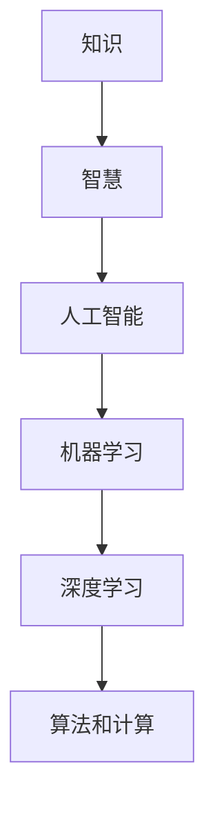
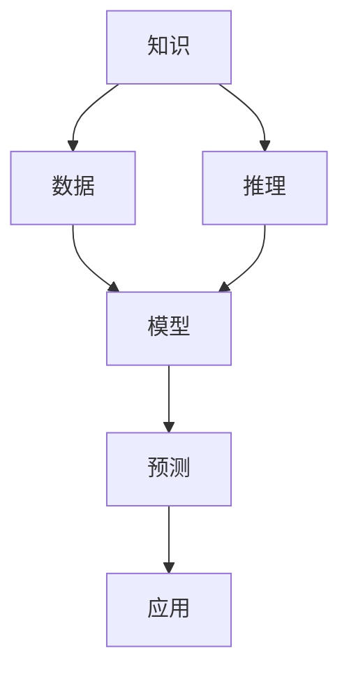

                 

# 人类的知识与智慧：在人工智能时代

在科技飞速发展的今天，人工智能（AI）正以前所未有的速度改变着我们的生活方式和认知模式。作为一名人工智能领域的专家，我有幸见证并参与了这场技术革命。本文将从“知识与智慧”的角度出发，探讨AI技术在人工智能时代的潜力和挑战，希望能为读者提供一些思考和启示。

## 1. 背景介绍

### 1.1 人类知识与智慧的演变

从古至今，人类积累了大量知识和智慧，通过文字、语言、艺术等形式传承至今。知识的积累是人类文明进步的重要标志，而智慧则是在知识基础上的洞察力和应用能力。

在农耕时代，人类的知识主要来自直接经验，智慧体现在对自然规律的观察和利用。进入工业时代，科学方法和实验技术的出现，使得知识更加系统化、理论化，智慧则体现在技术的革新和应用。

### 1.2 人工智能与知识智慧的结合

人工智能的兴起，为人类知识与智慧的传承与创新带来了新的可能性。AI技术不仅能处理大量数据，还能从数据中提取和利用知识，甚至通过自我学习，形成新的智慧。

在传统意义上，知识通常被视作静态的信息集合，而智慧更多体现在对知识的理解和应用上。人工智能则不同，它不仅能存储知识，还能主动学习和应用知识，形成更全面的智慧。

## 2. 核心概念与联系

### 2.1 核心概念概述

- **知识（Knowledge）**：静态的、经过验证的信息集合，是人类智慧的结晶。
- **智慧（Wisdom）**：动态的、基于知识的应用能力，是人类对世界的洞察和改造。
- **人工智能（Artificial Intelligence, AI）**：通过算法和计算，模拟人类认知过程的技术。
- **机器学习（Machine Learning, ML）**：AI的一个子领域，使机器能够从数据中自动学习并优化性能。
- **深度学习（Deep Learning, DL）**：一种特殊的机器学习方法，通过多层神经网络模拟人类大脑的工作方式。

这些概念之间的联系如下图所示：



这个图表表明，知识是智慧的基础，智慧则是知识应用的结果。人工智能通过机器学习和深度学习等技术，从知识中提取智慧，并应用于各个领域。

### 2.2 核心概念原理和架构的 Mermaid 流程图

以下是一个简单的 Mermaid 流程图，展示了知识、智慧、人工智能之间的相互作用：



这个流程图示例了知识如何通过推理转化为模型，模型再通过预测生成应用，从而形成智慧。

## 3. 核心算法原理 & 具体操作步骤

### 3.1 算法原理概述

人工智能的核心算法包括机器学习、深度学习等，这些算法通过数据驱动的方式，使机器能够学习和应用知识，形成智慧。以深度学习为例，它通过多层神经网络模拟人类大脑的神经元结构，通过反向传播算法，从大量数据中提取知识，并用于预测和决策。

深度学习的基本原理包括以下几个步骤：

1. **数据预处理**：清洗、转换、归一化数据，使其适合算法处理。
2. **构建模型**：设计神经网络结构，选择适当的激活函数、损失函数和优化算法。
3. **训练模型**：使用数据集进行前向传播和反向传播，调整模型参数以最小化损失函数。
4. **测试模型**：使用测试集评估模型性能，调整模型参数以提高预测准确率。
5. **应用模型**：将训练好的模型应用于实际问题，生成预测结果。

### 3.2 算法步骤详解

以深度学习为例，其详细步骤可以总结如下：

1. **数据准备**：
   - 收集和清洗数据，将其转化为模型可以处理的格式。
   - 划分训练集、验证集和测试集，以保证模型的泛化能力。

2. **模型构建**：
   - 选择合适的神经网络结构，如卷积神经网络（CNN）、循环神经网络（RNN）、Transformer等。
   - 确定网络层数、每层节点数、激活函数等参数。

3. **模型训练**：
   - 定义损失函数，如均方误差（MSE）、交叉熵（CE）等。
   - 使用优化算法如SGD、Adam等，调整模型参数以最小化损失函数。
   - 使用正则化技术如L2正则、Dropout等，防止过拟合。

4. **模型评估**：
   - 使用验证集评估模型性能，如准确率、召回率、F1分数等。
   - 调整模型参数以优化性能，如学习率、批大小、迭代轮数等。

5. **模型应用**：
   - 将训练好的模型应用于实际问题，如图像识别、语音识别、自然语言处理等。
   - 实时更新模型，以适应数据分布的变化。

### 3.3 算法优缺点

深度学习的优点包括：
- 能够处理大量非结构化数据，如图像、文本、语音等。
- 可以通过神经网络的结构设计，捕捉数据中的复杂模式。
- 通过端到端的训练，可以直接从数据中提取知识。

深度学习的缺点包括：
- 需要大量标注数据，成本较高。
- 模型复杂，训练时间长，计算资源消耗大。
- 缺乏可解释性，难以理解模型的决策过程。

## 4. 数学模型和公式 & 详细讲解

### 4.1 数学模型构建

深度学习的数学模型通常包括前向传播和反向传播两部分。前向传播用于计算模型输出，反向传播用于计算梯度并更新模型参数。以二分类问题为例，其数学模型可以表示为：

$$
\mathcal{L}(\theta) = -\frac{1}{N}\sum_{i=1}^N [y_i\log \hat{y}_i + (1-y_i)\log (1-\hat{y}_i)]
$$

其中，$y_i$为真实标签，$\hat{y}_i$为模型预测的概率，$N$为样本数量。

### 4.2 公式推导过程

以二分类问题为例，其前向传播和反向传播过程可以分别表示为：

1. **前向传播**：
   - 输入数据 $x_i$ 通过神经网络进行前向传播，得到预测结果 $\hat{y}_i$。
   - 将预测结果与真实标签 $y_i$ 进行比较，计算损失函数 $\mathcal{L}(\theta)$。

2. **反向传播**：
   - 计算损失函数对模型参数 $\theta$ 的梯度 $\nabla_{\theta}\mathcal{L}(\theta)$。
   - 使用梯度下降算法，调整模型参数以最小化损失函数。

### 4.3 案例分析与讲解

以图像识别为例，深度学习模型通过卷积神经网络（CNN）进行处理。CNN 包含卷积层、池化层、全连接层等，能够自动提取图像中的特征。其数学模型可以表示为：

$$
\mathcal{L}(\theta) = -\frac{1}{N}\sum_{i=1}^N \sum_{c=1}^C \sum_{h=1}^{H} \sum_{w=1}^{W} y_{icwh} \log \hat{y}_{icwh}
$$

其中，$C$为类别数量，$H$和$W$为图像的高和宽。

## 5. 项目实践：代码实例和详细解释说明

### 5.1 开发环境搭建

要搭建深度学习项目，需要安装 Python、NumPy、TensorFlow、Keras 等软件。具体步骤如下：

1. 安装 Python：选择版本3.x，从官网下载并安装。
2. 安装 NumPy：使用 pip 安装 `pip install numpy`。
3. 安装 TensorFlow：从官网下载对应的二进制文件并解压安装。
4. 安装 Keras：使用 pip 安装 `pip install keras`。
5. 配置环境变量：设置 Python 路径，确保各模块路径正确。

### 5.2 源代码详细实现

以下是一个简单的图像识别项目，使用 TensorFlow 和 Keras 实现：

```python
from tensorflow.keras.datasets import mnist
from tensorflow.keras.models import Sequential
from tensorflow.keras.layers import Dense, Dropout, Flatten
from tensorflow.keras.layers import Conv2D, MaxPooling2D

# 加载数据集
(x_train, y_train), (x_test, y_test) = mnist.load_data()

# 数据预处理
x_train = x_train.reshape(x_train.shape[0], 28, 28, 1)
x_test = x_test.reshape(x_test.shape[0], 28, 28, 1)
x_train = x_train / 255.0
x_test = x_test / 255.0

# 构建模型
model = Sequential()
model.add(Conv2D(32, kernel_size=(3, 3), activation='relu', input_shape=(28, 28, 1)))
model.add(MaxPooling2D(pool_size=(2, 2)))
model.add(Dropout(0.25))
model.add(Flatten())
model.add(Dense(128, activation='relu'))
model.add(Dropout(0.5))
model.add(Dense(10, activation='softmax'))

# 编译模型
model.compile(loss='categorical_crossentropy',
              optimizer='adam',
              metrics=['accuracy'])

# 训练模型
model.fit(x_train, y_train,
          batch_size=128,
          epochs=10,
          verbose=1,
          validation_data=(x_test, y_test))

# 评估模型
score = model.evaluate(x_test, y_test, verbose=0)
print('Test loss:', score[0])
print('Test accuracy:', score[1])
```

### 5.3 代码解读与分析

上述代码实现了使用卷积神经网络（CNN）对 MNIST 数据集进行图像识别。具体步骤包括：
1. 加载数据集，并进行预处理。
2. 构建卷积神经网络模型，包括卷积层、池化层、Dropout 层和全连接层。
3. 编译模型，定义损失函数、优化器和评价指标。
4. 训练模型，并在测试集上评估性能。

## 6. 实际应用场景

### 6.1 医疗诊断

深度学习在医疗诊断中具有广泛应用。例如，使用卷积神经网络（CNN）对医学影像进行分类，使用循环神经网络（RNN）对病历记录进行分析，使用生成对抗网络（GAN）生成模拟数据等。这些技术可以帮助医生提高诊断准确率，缩短诊疗时间，提升医疗服务质量。

### 6.2 金融预测

深度学习在金融领域也得到了广泛应用。例如，使用循环神经网络（RNN）对股票价格进行预测，使用生成对抗网络（GAN）生成金融模拟数据，使用卷积神经网络（CNN）对交易记录进行分析等。这些技术可以帮助金融机构更好地进行风险控制和投资决策。

### 6.3 智能家居

深度学习在智能家居领域也有着广泛应用。例如，使用卷积神经网络（CNN）对家庭环境进行图像识别，使用循环神经网络（RNN）对家庭数据进行预测分析，使用生成对抗网络（GAN）生成虚拟家居场景等。这些技术可以帮助用户实现更加智能、便利的家居生活。

### 6.4 未来应用展望

未来，深度学习将在更多领域得到应用，推动社会进步和发展。例如，在交通领域，使用深度学习对交通数据进行分析，优化交通流量，减少拥堵；在农业领域，使用深度学习对农业数据进行分析，提高农业生产效率；在教育领域，使用深度学习对教育数据进行分析，优化教育资源分配，提高教学质量等。

## 7. 工具和资源推荐

### 7.1 学习资源推荐

1. 《深度学习》（Ian Goodfellow 著）：深度学习领域的经典教材，介绍了深度学习的原理、算法和应用。
2. 《Python深度学习》（Francois Chollet 著）：介绍使用 Keras 进行深度学习开发的实践指南。
3. Coursera 和 edX 的深度学习课程：提供丰富的学习资源，适合初学者和进阶者学习。
4. GitHub 和 arXiv 上的深度学习项目：提供丰富的学习资源和代码实现，适合开发者学习和参考。

### 7.2 开发工具推荐

1. PyTorch：基于 Python 的深度学习框架，具有灵活性和高效性。
2. TensorFlow：由 Google 开发的大型深度学习框架，具有广泛的应用场景和丰富的工具支持。
3. Keras：基于 Python 的深度学习框架，提供简单易用的接口，适合初学者入门。
4. Jupyter Notebook：开源的交互式编程工具，适合开发者进行研究和实验。

### 7.3 相关论文推荐

1. 《ImageNet Classification with Deep Convolutional Neural Networks》（Alex Krizhevsky 等著）：介绍深度学习在图像分类中的应用。
2. 《Google's Neural Machine Translation System: Bridging the Gap Between Human and Machine Translation》（Wojciech Zaremba 等著）：介绍深度学习在自然语言处理中的应用。
3. 《Generative Adversarial Nets》（Ian Goodfellow 等著）：介绍生成对抗网络（GAN）的基本原理和应用。

## 8. 总结：未来发展趋势与挑战

### 8.1 研究成果总结

深度学习在多个领域取得了显著的成果，推动了社会的进步和发展。例如，在医疗、金融、智能家居等领域，深度学习的应用大大提高了效率和准确率。这些成果表明，深度学习具有广阔的应用前景和强大的潜力。

### 8.2 未来发展趋势

未来，深度学习将在更多领域得到应用，推动社会进步和发展。例如，在交通、农业、教育等领域，深度学习的应用将带来巨大的社会效益和经济效益。

### 8.3 面临的挑战

尽管深度学习在多个领域取得了显著的成果，但仍然面临诸多挑战。例如，数据标注成本高、模型复杂度高、计算资源消耗大、缺乏可解释性等。这些挑战需要技术界和产业界共同努力，寻求解决方案。

### 8.4 研究展望

未来，深度学习的研究将集中在以下几个方面：
1. 数据增强技术：通过数据增强技术，扩充训练集，提高模型的泛化能力。
2. 模型压缩技术：通过模型压缩技术，减小模型大小，提高模型的推理速度。
3. 可解释性研究：通过可解释性研究，增强模型的透明性和可解释性。
4. 跨领域应用：通过跨领域应用研究，推动深度学习在更多领域的落地应用。

## 9. 附录：常见问题与解答

**Q1：深度学习需要大量数据，如何获取高质量数据？**

A: 获取高质量数据是深度学习的关键。可以通过数据集共享平台（如 Kaggle、UCI 数据集）获取公开数据集，或者通过众包平台（如 Amazon Mechanical Turk）收集数据。同时，也可以使用数据生成技术（如 GAN）生成模拟数据。

**Q2：深度学习模型复杂，训练时间长，如何提高训练效率？**

A: 可以通过以下方法提高训练效率：
1. 数据增强：通过数据增强技术扩充训练集，提高模型的泛化能力。
2. 分布式训练：使用分布式训练技术，加快训练速度。
3. 模型压缩：通过模型压缩技术，减小模型大小，提高模型的推理速度。

**Q3：深度学习缺乏可解释性，如何提高模型的透明性？**

A: 可以通过以下方法提高模型的透明性：
1. 可解释性技术：使用可解释性技术，解释模型的决策过程。
2. 可视化技术：使用可视化技术，展示模型的特征和权重。
3. 特征提取技术：使用特征提取技术，理解模型的特征映射。

本文从“知识与智慧”的角度出发，探讨了人工智能在人工智能时代的潜力和挑战。通过深度学习的理论和实践，展示了人工智能在多个领域的应用，并提出了未来的发展方向。希望本文能够为读者提供一些思考和启示，共同推动人工智能技术的发展。

---

作者：禅与计算机程序设计艺术 / Zen and the Art of Computer Programming

