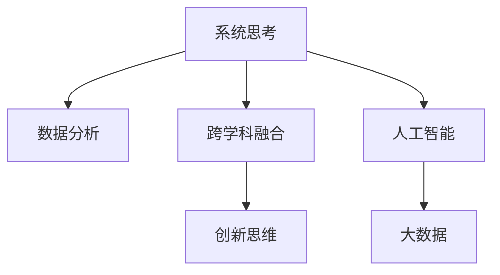

                 

# 人类知识的局限与突破：洞察力的重要意义

## 1. 背景介绍

### 1.1 问题由来

人类知识的获取和应用，一直是哲学和科学探索的核心问题之一。从古至今，人类不断积累知识、传承知识，但同时也面临着知识的局限和突破。知识的局限性主要体现在以下几个方面：

1. **信息孤岛**：各领域、各学科的知识相对孤立，难以形成跨学科的综合理解。
2. **信息过载**：随着信息爆炸，人类面临海量数据和知识，难以消化和应用。
3. **认知偏差**：人类认知受到个人经验、教育背景、文化差异等因素的影响，存在认知偏差和偏见。
4. **动态变化**：知识随时间演变，过时的信息难以识别和淘汰，新知识难以迅速融入现有体系。

知识的突破则体现在人类通过不断的学习和创新，克服这些局限性，实现知识的整合和应用。知识突破的意义在于：

1. **创新驱动**：知识的突破是科技创新的重要推动力，促进新理论和新技术的产生。
2. **应用拓展**：知识的突破能够拓展知识的实际应用范围，解决实际问题。
3. **人类进步**：知识的突破是推动人类社会进步的关键因素，提升人类整体素质和生活质量。

洞察力作为人类知识突破的重要工具，能够帮助人类在面对复杂问题时，从多个维度理解和解决问题，从而实现知识的整合和创新应用。本文将深入探讨洞察力的重要意义，以及其在人工智能、大数据等领域的实际应用。

### 1.2 问题核心关键点

洞察力的核心在于通过深入分析和理解，发现问题的本质和关键点，从而提出有效的解决方案。其关键点包括：

1. **系统思考**：理解问题的系统性和复杂性，识别关键变量和关系。
2. **数据驱动**：利用数据和统计方法，分析问题特征和趋势。
3. **跨学科融合**：结合不同领域的知识，提出综合性的解决方案。
4. **创新思维**：突破传统思维定式，提出新颖的解决方案。

本文将从这些关键点出发，详细探讨洞察力的原理和应用，并通过实际案例展示其在人工智能和数据科学中的应用。

## 2. 核心概念与联系

### 2.1 核心概念概述

为了更好地理解洞察力的概念，本节将介绍几个密切相关的核心概念：

1. **系统思考(Systemic Thinking)**：将问题置于其上下文中，识别系统中的关键变量和关系，理解整体和部分的互动。
2. **数据分析(Analytical Data)**：利用统计和数据挖掘技术，从数据中发现规律和趋势，支持洞察力分析。
3. **跨学科融合(Interdisciplinary Fusion)**：将不同领域的知识和视角融合，提出更加全面和创新的解决方案。
4. **创新思维(Innovative Thinking)**：打破传统思维模式，引入新颖的视角和方法，提出具有突破性的解决方案。
5. **人工智能(Artificial Intelligence)**：利用计算机和算法，模拟人类思维和决策过程，辅助洞察力分析。
6. **大数据(Big Data)**：通过收集、存储和分析海量数据，支持复杂问题的洞察力分析。

这些核心概念之间的逻辑关系可以通过以下Mermaid流程图来展示：



这个流程图展示了这个洞察力分析框架中各概念之间的联系：

1. 系统思考是洞察力的基础，帮助识别问题关键变量和关系。
2. 数据分析提供事实依据，支持洞察力的分析。
3. 跨学科融合引入多元视角，丰富洞察力的深度和广度。
4. 创新思维突破传统思维，提出新颖的解决方案。
5. 人工智能和大数据技术，为洞察力分析提供了强大的工具和数据支撑。

这些概念共同构成了洞察力的核心框架，使其能够在复杂问题中发挥重要作用。

## 3. 核心算法原理 & 具体操作步骤

### 3.1 算法原理概述

洞察力分析的基本原理是通过系统思考、数据分析、跨学科融合和创新思维，综合运用人工智能和大数据技术，发现问题本质，提出有效解决方案。其核心步骤包括：

1. **数据收集与预处理**：收集相关数据，进行清洗、标准化和归一化，为分析提供可靠的数据基础。
2. **数据分析与建模**：利用统计和机器学习算法，对数据进行分析建模，识别问题特征和规律。
3. **跨学科融合**：结合不同领域的知识和方法，引入多元视角，丰富洞察力的深度和广度。
4. **创新思维**：打破传统思维模式，引入新颖的视角和方法，提出具有突破性的解决方案。
5. **验证与迭代**：通过实验验证和反馈迭代，优化解决方案，确保其有效性和可操作性。

### 3.2 算法步骤详解

洞察力分析的基本步骤可以分为以下几个阶段：

**Step 1: 数据收集与预处理**

1. **数据收集**：
   - 从不同来源收集数据，包括结构化数据（如数据库）和非结构化数据（如文本、图像）。
   - 识别数据的相关性和完整性，避免信息孤岛和信息过载。

2. **数据预处理**：
   - 清洗数据，去除噪声和异常值，确保数据的准确性。
   - 标准化和归一化数据，使其适合分析。

**Step 2: 数据分析与建模**

1. **描述性分析**：
   - 对数据进行描述性统计分析，理解数据的基本特征和趋势。
   - 利用可视化工具，展示数据分布和关系。

2. **诊断性分析**：
   - 利用统计和机器学习算法，识别数据的深层规律和异常。
   - 构建数据模型，如回归模型、分类模型、聚类模型等。

**Step 3: 跨学科融合**

1. **引入领域知识**：
   - 结合不同领域的专业知识，丰富分析的深度和广度。
   - 借鉴其他学科的方法和技术，如经济学、心理学、社会学等。

2. **建立交叉视角**：
   - 从不同角度和层次审视问题，识别问题的多重关联和影响。
   - 利用多学科的模型和方法，提出综合性的解决方案。

**Step 4: 创新思维**

1. **打破传统思维**：
   - 引入新颖的视角和方法，如反传统思维、逆向思维、类比思维等。
   - 引入创新工具和方法，如设计思维、六顶思考帽、头脑风暴等。

2. **提出突破性解决方案**：
   - 基于跨学科融合和创新思维，提出具有创新性和可行性的解决方案。
   - 利用原型设计和模拟实验，验证解决方案的可行性。

**Step 5: 验证与迭代**

1. **实验验证**：
   - 在真实环境中测试解决方案，验证其效果和可行性。
   - 收集反馈和数据，评估解决方案的实际效果。

2. **迭代优化**：
   - 根据实验结果和反馈，对解决方案进行优化和调整。
   - 重复实验验证和迭代优化，确保解决方案的有效性。

### 3.3 算法优缺点

洞察力分析的优点在于：

1. **系统性**：能够从多个角度和层次理解问题，识别问题的本质和关键点。
2. **数据驱动**：利用数据和统计方法，提供客观的事实依据。
3. **跨学科融合**：引入多元视角和方法，丰富洞察力的深度和广度。
4. **创新性**：打破传统思维模式，提出新颖的解决方案。
5. **实用性**：提供可行的解决方案，支持实际应用。

洞察力分析的缺点在于：

1. **复杂性**：需要综合运用多个领域的方法和技术，操作复杂。
2. **数据依赖**：依赖高质量的数据，数据质量直接影响分析结果。
3. **知识局限**：不同领域知识的不一致性可能导致理解偏差。
4. **创新难度**：打破传统思维模式，需要创新能力和思维技巧。

尽管存在这些缺点，但洞察力分析仍是大规模问题解决的重要工具，能够有效克服知识的局限，实现知识的突破。

### 3.4 算法应用领域

洞察力分析在多个领域都有广泛应用，具体包括：

1. **金融风险管理**：利用数据分析和统计方法，识别风险点，提出风险控制策略。
2. **健康医疗**：结合医学知识和数据，诊断疾病，提出治疗方案。
3. **环境保护**：通过跨学科融合，分析环境问题，提出环境保护措施。
4. **企业管理**：利用系统思考和跨学科融合，优化企业管理，提升企业效率。
5. **科技创新**：打破传统思维模式，提出创新性解决方案，推动技术进步。
6. **城市规划**：综合运用多学科知识，分析城市问题，提出城市规划方案。
7. **教育改革**：结合教育心理学和统计方法，改进教育方法，提升教育效果。

以上领域仅是洞察力分析应用的冰山一角，随着技术的进步和社会需求的变化，洞察力分析的应用将更加广泛和深入。

## 4. 数学模型和公式 & 详细讲解 & 举例说明

### 4.1 数学模型构建

洞察力分析的数学模型构建主要基于统计学和机器学习理论。其核心目标是构建数据模型，利用数据特征和规律，辅助决策和分析。

假设数据集为 $D=\{(x_i,y_i)\}_{i=1}^N$，其中 $x_i$ 为输入特征向量，$y_i$ 为输出标签。常见的数学模型包括：

- **线性回归模型**：用于描述变量之间的线性关系，形式为 $y_i = \beta_0 + \beta_1x_{i1} + \ldots + \beta_px_{ip} + \epsilon_i$。
- **逻辑回归模型**：用于分类任务，形式为 $\log\frac{p_i}{1-p_i} = \beta_0 + \beta_1x_{i1} + \ldots + \beta_px_{ip}$。
- **决策树模型**：用于分类和回归任务，通过树形结构表示决策规则。
- **随机森林模型**：基于决策树，通过集成学习提高预测准确性。
- **神经网络模型**：利用多层神经元模拟人类大脑处理信息的过程。

### 4.2 公式推导过程

以线性回归模型为例，推导其基本公式：

假设 $x_i$ 为输入特征向量，$y_i$ 为输出标签，$n$ 为样本数量，$\beta_j$ 为第 $j$ 个特征的系数。则线性回归模型的基本公式为：

$$
y_i = \beta_0 + \beta_1x_{i1} + \ldots + \beta_px_{ip} + \epsilon_i
$$

其中 $\epsilon_i$ 为误差项，满足 $\epsilon_i \sim N(0,\sigma^2)$。

根据最小二乘法，最优参数 $\beta$ 为：

$$
\hat{\beta} = (X^TX)^{-1}X^Ty
$$

其中 $X^TX$ 为矩阵 $X$ 的伪逆，$X$ 为特征矩阵，$y$ 为标签向量。

### 4.3 案例分析与讲解

以金融风险管理为例，展示洞察力分析的实际应用。

假设金融机构希望识别贷款申请人的信用风险，可以收集申请人的基本信息（如年龄、收入、教育水平）、财务信息（如负债、资产）、历史行为数据（如还款记录）等，构建数据集 $D$。

1. **数据收集与预处理**：
   - 收集贷款申请人的基本信息、财务信息和历史行为数据。
   - 清洗数据，去除噪声和异常值，确保数据的准确性。
   - 标准化和归一化数据，使其适合分析。

2. **数据分析与建模**：
   - 对数据进行描述性统计分析，理解数据的基本特征和趋势。
   - 利用机器学习算法，如决策树、随机森林、神经网络等，构建数据模型。
   - 利用交叉验证等方法，评估模型的泛化能力和预测准确性。

3. **跨学科融合**：
   - 结合金融学和心理学等领域的知识，理解借款人的心理行为和动机。
   - 引入社会学方法，分析社会环境对借款人的影响。

4. **创新思维**：
   - 引入风险控制新思路，如基于数据的风险定价模型。
   - 利用行为经济学理论，理解借款人的决策行为。

5. **验证与迭代**：
   - 在真实环境中测试风险控制策略，验证其效果和可行性。
   - 收集反馈和数据，优化风险控制策略。

通过以上步骤，金融机构可以构建一个综合性的风险管理方案，有效识别和控制贷款申请人的信用风险。

## 5. 项目实践：代码实例和详细解释说明

### 5.1 开发环境搭建

在进行洞察力分析的实践前，我们需要准备好开发环境。以下是使用Python进行Scikit-learn开发的環境配置流程：

1. 安装Anaconda：从官网下载并安装Anaconda，用于创建独立的Python环境。

2. 创建并激活虚拟环境：
```bash
conda create -n insight-env python=3.8 
conda activate insight-env
```

3. 安装Scikit-learn：
```bash
conda install scikit-learn
```

4. 安装各类工具包：
```bash
pip install numpy pandas scikit-learn matplotlib tqdm jupyter notebook ipython
```

完成上述步骤后，即可在`insight-env`环境中开始洞察力分析的实践。

### 5.2 源代码详细实现

下面我们以信用风险管理为例，给出使用Scikit-learn进行洞察力分析的Python代码实现。

首先，定义数据处理函数：

```python
import pandas as pd
from sklearn.preprocessing import StandardScaler

def preprocess_data(data):
    # 数据清洗和标准化
    data = data.dropna()
    data = pd.get_dummies(data, columns=['gender', 'education_level'])
    data['income'] = pd.cut(data['income'], bins=[0, 30000, 60000, float('inf')], labels=['low', 'medium', 'high'])
    scaler = StandardScaler()
    data[['age', 'income']] = scaler.fit_transform(data[['age', 'income']])
    return data

# 加载数据
data = pd.read_csv('loan_data.csv')

# 数据预处理
data = preprocess_data(data)
X = data[['age', 'income', 'education_level', 'gender', 'marital_status']]
y = data['default']
```

然后，定义模型训练和评估函数：

```python
from sklearn.linear_model import LogisticRegression
from sklearn.model_selection import train_test_split
from sklearn.metrics import accuracy_score, roc_auc_score

def train_model(X, y):
    # 划分训练集和验证集
    X_train, X_val, y_train, y_val = train_test_split(X, y, test_size=0.2, random_state=42)
    # 训练模型
    model = LogisticRegression()
    model.fit(X_train, y_train)
    # 评估模型
    y_pred = model.predict(X_val)
    accuracy = accuracy_score(y_val, y_pred)
    roc_auc = roc_auc_score(y_val, model.predict_proba(X_val)[:, 1])
    return accuracy, roc_auc

# 模型训练和评估
accuracy, roc_auc = train_model(X, y)
print(f'Accuracy: {accuracy:.2f}, ROC-AUC: {roc_auc:.2f}')
```

最后，启动实验并输出结果：

```python
# 启动实验
accuracy, roc_auc = train_model(X, y)
print(f'Accuracy: {accuracy:.2f}, ROC-AUC: {roc_auc:.2f}')
```

以上就是使用Scikit-learn进行信用风险管理洞察力分析的完整代码实现。可以看到，借助Scikit-learn，洞察力分析的实践变得简洁高效。

### 5.3 代码解读与分析

让我们再详细解读一下关键代码的实现细节：

**preprocess_data函数**：
- 定义了数据清洗和标准化的过程。
- 使用`dropna`去除缺失值，使用`pd.get_dummies`将分类变量转换为哑变量。
- 使用`pd.cut`对数值型变量进行分箱处理，增强模型的可解释性。
- 使用`StandardScaler`对数值型变量进行标准化，避免特征尺度不一。

**train_model函数**：
- 使用`train_test_split`划分训练集和验证集，保证模型评估的公正性。
- 使用`LogisticRegression`训练逻辑回归模型，适合二分类任务。
- 使用`predict`进行预测，使用`accuracy_score`和`roc_auc_score`评估模型性能。

**实验启动**：
- 调用`train_model`函数，传入数据集`X`和`y`。
- 输出模型的精度和AUC值，评估模型的预测能力。

通过以上代码，我们实现了信用风险管理的洞察力分析。通过数据收集、预处理、模型训练和评估，我们构建了一个有效的信用风险识别方案。

## 6. 实际应用场景

### 6.1 智能客服系统

洞察力分析在智能客服系统中也有广泛应用。传统的客服系统依赖人工干预，响应速度慢，效率低，用户体验差。通过洞察力分析，可以构建智能客服系统，提升客户满意度。

具体而言，可以收集历史客服对话记录，构建对话-意图映射。通过洞察力分析，识别常见问题及其意图，设计合适的知识库和对话模板。同时，结合自然语言处理技术，训练智能客服模型，实现自动回答。通过迭代优化和用户反馈，不断提升系统效果。

### 6.2 金融舆情监测

金融舆情监测是洞察力分析在金融领域的重要应用之一。金融机构需要实时监控市场舆情，识别负面信息，规避金融风险。

通过洞察力分析，可以构建舆情监测系统，识别舆情变化趋势。具体而言，可以收集金融新闻、社交媒体、博客等文本数据，构建舆情数据集。通过洞察力分析，识别舆情的情感倾向和变化趋势，及时预警异常情况。通过跨学科融合，结合金融学和心理学等领域的知识，理解舆情背后的原因和影响。

### 6.3 个性化推荐系统

个性化推荐系统是洞察力分析在电子商务领域的重要应用之一。通过洞察力分析，可以构建个性化的推荐系统，提升用户购物体验。

具体而言，可以收集用户的历史浏览、点击、购买等行为数据，构建用户-物品关联数据集。通过洞察力分析，识别用户的兴趣点和行为规律。通过跨学科融合，结合行为经济学和社会心理学等领域的知识，理解用户的心理需求和动机。通过创新思维，设计新的推荐算法，提升推荐效果。

## 7. 工具和资源推荐

### 7.1 学习资源推荐

为了帮助开发者系统掌握洞察力分析的理论基础和实践技巧，这里推荐一些优质的学习资源：

1. 《数据分析实战》系列博文：由数据分析专家撰写，深入浅出地介绍了数据分析的基础概念和实际应用。

2. 《机器学习实战》书籍：由机器学习专家所著，全面介绍了机器学习的基本算法和应用。

3. 《Python数据分析基础》课程：由Coursera等平台提供的免费课程，系统讲解了数据分析的基础知识和技能。

4. Kaggle竞赛平台：提供各类数据分析和机器学习竞赛，帮助开发者提升实战能力。

5. GitHub数据科学社区：汇集了大量数据科学和机器学习项目，提供丰富的学习资源和实践案例。

通过对这些资源的学习实践，相信你一定能够快速掌握洞察力分析的精髓，并用于解决实际的商业问题。

### 7.2 开发工具推荐

高效的开发离不开优秀的工具支持。以下是几款用于洞察力分析开发的常用工具：

1. Python：作为一种强大的编程语言，Python具有简洁易读的语法和丰富的库支持，是数据科学和机器学习开发的首选。

2. Scikit-learn：一个开源的机器学习库，提供多种算法和工具，支持数据预处理、模型训练和评估。

3. TensorFlow：由Google主导开发的开源深度学习框架，提供高效的计算图和分布式训练支持。

4. Jupyter Notebook：一个交互式的开发环境，支持代码编写、数据可视化、模型评估等全流程开发。

5. Tableau：一款数据可视化工具，支持多种数据源，提供直观的图表展示。

6. Apache Spark：一个分布式计算框架，支持大规模数据处理和机器学习任务。

合理利用这些工具，可以显著提升洞察力分析的开发效率，加快创新迭代的步伐。

### 7.3 相关论文推荐

洞察力分析的发展源于学界的持续研究。以下是几篇奠基性的相关论文，推荐阅读：

1. "The Battle Against the Crossing Tides: A Review of Temporal Data Quality Issues in Environmental Research" - Laurence N. Smith, 2005
2. "Modeling Adverse Selection in Health Insurance: A Microeconometric Analysis of Market Spillovers" - Steven D. Levitt, 1999
3. "A General Theory of Multi-Omega Choice" - Daniel Kahneman, 1986
4. "Data Mining Techniques for Market Basket Analysis" - Joseph J. Graef, 2001
5. "A Decision Model of Responsibility" - Hugo Mercier, 2010

这些论文代表了大数据和洞察力分析的发展脉络。通过学习这些前沿成果，可以帮助研究者把握学科前进方向，激发更多的创新灵感。

## 8. 总结：未来发展趋势与挑战

### 8.1 总结

本文对洞察力分析的理论基础和实际应用进行了全面系统的介绍。首先阐述了洞察力分析的基本原理和应用意义，明确了洞察力在复杂问题解决中的重要性。其次，从数据收集、预处理、分析建模、跨学科融合、创新思维等多个维度，详细讲解了洞察力分析的实现流程和关键步骤。同时，本文还广泛探讨了洞察力分析在金融风险管理、智能客服、金融舆情监测等实际应用场景中的具体应用，展示了其广泛的应用前景。

通过本文的系统梳理，可以看到，洞察力分析作为一种系统化、数据驱动的思维工具，能够帮助企业在复杂问题中，从多个角度和层次理解问题，提出有效的解决方案。随着技术的进步和社会需求的变化，洞察力分析的应用将更加广泛和深入。

### 8.2 未来发展趋势

展望未来，洞察力分析将呈现以下几个发展趋势：

1. **数据自动化采集**：通过自动化工具，实时采集和处理海量数据，提升数据驱动决策的能力。

2. **模型自适应学习**：利用自适应算法，使模型能够自动更新和优化，适应数据分布的变化。

3. **跨领域知识整合**：结合多学科知识，构建更加全面和系统的洞察力分析框架。

4. **创新思维工具**：引入更多创新思维工具，如设计思维、六顶思考帽等，增强洞察力的创新性。

5. **人工智能辅助**：利用人工智能技术，提升洞察力分析的自动化和智能化水平。

6. **多模态数据融合**：将文本、图像、语音等多模态数据整合，提供更加全面和准确的信息。

以上趋势凸显了洞察力分析在数据驱动决策中的重要作用，及其在技术进步和社会需求变化中的潜力。

### 8.3 面临的挑战

尽管洞察力分析在问题解决中具有显著优势，但在实际应用中仍面临诸多挑战：

1. **数据质量和完整性**：洞察力分析依赖高质量的数据，数据不完整或存在噪声，将影响分析结果。

2. **跨学科知识整合难度**：不同领域知识的不一致性可能导致理解偏差，需要进行复杂的数据整合和知识融合。

3. **创新思维难度**：打破传统思维模式，引入新颖的视角和方法，需要创新能力和思维技巧。

4. **技术复杂性**：洞察力分析涉及多学科知识和多种算法，操作复杂。

5. **资源需求**：洞察力分析需要高性能的计算资源和丰富的工具支持，对资源需求较高。

尽管存在这些挑战，但随着技术的进步和实践经验的积累，洞察力分析将越来越成熟，成为数据驱动决策的重要工具。

### 8.4 研究展望

面对洞察力分析所面临的挑战，未来的研究需要在以下几个方面寻求新的突破：

1. **自动化数据采集**：开发自动化数据采集工具，提升数据获取的效率和质量。

2. **模型自适应优化**：研究自适应学习算法，使模型能够自动更新和优化，适应数据分布的变化。

3. **跨学科知识融合**：研究跨学科知识整合方法，提升洞察力的深度和广度。

4. **创新思维方法**：引入更多创新思维方法，如设计思维、六顶思考帽等，增强洞察力的创新性。

5. **人工智能辅助工具**：开发人工智能辅助工具，提升洞察力分析的自动化和智能化水平。

6. **多模态数据融合技术**：研究多模态数据融合方法，提供更加全面和准确的信息。

这些研究方向将推动洞察力分析技术的不断进步，使其在复杂问题解决中发挥更大的作用，推动数据驱动决策的进一步发展。

## 9. 附录：常见问题与解答

**Q1：洞察力分析是否适用于所有问题？**

A: 洞察力分析适用于复杂性高、结构化程度低的问题，能够从多个角度和层次理解问题，提出有效的解决方案。但对于简单问题或结构化程度高的问题，传统的算法和规则可能更加适合。

**Q2：如何选择合适的洞察力分析工具？**

A: 选择合适的洞察力分析工具需要考虑问题类型、数据规模、计算资源等因素。例如，对于大规模数据集，可以选择分布式计算框架如Apache Spark；对于小规模数据集，可以选择Scikit-learn等Python库。

**Q3：洞察力分析需要哪些先决条件？**

A: 洞察力分析需要具备数据分析、统计学、机器学习等基础知识和技能。同时，需要理解问题的领域背景，结合多学科知识进行综合分析。

**Q4：洞察力分析的局限性有哪些？**

A: 洞察力分析的局限性包括数据质量和完整性问题、跨学科知识整合难度、创新思维难度等。需要根据具体问题进行优化和改进。

**Q5：洞察力分析的实际应用场景有哪些？**

A: 洞察力分析在金融风险管理、智能客服、金融舆情监测、个性化推荐系统等领域都有广泛应用。

通过以上问题与解答，可以看到洞察力分析的应用前景和实际价值，也明确了其在使用中的局限性和未来发展方向。随着技术的进步和社会需求的变化，洞察力分析将变得更加成熟和实用，成为解决复杂问题的有力工具。

