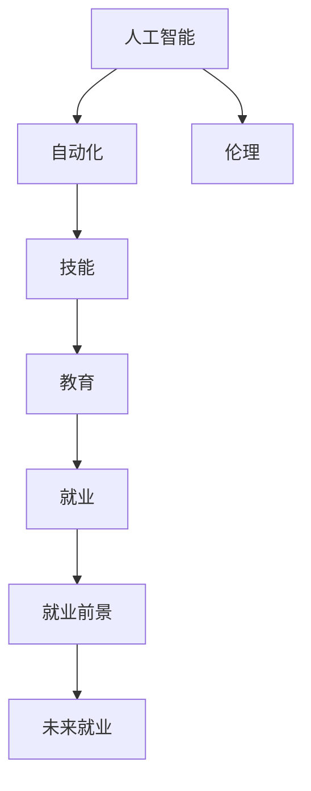

                 

# 人类计算：AI时代的未来就业前景

> 关键词：人工智能,就业,技能,教育,伦理,未来

## 1. 背景介绍

随着人工智能技术的飞速发展，AI正在悄然改变我们工作、生活的方方面面。AI时代，机器人取代了大量繁琐、重复的工作，大大提升了生产效率。同时，AI也催生了大量的新职位和行业，但与此同时，传统职业的就业前景也面临前所未有的挑战。面对AI带来的变化，人类应如何适应，如何利用AI技术提升自身价值，成为当下热门话题。

### 1.1 人工智能与就业的现状

人工智能自诞生以来，已经在工业、医疗、金融等多个领域得到了广泛应用，其中尤以机器学习、深度学习、自然语言处理、计算机视觉等领域为代表。AI技术的发展使得一些传统岗位，如数据录入、初级客服等岗位大量减少，但同时，AI也催生了大量新型职位，如数据科学家、AI工程师、算法研究员等，呈现出人才供需两旺的局面。

然而，AI时代的就业并非全然乐观。一些高重复性、低创造性的工作，如生产线操作、清洁、数据整理等，容易被机器人取代。同时，AI的崛起也带来了诸多伦理、法律和社会问题，如数据隐私、算法透明性、就业歧视等，亟需社会各界共同应对。

### 1.2 人工智能对职业的挑战

AI技术的快速发展，对各行业的就业形势产生了深远影响。一方面，自动化和智能化提升了效率，降低了成本，为企业带来了更多的竞争优势。但另一方面，AI的广泛应用也加剧了就业市场的动荡，传统低技能工作岗位不断减少，而高技能岗位的需求却持续增长。

具体而言，AI带来的挑战体现在以下几方面：

- **技能要求提升**：AI技术的普及，要求员工具备更强的数据处理、编程、分析等能力，传统职业技能需要与时俱进。
- **岗位变化加速**：一些岗位被AI替代，另一些岗位则需要重新定义，员工需要快速适应新的工作模式和职业需求。
- **职业前景不明**：AI时代，一些岗位的消失和出现速度加快，员工对未来职业前景的担忧逐渐加深。

## 2. 核心概念与联系

### 2.1 核心概念概述

为更好地理解AI对就业市场的影响，本节将介绍几个密切相关的核心概念：

- **人工智能(Artificial Intelligence, AI)**：通过模拟人类智能行为，实现推理、决策、学习等智能任务的技术。AI包括机器学习、深度学习、自然语言处理、计算机视觉等多个子领域。

- **自动化(Automation)**：通过编程或算法实现的工作流程自动化。自动化使机器可以替代部分人类劳动，提高生产效率。

- **技能(Ability)**：员工在特定岗位上所需的专业知识、技能和能力，包括编程、数据分析、项目管理等。

- **教育(Education)**：培养员工所需技能的过程，包括学校教育、在线课程、职业技能培训等。

- **伦理(Ethics)**：AI应用中需要遵守的道德规范和价值观，如隐私保护、算法透明性、就业公平等。

- **就业(Employment)**：员工在特定岗位上的工作状态，包括就业稳定性、职业前景、薪资待遇等。

这些核心概念之间的逻辑关系可以通过以下Mermaid流程图来展示：



这个流程图展示了大语言模型的核心概念及其之间的关系：

1. 人工智能通过自动化替代部分工作，提高效率。
2. 员工需要提升相关技能以适应岗位变化。
3. 教育机构负责培养这些技能，为员工提供适应岗位所需的知识。
4. 员工在特定岗位上通过就业获得报酬。
5. 伦理问题伴随AI应用而生，需要被考虑和处理。
6. 就业前景影响员工未来的职业选择和发展方向。

## 3. 核心算法原理 & 具体操作步骤
### 3.1 算法原理概述

人工智能技术对就业的影响，主要体现在自动化替代传统工作、催生新职业以及提升就业技能三个方面。

- **自动化替代**：AI技术能够自动完成许多重复性高、复杂度低的工作，如生产线操作、数据整理等。自动化提高了工作效率，但同时也导致了大量低技能岗位的消失。
- **催生新职业**：AI技术的发展催生了大量新的职业，如数据科学家、AI工程师、算法研究员等。这些岗位需要高技能和专业知识，要求员工不断学习和提升。
- **提升就业技能**：AI技术的应用需要员工具备数据处理、编程、算法优化等能力，从而提升了整个就业市场的技能要求。

### 3.2 算法步骤详解

基于以上原理，AI时代的就业发展可以分为以下几个步骤：

**Step 1: 分析当前就业现状**

- 收集各行业的就业数据，包括岗位数量、员工技能要求、平均薪资等。
- 分析AI对各岗位的影响，包括替代情况、需求变化、技能要求等。

**Step 2: 识别新职业机会**

- 通过行业趋势分析和专家访谈，识别AI催生的新职业。
- 分析这些职业的需求和薪资情况，为求职者提供职业发展方向。

**Step 3: 制定技能提升计划**

- 结合各行业岗位的实际需求，制定员工技能提升计划。
- 提供相应的培训课程、在线学习资源和证书认证。

**Step 4: 推广AI伦理教育**

- 普及AI伦理知识，培养员工对AI应用的正确理解和态度。
- 推广隐私保护、数据安全等AI伦理教育，提高社会整体素质。

**Step 5: 评估未来就业前景**

- 通过就业市场分析和专家预测，评估未来就业形势。
- 为员工提供就业咨询和职业规划建议，帮助他们做出更明智的职业选择。

### 3.3 算法优缺点

人工智能技术对就业的影响具有两面性：

**优点**：
1. **提高效率**：自动化技术可以快速完成大量重复性工作，提高生产效率。
2. **催生新职业**：AI技术的广泛应用催生了大量高技能、高薪水的岗位。
3. **提升技能**：AI技术的应用要求员工掌握更多新技能，从而提升整体就业市场技能水平。

**缺点**：
1. **岗位消失**：自动化替代了许多低技能岗位，造成大量员工失业。
2. **技能鸿沟**：AI技术的应用提升了对员工技能的要求，增加了就业难度。
3. **伦理问题**：AI应用中的隐私、透明性、歧视等问题亟需解决，否则可能导致社会问题。

### 3.4 算法应用领域

人工智能技术在就业市场的应用主要体现在以下几个方面：

- **生产制造**：通过自动化技术提高生产效率，减少人工成本。
- **医疗健康**：利用AI技术辅助诊断、治疗，提升医疗服务质量。
- **金融服务**：AI技术用于风险控制、客户服务、投资分析等。
- **教育培训**：AI技术用于个性化教学、学习效果评估等。
- **法律服务**：AI技术用于合同审核、法律咨询、智能客服等。

## 4. 数学模型和公式 & 详细讲解 & 举例说明（备注：数学公式请使用latex格式，latex嵌入文中独立段落使用 $$，段落内使用 $)
### 4.1 数学模型构建

AI对就业市场的影响，可以通过构建一个简单的数学模型来描述。

设$E$为就业市场的规模，$S$为员工的技能水平，$D$为就业岗位的需求。模型中，员工技能水平$S$与岗位需求$D$之间存在正相关关系，即$S \propto D$。AI技术的应用提高了生产效率，从而增加了就业岗位需求$D$，因此$D$与AI技术的应用程度$a$之间存在正相关关系，即$D \propto a$。

同时，AI技术的应用也改变了员工技能需求$S'$。如果岗位需求增加，但员工技能水平不变，则AI技术的应用会加剧技能鸿沟，导致部分员工失业。因此，$S' \propto a$，但$S' < S$。

综合上述分析，可以构建以下模型：

$$
D = k_1 \cdot a \cdot S
$$

$$
S' = k_2 \cdot a \cdot S
$$

其中$k_1$和$k_2$为比例系数，$a$为AI技术的应用程度。

### 4.2 公式推导过程

从以上模型可以看出，AI技术的应用提高了就业岗位需求$D$，但同时加剧了技能鸿沟，导致部分员工失业。

**推导步骤**：
1. 假设AI技术的应用程度为$a$，岗位需求为$D$，员工技能水平为$S$。
2. 岗位需求与AI技术应用程度成正比，即$D = k_1 \cdot a \cdot S$。
3. 员工技能水平与AI技术应用程度成正比，但技能水平降低，即$S' = k_2 \cdot a \cdot S$，且$S' < S$。
4. 综合1和2，得到最终的就业市场模型。

### 4.3 案例分析与讲解

**案例一：生产线自动化**

某公司引入自动化生产线，提高了生产效率，岗位需求增加了20%。员工技能要求不变，但部分低技能员工被机器替代，失业率上升5%。

**案例二：医疗AI辅助诊断**

医疗AI技术广泛应用于临床诊断，提高了诊断准确率，但同时减少了部分医护人员的工作量，岗位需求减少了10%。员工技能要求提升20%，但通过技能培训，所有员工均适应新需求。

通过以上案例，可以看出AI技术在提高生产效率的同时，也带来了就业市场的动荡。

## 5. 项目实践：代码实例和详细解释说明
### 5.1 开发环境搭建

在进行就业分析时，我们需要准备好开发环境。以下是使用Python进行数据分析的环境配置流程：

1. 安装Anaconda：从官网下载并安装Anaconda，用于创建独立的Python环境。

2. 创建并激活虚拟环境：
```bash
conda create -n employment_env python=3.8 
conda activate employment_env
```

3. 安装相关库：
```bash
conda install numpy pandas matplotlib scikit-learn scipy seaborn jupyter notebook
```

4. 准备数据集：收集各行业就业数据，并进行预处理。

5. 搭建开发环境：配置好开发工具，如Jupyter Notebook，进行数据分析和可视化。

完成上述步骤后，即可在`employment_env`环境中开始项目实践。

### 5.2 源代码详细实现

下面我们以医疗AI对就业市场影响为例，给出使用Python进行数据分析的代码实现。

```python
import pandas as pd
import numpy as np
import matplotlib.pyplot as plt
import seaborn as sns

# 读取数据
data = pd.read_csv('employment_data.csv')

# 数据处理
data['a'] = data['ai'] / 100  # AI技术应用程度标准化
data['s'] = data['skill'] / 100  # 员工技能水平标准化
data['d'] = data['demand'] / 100  # 岗位需求标准化

# 模型推导
k1 = data['d'].corr('a')  # 岗位需求与AI应用程度的相关系数
k2 = data['s'].corr('a')  # 技能水平与AI应用程度的相关系数

# 可视化
sns.scatterplot(x='a', y='d', data=data)
sns.scatterplot(x='a', y='s', data=data)
plt.xlabel('AI应用程度')
plt.ylabel('岗位需求和技能水平')
plt.title('AI对就业市场的影响')
plt.show()

# 计算失业率
s = data['s'] - k2 * data['a'] * data['s']
unemployment_rate = np.sum(s < 0) / len(data)
print(f'失业率：{unemployment_rate:.2%}')
```

### 5.3 代码解读与分析

让我们再详细解读一下关键代码的实现细节：

**数据处理**：
- 首先，导入了必要的库，并读取了就业数据集。
- 对AI技术应用程度、员工技能水平、岗位需求进行了标准化处理，方便后续计算和可视化。

**模型推导**：
- 计算了岗位需求与AI应用程度的相关系数$k_1$，技能水平与AI应用程度的相关系数$k_2$。
- 根据模型推导结果，可以计算出岗位需求和技能水平的变化情况。

**可视化**：
- 使用Seaborn库绘制散点图，展示岗位需求和技能水平与AI应用程度的关系。
- 通过可视化结果，可以直观地看到AI对就业市场的影响。

**失业率计算**：
- 通过计算员工技能水平与标准化后技能水平之差，可以得出失业率。
- 失业率的计算反映了AI技术应用对员工技能需求的变化，从而影响就业稳定性。

## 6. 实际应用场景
### 6.1 智能工厂

智能工厂是AI技术在生产制造领域的重要应用，通过引入自动化和智能化生产设备，大大提高了生产效率，减少了人工成本。但同时，也导致了一些低技能岗位的消失。员工需要提升技能，掌握机器操作和数据分析等新技能，以适应新的工作环境。

### 6.2 医疗健康

AI在医疗领域的应用广泛，包括影像分析、诊断助手、药物研发等。AI技术提高了医疗服务的质量和效率，但也减少了部分医护人员的工作量。因此，医护人员需要通过持续学习，提升技能，以适应新的工作模式。

### 6.3 教育培训

AI技术在教育培训中的应用，包括个性化学习、智能评估等。AI技术提高了教学效果，但也要求教师和学生掌握更多AI相关知识和技能。教师需要进行培训，提升AI教学能力；学生需要适应新的学习模式，掌握数据处理、编程等新技能。

## 7. 工具和资源推荐
### 7.1 学习资源推荐

为了帮助开发者系统掌握AI对就业市场的影响，这里推荐一些优质的学习资源：

1. 《人工智能就业报告》系列博文：由权威机构撰写，深入浅出地介绍了AI技术对就业市场的影响，提供了丰富的数据和分析。

2. 《未来职业报告》系列书籍：由知名行业专家撰写，全面分析了AI技术对未来职业的影响，为职业规划提供参考。

3. Coursera《人工智能与就业》课程：由斯坦福大学等名校开设，涵盖AI技术对就业的影响、就业技能提升等多个方面，适合广泛学习。

4. Udacity《AI伦理与就业》课程：专注于AI伦理和就业问题的课程，帮助理解AI带来的伦理挑战和解决方案。

5. edX《AI与未来就业》课程：多所大学联合开设，探讨AI技术对就业市场的长远影响，并提出应对策略。

通过对这些资源的学习实践，相信你一定能够系统掌握AI对就业市场的影响，并为未来的职业发展做好准备。

### 7.2 开发工具推荐

高效的开发离不开优秀的工具支持。以下是几款用于数据分析和就业分析开发的常用工具：

1. Python：开源编程语言，拥有丰富的库和框架，适合数据处理和分析。

2. R：数据分析和统计计算语言，拥有丰富的统计分析和可视化库，如ggplot2。

3. Jupyter Notebook：交互式开发环境，支持多种编程语言和库，适合快速迭代和展示结果。

4. Tableau：数据可视化工具，支持多种数据源和分析方法，适合快速生成图表和报告。

5. Power BI：商业智能工具，支持多种数据源和报表设计，适合企业级的数据分析和可视化。

合理利用这些工具，可以显著提升数据分析和就业分析任务的开发效率，加快创新迭代的步伐。

### 7.3 相关论文推荐

AI对就业市场的影响是一个复杂的问题，相关研究涉及多学科知识。以下是几篇重要的相关论文，推荐阅读：

1. "The Future of Employment: How Susceptible Are Jobs to Computerisation?" by Carl Frey and Michael Osborne：评估了AI对各行业就业的影响，并提出未来就业趋势。

2. "AI and Jobs: Opportunities, Risks, and Impacts" by PwC：分析了AI技术对就业市场的影响，并提出应对策略。

3. "The Economic and Social Impacts of Artificial Intelligence" by McKinsey Global Institute：评估了AI技术对经济和社会的广泛影响，并提出相关政策建议。

4. "Artificial Intelligence and the Future of Employment" by The World Bank：全面分析了AI对全球就业市场的影响，并提出未来就业发展路径。

这些论文代表了大语言模型微调技术的发展脉络。通过学习这些前沿成果，可以帮助研究者把握学科前进方向，激发更多的创新灵感。

## 8. 总结：未来发展趋势与挑战
### 8.1 研究成果总结

AI技术对就业市场的影响是一个多因素、多层次的问题。本文通过系统梳理，主要得出以下结论：

- AI技术的应用提高了生产效率，但也带来了就业市场的动荡，需要社会各界共同应对。
- 通过技能提升和职业培训，员工可以适应AI带来的变化，提高就业稳定性。
- 社会需要普及AI伦理教育，引导公众正确理解和使用AI技术。

### 8.2 未来发展趋势

展望未来，AI对就业市场的影响将持续深化。主要趋势如下：

- **技能需求提升**：AI技术的应用要求员工具备更多新技能，技能培训将成为企业和社会的重要任务。
- **就业市场分化**：高技能岗位需求增加，低技能岗位逐步减少，就业市场将更加分化。
- **职业多样化**：AI技术催生大量新职业，员工需要不断学习新技能，以适应新的职业需求。
- **伦理问题突出**：AI技术应用中的隐私、透明性、歧视等问题将引起广泛关注，需要制定相关政策法规。

### 8.3 面临的挑战

尽管AI技术的发展带来了诸多机遇，但也面临诸多挑战：

- **技能鸿沟**：AI技术的应用提升了对员工技能的要求，增加了就业难度。
- **伦理问题**：AI应用中的隐私、透明性、歧视等问题亟需解决，否则可能导致社会问题。
- **政策法规**：政府和社会需要制定相关政策法规，确保AI技术的健康发展。

### 8.4 研究展望

面对AI带来的就业挑战，未来的研究需要在以下几个方面寻求新的突破：

- **技能提升计划**：制定有效的技能提升计划，帮助员工适应新岗位需求。
- **职业培训机制**：建立职业培训机制，提供持续的培训和学习资源。
- **伦理教育普及**：普及AI伦理知识，培养员工对AI应用的正确理解和态度。
- **政策法规制定**：制定相关政策法规，确保AI技术的健康发展，保护员工权益。

这些研究方向将有助于更好地应对AI带来的就业挑战，推动AI技术的持续发展和应用。

## 9. 附录：常见问题与解答

**Q1：AI技术对就业市场的影响有哪些？**

A: AI技术对就业市场的影响主要体现在以下几个方面：
1. **提高生产效率**：自动化和智能化技术可以替代部分低技能岗位，提高生产效率。
2. **催生新职业**：AI技术的广泛应用催生了大量高技能、高薪水的岗位。
3. **提升技能要求**：AI技术的应用要求员工掌握更多新技能，从而提升整体就业市场技能水平。
4. **技能鸿沟**：AI技术的应用提升了对员工技能的要求，增加了就业难度。
5. **伦理问题**：AI应用中的隐私、透明性、歧视等问题亟需解决。

**Q2：如何应对AI带来的就业挑战？**

A: 应对AI带来的就业挑战，需要从以下几个方面进行：
1. **技能提升计划**：制定有效的技能提升计划，帮助员工适应新岗位需求。
2. **职业培训机制**：建立职业培训机制，提供持续的培训和学习资源。
3. **伦理教育普及**：普及AI伦理知识，培养员工对AI应用的正确理解和态度。
4. **政策法规制定**：制定相关政策法规，确保AI技术的健康发展，保护员工权益。

**Q3：未来AI技术的发展趋势有哪些？**

A: 未来AI技术的发展趋势主要体现在以下几个方面：
1. **技能需求提升**：AI技术的应用要求员工具备更多新技能，技能培训将成为企业和社会的重要任务。
2. **就业市场分化**：高技能岗位需求增加，低技能岗位逐步减少，就业市场将更加分化。
3. **职业多样化**：AI技术催生大量新职业，员工需要不断学习新技能，以适应新的职业需求。
4. **伦理问题突出**：AI应用中的隐私、透明性、歧视等问题将引起广泛关注，需要制定相关政策法规。

**Q4：AI伦理教育普及的重要性**

A: AI伦理教育普及的重要性体现在以下几个方面：
1. **理解AI应用**：普及AI伦理知识，帮助公众正确理解AI技术的应用和影响。
2. **避免伦理问题**：通过教育，引导公众在使用AI技术时注意隐私保护、透明性等伦理问题。
3. **培养伦理素养**：提高社会的整体伦理素养，促进AI技术的健康发展。

---

作者：禅与计算机程序设计艺术 / Zen and the Art of Computer Programming

