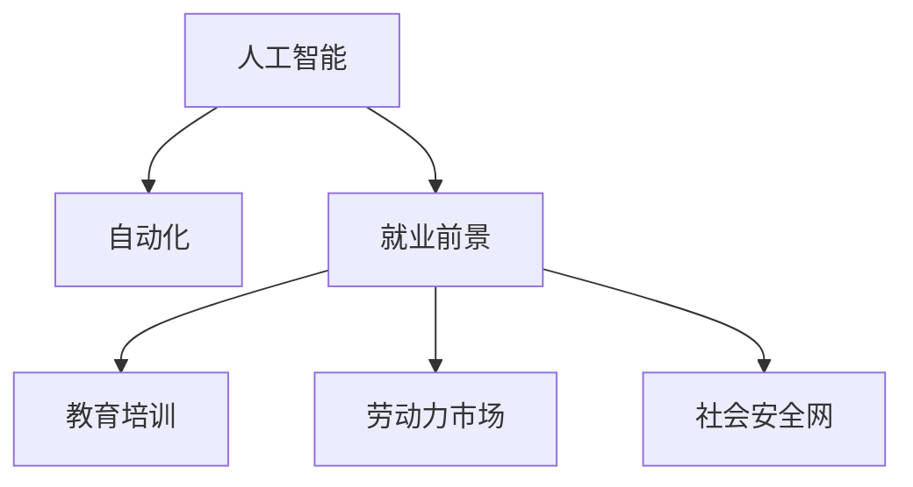

                 

# 人类计算：AI时代的未来就业前景预测

> 关键词：人工智能,自动化,就业,未来工作,技术变革,教育,再培训

## 1. 背景介绍

### 1.1 问题由来
随着人工智能(AI)技术的飞速发展，自动化和智能化的浪潮正在迅速席卷各行各业。从制造业到服务业，从医疗到教育，AI正在重塑就业格局，带来前所未有的变革。然而，随着AI技术的普及，也引发了广泛的社会担忧：机器能否完全替代人类？AI时代的就业前景将如何？本文旨在探讨这些关键问题，为政策制定者和从业者提供一些思考和建议。

### 1.2 问题核心关键点
未来就业前景预测的核心问题包括：
- AI技术的自动化和智能化将如何影响各行各业的工作？
- 哪些行业和岗位最有可能被机器替代？
- 哪些技能和岗位需要持续提升或转型？
- 如何通过教育和培训，适应AI时代的就业需求？

这些问题不仅涉及技术细节，还涉及到经济、社会、政策等诸多维度，需要通过多学科的视角进行综合分析和研究。

### 1.3 问题研究意义
研究AI时代的就业前景，对于指导教育政策、促进就业市场转型、保护劳动者权益具有重要意义：

1. 指导教育政策：了解AI对就业市场的影响，有助于制定更加科学合理的教育规划，避免教育资源浪费和教育目标错位。
2. 促进就业市场转型：通过再培训和转岗培训，使劳动力市场适应新技术，实现结构性就业稳定。
3. 保护劳动者权益：了解AI带来的就业风险，采取适当措施保障劳动者就业机会和生活水平，避免社会不稳定。

## 2. 核心概念与联系

### 2.1 核心概念概述

为更好地理解AI时代就业前景，本文将介绍几个关键概念：

- 人工智能(AI)：通过模拟人类智能行为，实现感知、学习、推理等能力的技术系统。
- 自动化：通过机器代替人工执行重复性、低技能的任务，提高生产效率。
- 就业前景：指未来就业市场的发展趋势和机会，受多种因素影响，包括技术进步、经济发展、政策法规等。
- 教育培训：指通过教育机构和社会力量，为劳动者提供新技能和知识，以适应就业市场需求的过程。
- 劳动力市场：指劳动者与企业之间的供需关系，受技术、经济、政策等多重因素影响。
- 社会安全网：指通过政府、企业和社会力量构建的，保障劳动者基本生活和安全的社会保障体系。

这些概念之间的逻辑关系可以通过以下Mermaid流程图来展示：



这个流程图展示了一系列概念及其之间的关系：

1. 人工智能技术的发展带来了自动化，替代了许多传统的人工工作。
2. 自动化改变了就业市场的结构和需求，影响了就业前景。
3. 教育培训帮助劳动者适应新的就业需求，提升就业竞争力。
4. 劳动力市场的供需关系和就业前景紧密相关。
5. 社会安全网在就业变革中起到缓冲作用，保障劳动者基本生活。

## 3. 核心算法原理 & 具体操作步骤
### 3.1 算法原理概述

AI时代就业前景预测的本质是一个多因素综合分析过程，涉及机器学习、经济模型、社会学等多个学科。其核心思想是：通过收集和分析历史数据，构建预测模型，模拟不同技术路径和政策方案对就业市场的影响，从而为就业前景提供科学依据。

形式化地，设 $Y$ 为未来某段时间内某个行业的就业岗位数量，$X_1,X_2,\ldots,X_n$ 为影响就业的多个因素，如技术进步速度、劳动力教育水平、市场规模等。假设 $Y$ 与 $X_1,\ldots,X_n$ 之间存在线性关系，则就业预测模型可表示为：

$$
Y = f(X_1,X_2,\ldots,X_n) + \epsilon
$$

其中 $f(\cdot)$ 为预测函数，$\epsilon$ 为随机误差。通过历史数据训练预测函数，即可对未来就业情况进行预测。

### 3.2 算法步骤详解

AI时代就业前景预测的一般流程包括：

**Step 1: 数据收集与预处理**
- 收集与就业相关的历史数据，包括行业就业人数、技术发展情况、教育培训水平、政策法规等。
- 清洗和处理数据，确保数据的准确性和一致性。

**Step 2: 特征工程与模型选择**
- 根据历史数据，提取关键影响因素，如技术进步、教育水平、市场规模等。
- 选择适合的预测模型，如线性回归、时间序列模型、神经网络等。

**Step 3: 模型训练与验证**
- 使用历史数据训练预测模型，并在训练集上进行验证。
- 调整模型参数，提高预测精度。

**Step 4: 结果分析和报告**
- 对模型预测结果进行分析，识别高风险行业和岗位。
- 提出针对性的教育和培训建议，帮助劳动者转型。
- 评估社会安全网的作用，提出改进措施。

### 3.3 算法优缺点

AI时代就业预测方法具有以下优点：
1. 数据驱动：通过历史数据训练模型，可以更客观地反映就业趋势。
2. 综合性：考虑多因素综合影响，避免单一因素的片面性。
3. 可操作性：通过模型预测和政策建议，为政策制定提供科学依据。

同时，该方法也存在一定的局限性：
1. 数据质量问题：历史数据的准确性和全面性对预测结果有重要影响。
2. 模型假设问题：模型假设可能与实际情况不符，导致预测偏差。
3. 不确定性：就业市场的变化受多种复杂因素影响，难以完全量化。

尽管存在这些局限性，但AI时代就业预测方法仍是大数据和智能决策的重要工具，对于指导政策制定和市场转型具有重要意义。

### 3.4 算法应用领域

AI时代就业预测方法可以应用于多个行业和领域，例如：

- 制造业：通过预测自动化和智能化对生产线工人的需求变化，指导企业进行转岗培训。
- 服务业：预测AI技术对客服、销售、餐饮等服务岗位的影响，制定相应的再培训计划。
- 医疗行业：分析AI技术对诊断、治疗、护理等岗位的影响，制定医生和护士的技能提升计划。
- 教育领域：预测AI对教师、教学辅助人员等岗位的需求变化，指导教育体系的改革。
- 公共安全：预测AI技术对警察、消防员等岗位的需求变化，提前做好人才储备和培训计划。

此外，AI时代就业预测方法还可以应用于区域经济分析、产业结构调整、就业市场调控等多个领域，为经济和社会发展提供有力支持。

## 4. 数学模型和公式 & 详细讲解 & 举例说明

### 4.1 数学模型构建

本节将使用数学语言对AI时代就业前景预测过程进行更加严格的刻画。

设 $Y_t$ 为时间 $t$ 内某行业的就业岗位数量，$X_{it}$ 为影响就业的多个因素，如技术进步速度、劳动力教育水平、市场规模等。假设 $Y_t$ 与 $X_{it}$ 之间存在线性关系，则就业预测模型可表示为：

$$
Y_t = \beta_0 + \sum_{i=1}^n \beta_i X_{it} + \epsilon_t
$$

其中 $\beta_0$ 为截距项，$\beta_i$ 为影响系数，$\epsilon_t$ 为随机误差。

### 4.2 公式推导过程

以下我们以制造业为例，推导就业预测模型及其梯度计算公式。

假设模型 $Y_t$ 在时间 $t$ 的预测值，$X_{it}$ 为影响就业的因素，包括技术进步速度 $T_t$、劳动力教育水平 $E_t$、市场规模 $M_t$ 等。则就业预测模型可表示为：

$$
Y_t = \alpha_0 + \alpha_1 T_t + \alpha_2 E_t + \alpha_3 M_t + \epsilon_t
$$

其中 $\alpha_0,\alpha_1,\alpha_2,\alpha_3$ 为待估计的模型参数。

对上述模型求偏导，得：

$$
\frac{\partial Y_t}{\partial T_t} = \alpha_1
$$
$$
\frac{\partial Y_t}{\partial E_t} = \alpha_2
$$
$$
\frac{\partial Y_t}{\partial M_t} = \alpha_3
$$

利用历史数据 $\{(Y_t, X_{it})\}_{t=1}^T$，我们可以构建损失函数 $L(\theta)$ 并求梯度：

$$
L(\theta) = \frac{1}{2} \sum_{t=1}^T (Y_t - f(X_{it},\theta))^2
$$

其中 $f(X_{it},\theta) = \alpha_0 + \sum_{i=1}^n \alpha_i X_{it}$。求梯度得：

$$
\nabla_{\theta}L(\theta) = -\sum_{t=1}^T (Y_t - f(X_{it},\theta)) f(X_{it},\theta)
$$

通过最小化损失函数 $L(\theta)$，可以估计模型参数 $\alpha_0,\alpha_1,\alpha_2,\alpha_3$，从而对未来就业情况进行预测。

### 4.3 案例分析与讲解

以某制造业为例，我们分析技术进步速度、劳动力教育水平、市场规模等因素对就业岗位的影响。

- 技术进步速度 $T_t$：通过引入自动化设备，减少对低技能劳动力的需求，同时提高对高技能劳动力的需求。
- 劳动力教育水平 $E_t$：高教育水平劳动力更适应高技能岗位，增加就业机会。
- 市场规模 $M_t$：市场扩张增加就业机会，但同时也带来更多的竞争和淘汰。

假设 $T_t$、$E_t$、$M_t$ 的系数分别为 $0.5$、$0.3$、$0.2$，则可以建立如下模型：

$$
Y_t = 0.5T_t + 0.3E_t + 0.2M_t + \epsilon_t
$$

利用历史数据 $\{(Y_t, X_{it})\}_{t=1}^T$，通过最小二乘法求解 $\alpha_0,\alpha_1,\alpha_2,\alpha_3$，即可预测未来 $t+1$ 年内的就业岗位数量 $Y_{t+1}$。

## 5. 项目实践：代码实例和详细解释说明
### 5.1 开发环境搭建

在进行就业预测实践前，我们需要准备好开发环境。以下是使用Python进行R语言开发的环境配置流程：

1. 安装Anaconda：从官网下载并安装Anaconda，用于创建独立的Python环境。

2. 创建并激活虚拟环境：
```bash
conda create -n pytorch-env python=3.8 
conda activate pytorch-env
```

3. 安装PyTorch：根据CUDA版本，从官网获取对应的安装命令。例如：
```bash
conda install pytorch torchvision torchaudio cudatoolkit=11.1 -c pytorch -c conda-forge
```

4. 安装R语言：
```bash
sudo apt-get install r-base
```

5. 安装RStudio：
```bash
sudo apt-get install r-studio
```

6. 安装R相关包：
```bash
install.packages(c("tidyverse", "caret", "randomForest"))
```

完成上述步骤后，即可在`pytorch-env`环境中开始就业预测实践。

### 5.2 源代码详细实现

下面我们以制造业为例，给出使用R语言进行就业预测的R代码实现。

首先，定义就业预测的数据结构：

```R
# 导入就业数据
data <- read.csv("employment_data.csv")

# 定义时间序列数据
t <- 1:(length(data$Y))
X1 <- data$T
X2 <- data$E
X3 <- data$M
Y <- data$Y

# 构建数据框
data_frame <- data.frame(t, X1, X2, X3, Y)
colnames(data_frame) <- c("t", "X1", "X2", "X3", "Y")
```

然后，使用R语言进行回归分析：

```R
# 使用caret包进行回归分析
library(caret)
model <- train(Y ~ X1 + X2 + X3, data = data_frame, method = "lm")

# 预测未来5年的就业岗位
future_t <- seq(from = max(t), to = max(t) + 5)
future_X1 <- rnorm(length(future_t))
future_X2 <- rnorm(length(future_t))
future_X3 <- rnorm(length(future_t))
future_Y <- predict(model, data.frame(t = future_t, X1 = future_X1, X2 = future_X2, X3 = future_X3))
```

最后，输出预测结果并进行可视化：

```R
# 输出预测结果
print(future_Y)

# 绘制就业预测趋势图
plot(t, Y, type = "l", col = "blue", xlab = "时间", ylab = "就业岗位数量")
lines(future_t, future_Y, type = "l", col = "red")
legend("topleft", legend = c("历史数据", "未来预测"), col = c("blue", "red"), lty = 1)
```

以上就是使用R语言进行就业预测的完整代码实现。可以看到，利用R语言和相关包，可以方便地进行时间序列分析和回归建模，输出直观的预测结果。

### 5.3 代码解读与分析

让我们再详细解读一下关键代码的实现细节：

**数据结构定义**：
- 使用 `read.csv` 函数导入就业数据，将其存储为数据框 `data`。
- 将时间序列数据 `t`、影响因素数据 `X1, X2, X3`、就业岗位数据 `Y` 分别存储在变量中。
- 构建包含时间序列和影响因素的数据框 `data_frame`，方便后续回归分析。

**回归分析**：
- 使用 `caret` 包中的 `train` 函数进行回归分析，选择线性回归方法。
- 将回归模型存储在变量 `model` 中，用于后续预测。
- 通过 `predict` 函数，输入未来时间序列和影响因素数据，生成预测结果。

**预测结果可视化**：
- 使用 `plot` 函数绘制历史数据和预测结果的趋势图，其中 `type = "l"` 表示绘制折线图。
- 使用 `lines` 函数在图表上绘制预测结果的折线，并设置不同的颜色和线型。
- 使用 `legend` 函数在图表上添加图例，区分历史数据和预测结果。

可以看出，R语言提供了强大的统计分析和可视化功能，使得就业预测的代码实现简洁高效。开发者可以灵活调整回归模型和影响因素，优化预测效果。

## 6. 实际应用场景
### 6.1 智能制造

智能制造是AI技术在制造业的重要应用场景之一。通过引入自动化设备和智能系统，制造业可以实现生产过程的精准控制和优化，提高生产效率和产品质量。然而，自动化和智能化带来的技术变革，也使得部分岗位面临被替代的风险。

以制造业中的生产线操作工人为例，随着自动化设备的普及，对低技能劳动力的需求逐渐减少。但同时，对高技能工人（如设备维护、系统调试等）的需求却逐渐增加。因此，制造业企业需要对员工进行技能转型和再培训，以适应新的岗位需求。

### 6.2 智能客服

智能客服系统是AI技术在服务业的重要应用之一。通过引入自然语言处理(NLP)和机器学习技术，智能客服系统可以实现自动回答用户咨询，提高服务效率和客户满意度。然而，传统客服人员的岗位逐渐被替代，企业需要为其提供转岗培训或再就业机会。

例如，一家电商企业部署智能客服系统后，原有的客服人员可以转型为数据分析师、运营专员等岗位，或加入新成立的AI技术团队。通过转岗培训和职业发展规划，企业能够最大化人力资源的价值，减少失业风险。

### 6.3 医疗健康

AI技术在医疗健康领域的应用，可以显著提升疾病诊断、治疗、管理等环节的效率和准确性。例如，通过深度学习技术，医生可以更快速地分析影像和病历数据，提高诊断速度和准确性。但同时，部分低技能岗位（如普通门诊、药房等）的职责可能被AI技术取代。

以影像诊断为例，AI系统可以辅助医生进行影像分析，缩短诊断时间。但医生仍需对复杂病例进行判断和决策，因此需要对医生进行AI辅助工具的培训，提升其综合诊断能力。同时，影像诊断医生的角色将向专家型转变，承担更高级别的任务。

### 6.4 未来应用展望

随着AI技术的不断普及和应用，未来就业市场将面临更多变革。以下是一些未来应用前景：

1. 新兴产业：AI技术的发展将催生更多新兴产业，如AI教育、AI咨询、AI农业等。这些新兴产业将创造大量就业机会，为劳动者提供更多选择。

2. 转岗培训：企业将更加重视员工的转岗培训，帮助员工适应新的工作岗位。转岗培训将成为未来职场发展的重要组成部分。

3. 职业发展规划：职业发展规划将更加个性化和多样化。员工可以结合自身兴趣和技能，选择适合自己的职业路径。

4. 终身学习：终身学习将成为职场发展的常态。员工需要不断学习和更新技能，以适应不断变化的就业市场。

5. 远程工作：远程工作将成为更多企业的常态选择。AI技术可以支持远程工作的协作和管理，提高工作效率。

6. 多模态交互：AI技术将支持多模态交互，如语音、图像、手势等，提升用户体验。

## 7. 工具和资源推荐
### 7.1 学习资源推荐

为了帮助开发者系统掌握AI时代就业前景的理论基础和实践技巧，这里推荐一些优质的学习资源：

1. 《人工智能就业前景报告》：由知名研究机构发布的年度报告，涵盖AI技术对就业市场的影响、未来就业趋势、政策建议等。

2. 《AI时代的职业转型》系列博文：专家撰写的系列博文，从技术和政策角度分析AI对职业转型的影响，并给出具体建议。

3. 《机器学习与就业市场》课程：Coursera等平台开设的在线课程，涵盖机器学习基础、就业市场分析、政策制定等内容。

4. 《AI与劳动力市场》书籍：介绍AI技术对劳动力市场的影响、就业预测模型、政策建议等，帮助读者全面理解AI时代的就业变化。

5. 《未来就业指南》报告：由权威机构发布的未来就业报告，预测未来就业市场的变化趋势，并提出相应的就业政策建议。

通过这些资源的学习实践，相信你一定能够快速掌握AI时代就业前景的精髓，并用于解决实际的就业问题。

### 7.2 开发工具推荐

高效的开发离不开优秀的工具支持。以下是几款用于AI时代就业预测开发的常用工具：

1. Python：基于Python的开源深度学习框架，灵活动态的计算图，适合快速迭代研究。大部分就业预测模型都有Python版本的实现。

2. R语言：数据科学和统计分析的领先语言，具有丰富的统计分析和可视化功能，适合就业预测等复杂任务。

3. RStudio：R语言的数据科学和开发平台，提供集成开发环境、版本控制、数据可视化等功能，便于开发者进行就业预测模型的开发和调试。

4. TensorFlow：由Google主导开发的开源深度学习框架，生产部署方便，适合大规模工程应用。同样有丰富的就业预测模型资源。

5. Weights & Biases：模型训练的实验跟踪工具，可以记录和可视化模型训练过程中的各项指标，方便对比和调优。与主流深度学习框架无缝集成。

6. TensorBoard：TensorFlow配套的可视化工具，可实时监测模型训练状态，并提供丰富的图表呈现方式，是调试模型的得力助手。

合理利用这些工具，可以显著提升AI时代就业预测任务的开发效率，加快创新迭代的步伐。

### 7.3 相关论文推荐

AI时代就业前景的研究源于学界的持续研究。以下是几篇奠基性的相关论文，推荐阅读：

1. "The Impact of Automation on Jobs" by David Autor（《自动化对就业的影响》）：研究自动化技术对各行业就业的影响，预测未来就业趋势。

2. "AI and Jobs: What We Know and What We Don't Know" by Erik Brynjolfsson and Alex Cowan（《人工智能与就业：已知与未知》）：分析AI技术对就业市场的全面影响，提出政策建议。

3. "The Effect of Machine Learning on Employment and Earnings" by David H. Autor and Francis F. LeTourneau（《机器学习对就业和收入的影响》）：通过实证研究，探讨机器学习技术对就业市场的影响。

4. "AI in Education: Potential and Challenges" by Maria Loizou and David E. McCullough（《AI在教育中的应用：潜力与挑战》）：探讨AI技术在教育领域的潜力与挑战，预测未来教育市场的变化。

5. "Future of Work: Automation, AI, and Employment" by Oona Athey and Jessica L. Yellin（《未来工作：自动化、AI与就业》）：分析自动化和AI技术对未来工作的影响，提出政策建议。

这些论文代表了大AI时代就业前景的研究方向和成果，通过学习这些前沿研究成果，可以帮助研究者把握学科前进方向，激发更多的创新灵感。

## 8. 总结：未来发展趋势与挑战

### 8.1 总结

本文对AI时代就业前景预测的方法进行了全面系统的介绍。首先阐述了AI技术对就业市场的影响和就业预测的必要性，明确了就业预测在指导政策制定和市场转型中的重要意义。其次，从原理到实践，详细讲解了就业预测的数学模型和关键步骤，给出了就业预测任务开发的完整代码实例。同时，本文还广泛探讨了AI时代就业前景在智能制造、智能客服、医疗健康等多个行业领域的应用前景，展示了就业预测范式的广阔前景。此外，本文精选了就业预测技术的各类学习资源，力求为读者提供全方位的技术指引。

通过本文的系统梳理，可以看到，AI时代就业预测方法正在成为AI技术应用的重要工具，极大地拓展了就业市场的预测能力，为政策制定和市场转型提供了科学依据。未来，伴随AI技术的不断演进，就业预测方法还将与其他AI技术进一步融合，为经济和社会发展提供更精准、全面的就业市场预测。

### 8.2 未来发展趋势

展望未来，AI时代就业预测技术将呈现以下几个发展趋势：

1. 数据驱动：随着大数据和智能算法的发展，就业预测将更加依赖于大规模、高质量的数据。

2. 多因素综合：未来的就业预测模型将更加复杂，考虑多因素的综合影响，如技术进步、市场需求、政策法规等。

3. 模型优化：通过引入先进算法和优化技术，提高就业预测模型的准确性和稳定性。

4. 实时更新：未来的就业预测模型将具有实时更新的能力，能够动态反映就业市场的变化。

5. 跨领域融合：就业预测将与经济、社会学等多个领域进行跨学科融合，提供更加全面、深入的分析。

以上趋势凸显了AI时代就业预测技术的广阔前景。这些方向的探索发展，必将进一步提升就业预测的精度和时效性，为政策制定和市场转型提供有力支持。

### 8.3 面临的挑战

尽管AI时代就业预测技术已经取得了显著进展，但在迈向更加智能化、普适化应用的过程中，仍面临诸多挑战：

1. 数据获取和质量：高质量、全面的数据获取难度较大，数据质量和一致性问题可能影响预测精度。

2. 模型复杂性：多因素综合模型可能复杂度较高，难以进行高效的模型训练和优化。

3. 技术演进：AI技术的快速演进可能使现有模型失效，需要不断更新和迭代预测模型。

4. 政策影响：就业市场的变化受政策法规的影响较大，预测模型的准确性可能受到政策变动的干扰。

5. 社会风险：AI时代就业预测可能引发社会不稳定，需要合理平衡预测结果和政策建议，避免激化社会矛盾。

尽管存在这些挑战，但就业预测技术的不断进步，将为政府、企业和社会各界提供更加科学的决策依据，推动AI技术在各行业的落地应用。

### 8.4 研究展望

面对就业预测技术面临的诸多挑战，未来的研究需要在以下几个方面寻求新的突破：

1. 数据获取和处理：开发更加高效的数据采集和处理工具，提高数据的质量和一致性。

2. 模型优化和自动化：引入更加高效的模型训练和优化技术，降低模型复杂度，提高预测精度。

3. 跨领域融合：将就业预测与经济、社会学等多个领域进行跨学科融合，提供更加全面、深入的分析。

4. 政策建议：结合就业预测结果，提出合理的政策建议，引导就业市场的健康发展。

5. 社会风险管理：建立就业预测的社会风险预警机制，提前识别和防范就业市场变化带来的风险。

这些研究方向的探索，必将引领AI时代就业预测技术迈向更高的台阶，为构建安全、可靠、可控的就业市场提供有力支持。

## 9. 附录：常见问题与解答

**Q1：AI技术对就业市场的影响主要体现在哪些方面？**

A: AI技术对就业市场的影响主要体现在以下几个方面：
1. 自动化替代：AI技术可以自动化许多重复性、低技能的工作，导致部分岗位被替代。
2. 技能需求变化：AI技术的应用需要高技能人才，推动劳动力市场向高技能方向转型。
3. 新的就业机会：AI技术的发展也会催生新的就业机会，如AI工程师、数据科学家等。
4. 就业结构变化：AI技术的应用将改变就业结构，部分低技能岗位将被自动化替代，高技能岗位需求增加。

**Q2：未来哪些行业和岗位最有可能被机器替代？**

A: 根据现有的研究，未来以下行业和岗位最有可能被机器替代：
1. 制造业：生产线操作、设备维护等低技能岗位。
2. 服务业：客服、销售、餐饮等低技能岗位。
3. 农业：农业机械化和自动化。
4. 金融业：数据分析、交易等岗位。
5. 零售业：收银、物流等岗位。

**Q3：如何通过教育和培训，适应AI时代的就业需求？**

A: 为了适应AI时代的就业需求，需要进行以下几个方面的教育和培训：
1. 技能提升：提升劳动者的专业技能，使其能够胜任高技能岗位。
2. 跨领域学习：鼓励劳动者跨领域学习，培养多元化技能。
3. 终身学习：推动终身学习，不断更新知识和技能，适应就业市场变化。
4. 职业教育：加强职业教育，培养符合市场需求的高技能人才。

**Q4：AI时代的企业应该如何进行转岗培训和职业发展规划？**

A: AI时代的企业可以采取以下几个措施进行转岗培训和职业发展规划：
1. 转岗培训计划：制定详细的转岗培训计划，帮助员工学习新技能。
2. 职业发展规划：提供职业发展规划服务，帮助员工规划未来的职业路径。
3. 内部流动：鼓励内部流动，促进员工在不同岗位之间交流和学习。
4. 外部培训：与培训机构合作，提供高质量的外部培训资源。

**Q5：政府应该采取哪些措施来应对AI时代的就业挑战？**

A: 政府可以采取以下几个措施应对AI时代的就业挑战：
1. 教育投资：加大对教育系统的投资，提高劳动者的教育水平和技能。
2. 政策引导：制定就业支持政策，帮助劳动者顺利转型和再就业。
3. 社会安全网：完善社会安全网，保障劳动者的基本生活和安全。
4. 技术支持：提供技术支持和服务，帮助企业进行转岗培训和职业发展规划。

这些措施将有助于减缓AI技术对就业市场的影响，保护劳动者的权益，促进社会的稳定和健康发展。

---

作者：禅与计算机程序设计艺术 / Zen and the Art of Computer Programming

