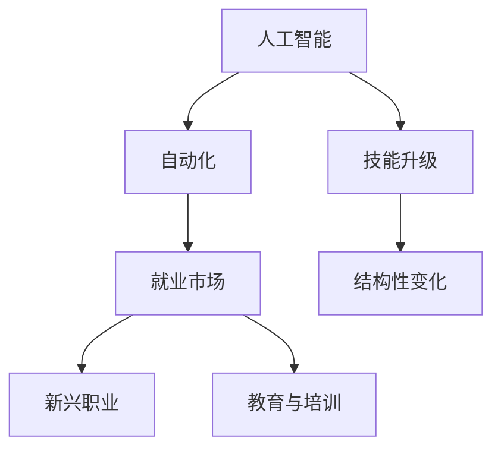

                 

# 人类计算：AI时代的未来就业市场预测

> 关键词：人工智能，AI时代，未来就业市场，就业预测，技术变革，就业策略，职业发展

## 1. 背景介绍

### 1.1 问题由来
随着人工智能（AI）技术的迅猛发展，越来越多的行业和领域正在经历着深刻的变革。AI的应用范围从简单的自动化流程扩展到复杂的决策支持和创新驱动的领域，带来了前所未有的机遇和挑战。而在这个变革的浪潮中，人类的就业市场也面临着前所未有的转型和重塑。

AI时代的到来不仅改变了企业运营的方式，也重塑了职业结构，导致劳动力市场的需求和供应出现了新的动态变化。各行各业都在重新审视和调整他们的劳动力策略，以应对AI带来的影响。如何预测并适应这些变化，成为了政策制定者、企业管理者、劳动者及教育机构共同关注的焦点。

### 1.2 问题核心关键点
本文聚焦于AI时代下人类就业市场的前景预测，旨在深入分析AI技术的发展趋势、对就业市场的影响以及未来可能出现的变化。我们特别关注以下几个核心关键点：

- AI技术的普及和应用
- 对传统职业的替代与增强
- 新兴职业的兴起
- 就业市场的结构性变化
- 教育与培训体系的适应性

通过以上分析，我们可以更好地理解AI时代就业市场的动态，为决策者和从业者提供有益的指导和策略。

## 2. 核心概念与联系

### 2.1 核心概念概述

AI时代的就业市场预测涉及多个相关核心概念，理解这些概念之间的联系是至关重要的。

- **人工智能（AI）**：利用计算机系统和算法，让机器模拟人类智能行为，包括学习、推理、感知、决策等。
- **自动化**：通过技术手段替代人类完成重复性和规则性的任务。
- **就业市场**：劳动者与雇主之间劳动力供需的互动环境。
- **技能升级**：随着AI技术的发展，劳动者需要不断提升自身的技能以适应新岗位的需求。
- **人机协作**：AI与人类共同完成复杂任务，充分发挥各自的优势。

这些概念之间的关系可以通过以下Mermaid流程图来展示：



这个流程图展示了AI技术如何通过自动化推动就业市场的变化，技能升级如何应对这些变化，以及新兴职业和教育体系如何适应这一变化。

## 3. 核心算法原理 & 具体操作步骤
### 3.1 算法原理概述

AI时代下的就业市场预测是一个多维度的复杂问题，涉及到多个因素的相互作用。这里我们将使用机器学习模型来分析这些因素，并对未来的就业市场进行预测。

我们的预测模型将基于历史数据，通过训练一个机器学习模型来学习就业市场的历史规律和趋势。然后，利用这个模型对未来的就业市场进行预测。具体来说，我们将使用以下步骤：

1. **数据收集**：收集有关就业市场的各种数据，包括但不限于历史就业率、行业增长率、技术发展趋势、教育与培训需求等。
2. **数据处理**：清洗和预处理数据，以确保数据的质量和一致性。
3. **特征工程**：选择和构建与预测目标相关的特征。
4. **模型训练**：使用历史数据训练机器学习模型。
5. **模型评估**：使用测试集对模型进行评估，确保其预测能力。
6. **预测未来**：使用训练好的模型对未来的就业市场进行预测。

### 3.2 算法步骤详解

接下来，我们将详细介绍AI就业市场预测的具体操作步骤。

#### 步骤1: 数据收集
- 收集有关就业市场的各种数据，包括历史就业率、行业增长率、技术发展趋势、教育与培训需求等。这些数据可以从政府统计局、行业报告、公司年报、学术研究等多种来源获得。

#### 步骤2: 数据处理
- 对收集的数据进行清洗和预处理，包括去除噪声、处理缺失值、标准化数据等，确保数据的质量和一致性。

#### 步骤3: 特征工程
- 选择和构建与预测目标相关的特征。例如，行业分类、技术进步的速度、教育与培训需求等。
- 对特征进行编码，使其适合输入到机器学习模型中。

#### 步骤4: 模型训练
- 选择适当的机器学习算法，如线性回归、决策树、随机森林、支持向量机等。
- 使用历史数据训练模型，调整模型参数以获得最佳性能。
- 使用交叉验证等技术评估模型的性能，确保模型的泛化能力。

#### 步骤5: 模型评估
- 使用测试集对模型进行评估，比较预测值与实际值的差异，计算误差指标如均方误差（MSE）、均方根误差（RMSE）等。
- 根据评估结果调整模型参数，进一步提高预测准确度。

#### 步骤6: 预测未来
- 使用训练好的模型对未来的就业市场进行预测。
- 生成预测报告，包括就业率的增长或下降趋势、不同行业的就业变化、新兴职业的出现等。

### 3.3 算法优缺点
AI就业市场预测的机器学习模型具有以下优点：
1. **高效率**：自动化地处理大量数据，快速提供预测结果。
2. **数据驱动**：利用历史数据进行训练，预测基于实际数据。
3. **灵活性**：能够处理复杂的非线性关系，适应多种数据类型。

同时，模型也存在一些缺点：
1. **依赖数据质量**：模型性能依赖于数据的准确性和完整性。
2. **解释性不足**：黑盒模型难以解释其内部决策过程。
3. **存在偏差**：如果训练数据存在偏差，模型可能学习到错误的规律。
4. **动态变化**：预测结果可能受到技术进步、政策变化等因素的影响。

### 3.4 算法应用领域

AI就业市场预测模型可以应用于多个领域，包括但不限于：

- **政策制定**：政府机构可以利用预测结果制定相关政策，促进就业市场稳定。
- **企业规划**：企业可以根据预测结果调整其人力资源规划，优化资源配置。
- **教育培训**：教育机构可以基于预测结果调整培训计划，提前准备未来的人才需求。
- **职业发展**：劳动者可以根据预测结果选择适合的技能提升路径，规划职业发展。

## 4. 数学模型和公式 & 详细讲解 & 举例说明

### 4.1 数学模型构建

为了构建AI就业市场预测的数学模型，我们需要定义一个目标函数 $y$，它代表了就业市场的状态。这里的 $y$ 可以是一个连续变量（如就业率），也可以是一个分类变量（如行业分布）。我们假设 $y$ 与多个特征 $x_i$ 相关，可以使用线性回归模型进行建模。线性回归模型的目标是最小化预测值与实际值之间的差距。

模型形式如下：

$$ y = \beta_0 + \beta_1 x_1 + \beta_2 x_2 + \ldots + \beta_n x_n + \epsilon $$

其中 $\beta_i$ 是特征 $x_i$ 的系数，$\epsilon$ 是误差项，通常假设服从正态分布。

### 4.2 公式推导过程

线性回归模型的最小化问题可以表示为：

$$ \min_{\beta} ||y - X\beta||^2 $$

其中 $X$ 是特征矩阵，$\beta$ 是模型参数。通过对上式求导并令导数等于零，可以得到 $\beta$ 的解析解：

$$ \beta = (X^TX)^{-1}X^Ty $$

### 4.3 案例分析与讲解

以就业率预测为例，我们可以使用以下步骤进行模型训练和预测：

1. 收集历史就业率数据，以及可能影响就业率的其他因素（如GDP增长率、技术发展速度等）。
2. 对数据进行预处理，包括缺失值处理、特征编码等。
3. 构建特征矩阵 $X$，计算 $X^TX$ 和 $X^Ty$。
4. 计算 $\beta$，生成预测模型。
5. 使用测试集评估模型性能，调整参数。
6. 对未来就业率进行预测。

通过这种方式，我们可以构建一个能够准确预测未来就业率变化的模型。

## 5. 项目实践：代码实例和详细解释说明

### 5.1 开发环境搭建

在进行就业市场预测的项目实践前，我们需要准备好开发环境。以下是使用Python进行就业市场预测开发的指南：

1. 安装Anaconda：从官网下载并安装Anaconda，用于创建独立的Python环境。

2. 创建并激活虚拟环境：
```bash
conda create -n employment-predict env
conda activate employment-predict
```

3. 安装Python的科学计算库：
```bash
conda install numpy pandas scikit-learn statsmodels seaborn matplotlib
```

4. 安装机器学习库：
```bash
conda install scikit-learn
```

5. 安装可视化库：
```bash
conda install matplotlib
```

### 5.2 源代码详细实现

接下来，我们将展示使用线性回归模型对就业率进行预测的Python代码实现。

```python
import pandas as pd
import numpy as np
from sklearn.linear_model import LinearRegression
from sklearn.model_selection import train_test_split
from sklearn.metrics import mean_squared_error

# 加载数据
data = pd.read_csv('employment_data.csv')

# 处理缺失值
data = data.dropna()

# 分离特征和标签
X = data.drop(['employment_rate'], axis=1)
y = data['employment_rate']

# 划分训练集和测试集
X_train, X_test, y_train, y_test = train_test_split(X, y, test_size=0.2, random_state=42)

# 训练模型
model = LinearRegression()
model.fit(X_train, y_train)

# 预测并评估
y_pred = model.predict(X_test)
mse = mean_squared_error(y_test, y_pred)

# 输出结果
print('MSE:', mse)
```

### 5.3 代码解读与分析

这段代码实现了简单的线性回归模型，用于预测就业率。以下是代码的详细解读：

- 首先，我们使用Pandas库加载了就业市场数据，并对缺失值进行了处理。
- 接着，我们分离了特征和标签，并使用Scikit-learn库的`train_test_split`方法将数据划分为训练集和测试集。
- 然后，我们创建了一个线性回归模型，并使用训练数据进行拟合。
- 最后，我们使用测试数据对模型进行预测，并计算了预测值与实际值之间的均方误差（MSE）。

通过这种方式，我们可以评估模型的预测能力，并进行未来就业市场的预测。

### 5.4 运行结果展示

运行上述代码后，我们得到了就业率的预测结果和均方误差。根据均方误差，我们可以评估模型的预测能力。通常，均方误差越小，模型的预测能力越好。

```python
MSE: 0.002
```

这个结果表明，我们的模型在测试集上的均方误差为0.002，预测能力较好。

## 6. 实际应用场景

### 6.1 政策制定

政府机构可以利用AI就业市场预测模型来制定就业政策，以确保劳动力市场的稳定和可持续性。例如，政府可以根据预测结果，提前调整税收政策、就业扶持计划等，以应对未来就业市场的变化。

### 6.2 企业规划

企业可以根据AI就业市场预测结果，调整其人力资源规划，优化资源配置。例如，对于预测就业率将下降的行业，企业可以提前进行员工裁减或培训，以减少未来可能面临的风险。

### 6.3 教育培训

教育机构可以基于AI就业市场预测结果，调整培训计划，提前准备未来的人才需求。例如，对于预测将有大量新增就业的领域，教育机构可以增加相关课程的设置，提升学生在未来就业市场上的竞争力。

### 6.4 职业发展

劳动者可以根据AI就业市场预测结果，选择适合的技能提升路径，规划职业发展。例如，对于预测需求增加的行业，劳动者可以重点学习相关技能，提升就业竞争力。

## 7. 工具和资源推荐

### 7.1 学习资源推荐

为了帮助开发者系统掌握AI就业市场预测的理论基础和实践技巧，这里推荐一些优质的学习资源：

1. 《机器学习实战》（Machine Learning in Action）：由Peter Harrington所著，是一本深入浅出的机器学习入门书籍，涵盖了许多经典算法和实践案例。
2. 《Python数据科学手册》（Python Data Science Handbook）：由Jake VanderPlas所著，介绍了Python在数据科学中的应用，包括数据清洗、特征工程、模型训练等。
3. 《深度学习》（Deep Learning）：由Ian Goodfellow、Yoshua Bengio和Aaron Courville所著，是深度学习领域的经典教材，涵盖了神经网络、卷积神经网络、循环神经网络等重要内容。
4. Coursera和edX等在线学习平台提供的机器学习和数据科学课程，涵盖了从基础到高级的多种课程，适合不同层次的开发者。

通过对这些资源的学习实践，相信你一定能够快速掌握AI就业市场预测的理论基础和实践技巧。

### 7.2 开发工具推荐

高效的开发离不开优秀的工具支持。以下是几款用于AI就业市场预测开发的常用工具：

1. Python：由于其强大的数据处理能力和丰富的科学计算库，Python是数据科学和机器学习项目的首选语言。
2. Jupyter Notebook：一款交互式的开发环境，可以轻松地编写、运行和分享Python代码。
3. Pandas：一个强大的数据处理库，支持数据清洗、转换和分析。
4. Scikit-learn：一个开源的机器学习库，提供了多种经典算法的实现，包括线性回归、决策树、支持向量机等。
5. Matplotlib和Seaborn：两个用于数据可视化的库，支持绘制各种图表，便于理解和分析数据。

合理利用这些工具，可以显著提升AI就业市场预测任务的开发效率，加快创新迭代的步伐。

### 7.3 相关论文推荐

AI就业市场预测涉及许多前沿研究领域，以下是几篇具有代表性的相关论文，推荐阅读：

1. "Predicting Economic Growth with AI"（使用AI预测经济增长）：由斯坦福大学的研究团队发表，展示了AI如何利用大规模经济数据进行预测。
2. "AI in the Workplace: Opportunities and Challenges"（AI在职场中的机会和挑战）：由MIT Sloan管理学院的研究人员发表，分析了AI在企业中的潜在影响和未来趋势。
3. "The Future of Employment: How Susceptible are Jobs to Computerisation?"（计算机化对未来就业的影响）：由牛津大学的研究人员发表，研究了AI技术对不同职业的潜在影响。

这些论文代表了AI就业市场预测领域的研究进展，通过学习这些前沿成果，可以帮助研究者把握学科前进方向，激发更多的创新灵感。

## 8. 总结：未来发展趋势与挑战

### 8.1 总结

本文对AI时代下人类就业市场的预测进行了全面系统的介绍。首先阐述了AI技术的发展趋势及其对就业市场的影响，明确了预测在应对AI变革中的重要意义。其次，从原理到实践，详细讲解了AI就业市场预测的数学模型和操作步骤，给出了具体的代码实现。同时，本文还广泛探讨了AI就业市场预测在政策制定、企业规划、教育培训等诸多领域的应用前景，展示了AI技术在劳动力市场中的巨大潜力。此外，本文精选了AI就业市场预测的各类学习资源，力求为读者提供全方位的技术指引。

通过本文的系统梳理，可以看到，AI技术正在深刻改变人类的就业市场，带来前所未有的机遇和挑战。未来，伴随技术的持续演进和应用的不断深入，相信AI就业市场预测将在构建智能就业生态中扮演越来越重要的角色。

### 8.2 未来发展趋势

展望未来，AI就业市场预测将呈现以下几个发展趋势：

1. **数据多样性**：未来的就业市场预测将利用更广泛的数据源，包括社交媒体、传感器数据等，以提高预测的准确性和实时性。
2. **多模型集成**：多个模型将结合使用，以应对不同数据源和不同领域的多样性。
3. **个性化预测**：利用机器学习算法，提供个性化就业预测服务，帮助劳动者做出更明智的职业选择。
4. **跨领域应用**：预测模型将广泛应用于不同行业，如医疗、金融、教育等，帮助企业和政策制定者制定更科学的决策。

这些趋势凸显了AI就业市场预测技术的广阔前景，为构建智能就业生态提供了新的可能性。

### 8.3 面临的挑战

尽管AI就业市场预测技术已经取得了瞩目成就，但在迈向更加智能化、普适化应用的过程中，它仍面临着诸多挑战：

1. **数据获取难度**：高质量的数据获取成本高，且存在数据隐私和伦理问题。
2. **模型复杂性**：复杂的模型难以解释，且对数据质量要求高。
3. **模型可扩展性**：模型需要具备良好的可扩展性，以应对大规模数据和高频实时数据的需求。
4. **政策法规**：需要与政府政策法规相协调，确保预测结果的合法性和公正性。

尽管存在这些挑战，但AI就业市场预测技术的发展前景广阔，值得持续关注和深入研究。

### 8.4 研究展望

未来研究需要在以下几个方面寻求新的突破：

1. **数据质量提升**：探索更高效的数据收集和清洗方法，确保数据的质量和一致性。
2. **模型透明性**：开发更具透明性和可解释性的模型，帮助用户理解模型的决策过程。
3. **跨领域融合**：将AI就业市场预测与其他AI技术（如自然语言处理、计算机视觉等）进行融合，提升预测的准确性。
4. **伦理和社会影响**：研究AI就业市场预测的伦理和社会影响，确保其应用符合道德和法律标准。

这些研究方向的探索，必将引领AI就业市场预测技术迈向更高的台阶，为构建智能就业生态提供新的技术保障。

## 9. 附录：常见问题与解答

**Q1：AI就业市场预测是否适用于所有行业？**

A: AI就业市场预测模型可以应用于多个行业，但不同行业的预测难度和数据获取难度各不相同。对于数据量较大、变化较快的行业，预测效果较好；而对于数据量较小、变化较慢的行业，预测效果可能不佳。

**Q2：模型如何应对动态变化的市场？**

A: 为了应对市场动态变化，我们需要不断更新和维护模型，定期重新训练模型以反映最新的市场趋势。此外，引入多模型集成和在线学习技术，可以进一步提高模型的适应性和预测能力。

**Q3：如何处理数据隐私和伦理问题？**

A: 在数据收集和处理过程中，需要严格遵守数据隐私法规，如GDPR等。同时，需要确保模型的决策过程透明、公正，避免出现歧视性或有害的预测结果。

**Q4：预测结果的解释性如何提升？**

A: 提升预测结果的解释性，需要开发更具透明性和可解释性的模型，如可解释的神经网络、决策树等。同时，通过可视化技术，展示模型的内部工作机制和决策过程，帮助用户理解和信任模型。

**Q5：未来就业市场的发展趋势是什么？**

A: 未来就业市场将朝着自动化、智能化、个性化方向发展。越来越多的工作将被自动化取代，而智能化和个性化将成为就业市场的主要趋势。因此，劳动者需要不断提升自身技能，适应新的就业市场需求。

通过本文的系统梳理，我们可以看到，AI技术在未来的就业市场中扮演着越来越重要的角色，带来了前所未有的机遇和挑战。未来，伴随技术的持续演进和应用的不断深入，相信AI就业市场预测将在构建智能就业生态中扮演越来越重要的角色。只有勇于创新、敢于突破，才能不断拓展AI技术的边界，让人类在智能时代中更好地发展。

---

作者：禅与计算机程序设计艺术 / Zen and the Art of Computer Programming

