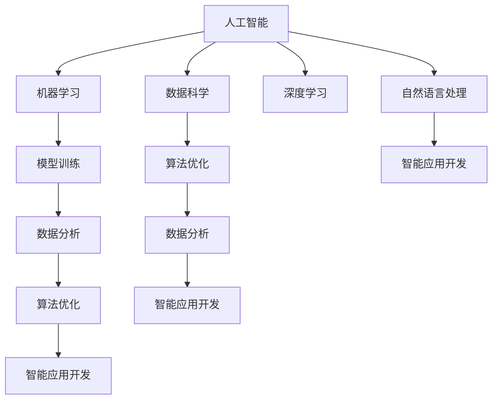

                 

# 人类计算：AI时代的未来技能发展与培训

## 1. 背景介绍

### 1.1 问题由来
随着人工智能技术的飞速发展，特别是深度学习和自然语言处理(NLP)的突破，人类计算已经从以传统编程为主的劳动密集型工作逐渐转向以算法优化、模型训练和数据分析为核心的智能密集型工作。AI时代对人才的素质和技能提出了新的要求。如何培养适应AI时代需求的未来技能，成为教育界和产业界共同关心的话题。

### 1.2 问题核心关键点
未来的技能发展与培训需要结合AI技术，从知识体系、技能体系和素质体系等多个维度进行全面改革。

1. **知识体系**：未来的知识体系需要更注重数据科学、统计学、机器学习和计算机科学的基础知识，以适应AI技术的应用。
2. **技能体系**：未来的技能体系需要具备算法优化、模型训练、数据分析和智能应用开发的能力，以实现AI模型的高效构建和应用。
3. **素质体系**：未来的素质体系需要培养创新思维、问题解决能力、团队合作精神和伦理道德意识，以应对AI技术带来的伦理和法律挑战。

### 1.3 问题研究意义
培养适应AI时代需求的人才，对于推动AI技术的产业化应用、促进经济社会发展具有重要意义：

1. **推动AI技术应用**：具有AI相关知识和技术的人才，能够加速AI技术的落地和应用，解决实际问题。
2. **促进经济转型**：AI技术的发展将引领经济结构转型，培养AI人才有助于提升产业竞争力。
3. **提升社会福祉**：AI技术在医疗、教育、交通等领域的应用，能够显著提升社会运行效率和福祉。
4. **应对未来挑战**：AI技术带来诸多社会伦理和法律挑战，具有良好素质的人才能够更好地应对这些挑战。

## 2. 核心概念与联系

### 2.1 核心概念概述

为更好地理解未来技能的发展与培训，本节将介绍几个密切相关的核心概念：

- **人工智能**：一种通过计算机模拟人类智能的技术，包括机器学习、深度学习、自然语言处理等分支。
- **数据科学**：一门涉及数据获取、数据处理、数据分析和数据可视化的学科，旨在从数据中提取知识。
- **机器学习**：一种通过训练算法从数据中学习规律，实现预测、分类等任务的技术。
- **深度学习**：一种基于神经网络的机器学习方法，通过多层非线性变换提取数据特征。
- **自然语言处理**：一门研究计算机如何理解、处理和生成人类语言的学科。
- **算法优化**：通过优化算法提高模型性能和效率的过程，包括梯度下降、正则化等技术。
- **模型训练**：通过训练数据对模型进行参数调整，以逼近目标函数的过程。
- **数据分析**：通过对数据进行统计、分类、聚类等分析，提取有价值的信息。
- **智能应用开发**：将AI技术应用于实际问题解决的过程，包括应用开发、系统集成等。
- **伦理道德**：在AI应用中，确保算法决策的透明、公正、可解释，遵守法律法规。

这些核心概念之间的逻辑关系可以通过以下Mermaid流程图来展示：



这个流程图展示了一些核心概念及其之间的关系：

1. 人工智能是数据科学、机器学习和深度学习等技术的基础。
2. 数据科学通过数据分析获取知识，进而指导模型训练。
3. 模型训练和算法优化是深度学习的主要任务。
4. 自然语言处理是AI技术的重要应用领域之一。
5. 数据分析、模型训练和算法优化都与智能应用开发紧密相关。
6. 伦理道德贯穿于AI技术的各个环节。

这些概念共同构成了未来技能发展的知识体系，使其能够适应AI技术的快速变化。

## 3. 核心算法原理 & 具体操作步骤

### 3.1 算法原理概述

未来的技能发展与培训需要结合AI技术，通过算法优化、模型训练和数据分析等核心技能，实现AI应用的落地和优化。

算法优化的目标是通过选择或设计更高效、更准确的算法，提高模型性能和训练速度。常见的算法优化方法包括：

- **梯度下降**：通过计算模型参数的梯度，反向传播更新参数，以最小化损失函数。
- **正则化**：通过添加惩罚项，防止模型过拟合，提高泛化能力。
- **剪枝和压缩**：通过减少模型参数数量，提高模型效率和泛化能力。

模型训练的目标是通过训练数据对模型进行参数调整，使其能够较好地拟合目标函数。常见的模型训练方法包括：

- **监督学习**：通过标注数据训练模型，使其能够预测新数据。
- **无监督学习**：通过未标注数据训练模型，自动发现数据中的规律。
- **强化学习**：通过与环境的交互，训练模型最大化特定指标。

数据分析的目标是通过对数据进行统计、分类、聚类等分析，提取有价值的信息。常见的数据分析方法包括：

- **统计分析**：通过描述性统计和推断性统计分析数据。
- **数据可视化**：通过图表、图形等方式展示数据分布和关系。
- **分类和聚类**：通过算法对数据进行分类和聚类分析。

### 3.2 算法步骤详解

未来的技能发展与培训需要掌握算法优化、模型训练和数据分析等核心技能。以下将详细介绍这些技能的核心步骤：

**算法优化步骤**：

1. **选择算法**：根据任务需求选择合适的优化算法，如梯度下降、正则化等。
2. **初始化参数**：将模型参数初始化为一个合理的值。
3. **计算梯度**：通过前向传播计算损失函数，并通过反向传播计算参数梯度。
4. **更新参数**：根据梯度下降方向更新模型参数。
5. **评估性能**：通过验证集评估模型性能，调整超参数。

**模型训练步骤**：

1. **准备数据**：将数据集划分为训练集、验证集和测试集。
2. **选择模型**：根据任务需求选择合适的模型，如神经网络、支持向量机等。
3. **设计损失函数**：根据任务类型选择合适的损失函数，如交叉熵损失、均方误差损失等。
4. **训练模型**：通过训练集对模型进行迭代训练，更新模型参数。
5. **评估模型**：通过验证集评估模型性能，调整超参数。

**数据分析步骤**：

1. **数据预处理**：对数据进行清洗、标准化等预处理。
2. **特征提取**：通过特征工程提取有意义的特征。
3. **选择算法**：根据任务需求选择合适的数据分析算法，如聚类、分类等。
4. **模型训练**：通过训练数据对模型进行训练。
5. **结果评估**：通过测试集评估模型性能，分析结果。

### 3.3 算法优缺点

算法优化、模型训练和数据分析等技能具有以下优点：

1. **提高模型性能**：通过优化算法和模型训练，能够提高模型的预测精度和泛化能力。
2. **提升效率**：通过剪枝、压缩等技术，能够提高模型的训练和推理效率。
3. **实现自动化**：通过数据自动化分析，能够实现从数据到知识的高效转化。

同时，这些技能也存在以下局限：

1. **数据依赖**：算法的性能依赖于数据的质量和量。
2. **复杂性高**：算法优化和模型训练涉及大量的数学和编程知识。
3. **结果解释性不足**：数据可视化和分析结果可能缺乏直观的解释。

### 3.4 算法应用领域

算法优化、模型训练和数据分析等技能在AI技术的各个应用领域都有广泛的应用，例如：

- **自然语言处理**：通过优化算法和模型训练，实现文本分类、情感分析、机器翻译等任务。
- **计算机视觉**：通过优化算法和模型训练，实现图像分类、目标检测、图像生成等任务。
- **推荐系统**：通过数据分析和模型训练，实现用户推荐、商品推荐等任务。
- **金融分析**：通过数据分析和模型训练，实现股票预测、风险评估等任务。
- **医疗诊断**：通过数据分析和模型训练，实现疾病预测、治疗方案推荐等任务。
- **智能制造**：通过数据分析和模型训练，实现设备故障预测、生产调度优化等任务。

这些技能的应用不仅提升了AI技术的应用效果，也推动了各行业的数字化转型。

## 4. 数学模型和公式 & 详细讲解 & 举例说明

### 4.1 数学模型构建

为了更好地理解未来技能的发展与培训，本节将使用数学语言对算法优化、模型训练和数据分析等核心技能进行严格刻画。

设模型参数为 $\theta$，数据集为 $D=\{(x_i,y_i)\}_{i=1}^N$，其中 $x_i$ 为输入，$y_i$ 为输出，目标函数为 $L(\theta)$。

算法优化的目标是最小化目标函数 $L(\theta)$，即：

$$
\theta^* = \mathop{\arg\min}_{\theta} L(\theta)
$$

在模型训练中，常用的损失函数为均方误差损失函数，其定义为：

$$
L(\theta) = \frac{1}{N} \sum_{i=1}^N (y_i - f(x_i,\theta))^2
$$

其中 $f(x_i,\theta)$ 为模型在输入 $x_i$ 上的预测输出。

数据分析常用的算法包括聚类算法和分类算法。聚类算法的目标是最小化样本间的距离，常用的算法包括K-Means和层次聚类。分类算法的目标是最小化分类误差，常用的算法包括朴素贝叶斯和决策树。

### 4.2 公式推导过程

以K-Means聚类算法为例，推导其优化过程。

设数据集 $D=\{x_1, x_2, ..., x_n\}$，聚类中心数为 $k$，初始聚类中心为 $\mu_0$，迭代次数为 $t$。

K-Means聚类的优化目标为：

$$
J(\mu_t) = \sum_{i=1}^n \min_{\mu_j \in \mathcal{C}} \| x_i - \mu_j \|^2
$$

其中 $\mathcal{C}$ 为聚类中心集合。

聚类中心的更新公式为：

$$
\mu_{j,t} = \frac{1}{\beta_j} \sum_{i=1}^n \mathbb{1}_{\{x_i \in C_j\}} x_i
$$

其中 $\beta_j$ 为类别 $C_j$ 中的样本数，$\mathbb{1}_{\{x_i \in C_j\}}$ 为指示函数，当 $x_i$ 属于 $C_j$ 时，$\mathbb{1}_{\{x_i \in C_j\}} = 1$，否则 $\mathbb{1}_{\{x_i \in C_j\}} = 0$。

通过上述优化过程，K-Means算法能够自动将数据集划分为 $k$ 个聚类，每个聚类中心表示一个类别。

### 4.3 案例分析与讲解

以一个简单的文本分类任务为例，展示算法优化、模型训练和数据分析的实际应用。

**算法优化案例**：

设有一组文本数据 $\{x_1, x_2, ..., x_n\}$，每个文本 $x_i$ 由多个词 $w_{i1}, w_{i2}, ..., w_{in}$ 组成。

通过TF-IDF算法计算每个词的重要性，得到每个文本的特征向量 $\mathbf{v}_i = (v_{i1}, v_{i2}, ..., v_{in})$。

使用梯度下降算法优化模型参数 $\theta$，最小化损失函数：

$$
L(\theta) = \frac{1}{N} \sum_{i=1}^N \sum_{j=1}^{m} \left(\mathbf{v}_i \cdot \mathbf{w}_j - y_i\right)^2
$$

其中 $\mathbf{w}_j$ 为模型权重。

**模型训练案例**：

设有一组标注数据 $\{(x_i, y_i)\}_{i=1}^N$，其中 $y_i$ 表示文本 $x_i$ 的类别标签。

通过模型训练得到文本分类的预测模型 $f(x_i,\theta)$，最小化损失函数：

$$
L(\theta) = \frac{1}{N} \sum_{i=1}^N \sum_{j=1}^{m} \left(f(x_i,\theta) - y_i\right)^2
$$

其中 $f(x_i,\theta)$ 为模型在输入 $x_i$ 上的预测输出。

**数据分析案例**：

设有一组数据集 $\{(x_i, y_i)\}_{i=1}^N$，其中 $y_i$ 表示样本 $x_i$ 的类别标签。

通过K-Means算法对数据进行聚类分析，得到 $k$ 个聚类中心 $\mu_1, \mu_2, ..., \mu_k$。

将每个样本 $x_i$ 分配到最近的聚类中心 $C_j$，得到聚类结果 $\{\mu_j, C_j\}_{j=1}^k$。

## 5. 项目实践：代码实例和详细解释说明

### 5.1 开发环境搭建

在进行未来技能的发展与培训实践前，我们需要准备好开发环境。以下是使用Python进行PyTorch开发的环境配置流程：

1. 安装Anaconda：从官网下载并安装Anaconda，用于创建独立的Python环境。

2. 创建并激活虚拟环境：
```bash
conda create -n pytorch-env python=3.8 
conda activate pytorch-env
```

3. 安装PyTorch：根据CUDA版本，从官网获取对应的安装命令。例如：
```bash
conda install pytorch torchvision torchaudio cudatoolkit=11.1 -c pytorch -c conda-forge
```

4. 安装Transformers库：
```bash
pip install transformers
```

5. 安装各类工具包：
```bash
pip install numpy pandas scikit-learn matplotlib tqdm jupyter notebook ipython
```

完成上述步骤后，即可在`pytorch-env`环境中开始实践。

### 5.2 源代码详细实现

这里我们以K-Means聚类算法为例，展示使用PyTorch实现算法优化的过程。

首先，定义K-Means算法的类：

```python
import torch
from torch import nn
import numpy as np

class KMeans(nn.Module):
    def __init__(self, k, max_iter=100):
        super(KMeans, self).__init__()
        self.k = k
        self.max_iter = max_iter
        self.centroids = None
        
    def forward(self, x):
        if self.centroids is None:
            self.centroids = x.new_empty(self.k, x.size(1))
        else:
            self.centroids = self.centroids.requires_grad_(True)
            
        for i in range(self.max_iter):
            clusters = self.assign(x)
            loss = self.assigned_loss(x, clusters)
            self.centroids = self.centroids.data - self.gradient_descent(x, clusters)
            
        return clusters
        
    def assign(self, x):
        clusters = (x * x).addmm(1, self.centroids, self.centroids.t()).clamp(min=0).add_(x).pow_(2).pow_(1/2).unsqueeze(0).expand(x.size(0), self.k).min(1)[1]
        return clusters
    
    def assigned_loss(self, x, clusters):
        distance = x - self.centroids[clusters].unsqueeze(1)
        loss = distance.pow(2).sum(1).mean()
        return loss
    
    def gradient_descent(self, x, clusters):
        total_weight = (clusters == torch.arange(self.k)).float().sum(0)
        centroid_loss = (x[clusters].unsqueeze(0).expand(x.size(0), self.k) - self.centroids).pow(2).sum(1) / total_weight.unsqueeze(1)
        centroid_loss = centroid_loss.mean()
        centroid_loss.backward()
        return self.centroids.grad.data
```

接着，定义数据处理函数：

```python
from sklearn.datasets import make_blobs
import torch
import matplotlib.pyplot as plt

def generate_data(k, n):
    x, y = make_blobs(n_samples=n, centers=k, random_state=42)
    x = torch.from_numpy(x).float()
    y = torch.from_numpy(y).long()
    return x, y
```

最后，启动K-Means算法训练过程：

```python
k = 3
n = 100
x, y = generate_data(k, n)
model = KMeans(k=k)
device = torch.device('cuda' if torch.cuda.is_available() else 'cpu')
model.to(device)
clusters = model(x.to(device))
plt.scatter(x.numpy(), y.numpy(), c=clusters.numpy())
plt.show()
```

以上就是使用PyTorch实现K-Means聚类算法的完整代码实现。可以看到，得益于PyTorch的强大封装，我们可以用相对简洁的代码实现K-Means算法。

### 5.3 代码解读与分析

让我们再详细解读一下关键代码的实现细节：

**KMeans类**：
- `__init__`方法：初始化聚类中心数和迭代次数。
- `forward`方法：进行聚类计算，更新聚类中心。
- `assign`方法：对每个样本分配最近的聚类中心。
- `assigned_loss`方法：计算每个聚类中心的损失。
- `gradient_descent`方法：计算聚类中心的梯度，更新参数。

**generate_data函数**：
- 使用sklearn库生成随机数据。
- 将数据转换为torch tensor，并设置标签。

**训练流程**：
- 定义聚类中心数和样本数，生成随机数据。
- 实例化KMeans模型，并将数据和模型移动到GPU上。
- 调用模型进行聚类计算，并可视化聚类结果。

可以看到，PyTorch配合TensorFlow库使得算法优化的代码实现变得简洁高效。开发者可以将更多精力放在算法设计、数据分析等高层逻辑上，而不必过多关注底层的实现细节。

当然，工业级的系统实现还需考虑更多因素，如模型的保存和部署、超参数的自动搜索、更灵活的任务适配层等。但核心的技能开发基本与此类似。

## 6. 实际应用场景

### 6.1 金融风险管理

未来的技能发展与培训在金融风险管理中具有重要应用。金融行业面临诸多风险，如市场风险、信用风险、操作风险等。通过算法优化和模型训练，可以实现对金融风险的预测和评估。

在实践中，可以收集金融市场的交易数据、公司财务数据等，利用数据科学和机器学习技术，对数据进行清洗、特征提取和模型训练，得到金融风险预测模型。通过模型评估和优化，可以在新数据到来时，及时发现风险并采取应对措施，保护金融机构和投资者利益。

### 6.2 医疗健康管理

未来的技能发展与培训在医疗健康管理中具有重要应用。医疗行业面临诸多挑战，如疾病预测、个性化治疗、医疗资源管理等。通过数据分析和模型训练，可以实现对医疗数据的有效利用。

在实践中，可以收集电子病历、基因数据、体检数据等，利用数据科学和机器学习技术，对数据进行清洗、特征提取和模型训练，得到疾病预测模型和个性化治疗方案。通过模型评估和优化，可以提升医疗诊断和治疗的精准度和效率，提高患者的治疗效果和满意度。

### 6.3 智能制造管理

未来的技能发展与培训在智能制造管理中具有重要应用。制造行业面临诸多挑战，如设备故障预测、生产调度优化、供应链管理等。通过数据分析和模型训练，可以实现对制造数据的有效利用。

在实践中，可以收集制造设备的数据、生产数据、供应链数据等，利用数据科学和机器学习技术，对数据进行清洗、特征提取和模型训练，得到设备故障预测模型和生产调度优化方案。通过模型评估和优化，可以提高生产效率，减少设备故障率，优化供应链管理，提升企业的竞争力。

### 6.4 未来应用展望

随着未来技能的发展与培训技术的不断进步，其在更多领域得到应用，为各行各业带来变革性影响。

在智慧城市治理中，未来技能可以帮助构建智能城市管理系统，提升城市管理效率和智能化水平。在教育领域，未来技能可以帮助构建智能教育系统，提升教学质量和个性化教育水平。在农业领域，未来技能可以帮助构建智能农业管理系统，提升农业生产效率和资源利用率。

此外，在更多垂直行业，未来技能的应用也将不断涌现，为经济社会发展注入新的动力。相信随着技术的日益成熟，未来技能将成为推动AI技术落地应用的重要范式，推动人工智能技术的产业化进程。

## 7. 工具和资源推荐

### 7.1 学习资源推荐

为了帮助开发者系统掌握未来技能的发展与培训的理论基础和实践技巧，这里推荐一些优质的学习资源：

1. 《Deep Learning with PyTorch》系列博文：由PyTorch官方撰写，详细介绍了PyTorch的使用方法和技巧，适合入门学习。

2. 《Python Machine Learning》书籍：由Sebastian Raschka撰写，介绍了Python在机器学习中的应用，适合进阶学习。

3. 《Data Science from Scratch》书籍：由Joel Grus撰写，从零开始介绍数据科学的基础知识和实践技巧，适合入门学习。

4. 《Hands-On Machine Learning with Scikit-Learn, Keras, and TensorFlow》书籍：由Aurélien Géron撰写，详细介绍了Scikit-Learn、Keras和TensorFlow的使用方法和技巧，适合进阶学习。

5. Kaggle平台：全球最大的数据科学竞赛平台，提供丰富的数据集和算法竞赛，适合实践练习。

通过对这些资源的学习实践，相信你一定能够快速掌握未来技能的发展与培训的精髓，并用于解决实际的AI问题。

### 7.2 开发工具推荐

高效的开发离不开优秀的工具支持。以下是几款用于未来技能开发常用的工具：

1. PyTorch：基于Python的开源深度学习框架，灵活动态的计算图，适合快速迭代研究。
2. TensorFlow：由Google主导开发的开源深度学习框架，生产部署方便，适合大规模工程应用。
3. Jupyter Notebook：基于Web的交互式笔记本，方便数据处理和算法开发。
4. Weights & Biases：模型训练的实验跟踪工具，可以记录和可视化模型训练过程中的各项指标，方便对比和调优。
5. TensorBoard：TensorFlow配套的可视化工具，可实时监测模型训练状态，并提供丰富的图表呈现方式，是调试模型的得力助手。

合理利用这些工具，可以显著提升未来技能开发和实践的效率，加快创新迭代的步伐。

### 7.3 相关论文推荐

未来技能的发展与培训涉及许多前沿技术，以下是几篇奠基性的相关论文，推荐阅读：

1. Deep Learning（Ian Goodfellow等）：深度学习的经典教材，介绍了深度学习的基础理论和应用实践。

2. Data Science for Business（Jill J.Cattin等）：数据科学的经典教材，介绍了数据科学的基本概念和应用方法。

3. Machine Learning：Tom Mitchell的经典教材，介绍了机器学习的基础理论和算法。

4. Reinforcement Learning（Sutton等）：强化学习的经典教材，介绍了强化学习的基础理论和算法。

5. Generative Adversarial Networks（Goodfellow等）：生成对抗网络的经典论文，介绍了生成对抗网络的基本概念和算法。

这些论文代表了大语言模型微调技术的发展脉络。通过学习这些前沿成果，可以帮助研究者把握学科前进方向，激发更多的创新灵感。

## 8. 总结：未来发展趋势与挑战

### 8.1 总结

本文对未来技能的发展与培训方法进行了全面系统的介绍。首先阐述了未来技能的发展背景和意义，明确了未来技能培训的目标和方向。其次，从原理到实践，详细讲解了未来技能的发展与培训的数学模型、算法步骤和具体操作步骤。同时，本文还广泛探讨了未来技能在各个行业领域的应用前景，展示了未来技能的前景和潜力。

通过本文的系统梳理，可以看到，未来技能的发展与培训技术的不断发展，正在为各行业带来新的变革和机遇。掌握未来技能，成为AI时代的未来人才，是提升个人竞争力和行业发展的重要途径。

### 8.2 未来发展趋势

展望未来，未来技能的发展与培训技术将呈现以下几个发展趋势：

1. **数据驱动**：未来技能的发展将越来越依赖于数据驱动的决策和应用，数据的获取、处理和分析将占据越来越重要的地位。
2. **技术融合**：未来技能将与人工智能、物联网、区块链等技术进行深度融合，实现更广泛的智能应用。
3. **个性化教育**：未来技能将逐渐普及，个性化教育将成为培训的重要方向，适应不同人群的学习需求。
4. **终身学习**：未来技能的发展将注重终身学习的理念，持续提升个人技能和职业竞争力。
5. **跨领域应用**：未来技能将突破垂直行业的限制，广泛应用于更多领域，推动社会的全面进步。

以上趋势凸显了未来技能的发展与培训技术的广阔前景。这些方向的探索发展，必将进一步提升未来技能的应用效果，推动AI技术的产业化进程。

### 8.3 面临的挑战

尽管未来技能的发展与培训技术已经取得了显著进展，但在迈向更加智能化、普适化应用的过程中，仍然面临诸多挑战：

1. **数据获取困难**：未来技能的发展依赖于大量高质量的数据，而数据的获取和标注往往成本高、周期长。
2. **技术复杂度高**：未来技能的学习和应用需要掌握多种技术，如深度学习、自然语言处理、数据科学等，门槛较高。
3. **算法模型复杂**：未来技能的算法模型往往较为复杂，需要进行大量的调试和优化。
4. **系统安全性**：未来技能的系统应用需要保证系统的安全性，防止数据泄露和模型滥用。
5. **人才缺乏**：未来技能的培训和应用需要高素质人才，但目前相关人才的储备仍显不足。

正视未来技能面临的这些挑战，积极应对并寻求突破，将是大语言模型微调走向成熟的必由之路。相信随着学界和产业界的共同努力，这些挑战终将一一被克服，未来技能将能够在更广泛的领域得到应用，推动人工智能技术的产业化进程。

### 8.4 研究展望

面向未来，未来技能的发展与培训技术需要在以下几个方面进行深入研究：

1. **数据获取与标注**：研究高效、低成本的数据获取和标注方法，降低未来技能发展的数据依赖。
2. **模型优化与压缩**：研究高效、轻量级的模型优化和压缩方法，提升未来技能的推理效率和系统稳定性。
3. **跨领域应用**：研究未来技能在更多领域的应用，推动其跨领域融合和普及。
4. **人机协同**：研究未来技能与人类智慧的协同机制，提升人机交互的自然性和智能化水平。
5. **伦理与法律**：研究未来技能的伦理和法律问题，确保其应用符合社会规范和法律要求。

这些研究方向的探索，必将引领未来技能的发展与培训技术迈向更高的台阶，为构建安全、可靠、可解释、可控的智能系统铺平道路。面向未来，未来技能的发展与培训技术还需要与其他人工智能技术进行更深入的融合，如知识表示、因果推理、强化学习等，多路径协同发力，共同推动自然语言理解和智能交互系统的进步。

只有勇于创新、敢于突破，才能不断拓展未来技能的应用边界，让智能技术更好地造福人类社会。

## 9. 附录：常见问题与解答

**Q1：未来技能是否适用于所有行业？**

A: 未来技能在大多数行业中都有广泛的应用，特别是在数据驱动的行业，如金融、医疗、制造等。但对于一些传统行业，如农业、交通等，未来技能的适用性需要进一步探索。

**Q2：未来技能的培训难度如何？**

A: 未来技能的培训难度较高，需要掌握多种技术和方法，如深度学习、数据科学、机器学习等。但通过系统的学习，可以逐步掌握相关知识，提高技能水平。

**Q3：未来技能在实际应用中需要注意哪些问题？**

A: 未来技能在实际应用中需要注意数据隐私、系统安全性、算法透明性和模型鲁棒性等问题。需要采取多种措施，确保系统的可靠性和安全性。

**Q4：未来技能的发展前景如何？**

A: 未来技能的发展前景广阔，随着数据科学、人工智能等技术的不断进步，未来技能将逐渐普及，成为各行各业的重要工具。

**Q5：未来技能的发展需要哪些资源支持？**

A: 未来技能的发展需要高质量的数据、高性能的计算资源、先进的技术工具和专业的培训课程等多方面资源支持。

**Q6：未来技能的发展与培训面临哪些挑战？**

A: 未来技能的发展与培训面临数据获取困难、技术复杂度高、算法模型复杂、系统安全性、人才缺乏等多方面挑战，需要积极应对并寻求突破。

总之，未来技能的发展与培训技术需要不断创新和优化，以应对不断变化的需求和挑战。只有通过系统的学习、实践和研究，才能培养出适应AI时代需求的高素质人才，推动人工智能技术的广泛应用和产业化进程。

