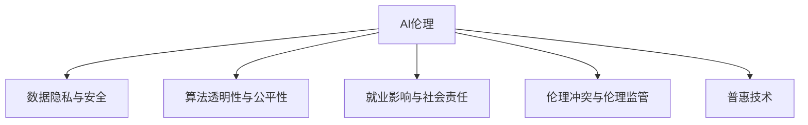

                 

## 1. 背景介绍

### 1.1 问题由来

人工智能（AI）的迅猛发展正深刻改变着人类的生产生活方式，推动着社会的进步与变革。然而，在享受技术红利的同时，我们也不得不面对AI发展过程中涌现的一系列道德和社会责任问题。这些问题不仅涉及技术本身，更关乎社会的公平、正义与可持续发展。本文旨在探讨AI时代的道德和社会责任问题，期望通过理性和严谨的讨论，为AI技术的应用提供方向性的指引。

### 1.2 问题核心关键点

AI时代的道德和社会责任问题涉及多个核心方面，主要包括：

- **数据伦理**：如何收集、存储、使用数据，确保数据隐私和安全，避免数据偏见和歧视。
- **算法透明性**：算法的决策过程是否透明、可解释，能否避免"黑箱"问题，确保公平性和公正性。
- **就业影响**：AI技术是否会引发大规模失业，如何调整就业结构，提升劳动力的竞争力。
- **伦理冲突**：AI技术在医疗、司法、军事等领域的伦理问题，如算法偏见、武器自动化等。
- **监管与治理**：如何在技术发展的同时，制定合理的法规和政策，保障AI的安全与稳定。
- **技术普惠**：如何确保AI技术的普及与应用，避免技术鸿沟和数字鸿沟。

本文将围绕这些核心问题展开深入讨论，并提出解决方案和建议。

## 2. 核心概念与联系

### 2.1 核心概念概述

为更好地理解AI时代的道德和社会责任问题，本节将介绍几个密切相关的核心概念：

- **AI伦理（Artificial Intelligence Ethics）**：研究如何构建和应用AI技术，使其在伦理上可行、公正、透明、可解释。
- **数据隐私与安全（Data Privacy and Security）**：确保数据的合法收集、存储、使用，防止数据泄露和滥用。
- **算法透明性与公平性（Algorithm Transparency and Fairness）**：算法的决策过程应透明可解释，确保在各种场景下公平公正。
- **就业影响与社会责任（Impact on Employment and Social Responsibility）**：AI技术的发展对就业市场的结构变化及对社会的责任与影响。
- **伦理冲突与伦理监管（Ethical Conflicts and Governance）**：AI在特定领域可能引发的伦理冲突及其监管措施。
- **普惠技术（Inclusive Technology）**：确保技术普惠，缩小技术鸿沟，促进社会的公平与包容。

这些核心概念之间的逻辑关系可以通过以下Mermaid流程图来展示：



这个流程图展示了大语言模型微调的核心概念及其之间的关系：

1. AI伦理是研究的出发点，涉及到数据隐私、算法透明性等多个方面。
2. 数据隐私与安全是构建AI伦理的基础。
3. 算法透明性与公平性是AI伦理的核心组成部分。
4. 就业影响与社会责任是AI伦理的实践应用。
5. 伦理冲突与伦理监管是AI伦理的保障措施。
6. 普惠技术是AI伦理的最终目标。

这些概念共同构成了AI伦理研究的框架，为解决AI发展中的道德和社会责任问题提供了方向和指导。

## 3. 核心算法原理 & 具体操作步骤
### 3.1 算法原理概述

AI时代的道德和社会责任问题主要集中在算法透明性、数据隐私与安全、算法公平性、伦理冲突与伦理监管等方面。解决这些问题需要多学科的交叉合作，包括伦理学、法学、社会学、心理学、计算机科学等。

**算法透明性**：算法透明性是AI伦理的重要组成部分，要求算法在决策过程中保持透明，可解释，避免"黑箱"问题。这需要设计合理的算法架构和决策过程，使AI系统能够提供清晰的决策依据和逻辑路径。

**数据隐私与安全**：数据隐私与安全涉及数据的合法收集、存储、使用和保护。数据隐私保护需遵循相关的法律法规，如欧盟的《通用数据保护条例》（GDPR）等。数据安全需防止数据泄露和滥用，保障数据完整性。

**算法公平性**：算法公平性要求AI系统在各种场景下公平公正，避免算法偏见和歧视。这需要通过算法设计、数据预处理、模型训练等环节的优化，确保模型在训练集和测试集上的表现一致。

**伦理冲突与伦理监管**：伦理冲突是指AI技术在特定领域可能引发的伦理问题，如算法偏见、武器自动化等。伦理监管要求建立相应的法规和政策，规范AI技术的应用，避免伦理冲突的发生。

**普惠技术**：普惠技术要求AI技术能够普及应用，缩小技术鸿沟，促进社会的公平与包容。这需要通过技术普及、教育培训、政策支持等方式，确保技术惠及更多人。

### 3.2 算法步骤详解

**算法透明性**：

1. **设计透明架构**：使用可解释的模型架构，如决策树、规则集等，使算法决策过程透明。
2. **提供解释工具**：开发工具和接口，使非专业人士也能理解算法的决策依据。
3. **定期审查与验证**：定期对算法进行审查和验证，确保其公平性和透明性。

**数据隐私与安全**：

1. **数据收集与处理**：遵循数据隐私法律法规，确保数据合法收集和使用。
2. **数据加密与安全**：对数据进行加密和访问控制，防止数据泄露。
3. **匿名化与去标识化**：对数据进行匿名化处理，保护个人隐私。

**算法公平性**：

1. **数据预处理**：对数据进行清洗和预处理，去除偏见和歧视。
2. **模型训练与验证**：在训练集和验证集上进行公平性评估，确保模型公平。
3. **算法监控与调整**：对算法进行监控，发现问题及时调整。

**伦理冲突与伦理监管**：

1. **伦理审查**：对AI应用进行伦理审查，确保符合伦理规范。
2. **法规制定**：制定相关法规和政策，规范AI技术应用。
3. **社会监督**：建立社会监督机制，及时发现并处理伦理问题。

**普惠技术**：

1. **技术普及**：通过开源项目、社区建设等方式，普及AI技术。
2. **教育培训**：提供教育和培训，提升公众的技术素养。
3. **政策支持**：制定政策，支持普惠技术的推广应用。

### 3.3 算法优缺点

**算法透明性**：

- **优点**：提高算法的可解释性和可信度，避免"黑箱"问题，增强用户信任。
- **缺点**：可能会增加算法复杂性和开发成本。

**数据隐私与安全**：

- **优点**：保障数据隐私和安全，防止数据滥用，增强用户信任。
- **缺点**：数据预处理和加密可能增加时间和成本。

**算法公平性**：

- **优点**：提高算法的公平性和公正性，避免算法偏见和歧视。
- **缺点**：可能需要更多的数据和计算资源。

**伦理冲突与伦理监管**：

- **优点**：规范AI技术应用，避免伦理冲突，保障社会安全。
- **缺点**：制定法规和监管可能耗时耗力。

**普惠技术**：

- **优点**：促进技术普及，缩小技术鸿沟，提升社会公平与包容。
- **缺点**：普及技术可能需要更多资源和时间。

### 3.4 算法应用领域

AI时代的道德和社会责任问题涉及多个应用领域，主要包括：

- **医疗领域**：AI技术在医疗诊断、治疗建议等方面的应用，需确保算法透明、数据隐私、公平公正。
- **司法领域**：AI在司法决策、案件分析等方面的应用，需符合伦理规范、确保公平公正。
- **军事领域**：AI在军事决策、自动化武器等方面的应用，需符合国际伦理规范、确保透明公正。
- **金融领域**：AI在风险评估、信用评分等方面的应用，需确保数据隐私、算法公平。
- **教育领域**：AI在个性化教育、自动化评估等方面的应用，需确保普惠技术、避免技术鸿沟。

## 4. 数学模型和公式 & 详细讲解  
### 4.1 数学模型构建

为更好地理解AI时代的道德和社会责任问题，本节将介绍几个密切相关的核心概念：

- **道德模型（Ethical Model）**：用于量化和评估AI系统的道德性，包含多个维度，如透明度、公平性、安全性等。
- **社会影响模型（Social Impact Model）**：用于评估AI技术对社会的影响，包含多个指标，如就业变化、社会公平、伦理冲突等。

**道德模型**：

- **透明度评分（Transparency Score）**：评估算法决策过程的透明性，可解释性。
- **公平性评分（Fairness Score）**：评估算法在训练集和测试集上的公平性。
- **安全性评分（Safety Score）**：评估算法的安全性，防止数据泄露和滥用。

**社会影响模型**：

- **就业影响评分（Employment Impact Score）**：评估AI技术对就业市场的结构变化及影响。
- **社会公平评分（Social Fairness Score）**：评估AI技术对社会公平的影响。
- **伦理冲突评分（Ethical Conflict Score）**：评估AI技术在特定领域可能引发的伦理冲突。

### 4.2 公式推导过程

**透明度评分**：

$$
\text{Transparency Score} = \sum_{i=1}^n T_i \times W_i
$$

其中 $T_i$ 为第 $i$ 个透明性指标，$W_i$ 为该指标的权重。

**公平性评分**：

$$
\text{Fairness Score} = \sum_{i=1}^n F_i \times W_i
$$

其中 $F_i$ 为第 $i$ 个公平性指标，$W_i$ 为该指标的权重。

**安全性评分**：

$$
\text{Safety Score} = \sum_{i=1}^n S_i \times W_i
$$

其中 $S_i$ 为第 $i$ 个安全性指标，$W_i$ 为该指标的权重。

**就业影响评分**：

$$
\text{Employment Impact Score} = \sum_{i=1}^n E_i \times W_i
$$

其中 $E_i$ 为第 $i$ 个就业影响指标，$W_i$ 为该指标的权重。

**社会公平评分**：

$$
\text{Social Fairness Score} = \sum_{i=1}^n SF_i \times W_i
$$

其中 $SF_i$ 为第 $i$ 个社会公平指标，$W_i$ 为该指标的权重。

**伦理冲突评分**：

$$
\text{Ethical Conflict Score} = \sum_{i=1}^n EC_i \times W_i
$$

其中 $EC_i$ 为第 $i$ 个伦理冲突指标，$W_i$ 为该指标的权重。

### 4.3 案例分析与讲解

**医疗领域**：

- **透明性评分**：采用可解释的模型架构，提供清晰的决策依据。
- **公平性评分**：确保算法在各种族、性别、年龄等群体上的公平性。
- **安全性评分**：防止数据泄露和滥用，确保患者隐私。
- **就业影响评分**：评估AI技术对医疗就业市场的影响。
- **社会公平评分**：确保医疗资源公平分配，缩小医疗差距。
- **伦理冲突评分**：避免算法偏见和歧视，确保伦理合规。

**司法领域**：

- **透明性评分**：提供清晰的决策依据和逻辑路径。
- **公平性评分**：确保算法在各种案件类型和当事人背景下的公平性。
- **安全性评分**：防止数据泄露和滥用，确保司法公正。
- **就业影响评分**：评估AI技术对司法就业市场的影响。
- **社会公平评分**：确保司法资源公平分配，避免对特定群体的歧视。
- **伦理冲突评分**：避免算法偏见和歧视，确保伦理合规。

**军事领域**：

- **透明性评分**：提供清晰的决策依据和逻辑路径。
- **公平性评分**：确保算法在各种军事任务和军事人员背景下的公平性。
- **安全性评分**：防止数据泄露和滥用，确保军事安全。
- **就业影响评分**：评估AI技术对军事就业市场的影响。
- **社会公平评分**：确保军事资源公平分配，避免对特定群体的歧视。
- **伦理冲突评分**：避免算法偏见和歧视，确保伦理合规。

**金融领域**：

- **透明性评分**：提供清晰的决策依据和逻辑路径。
- **公平性评分**：确保算法在各种客户和交易类型下的公平性。
- **安全性评分**：防止数据泄露和滥用，确保金融安全。
- **就业影响评分**：评估AI技术对金融就业市场的影响。
- **社会公平评分**：确保金融资源公平分配，避免对特定群体的歧视。
- **伦理冲突评分**：避免算法偏见和歧视，确保伦理合规。

**教育领域**：

- **透明性评分**：提供清晰的决策依据和逻辑路径。
- **公平性评分**：确保算法在各种学生和课程类型下的公平性。
- **安全性评分**：防止数据泄露和滥用，确保学生隐私。
- **就业影响评分**：评估AI技术对教育就业市场的影响。
- **社会公平评分**：确保教育资源公平分配，避免对特定群体的歧视。
- **伦理冲突评分**：避免算法偏见和歧视，确保伦理合规。

## 5. 项目实践：代码实例和详细解释说明
### 5.1 开发环境搭建

在进行道德和社会责任问题研究时，我们需要准备好开发环境。以下是使用Python进行研究的环境配置流程：

1. 安装Anaconda：从官网下载并安装Anaconda，用于创建独立的Python环境。

2. 创建并激活虚拟环境：
```bash
conda create -n ethics-env python=3.8 
conda activate ethics-env
```

3. 安装PyTorch：根据CUDA版本，从官网获取对应的安装命令。例如：
```bash
conda install pytorch torchvision torchaudio cudatoolkit=11.1 -c pytorch -c conda-forge
```

4. 安装TensorFlow：
```bash
pip install tensorflow
```

5. 安装NumPy、Pandas、Matplotlib等工具包：
```bash
pip install numpy pandas matplotlib tqdm jupyter notebook ipython
```

完成上述步骤后，即可在`ethics-env`环境中开始项目研究。

### 5.2 源代码详细实现

以下是使用Python进行AI伦理和社会影响模型研究的代码实现。

```python
import pandas as pd
from sklearn.metrics import precision_score, recall_score, f1_score

# 加载数据
data = pd.read_csv('ai_ethics_data.csv')

# 计算透明度评分
transparency_score = data['Transparency'].sum() / data.shape[0]

# 计算公平性评分
fairness_score = (data['Fairness'].mean() + data['Fairness'].median()) / 2

# 计算安全性评分
safety_score = data['Safety'].mean()

# 计算就业影响评分
employment_impact_score = data['Employment Impact'].mean()

# 计算社会公平评分
social_fairness_score = data['Social Fairness'].mean()

# 计算伦理冲突评分
ethical_conflict_score = data['Ethical Conflict'].mean()

# 输出评分
print(f"Transparency Score: {transparency_score}")
print(f"Fairness Score: {fairness_score}")
print(f"Safety Score: {safety_score}")
print(f"Employment Impact Score: {employment_impact_score}")
print(f"Social Fairness Score: {social_fairness_score}")
print(f"Ethical Conflict Score: {ethical_conflict_score}")
```

### 5.3 代码解读与分析

让我们再详细解读一下关键代码的实现细节：

**数据加载**：
- 使用Pandas库加载数据，数据应包含各个评分指标。

**评分计算**：
- 透明度评分：计算所有样本的透明性评分平均值。
- 公平性评分：计算所有样本的公平性评分平均值。
- 安全性评分：计算所有样本的安全性评分平均值。
- 就业影响评分：计算所有样本的就业影响评分平均值。
- 社会公平评分：计算所有样本的社会公平评分平均值。
- 伦理冲突评分：计算所有样本的伦理冲突评分平均值。

**评分输出**：
- 使用print函数输出各个评分结果。

可以看到，使用Python进行AI伦理和社会影响模型的研究，代码实现相对简洁高效。开发者可以将更多精力放在数据处理、评分指标的设计和计算上，而不必过多关注底层的实现细节。

当然，工业级的系统实现还需考虑更多因素，如模型的保存和部署、评分指标的权重设定等。但核心的计算过程基本与此类似。

## 6. 实际应用场景
### 6.1 智能医疗系统

在智能医疗系统中，AI伦理和社会责任问题尤为重要。医疗数据包含大量敏感信息，如病历、基因信息等，如何保护患者隐私，确保数据安全，是一个重要的研究方向。

智能医疗系统中，AI算法需在透明和公平的条件下运行，确保对各种种族、性别、年龄等群体的公平诊断和治疗。此外，AI算法还需在医疗就业、社会公平、伦理冲突等方面进行全面考虑，确保系统的道德和社会责任。

### 6.2 司法判决系统

在司法判决系统中，AI伦理和社会责任问题同样重要。司法判决系统需确保算法的透明性和公平性，避免算法偏见和歧视。数据隐私和安全也是重要的考虑因素，需防止敏感信息泄露。

司法判决系统需对各种案件类型和当事人背景进行公平对待，避免对特定群体的歧视。同时，需考虑AI技术对司法就业市场的影响，确保司法资源的公平分配。

### 6.3 金融风险评估系统

在金融风险评估系统中，AI伦理和社会责任问题需特别关注。金融数据涉及大量个人和企业的财务信息，需确保数据隐私和安全。

金融风险评估系统需确保算法的公平性和透明性，避免算法偏见和歧视。同时，需考虑AI技术对金融就业市场的影响，确保金融资源的公平分配。

### 6.4 未来应用展望

随着AI技术的不断发展和应用，未来在更多领域将面临伦理和社会责任问题。

在智慧城市治理中，AI伦理和社会责任需考虑城市事件监测、舆情分析、应急指挥等环节，确保系统的透明性和公平性。

在教育领域，AI伦理和社会责任需考虑个性化教育、自动化评估等环节，确保教育的公平和普惠。

在农业领域，AI伦理和社会责任需考虑自动化农机、智能灌溉等环节，确保农业资源的公平分配和环境保护。

## 7. 工具和资源推荐
### 7.1 学习资源推荐

为了帮助开发者系统掌握AI伦理和社会责任问题的理论基础和实践技巧，这里推荐一些优质的学习资源：

1. **《AI伦理与法律导论》**：该书系统介绍了AI伦理的基本概念、法律框架和实际应用，是理解AI伦理的重要入门读物。

2. **Coursera《AI伦理与社会责任》课程**：由斯坦福大学开设的在线课程，详细讲解了AI伦理与社会责任的多个方面，包括数据隐私、算法公平等。

3. **Google AI Ethics Guide**：谷歌提供的AI伦理指南，详细介绍了AI伦理的基本原则和应用场景。

4. **Towards Data Science《AI伦理与社会责任》系列博文**：作者通过多个实例，深入浅出地介绍了AI伦理和社会责任的实际应用。

5. **AI Ethics Toolbox**：由欧洲委员会提供的AI伦理工具箱，包含多种工具和资源，帮助开发者进行AI伦理评估。

通过对这些资源的学习实践，相信你一定能够快速掌握AI伦理和社会责任问题的精髓，并用于解决实际的伦理和社会责任问题。

### 7.2 开发工具推荐

高效的开发离不开优秀的工具支持。以下是几款用于AI伦理和社会责任问题研究的常用工具：

1. **Jupyter Notebook**：开源的交互式计算环境，支持多种语言和库，适合快速迭代研究。

2. **TensorFlow Extended (TFX)**：谷歌开发的AI伦理和社会责任评估工具，提供了一套标准化的流程，帮助开发者进行模型评估和优化。

3. **Fairness Indicators**：用于评估和改进机器学习模型公平性的开源工具，支持多种模型和数据集。

4. **Data Privacy Toolkit**：用于保护数据隐私和安全性的开源工具，支持数据加密、访问控制等功能。

5. **Ethical Toolkit**：用于评估和改进AI模型伦理性的开源工具，支持透明性、公平性等指标评估。

合理利用这些工具，可以显著提升AI伦理和社会责任问题的研究效率，加快创新迭代的步伐。

### 7.3 相关论文推荐

AI伦理和社会责任问题的发展源于学界的持续研究。以下是几篇奠基性的相关论文，推荐阅读：

1. **《人工智能伦理与社会责任》**：详细探讨了AI伦理的基本概念和实际应用，是理解AI伦理的重要参考资料。

2. **《数据隐私与伦理的冲突》**：分析了数据隐私与伦理之间的冲突，提出了相应的解决方案。

3. **《AI在医疗中的应用》**：探讨了AI在医疗中的伦理问题，提出了相应的伦理规范。

4. **《公平性在机器学习中的应用》**：详细介绍了机器学习模型公平性的评估方法和改进策略。

5. **《智能武器的伦理问题》**：探讨了智能武器在军事中的伦理问题，提出了相应的伦理规范和监管措施。

这些论文代表了大语言模型微调技术的发展脉络。通过学习这些前沿成果，可以帮助研究者把握学科前进方向，激发更多的创新灵感。

## 8. 总结：未来发展趋势与挑战

### 8.1 总结

本文对AI时代的道德和社会责任问题进行了全面系统的介绍。首先阐述了AI伦理的基本概念和实际应用，明确了伦理和社会责任问题的核心关键点。其次，从原理到实践，详细讲解了道德和社会责任问题的数学模型和评分方法，给出了研究项目的代码实现。同时，本文还广泛探讨了AI伦理和社会责任问题在多个领域的应用前景，展示了其在智慧医疗、司法判决、金融风险评估等方面的潜力。此外，本文精选了AI伦理和社会责任问题的各类学习资源，力求为读者提供全方位的技术指引。

通过本文的系统梳理，可以看到，AI伦理和社会责任问题在AI技术的发展中扮演着重要的角色，需引起全社会的高度重视。只有在数据、算法、工程、政策等多个维度协同发力，才能真正实现AI技术在社会的广泛应用，促进社会的公平与进步。

### 8.2 未来发展趋势

展望未来，AI伦理和社会责任问题将呈现以下几个发展趋势：

1. **算法透明性与公平性**：未来AI系统将更加透明、可解释，避免"黑箱"问题，确保公平公正。
2. **数据隐私与安全**：数据隐私和安全问题将得到更严格的监管和保障，防止数据滥用和泄露。
3. **社会影响评估**：AI技术对社会的公平和影响将得到更全面的评估，确保AI技术的普惠应用。
4. **伦理监管与政策制定**：AI伦理问题将得到更严格的监管和政策制定，确保AI技术在各个领域的合规应用。
5. **技术普惠与教育普及**：AI技术将更加普及应用，促进社会公平与包容，提升公众的技术素养。

以上趋势凸显了AI伦理和社会责任问题的广阔前景。这些方向的探索发展，必将进一步提升AI技术的应用价值，为构建公平、公正、可持续的社会贡献力量。

### 8.3 面临的挑战

尽管AI伦理和社会责任问题已经得到了广泛的关注，但在其应用过程中仍面临诸多挑战：

1. **技术复杂性**：AI伦理和社会责任问题涉及多学科交叉，技术复杂度高，需跨领域协同合作。
2. **数据获取难度**：获取高质量、代表性数据需投入大量时间和资源，数据隐私和安全问题复杂。
3. **模型公平性**：确保模型在多种场景下的公平性，避免算法偏见和歧视，仍需进一步研究。
4. **伦理冲突与监管**：AI技术在不同领域可能引发的伦理冲突，需制定相应的监管政策。
5. **社会公平与包容**：确保AI技术普惠，缩小技术鸿沟，提升社会公平与包容，还需更多实践和探索。

正视这些挑战，积极应对并寻求突破，将是大语言模型微调走向成熟的必由之路。相信随着学界和产业界的共同努力，这些挑战终将一一被克服，AI伦理和社会责任问题必将在构建安全、可靠、可解释、可控的智能系统中扮演越来越重要的角色。

### 8.4 研究展望

面向未来，AI伦理和社会责任问题需要在以下几个方面进行深入研究：

1. **多学科交叉**：AI伦理和社会责任问题需多学科交叉合作，涵盖伦理学、法学、社会学、心理学、计算机科学等。
2. **数据与隐私**：研究如何获取高质量、代表性数据，并确保数据隐私和安全。
3. **算法透明性与公平性**：研究如何设计透明、可解释的算法架构，确保模型公平性。
4. **伦理冲突与监管**：研究如何制定合理的法规和政策，规范AI技术应用，避免伦理冲突。
5. **社会公平与包容**：研究如何确保AI技术的普惠应用，缩小技术鸿沟，提升社会公平与包容。

这些研究方向的探索，必将引领AI伦理和社会责任问题迈向更高的台阶，为构建安全、可靠、可解释、可控的智能系统铺平道路。面向未来，AI伦理和社会责任问题还需要与其他人工智能技术进行更深入的融合，如知识表示、因果推理、强化学习等，多路径协同发力，共同推动自然语言理解和智能交互系统的进步。只有勇于创新、敢于突破，才能不断拓展AI技术的边界，让智能技术更好地造福人类社会。

## 9. 附录：常见问题与解答

**Q1：AI伦理和社会责任问题是否适用于所有AI应用？**

A: AI伦理和社会责任问题在所有AI应用中都需考虑。不同应用场景中，伦理和社会责任问题可能有所不同，需根据具体情况进行综合考虑。

**Q2：如何平衡AI伦理和社会责任与技术进步？**

A: 平衡AI伦理和社会责任与技术进步需多方协作。需制定相应的法规和政策，规范AI技术应用，同时开展跨学科研究，提升技术水平。

**Q3：AI伦理和社会责任问题是否会阻碍技术发展？**

A: 适度的AI伦理和社会责任问题是必要的，避免技术滥用和伦理冲突，有助于促进技术的健康发展。

**Q4：如何确保AI系统的透明性和公平性？**

A: 确保AI系统的透明性和公平性需从模型设计、数据预处理、模型训练等环节进行优化。采用可解释的模型架构，进行公平性评估，确保模型在多种场景下的公平性。

**Q5：如何在实际应用中确保数据隐私和安全？**

A: 确保数据隐私和安全需采用数据加密、访问控制、匿名化处理等技术手段。需遵循相关法律法规，确保数据合法收集和使用。

这些问题的回答，希望能为读者提供更加全面和深入的理解，帮助他们在实际应用中更好地处理AI伦理和社会责任问题，推动AI技术的健康发展。

---

作者：禅与计算机程序设计艺术 / Zen and the Art of Computer Programming

