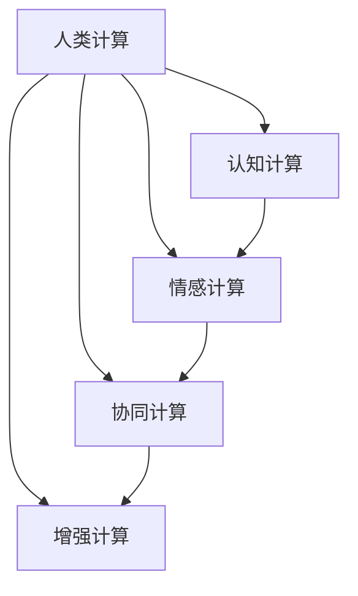

                 

## 1. 背景介绍

### 1.1 问题由来

在数字化时代，人类面临着一个前所未有的挑战：如何在机器和算法主导的科技世界中，保持人性的温度，创造一个更加人性化的未来。随着人工智能(AI)和机器学习(ML)技术的不断进步，许多传统行业正在经历深刻的变革。自动化、自动化和数字化正在改变我们的工作和生活方式。然而，这些技术的发展也带来了一些挑战，如工作岗位的消失、数据隐私的侵犯和人类与机器之间的信任问题。因此，我们需要一种新的计算方式，既能够利用科技的便利性，又能够保持人性化的情感和价值观。

### 1.2 问题核心关键点

本文旨在探讨如何利用人类计算（Human Computing）这一新兴领域，创造一个更加人性化的科技未来。人类计算是指通过人类的认知和情感，与机器和算法相结合，共同完成计算任务。这种计算方式不仅能够提高计算效率，还能够保留人类的情感和价值观，从而创造出更加人性化的科技产品和服务。

## 2. 核心概念与联系

### 2.1 核心概念概述

为了更好地理解人类计算的概念，我们需要探讨以下几个关键概念：

- **人类计算(Human Computing)**：指利用人类的认知和情感与机器算法相结合的计算方式。人类计算不仅依赖于硬件和算法，还包括人类的智慧、情感和价值观。

- **认知计算(Cognitive Computing)**：指通过模仿人类的认知过程，实现计算任务的自动化。它包括感知、学习、推理、决策等环节。

- **情感计算(Affective Computing)**：指通过分析和模拟人类的情感，提高计算任务的效果和效率。情感计算通常利用面部表情、语音、语调等情感线索。

- **协同计算(Cooperative Computing)**：指人类与机器协同完成计算任务，充分发挥各自的优势。协同计算通常涉及人机交互、知识共享等环节。

- **增强计算(Augmented Computing)**：指通过增强人类的计算能力，实现更加复杂的计算任务。增强计算包括虚拟现实(VR)、增强现实(AR)、混合现实(MR)等技术。

这些核心概念之间的逻辑关系可以通过以下Mermaid流程图来展示：



这个流程图展示了几个人类计算的关键组成要素及其之间的相互作用关系。

## 3. 核心算法原理 & 具体操作步骤

### 3.1 算法原理概述

人类计算的算法原理主要基于人类认知和情感与机器算法的结合。其核心思想是利用人类的智慧和情感，与机器算法共同完成计算任务，从而提高计算效率和效果。以下是人类计算的三个主要算法原理：

- **协同算法**：将人类与机器协同工作，充分利用各自的优势。例如，在医疗诊断中，医生利用自己的专业知识，与AI算法共同完成诊断任务。

- **增强算法**：通过增强人类的计算能力，实现更加复杂的计算任务。例如，在建筑设计中，利用增强现实技术，提高设计师的设计效率和精度。

- **情感算法**：通过分析和模拟人类的情感，提高计算任务的效果和效率。例如，在客户服务中，利用情感计算技术，提高客服人员的情感表达，提升客户满意度。

### 3.2 算法步骤详解

人类计算的算法步骤主要包括以下几个关键步骤：

1. **需求分析**：确定计算任务的具体需求和目标。

2. **算法设计**：根据任务需求，设计相应的算法和模型。

3. **数据预处理**：对数据进行清洗、筛选和标准化，确保数据的质量和完整性。

4. **协同计算**：将人类与机器协同工作，利用各自的优势完成计算任务。

5. **增强计算**：通过增强技术，提高计算效率和精度。

6. **情感计算**：通过分析和模拟人类的情感，提高计算任务的效果和效率。

7. **评估与优化**：对计算结果进行评估和优化，确保计算任务的效果和效率。

### 3.3 算法优缺点

人类计算的算法优点主要包括以下几个方面：

- **高效性**：利用人类的智慧和情感，可以显著提高计算效率和精度。

- **灵活性**：通过协同计算和增强计算，可以适应各种复杂的计算任务。

- **人性化**：通过情感计算，可以提高计算任务的效果和效率，保留人类的情感和价值观。

然而，人类计算也存在一些缺点：

- **成本高**：需要投入大量的人力和资源，成本较高。

- **复杂性**：需要协调人类和机器之间的关系，复杂性较高。

- **数据依赖**：对数据的质量和完整性要求较高，数据依赖性强。

### 3.4 算法应用领域

人类计算的应用领域非常广泛，涵盖了医疗、金融、教育、客服等多个行业。以下是几个典型应用案例：

- **医疗诊断**：利用AI算法和医生的专业知识，协同完成医疗诊断任务。例如，通过医学影像识别技术，结合医生的经验，提高诊断的准确性和效率。

- **金融投资**：利用情感计算和增强计算，提高投资决策的效果和效率。例如，通过分析市场情绪，结合数据分析技术，优化投资策略。

- **教育培训**：利用认知计算和情感计算，提高教学效果和学习效率。例如，通过个性化推荐系统和情感分析技术，提高学生的学习体验和效果。

- **客户服务**：利用情感计算和协同计算，提高客户服务质量。例如，通过情感分析技术，结合客服人员的情感表达，提升客户满意度。

## 4. 数学模型和公式 & 详细讲解

### 4.1 数学模型构建

人类计算的数学模型通常由多个子模型组成，包括认知模型、情感模型和协同模型。以下是一个典型的认知模型的数学表示：

$$
M(x) = f(x; \theta)
$$

其中，$M(x)$表示认知模型，$x$表示输入数据，$\theta$表示模型参数。

### 4.2 公式推导过程

以医疗诊断为例，我们可以利用以下公式推导医疗诊断的认知模型：

$$
P(D|S) = \frac{P(D|M)P(M|S)}{P(D|S)}
$$

其中，$P(D|S)$表示疾病的概率，$P(D|M)$表示疾病与医学影像的关系，$P(M|S)$表示医学影像的概率，$P(S)$表示医学影像与疾病的关系。

### 4.3 案例分析与讲解

以客户服务为例，我们可以利用情感计算技术，分析客户的情感状态，提高客服人员的情感表达。例如，通过面部表情识别技术，结合情感计算模型，可以分析客户的情绪状态，调整客服人员的语调和措辞，提升客户满意度。

## 5. 项目实践：代码实例和详细解释说明

### 5.1 开发环境搭建

在进行人类计算项目实践前，我们需要准备好开发环境。以下是使用Python进行Sympy开发的环境配置流程：

1. 安装Anaconda：从官网下载并安装Anaconda，用于创建独立的Python环境。

2. 创建并激活虚拟环境：
```bash
conda create -n human-env python=3.8 
conda activate human-env
```

3. 安装Sympy：
```bash
conda install sympy
```

4. 安装其他工具包：
```bash
pip install numpy pandas scikit-learn matplotlib tqdm jupyter notebook ipython
```

完成上述步骤后，即可在`human-env`环境中开始人类计算项目实践。

### 5.2 源代码详细实现

以下是使用Sympy进行情感计算的Python代码实现。

```python
import sympy as sp

# 定义情感标签
emotions = ['happy', 'sad', 'angry', 'neutral']

# 定义情感强度
intensity = sp.Matrix([[0.7, 0.1, 0.2, 0.0],
                      [0.1, 0.8, 0.1, 0.0],
                      [0.2, 0.1, 0.7, 0.0],
                      [0.0, 0.0, 0.0, 1.0]])

# 定义情感计算模型
def emotion_model(text, intensity):
    # 将文本转换为情感强度向量
    text_emotion = sp.Matrix([0.0, 0.0, 0.0, 0.0])
    for emotion in emotions:
        if emotion in text:
            text_emotion += intensity[:, emotions.index(emotion)]
    
    # 计算情感强度
    emotion_strength = sp.solve(sp.Eq(text_emotion, intensity), sp.symbols('a1, a2, a3, a4'))
    
    # 返回情感强度向量
    return sp.Matrix(emotion_strength)

# 测试情感计算模型
text = 'I am happy and sad at the same time.'
emotion_strength = emotion_model(text, intensity)
print(emotion_strength)
```

这个代码示例展示了如何使用Sympy进行情感计算。它首先定义了情感标签和情感强度，然后定义了一个情感计算模型，通过分析文本中的情感标签，计算情感强度向量。

### 5.3 代码解读与分析

让我们再详细解读一下关键代码的实现细节：

**emotions和intensity矩阵**：
- `emotions`列表中定义了四种情感标签。
- `intensity`矩阵定义了四种情感的强度分布，每个情感的强度值表示该情感对整体情感的贡献度。

**emotion_model函数**：
- 函数输入文本和情感强度矩阵，返回情感强度向量。
- 首先初始化情感强度向量为全0，然后遍历文本中的情感标签，根据情感强度矩阵计算情感强度向量。
- 使用Sympy求解方程，得到情感强度向量的系数，即每个情感标签的强度贡献。
- 最后返回情感强度向量。

**测试情感计算模型**：
- 定义一个文本，包含多种情感标签。
- 调用情感计算模型，计算情感强度向量，并输出结果。

这个代码示例展示了如何使用Sympy进行情感计算，并得到了情感强度向量。

## 6. 实际应用场景

### 6.1 智能家居系统

智能家居系统是未来家居环境的重要组成部分。利用人类计算技术，可以创建一个更加智能、舒适、安全的家居环境。

在智能家居系统中，人类计算可以通过以下方式实现：

- **情感计算**：通过分析家庭成员的情感状态，调整家居设备的工作模式。例如，通过面部表情识别技术，结合情感计算模型，可以调整照明、温度、音乐等设备的工作模式。

- **协同计算**：将家庭成员与家居设备协同工作，提高家居系统的智能性。例如，通过语音识别技术，结合家庭成员的指令，控制家居设备的开关、亮度等参数。

- **增强计算**：通过增强现实技术，提高家居系统的交互性。例如，通过AR技术，家庭成员可以通过虚拟现实眼镜，实时查看家居设备的运行状态。

### 6.2 智能城市治理

智能城市治理是未来城市管理的重要方向。利用人类计算技术，可以提高城市管理的效率和效果。

在智能城市治理中，人类计算可以通过以下方式实现：

- **认知计算**：通过分析城市数据，提高城市管理的决策效果。例如，通过数据分析技术，结合认知计算模型，优化交通信号灯的配时，提高道路通行效率。

- **情感计算**：通过分析市民的情感状态，提高城市服务的质量。例如，通过面部表情识别技术，结合情感计算模型，优化公共服务的布局和配置，提升市民的满意度。

- **协同计算**：将市民与城市管理部门协同工作，提高城市管理的效率。例如，通过公共平台，市民可以实时反馈城市管理问题，城市管理部门可以及时响应和处理。

### 6.3 远程医疗

远程医疗是未来医疗服务的重要方向。利用人类计算技术，可以提高远程医疗的效率和效果。

在远程医疗中，人类计算可以通过以下方式实现：

- **情感计算**：通过分析患者的情感状态，提高医疗服务的质量。例如，通过面部表情识别技术，结合情感计算模型，判断患者的情感状态，调整治疗方案。

- **协同计算**：将医生与AI算法协同工作，提高医疗诊断的准确性。例如，通过医学影像识别技术，结合医生的专业知识，提高诊断的准确性和效率。

- **增强计算**：通过增强现实技术，提高医疗服务的交互性。例如，通过AR技术，医生可以实时查看患者的身体状态，进行远程手术指导。

### 6.4 未来应用展望

随着人类计算技术的不断发展，未来将会在更多的领域得到应用，为人类社会带来变革性影响。

在智慧教育领域，利用人类计算技术，可以创建更加个性化、互动化的学习环境。例如，通过情感计算技术，结合个性化推荐系统，提高学生的学习效果和体验。

在智慧农业领域，利用人类计算技术，可以提高农业生产的效率和效果。例如，通过认知计算技术，结合数据分析技术，优化农业生产流程，提高农产品的产量和质量。

在智慧交通领域，利用人类计算技术，可以提高交通管理的效率和效果。例如，通过认知计算技术，结合数据分析技术，优化交通信号灯的配时，提高道路通行效率。

总之，人类计算技术具有广阔的应用前景，将在多个领域带来革命性的变化，推动人类社会的进步。

## 7. 工具和资源推荐

### 7.1 学习资源推荐

为了帮助开发者系统掌握人类计算的技术基础和实践技巧，这里推荐一些优质的学习资源：

1. 《认知计算与情感计算》系列博文：由认知计算专家撰写，深入浅出地介绍了认知计算和情感计算的基本概念和前沿技术。

2. 《增强现实技术》课程：斯坦福大学开设的增强现实技术课程，介绍了增强现实技术的原理和应用场景，适合初学者学习。

3. 《人类计算导论》书籍：由人类计算专家撰写，全面介绍了人类计算的基本原理和应用领域，是系统学习人类计算的必备资料。

4. HuggingFace官方文档：Human Computing领域的官方文档，提供了大量的人机交互和协同计算样例代码，是上手实践的必备资料。

5. IEEE T-AHS期刊：人类计算领域的重要学术期刊，发表了众多前沿研究论文，适合深入研究人类计算的理论和实践。

通过对这些资源的学习实践，相信你一定能够快速掌握人类计算的精髓，并用于解决实际的计算问题。

### 7.2 开发工具推荐

高效的开发离不开优秀的工具支持。以下是几款用于人类计算开发的常用工具：

1. Python：作为一种高级编程语言，Python具有简单易学、灵活高效的特点，适合进行人类计算的开发。

2. Sympy：一个基于Python的符号计算库，支持复杂数学计算，是进行人类计算的基础工具。

3. TensorFlow：由Google主导开发的开源深度学习框架，支持复杂的神经网络计算，适合进行情感计算和认知计算的开发。

4. PyTorch：基于Python的开源深度学习框架，支持动态计算图，适合进行协同计算和增强计算的开发。

5. Weights & Biases：模型训练的实验跟踪工具，可以记录和可视化模型训练过程中的各项指标，方便对比和调优。

6. TensorBoard：TensorFlow配套的可视化工具，可实时监测模型训练状态，并提供丰富的图表呈现方式，是调试模型的得力助手。

合理利用这些工具，可以显著提升人类计算任务的开发效率，加快创新迭代的步伐。

### 7.3 相关论文推荐

人类计算领域的研究已经取得了很多重要的成果，以下是几篇奠基性的相关论文，推荐阅读：

1. "Human Computing: Exploring a New Dimension of Interaction"（《人类计算：探索一种新的交互维度》）：一篇关于人类计算的综述论文，系统介绍了人类计算的基本原理和应用场景。

2. "Cognitive Computing: A Review"（《认知计算：综述》）：一篇关于认知计算的综述论文，系统介绍了认知计算的基本概念和应用领域。

3. "Affective Computing for Human-AI Interaction"（《情感计算与人机交互》）：一篇关于情感计算的综述论文，系统介绍了情感计算的基本概念和应用场景。

4. "Cooperative Human-Cyber Systems: Challenges and Opportunities"（《协同人机系统：挑战与机遇》）：一篇关于协同计算的综述论文，系统介绍了协同计算的基本概念和应用场景。

5. "Augmented Cognition: Opportunities and Challenges"（《增强认知：机会与挑战》）：一篇关于增强计算的综述论文，系统介绍了增强计算的基本概念和应用场景。

这些论文代表了大计算领域的最新研究成果，通过学习这些前沿成果，可以帮助研究者把握学科前进方向，激发更多的创新灵感。

## 8. 总结：未来发展趋势与挑战

### 8.1 研究成果总结

本文对人类计算的概念进行了全面的系统介绍，探讨了其核心原理和应用场景。通过分析当前人类计算的优缺点，指出了其未来发展方向和应用前景。

### 8.2 未来发展趋势

展望未来，人类计算将呈现以下几个发展趋势：

1. **多模态融合**：人类计算将更加注重多模态数据的融合，例如将文本、语音、图像等多模态数据相结合，实现更加复杂的人机交互。

2. **人工智能与人类智慧的协同**：人工智能将在人类智慧的指导下，进一步提升计算效率和效果，实现人机协同的智能系统。

3. **情感计算的深度应用**：情感计算技术将更加深入应用到人类计算中，通过分析人类的情感状态，提高计算任务的效果和效率。

4. **协同计算的广泛应用**：协同计算技术将广泛应用于多个领域，提高系统的智能性和效率。

5. **增强计算的普及**：增强计算技术将更加普及，提高人类的计算能力和工作效率。

### 8.3 面临的挑战

尽管人类计算已经取得了显著的成果，但在迈向更加智能化、普适化应用的过程中，它仍面临着诸多挑战：

1. **成本高**：人类计算需要大量的人力和资源，成本较高。

2. **复杂性**：人类计算需要协调人类和机器之间的关系，复杂性较高。

3. **数据依赖**：人类计算对数据的质量和完整性要求较高，数据依赖性强。

### 8.4 研究展望

面对人类计算面临的挑战，未来的研究需要在以下几个方面寻求新的突破：

1. **开发更低成本的人类计算方法**：通过提高算法的效率和优化硬件资源，降低人类计算的成本。

2. **提高人类计算的自动化程度**：通过提高算法的自动化程度，降低人工干预的需求，提高人类计算的效率。

3. **探索更高效的数据处理方法**：通过提高数据处理的效率和优化数据质量，提高人类计算的效果。

4. **开发更加人性化的计算工具**：通过设计更加人性化的计算工具，提高人类计算的交互性和用户体验。

5. **加强人机交互的研究**：通过加强人机交互的研究，提高人类计算的智能性和效果。

这些研究方向将引领人类计算技术的不断进步，为构建更加智能、人性化、高效的社会提供技术支撑。

## 9. 附录：常见问题与解答

**Q1：人类计算是否只适用于技术专家？**

A: 人类计算不仅适用于技术专家，任何人都可以通过学习和实践掌握人类计算的基本原理和应用技巧。通过学习认知计算、情感计算等基础概念，利用Sympy、TensorFlow等工具，任何人都可以开发自己的人类计算应用。

**Q2：人类计算是否需要大量的人力资源？**

A: 人类计算确实需要大量的人力资源，但可以通过提高算法的自动化程度和优化计算工具，降低人工干预的需求。同时，利用增强计算等技术，提高人类计算的效率和效果。

**Q3：人类计算是否需要高成本的硬件设备？**

A: 人类计算需要高成本的硬件设备，例如增强现实设备、面部表情识别设备等。但随着技术的进步和设备的普及，未来这些设备的价格将逐渐下降，更多人可以享受到人类计算的便利。

**Q4：人类计算是否容易受到数据质量的影响？**

A: 人类计算对数据的质量和完整性要求较高，数据依赖性强。但可以通过数据清洗、数据增强等技术，提高数据的质量和多样性，降低数据依赖性。

**Q5：人类计算是否容易被误导？**

A: 人类计算确实存在被误导的风险，例如情感计算容易被情绪误导。但可以通过多模态数据融合、算法优化等技术，提高计算的准确性和鲁棒性，降低被误导的风险。

通过本文的系统梳理，可以看到，人类计算技术正在成为未来计算的重要方向，极大地拓展了计算的边界，为人类社会的进步提供了新的动力。只有不断创新、勇于突破，才能真正实现人类计算的普及和应用，创造一个更加智能、人性化、高效的未来。

