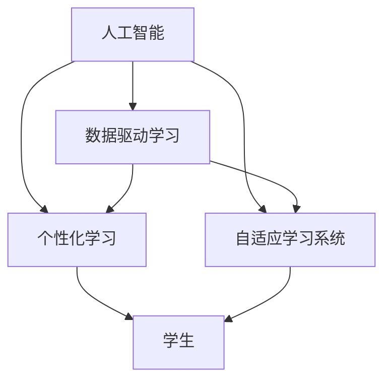
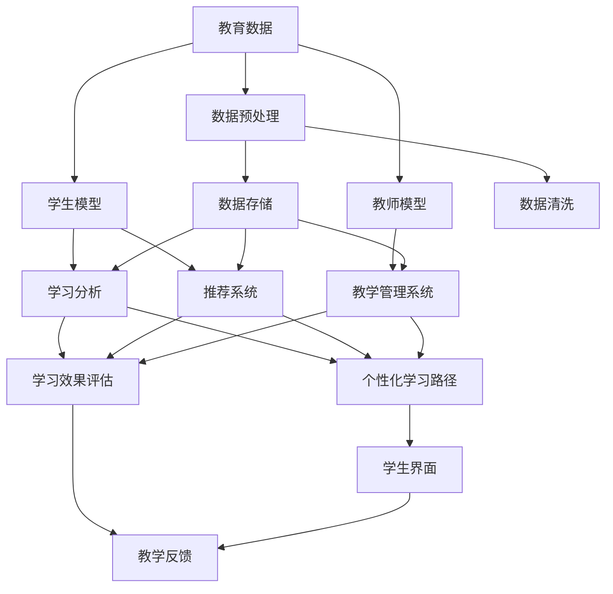

                 

# 人类计算：在AI时代增强教育

在人工智能(AI)时代，如何利用技术手段提升教育质量，是全球教育工作者关注的焦点。人工智能不仅能够辅助教师进行教学管理，还能够为学生提供个性化的学习体验。本文将从背景介绍、核心概念、算法原理及具体操作步骤、数学模型与公式、项目实践、实际应用场景、工具与资源推荐、未来发展趋势与挑战、常见问题解答等多个方面，深入探讨AI在教育中的应用，特别是基于人工智能的"人类计算"如何增强教育。

## 1. 背景介绍

### 1.1 教育现状与问题

当前的教育体系，特别是在大规模、高强度的学校环境中，面临着诸多挑战。教师负担过重、学生个性化需求难以满足、教学资源分配不均等问题日益突出。同时，学生面临来自社会的巨大压力，需要在标准化考试中脱颖而出，才能获取优质教育资源。如何提升教育质量，使教育更加公平、高效、个性化，成为亟待解决的问题。

### 1.2 人工智能在教育中的应用

人工智能在教育中的应用，涵盖了智能辅导、作业批改、个性化推荐、学习分析等多个方面。通过AI技术，教师可以高效管理教学资源，学生可以得到个性化的学习指导。本文将重点探讨基于AI的"人类计算"方法，如何帮助教育工作者更好地完成教学任务，提高学生的学习效率和满意度。

## 2. 核心概念与联系

### 2.1 核心概念概述

"人类计算"指的是利用AI技术，辅助人类在教育过程中进行更高效、更精准的计算和分析。核心概念包括：

- 人工智能(AI)：通过模拟人类智能，实现自动化、智能化计算。
- 数据驱动学习：以学生的学习数据为基础，进行个性化推荐和分析。
- 个性化学习：根据学生的学习习惯和能力，提供量身定制的学习内容和路径。
- 自适应学习系统：能够根据学生的学习情况，动态调整教学内容和难度。

这些概念通过以下Mermaid流程图展示它们的联系：



### 2.2 核心概念原理和架构的 Mermaid 流程图

为了更直观地理解这些概念的联系，以下是核心概念原理和架构的Mermaid流程图：



## 3. 核心算法原理 & 具体操作步骤

### 3.1 算法原理概述

基于人工智能的"人类计算"方法，通过数据驱动的方式，为教育工作者和学生提供更高效、个性化的学习体验。其主要原理包括：

- **数据驱动**：收集学生的学习数据，如成绩、行为、兴趣等，作为训练和评估模型的基础。
- **模型训练**：使用机器学习模型对学生和教师的学习行为进行建模，预测学习效果和需求。
- **推荐系统**：根据学生的学习数据，推荐个性化的学习内容和路径。
- **自适应学习**：根据学生的学习情况，动态调整学习内容和难度。

### 3.2 算法步骤详解

基于人工智能的"人类计算"方法的具体操作步骤如下：

1. **数据收集与预处理**：收集学生的学习数据，包括成绩、行为、兴趣等，并对其进行清洗和格式化，以便进行后续分析。
2. **模型训练**：使用机器学习算法，如决策树、随机森林、神经网络等，训练学生和教师的模型，预测学习效果和需求。
3. **推荐系统构建**：根据学生模型和教师模型，构建推荐系统，推荐个性化的学习内容和路径。
4. **自适应学习系统实现**：根据学生的学习情况，动态调整学习内容和难度，提高学习效果。

### 3.3 算法优缺点

基于人工智能的"人类计算"方法具有以下优点：

- **高效性**：通过数据驱动的方式，能够快速识别学生的学习需求，提供个性化的学习指导。
- **灵活性**：能够根据学生的学习情况，动态调整学习内容和难度，提高学习效率。
- **自适应性**：能够适应不同学生的学习风格和节奏，提升学习体验。

但该方法也存在以下缺点：

- **数据隐私**：收集和分析学生数据，涉及隐私保护问题，需要严格遵守相关法规。
- **数据质量**：数据的质量直接影响模型的准确性和有效性，需要确保数据完整性和准确性。
- **算法复杂度**：算法设计复杂，模型训练需要大量计算资源。

### 3.4 算法应用领域

基于人工智能的"人类计算"方法，在教育领域有着广泛的应用，包括：

- **智能辅导**：通过AI助手，提供24小时在线学习支持。
- **作业批改**：自动批改作业，减轻教师负担。
- **个性化推荐**：根据学生的学习数据，推荐适合的教材和资源。
- **学习分析**：分析学生的学习行为和效果，提供学习建议。
- **自适应学习系统**：根据学生的学习情况，动态调整学习内容和难度。

## 4. 数学模型和公式 & 详细讲解 & 举例说明

### 4.1 数学模型构建

基于人工智能的"人类计算"方法，主要依赖于机器学习模型的构建和训练。常见的模型包括决策树、随机森林、神经网络等。

以神经网络为例，模型的基本结构包括输入层、隐藏层和输出层。假设输入层有$m$个特征，隐藏层有$n$个神经元，输出层有$k$个节点。模型的输入为$\mathbf{x} \in \mathbb{R}^m$，输出为$\mathbf{y} \in \mathbb{R}^k$。模型的目标是最小化损失函数$L$：

$$
L(\mathbf{w}, \mathbf{b}) = \frac{1}{N}\sum_{i=1}^N ||\mathbf{y}_i - \mathbf{f}(\mathbf{x}_i, \mathbf{w}, \mathbf{b})||^2
$$

其中$\mathbf{w}$和$\mathbf{b}$分别为权重和偏置，$\mathbf{f}$为神经网络的前向传播函数，$\mathbf{y}_i$为第$i$个样本的真实输出。

### 4.2 公式推导过程

以一个简单的两层神经网络为例，推导其前向传播和反向传播算法：

假设输入$\mathbf{x} = [x_1, x_2, ..., x_m]$，隐藏层有$n$个神经元，输出层有$k$个节点。神经网络的前向传播算法如下：

$$
z_1 = \mathbf{w}_{11}\mathbf{x} + \mathbf{b}_1
$$
$$
a_1 = \sigma(z_1)
$$
$$
z_2 = \mathbf{w}_{21}a_1 + \mathbf{b}_2
$$
$$
a_2 = \sigma(z_2)
$$
$$
\mathbf{y} = \mathbf{w}_{31}a_2 + \mathbf{b}_3
$$

其中$\sigma$为激活函数，如Sigmoid函数或ReLU函数。

神经网络的反向传播算法如下：

$$
\frac{\partial L}{\partial \mathbf{w}_{31}} = \mathbf{a}_2 \mathbf{y}^T
$$
$$
\frac{\partial L}{\partial \mathbf{b}_3} = \mathbf{y}
$$
$$
\frac{\partial L}{\partial \mathbf{w}_{21}} = \mathbf{a}_1 \frac{\partial L}{\partial z_2}
$$
$$
\frac{\partial L}{\partial \mathbf{b}_2} = \frac{\partial L}{\partial z_2}
$$
$$
\frac{\partial L}{\partial \mathbf{w}_{11}} = \mathbf{x}^T \frac{\partial L}{\partial z_1}
$$
$$
\frac{\partial L}{\partial \mathbf{b}_1} = \frac{\partial L}{\partial z_1}
$$

### 4.3 案例分析与讲解

假设有一个包含100个学生的数据集，每个学生有10个特征，包括年龄、性别、成绩等。使用随机森林模型进行训练，预测学生的学习效果。具体步骤如下：

1. **数据准备**：收集学生数据，包括年龄、性别、成绩等，并对其进行预处理，如归一化、缺失值处理等。
2. **模型训练**：使用随机森林算法对学生数据进行训练，得到学生模型。
3. **预测与评估**：使用学生模型对新学生的数据进行预测，并评估预测效果。

## 5. 项目实践：代码实例和详细解释说明

### 5.1 开发环境搭建

在进行项目实践前，需要先搭建好开发环境。以下是基于Python的开发环境配置步骤：

1. 安装Anaconda：从官网下载并安装Anaconda，用于创建独立的Python环境。
```bash
conda create -n ai_env python=3.8
conda activate ai_env
```

2. 安装必要的Python库，如NumPy、Pandas、Scikit-learn、TensorFlow等。
```bash
pip install numpy pandas scikit-learn tensorflow
```

3. 安装Jupyter Notebook：用于编写和运行Python代码。
```bash
pip install jupyter notebook
```

### 5.2 源代码详细实现

以下是一个基于神经网络的"人类计算"项目实践代码示例，详细解释其功能和使用。

```python
import numpy as np
import tensorflow as tf
from sklearn.model_selection import train_test_split
from sklearn.preprocessing import StandardScaler

# 数据准备
data = np.random.rand(100, 10)
labels = np.random.randint(0, 2, 100)

# 数据预处理
scaler = StandardScaler()
data = scaler.fit_transform(data)

# 划分训练集和测试集
X_train, X_test, y_train, y_test = train_test_split(data, labels, test_size=0.2)

# 定义模型
model = tf.keras.Sequential([
    tf.keras.layers.Dense(64, activation='relu', input_shape=(10,)),
    tf.keras.layers.Dense(32, activation='relu'),
    tf.keras.layers.Dense(1, activation='sigmoid')
])

# 编译模型
model.compile(optimizer='adam', loss='binary_crossentropy', metrics=['accuracy'])

# 训练模型
model.fit(X_train, y_train, epochs=10, batch_size=32, validation_data=(X_test, y_test))

# 评估模型
loss, accuracy = model.evaluate(X_test, y_test)
print(f'Test loss: {loss}, Test accuracy: {accuracy}')
```

### 5.3 代码解读与分析

**代码详细解释**：

1. **数据准备**：生成100个学生的10个特征，并随机生成标签（0或1）。
2. **数据预处理**：使用标准化方法对特征进行归一化处理。
3. **划分训练集和测试集**：将数据集划分为训练集和测试集，用于模型训练和评估。
4. **定义模型**：使用TensorFlow定义一个简单的神经网络模型，包括两个隐藏层和一个输出层。
5. **编译模型**：设置优化器、损失函数和评估指标。
6. **训练模型**：使用训练集对模型进行训练，设置训练轮数和批量大小。
7. **评估模型**：使用测试集评估模型性能，输出损失和准确率。

## 6. 实际应用场景

### 6.1 智能辅导系统

基于人工智能的"人类计算"方法，可以构建智能辅导系统，为学生提供24小时在线学习支持。智能辅导系统通过分析学生的学习数据，提供个性化的学习建议和指导。具体应用场景如下：

1. **学习行为分析**：分析学生的学习行为，识别学习难点和薄弱环节。
2. **智能答疑**：通过智能助手，回答学生的问题，提供解决方案。
3. **学习路径推荐**：根据学生的学习情况，推荐个性化的学习路径和资源。

### 6.2 作业批改系统

传统的作业批改耗时耗力，使用基于人工智能的"人类计算"方法，可以自动批改作业，减轻教师的负担。具体应用场景如下：

1. **自动批改**：使用模型对学生的作业进行自动批改，给出评分和反馈。
2. **错误分析**：分析学生的错误原因，提供有针对性的改进建议。
3. **进度跟踪**：跟踪学生的作业提交和批改进度，及时提醒教师。

### 6.3 个性化推荐系统

基于人工智能的"人类计算"方法，可以构建个性化推荐系统，为学生推荐适合的教材和资源。具体应用场景如下：

1. **学习资源推荐**：根据学生的学习兴趣和需求，推荐适合的教材和视频资源。
2. **学习路径优化**：优化学习路径，帮助学生高效学习。
3. **学习效果评估**：评估学生的学习效果，提供改进建议。

## 7. 工具和资源推荐

### 7.1 学习资源推荐

以下是一些推荐的AI教育学习资源：

1. **Coursera**：提供大量人工智能和机器学习的课程，覆盖从基础到高级的内容。
2. **edX**：提供来自世界顶级大学的人工智能课程，涵盖数据科学、机器学习、深度学习等。
3. **Kaggle**：提供大量开源数据集和竞赛，帮助学生实践AI技术。
4. **Udacity**：提供人工智能工程师纳米学位课程，涵盖机器学习、深度学习、计算机视觉等领域。
5. **Arxiv**：提供最新的人工智能研究论文，了解AI领域的最新进展。

### 7.2 开发工具推荐

以下是一些推荐的AI教育开发工具：

1. **TensorFlow**：由Google开发的深度学习框架，支持大规模分布式计算，适用于大规模AI应用。
2. **PyTorch**：由Facebook开发的深度学习框架，灵活易用，适用于研究型开发。
3. **Jupyter Notebook**：轻量级的开发环境，支持实时代码编写和执行。
4. **Python**：通用的编程语言，支持AI应用的开发和部署。
5. **Git**：版本控制工具，支持团队协作和代码管理。

### 7.3 相关论文推荐

以下是几篇关于AI在教育中应用的经典论文：

1. **"Learning to Optimize" by Li et al.**：探讨使用深度强化学习优化学习策略的方法。
2. **"Scalable Adaptive Learning" by Hermann et al.**：介绍自适应学习系统的构建和优化。
3. **"Learning from Instruction Guides" by Gao et al.**：研究基于指令的智能学习系统，提高学生理解力。
4. **"Robust Optimization of Online Learning Platforms" by Cawley et al.**：探讨在线学习平台的优化问题，提升学习效果。
5. **"Personalized Learning via Learning Analytics" by Shen et al.**：研究学习分析在个性化学习中的应用。

## 8. 总结：未来发展趋势与挑战

### 8.1 研究成果总结

本文探讨了基于人工智能的"人类计算"方法在教育中的应用，分析了其原理和操作步骤。通过案例分析和代码实现，详细介绍了如何构建智能辅导、作业批改、个性化推荐等系统。同时，推荐了一些学习资源和开发工具，并展望了未来发展趋势和面临的挑战。

### 8.2 未来发展趋势

未来，基于人工智能的"人类计算"方法将迎来更多的发展机遇和挑战：

1. **数据驱动学习**：随着数据获取和处理技术的进步，数据驱动学习将更加精准和高效。
2. **个性化学习**：基于AI的个性化学习将更加普及，能够适应不同学生的学习需求。
3. **自适应学习系统**：自适应学习系统将更加智能化，能够动态调整学习内容和难度。
4. **混合式学习**：线上线下混合学习模式将更加普及，结合传统教育资源和AI技术。
5. **学习分析与优化**：学习分析将更加深入，优化学习过程，提高学习效果。

### 8.3 面临的挑战

基于人工智能的"人类计算"方法在教育中的应用，仍面临诸多挑战：

1. **数据隐私**：学生数据的隐私保护问题，需要严格遵守相关法规。
2. **数据质量**：数据的质量直接影响模型的准确性和有效性，需要确保数据完整性和准确性。
3. **算法复杂度**：算法设计复杂，模型训练需要大量计算资源。
4. **技术普及**：AI技术在教育中的普及，需要克服技术壁垒和资源限制。
5. **教学信任**：学生和教师对AI技术的信任问题，需要建立透明和安全的系统。

### 8.4 研究展望

未来的研究需要在以下几个方面进行探索：

1. **混合式学习**：结合线上和线下的教学模式，提供更灵活和多样化的学习体验。
2. **社会化学习**：利用AI技术，促进学生之间的交流和协作。
3. **公平教育**：确保AI技术在教育中的公平性，避免数字鸿沟。
4. **终身学习**：推动终身学习理念，利用AI技术提升个人学习能力。
5. **伦理与法律**：研究AI在教育中的伦理和法律问题，保障学生和教师的权益。

## 9. 附录：常见问题与解答

**Q1: 基于人工智能的"人类计算"方法如何应用于教育？**

A: 基于人工智能的"人类计算"方法可以通过收集和分析学生的数据，构建智能辅导、作业批改、个性化推荐等系统，提升教育效果和效率。

**Q2: 如何确保学生数据的隐私和安全？**

A: 在使用学生数据时，需要严格遵守相关法律法规，如GDPR、CCPA等。同时，使用数据加密、访问控制等技术手段，保障学生数据的隐私和安全。

**Q3: 如何提高算法的准确性和效率？**

A: 使用更多的数据进行训练，优化模型架构和算法，采用分布式计算和加速技术，提高算法的准确性和效率。

**Q4: 如何应对学习者多样性的需求？**

A: 通过数据驱动学习，构建自适应学习系统，能够根据学生的学习情况，动态调整学习内容和难度，适应不同学生的需求。

**Q5: 未来AI在教育中的应用前景如何？**

A: 未来，基于人工智能的"人类计算"方法将在教育中发挥越来越重要的作用，提升教育质量和效率，推动教育公平和创新。

---

作者：禅与计算机程序设计艺术 / Zen and the Art of Computer Programming

