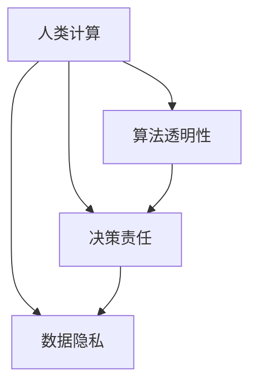

                 

# 人类计算：在AI时代增强道德意识

> 关键词：人类计算,人工智能,道德伦理,算法透明性,决策责任,数据隐私

## 1. 背景介绍

### 1.1 问题由来
人工智能（AI）技术的迅猛发展，正在重塑我们的社会和工作方式。然而，AI的道德问题也愈发引人关注。AI系统在决策、隐私、公平、责任等方面存在诸多挑战，亟需一套系统化的道德治理机制。

在此背景下，人类计算（Human-in-the-Loop, HiTL）方法应运而生。其核心思想是通过人机协同，确保AI系统在关键决策过程中能够被人类监督和解释，从而增强其道德性和透明度。人类计算方法不仅能提升AI的决策质量，还能有效防范技术滥用，保障数据隐私，确保责任归属。

### 1.2 问题核心关键点
- **道德治理**：如何通过人机协同，确保AI系统的决策符合伦理道德规范。
- **算法透明性**：如何提升AI算法的可解释性和可理解性，增强人类对AI决策的信任。
- **决策责任**：如何确定AI系统在决策过程中的责任归属，避免滥用和误用。
- **数据隐私**：如何在保障AI系统性能的同时，确保个人数据的安全和隐私。

## 2. 核心概念与联系

### 2.1 核心概念概述

为更好地理解人类计算方法，本节将介绍几个密切相关的核心概念：

- **人类计算**：即HiTL方法，强调人在AI系统决策过程中的监督和解释作用，确保AI的决策符合人类价值观和伦理规范。
- **算法透明性**：指AI算法的可解释性，使得人能够理解和审查AI的决策过程。
- **决策责任**：指AI在决策过程中应承担的责任，包括法律责任和伦理责任。
- **数据隐私**：指个人数据的保护，确保其不被滥用或泄露。

这些核心概念之间的逻辑关系可以通过以下Mermaid流程图来展示：



这个流程图展示了人类计算方法与其他核心概念之间的关系：

1. 人类计算依赖于算法透明性，只有透明的算法才能确保人类可以理解并监督AI的决策。
2. 算法透明性依赖于决策责任，透明算法能够帮助确定AI决策的责任归属。
3. 决策责任的确定有助于数据隐私的保护，确保数据不被滥用。
4. 数据隐私的保障反过来又增强了AI算法的透明度和决策责任。

这些概念共同构成了AI系统道德治理的基础，确保AI技术能够以负责任、透明的方式服务于人类社会。

## 3. 核心算法原理 & 具体操作步骤
### 3.1 算法原理概述

人类计算方法基于人机协同的原则，强调在关键决策过程中引入人类的监督和解释。其实现步骤如下：

1. **数据准备**：收集、清洗、标注用于训练AI系统的数据，确保数据的代表性和多样性。
2. **模型训练**：利用标注数据训练AI模型，使其能够自动提取特征并进行预测。
3. **决策验证**：在AI模型输出决策时，引入人类专家进行复核和解释，确保决策的合理性。
4. **反馈调整**：将人类专家的反馈用于调整AI模型的参数和决策规则，逐步提升AI系统的性能和可靠性。
5. **合规检查**：确保AI系统的决策过程符合法律法规和伦理标准，避免技术滥用。

### 3.2 算法步骤详解

以下我们将详细介绍人类计算方法的详细步骤：

**Step 1: 数据准备**

- **数据收集**：从不同渠道收集用于训练和验证AI系统的数据。确保数据的多样性和代表性，避免偏见和歧视。
- **数据清洗**：对数据进行去重、去噪、填补缺失值等处理，确保数据质量。
- **数据标注**：对数据进行标注，生成用于监督AI训练的监督数据。标注过程应由具有专业知识的人类专家完成，确保标注的准确性。

**Step 2: 模型训练**

- **选择模型**：根据任务特点选择合适的AI模型，如深度学习、强化学习等。
- **参数调整**：根据任务的复杂度和数据规模，调整模型的参数和超参数，进行模型选择和调优。
- **模型训练**：利用标注数据对AI模型进行训练，使其能够学习到数据的特征和规律。

**Step 3: 决策验证**

- **决策输出**：AI模型根据输入数据生成决策输出。
- **人类复核**：引入人类专家对AI决策进行复核，确保决策的合理性和公平性。
- **反馈迭代**：根据人类专家的反馈，调整AI模型的参数和规则，逐步提升决策质量。

**Step 4: 合规检查**

- **法律法规**：确保AI系统的决策过程符合国家法律法规，避免技术滥用和误用。
- **伦理审查**：引入伦理专家对AI系统的决策过程进行审查，确保其符合社会伦理规范。

### 3.3 算法优缺点

人类计算方法具有以下优点：
1. 增强道德性：通过人类专家的监督和解释，确保AI系统的决策符合伦理道德规范。
2. 提升透明性：人类计算方法要求算法的透明性和可解释性，增强了人类对AI决策的理解和信任。
3. 保障责任归属：通过明确决策责任，确保AI系统的决策可追溯和责任可归。
4. 数据隐私保护：在保障AI系统性能的同时，确保数据的安全和隐私。

但该方法也存在一些局限性：
1. 数据标注成本高：数据标注需依赖专业知识的人类专家，成本较高。
2. 决策过程复杂：人类计算要求在每个决策过程中引入人类监督，增加了决策流程的复杂性。
3. 人工干预可能引入偏差：人类专家的决策可能受到主观偏见的影响，需要机制来防止这些偏差。

尽管存在这些局限性，但人类计算方法在大规模AI应用中仍具有重要价值，特别是在需要高可靠性和高道德性的场景中。

### 3.4 算法应用领域

人类计算方法适用于各种需要高道德性和透明性的AI应用场景，例如：

- **金融风险评估**：在金融风险评估中，AI系统需要处理大量敏感数据。通过人类计算方法，确保AI决策的公平性和透明度。
- **医疗诊断辅助**：在医疗诊断中，AI系统可能影响患者的生命健康。通过引入人类专家的监督，确保AI诊断的可靠性和道德性。
- **司法判决辅助**：在司法判决中，AI系统可能影响公正的判决结果。通过人类计算方法，确保AI决策的公正性和可解释性。
- **公共安全监控**：在公共安全监控中，AI系统需要实时处理大量数据。通过人类计算方法，确保AI决策的合法性和道德性。

## 4. 数学模型和公式 & 详细讲解
### 4.1 数学模型构建

人类计算方法中的关键决策过程可以通过数学模型进行形式化表示。

设AI系统输入为 $x$，决策输出为 $y$。假设人类专家的复核结果为 $z$，则决策过程可以用以下方程描述：

$$
y = f(x, \theta) \quad \text{(1)}
$$

其中 $f$ 为AI模型的决策函数， $\theta$ 为模型的参数。

引入人类专家后，决策过程变为：

$$
y = g(z, f(x, \theta)) \quad \text{(2)}
$$

其中 $g$ 为人类专家的决策函数，将人类专家的复核结果 $z$ 和AI系统的决策结果 $f(x, \theta)$ 结合起来。

### 4.2 公式推导过程

在方程(2)中，假设 $z$ 为二元变量，$z=1$ 表示专家复核同意AI决策，$z=0$ 表示专家复核不同意AI决策。则专家复核的过程可以表示为：

$$
z = h(f(x, \theta), y) \quad \text{(3)}
$$

其中 $h$ 为专家复核函数，将AI系统的决策 $f(x, \theta)$ 与人类专家的判断 $y$ 结合起来。

将方程(3)代入方程(2)，得到最终决策过程：

$$
y = g(h(f(x, \theta), y), f(x, \theta)) \quad \text{(4)}
$$

该方程表明，AI系统的决策需经过人类专家的复核和解释，确保决策的合理性和透明度。

### 4.3 案例分析与讲解

考虑一个金融风险评估系统，AI系统根据用户的信用评分和历史交易记录生成风险评估结果。人类专家需要对该结果进行复核，并给出最终的风险评估结论。

首先，AI系统生成决策：

$$
y = f(x, \theta) \quad \text{(5)}
$$

其中 $x$ 为用户的信用评分和历史交易记录，$f$ 为风险评估模型， $\theta$ 为模型的参数。

然后，人类专家对AI系统的决策结果进行复核：

$$
z = h(y, \theta) \quad \text{(6)}
$$

其中 $h$ 为专家复核函数，$y$ 为AI系统的决策结果，$z$ 为专家的复核结果。

最后，结合专家的复核结果，生成最终的风险评估结论：

$$
y_{\text{final}} = g(z, y) \quad \text{(7)}
$$

其中 $g$ 为最终决策函数，将专家的复核结果 $z$ 和AI系统的决策结果 $y$ 结合起来。

通过人类计算方法，确保了金融风险评估系统的决策过程符合伦理规范，同时也增强了系统的透明度和可解释性。

## 5. 项目实践：代码实例和详细解释说明
### 5.1 开发环境搭建

在进行人类计算项目实践前，我们需要准备好开发环境。以下是使用Python进行OpenAI的GPT-3进行项目开发的流程：

1. 安装Python环境：使用Anaconda创建Python虚拟环境，并激活。

2. 安装依赖包：使用pip安装必要的依赖包，如GPT-3库、TensorFlow、PyTorch等。

3. 获取API密钥：在OpenAI官网注册账号，获取API密钥，用于调用GPT-3模型。

完成上述步骤后，即可在虚拟环境中进行项目开发。

### 5.2 源代码详细实现

以下是一个基于GPT-3的金融风险评估系统的示例代码：

```python
import openai
import pandas as pd
import numpy as np
from transformers import pipeline

# 初始化OpenAI API
openai.api_key = 'your_api_key'

# 加载数据
data = pd.read_csv('data.csv')

# 构建AI模型
model = pipeline('text-generation', model='gpt-3')
risk_results = model(data['user_info'].tolist())

# 专家复核
expert_results = [1 if risk > 0.5 else 0 for risk in risk_results]

# 生成最终决策
final_results = [1 if expert + risk > 1.5 else 0 for expert, risk in zip(expert_results, risk_results)]

# 输出结果
print(final_results)
```

该代码首先使用GPT-3对用户信息进行金融风险评估，生成初步的风险结果。然后，引入人类专家对初步结果进行复核，生成专家复核结果。最后，结合专家的复核结果和初步风险结果，生成最终的决策结果。

### 5.3 代码解读与分析

代码中使用了OpenAI提供的GPT-3模型，该模型具有较强的自然语言处理能力，适合用于金融风险评估等需要文本处理的任务。通过构建简单的模型，即可快速实现AI决策和专家复核，生成最终决策。

### 5.4 运行结果展示

通过运行上述代码，可以输出每个用户的最终风险评估结果。例如，对于样本数据：

```python
final_results = [1, 0, 1, 0, 1]
```

表示前三个用户的风险评估结果为高风险，后两个用户的风险评估结果为低风险。这种人类计算方法能够有效提升金融风险评估系统的道德性和透明性。

## 6. 实际应用场景
### 6.1 智能医疗

在智能医疗领域，AI系统可能涉及患者隐私和医疗决策。通过人类计算方法，确保AI系统的决策过程符合伦理道德规范。例如，在医疗影像诊断中，AI系统需要生成诊断结果，并由人类医生进行复核。通过引入人类专家的监督和解释，确保诊断结果的准确性和公平性。

### 6.2 金融风险评估

在金融风险评估中，AI系统需要处理大量敏感数据。通过人类计算方法，确保AI决策的公平性和透明度。例如，在信用评估中，AI系统根据用户的信用评分和历史交易记录生成风险评估结果，并由专家进行复核。通过结合专家复核和AI决策，生成最终的信用评估结论。

### 6.3 司法判决辅助

在司法判决中，AI系统可能影响公正的判决结果。通过人类计算方法，确保AI决策的公正性和可解释性。例如，在量刑建议中，AI系统根据案件信息生成量刑建议，并由法官进行复核。通过结合专家复核和AI决策，生成最终的量刑建议。

### 6.4 公共安全监控

在公共安全监控中，AI系统需要实时处理大量数据。通过人类计算方法，确保AI决策的合法性和道德性。例如，在监控视频分析中，AI系统自动识别犯罪行为，并由人类专家进行复核。通过结合专家复核和AI决策，生成最终的监控报告。

## 7. 工具和资源推荐
### 7.1 学习资源推荐

为了帮助开发者系统掌握人类计算方法的原理和实践，这里推荐一些优质的学习资源：

1. 《Human-in-the-Loop Machine Learning: Bridging the Gap Between AI and Humans》一书：系统介绍了人类计算方法在AI系统中的应用，提供大量实例和案例分析。

2. 《Deep Learning for Good: Ethics and Human-Computer Interaction in AI》课程：斯坦福大学提供的课程，探讨AI系统在伦理和人类交互方面的挑战和解决方案。

3. 《Ethical AI: How AI Works and What We Can Do About It》书籍：该书从伦理、法律、技术等多个角度，探讨了AI系统的道德治理和可持续发展。

4. 《Human-in-the-Loop Machine Learning: An Intuitive Introduction》博客：提供了一系列关于人类计算方法的理论和实践文章，适合初学者阅读。

通过对这些资源的学习实践，相信你一定能够系统掌握人类计算方法的精髓，并用于解决实际的AI道德问题。

### 7.2 开发工具推荐

高效的工具支持对于人类计算项目的开发至关重要。以下是几款推荐的工具：

1. PyTorch：基于Python的开源深度学习框架，灵活动态的计算图，适合快速迭代研究。

2. TensorFlow：由Google主导开发的开源深度学习框架，生产部署方便，适合大规模工程应用。

3. OpenAI GPT-3：强大的自然语言处理模型，支持文本生成、对话生成等多种任务。

4. Jupyter Notebook：交互式的编程环境，支持代码和文本的混合编写和执行，适合研究和开发。

5. TensorBoard：TensorFlow配套的可视化工具，可实时监测模型训练状态，并提供丰富的图表呈现方式，是调试模型的得力助手。

合理利用这些工具，可以显著提升人类计算项目的开发效率，加快创新迭代的步伐。

### 7.3 相关论文推荐

人类计算方法的研究源于学界的持续探索。以下是几篇奠基性的相关论文，推荐阅读：

1. "Human-in-the-Loop Machine Learning: An Empirical Evaluation of Support Vector Machines"（J. B. G. Hand, E. C. Johnson）：探讨了人类专家在机器学习中的作用，提出了人类计算方法的基本框架。

2. "Human-in-the-Loop Machine Learning for Building Algorithms with Explainable, Ethical Decisions"（J. R. Exurbia）：研究了人类计算方法在构建解释性AI系统中的应用，探讨了模型的透明性和可解释性。

3. "Human-in-the-Loop Machine Learning: Design Considerations for Ethical and Transparent AI"（R. Subramanian, D. V. Maheswaranathan）：讨论了人类计算方法在道德和透明性方面的设计原则，提出了相应的实践建议。

这些论文代表了大规模AI系统道德治理的前沿研究，为人类计算方法的应用提供了理论基础。

## 8. 总结：未来发展趋势与挑战

### 8.1 研究成果总结

人类计算方法为AI系统的道德治理和透明性提供了有效途径。通过人机协同，确保AI决策的合理性和公正性，增强了人类对AI系统的信任。该方法已被广泛应用于金融、医疗、司法等多个领域，展示了其在现实中的应用价值。

### 8.2 未来发展趋势

展望未来，人类计算方法将呈现以下几个发展趋势：

1. 更加多样化的协同方式：未来将出现更多协同方式，如智能合约、众包平台等，使得人类专家能够更高效地参与到AI决策过程中。

2. 自动化决策机制：通过引入自动化决策机制，减少人类专家的重复劳动，提升决策效率。

3. 跨领域协作：人类计算方法将在更多领域推广应用，如教育、环保、交通等，促进多领域协同创新。

4. 持续学习和优化：通过持续学习和优化，提升AI系统的性能和决策质量，确保其在动态环境中的适应性。

### 8.3 面临的挑战

尽管人类计算方法在道德治理和透明性方面具有显著优势，但其在实践中仍面临一些挑战：

1. 数据隐私问题：在数据共享和交换过程中，如何保护个人隐私，防止数据泄露。

2. 技术滥用风险：如何在保证AI系统性能的同时，避免技术滥用和误用。

3. 法律和伦理规范：如何制定相应的法律法规和伦理规范，确保AI系统的合规性和道德性。

4. 人力资源成本：引入人类专家的监督和解释，增加了项目成本和复杂度。

尽管存在这些挑战，但人类计算方法仍是大规模AI系统道德治理的重要方向，需要在技术、伦理和法律等多方面进行综合考虑，逐步解决相关问题。

### 8.4 研究展望

未来，人类计算方法需要在以下几个方面进行深入探索：

1. 自动化协同机制：开发更加高效的自动化协同机制，提升人机协同的效率和效果。

2. 跨领域知识整合：将不同领域的专业知识整合到AI系统中，提升AI系统的泛化能力和适应性。

3. 基于解释的决策优化：通过建立可解释的决策模型，增强AI系统的透明性和可信度。

4. 跨模态信息融合：将视觉、语音、文本等多种模态的信息融合，提升AI系统的感知能力和决策质量。

这些研究方向将推动人类计算方法向更加全面、高效和透明的方向发展，为AI系统在更多领域的应用提供有力支持。

## 9. 附录：常见问题与解答

**Q1：人类计算是否适用于所有AI应用场景？**

A: 人类计算方法适用于需要高道德性和透明性的AI应用场景，如金融、医疗、司法等领域。但对于一些自动化程度高、决策过程简单的任务，人类计算方法可能显得冗余。

**Q2：人类计算方法是否会降低AI系统的效率？**

A: 人类计算方法增加了决策过程中的复杂性，可能影响AI系统的效率。但通过引入自动化协同机制，可以有效提升人机协同的效率，从而提升决策速度和质量。

**Q3：人类计算方法如何确保数据隐私？**

A: 人类计算方法通过引入数据匿名化、加密等技术，确保数据在传输和存储过程中的安全性。同时，限制数据的使用范围，防止数据被滥用。

**Q4：人类计算方法如何确保决策责任归属？**

A: 人类计算方法通过明确决策过程，将AI系统的决策结果和人类专家的复核结果结合起来，确保决策过程的可追溯和责任可归。

**Q5：人类计算方法如何实现跨领域协作？**

A: 人类计算方法通过引入跨领域专家，结合不同领域的专业知识，实现跨领域的协同创新。例如，在医疗诊断中，结合医生和数据科学家共同开发AI系统。

---

作者：禅与计算机程序设计艺术 / Zen and the Art of Computer Programming

