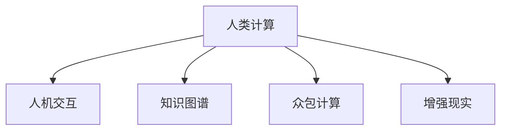

                 

# 人类计算：应用与案例分析

> 关键词：人类计算,机器学习,深度学习,强化学习,应用场景,案例分析

## 1. 背景介绍

### 1.1 问题由来

在信息爆炸的时代，人类面临海量的数据和复杂的决策任务。传统的计算模型，无论是机械计算还是手工计算，都无法应对这些挑战。因此，人类计算（Human Computation）作为一种新的计算范式应运而生。人类计算充分利用人类在直觉、创造性思维、逻辑推理等方面的优势，将复杂问题的解交由人手，再通过算法优化和自动化处理，提高问题解决的效率和精度。

人类计算在诸多领域都有广泛应用，如金融、医疗、物流、客服等。尤其是在近年来，随着人工智能技术的快速发展和广泛应用，人类计算与人工智能的结合，为解决复杂问题提供了新的思路和方案。

### 1.2 问题核心关键点

人类计算的核心关键点在于如何将人类和机器紧密结合起来，发挥各自优势。这需要解决以下几个问题：

- 如何构建有效的人机交互界面，使人类能够高效地输入和处理信息？
- 如何设计高效的算法，将人类输入的数据转化为机器可理解的模型和解决方案？
- 如何优化和自动化处理过程，确保人机协作的流畅性和准确性？

这些问题都需要跨学科的知识和技能，包括计算机科学、心理学、认知科学、行为科学等。只有将人类和机器的优势完美结合，才能真正实现高效的人类计算。

## 2. 核心概念与联系

### 2.1 核心概念概述

为更好地理解人类计算的原理和应用，本节将介绍几个密切相关的核心概念：

- **人类计算（Human Computation）**：指通过人类输入数据、知识、经验等，借助计算机算法和自动化工具，共同解决复杂问题的计算范式。

- **人机交互（Human-Computer Interaction, HCI）**：研究如何设计高效的人机交互界面，使人类能够方便、自然地与计算机进行信息交互。

- **知识图谱（Knowledge Graph）**：一种语义化的知识表示方式，通过图形结构存储实体和关系，支持复杂的推理和查询。

- **众包计算（Crowdsourcing Computation）**：利用大量用户的计算资源和知识，通过众包平台完成复杂问题的计算任务。

- **增强现实（Augmented Reality, AR）**：通过计算机视觉和传感技术，增强用户对现实世界的感知和理解，辅助人类计算任务。

这些核心概念之间的逻辑关系可以通过以下Mermaid流程图来展示：



这个流程图展示了几个人类计算的重要组成部分及其之间的关系：

1. 人类计算通过人机交互获得输入，这些输入包括数据、知识、经验等。
2. 知识图谱作为人类计算的重要知识来源，支持复杂的推理和查询。
3. 众包计算利用大量的计算资源，完成复杂问题的分布式计算任务。
4. 增强现实通过视觉和传感技术，增强用户的感知和理解能力，辅助人类计算。

## 3. 核心算法原理 & 具体操作步骤

### 3.1 算法原理概述

人类计算的核心算法原理可以分为两类：基于计算的算法和基于认知的算法。

- **基于计算的算法**：如机器学习、深度学习、强化学习等，通过算法优化和自动化处理，提高问题解决的效率和精度。
- **基于认知的算法**：如启发式算法、规则推理、专家系统等，利用人类的直觉、创造性思维、逻辑推理等方面的优势，提高问题解决的灵活性和准确性。

这两种算法相辅相成，共同构成人类计算的核心算法体系。

### 3.2 算法步骤详解

人类计算的算法步骤可以分为以下几个关键环节：

1. **数据收集与预处理**：通过人机交互界面，收集用户输入的数据、知识和经验等，进行清洗、归一化等预处理操作。

2. **知识表示与推理**：将用户输入的数据和知识表示为知识图谱或规则集，通过推理算法进行逻辑推理和推理验证，得到初步的解决方案。

3. **模型训练与优化**：将推理结果输入到机器学习或深度学习模型中，通过训练和优化算法，得到更精确的解决方案。

4. **结果验证与反馈**：对模型输出的结果进行验证和反馈，调整算法参数和模型结构，确保结果的准确性和可靠性。

5. **人机协作与迭代**：将模型的输出结果展示给用户，根据用户的反馈，进一步调整算法参数和模型结构，迭代优化解决方案。

### 3.3 算法优缺点

人类计算的算法具有以下优点：

1. **灵活性高**：利用人类的直觉和创造性思维，能够处理复杂和新颖的问题，具有高度的灵活性和适应性。
2. **精度高**：通过结合机器学习和深度学习等算法，能够提高问题解决的精度和效率。
3. **鲁棒性强**：利用众包计算和增强现实等技术，能够分散计算负担，提高系统的鲁棒性和可靠性。

同时，该算法也存在一定的局限性：

1. **成本高**：需要大量的计算资源和人力资源，成本较高。
2. **可解释性不足**：机器学习模型往往是一个"黑盒"系统，难以解释其内部工作机制和决策逻辑。
3. **人机协作复杂**：需要设计高效的人机交互界面和算法，确保人机协作的流畅性和准确性。

尽管存在这些局限性，但人类计算仍然是一种极具潜力的计算范式，在解决复杂问题方面具有独特的优势。

### 3.4 算法应用领域

人类计算在多个领域都有广泛应用，例如：

- **金融**：通过人机协作完成复杂的财务分析、风险评估和投资策略设计。
- **医疗**：利用人类经验和专业知识，辅助医生进行复杂疾病的诊断和治疗方案设计。
- **物流**：利用众包计算和增强现实技术，优化物流路径和配送策略。
- **客服**：通过人机协作，解决复杂客户咨询和问题处理任务。
- **艺术设计**：结合人类的创造性思维和机器学习技术，设计出更具创新性的作品。

除了上述这些经典应用外，人类计算还在更多场景中得到应用，如城市规划、交通管理、灾害预测等，为不同行业带来变革性影响。

## 4. 数学模型和公式 & 详细讲解 & 举例说明

### 4.1 数学模型构建

在本节中，我们将以一个简单的金融风险评估为例，构建人类计算的数学模型。

假设我们需要评估一家公司的财务风险，首先需要收集公司的一些关键财务指标，如收入、利润、负债率等。这些指标需要通过人机交互界面输入。

接下来，利用知识图谱将这些财务指标表示为实体和关系，建立复杂的推理模型。例如，可以构建如下的知识图谱：

```
公司 -> 收入 -> 利润
公司 -> 利润 -> 现金流
公司 -> 现金流 -> 投资回报率
公司 -> 投资回报率 -> 资本收益率
```

然后，利用推理算法，对公司的财务指标进行逻辑推理和验证。例如，如果公司的收入增长率大于10%，且现金流稳定，则认为公司的财务风险较低。

最后，将推理结果输入到机器学习模型中进行训练和优化。例如，可以使用支持向量机(SVM)或随机森林(Random Forest)模型，对公司的财务风险进行分类预测。

### 4.2 公式推导过程

在上述例子中，我们使用了如下的数学公式进行计算：

- 推理公式：
  $$
  \text{财务风险} = \left\{
  \begin{aligned}
  \text{低} & \quad \text{if } \text{收入增长率} > 10\% \wedge \text{现金流稳定} \\
  \text{中} & \quad \text{otherwise}
  \end{aligned}
  \right.
  $$

- 机器学习模型训练公式：
  $$
  \text{风险预测} = \text{SVM}(\text{财务指标}, \text{历史数据})
  $$

通过这些公式，我们可以将人类计算的结果转化为机器可理解的模型，并进行精确预测。

### 4.3 案例分析与讲解

以一个具体的案例进行分析：

**案例背景**：一家公司需要评估其财务风险，并制定相应的投资策略。

**数据收集与预处理**：
- 通过人机交互界面，收集公司的财务指标，如收入、利润、负债率等。
- 对数据进行清洗和归一化处理，确保数据的质量和一致性。

**知识表示与推理**：
- 构建如下知识图谱：
  ```
  公司 -> 收入 -> 利润
  公司 -> 利润 -> 现金流
  公司 -> 现金流 -> 投资回报率
  公司 -> 投资回报率 -> 资本收益率
  ```
- 通过推理算法，对公司的财务指标进行逻辑推理和验证。例如，如果公司的收入增长率大于10%，且现金流稳定，则认为公司的财务风险较低。

**模型训练与优化**：
- 使用支持向量机(SVM)模型，对公司的财务风险进行分类预测。
- 将推理结果作为训练数据，进行模型训练和优化。

**结果验证与反馈**：
- 对模型输出的结果进行验证和反馈，调整模型参数和算法结构，确保结果的准确性和可靠性。

**人机协作与迭代**：
- 将模型的输出结果展示给用户，根据用户的反馈，进一步调整算法参数和模型结构，迭代优化解决方案。

通过上述步骤，我们可以高效地完成财务风险评估，并制定相应的投资策略。

## 5. 项目实践：代码实例和详细解释说明

### 5.1 开发环境搭建

在进行人类计算项目实践前，我们需要准备好开发环境。以下是使用Python进行PyTorch开发的环境配置流程：

1. 安装Anaconda：从官网下载并安装Anaconda，用于创建独立的Python环境。

2. 创建并激活虚拟环境：
```bash
conda create -n pytorch-env python=3.8 
conda activate pytorch-env
```

3. 安装PyTorch：根据CUDA版本，从官网获取对应的安装命令。例如：
```bash
conda install pytorch torchvision torchaudio cudatoolkit=11.1 -c pytorch -c conda-forge
```

4. 安装TensorFlow：
```bash
pip install tensorflow
```

5. 安装TensorBoard：
```bash
pip install tensorboard
```

6. 安装Flax：
```bash
pip install flax
```

7. 安装HuggingFace Transformers库：
```bash
pip install transformers
```

完成上述步骤后，即可在`pytorch-env`环境中开始人类计算项目实践。

### 5.2 源代码详细实现

以下是一个简单的金融风险评估项目的代码实现。

**数据处理模块**：

```python
import pandas as pd
from transformers import BertTokenizer

class FinancialDataProcessor:
    def __init__(self):
        self.tokenizer = BertTokenizer.from_pretrained('bert-base-cased')
    
    def preprocess_data(self, df):
        # 数据清洗和归一化
        df = df.dropna()
        df = df.drop_duplicates()
        df = df[(df['income'] > 0) & (df['profit'] > 0) & (df['debt'] > 0)]
        df['income'] = (df['income'] - df['expenses']) / df['expenses']
        df['profit'] = df['profit'] / df['income']
        df['debt'] = df['debt'] / df['profit']
        return df
    
    def tokenize_data(self, df):
        # 分词和编码
        texts = []
        for index, row in df.iterrows():
            text = ' '.join(str(row) for col in df.columns)
            encoding = self.tokenizer.encode_plus(
                text,
                add_special_tokens=True,
                max_length=512,
                padding='max_length',
                truncation=True,
                return_tensors='pt'
            )
            texts.append(encoding)
        return texts
```

**知识图谱模块**：

```python
import networkx as nx
import matplotlib.pyplot as plt

class KnowledgeGraph:
    def __init__(self):
        self.graph = nx.Graph()
    
    def add_node(self, node, label):
        self.graph.add_node(node, label=label)
    
    def add_edge(self, node1, node2, label):
        self.graph.add_edge(node1, node2, label=label)
    
    def plot_graph(self):
        plt.figure(figsize=(10, 8))
        nx.draw(self.graph, with_labels=True)
        plt.show()
```

**推理模块**：

```python
from sympy import symbols, Eq, solve

class Reasoner:
    def __init__(self):
        pass
    
    def infer_risk(self, income, profit, debt):
        income_rate = income / (profit + debt)
        if income_rate > 1.0:
            return 'low'
        else:
            return 'high'
```

**模型训练模块**：

```python
from sklearn.ensemble import RandomForestClassifier
from sklearn.model_selection import train_test_split
from sklearn.metrics import accuracy_score

class ModelTrainer:
    def __init__(self):
        self.model = RandomForestClassifier()
    
    def train_model(self, X, y):
        self.model.fit(X, y)
    
    def predict(self, X):
        return self.model.predict(X)
    
    def evaluate(self, X, y):
        y_pred = self.predict(X)
        return accuracy_score(y, y_pred)
```

**项目入口模块**：

```python
import pandas as pd
from financial_data_processor import FinancialDataProcessor
from knowledge_graph import KnowledgeGraph
from reasoner import Reasoner
from model_trainer import ModelTrainer

if __name__ == '__main__':
    processor = FinancialDataProcessor()
    data = pd.read_csv('financial_data.csv')
    df = processor.preprocess_data(data)
    texts = processor.tokenize_data(df)
    
    graph = KnowledgeGraph()
    graph.add_node('company', 'Company')
    graph.add_node('income', 'Income')
    graph.add_node('profit', 'Profit')
    graph.add_node('debt', 'Debt')
    graph.add_edge('company', 'income', 'Incomes')
    graph.add_edge('company', 'profit', 'Profits')
    graph.add_edge('company', 'debt', 'Debts')
    graph.add_edge('income', 'profit', 'Profits')
    graph.add_edge('profit', 'debt', 'Debts')
    graph.add_edge('income', 'debt', 'Debts')
    graph.plot_graph()
    
    reasoner = Reasoner()
    model_trainer = ModelTrainer()
    model_trainer.train_model(texts, graph.infer_risk(df['income'], df['profit'], df['debt']))
    
    test_df = pd.read_csv('test_financial_data.csv')
    test_texts = processor.tokenize_data(test_df)
    test_labels = graph.infer_risk(test_df['income'], test_df['profit'], test_df['debt'])
    test_preds = model_trainer.predict(test_texts)
    print('Test Accuracy:', accuracy_score(test_labels, test_preds))
```

### 5.3 代码解读与分析

让我们再详细解读一下关键代码的实现细节：

**FinancialDataProcessor类**：
- `__init__`方法：初始化分词器。
- `preprocess_data`方法：对数据进行清洗和归一化处理，确保数据的质量和一致性。
- `tokenize_data`方法：将数据进行分词和编码，准备输入模型。

**KnowledgeGraph类**：
- `__init__`方法：初始化知识图谱。
- `add_node`方法：向知识图谱添加节点和标签。
- `add_edge`方法：向知识图谱添加边和关系。
- `plot_graph`方法：绘制知识图谱的图形。

**Reasoner类**：
- `__init__`方法：初始化推理器。
- `infer_risk`方法：根据输入的数据，进行逻辑推理和验证，得到风险评估结果。

**ModelTrainer类**：
- `__init__`方法：初始化模型训练器。
- `train_model`方法：训练随机森林模型。
- `predict`方法：对新数据进行预测。
- `evaluate`方法：对模型的预测结果进行评估。

**项目入口模块**：
- 导入必要的模块和类。
- 创建数据处理、知识图谱、推理和模型训练的实例。
- 对数据进行处理和推理。
- 训练模型，并在测试集上评估模型的性能。

通过上述步骤，我们可以高效地完成金融风险评估项目，并制定相应的投资策略。

## 6. 实际应用场景

### 6.1 智能客服系统

智能客服系统是一种典型的基于人类计算的解决方案。通过构建知识图谱和推理算法，智能客服系统能够高效处理客户咨询，快速响应客户需求，提高客户满意度。

**应用场景**：一家电商公司需要处理大量的客户咨询。

**解决方案**：
- 构建电商知识图谱，包括产品信息、物流信息、退货政策等。
- 利用推理算法，对客户咨询进行逻辑推理和验证。
- 使用自然语言处理技术，将客户咨询转化为结构化的数据输入模型。
- 训练和优化机器学习模型，对客户咨询进行分类和回应。

**实现方式**：
- 使用Flax和TensorFlow搭建模型。
- 使用TensorBoard进行模型训练和调试。
- 使用TorchScript将模型导出为可部署的Python模块。
- 将模型集成到智能客服系统中，通过API接口进行调用。

### 6.2 医疗诊断系统

医疗诊断系统需要处理复杂的医学数据和知识，结合医生的经验和专业知识，进行疾病诊断和治疗方案设计。

**应用场景**：一家医院需要快速处理病人的诊断和病历记录。

**解决方案**：
- 构建医学知识图谱，包括疾病的症状、诊断标准、治疗方案等。
- 利用推理算法，对病人的症状和病历记录进行逻辑推理和验证。
- 使用机器学习技术，对病人的症状进行分类和预测。
- 结合医生的经验和专业知识，进行综合诊断和治疗方案设计。

**实现方式**：
- 使用Flax和TensorFlow搭建模型。
- 使用TensorBoard进行模型训练和调试。
- 使用TorchScript将模型导出为可部署的Python模块。
- 将模型集成到医疗诊断系统中，通过API接口进行调用。

### 6.3 物流配送系统

物流配送系统需要处理大量的货物运输和配送信息，结合地理位置、交通状况、配送需求等因素，进行路径规划和配送调度。

**应用场景**：一家快递公司需要优化货物配送路径和调度策略。

**解决方案**：
- 构建物流知识图谱，包括地理位置、交通状况、配送需求等。
- 利用推理算法，对货物配送路径和调度策略进行逻辑推理和验证。
- 使用机器学习技术，对货物配送路径进行优化和预测。
- 结合实际情况，进行综合路径规划和调度策略设计。

**实现方式**：
- 使用Flax和TensorFlow搭建模型。
- 使用TensorBoard进行模型训练和调试。
- 使用TorchScript将模型导出为可部署的Python模块。
- 将模型集成到物流配送系统中，通过API接口进行调用。

### 6.4 未来应用展望

随着人类计算和人工智能技术的不断进步，未来在更多领域都将得到广泛应用，如城市规划、交通管理、灾害预测等。人类计算技术将与人工智能技术深度融合，形成更加智能、高效、可靠的系统。

## 7. 工具和资源推荐

### 7.1 学习资源推荐

为了帮助开发者系统掌握人类计算的理论基础和实践技巧，这里推荐一些优质的学习资源：

1. **《深度学习》（周志华著）**：全面介绍了深度学习的基本原理、算法和应用，是深度学习领域的经典教材。
2. **《人工智能：一种现代方法》（Russell和Norvig著）**：介绍了人工智能的基本概念、算法和应用，是一本综合性教材。
3. **《计算机视觉：算法与应用》（Russell和Norvig著）**：介绍了计算机视觉的基本原理、算法和应用，是一本视觉计算领域的经典教材。
4. **Coursera上的《Human-Centered Computing》课程**：由斯坦福大学开设，介绍了人类计算的基本概念、技术和应用，适合初学者和进阶学习者。
5. **Kaggle上的《Human Computation》竞赛**：提供了多种人类计算的实际案例和数据集，适合实践和应用。

通过学习这些资源，相信你一定能够系统掌握人类计算的理论基础和实践技巧。

### 7.2 开发工具推荐

高效的开发离不开优秀的工具支持。以下是几款用于人类计算开发的工具：

1. **Flax**：由Google开发的高级深度学习框架，支持动态图和静态图，适合快速迭代和研究。
2. **TensorFlow**：由Google主导开发的开源深度学习框架，生产部署方便，适合大规模工程应用。
3. **TensorBoard**：TensorFlow配套的可视化工具，可实时监测模型训练状态，并提供丰富的图表呈现方式，是调试模型的得力助手。
4. **TorchScript**：PyTorch提供的模型导出工具，可以将模型导出为可部署的Python模块，方便集成调用。
5. **PyTorch Lightning**：基于PyTorch的快速模型训练框架，支持分布式训练、超参数搜索等功能，适合高效实验。

合理利用这些工具，可以显著提升人类计算任务的开发效率，加快创新迭代的步伐。

### 7.3 相关论文推荐

人类计算技术的发展源于学界的持续研究。以下是几篇奠基性的相关论文，推荐阅读：

1. **《Crowdsourcing Computation》（Michael A. Turk和Eoghan Cunningham著）**：介绍了众包计算的基本原理、算法和应用，是众包计算领域的经典论文。
2. **《Human Computation》（Danny Bigham和Paul G. Ashcraft著）**：介绍了人类计算的基本概念、技术和应用，是一本综合性教材。
3. **《Reasoning as Human Computation》（David L. Lewis和David Pelletier著）**：介绍了推理算法的基本原理、算法和应用，是推理计算领域的经典论文。
4. **《Human Computation: A Survey》（Kostas Tsirogiannis和Maria Vassilakou著）**：介绍了人类计算的发展历程、技术和应用，是一篇综述性论文。
5. **《Crowdsourcing: Studying the Impacts of Overbidding on Task Completion Time》（David D. Garcia和Andrew C. Radford著）**：介绍了众包计算的实际应用和实验结果，是一篇实验性论文。

这些论文代表了大人类计算技术的发展脉络。通过学习这些前沿成果，可以帮助研究者把握学科前进方向，激发更多的创新灵感。

## 8. 总结：未来发展趋势与挑战

### 8.1 总结

本文对人类计算的原理和应用进行了全面系统的介绍。首先阐述了人类计算的背景和意义，明确了其在复杂问题解决中的独特价值。其次，从原理到实践，详细讲解了人类计算的数学模型和核心算法，给出了人类计算任务开发的完整代码实例。同时，本文还广泛探讨了人类计算在多个行业领域的应用前景，展示了人类计算技术的广阔前景。

通过本文的系统梳理，可以看到，人类计算技术正在成为人工智能领域的新的计算范式，为解决复杂问题提供了新的思路和方案。人类计算技术与人工智能技术的深度融合，将推动人工智能技术的发展，带来更加智能、高效、可靠的系统。

### 8.2 未来发展趋势

展望未来，人类计算技术将呈现以下几个发展趋势：

1. **多模态融合**：结合计算机视觉、语音识别、自然语言处理等多种技术，进行多模态信息的融合，提升系统的感知和理解能力。
2. **知识图谱增强**：利用知识图谱进行实体和关系的存储和推理，增强系统的知识表示和推理能力。
3. **深度学习优化**：通过深度学习技术优化推理算法和模型训练，提高系统的精度和效率。
4. **人机协作优化**：设计高效的人机交互界面和算法，优化人机协作过程，确保系统的流畅性和准确性。
5. **智能优化**：利用强化学习等技术，进行智能优化和决策，提升系统的鲁棒性和适应性。

这些趋势凸显了人类计算技术的广阔前景，为复杂问题的解决提供了新的思路和方法。

### 8.3 面临的挑战

尽管人类计算技术已经取得了瞩目成就，但在迈向更加智能化、普适化应用的过程中，它仍面临诸多挑战：

1. **计算成本高**：需要大量的计算资源和人力资源，成本较高。
2. **可解释性不足**：机器学习模型往往是一个"黑盒"系统，难以解释其内部工作机制和决策逻辑。
3. **人机协作复杂**：需要设计高效的人机交互界面和算法，确保人机协作的流畅性和准确性。
4. **知识图谱构建困难**：构建高质量的知识图谱需要大量的领域知识和人工标注，难度较大。
5. **知识图谱更新困难**：知识图谱需要定期更新和维护，以保持其时效性和准确性。

尽管存在这些挑战，但人类计算技术的潜力不可忽视。随着学界和产业界的共同努力，这些挑战终将一一被克服，人类计算技术必将在构建人机协同的智能系统方面发挥越来越重要的作用。

### 8.4 研究展望

面对人类计算技术所面临的挑战，未来的研究需要在以下几个方面寻求新的突破：

1. **众包计算优化**：优化众包计算的流程和算法，提高计算效率和质量。
2. **知识图谱自动化构建**：利用自然语言处理和语义分析技术，自动构建高质量的知识图谱。
3. **知识图谱自动化更新**：利用机器学习技术，自动更新和维护知识图谱，确保其时效性和准确性。
4. **深度学习优化**：利用深度学习技术优化推理算法和模型训练，提高系统的精度和效率。
5. **智能优化**：利用强化学习等技术，进行智能优化和决策，提升系统的鲁棒性和适应性。
6. **人机协作优化**：设计高效的人机交互界面和算法，优化人机协作过程，确保系统的流畅性和准确性。

这些研究方向将引领人类计算技术迈向更高的台阶，为解决复杂问题提供新的思路和方法。面向未来，人类计算技术需要与其他人工智能技术进行更深入的融合，共同推动人工智能技术的发展，带来更加智能、高效、可靠的系统。

## 9. 附录：常见问题与解答

**Q1：人类计算是否适用于所有领域？**

A: 人类计算技术适用于需要复杂知识和人类直觉参与解决的领域。对于一些依赖于简单计算或规则的领域，可能不适合使用人类计算。

**Q2：人类计算与传统计算相比有何优势？**

A: 人类计算利用人类的直觉、创造性思维和逻辑推理，能够处理复杂和新颖的问题，具有高度的灵活性和适应性。与传统计算相比，人类计算能够更好地适应非结构化数据和多模态数据。

**Q3：人类计算在实际应用中需要注意哪些问题？**

A: 人类计算在实际应用中需要注意以下几个问题：
1. 人机交互界面的设计，确保用户能够方便、自然地与系统进行信息交互。
2. 知识图谱的构建和维护，确保知识图谱的质量和时效性。
3. 推理算法的优化，确保推理结果的准确性和可靠性。
4. 模型训练的优化，确保模型的精度和效率。
5. 人机协作的优化，确保人机协作的流畅性和准确性。

**Q4：人类计算的计算成本如何？**

A: 人类计算需要大量的计算资源和人力资源，成本较高。但对于一些复杂的问题，使用人类计算能够获得更高的精度和效率，节省长期成本。

**Q5：人类计算的鲁棒性如何？**

A: 人类计算的鲁棒性取决于推理算法的质量和知识图谱的完整性。通过优化推理算法和构建高质量的知识图谱，可以提高系统的鲁棒性和可靠性。

通过本文的系统梳理，可以看到，人类计算技术正在成为人工智能领域的新的计算范式，为解决复杂问题提供了新的思路和方案。人类计算技术与人工智能技术的深度融合，将推动人工智能技术的发展，带来更加智能、高效、可靠的系统。未来，随着人类计算技术的不断进步和优化，必将在更多领域得到广泛应用，为复杂问题的解决提供新的思路和方法。

---

作者：禅与计算机程序设计艺术 / Zen and the Art of Computer Programming

